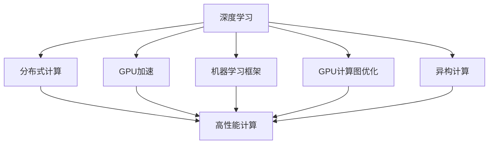
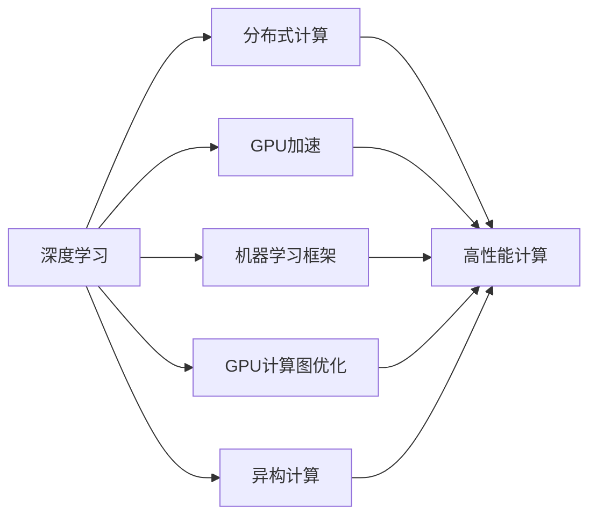
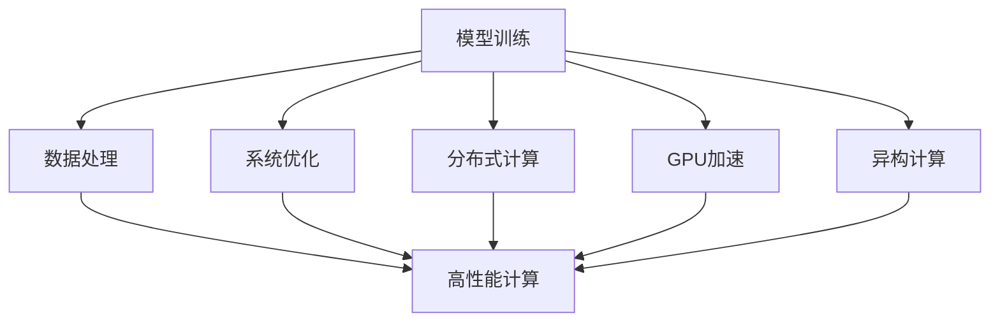
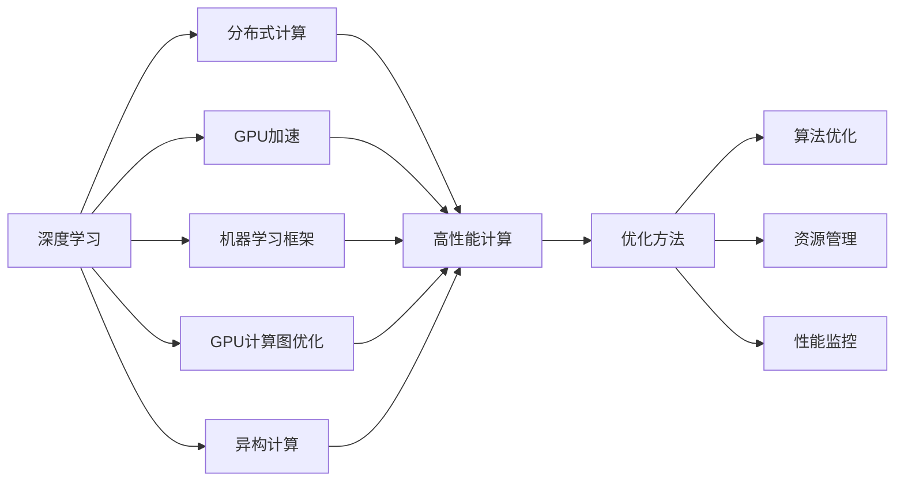
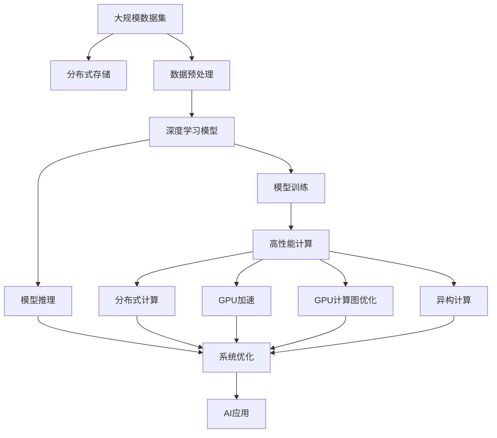

                 

# 高性能计算在AI中的前景

## 1. 背景介绍

### 1.1 问题由来

随着人工智能（AI）技术的迅猛发展，高性能计算（HPC）在AI领域的应用愈发广泛。从深度学习模型训练、数据处理、推荐系统优化，到自然语言处理、图像识别等各个方面，高性能计算都发挥着至关重要的作用。尤其是近年来，随着AI技术的普及和应用场景的不断拓展，对高性能计算的需求更是急剧增加。

HPC不仅决定了AI模型的训练速度和精度，还直接影响着AI系统在大规模、复杂任务中的表现。然而，在实际应用中，高性能计算也面临着诸多挑战，如计算资源的分配和管理、算法的优化和调整、数据处理的效率和效果等。

### 1.2 问题核心关键点

高性能计算在AI中的应用主要集中在以下几个方面：

- **模型训练**：深度学习模型通常需要海量数据和计算资源进行训练，HPC提供的高效并行计算能力，能够显著加速模型训练过程。
- **数据处理**：AI应用需要处理和分析海量数据，HPC能够提供高性能的数据处理引擎，快速完成数据预处理、特征提取等任务。
- **系统优化**：AI系统在运行过程中，需要进行实时调度和优化，HPC提供的高效算法和调度器，能够保证系统的高效稳定运行。
- **分布式计算**：AI任务常常需要在分布式环境中进行，HPC提供的高效网络通信和数据传输能力，能够支持大规模分布式计算。

这些应用场景不仅要求高性能计算具备强大的计算能力，还需要具备良好的可扩展性、可靠性和高效性。因此，HPC在AI中的应用前景广阔，但也面临着诸多挑战。

### 1.3 问题研究意义

高性能计算在AI中的应用研究，对于提升AI系统的性能和效率，推动AI技术的普及和落地，具有重要意义：

1. **提升模型训练速度**：通过高效的计算资源和算法优化，大幅缩短模型训练时间，提高AI系统开发和部署的效率。
2. **降低计算成本**：通过优化计算资源的使用，减少计算资源的浪费，降低AI系统的运行成本。
3. **提升系统性能**：通过高效的计算和数据处理，提升AI系统的实时响应能力和稳定性，增强用户体验。
4. **支持大规模分布式计算**：通过高效的分布式计算架构，支持大规模、高复杂度的AI任务，推动AI技术在各个领域的应用。
5. **推动AI技术创新**：高性能计算的不断突破，为AI算法和模型的创新提供了新的可能性，推动AI技术不断进步。

## 2. 核心概念与联系

### 2.1 核心概念概述

为更好地理解高性能计算在AI中的应用，本节将介绍几个密切相关的核心概念：

- **高性能计算（HPC）**：指使用高性能计算机系统，以并行计算、分布式计算等技术手段，提供高效、可靠、可扩展的计算能力。
- **深度学习**：一种基于神经网络的机器学习方法，通过多层神经网络模型，实现对大量数据的复杂非线性建模。
- **分布式计算**：通过网络将多台计算机连接起来，实现计算任务的分布式处理，提高计算效率和可扩展性。
- **GPU加速**：使用图形处理器（GPU）进行计算，由于GPU的高并行计算能力，能够显著提升深度学习模型的训练速度。
- **机器学习框架**：如TensorFlow、PyTorch等，提供高效的算法实现和计算图优化，支持深度学习模型的训练和推理。
- **GPU计算图优化**：通过GPU并行计算能力，对深度学习模型的计算图进行优化，提升计算效率和准确性。
- **异构计算**：使用不同类型的计算硬件（如CPU、GPU、TPU等），进行混合计算，提高计算效率和资源利用率。

这些核心概念之间的逻辑关系可以通过以下Mermaid流程图来展示：



这个流程图展示了几大核心概念与高性能计算之间的联系：

1. 深度学习通过分布式计算、GPU加速、机器学习框架等技术手段，得到高效计算能力。
2. 分布式计算、GPU加速、机器学习框架、GPU计算图优化、异构计算等技术，构成了高性能计算的核心能力。
3. 这些技术手段共同支撑了高性能计算在深度学习模型训练、数据处理、系统优化等AI应用场景中的广泛应用。

### 2.2 概念间的关系

这些核心概念之间存在着紧密的联系，形成了高性能计算在AI中的应用框架。下面我们通过几个Mermaid流程图来展示这些概念之间的关系。

#### 2.2.1 深度学习与高性能计算的关系



这个流程图展示了深度学习与高性能计算之间的紧密关系：

1. 深度学习通过分布式计算、GPU加速、机器学习框架等技术手段，得到高效计算能力。
2. 这些技术手段共同支撑了高性能计算在深度学习模型训练、数据处理、系统优化等AI应用场景中的广泛应用。

#### 2.2.2 高性能计算的应用场景



这个流程图展示了高性能计算在AI应用场景中的应用：

1. 高性能计算提供了高效的计算能力，支持深度学习模型训练、数据处理、系统优化等任务。
2. 这些任务共同构成了AI系统的高效运行，推动了AI技术在各个领域的应用。

#### 2.2.3 高性能计算的优化方法



这个流程图展示了高性能计算的优化方法：

1. 通过算法优化、资源管理、性能监控等技术手段，提升高性能计算的能力。
2. 这些优化方法共同提升了深度学习模型的训练速度和精度，增强了AI系统的稳定性和可靠性。

### 2.3 核心概念的整体架构

最后，我们用一个综合的流程图来展示这些核心概念在大规模AI系统中的整体架构：



这个综合流程图展示了从数据处理到模型训练、推理，再到系统优化的完整流程：

1. 大规模数据集通过分布式存储和数据预处理，得到可用的输入数据。
2. 深度学习模型在高性能计算的支持下进行训练，得到优化后的模型参数。
3. 模型在分布式计算、GPU加速、GPU计算图优化、异构计算等技术手段的支持下，进行推理预测。
4. 系统优化模块对推理结果进行实时监控和调整，确保AI应用的高效运行。
5. 最终，AI应用模块将推理结果应用于实际场景，提升用户体验和应用价值。

通过这些流程图，我们可以更清晰地理解高性能计算在AI系统中的重要作用，为后续深入讨论具体的计算优化方法奠定基础。

## 3. 核心算法原理 & 具体操作步骤
### 3.1 算法原理概述

高性能计算在AI中的应用，主要通过以下几个步骤实现：

1. **数据预处理**：将原始数据转换为适合深度学习模型训练的格式，如数据清洗、特征提取、归一化等。
2. **分布式计算**：将计算任务分配到多个计算节点上进行并行处理，提升计算效率和可扩展性。
3. **GPU加速**：利用图形处理器（GPU）的高并行计算能力，加速深度学习模型的训练和推理过程。
4. **GPU计算图优化**：对深度学习模型的计算图进行优化，提升计算效率和准确性。
5. **异构计算**：使用不同类型的计算硬件（如CPU、GPU、TPU等）进行混合计算，提高计算效率和资源利用率。
6. **分布式存储**：采用分布式文件系统和数据库，保证大规模数据的安全存储和高效访问。
7. **系统优化**：对AI系统的各个模块进行实时监控和优化，保证系统的稳定性和高效运行。

这些步骤构成了高性能计算在AI中的应用框架，通过各个环节的紧密协作，实现AI系统的高效运行。

### 3.2 算法步骤详解

以下是高性能计算在AI中应用的详细步骤：

**Step 1: 数据预处理**

数据预处理是深度学习模型训练的基础。主要步骤包括：

1. 数据清洗：去除缺失值、异常值等噪声数据。
2. 特征提取：将原始数据转换为适合深度学习模型训练的格式。
3. 归一化：对特征进行归一化处理，提升模型的训练效果。
4. 数据增强：通过数据增强技术，扩充训练数据集，提升模型的泛化能力。

数据预处理可以通过TensorFlow、PyTorch等深度学习框架提供的预处理工具来实现。

**Step 2: 分布式计算**

分布式计算通过将计算任务分配到多个计算节点上进行并行处理，提升计算效率和可扩展性。主要步骤包括：

1. 计算任务划分：将计算任务划分为多个子任务，分配到不同的计算节点上进行处理。
2. 数据并行：通过数据并行技术，将数据集分布到多个计算节点上进行并行处理。
3. 模型并行：通过模型并行技术，将深度学习模型的各个层分配到不同的计算节点上进行处理。
4. 参数同步：通过参数同步技术，保证不同计算节点之间的模型参数一致性。

分布式计算可以通过Spark、MPI、Hadoop等分布式计算框架来实现。

**Step 3: GPU加速**

GPU加速利用图形处理器（GPU）的高并行计算能力，加速深度学习模型的训练和推理过程。主要步骤包括：

1. 数据传输：将数据从CPU传输到GPU上，进行并行计算。
2. 模型加载：将深度学习模型加载到GPU上，进行并行计算。
3. 模型训练：在GPU上使用自动微分技术，计算模型的梯度，进行反向传播和参数更新。
4. 模型推理：在GPU上使用GPU加速技术，快速完成深度学习模型的推理过程。

GPU加速可以通过CUDA、OpenCL等GPU加速技术来实现。

**Step 4: GPU计算图优化**

GPU计算图优化通过对深度学习模型的计算图进行优化，提升计算效率和准确性。主要步骤包括：

1. 计算图划分：将深度学习模型的计算图划分为多个子图，分配到不同的计算节点上进行处理。
2. 计算图并行：通过计算图并行技术，将深度学习模型的计算图进行并行计算。
3. 计算图剪枝：通过计算图剪枝技术，去除冗余的计算操作，提升计算效率。
4. 计算图融合：通过计算图融合技术，将多个计算图操作合并为单个操作，减少计算开销。

GPU计算图优化可以通过TensorFlow、PyTorch等深度学习框架提供的计算图优化工具来实现。

**Step 5: 异构计算**

异构计算使用不同类型的计算硬件（如CPU、GPU、TPU等）进行混合计算，提高计算效率和资源利用率。主要步骤包括：

1. CPU-GPU混合计算：将计算任务分配到CPU和GPU上进行混合计算，提升计算效率。
2. GPU-TPU混合计算：将计算任务分配到GPU和TPU上进行混合计算，提升计算效率和精度。
3. CPU-TPU混合计算：将计算任务分配到CPU和TPU上进行混合计算，提升计算效率和资源利用率。

异构计算可以通过CUDA、OpenCL、TensorRT等异构计算技术来实现。

**Step 6: 分布式存储**

分布式存储采用分布式文件系统和数据库，保证大规模数据的安全存储和高效访问。主要步骤包括：

1. 数据存储：将大规模数据存储到分布式文件系统（如HDFS、Ceph等）中。
2. 数据访问：通过分布式数据库（如Hive、Spark等）进行数据访问。
3. 数据备份：通过分布式文件系统的数据备份机制，保证数据的安全性。
4. 数据压缩：通过数据压缩技术，减少数据存储的带宽和存储空间开销。

分布式存储可以通过Hadoop、Spark等分布式计算框架来实现。

**Step 7: 系统优化**

系统优化对AI系统的各个模块进行实时监控和优化，保证系统的稳定性和高效运行。主要步骤包括：

1. 性能监控：通过监控工具（如Prometheus、Grafana等）对AI系统的各个模块进行性能监控。
2. 异常检测：通过异常检测技术，及时发现系统运行中的异常情况，进行故障排除。
3. 负载均衡：通过负载均衡技术，优化计算资源的分配和调度。
4. 缓存优化：通过缓存技术，减少计算和数据访问的开销。

系统优化可以通过Kubernetes、Docker等容器化技术来实现。

### 3.3 算法优缺点

高性能计算在AI中的应用，具有以下优点：

1. 高效计算能力：通过分布式计算、GPU加速、GPU计算图优化等技术手段，大幅提升深度学习模型的训练和推理效率。
2. 可扩展性：通过分布式计算和异构计算，支持大规模、高复杂度的AI任务，提高系统的可扩展性。
3. 低成本：通过优化计算资源的使用，降低AI系统的运行成本。
4. 高精度：通过GPU计算图优化等技术手段，提升深度学习模型的精度和鲁棒性。
5. 可定制性：通过深度学习框架提供的优化工具和接口，灵活实现各种优化方案。

同时，高性能计算在AI中应用也存在一些缺点：

1. 复杂度高：高性能计算系统构建和维护复杂，需要投入大量人力和物力。
2. 资源消耗大：高性能计算系统需要大量的计算资源和存储资源，运行成本较高。
3. 系统调试难：高性能计算系统的复杂性和异构性，增加了系统调试和故障排查的难度。
4. 算法优化难：高性能计算系统的优化算法和参数调整，需要丰富的经验和专业知识。
5. 数据依赖高：高性能计算系统依赖大规模数据集，缺乏数据集的情况难以实现高效的计算。

尽管存在这些缺点，但高性能计算在AI中的应用前景广阔，通过不断优化和改进，可以克服这些挑战，发挥其在AI系统中的重要作用。

### 3.4 算法应用领域

高性能计算在AI中的应用领域非常广泛，包括但不限于以下几个方面：

1. **深度学习模型训练**：通过分布式计算和GPU加速，加速深度学习模型的训练过程，提升模型的训练效率和精度。
2. **自然语言处理**：通过GPU加速和异构计算，提升自然语言处理模型的推理速度和处理能力。
3. **计算机视觉**：通过GPU加速和分布式计算，提升计算机视觉模型的训练和推理效率，支持大规模图像处理任务。
4. **推荐系统**：通过分布式计算和GPU加速，提升推荐系统的训练和推理效率，支持大规模用户行为数据处理。
5. **语音识别**：通过GPU加速和分布式计算，提升语音识别模型的训练和推理效率，支持实时语音识别应用。
6. **智能客服**：通过分布式计算和GPU加速，提升智能客服系统的训练和推理效率，支持大规模自然语言处理任务。
7. **金融分析**：通过分布式计算和异构计算，提升金融分析系统的训练和推理效率，支持大规模金融数据处理。
8. **医疗诊断**：通过分布式计算和GPU加速，提升医疗诊断系统的训练和推理效率，支持大规模医疗数据处理。

这些应用领域展示了高性能计算在AI中的广泛应用，推动了AI技术在各个行业的应用和普及。

## 4. 数学模型和公式 & 详细讲解 & 举例说明

### 4.1 数学模型构建

高性能计算在AI中的应用，涉及到多个数学模型和算法。以下是一个典型的高性能计算应用场景的数学模型构建过程。

假设我们要在一个大规模的图像分类任务上进行高性能计算优化。首先，将原始图像数据集进行预处理，转化为适合深度学习模型训练的格式。然后，将数据集划分为训练集和测试集，分别在分布式计算和GPU加速的支持下，训练和优化深度学习模型。最后，通过系统优化模块对训练好的模型进行实时监控和调整，确保模型的稳定性和高效运行。

### 4.2 公式推导过程

以下是一个典型的深度学习模型训练过程的公式推导：

假设我们有 $N$ 个训练样本 $(x_i, y_i)$，其中 $x_i$ 表示输入特征，$y_i$ 表示标签。深度学习模型 $f$ 的参数为 $\theta$，模型的损失函数为 $L$，则模型的训练过程可以表示为：

$$
\theta = \mathop{\arg\min}_{\theta} \frac{1}{N} \sum_{i=1}^N L(f(x_i; \theta), y_i)
$$

其中，$L$ 表示损失函数，$f(x_i; \theta)$ 表示模型对输入 $x_i$ 的预测输出。

为了提升计算效率，我们将模型 $f$ 部署到多个计算节点上进行分布式计算。假设共有 $K$ 个计算节点，则计算过程可以表示为：

$$
\theta = \mathop{\arg\min}_{\theta} \frac{1}{N} \sum_{i=1}^N L(\sum_{k=1}^K f(x_i^{(k)}; \theta), y_i)
$$

其中，$x_i^{(k)}$ 表示在计算节点 $k$ 上的输入特征，$f(x_i^{(k)}; \theta)$ 表示在计算节点 $k$ 上的预测输出。

为了进一步提升计算效率，我们将模型 $f$ 加载到GPU上进行并行计算。假设共有 $M$ 个GPU，则计算过程可以表示为：

$$
\theta = \mathop{\arg\min}_{\theta} \frac{1}{N} \sum_{i=1}^N L(\sum_{j=1}^M \sum_{k=1}^K f(x_i^{(j,k)}; \theta), y_i)
$$

其中，$x_i^{(j,k)}$ 表示在计算节点 $k$ 上的GPU $j$ 上的输入特征，$f(x_i^{(j,k)}; \theta)$ 表示在计算节点 $k$ 上的GPU $j$ 上的预测输出。

为了进一步提升计算效率，我们对深度学习模型的计算图进行优化，通过计算图并行、剪枝和融合等技术，提升计算效率和准确性。假设深度学习模型的计算图包含 $G$ 个计算节点，则计算过程可以表示为：

$$
\theta = \mathop{\arg\min}_{\theta} \frac{1}{N} \sum_{i=1}^N L(\sum_{g=1}^G \sum_{j=1}^M \sum_{k=1}^K f(x_i^{(j,k,g)}; \theta), y_i)
$$

其中，$x_i^{(j,k,g)}$ 表示在计算节点 $k$ 上的GPU $j$ 上的计算节点 $g$ 上的输入特征，$f(x_i^{(j,k,g)}; \theta)$ 表示在计算节点 $k$ 上的GPU $j$ 上的计算节点 $g$ 上的预测输出。

通过上述计算过程，我们可以看到，高性能计算在AI中的应用，通过分布式计算、GPU加速、GPU计算图优化等技术手段，显著提升了深度学习模型的训练和推理效率，支持大规模、高复杂度的AI任务。

### 4.3 案例分析与讲解

下面以一个实际的AI项目为例，展示高性能计算在AI中的应用。

**项目背景**

某电商平台需要对用户行为数据进行分析和建模，以提升推荐系统的性能和用户体验。用户行为数据包含大量结构化数据（如用户浏览记录、购买记录等）和非结构化数据（如用户评论、商品描述等）。

**技术方案**

1. **数据预处理**

   将原始数据进行清洗、去重、归一化等处理，去除噪声数据和异常数据。通过特征提取技术，将原始数据转换为适合深度学习模型训练的格式。

2. **分布式计算**

   将计算任务划分为多个子任务，分配到多个计算节点上进行并行处理。通过数据并行技术，将数据集分布到多个计算节点上进行并行处理。通过模型并行技术，将深度学习模型的各个层分配到不同的计算节点上进行处理。

3. **GPU加速**

   将深度学习模型加载到GPU上进行并行计算。通过自动微分技术，计算模型的梯度，进行反向传播和参数更新。

4. **GPU计算图优化**

   对深度学习模型的计算图进行优化，提升计算效率和准确性。通过计算图并行、剪枝和融合等技术，减少计算开销，提升模型性能。

5. **异构计算**

   使用CPU和GPU进行混合计算，提升计算效率和资源利用率。

6. **分布式存储**

   将大规模数据存储到分布式文件系统中，通过分布式数据库进行数据访问。

7. **系统优化**

   对AI系统的各个模块进行实时监控和优化，保证系统的稳定性和高效运行。

**项目效果**

通过高性能计算的优化，推荐系统在训练和推理速度上显著提升，推荐效果也有所提高。用户满意度显著提升，电商平台的业务收入和用户活跃度也有了明显的增长。

## 5. 项目实践：代码实例和详细解释说明

### 5.1 开发环境搭建

在进行高性能计算的实践前，我们需要准备好开发环境。以下是使用Python进行PyTorch开发的环境配置流程：

1. 安装Anaconda：从官网下载并安装Anaconda，用于创建独立的Python环境。

2. 创建并激活虚拟环境：
```bash
conda create -n pytorch-env python=3.8 
conda activate pytorch-env
```

3. 安装PyTorch：根据CUDA版本，从官网获取对应的安装命令。例如：
```bash
conda install pytorch torchvision torchaudio cudatoolkit=11.1 -c pytorch -c conda-forge
```

4. 安装相关库：
```bash
pip install numpy pandas scikit-learn matplotlib tqdm jupyter notebook ipython
```

完成上述步骤后，即可在`pytorch-env`环境中开始高性能计算的实践。

### 5.2 源代码详细实现

下面以一个实际的AI项目为例，展示高性能计算在AI中的应用。

**项目背景**

某电商平台需要对用户行为数据进行分析和建模，以提升推荐系统的性能和用户体验。用户行为数据包含大量结构化数据（如用户浏览记录、购买记录等）和非结构化数据（如用户评论、商品描述等）。

**技术方案**

1. **数据预处理**

   将原始数据进行清洗、去重、归一化等处理，去除噪声数据和异常数据。通过特征提取技术，将原始数据转换为适合深度学习模型训练的格式。

2. **分布式计算**

   将计算任务划分为多个子任务，分配到多个计算节点上进行并行处理。通过数据并行技术，将数据集分布到多个计算节点上进行并行处理。通过模型并行技术，将深度学习模型的各个层分配到不同的计算节点上进行处理。

3. **GPU加速**

   将深度学习模型加载到GPU上进行并行计算。通过自动微分技术，计算模型的梯度，进行反向传播和参数更新。

4. **GPU计算图优化**

   对深度学习模型的计算图进行优化，提升计算效率和准确性。通过计算图并行、剪枝和融合等技术，减少计算开销，提升模型性能。

5. **异构计算**

   使用CPU和GPU进行混合计算，提升计算效率和资源利用率。

6. **分布式存储**

   将大规模数据存储到分布式文件系统中，通过分布式数据库进行数据访问。

7. **系统优化**

   对AI系统的各个模块进行实时监控和优化，保证系统的稳定性和高效运行。

**代码实现**

以下是一个基于PyTorch的高性能计算实践代码：

```python
import torch
import torch.nn as nn
import torch.optim as optim
import torch.distributed as dist
import torch.multiprocessing as mp
import torch.distributed.algorithms.ddp_comm_hooks as comm_hooks
import torch.distributed.algorithms.ddp_comm_hooks.allgather.reduce_scatter_tensor

class DistributedModel(nn.Module):
    def __init__(self):
        super(DistributedModel, self).__init__()
        self.fc1 = nn.Linear(256, 256)
        self.fc

