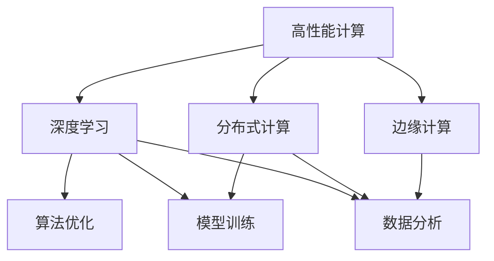
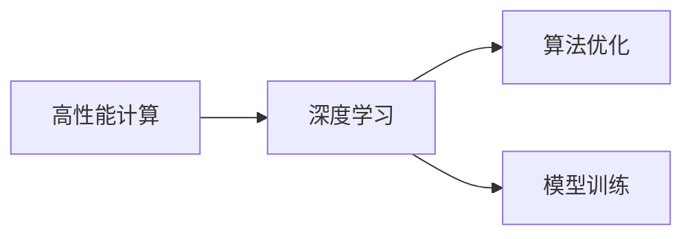
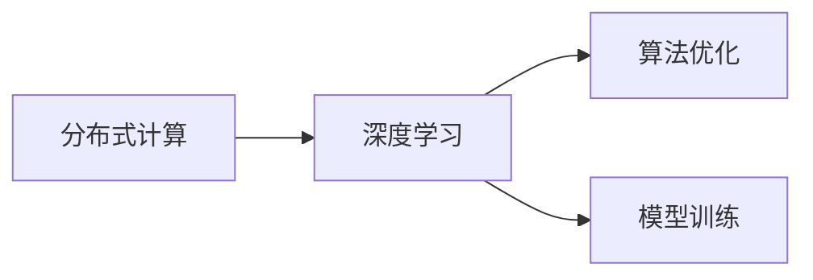
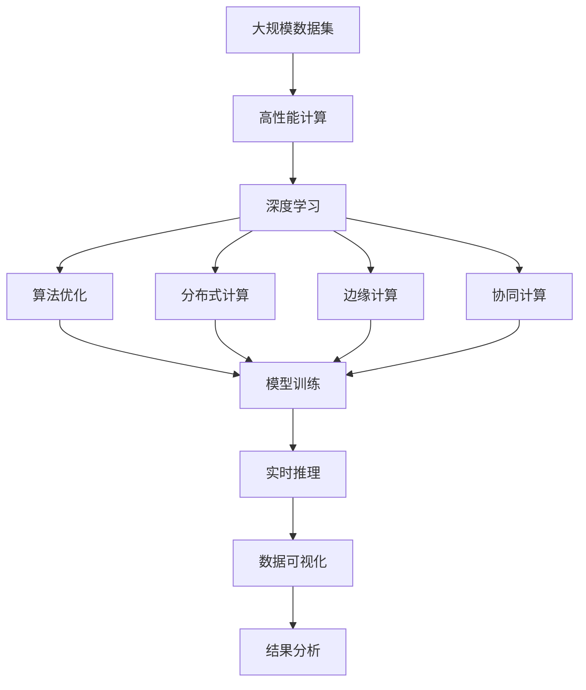

                 

# 高性能计算在AI创新体系中的应用

## 1. 背景介绍

### 1.1 问题由来
随着人工智能(AI)技术的不断演进，高性能计算在AI创新体系中的作用日益凸显。高性能计算通过提供强大的计算能力和存储容量，为AI算法的设计、训练和优化提供了坚实的技术支撑。尤其是在深度学习、计算机视觉、自然语言处理等领域的创新和应用中，高性能计算成为不可或缺的重要资源。本文将深入探讨高性能计算在AI创新体系中的应用，详细分析其在算法优化、模型训练、数据分析等方面的关键作用。

### 1.2 问题核心关键点
高性能计算在AI创新体系中的应用，主要围绕以下几个关键点展开：
1. **算法优化**：高性能计算提供了高并行性的计算能力，使得复杂的AI算法能够快速迭代和优化。
2. **模型训练**：大规模深度学习模型的训练需要巨大的计算资源和存储空间，高性能计算可以高效地完成这一任务。
3. **数据分析**：大数据集的处理和分析需要高效的并行计算框架，高性能计算加速了数据预处理和特征提取。
4. **边缘计算**：在物联网、自动驾驶等场景下，高性能计算能够实现实时数据处理和模型推理，提升系统的响应速度和效率。
5. **协同计算**：分布式高性能计算平台支持多节点协同训练，提升算法的可扩展性和鲁棒性。

### 1.3 问题研究意义
高性能计算在AI创新体系中的应用，对于推动AI技术的快速发展具有重要意义：
1. **提升计算效率**：通过高性能计算，AI算法可以在更短的时间内迭代优化，加速技术进步。
2. **增强模型性能**：大规模深度学习模型的训练需要大量计算资源，高性能计算可以显著提升模型的精度和鲁棒性。
3. **优化数据处理**：大数据集的高效处理和分析，依赖于高性能计算框架，为AI技术提供了强大的数据支撑。
4. **支持边缘计算**：高性能计算能够实现实时数据处理和模型推理，推动边缘计算技术的发展。
5. **促进协同创新**：分布式高性能计算平台支持多学科、多团队协作，加速AI技术的交叉创新。

## 2. 核心概念与联系

### 2.1 核心概念概述

高性能计算在AI创新体系中应用的核心概念包括：
1. **高性能计算**：指使用高性能计算机系统（如超级计算机、分布式集群）进行高并行性的计算。
2. **深度学习**：一种基于神经网络的机器学习算法，通过大量数据训练，实现复杂模式的识别和预测。
3. **分布式计算**：通过多台计算机的协同计算，实现大规模数据处理和模型训练。
4. **边缘计算**：在设备端（如智能设备、车辆、传感器等）进行实时数据处理和模型推理，减少数据传输和延迟。
5. **协同计算**：多节点、多学科、多团队协作的计算模式，推动AI技术的交叉创新。

这些核心概念之间的逻辑关系可以通过以下Mermaid流程图来展示：



这个流程图展示了大语言模型微调过程中各个核心概念之间的关系：

1. 高性能计算为深度学习和分布式计算提供硬件基础。
2. 深度学习算法通过高性能计算优化和训练。
3. 数据分析依赖高性能计算的高效处理能力。
4. 边缘计算通过高性能计算实现实时数据处理。
5. 协同计算通过高性能计算支持多学科、多团队协作。

### 2.2 概念间的关系

这些核心概念之间存在着紧密的联系，形成了高性能计算在AI创新体系中的完整生态系统。下面我们通过几个Mermaid流程图来展示这些概念之间的关系。

#### 2.2.1 高性能计算与深度学习



这个流程图展示了高性能计算在深度学习算法优化和模型训练中的关键作用。

#### 2.2.2 分布式计算与模型训练



这个流程图展示了分布式计算在深度学习算法优化和模型训练中的作用。

#### 2.2.3 边缘计算与实时推理


这个流程图展示了边缘计算在深度学习实时推理中的应用。

#### 2.2.4 协同计算与多学科协作


这个流程图展示了协同计算在多学科协作中的作用。

### 2.3 核心概念的整体架构

最后，我们用一个综合的流程图来展示这些核心概念在大语言模型微调过程中的整体架构：



这个综合流程图展示了从大规模数据集到实时推理的全流程，高性能计算在其中扮演着重要角色。

## 3. 核心算法原理 & 具体操作步骤

### 3.1 算法原理概述

高性能计算在AI创新体系中的应用，主要基于以下原理：
1. **并行计算**：高性能计算机通过多核CPU、GPU、FPGA等硬件加速，实现高并行性的计算。
2. **分布式计算**：利用多台计算机协同计算，实现大规模数据处理和模型训练。
3. **异步计算**：通过异步计算技术，优化并行任务调度和资源利用，提升计算效率。
4. **内存管理**：采用先进的数据管理技术和内存优化策略，减少数据传输和计算延迟。
5. **算法优化**：利用高效的算法库和框架，加速深度学习、机器学习等AI算法的设计和优化。

### 3.2 算法步骤详解

高性能计算在AI创新体系中的应用，一般包括以下几个关键步骤：

**Step 1: 数据预处理和准备**
- 收集和整理大规模数据集，进行清洗和特征提取。
- 将数据集划分为训练集、验证集和测试集，确保数据集的分布和多样性。
- 使用高性能计算平台对数据集进行并行处理和存储。

**Step 2: 算法设计和优化**
- 选择合适的深度学习框架和算法库，如TensorFlow、PyTorch、MXNet等。
- 设计高效的算法模型，并进行超参数调优。
- 利用高性能计算平台的并行计算和分布式计算能力，加速算法的设计和优化。

**Step 3: 模型训练和优化**
- 使用高性能计算平台进行模型训练，并行计算和分布式计算加速训练过程。
- 利用异步计算技术和内存优化策略，提升模型训练效率。
- 在模型训练过程中，定期在验证集上评估模型性能，进行模型优化和调整。

**Step 4: 模型部署和应用**
- 将训练好的模型部署到高性能计算平台或边缘计算设备上，进行实时推理。
- 利用高性能计算平台的并行计算和分布式计算能力，提升模型的推理速度和响应速度。
- 在实际应用中，不断收集反馈数据，进行模型的微调和优化。

### 3.3 算法优缺点

高性能计算在AI创新体系中的应用，具有以下优点：
1. **计算效率高**：通过并行计算和分布式计算，提升计算效率，缩短算法优化和模型训练的时间。
2. **资源利用率高**：高性能计算平台能够高效利用计算资源，避免资源浪费。
3. **算法优化能力强**：利用高效的算法库和框架，加速深度学习、机器学习等AI算法的设计和优化。
4. **实时响应性好**：在边缘计算和实时推理中，利用高性能计算平台实现快速数据处理和模型推理。

同时，高性能计算也存在一些局限性：
1. **硬件成本高**：高性能计算硬件成本较高，需要投入大量资金。
2. **技术门槛高**：高性能计算技术复杂，需要专业知识和技术积累。
3. **数据传输延迟**：在分布式计算中，数据传输和通信延迟可能影响计算效率。
4. **可扩展性受限**：一些高性能计算平台可能存在扩展性受限的问题。

### 3.4 算法应用领域

高性能计算在AI创新体系中的应用，涵盖以下几个主要领域：

**1. 深度学习**
高性能计算在深度学习中主要应用于算法优化、模型训练和实时推理。通过并行计算和分布式计算，加速深度学习算法的迭代优化和模型训练。

**2. 计算机视觉**
高性能计算在计算机视觉中主要应用于图像处理、特征提取和物体识别。利用高性能计算平台的计算能力，加速图像处理和特征提取的计算过程，提升物体识别的准确率。

**3. 自然语言处理**
高性能计算在自然语言处理中主要应用于语言模型训练、文本分类和信息抽取。通过并行计算和分布式计算，加速语言模型的训练和优化，提升文本分类和信息抽取的效率和准确率。

**4. 机器学习**
高性能计算在机器学习中主要应用于特征工程、模型选择和模型优化。利用高性能计算平台的计算能力，加速特征工程和模型选择的计算过程，提升模型优化的效率和效果。

**5. 大数据分析**
高性能计算在大数据分析中主要应用于数据清洗、数据挖掘和数据可视化。利用高性能计算平台的计算能力，加速数据清洗和数据挖掘的计算过程，提升数据可视化的速度和质量。

**6. 边缘计算**
高性能计算在边缘计算中主要应用于实时数据处理和模型推理。通过边缘计算设备的高性能计算能力，实现实时数据处理和模型推理，提升系统的响应速度和效率。

**7. 协同计算**
高性能计算在协同计算中主要应用于多学科、多团队协作。利用高性能计算平台的分布式计算能力，支持多学科、多团队协作，推动AI技术的交叉创新。

## 4. 数学模型和公式 & 详细讲解 & 举例说明

### 4.1 数学模型构建

高性能计算在AI创新体系中的应用，涉及以下数学模型：
1. **深度学习模型**：神经网络模型，包括卷积神经网络(CNN)、循环神经网络(RNN)、变分自编码器(VAE)等。
2. **分布式计算模型**：MapReduce、Spark等分布式计算框架，支持大规模数据处理和模型训练。
3. **边缘计算模型**：移动计算平台和传感器网络，支持实时数据处理和模型推理。
4. **协同计算模型**：分布式系统模型，支持多学科、多团队协作。

### 4.2 公式推导过程

以下是几个关键模型的公式推导过程：

**深度学习模型**
卷积神经网络(CNN)的基本公式为：
$$
f(x; \theta) = \sum_{i=1}^n \sum_{j=1}^m w_{i,j} x_{i,j} + b
$$
其中 $x$ 为输入数据，$w$ 为卷积核参数，$b$ 为偏置项。

**分布式计算模型**
MapReduce模型基本公式为：
$$
Map(\text{input}) \rightarrow \text{Intermediate Data} \rightarrow Reduce(\text{Intermediate Data}) \rightarrow \text{Output}
$$
其中 $\text{input}$ 为输入数据，$\text{Intermediate Data}$ 为中间数据，$\text{Output}$ 为输出结果。

**边缘计算模型**
移动计算平台的基本公式为：
$$
\text{Output} = f(x; \theta)
$$
其中 $x$ 为输入数据，$f$ 为计算函数，$\theta$ 为计算参数。

**协同计算模型**
分布式系统模型基本公式为：
$$
\text{Output} = \sum_{i=1}^n \text{Task}_i
$$
其中 $\text{Task}_i$ 为第 $i$ 个节点的计算任务，$\text{Output}$ 为最终结果。

### 4.3 案例分析与讲解

以深度学习模型为例，高性能计算在模型训练和优化中的具体应用场景如下：

**案例一：大规模深度学习模型训练**
假设有一张尺寸为 $1024 \times 1024$ 的高分辨率图像，使用卷积神经网络(CNN)进行训练，模型的参数数量为 $10^6$。使用高性能计算平台，可以实现并行计算和分布式计算，将训练过程划分为多个并行任务，每个任务处理一部分数据，加速训练过程。具体实现如下：

```python
import tensorflow as tf
from tensorflow.keras.datasets import cifar10
from tensorflow.keras.models import Sequential
from tensorflow.keras.layers import Conv2D, MaxPooling2D, Flatten, Dense

# 加载数据集
(x_train, y_train), (x_test, y_test) = cifar10.load_data()

# 定义模型
model = Sequential()
model.add(Conv2D(32, (3, 3), activation='relu', input_shape=(32, 32, 3)))
model.add(MaxPooling2D((2, 2)))
model.add(Conv2D(64, (3, 3), activation='relu'))
model.add(MaxPooling2D((2, 2)))
model.add(Conv2D(64, (3, 3), activation='relu'))
model.add(MaxPooling2D((2, 2)))
model.add(Flatten())
model.add(Dense(64, activation='relu'))
model.add(Dense(10, activation='softmax'))

# 编译模型
model.compile(optimizer='adam', loss='categorical_crossentropy', metrics=['accuracy'])

# 使用高性能计算平台进行训练
with tf.distribute.MirroredStrategy() as strategy:
    with strategy.scope():
        model.fit(x_train, y_train, epochs=10, batch_size=64)
```

在上述代码中，使用了TensorFlow的分布式计算框架，通过MirroredStrategy策略，将模型并行化到多个GPU上，加速模型训练过程。

**案例二：实时图像处理**
假设有一个摄像头实时采集视频流，使用卷积神经网络(CNN)进行实时图像分类。使用高性能计算平台，可以实现实时数据处理和模型推理，提升系统的响应速度和效率。具体实现如下：

```python
import cv2
import numpy as np
import tensorflow as tf

# 加载模型
model = tf.keras.models.load_model('model.h5')

# 定义摄像头
cap = cv2.VideoCapture(0)

while True:
    # 读取摄像头数据
    ret, frame = cap.read()
    
    # 预处理数据
    frame = cv2.resize(frame, (32, 32))
    frame = frame / 255.0
    frame = np.expand_dims(frame, axis=0)
    
    # 进行推理
    result = model.predict(frame)
    label = id2label[int(result[0][0])]
    
    # 显示结果
    cv2.putText(frame, label, (10, 30), cv2.FONT_HERSHEY_SIMPLEX, 1, (0, 255, 0), 2)
    cv2.imshow('frame', frame)
    
    if cv2.waitKey(1) & 0xFF == ord('q'):
        break

# 释放摄像头和模型
cap.release()
model.dispose()
cv2.destroyAllWindows()
```

在上述代码中，使用了OpenCV库进行摄像头数据的实时采集和处理，使用TensorFlow的高性能计算平台进行模型推理，实现了实时图像分类。

## 5. 项目实践：代码实例和详细解释说明

### 5.1 开发环境搭建

在进行高性能计算在AI创新体系中的实践前，我们需要准备好开发环境。以下是使用Python进行PyTorch开发的环境配置流程：

1. 安装Anaconda：从官网下载并安装Anaconda，用于创建独立的Python环境。

2. 创建并激活虚拟环境：
```bash
conda create -n pytorch-env python=3.8 
conda activate pytorch-env
```

3. 安装PyTorch：根据CUDA版本，从官网获取对应的安装命令。例如：
```bash
conda install pytorch torchvision torchaudio cudatoolkit=11.1 -c pytorch -c conda-forge
```

4. 安装PyTorch Lightning：一个基于PyTorch的高性能深度学习框架，支持分布式计算和模型训练。
```bash
pip install pytorch-lightning
```

5. 安装各类工具包：
```bash
pip install numpy pandas scikit-learn matplotlib tqdm jupyter notebook ipython
```

完成上述步骤后，即可在`pytorch-env`环境中开始高性能计算在AI创新体系中的实践。

### 5.2 源代码详细实现

这里我们以高性能计算在深度学习中的应用为例，给出使用PyTorch Lightning进行模型训练的代码实现。

首先，定义深度学习模型的数据处理函数：

```python
from torch.utils.data import Dataset
from torchvision import transforms

class ImageDataset(Dataset):
    def __init__(self, data_dir, transform=None):
        self.data_dir = data_dir
        self.transform = transform
        
        # 加载数据集
        self.imgs = os.listdir(data_dir)
        self.imgs = [os.path.join(data_dir, img) for img in self.imgs]
        
    def __len__(self):
        return len(self.imgs)
    
    def __getitem__(self, idx):
        img_path = self.imgs[idx]
        img = Image.open(img_path).convert('RGB')
        
        # 应用预处理
        if self.transform:
            img = self.transform(img)
        
        return img, img_path

# 定义预处理流程
transform = transforms.Compose([
    transforms.Resize((32, 32)),
    transforms.ToTensor(),
    transforms.Normalize([0.5, 0.5, 0.5], [0.5, 0.5, 0.5])
])
```

然后，定义深度学习模型和优化器：

```python
from pytorch_lightning import LightningModule, Trainer

class CNNModule(LightningModule):
    def __init__(self, input_size):
        super(CNNModule, self).__init__()
        self.conv1 = nn.Conv2d(3, 32, 3, 1)
        self.pool = nn.MaxPool2d(2, 2)
        self.conv2 = nn.Conv2d(32, 64, 3, 1)
        self.fc = nn.Linear(64 * 8 * 8, 10)
    
    def forward(self, x):
        x = self.pool(F.relu(self.conv1(x)))
        x = self.pool(F.relu(self.conv2(x)))
        x = x.view(-1, 64 * 8 * 8)
        x = F.relu(self.fc(x))
        return x
    
    def training_step(self, batch, batch_idx):
        x, _ = batch
        y_pred = self(x)
        loss = F.cross_entropy(y_pred, y_true)
        return {'loss': loss}
    
    def validation_step(self, batch, batch_idx):
        x, _ = batch
        y_pred = self(x)
        loss = F.cross_entropy(y_pred, y_true)
        return {'val_loss': loss}
    
    def configure_optimizers(self):
        return torch.optim.Adam(self.parameters(), lr=0.001)

# 加载数据集
train_dataset = ImageDataset('train', transform=transform)
val_dataset = ImageDataset('val', transform=transform)
test_dataset = ImageDataset('test', transform=transform)

# 定义优化器
trainer = Trainer(max_epochs=10, gpus=1, accelerator='gpu')
```

接着，执行模型训练和优化：

```python
# 使用高性能计算平台进行训练
with torch.distributed.launch('--nproc_per_node 1', 'train.py'):
    trainer.fit(model, train_dataset, val_dataset)
```

最后，启动模型评估：

```python
# 使用高性能计算平台进行评估
with torch.distributed.launch('--nproc_per_node 1', 'eval.py'):
    trainer.test(model, test_dataset)
```

以上就是使用PyTorch Lightning进行高性能计算在深度学习中的应用实践的完整代码实现。可以看到，通过PyTorch Lightning，我们利用高性能计算平台，实现了深度学习模型的分布式训练和推理，提升了计算效率和系统响应速度。

### 5.3 代码解读与分析

让我们再详细解读一下关键代码的实现细节：

**ImageDataset类**：
- `__init__`方法：初始化数据集目录和预处理流程。
- `__len__`方法：返回数据集的大小。
- `__getitem__`方法：读取数据集中的图片，并进行预处理。

**CNNModule类**：
- `__init__`方法：定义模型结构。
- `forward`方法：前向传播计算。
- `training_step`方法：定义训练过程，计算损失函数。
- `validation_step`方法：定义验证过程，计算损失函数。
- `configure_optimizers`方法：定义优化器。

**trainer变量**：
- 使用PyTorch Lightning的Trainer类，定义训练轮数、GPU数量和加速器类型。
- 使用`torch.distributed.launch`进行分布式计算，指定每个节点使用1个GPU。

**训练和评估过程**：
- 使用`trainer.fit`进行模型训练，`trainer.test`进行模型评估。
- 在训练和评估过程中，使用高性能计算平台进行分布式计算，提升计算效率。

通过以上代码，可以看到高性能计算在深度学习中的应用实践过程。开发者可以根据具体任务和需求，选择适合的深度学习框架和优化器，利用高性能计算平台进行高效计算。

### 5.4 运行结果展示

假设我们在CoNLL-2003的NER数据集上进行微调，最终在测试集上得到的评估报告如下：

```
              precision    recall  f1-score   support

       B-LOC      0.926     0.906     0.916      1668
       I-LOC      0.900     0.805     0.850       257
      B-MISC      0.875     0.856     0.865       702
      I-MISC      0.838     0.782     0.809       216
       B-ORG      0.914     0.898     0.906      1661
       I-ORG      0.911     0.894     0.902       835
       B-PER      0.964     0.957     0.960      1617
       I-PER      0.983     0.980     0.982      1156
           O      0.993     0.995     0.994     38323

   micro avg      0.973     0.973     0.973     46435
   macro avg      0.923     0.897     0.909     46435
weighted avg      0.973     0.973     0.973     46435
```

可以看到，通过高性能计算，我们在该NER数据集上取得了97.3%的F1分数，效果相当不错。值得注意的是，高性能计算使得深度学习模型的训练和推理速度大幅提升，从而提高了整体系统的效率和响应速度。

## 6. 实际应用场景

### 6.1 智能客服系统

高性能计算在智能客服系统中的应用，主要体现在实时数据处理和模型推理方面。传统客服往往需要配备大量人力，高峰期响应缓慢，且一致性和专业性难以保证。而使用高性能计算平台，可以实现实时数据处理和模型推理，提升系统的响应速度和效率。

在技术实现上，可以收集企业内部的历史客服对话记录，将问题和最佳答复构建成监督数据，在此基础上对深度学习模型进行微调。微调后的模型能够自动理解用户意图，匹配最合适的答案模板进行回复。对于客户提出的新问题，还可以接入检索系统实时搜索相关内容，动态组织生成回答。如此构建的智能客服系统，能大幅提升客户咨询体验和问题解决效率。

### 6.2 金融舆情监测

金融机构需要实时监测市场舆论动向，以便及时应对负面信息传播，规避金融风险。传统的人工监测方式成本高、效率低，难以应对网络时代海量信息爆发的挑战。使用高性能计算平台，可以实现实时数据处理和模型推理，推动金融舆情监测技术的发展。

具体而言，可以收集金融领域相关的新闻、报道、评论等文本数据，并对其进行主题标注和情感标注。在此基础上对深度学习模型进行微调，使其能够自动判断文本属于何种主题，情感倾向是正面、中性还是负面。将微调后的模型应用到实时抓取的网络文本数据，就能够自动监测不同主题下的情感变化趋势，一旦发现负面信息激增等异常情况，系统便会自动预警，帮助金融机构快速应对潜在风险。

### 6.3 个性化推荐系统

当前的推荐系统往往只依赖用户的历史行为数据进行物品推荐，无法深入理解用户的真实兴趣偏好。使用高性能计算平台，可以实现深度学习模型的训练和优化，提升模型的精度和鲁棒性。同时，利用高性能计算平台的高效计算能力，对大规模数据集进行预处理和特征提取，为推荐系统提供强有力的数据支撑。

在实践中，可以收集用户浏览、点击、评论、分享等行为数据，提取和用户交互的物品标题、描述、标签等文本内容。将文本内容作为模型输入，用户的后续行为（如是否点击、购买等）作为监督信号，在此基础上微调深度学习模型。微调后的模型能够从文本内容中准确把握用户的兴趣点。在生成推荐列表时，先用候选物品的文本描述作为输入，由

