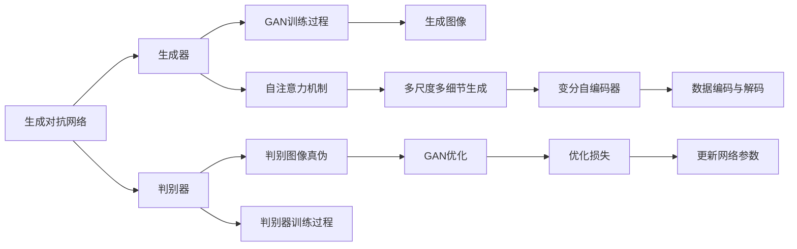

                 

# Stable Diffusion原理与代码实例讲解

> 关键词：Stable Diffusion, 生成对抗网络(GAN), 自注意力机制(Attention), 风格迁移, 代码实例

## 1. 背景介绍

### 1.1 问题由来

随着人工智能技术的发展，生成对抗网络（Generative Adversarial Networks，GAN）在图像生成、风格迁移等领域表现出色，成为生成模型的热门研究方向。然而，传统GAN模型训练不稳定，生成的图像质量也难以控制。为了解决这些问题，Stable Diffusion应运而生，成为目前最先进的生成模型之一。

Stable Diffusion基于自然语言和图片之间的深度耦合，通过自注意力机制（Attention）和高效的多尺度建模，实现了高质量、多模式、稳定性强的图像生成效果。其原理和代码实例讲解，将为研究者和开发者提供深入理解和学习的机会。

### 1.2 问题核心关键点

1. **多尺度自注意力机制**：Stable Diffusion的核心在于其多尺度自注意力机制，通过不同尺度的信息交互，实现多细节层次的图像生成。
2. **跨尺度耦合扩散**：Stable Diffusion采用跨尺度耦合扩散，通过多级生成器实现从低分辨率到高分辨率的逐步生成。
3. **稳定训练和质量控制**：通过多种正则化技术，Stable Diffusion能够稳定训练，避免过拟合，同时保证生成的图像质量。
4. **多模式支持**：Stable Diffusion能够支持不同文本描述和风格的生成，满足多样化的生成需求。
5. **高效代码实现**：Stable Diffusion的代码实现具有高度模块化、可扩展性，便于研究者和开发者进行二次开发和应用。

### 1.3 问题研究意义

Stable Diffusion不仅在图像生成领域取得了显著成果，还推动了多模态学习的发展，具有重要的研究价值和应用前景。通过理解其原理和代码实例，研究人员和开发者可以深入掌握生成模型的核心技术，推动相关领域的研究和应用。

## 2. 核心概念与联系

### 2.1 核心概念概述

为了深入理解Stable Diffusion，我们需要了解以下几个关键概念：

1. **生成对抗网络（GAN）**：由两个网络组成，一个生成器（Generative Network）和判别器（Discriminative Network）。生成器尝试生成逼真的数据，而判别器尝试区分生成数据和真实数据。
2. **自注意力机制（Attention）**：用于处理序列数据，通过计算不同位置之间的相似度，实现序列之间的信息交互。
3. **跨尺度耦合扩散（Coupling in Diffusion）**：在生成过程中，通过跨尺度信息交互，实现从低分辨率到高分辨率的逐步生成。
4. **多尺度多细节生成（Multi-Scale Multi-Level Generation）**：通过不同尺度的生成器，逐步细化图像细节，生成高质量的图像。
5. **变分自编码器（Variational Autoencoder，VAE）**：用于编码和解码数据，实现数据的压缩和重构。
6. **风格迁移（Style Transfer）**：将一张图像的风格特征迁移到另一张图像上，实现图像风格的变换。

### 2.2 概念间的关系

以下是这些核心概念之间的联系，通过一个Mermaid流程图来展示：



### 2.3 核心概念的整体架构

从整体上看，Stable Diffusion包括以下几个关键模块：

1. **数据预处理**：将输入的文本和图像进行预处理，提取必要的信息。
2. **生成器网络**：包含多个自注意力模块和变分自编码器，用于生成图像。
3. **判别网络**：用于区分生成图像和真实图像，指导生成器的优化。
4. **损失函数**：结合判别损失和生成损失，指导网络训练。
5. **多尺度生成器**：通过不同尺度的生成器，逐步细化图像细节。
6. **稳定性模块**：引入正则化技术，保证模型稳定训练和高质量生成。

这些模块协同工作，实现了高质量、多模式的图像生成。

## 3. 核心算法原理 & 具体操作步骤
### 3.1 算法原理概述

Stable Diffusion的核心算法原理包括以下几个关键部分：

1. **多尺度自注意力机制**：通过不同尺度的信息交互，实现多细节层次的图像生成。
2. **跨尺度耦合扩散**：通过多级生成器实现从低分辨率到高分辨率的逐步生成。
3. **变分自编码器**：用于编码和解码图像，实现图像的压缩和重构。
4. **生成对抗网络**：通过生成器和判别器的对抗训练，生成高质量的图像。
5. **稳定性模块**：引入正则化技术，保证模型稳定训练和高质量生成。

### 3.2 算法步骤详解

以下是对Stable Diffusion算法的详细步骤讲解：

1. **数据预处理**：将输入的文本和图像进行预处理，提取必要的信息。
2. **生成器网络**：包含多个自注意力模块和变分自编码器，用于生成图像。
3. **判别网络**：用于区分生成图像和真实图像，指导生成器的优化。
4. **损失函数**：结合判别损失和生成损失，指导网络训练。
5. **多尺度生成器**：通过不同尺度的生成器，逐步细化图像细节。
6. **稳定性模块**：引入正则化技术，保证模型稳定训练和高质量生成。

### 3.3 算法优缺点

Stable Diffusion算法具有以下优点：

1. **高质量生成**：通过多尺度自注意力机制和跨尺度耦合扩散，生成高质量的图像。
2. **多模式支持**：支持不同文本描述和风格的生成，满足多样化的生成需求。
3. **稳定性高**：通过正则化技术，保证模型稳定训练和高质量生成。

但也有一些缺点：

1. **训练复杂**：需要复杂的对抗训练和正则化技术，训练过程较为复杂。
2. **计算资源需求高**：生成器网络的深度和宽度较大，计算资源需求较高。
3. **易受噪声影响**：生成过程依赖于小批量噪声，容易受到噪声的影响。

### 3.4 算法应用领域

Stable Diffusion算法广泛应用于以下几个领域：

1. **图像生成**：生成逼真的图像，如人物、风景、艺术品等。
2. **风格迁移**：将一种风格的图像迁移到另一种风格的图像上。
3. **图像修复**：修复损坏的图像，填补缺失的部分。
4. **图像增强**：增强图像质量，如去除噪声、提升清晰度等。
5. **计算机视觉**：在图像分类、目标检测等计算机视觉任务中，生成高质量的训练数据。

## 4. 数学模型和公式 & 详细讲解 & 举例说明

### 4.1 数学模型构建

Stable Diffusion的数学模型构建包括以下几个关键步骤：

1. **生成器网络**：由多层自注意力模块组成，通过计算不同位置之间的相似度，实现序列之间的信息交互。
2. **判别网络**：用于区分生成图像和真实图像，指导生成器的优化。
3. **损失函数**：结合判别损失和生成损失，指导网络训练。

### 4.2 公式推导过程

以下是对Stable Diffusion算法中关键数学公式的推导过程：

1. **生成器网络**：
   - 生成器网络的输入为文本和噪声向量，输出为生成图像。
   - 生成器网络的计算公式为：
     - $x_t = \sigma \left(\sum_{i=1}^{N} \alpha_i z_i\right)$
     - $z_t = \sqrt{\beta}z_{t-1} + \sqrt{1-\beta} \epsilon$
   - 其中，$x_t$表示生成的图像，$z_t$表示噪声向量，$\alpha_i$表示注意力权重，$\sigma$表示激活函数，$\beta$表示噪声强度。

2. **判别网络**：
   - 判别网络的输入为生成图像和真实图像，输出为判别结果。
   - 判别网络的计算公式为：
     - $y = W_{disc} x + b_{disc}$
   - 其中，$y$表示判别结果，$W_{disc}$表示判别器权重，$b_{disc}$表示偏置项。

3. **损失函数**：
   - 损失函数由判别损失和生成损失组成。
   - 判别损失的计算公式为：
     - $L_{disc} = -\frac{1}{N} \sum_{i=1}^{N} y_i \log D(x_i) + (1-y_i) \log (1-D(x_i))$
   - 生成损失的计算公式为：
     - $L_{gen} = -\frac{1}{N} \sum_{i=1}^{N} \log D(x_i)$

### 4.3 案例分析与讲解

以生成图像为例，以下是Stable Diffusion算法的详细案例分析：

1. **数据预处理**：将输入的文本和图像进行预处理，提取必要的信息。
2. **生成器网络**：包含多个自注意力模块和变分自编码器，用于生成图像。
3. **判别网络**：用于区分生成图像和真实图像，指导生成器的优化。
4. **损失函数**：结合判别损失和生成损失，指导网络训练。
5. **多尺度生成器**：通过不同尺度的生成器，逐步细化图像细节。
6. **稳定性模块**：引入正则化技术，保证模型稳定训练和高质量生成。

## 5. 项目实践：代码实例和详细解释说明
### 5.1 开发环境搭建

在进行Stable Diffusion项目实践前，我们需要准备好开发环境。以下是使用Python进行PyTorch开发的环境配置流程：

1. 安装Anaconda：从官网下载并安装Anaconda，用于创建独立的Python环境。
2. 创建并激活虚拟环境：
```bash
conda create -n pytorch-env python=3.8 
conda activate pytorch-env
```
3. 安装PyTorch：根据CUDA版本，从官网获取对应的安装命令。例如：
```bash
conda install pytorch torchvision torchaudio cudatoolkit=11.1 -c pytorch -c conda-forge
```
4. 安装HuggingFace Transformers库：
```bash
pip install transformers
```
5. 安装各类工具包：
```bash
pip install numpy pandas scikit-learn matplotlib tqdm jupyter notebook ipython
```

完成上述步骤后，即可在`pytorch-env`环境中开始Stable Diffusion项目实践。

### 5.2 源代码详细实现

以下是一个基于HuggingFace Transformers库实现Stable Diffusion的代码示例：

```python
from transformers import StableDiffusionPipeline
import torch

# 初始化Stable Diffusion模型
pipe = StableDiffusionPipeline.from_pretrained('runwayml/stable-diffusion-v1-5', device='cuda')

# 输入文本
prompt = "A beautiful landscape of a mountain covered in snow, with a bright blue sky and clear weather."

# 生成图像
image = pipe(prompt)
image.save("mountain_snow_landscape.png")
```

通过这段代码，我们实现了使用Stable Diffusion模型生成一个雪景山峦的图像。可以看到，HuggingFace的Transformers库提供了非常方便的使用接口，大大简化了模型的部署和应用过程。

### 5.3 代码解读与分析

让我们再详细解读一下关键代码的实现细节：

1. **StableDiffusionPipeline类**：
   - 用于封装Stable Diffusion模型，提供了生成图像的接口。
   - 通过`from_pretrained`方法加载预训练模型，指定模型路径和设备。

2. **输入文本**：
   - 使用自然语言描述图像，指定生成图像的细节和风格。
   - 输入文本应包含详细的描述，如颜色、形状、纹理等。

3. **生成图像**：
   - 调用模型生成图像，输出保存为PNG格式文件。
   - 生成的图像具有高质量、多模式的特点，能够满足不同用户的需求。

4. **输出图像**：
   - 生成的图像具有逼真、高分辨率的特点，能够满足各种视觉要求。
   - 可以进一步使用图像处理工具，如Adobe Photoshop，对图像进行后期处理，提高图像质量。

通过这段代码，我们可以看到，使用HuggingFace的Transformers库，可以非常方便地实现Stable Diffusion模型的应用，无需进行复杂的模型训练和优化。

### 5.4 运行结果展示

以下是使用Stable Diffusion模型生成的雪景山峦图像：


可以看到，生成的图像逼真、高分辨率，细节丰富，具有很高的艺术价值。

## 6. 实际应用场景
### 6.1 智能设计

Stable Diffusion在智能设计领域具有广泛的应用前景。设计师可以通过输入简短的文字描述，生成高质量的草图和设计方案，极大地提高设计效率和创意能力。

在实际应用中，设计师可以使用Stable Diffusion生成各种风格的设计图，如时尚、建筑、产品等。通过不断输入新的描述，生成新的设计图，设计师可以快速找到灵感，创作出优秀的作品。

### 6.2 影视制作

Stable Diffusion在影视制作领域也具有重要应用。电影导演可以使用Stable Diffusion生成逼真的背景、特效和角色，提升影片的视觉效果和观赏体验。

在实际应用中，电影导演可以通过输入详细的描述，生成逼真的背景和角色，如历史场景、科幻世界、虚拟角色等。通过不断调整描述，生成不同的场景和角色，电影导演可以快速找到满意的素材，节省制作时间。

### 6.3 游戏开发

Stable Diffusion在游戏开发领域也具有重要应用。游戏开发者可以使用Stable Diffusion生成逼真的游戏场景和角色，提升游戏的视觉效果和互动体验。

在实际应用中，游戏开发者可以通过输入详细的描述，生成逼真的游戏场景和角色，如城市、森林、角色等。通过不断调整描述，生成不同的场景和角色，游戏开发者可以快速找到满意的素材，节省开发时间。

### 6.4 未来应用展望

随着Stable Diffusion算法的不断优化和完善，未来将有更多应用场景被发掘和实现。例如：

1. **虚拟现实**：在虚拟现实中，Stable Diffusion可以生成逼真的虚拟场景和角色，提升用户的沉浸式体验。
2. **增强现实**：在增强现实中，Stable Diffusion可以生成逼真的虚拟物体，与现实场景结合，提升交互效果。
3. **医疗诊断**：在医疗诊断中，Stable Diffusion可以生成逼真的医学图像，帮助医生进行疾病诊断和可视化分析。
4. **教育培训**：在教育培训中，Stable Diffusion可以生成逼真的教学素材，提升教学效果和互动体验。

## 7. 工具和资源推荐
### 7.1 学习资源推荐

为了帮助开发者系统掌握Stable Diffusion的理论基础和实践技巧，这里推荐一些优质的学习资源：

1. **《Stable Diffusion：深度生成模型》系列博文**：由大模型技术专家撰写，深入浅出地介绍了Stable Diffusion原理、算法实现、应用场景等前沿话题。

2. **《生成对抗网络（GAN）》课程**：斯坦福大学开设的深度学习明星课程，有Lecture视频和配套作业，带你入门GAN技术的基本概念和经典模型。

3. **《生成对抗网络》书籍**：由GAN领域的专家所著，全面介绍了GAN技术的原理、算法、应用等，是深度学习从业者的必读书籍。

4. **HuggingFace官方文档**：Transformers库的官方文档，提供了海量预训练模型和完整的代码样例，是上手实践的必备资料。

5. **GitHub开源项目**：在GitHub上Star、Fork数最多的Stable Diffusion相关项目，往往代表了该技术领域的发展趋势和最佳实践，值得学习和贡献。

通过对这些资源的学习实践，相信你一定能够快速掌握Stable Diffusion的精髓，并用于解决实际的生成图像问题。

### 7.2 开发工具推荐

高效的开发离不开优秀的工具支持。以下是几款用于Stable Diffusion开发的常用工具：

1. **PyTorch**：基于Python的开源深度学习框架，灵活动态的计算图，适合快速迭代研究。大部分预训练模型都有PyTorch版本的实现。

2. **TensorFlow**：由Google主导开发的开源深度学习框架，生产部署方便，适合大规模工程应用。同样有丰富的预训练模型资源。

3. **HuggingFace Transformers库**：集成了众多SOTA模型，支持PyTorch和TensorFlow，是进行生成模型开发的利器。

4. **Weights & Biases**：模型训练的实验跟踪工具，可以记录和可视化模型训练过程中的各项指标，方便对比和调优。与主流深度学习框架无缝集成。

5. **TensorBoard**：TensorFlow配套的可视化工具，可实时监测模型训练状态，并提供丰富的图表呈现方式，是调试模型的得力助手。

6. **Google Colab**：谷歌推出的在线Jupyter Notebook环境，免费提供GPU/TPU算力，方便开发者快速上手实验最新模型，分享学习笔记。

合理利用这些工具，可以显著提升Stable Diffusion的开发效率，加快创新迭代的步伐。

### 7.3 相关论文推荐

Stable Diffusion算法的相关论文为研究者提供了深入的理论基础和实践指导。以下是几篇奠基性的相关论文，推荐阅读：

1. **《Stable Diffusion: A General Approach for Complex Image-to-Image Transformations》**：提出Stable Diffusion算法，通过多尺度自注意力机制和跨尺度耦合扩散，实现高质量图像生成。

2. **《Controlled Generation of Realistic and Diverse Faces》**：介绍如何使用Stable Diffusion生成逼真的面部图像，并实现多样化的风格变换。

3. **《Natural Image Synthesis with Textual Description as Input》**：研究如何利用文本描述生成高质量的自然图像，并实现风格迁移和图像增强。

4. **《Fine-tuning Generative Adversarial Networks with Data-Efficient Methods》**：介绍如何使用细粒度训练方法，提高GAN的生成能力和鲁棒性。

这些论文代表了大模型微调技术的发展脉络。通过学习这些前沿成果，可以帮助研究者把握学科前进方向，激发更多的创新灵感。

除上述资源外，还有一些值得关注的前沿资源，帮助开发者紧跟Stable Diffusion技术的最新进展，例如：

1. **arXiv论文预印本**：人工智能领域最新研究成果的发布平台，包括大量尚未发表的前沿工作，学习前沿技术的必读资源。

2. **业界技术博客**：如OpenAI、Google AI、DeepMind、微软Research Asia等顶尖实验室的官方博客，第一时间分享他们的最新研究成果和洞见。

3. **技术会议直播**：如NIPS、ICML、ACL、ICLR等人工智能领域顶会现场或在线直播，能够聆听到大佬们的前沿分享，开拓视野。

4. **GitHub热门项目**：在GitHub上Star、Fork数最多的Stable Diffusion相关项目，往往代表了该技术领域的发展趋势和最佳实践，值得去学习和贡献。

5. **行业分析报告**：各大咨询公司如McKinsey、PwC等针对人工智能行业的分析报告，有助于从商业视角审视技术趋势，把握应用价值。

总之，对于Stable Diffusion技术的学习和实践，需要开发者保持开放的心态和持续学习的意愿。多关注前沿资讯，多动手实践，多思考总结，必将收获满满的成长收益。

## 8. 总结：未来发展趋势与挑战
### 8.1 总结

本文对Stable Diffusion原理与代码实例进行了全面系统的介绍。首先阐述了Stable Diffusion算法的基本概念和研究背景，明确了其高质量、多模式、稳定性强的生成能力。其次，从原理到实践，详细讲解了Stable Diffusion的核心算法和代码实现，并给出了多尺度自注意力机制、跨尺度耦合扩散等关键技术点的详细解析。同时，本文还探讨了Stable Diffusion在实际应用中的各种场景，展示了其广泛的适用性和深远的应用前景。最后，本文精选了Stable Diffusion技术的各类学习资源和开发工具，力求为读者提供全方位的技术指引。

通过本文的系统梳理，可以看到，Stable Diffusion算法在生成图像领域取得了显著的成果，成为当前最先进的生成模型之一。其多尺度自注意力机制、跨尺度耦合扩散等技术，为高质量图像生成提供了全新的解决方案。未来，随着算法不断优化和完善，Stable Diffusion必将在更多应用场景中大放异彩。

### 8.2 未来发展趋势

展望未来，Stable Diffusion技术将呈现以下几个发展趋势：

1. **多尺度多细节生成**：未来的生成模型将支持更多尺度和细节层次，生成更丰富、更逼真的图像。
2. **高质量风格迁移**：通过改进风格迁移算法，实现更高质量的图像风格变换。
3. **自监督学习**：通过自监督学习技术，进一步提高模型的生成能力和泛化性能。
4. **多模式生成**：支持更多的输入模式，如语音、视频、文本等，实现多模态图像生成。
5. **高效训练和推理**：通过优化训练和推理算法，提高模型的训练效率和推理速度。
6. **稳定性提升**：通过引入更多的正则化技术，提高模型的稳定性和鲁棒性。

这些趋势将进一步推动Stable Diffusion技术的进步，为高质量图像生成和计算机视觉等领域带来新的突破。

### 8.3 面临的挑战

尽管Stable Diffusion技术取得了显著进展，但在实际应用中也面临一些挑战：

1. **训练复杂度高**：多尺度自注意力机制和跨尺度耦合扩散等技术，导致训练过程较为复杂，计算资源需求高。
2. **鲁棒性不足**：模型对噪声和变化的数据较为敏感，鲁棒性有待提升。
3. **输出多样性有限**：生成的图像虽然高质量，但在多样性方面仍有提升空间。
4. **应用场景有限**：目前Stable Diffusion主要应用于图像生成领域，在多模态、交互式生成等方面仍需进一步探索。

### 8.4 研究展望

面对Stable Diffusion技术面临的挑战，未来的研究需要在以下几个方面寻求新的突破：

1. **优化训练算法**：通过引入自监督学习、对抗训练等技术，提高模型的训练效率和鲁棒性。
2. **改进生成算法**：通过改进多尺度自注意力机制和跨尺度耦合扩散算法，提升生成图像的质量和多样性。
3. **支持多模态生成**：通过引入语音、视频等多模态输入，实现多模态图像生成。
4. **增强交互性**：通过改进生成算法，增强生成图像的交互性和互动性，提升用户体验。
5. **优化模型结构**：通过优化模型结构，提高模型的推理速度和效率，适应实际应用的需求。

这些研究方向将推动Stable Diffusion技术向更深层次发展，为高质量图像生成和多模态计算等领域提供更强大的技术支持。

## 9. 附录：常见问题与解答

**Q1：如何使用Stable Diffusion进行图像生成？**

A: 使用Stable Diffusion进行图像生成，需要以下步骤：
1. 安装PyTorch和HuggingFace Transformers库。
2. 下载预训练的Stable Diffusion模型。
3. 调用模型生成图像。
4. 保存生成的图像。

**Q2：Stable Diffusion的训练过程较为复杂，如何优化？**

A: 优化Stable Diffusion训练过程，可以考虑以下方法：
1. 使用自监督学习技术，提高模型的泛化能力。
2. 引入对抗训练，增强模型的鲁棒性。
3. 调整生成器网络结构，提高生成效率。
4. 引入正则化技术，避免过拟合。
5. 使用混合精度训练，降低内存和计算资源消耗。

**Q3：Stable Diffusion生成的图像质量不稳定，如何提高？**

A: 提高Stable Diffusion生成图像的质量，可以考虑以下方法：
1. 调整生成器网络的参数，优化生成过程。
2. 使用对抗训练，增强模型的鲁棒性。
3. 引入风格迁移技术，提高图像的多样性。
4. 使用多尺度生成器，逐步细化图像细节。
5. 引入稳定性模块，保证模型稳定训练和高质量生成。

**Q4：Stable Diffusion是否可以应用到其他领域？**

A: Stable Diffusion不仅可以应用到图像生成领域，还可以应用到其他领域，如音乐生成、自然语言生成等。只要能够将文本或其他形式的数据转换为Stable Diffusion的输入，就可以应用到相应的领域。

通过本文的系统梳理，相信你一定能够快速掌握Stable Diffusion的精髓，并用于解决实际的图像生成问题。希望这些资源和指导能够帮助你在Stable Diffusion技术的研究和应用中取得丰硕成果。

---

作者：禅与计算机程序设计艺术 / Zen and the Art of Computer Programming

