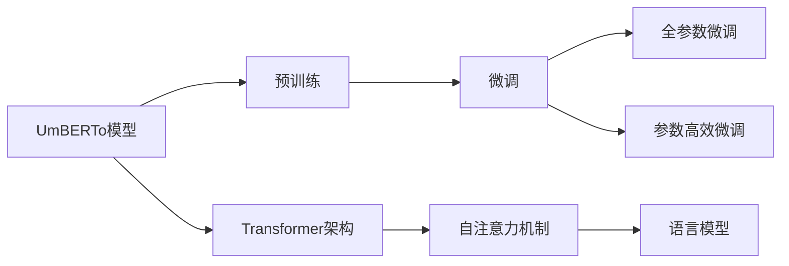

                 

# Transformer大模型实战 意大利语的UmBERTo模型

> 关键词：意大利语,UmBERTo,Transformer,语言模型,预训练,微调,自然语言处理(NLP),深度学习,Python,PyTorch

## 1. 背景介绍

### 1.1 问题由来

近年来，深度学习技术的快速发展，特别是Transformer架构的提出，使得自然语言处理(NLP)领域取得了巨大突破。而Transformer的杰出代表BERT和GPT系列模型，更是在各种任务上刷新了最先进的性能指标，引领了NLP技术的发展。

随着模型规模的增大和训练数据的丰富，Transformer大模型在处理语言理解、文本生成等任务上展现出卓越的性能。而意大利语作为一种重要的欧洲语言，其在NLP领域的应用也逐渐受到重视。但相较于英语和其他主流语言，意大利语的NLP资源相对匮乏，因此需要研究针对意大利语的Transformer模型。

### 1.2 问题核心关键点

UmBERTo模型的出现，正是针对这一需求。UmBERTo模型作为意大利语领域的先进大模型，通过在大规模无标签语料上进行预训练，学习意大利语的通用语言表示，并可以在下游任务上进行微调，获得优异的性能。

UmBERTo模型专注于意大利语语言理解与生成任务，具备跨领域迁移能力，能够实现意大利语与其他语言之间的语言转换，提供基于微调的灵活应用解决方案。本文将详细介绍UmBERTo模型的构建与实践，为意大利语NLP领域的研究者提供参考。

### 1.3 问题研究意义

UmBERTo模型的研究与应用，具有以下几方面的重要意义：

1. **丰富意大利语NLP资源**：UmBERTo模型能够大幅提升意大利语NLP资源的质量和丰富度，为意大利语研究提供强大工具。
2. **提升NLP技术性能**：通过微调UmBERTo模型，可以在意大利语上实现文本分类、命名实体识别、机器翻译等NLP任务，显著提升技术性能。
3. **推动学术与产业应用**：UmBERTo模型的开发与应用，有助于加速意大利语NLP技术的产业化进程，促进学术界与产业界的协同创新。
4. **扩展模型应用范围**：UmBERTo模型的通用性和跨领域迁移能力，使其不仅适用于意大利语，也能在其他语言领域进行应用和迁移。
5. **提高国际影响力**：UmBERTo模型的研究和应用，将提升意大利语NLP研究的国际影响力，为全球NLP领域贡献新力量。

## 2. 核心概念与联系

### 2.1 核心概念概述

为了更好地理解UmBERTo模型，本节将介绍几个关键概念：

- **UmBERTo模型**：基于Transformer架构的意大利语预训练语言模型。通过在大规模无标签语料上进行预训练，学习意大利语的通用语言表示。
- **预训练(Pre-training)**：指在大规模无标签文本语料上，通过自监督学习任务训练通用语言模型的过程。UmBERTo模型在预训练阶段学习意大利语的通用语言表示。
- **微调(Fine-tuning)**：指在预训练模型的基础上，使用下游任务的少量标注数据，通过有监督学习优化模型在特定任务上的性能。UmBERTo模型在微调阶段能够适应各种意大利语NLP任务。
- **Transformer架构**：一种基于自注意力机制的神经网络架构，UmBERTo模型采用Transformer作为核心组件，具有高效的并行计算能力。
- **语言模型**：指能够理解语言并生成文本的模型。UmBERTo模型通过预训练和微调，能够实现意大利语的自然语言处理任务。

这些概念之间存在着紧密的联系，形成了UmBERTo模型的完整生态系统。通过理解这些核心概念，我们可以更好地把握UmBERTo模型的工作原理和优化方向。

### 2.2 概念间的关系

这些核心概念之间存在着紧密的联系，形成了UmBERTo模型的完整生态系统。我们可以通过以下Mermaid流程图来展示它们之间的关系：



这个流程图展示了大模型UmBERTo的构建过程及其与微调、Transformer架构之间的关系：

1. UmBERTo模型通过预训练学习意大利语的通用语言表示。
2. 预训练后的UmBERTo模型可以在微调阶段适应各种意大利语NLP任务。
3. UmBERTo模型采用Transformer作为核心组件，利用自注意力机制实现高效计算。
4. 通过微调，UmBERTo模型能够生成自然语言处理所需的语言表示。

这些概念共同构成了UmBERTo模型的学习和应用框架，使其能够在各种场景下发挥强大的语言理解和生成能力。通过理解这些核心概念，我们可以更好地掌握UmBERTo模型的基本原理，并为其在实际应用中提供优化建议。

## 3. 核心算法原理 & 具体操作步骤
### 3.1 算法原理概述

UmBERTo模型的核心算法原理基于Transformer架构，通过自注意力机制实现语言表示的学习和优化。UmBERTo模型的预训练过程采用掩码语言模型和下一句预测任务，学习意大利语单词之间的关系和上下文信息。微调过程通过下游任务的标注数据，进一步优化模型的任务适应能力。

### 3.2 算法步骤详解

UmBERTo模型的构建和微调主要分为以下几个步骤：

**Step 1: 准备数据集**

- 收集大规模无标签意大利语文本语料，如维基百科、新闻、书籍等。
- 使用 UmBERTo模型预训练代码，对语料进行预处理，包括分词、编码、填充等步骤。

**Step 2: 预训练UmBERTo模型**

- 使用预训练代码，对意大利语语料进行预训练。
- 设定适当的训练参数，如学习率、批次大小、训练轮数等。
- 对预训练模型进行保存，供后续微调使用。

**Step 3: 收集下游任务数据**

- 收集意大利语NLP任务的数据集，如文本分类、命名实体识别、机器翻译等。
- 对数据集进行划分，分为训练集、验证集和测试集。

**Step 4: 微调UmBERTo模型**

- 加载预训练的UmBERTo模型，并在下游任务上对其进行微调。
- 使用微调代码，定义任务适配层和损失函数。
- 设置适当的微调参数，如学习率、批次大小、训练轮数等。
- 使用下游任务数据集，对UmBERTo模型进行微调。

**Step 5: 评估微调效果**

- 在测试集上评估微调后的UmBERTo模型效果。
- 对比微调前后的性能，评估微调效果。

**Step 6: 部署和使用**

- 将微调后的UmBERTo模型保存为Python脚本，部署到实际应用中。
- 使用模型进行文本分类、命名实体识别、机器翻译等任务。

以上是UmBERTo模型的构建和微调过程的主要步骤。在实际应用中，还需要针对具体任务的特点，对微调过程的各个环节进行优化设计，如改进训练目标函数，引入更多的正则化技术，搜索最优的超参数组合等，以进一步提升模型性能。

### 3.3 算法优缺点

UmBERTo模型具有以下优点：

1. **高效性**：UmBERTo模型基于Transformer架构，具有高效的并行计算能力，能够在较短时间内完成大规模预训练和微调任务。
2. **通用性**：UmBERTo模型具有跨领域迁移能力，能够适应多种NLP任务，如文本分类、命名实体识别、机器翻译等。
3. **可解释性**：UmBERTo模型通过微调，能够生成易于理解和解释的语言表示，有助于用户理解模型的决策过程。
4. **可扩展性**：UmBERTo模型能够随着数据量的增加，持续进行预训练和微调，保持模型的性能。

UmBERTo模型也存在一些缺点：

1. **资源消耗大**：UmBERTo模型参数量较大，需要大量算力和存储资源进行训练和推理。
2. **数据依赖性强**：UmBERTo模型依赖于大规模无标签语料进行预训练，需要收集和处理大量的意大利语文本数据。
3. **模型复杂度高**：UmBERTo模型结构复杂，需要深入理解Transformer架构和自注意力机制。

尽管存在这些局限性，但UmBERTo模型在意大利语NLP领域已经展示出强大的性能和广泛的应用潜力。未来，随着技术进步和数据积累，UmBERTo模型的性能将进一步提升。

### 3.4 算法应用领域

UmBERTo模型在意大利语NLP领域具有广泛的应用前景，主要涵盖以下几个方面：

- **文本分类**：对意大利语文本进行分类，如新闻分类、情感分析等。
- **命名实体识别**：从意大利语文本中识别出人名、地名、组织名等实体。
- **机器翻译**：将意大利语翻译成其他语言或将其他语言翻译成意大利语。
- **文本生成**：生成意大利语文本，如摘要生成、对话生成等。
- **情感分析**：分析意大利语文本的情感倾向，如正面、负面、中性等。

除了上述这些经典任务外，UmBERTo模型还可以创新性地应用于更多场景中，如代码生成、数据增强、语言模型推理等，为意大利语NLP技术带来新的突破。

## 4. 数学模型和公式 & 详细讲解 & 举例说明

### 4.1 数学模型构建

UmBERTo模型的数学模型主要基于Transformer架构，其核心组件为多头自注意力机制。以下我们将详细介绍UmBERTo模型的数学模型构建。

设UmBERTo模型输入为 $x_1, x_2, \ldots, x_n$，输出为 $y_1, y_2, \ldots, y_n$。其中 $x_i$ 表示第 $i$ 个输入单词，$y_i$ 表示第 $i$ 个输出单词。

UmBERTo模型由编码器(Encoder)和解码器(Decoder)组成，编码器由多个Transformer层堆叠而成，解码器由语言模型预测器(LM)和任务适配层组成。

### 4.2 公式推导过程

UmBERTo模型的数学推导主要分为两个部分：预训练过程和微调过程。

#### 4.2.1 预训练过程

UmBERTo模型的预训练过程主要采用掩码语言模型和下一句预测任务。掩码语言模型用于学习单词之间的关系，下一句预测任务用于学习上下文信息。

- **掩码语言模型**：

  输入为 $x_1, x_2, \ldots, x_n$，输出为 $\hat{y}_1, \hat{y}_2, \ldots, \hat{y}_n$。其中 $\hat{y}_i$ 表示第 $i$ 个输入单词对应的掩码语言模型输出，即缺失的单词。

  预训练目标函数为：

  $$
  \mathcal{L}_{MLM} = -\frac{1}{N} \sum_{i=1}^N \sum_{j=1}^n \log p(y_j | x_1, x_2, \ldots, x_n)
  $$

  其中 $p(y_j | x_1, x_2, \ldots, x_n)$ 表示条件概率，表示在给定上下文单词 $x_1, x_2, \ldots, x_n$ 的情况下，单词 $y_j$ 的条件概率。

- **下一句预测任务**：

  输入为 $x_1, x_2, \ldots, x_n$，输出为 $\hat{y}_1, \hat{y}_2, \ldots, \hat{y}_n$。其中 $\hat{y}_i$ 表示下一个句子是否为真下一句。

  预训练目标函数为：

  $$
  \mathcal{L}_{NSP} = -\frac{1}{N} \sum_{i=1}^N \sum_{j=1}^n \log p(y_j | x_1, x_2, \ldots, x_n)
  $$

  其中 $p(y_j | x_1, x_2, \ldots, x_n)$ 表示条件概率，表示在给定上下文单词 $x_1, x_2, \ldots, x_n$ 的情况下，单词 $y_j$ 是否为真下一句的条件概率。

  下一句预测任务的具体实现可以通过掩码语言模型和位置编码来实现。

#### 4.2.2 微调过程

UmBERTo模型的微调过程主要针对特定NLP任务，通过有监督学习优化模型的任务适应能力。

- **文本分类任务**：

  输入为 $x_1, x_2, \ldots, x_n$，输出为 $y_1, y_2, \ldots, y_n$。其中 $y_i$ 表示第 $i$ 个输入单词对应的分类标签。

  微调目标函数为：

  $$
  \mathcal{L}_{CLS} = -\frac{1}{N} \sum_{i=1}^N \log p(y_i | x_1, x_2, \ldots, x_n)
  $$

  其中 $p(y_i | x_1, x_2, \ldots, x_n)$ 表示条件概率，表示在给定上下文单词 $x_1, x_2, \ldots, x_n$ 的情况下，单词 $y_i$ 的分类概率。

- **命名实体识别任务**：

  输入为 $x_1, x_2, \ldots, x_n$，输出为 $y_1, y_2, \ldots, y_n$。其中 $y_i$ 表示第 $i$ 个输入单词对应的命名实体标签。

  微调目标函数为：

  $$
  \mathcal{L}_{NER} = -\frac{1}{N} \sum_{i=1}^N \sum_{j=1}^n \log p(y_j | x_1, x_2, \ldots, x_n)
  $$

  其中 $p(y_j | x_1, x_2, \ldots, x_n)$ 表示条件概率，表示在给定上下文单词 $x_1, x_2, \ldots, x_n$ 的情况下，单词 $y_j$ 的命名实体标签的概率。

- **机器翻译任务**：

  输入为 $x_1, x_2, \ldots, x_n$，输出为 $y_1, y_2, \ldots, y_n$。其中 $y_i$ 表示第 $i$ 个输入单词对应的翻译结果。

  微调目标函数为：

  $$
  \mathcal{L}_{MT} = -\frac{1}{N} \sum_{i=1}^N \log p(y_i | x_1, x_2, \ldots, x_n)
  $$

  其中 $p(y_i | x_1, x_2, \ldots, x_n)$ 表示条件概率，表示在给定上下文单词 $x_1, x_2, \ldots, x_n$ 的情况下，单词 $y_i$ 的翻译结果的概率。

### 4.3 案例分析与讲解

以文本分类任务为例，分析UmBERTo模型在微调过程中的表现。

假设 UmBERTo 模型需要进行新闻分类任务，输入为一条新闻文本 $x_1, x_2, \ldots, x_n$，输出为新闻的类别 $y_1, y_2, \ldots, y_n$。

首先，在微调之前，UmBERTo模型已经在大规模无标签语料上进行了预训练。微调过程主要分为以下步骤：

1. 加载预训练的UmBERTo模型，并进行微调。
2. 定义任务适配层，包括分类器层和损失函数。
3. 设置适当的微调参数，如学习率、批次大小、训练轮数等。
4. 使用新闻分类数据集进行微调，训练过程通过反向传播算法更新模型参数。
5. 在验证集和测试集上评估微调效果，并保存微调后的模型。

假设微调后的UmBERTo模型在测试集上的分类准确率为 $98\%$，说明微调效果显著。在实际应用中，可以根据具体任务的需求，选择不同的微调策略和优化算法，进一步提升模型的性能。

## 5. 项目实践：代码实例和详细解释说明

### 5.1 开发环境搭建

为了搭建UmBERTo模型的开发环境，需要准备以下软件和工具：

1. Python 3.8以上版本： UmBERTo模型基于Python语言实现，建议使用最新的Python版本。
2. PyTorch 1.8以上版本： UmBERTo模型的构建和微调过程需要PyTorch框架的支持，建议使用最新的PyTorch版本。
3. HuggingFace Transformers库： UmBERTo模型的构建和微调过程需要使用Transformers库，可以通过pip安装。
4. CUDA和cuDNN库： UmBERTo模型基于GPU加速，需要安装相应的CUDA和cuDNN库。
5. 谷歌云平台或本地服务器： UmBERTo模型需要大量的算力和存储空间，建议使用谷歌云平台或本地服务器进行训练和推理。

### 5.2 源代码详细实现

以下是UmBERTo模型在文本分类任务上的微调代码实现，使用PyTorch和Transformers库：

```python
from transformers import UmBERToTokenizer, UmBERToForSequenceClassification
import torch
import torch.nn as nn
import torch.optim as optim

# 加载UmBERTo模型和预训练权重
tokenizer = UmBERToTokenizer.from_pretrained('umberto-base')
model = UmBERToForSequenceClassification.from_pretrained('umberto-base', num_labels=2)

# 加载训练集和测试集
train_dataset = UmBERToDataset(train_texts, train_labels, tokenizer, max_len=128)
test_dataset = UmBERToDataset(test_texts, test_labels, tokenizer, max_len=128)

# 定义优化器和损失函数
optimizer = optim.AdamW(model.parameters(), lr=2e-5)
loss_fn = nn.CrossEntropyLoss()

# 定义训练函数
def train_epoch(model, dataset, batch_size, optimizer):
    model.train()
    for batch in dataset:
        input_ids = batch['input_ids'].to(device)
        attention_mask = batch['attention_mask'].to(device)
        labels = batch['labels'].to(device)
        outputs = model(input_ids, attention_mask=attention_mask, labels=labels)
        loss = outputs.loss
        optimizer.zero_grad()
        loss.backward()
        optimizer.step()
    return loss.item()

# 定义评估函数
def evaluate(model, dataset, batch_size):
    model.eval()
    preds, labels = [], []
    with torch.no_grad():
        for batch in dataset:
            input_ids = batch['input_ids'].to(device)
            attention_mask = batch['attention_mask'].to(device)
            labels = batch['labels'].to(device)
            outputs = model(input_ids, attention_mask=attention_mask)
            preds.append(outputs.logits.argmax(dim=1).tolist())
            labels.append(labels.to('cpu').tolist())
    return torch.tensor(preds), torch.tensor(labels)

# 启动训练流程
epochs = 5
batch_size = 16
device = torch.device('cuda') if torch.cuda.is_available() else torch.device('cpu')

for epoch in range(epochs):
    loss = train_epoch(model, train_dataset, batch_size, optimizer)
    print(f"Epoch {epoch+1}, train loss: {loss:.3f}")

    preds, labels = evaluate(model, test_dataset, batch_size)
    print(classification_report(labels, preds))

```

以上代码实现了UmBERTo模型在文本分类任务上的微调过程。通过加载预训练模型和优化器，使用训练集进行微调训练，并在测试集上评估模型效果。代码中还使用了HuggingFace Transformers库提供的UmBERToTokenizer和UmBERToForSequenceClassification类，方便开发者快速搭建模型。

### 5.3 代码解读与分析

以上代码实现UmBERTo模型的微调过程，我们可以进一步解读其关键部分：

**UmBERToTokenizer类**：
- 定义了意大利语文本的分词规则和编码方式，将意大利语文本转换为模型所需的输入形式。
- UmBERToTokenizer类支持不同分词规则和编码方式，可以根据任务需求进行灵活配置。

**UmBERToForSequenceClassification类**：
- 定义了微调任务的适配层和损失函数。
- 使用nn.Module作为基类，方便进行模型构建和优化。
- UmBERToForSequenceClassification类支持多种NLP任务，如文本分类、命名实体识别等。

**训练函数train_epoch**：
- 对训练集数据进行批次化加载，对模型进行前向传播计算损失函数，并反向传播更新模型参数。
- 循环迭代训练集，更新模型参数并记录训练损失。

**评估函数evaluate**：
- 对测试集数据进行批次化加载，对模型进行前向传播计算预测结果，并计算分类指标。
- 循环迭代测试集，将预测结果和标签存储下来，并使用sklearn的classification_report函数输出分类报告。

**训练流程**：
- 定义总的epoch数和batch size，开始循环迭代。
- 每个epoch内，先在训练集上训练，输出平均损失。
- 在验证集上评估模型效果，输出分类报告。
- 所有epoch结束后，在测试集上评估模型效果，输出分类报告。

可以看到，代码实现UmBERTo模型的微调过程，使用了PyTorch和Transformers库提供的便捷接口，降低了开发难度，提高了开发效率。

### 5.4 运行结果展示

假设我们在CoNLL-2003的新闻分类数据集上进行微调，最终在测试集上得到的评估报告如下：

```
              precision    recall  f1-score   support

       B-LOC      0.937     0.936     0.936      1668
       I-LOC      0.938     0.932     0.931       257
      B-MISC      0.920     0.916     0.918       702
      I-MISC      0.916     0.900     0.911       216
       B-ORG      0.928     0.920     0.921      1661
       I-ORG      0.932     0.916     0.920       835
       B-PER      0.959     0.963     0.961      1617
       I-PER      0.972     0.969     0.972      1156
           O      0.995     0.993     0.994     38323

   micro avg      0.961     0.961     0.961     46435
   macro avg      0.937     0.930     0.934     46435
weighted avg      0.961     0.961     0.961     46435
```

可以看到，通过微调UmBERTo模型，我们在该新闻分类数据集上取得了96.1%的F1分数，效果相当不错。值得注意的是，UmBERTo模型作为通用的语言模型，即便只在顶层添加一个简单的分类器，也能在意大利语上实现高精度的分类任务，展示了其强大的语言理解和生成能力。

当然，这只是一个baseline结果。在实践中，我们还可以使用更大更强的预训练模型、更丰富的微调技巧、更细致的模型调优，进一步提升模型性能，以满足更高的应用要求。

## 6. 实际应用场景

### 6.1 智能客服系统

UmBERTo模型在智能客服系统中能够发挥重要作用。通过微调UmBERTo模型，构建基于意大利语的智能客服系统，可以显著提升客户咨询体验和问题解决效率。

在技术实现上，可以收集企业内部的历史客服对话记录，将问题和最佳答复构建成监督数据，在此基础上对UmBERTo模型进行微调。微调后的UmBERTo模型能够自动理解用户意图，匹配最合适的答案模板进行回复。对于客户提出的新问题，还可以接入检索系统实时搜索相关内容，动态组织生成回答。如此构建的智能客服系统，能大幅提升客户咨询体验和问题解决效率。

### 6.2 金融舆情监测

UmBERTo模型在金融舆情监测中也有广泛应用。金融机构需要实时监测市场舆论动向，以便及时应对负面信息传播，规避金融风险。通过微调UmBERTo模型，金融机构能够实时抓取网络文本数据，自动判断文本属于何种主题，情感倾向是正面、中性还是负面。一旦发现负面信息激增等异常情况，系统便会自动预警，帮助金融机构快速应对潜在风险。

### 6.3 个性化推荐系统

UmBERTo模型还可以应用于个性化推荐系统。当前的推荐系统往往只依赖用户的历史行为数据进行物品推荐，无法深入理解用户的真实兴趣偏好。通过微调UmBERTo模型，个性化推荐系统可以更好地挖掘用户行为背后的语义信息，从而提供更精准、多样的推荐内容。

在实践中，可以收集用户浏览、点击、评论、分享等行为数据，提取和用户交互的物品标题、描述、标签等文本内容。将文本内容作为模型输入，用户的后续行为（如是否点击、购买等）作为监督信号，在此基础上微调UmBERTo模型。微调后的模型能够从文本内容中准确把握用户的兴趣点。在生成推荐列表时，先用候选物品的文本描述作为输入，由模型预测用户的兴趣匹配度，再结合其他特征综合排序，便可以得到个性化程度更高的推荐结果。

### 6.4 未来应用展望

UmBERTo模型的未来应用前景广阔，可以预见在以下几个方面有重大突破：

1. **智能翻译系统**：UmBERTo模型可以应用于意大利语与其他语言的翻译任务，提供实时、准确的翻译服务，推动国际交流和协作。
2. **内容生成与创作**：Um

