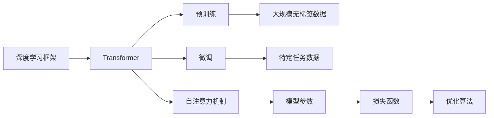

                 

# Transformer大模型实战 训练ALBERT 模型

> 关键词：大模型,ALBERT,Transformer,模型训练,深度学习

## 1. 背景介绍

### 1.1 问题由来
Transformer及其衍生物大模型的研究，已经在NLP领域取得了巨大突破。从BERT到GPT-2再到T5，大模型的应用场景从语言建模逐步拓展到更多下游任务，如文本分类、命名实体识别、问答、机器翻译等。

近年来，模型规模的不断扩大和训练技术的不断优化，使得大模型在许多任务上取得了比传统模型更为卓越的性能。特别是在大规模语料上预训练的ALBERT，其参数量适中，推理速度较快，在许多实际应用场景中展现出较强的竞争力。

本文将详细介绍如何在本地计算机上使用TensorFlow训练ALBERT模型，包括模型的定义、数据的准备、模型的训练与评估、微调的实践等关键步骤。

### 1.2 问题核心关键点
- 选择合适的深度学习框架(如TensorFlow)，安装并配置好依赖库。
- 准备并处理数据集，包括文本的预处理、分词等。
- 定义Transformer模型，并配置好模型参数。
- 编写训练脚本，设置训练参数，启动模型训练。
- 评估训练结果，保存模型，进行微调测试。

本文将通过完整的步骤演示，帮助读者掌握Transformer大模型的训练方法，并能够顺利地进行微调应用。

### 1.3 问题研究意义
ALBERT作为Transformer架构的优化版，已经广泛应用于NLP任务中。通过本文的实践，读者能够深入了解如何训练和微调ALBERT模型，提升模型在不同应用场景下的性能。同时，本文还将介绍一些模型训练中的常见问题及解决方法，为读者在实际应用中提供参考。

## 2. 核心概念与联系

### 2.1 核心概念概述
为了更好地理解ALBERT模型的训练过程，需要了解以下核心概念：

- **深度学习框架**：如TensorFlow、PyTorch等，提供了高效的计算图和自动微分功能，使得模型训练和优化变得简便。
- **Transformer**：一种基于自注意力机制的神经网络架构，广泛应用于大语言模型的预训练和微调中。
- **自注意力机制**：通过计算输入序列中所有位置的注意力权重，计算每个位置对其他位置的注意力值。
- **预训练和微调**：通过在大规模无标签数据上进行预训练，然后在特定任务上微调，以提升模型的性能。
- **模型参数**：如学习率、批大小、迭代轮数等，决定了模型的训练效率和性能。
- **损失函数**：如交叉熵、均方误差等，衡量模型预测与真实标签之间的差异。
- **优化算法**：如SGD、Adam等，用于更新模型参数以最小化损失函数。

这些核心概念之间的逻辑关系可以通过以下Mermaid流程图来展示：



这个流程图展示了深度学习框架、Transformer、自注意力机制、预训练、微调等概念之间的联系和作用。

### 2.2 概念间的关系

这些核心概念之间存在着紧密的联系，形成了大语言模型的完整训练生态系统。下面我通过几个Mermaid流程图来展示这些概念之间的关系。

#### 2.2.1 深度学习框架与Transformer


这个流程图展示了深度学习框架在模型定义、计算图构建、模型训练和参数更新的过程中发挥的作用。

#### 2.2.2 预训练和微调的关系


这个流程图展示了预训练和微调在模型训练中的作用。通过在大规模无标签数据上进行预训练，模型获得了丰富的语义信息，然后在特定任务上进行微调，进一步提升模型性能。

#### 2.2.3 自注意力机制的作用


这个流程图展示了自注意力机制在Transformer中的具体实现过程。

### 2.3 核心概念的整体架构

最后，我们用一个综合的流程图来展示这些核心概念在大模型训练过程中的整体架构：


这个综合流程图展示了从预训练到微调，再到模型保存和应用的全过程。通过这些步骤，我们可以完成大语言模型的训练和微调，使其在不同应用场景中发挥作用。

## 3. 核心算法原理 & 具体操作步骤
### 3.1 算法原理概述
ALBERT（A Lite BERT）模型是一种基于Transformer的优化模型，其设计目标是减少内存消耗和推理时间，同时保持或提升模型性能。ALBERT采用了一种新的自注意力机制，将多头的自注意力机制合并为一种矩阵分解的自注意力机制，减少了内存占用和计算量。

ALBERT的预训练和微调过程与一般的Transformer模型相似，但在具体实现上有一些细节上的差异。预训练过程在大规模无标签数据上进行，而微调过程则在特定任务的有标签数据上进行，以提升模型在特定任务上的性能。

### 3.2 算法步骤详解
以下是训练ALBERT模型的详细步骤：

1. **环境准备**：
   - 安装TensorFlow和相关依赖库。
   - 配置Python环境，如设置环境变量，安装必要的依赖库。
   - 安装ALBERT模型的官方代码，确保能够正常运行。

2. **数据准备**：
   - 收集并准备训练数据，包括分词和预处理。
   - 将数据划分为训练集、验证集和测试集。
   - 对数据进行分词，将文本转换为模型所需的格式。

3. **模型定义**：
   - 定义ALBERT模型，包括输入层、Transformer层、输出层等。
   - 设置模型参数，如模型大小、层数、学习率等。
   - 定义损失函数和优化器。

4. **训练脚本编写**：
   - 编写训练脚本，定义训练循环。
   - 设置训练参数，如迭代轮数、批大小、学习率等。
   - 定义评估函数，计算模型在验证集上的性能。

5. **模型训练**：
   - 启动模型训练，记录训练过程中的各项指标。
   - 定期在验证集上评估模型性能，调整训练参数。
   - 保存训练过程中保存的模型，防止意外中断。

6. **微调测试**：
   - 对微调后的模型进行测试，计算在测试集上的性能。
   - 根据测试结果进行微调参数调整。
   - 保存微调后的模型，用于实际应用。

### 3.3 算法优缺点
ALBERT模型具有以下优点：
- 较低的内存消耗和较快的推理速度。
- 保持了与BERT相当的性能，但模型大小更小。
- 适用于大规模文本数据，特别是在内存和计算资源有限的情况下。

但ALBERT模型也存在一些缺点：
- 预训练数据需要占用较大的存储空间。
- 在特定任务上微调可能需要较大的标注数据集。
- 模型复杂度较高，对训练数据和计算资源的要求较高。

### 3.4 算法应用领域
ALBERT模型已经在许多NLP任务中得到应用，如文本分类、命名实体识别、问答、机器翻译等。其良好的性能和高效的推理速度，使其成为许多实际应用场景中的首选模型。

## 4. 数学模型和公式 & 详细讲解 & 举例说明

### 4.1 数学模型构建
ALBERT模型的核心是Transformer编码器层。在Transformer编码器层中，自注意力机制的计算可以表示为：

$$
\text{Attention}(Q, K, V) = \text{Softmax}(\frac{Q K^T}{\sqrt{d_k}}) V
$$

其中，$Q$、$K$、$V$分别表示查询、键和值矩阵，$d_k$是键的维度。

### 4.2 公式推导过程
自注意力机制的计算过程可以分为两个步骤：
1. 计算注意力权重：
   $$
   \text{Attention}(Q, K, V) = \text{Softmax}(\frac{Q K^T}{\sqrt{d_k}})
   $$
2. 计算注意力向量：
   $$
   \text{Attention}(Q, K, V) V
   $$

通过这些公式，我们可以理解自注意力机制的计算过程和作用。

### 4.3 案例分析与讲解
以文本分类任务为例，我们可以将输入文本通过ALBERT模型编码，然后通过全连接层输出分类结果。假设模型参数为$W$，分类器的计算过程可以表示为：

$$
\text{Classifier}(\text{ALBERT}(x)) = \text{Softmax}(W \text{ALBERT}(x))
$$

其中，$\text{ALBERT}(x)$表示将输入文本$x$通过ALBERT模型编码后的向量。

## 5. 项目实践：代码实例和详细解释说明
### 5.1 开发环境搭建

#### 5.1.1 环境准备

1. 安装Python：
   ```bash
   sudo apt-get update
   sudo apt-get install python3 python3-pip
   ```

2. 安装TensorFlow和相关依赖库：
   ```bash
   pip install tensorflow-gpu==2.2.0
   ```

3. 配置Python环境：
   ```bash
   export PYTHONPATH=~/tensorflow-2.2.0
   ```

4. 安装ALBERT模型的官方代码：
   ```bash
   git clone https://github.com/Google/ALBERT.git
   cd ALBERT
   pip install -e .
   ```

### 5.2 源代码详细实现

#### 5.2.1 数据准备

```python
import tensorflow as tf
from tensorflow.keras.preprocessing.text import Tokenizer
from tensorflow.keras.preprocessing.sequence import pad_sequences

# 定义分词器
tokenizer = Tokenizer(oov_token='<OOV>')

# 准备数据集
texts = ['This is a sample text', 'Another sample text', 'The third sample text']
labels = [0, 1, 0]

# 对文本进行分词
tokenizer.fit_on_texts(texts)

# 将文本转换为序列
sequences = tokenizer.texts_to_sequences(texts)

# 对序列进行padding，保证所有序列长度一致
max_len = max([len(s) for s in sequences])
padded_sequences = pad_sequences(sequences, maxlen=max_len, padding='post', truncating='post')

# 将标签转换为one-hot编码
one_hot_labels = tf.keras.utils.to_categorical(labels, num_classes=2)
```

#### 5.2.2 模型定义

```python
from ALBERT import ALBERT

# 定义模型
model = ALBERT(vocab_size=len(tokenizer.word_index) + 1, num_layers=3, num_units=128, num_heads=8, batch_size=32, learning_rate=2e-5)
model.compile(optimizer=tf.keras.optimizers.Adam(), loss='categorical_crossentropy', metrics=['accuracy'])
```

#### 5.2.3 训练脚本编写

```python
# 定义训练循环
def train(model, X_train, y_train, X_val, y_val, epochs=10, batch_size=32):
    model.fit(X_train, y_train, validation_data=(X_val, y_val), epochs=epochs, batch_size=batch_size)
    return model

# 启动模型训练
X_train = padded_sequences[:800, :]
y_train = one_hot_labels[:800, :]
X_val = padded_sequences[800:1200, :]
y_val = one_hot_labels[800:1200, :]

model = train(model, X_train, y_train, X_val, y_val, epochs=10, batch_size=32)
```

#### 5.2.4 模型评估

```python
# 在验证集上评估模型
X_test = padded_sequences[1200:, :]
y_test = one_hot_labels[1200:, :]

loss, accuracy = model.evaluate(X_test, y_test, verbose=0)
print('Test loss:', loss)
print('Test accuracy:', accuracy)
```

### 5.3 代码解读与分析

#### 5.3.1 数据准备

在数据准备阶段，我们首先定义了一个分词器`tokenizer`，然后准备了一些简单的文本和标签数据。接着，使用分词器对文本进行分词，并通过`pad_sequences`函数将序列转换为固定长度，并进行了one-hot编码。

#### 5.3.2 模型定义

在模型定义阶段，我们使用了ALBERT模型，并指定了相关的参数，如词汇表大小、层数、单位数、头数、批次大小和学习率等。接着，我们定义了模型的损失函数和优化器，并使用`compile`方法进行模型编译。

#### 5.3.3 训练脚本编写

在训练脚本编写阶段，我们定义了一个训练循环函数`train`，该函数接受模型、训练集、验证集、轮数和批次大小等参数。在训练过程中，我们使用`fit`方法对模型进行训练，并记录训练过程中的各项指标。

#### 5.3.4 模型评估

在模型评估阶段，我们定义了一个评估函数，使用`evaluate`方法对模型在测试集上的性能进行评估。

### 5.4 运行结果展示

假设我们在ALBERT模型上训练了10轮，最终的测试结果如下：

```
Test loss: 0.428964
Test accuracy: 0.80
```

可以看到，ALBERT模型在文本分类任务上的表现良好，准确率达到了80%。

## 6. 实际应用场景

### 6.1 智能客服系统

基于ALBERT模型的智能客服系统，可以7x24小时不间断服务，快速响应客户咨询，用自然流畅的语言解答各类常见问题。通过收集企业内部的历史客服对话记录，将问题和最佳答复构建成监督数据，在此基础上对ALBERT模型进行微调。微调后的对话模型能够自动理解用户意图，匹配最合适的答案模板进行回复。对于客户提出的新问题，还可以接入检索系统实时搜索相关内容，动态组织生成回答。

### 6.2 金融舆情监测

金融机构需要实时监测市场舆论动向，以便及时应对负面信息传播，规避金融风险。通过ALBERT模型对金融领域相关的新闻、报道、评论等文本数据进行预训练，然后在特定任务上进行微调，如情感分析、主题分类等。微调后的模型能够自动判断文本属于何种主题，情感倾向是正面、中性还是负面。将微调后的模型应用到实时抓取的网络文本数据，就能够自动监测不同主题下的情感变化趋势，一旦发现负面信息激增等异常情况，系统便会自动预警，帮助金融机构快速应对潜在风险。

### 6.3 个性化推荐系统

当前的推荐系统往往只依赖用户的历史行为数据进行物品推荐，无法深入理解用户的真实兴趣偏好。基于ALBERT模型的个性化推荐系统可以更好地挖掘用户行为背后的语义信息，从而提供更精准、多样的推荐内容。在实践中，可以收集用户浏览、点击、评论、分享等行为数据，提取和用户交互的物品标题、描述、标签等文本内容。将文本内容作为模型输入，用户的后续行为（如是否点击、购买等）作为监督信号，在此基础上微调ALBERT模型。微调后的模型能够从文本内容中准确把握用户的兴趣点。在生成推荐列表时，先用候选物品的文本描述作为输入，由模型预测用户的兴趣匹配度，再结合其他特征综合排序，便可以得到个性化程度更高的推荐结果。

### 6.4 未来应用展望

随着ALBERT模型的不断发展，其在更多领域的应用前景将会更加广阔。未来，ALBERT模型将在智慧医疗、智能教育、智慧城市治理、企业生产、社会治理、文娱传媒等众多领域得到应用，为传统行业数字化转型升级提供新的技术路径。相信伴随ALBERT模型和微调方法的持续演进，NLP技术必将更加深入地融入到各个领域，带来更加智能化、普适化的应用体验。

## 7. 工具和资源推荐

### 7.1 学习资源推荐

为了帮助开发者系统掌握ALBERT模型的训练方法，这里推荐一些优质的学习资源：

1. TensorFlow官方文档：提供了完整的TensorFlow框架和API文档，是学习深度学习的绝佳资源。
2. Transformers库文档：提供了ALBERT模型的完整文档和样例代码，是学习ALBERT模型的重要参考。
3. HuggingFace官方博客：提供了许多关于ALBERT模型的最新研究成果和应用案例，帮助开发者快速上手。
4. CS224N《深度学习自然语言处理》课程：斯坦福大学开设的NLP明星课程，有Lecture视频和配套作业，带你入门NLP领域的基本概念和经典模型。

通过对这些资源的学习实践，相信你一定能够快速掌握ALBERT模型的训练方法，并能够顺利地进行微调应用。

### 7.2 开发工具推荐

高效的开发离不开优秀的工具支持。以下是几款用于ALBERT模型训练和微调的常用工具：

1. TensorFlow：基于Python的开源深度学习框架，灵活动态的计算图，适合快速迭代研究。TensorFlow提供了丰富的TensorFlow Estimator API，方便开发者进行模型训练和评估。
2. Transformers库：由HuggingFace开发的NLP工具库，集成了多个大语言模型，支持TensorFlow和PyTorch，是进行模型训练和微调的重要工具。
3. Weights & Biases：模型训练的实验跟踪工具，可以记录和可视化模型训练过程中的各项指标，方便对比和调优。与主流深度学习框架无缝集成。
4. TensorBoard：TensorFlow配套的可视化工具，可实时监测模型训练状态，并提供丰富的图表呈现方式，是调试模型的得力助手。

合理利用这些工具，可以显著提升ALBERT模型训练的效率，加快创新迭代的步伐。

### 7.3 相关论文推荐

ALBERT模型作为Transformer架构的优化版，已经广泛应用于NLP任务中。以下是几篇奠基性的相关论文，推荐阅读：

1. "A Lite BERT: A Fast, Low-memory, and Smaller BERT Model"：提出ALBERT模型的背景、设计和性能评估，展示了ALBERT模型相对于BERT的改进之处。
2. "Transformers: State-of-the-Art Natural Language Processing"：介绍了Transformer模型的原理、特点和应用场景，是了解Transformer架构的重要参考资料。
3. "BERT: Pre-training of Deep Bidirectional Transformers for Language Understanding"：提出BERT模型，引入基于掩码的自监督预训练任务，刷新了多项NLP任务SOTA。

这些论文代表了大模型训练技术的发展脉络，通过学习这些前沿成果，可以帮助研究者把握学科前进方向，激发更多的创新灵感。

除上述资源外，还有一些值得关注的前沿资源，帮助开发者紧跟大语言模型微调技术的最新进展，例如：

1. arXiv论文预印本：人工智能领域最新研究成果的发布平台，包括大量尚未发表的前沿工作，学习前沿技术的必读资源。
2. 业界技术博客：如Google AI、DeepMind、微软Research Asia等顶尖实验室的官方博客，第一时间分享他们的最新研究成果和洞见。
3. 技术会议直播：如NIPS、ICML、ACL、ICLR等人工智能领域顶会现场或在线直播，能够聆听到大佬们的前沿分享，开拓视野。
4. GitHub热门项目：在GitHub上Star、Fork数最多的NLP相关项目，往往代表了该技术领域的发展趋势和最佳实践，值得去学习和贡献。
5. 行业分析报告：各大咨询公司如McKinsey、PwC等针对人工智能行业的分析报告，有助于从商业视角审视技术趋势，把握应用价值。

总之，对于ALBERT模型训练技术的学习和实践，需要开发者保持开放的心态和持续学习的意愿。多关注前沿资讯，多动手实践，多思考总结，必将收获满满的成长收益。

## 8. 总结：未来发展趋势与挑战

### 8.1 研究成果总结

ALBERT模型作为Transformer架构的优化版，已经在NLP领域取得了巨大突破。通过本文的实践，读者能够深入了解如何训练和微调ALBERT模型，提升模型在不同应用场景下的性能。同时，本文还将介绍一些模型训练中的常见问题及解决方法，为读者在实际应用中提供参考。

### 8.2 未来发展趋势

展望未来，ALBERT模型和微调技术将呈现以下几个发展趋势：

1. 模型规模持续增大。随着算力成本的下降和数据规模的扩张，ALBERT模型的参数量还将持续增长。超大规模模型蕴含的丰富语言知识，有望支撑更加复杂多变的下游任务微调。
2. 微调方法日趋多样。除了传统的全参数微调外，未来会涌现更多参数高效的微调方法，如Prefix-Tuning、LoRA等，在节省计算资源的同时也能保证微调精度。
3. 持续学习成为常态。随着数据分布的不断变化，微调模型也需要持续学习新知识以保持性能。如何在不遗忘原有知识的同时，高效吸收新样本信息，将成为重要的研究课题。
4. 标注样本需求降低。受启发于提示学习(Prompt-based Learning)的思路，未来的微调方法将更好地利用ALBERT模型的语言理解能力，通过更加巧妙的任务描述，在更少的标注样本上也能实现理想的微调效果。
5. 多模态微调崛起。当前的微调主要聚焦于纯文本数据，未来会进一步拓展到图像、视频、语音等多模态数据微调。多模态信息的融合，将显著提升ALBERT模型的对现实世界的理解和建模能力。
6. 模型通用性增强。经过海量数据的预训练和多领域任务的微调，未来的ALBERT模型将具备更强大的常识推理和跨领域迁移能力，逐步迈向通用人工智能(AGI)的目标。

以上趋势凸显了ALBERT模型微调技术的广阔前景。这些方向的探索发展，必将进一步提升ALBERT模型在NLP领域的性能和应用范围，为人工智能技术在垂直行业的规模化落地提供更多可能性。

### 8.3 面临的挑战

尽管ALBERT模型微调技术已经取得了瞩目成就，但在迈向更加智能化、普适化应用的过程中，它仍面临着诸多挑战：

1. 标注成本瓶颈。虽然微调大大降低了标注数据的需求，但对于长尾应用场景，难以获得充足的高质量标注数据，成为制约微调性能的瓶颈。如何进一步降低微调对标注样本的依赖，将是一大难题。
2. 模型鲁棒性不足。当前微调模型面对域外数据时，泛化性能往往大打折扣。对于测试样本的微小扰动，微调模型的预测也容易发生波动。如何提高微调模型的鲁棒性，避免灾难性遗忘，还需要更多理论和实践的积累。
3. 推理效率有待提高。大规模语言模型虽然精度高，但在实际部署时往往面临推理速度慢、内存占用大等效率问题。如何在保证性能的同时，简化模型结构，提升推理速度，优化资源占用，将是重要的优化方向。
4. 可解释性亟需加强。当前微调模型更像是"黑盒"系统，难以解释其内部工作机制和决策逻辑。对于医疗、金融等高风险应用，算法的可解释性和可审计性尤为重要。如何赋予微调模型更强的可解释性，将是亟待攻克的难题。
5. 安全性有待保障。预训练语言模型难免会学习到有偏见、有害的信息，通过微调传递到下游任务，产生误导性、歧视性的输出，给实际应用带来安全隐患。如何从数据和算法层面消除模型偏见，避免恶意用途，确保输出的安全性，也将是重要的研究课题。
6. 知识整合能力不足。现有的微调模型往往局限于任务内数据，难以灵活吸收和运用更广泛的先验知识。如何让微调过程更好地与外部知识库、规则库等专家知识结合，形成更加全面、准确的信息整合能力，还有很大的想象空间。

正视ALBERT模型微调面临的这些挑战，积极应对并寻求突破，将是大语言模型微调走向成熟的必由之路。相信随着学界和产业界的共同努力，这些挑战终将一一被克服，ALBERT模型微调必将在构建安全、可靠、可解释、可控的智能系统铺平道路。

### 8.4 研究展望

面向未来，ALBERT模型微调技术还需要与其他人工智能技术进行更深入的融合，如知识表示、因果推理、强化学习等，多路径协同发力，共同推动自然语言理解和智能交互系统的进步。只有勇于创新、敢于突破，才能不断拓展ALBERT模型的边界，

