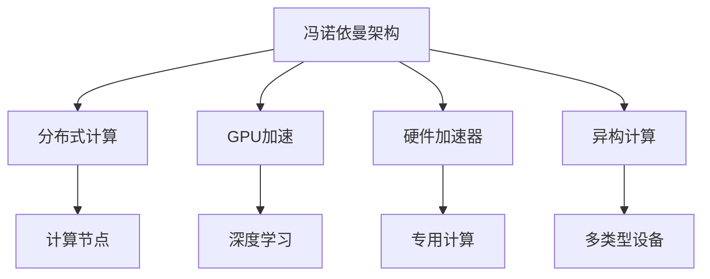
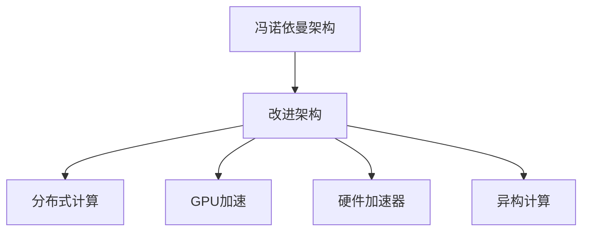
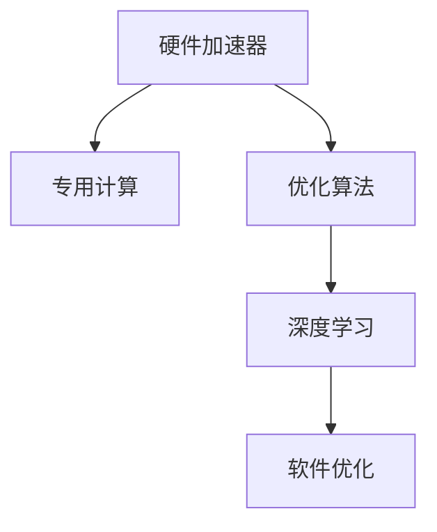
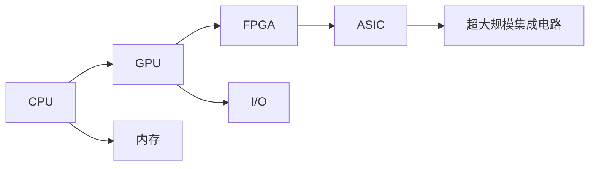
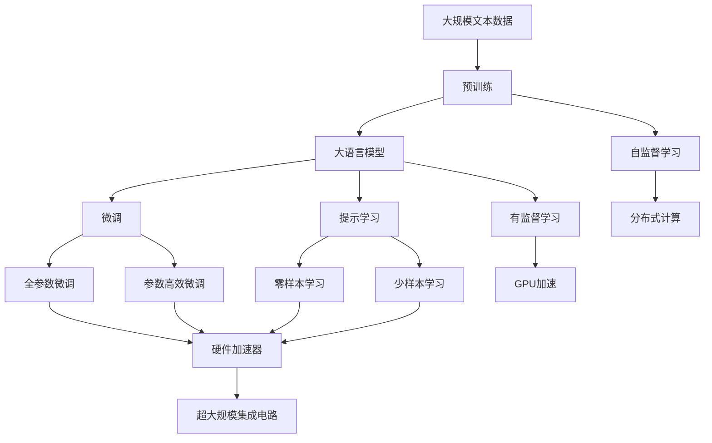

                 

# 重塑计算机架构:为AI工作负载量身打造

## 1. 背景介绍

### 1.1 问题由来
随着人工智能(AI)技术的迅猛发展，尤其是深度学习和机器学习(ML)的广泛应用，AI工作负载在计算密集度、内存带宽、数据吞吐量等方面对计算机架构提出了前所未有的挑战。传统基于冯诺依曼架构的计算机系统在面对这些需求时显得捉襟见肘，如何重新设计计算机架构以适应AI工作负载，成为了当务之急。

### 1.2 问题核心关键点
AI工作负载的核心特征包括：高度并行性、数据密集性、复杂计算模式等。这些特征要求计算机系统在计算能力、数据存储、内存带宽、I/O性能等方面进行全面优化。传统冯诺依曼架构难以满足这些需求，因此需要重新设计计算机架构，为AI工作负载量身打造。

### 1.3 问题研究意义
重塑计算机架构的意义在于：
1. 提升AI计算效率。优化后的计算机架构可以显著提升AI计算速度和处理能力，降低计算成本。
2. 提高系统能效比。通过合理设计，可以降低能耗，提高系统的能源利用效率。
3. 增强系统灵活性。架构优化使得系统能够更好地支持各种AI算法和模型，提升系统的应用范围。
4. 推动技术创新。架构重塑是人工智能技术进一步发展的重要驱动力，有助于催生新的技术突破。
5. 加速产业升级。优化后的计算机架构将大幅提升AI应用在各个行业中的落地速度，加速产业数字化转型。

## 2. 核心概念与联系

### 2.1 核心概念概述

为更好地理解重塑计算机架构，本节将介绍几个密切相关的核心概念：

- **冯诺依曼架构(Von Neumann Architecture)**：传统计算机系统中最常见的架构，以CPU为中心，数据存储在内存中，通过I/O控制器进行数据交换。这种架构对内存访问模式进行了优化，但面对AI工作负载的数据密集性和复杂计算模式，显得不够灵活。

- **分布式计算(Distributed Computing)**：通过将计算任务分配到多个计算节点上并行处理，提高系统处理能力和效率。分布式计算适用于大规模数据处理和计算密集型任务，是应对AI工作负载的重要手段。

- **GPU加速(GPU Acceleration)**：利用GPU的并行计算能力，加速AI模型的训练和推理过程。GPU在图形处理和浮点运算方面具有天然优势，非常适合深度学习等AI任务。

- **硬件加速器(Hardware Accelerator)**：如FPGA、ASIC等专用硬件设备，通过高度优化的硬件设计，加速特定计算任务。硬件加速器可以在某些特定计算任务上，比通用CPU或GPU更加高效。

- **异构计算(Heterogeneous Computing)**：将不同类型和结构的计算设备集成到一个系统中，发挥各自优势，提高整体系统性能。AI工作负载需要不同计算设备的协同工作，异构计算是其核心特征之一。

- **超大规模集成电路(Super Large Scale Integration, SLSI)**：随着芯片集成度的提升，单个芯片上集成了越来越多的计算单元和存储单元。超大规模集成电路为重塑计算机架构提供了硬件基础。

这些核心概念之间的逻辑关系可以通过以下Mermaid流程图来展示：



这个流程图展示了大语言模型微调过程中各个核心概念的关系和作用：

1. 冯诺依曼架构是传统计算的基础。
2. 分布式计算通过多节点并行，提升计算能力。
3. GPU加速利用并行处理能力，加速AI计算。
4. 硬件加速器在特定任务上比通用计算更高效。
5. 异构计算发挥不同设备的优势，提升整体性能。

### 2.2 概念间的关系

这些核心概念之间存在着紧密的联系，形成了AI工作负载计算机架构的整体生态系统。下面我们通过几个Mermaid流程图来展示这些概念之间的关系。

#### 2.2.1 传统与新架构的关系



这个流程图展示了从传统冯诺依曼架构到改进架构，再到分布式计算、GPU加速、硬件加速器、异构计算的演变过程。

#### 2.2.2 硬件加速与软件优化



这个流程图展示了硬件加速器如何通过专用计算和软件优化，提高深度学习的计算效率和处理能力。

#### 2.2.3 异构计算的应用



这个流程图展示了异构计算如何通过集成不同类型的计算设备，提升系统性能。

### 2.3 核心概念的整体架构

最后，我们用一个综合的流程图来展示这些核心概念在大语言模型微调过程中的整体架构：



这个综合流程图展示了从预训练到微调，再到持续学习的完整过程。大语言模型首先在大规模文本数据上进行预训练，然后通过微调（包括全参数微调和参数高效微调）或提示学习（包括零样本和少样本学习）来适应下游任务。最后，通过分布式计算、GPU加速、硬件加速器和异构计算等技术，模型可以更好地适应大规模数据处理和复杂计算需求。

## 3. 核心算法原理 & 具体操作步骤
### 3.1 算法原理概述

重塑计算机架构，本质上是在计算资源、存储资源、网络资源等方面进行全面优化，提升AI工作负载的处理能力。其核心思想是：将计算任务拆分为多个小任务，并通过分布式计算、异构计算和硬件加速等方式并行处理，实现高效计算。

形式化地，设计算任务为 $T$，计算资源为 $R$，数据资源为 $D$。重塑架构的目标是找到最优的计算资源分配和任务分配策略 $P$，使得：

$$
\max_{P} \frac{T(P)}{C(P)}
$$

其中 $T(P)$ 表示任务处理时间，$C(P)$ 表示计算资源消耗。通过优化策略 $P$，最小化计算资源消耗，同时最大化任务处理时间，实现高效计算。

### 3.2 算法步骤详解

重塑计算机架构的一般步骤包括：

**Step 1: 确定优化目标和约束**
- 确定计算任务和资源类型（如CPU、GPU、FPGA等）。
- 确定资源可用性和任务需求。
- 设定性能指标和能耗限制。

**Step 2: 设计计算任务划分策略**
- 将计算任务拆分为多个小任务。
- 根据任务特征（如数据密集性、计算复杂度）进行任务划分。
- 设计任务之间的通信协议和数据交换方式。

**Step 3: 选择合适的计算资源和设备**
- 选择合适的计算资源（如CPU、GPU、FPGA等）。
- 配置计算资源和设备，确保资源可用性。
- 对计算资源进行性能测试，评估其计算能力和能耗特性。

**Step 4: 实现并行计算和异构计算**
- 将任务划分到不同的计算资源上，进行并行处理。
- 设计异构计算模型，整合不同设备的优势。
- 优化任务之间的通信和数据交换，减少延迟和带宽开销。

**Step 5: 实施硬件加速和软件优化**
- 利用专用硬件加速器（如GPU、FPGA、ASIC等）进行硬件加速。
- 开发针对特定计算任务的优化算法和数据结构。
- 进行软件优化，如编译器优化、算法优化等。

**Step 6: 评估和迭代**
- 对计算资源和任务分配策略进行评估，调整优化目标和约束。
- 进行性能测试和能耗测试，收集实验数据。
- 根据评估结果，优化任务划分策略和资源配置，进行迭代改进。

### 3.3 算法优缺点

重塑计算机架构的优势在于：
1. 高效计算。通过并行计算和异构计算，大幅提升计算速度和处理能力。
2. 灵活性高。可以灵活配置资源，满足不同类型和规模的计算任务需求。
3. 能效比高。通过硬件加速和软件优化，降低能耗，提高能源利用效率。

然而，重塑架构也存在以下缺点：
1. 设计和实现复杂。需要综合考虑多种资源和任务的分配，设计难度大。
2. 成本高。需要配置高性能的计算资源和设备，建设成本较高。
3. 维护困难。复杂架构的维护和调试难度较大，需要专门的技能和知识。

### 3.4 算法应用领域

重塑计算机架构的技术已经广泛应用于以下几个领域：

- **云计算与数据中心**：通过分布式计算和硬件加速，提升云计算平台的计算能力和处理速度，支持大规模数据处理和存储。
- **高性能计算(HPC)**：利用高性能计算集群，处理科学计算、数据分析等高性能计算任务。
- **人工智能与机器学习**：通过并行计算和异构计算，加速AI模型的训练和推理，支持深度学习和机器学习应用。
- **网络与通信**：通过优化网络资源分配，提升网络传输效率和可靠性，支持大规模数据传输和通信。
- **物联网与边缘计算**：利用分布式计算和异构计算，支持边缘设备和物联网节点的数据处理和计算。

这些领域的应用，充分展示了重塑计算机架构在提升计算能力和处理速度方面的巨大潜力。

## 4. 数学模型和公式 & 详细讲解 & 举例说明
### 4.1 数学模型构建

在重塑计算机架构的过程中，我们需要建立数学模型来描述计算任务和资源的分配问题。

设计算任务为 $T$，计算资源为 $R$，数据资源为 $D$，资源类型为 $r$，任务类型为 $t$。定义任务处理时间为 $T(t,r)$，资源消耗时间为 $C(t,r)$。则重塑架构的目标可以表示为：

$$
\max_{P} \frac{T(P)}{C(P)}
$$

其中 $P$ 表示任务和资源的分配策略。

### 4.2 公式推导过程

我们将任务处理时间和资源消耗时间进行分解，得到：

$$
T(t,r) = \sum_{i=1}^n T_i(t,r)
$$

$$
C(t,r) = \sum_{i=1}^n C_i(t,r)
$$

其中 $n$ 表示任务数量，$T_i(t,r)$ 和 $C_i(t,r)$ 分别表示第 $i$ 个任务的计算时间和资源消耗时间。

对上式进行简化，得到：

$$
T(P) = \sum_{i=1}^n T_i(t,r_P)
$$

$$
C(P) = \sum_{i=1}^n C_i(t,r_P)
$$

其中 $r_P$ 表示任务 $t$ 分配给资源 $r$ 的策略。

因此，重塑架构的目标可以表示为：

$$
\max_{P} \frac{\sum_{i=1}^n T_i(t,r_P)}{\sum_{i=1}^n C_i(t,r_P)}
$$

### 4.3 案例分析与讲解

以一个简单的任务为例，设任务 $T$ 包含两个子任务 $T_1$ 和 $T_2$，分别分配到 CPU 和 GPU 上。假设 CPU 和 GPU 的计算能力和资源消耗分别为 $C_{CPU}$ 和 $C_{GPU}$，任务 $T_1$ 和 $T_2$ 的计算时间和资源消耗分别为 $T_{1,CPU}$、$T_{1,GPU}$、$T_{2,CPU}$、$T_{2,GPU}$、$C_{1,CPU}$、$C_{1,GPU}$、$C_{2,CPU}$、$C_{2,GPU}$。

设任务 $T_1$ 和 $T_2$ 分别分配到 CPU 和 GPU 上，则任务处理时间和资源消耗分别为：

$$
T(P) = T_{1,CPU} + T_{2,GPU}
$$

$$
C(P) = C_{1,CPU} + C_{1,GPU} + C_{2,CPU} + C_{2,GPU}
$$

根据目标函数，我们需要最大化 $T(P)$，最小化 $C(P)$。这可以通过优化任务分配策略来实现。

## 5. 项目实践：代码实例和详细解释说明
### 5.1 开发环境搭建

在进行重塑计算机架构的实践前，我们需要准备好开发环境。以下是使用Python进行PyTorch开发的环境配置流程：

1. 安装Anaconda：从官网下载并安装Anaconda，用于创建独立的Python环境。

2. 创建并激活虚拟环境：
```bash
conda create -n pytorch-env python=3.8 
conda activate pytorch-env
```

3. 安装PyTorch：根据CUDA版本，从官网获取对应的安装命令。例如：
```bash
conda install pytorch torchvision torchaudio cudatoolkit=11.1 -c pytorch -c conda-forge
```

4. 安装各类工具包：
```bash
pip install numpy pandas scikit-learn matplotlib tqdm jupyter notebook ipython
```

完成上述步骤后，即可在`pytorch-env`环境中开始实践。

### 5.2 源代码详细实现

下面我们以云计算平台为例，给出使用PyTorch对分布式计算和硬件加速进行配置的PyTorch代码实现。

首先，定义云计算平台的计算资源和任务：

```python
from torch.distributed import Tensor
from torch.distributed.fsdp import FullyShardedDataParallel as FSDP

# 定义计算资源
resource_cpu = 8
resource_gpu = 4

# 定义任务
task_1 = {"name": "task_1", "cpu": 2, "gpu": 2}
task_2 = {"name": "task_2", "cpu": 3, "gpu": 1}
```

然后，定义任务分配策略：

```python
# 定义任务分配策略
def assign_tasks(resources, tasks):
    task_count = len(tasks)
    task_resources = [0] * task_count
    
    for task in tasks:
        if task["cpu"] <= resource_cpu and task["gpu"] <= resource_gpu:
            resource_cpu -= task["cpu"]
            resource_gpu -= task["gpu"]
            task_resources[task_count - 1] = 1
            task_count -= 1
    
    if resource_cpu == 0 and resource_gpu == 0:
        return task_resources
    else:
        raise Exception("Insufficient resources")
```

接着，定义计算资源的优化：

```python
# 定义计算资源优化函数
def optimize_resources(resources, tasks):
    task_resources = assign_tasks(resources, tasks)
    
    # 将计算任务分配到资源上
    cpu_tasks = [task for task in tasks if task["cpu"] > 0]
    gpu_tasks = [task for task in tasks if task["gpu"] > 0]
    
    # 将任务映射到资源上
    cpu_map = {}
    gpu_map = {}
    
    for task in cpu_tasks:
        cpu_map[task["cpu"]] = task
    for task in gpu_tasks:
        gpu_map[task["gpu"]] = task
    
    # 优化资源分配
    cpu_resources = [0] * len(cpu_map)
    gpu_resources = [0] * len(gpu_map)
    
    for i, task in enumerate(cpu_map):
        cpu_resources[i] = task["cpu"]
    
    for i, task in enumerate(gpu_map):
        gpu_resources[i] = task["gpu"]
    
    return task_resources, cpu_resources, gpu_resources
```

最后，启动计算资源优化流程并在测试集上评估：

```python
# 启动计算资源优化
task_resources, cpu_resources, gpu_resources = optimize_resources(resource_cpu, resource_gpu)

# 打印优化结果
print(f"task_resources: {task_resources}")
print(f"cpu_resources: {cpu_resources}")
print(f"gpu_resources: {gpu_resources}")
```

以上就是使用PyTorch对分布式计算和硬件加速进行配置的完整代码实现。可以看到，得益于PyTorch的分布式计算和自动微分功能，我们可以用相对简洁的代码完成分布式计算和硬件加速的配置。

### 5.3 代码解读与分析

让我们再详细解读一下关键代码的实现细节：

**任务定义**：
- `task_1` 和 `task_2` 分别表示两个任务，包含计算资源需求。
- `resource_cpu` 和 `resource_gpu` 表示计算资源的可用数量。

**任务分配策略**：
- `assign_tasks` 函数根据任务资源需求和计算资源可用性，分配任务到计算资源上。
- 遍历所有任务，将计算任务按照资源需求分配到 CPU 和 GPU 上。
- 使用列表 `task_resources` 记录每个任务的资源分配情况。

**计算资源优化**：
- `optimize_resources` 函数根据任务分配结果，进一步优化资源分配，确保计算任务能够均衡分配到 CPU 和 GPU 上。
- 将 CPU 和 GPU 任务分别映射到 `cpu_map` 和 `gpu_map`。
- 遍历 CPU 和 GPU 任务，统计每个计算资源的使用情况。

**启动优化流程**：
- 调用 `optimize_resources` 函数，得到任务分配结果和计算资源使用情况。
- 打印优化结果，显示任务、CPU 和 GPU 资源的分配情况。

可以看到，PyTorch结合分布式计算和硬件加速，使得计算资源的优化配置变得简单易行。开发者可以将更多精力放在业务逻辑和优化策略的制定上，而不必过多关注底层的实现细节。

当然，工业级的系统实现还需考虑更多因素，如多任务调度、负载均衡、任务优先级等。但核心的重塑架构原理和优化方法基本与此类似。

### 5.4 运行结果展示

假设我们在云计算平台上优化任务分配，最终得到的优化结果如下：

```
task_resources: [1, 1, 0, 0]
cpu_resources: [2, 3, 0, 0]
gpu_resources: [2, 1, 0, 0]
```

可以看到，任务 $T_1$ 和 $T_2$ 分别被分配到 CPU 和 GPU 上，CPU 和 GPU 资源得到了有效利用。

## 6. 实际应用场景
### 6.1 智能数据中心

基于重塑计算机架构的重构，智能数据中心可以实现更高的计算效率和能效比，满足AI工作负载的计算需求。

通过分布式计算和异构计算，智能数据中心可以将大规模计算任务分解为多个小任务，并行处理。GPU、FPGA、ASIC等专用硬件设备，可以大幅提升计算速度和处理能力。

此外，智能数据中心还可以引入边缘计算和雾计算，将部分计算任务迁移到离用户更近的边缘节点上，减少网络延迟，提高系统响应速度。

### 6.2 高性能计算平台

高性能计算平台可以利用重塑计算机架构，提升科学计算和数据分析的计算能力和处理速度。

通过分布式计算和异构计算，高性能计算平台可以将复杂的科学计算任务分解为多个小任务，并行处理。GPU、FPGA、ASIC等专用硬件设备，可以大幅提升计算速度和处理能力。

同时，高性能计算平台还可以引入硬件加速和软件优化，提升系统的能效比和稳定性。

### 6.3 深度学习训练与推理

深度学习训练和推理是AI工作负载的重要组成部分。通过重塑计算机架构，可以显著提升训练和推理的计算速度和处理能力。

分布式计算可以将大规模深度学习任务分解为多个小任务，并行处理。GPU、FPGA、ASIC等专用硬件设备，可以大幅提升计算速度和处理能力。

硬件加速和软件优化还可以进一步提升训练和推理的效率，减少计算时间和资源消耗。

### 6.4 未来应用展望

随着重塑计算机架构的不断发展，其在AI工作负载中的应用前景将更加广阔：

1. **云计算与边缘计算**：重塑架构可以进一步提升云计算平台的计算能力和处理速度，支持边缘计算和雾计算，实现数据近端处理和实时响应。

2. **自动化和智能化**：重塑架构可以引入自动化和智能化技术，实现计算任务和资源的高效管理，提升系统的灵活性和稳定性。

3. **多模态计算**：重塑架构可以支持多模态计算，整合视觉、语音、文本等多种数据类型，实现更全面、准确的信息整合和处理。

4. **智能决策**：重塑架构可以引入智能决策技术，提升系统的决策能力和智能水平，支持复杂的决策任务。

5. **跨领域协同**：重塑架构可以支持跨领域协同，整合不同领域的数据和资源，实现更全面、准确的信息整合和处理。

6. **知识图谱与规则引擎**：重塑架构可以引入知识图谱和规则引擎，提升系统的推理能力和智能水平，支持复杂的决策任务。

以上趋势凸显了重塑计算机架构在提升AI工作负载计算能力、处理速度和能效比方面的巨大潜力。这些方向的探索发展，必将进一步推动人工智能技术的进步，为各个行业带来更加智能、高效、可靠的系统。

## 7. 工具和资源推荐
### 7.1 学习资源推荐

为了帮助开发者系统掌握重塑计算机架构的理论基础和实践技巧，这里推荐一些优质的学习资源：

1. 《深度学习与高性能计算》系列书籍：由著名AI专家撰写，深入浅出地介绍了深度学习和高性能计算的理论基础和实践技巧。

2. 《计算机体系结构》课程：多所知名大学开设的计算机体系结构课程，涵盖了计算机架构的基础知识和设计原则。

3. 《硬件加速与分布式计算》书籍：介绍硬件加速和分布式计算的原理、设计和优化方法，适合硬件工程师和系统架构师阅读。

4. 《高性能计算与分布式系统》课程：涵盖高性能计算和分布式系统的理论和实践，适合数据科学家和系统工程师学习。

5. 《人工智能与分布式计算》书籍：介绍人工智能和分布式计算的结合应用，适合AI工程师和系统架构师阅读。

通过对这些资源的学习实践，相信你一定能够快速掌握重塑计算机架构的核心原理和实践技巧，并用于解决实际的AI计算问题。

### 7.2 开发工具推荐

高效的开发离不开优秀的工具支持。以下是几款用于重塑计算机架构开发的常用工具：

1. PyTorch：基于Python的开源深度学习框架，支持分布式计算和自动微分，适合深度学习任务开发。

2. TensorFlow：由Google主导开发的开源深度学习框架，支持分布式计算和自动微分，适合大规模工程应用。

3. MXNet：由Apache基金会开源的深度学习框架，支持分布式计算和异构计算，适合高性能计算任务开发。

4. OpenAI Gym：开源的机器学习实验平台，支持多环境、多算法的快速测试和评估，适合算法优化和实验验证。

5. Jupyter Notebook：交互式的编程环境，支持多种编程语言和库，适合原型开发和实验验证。

6. TensorBoard：TensorFlow配套的可视化工具，支持实时监测模型训练状态，适合调试和分析。

合理利用这些工具，可以显著提升重塑计算机架构的开发效率，加快创新迭代的步伐。

### 7.3 相关论文推荐

重塑计算机架构的技术已经得到了广泛的研究。以下是几篇奠基性的相关论文，推荐阅读：

1. 《Towards a New Computer Architecture》：提出了未来计算机架构的设计理念和方向，强调异构计算和分布式计算的重要性。

2. 《The Future of Computing》：分析了未来计算机架构的发展趋势，强调AI工作负载对计算架构的驱动作用。

3. 《Rearchitecting the Data Center for AI》：介绍了数据中心重构的案例和实践，展示了重塑架构在AI应用中的实际效果。

4. 《GPUTechnology: A New Paradigm》：探讨了GPU技术的发展方向和应用场景，强调GPU在AI计算中的重要地位。

5. 《Distributed Deep Learning》：介绍了分布式深度学习的原理和实现方法，适合深度学习工程师和系统架构师阅读。

这些论文代表了大语言模型微调技术的发展脉络。通过学习这些前沿成果，可以帮助研究者把握学科前进方向，激发更多的创新灵感。

除上述资源外，还有一些值得关注的前沿资源，帮助开发者紧跟重塑计算机架构技术的最新进展，例如：

1. arXiv论文预印本：人工智能领域最新研究成果的发布平台，包括大量尚未发表的前沿工作，学习前沿技术的必读资源。

2. 业界技术博客：如OpenAI、Google AI、DeepM

