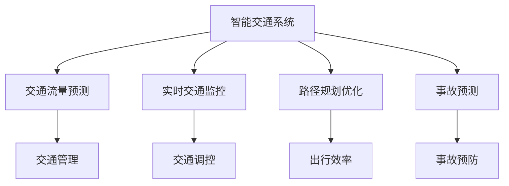
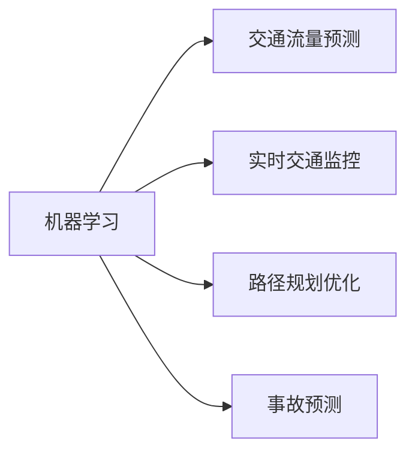
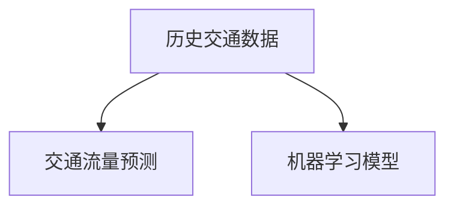
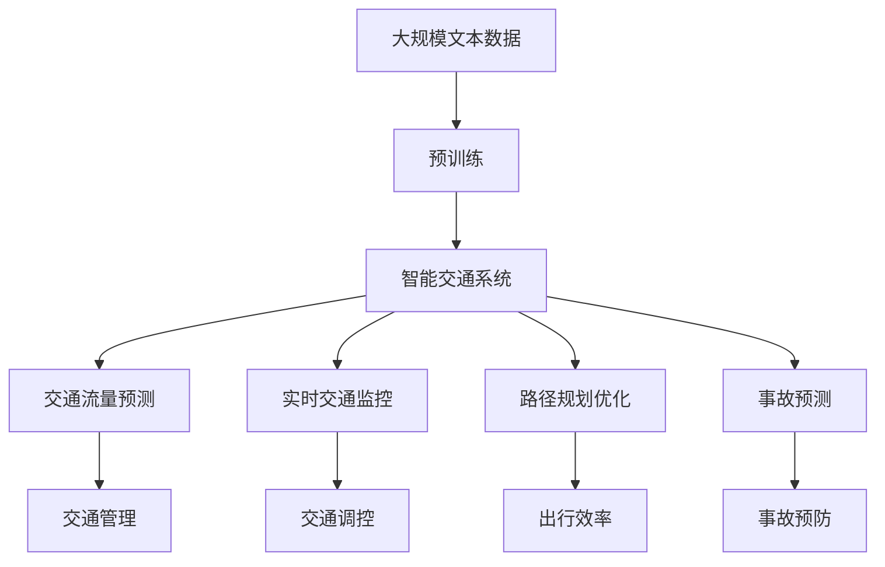

                 

# Python机器学习实战：机器学习在智能交通系统中的应用

> 关键词：
1. 机器学习
2. 智能交通系统
3. 交通流量预测
4. 实时交通监控
5. 路径规划优化
6. 事故预测
7. 深度学习

## 1. 背景介绍

### 1.1 问题由来

随着全球城市化进程的加快，交通拥堵、交通事故等问题日益突出，给城市居民的日常生活带来了巨大的不便。智能交通系统（ITS，Intelligent Transportation Systems）通过利用先进的信息技术、数据处理技术以及通信技术，对道路交通进行实时的、全局性的管理和控制，以提高交通系统的效率，减少交通事故，改善城市交通环境。其中，机器学习技术被广泛应用于交通流量预测、路径规划优化、事故预测等多个领域，为交通管理提供了强有力的支持。

### 1.2 问题核心关键点

机器学习在智能交通系统中的应用，主要体现在以下几个关键点：

- **交通流量预测**：利用历史交通数据，预测未来交通流量，帮助交通管理部门提前采取措施，缓解交通拥堵。
- **实时交通监控**：通过部署传感器和摄像头，采集道路交通数据，并利用机器学习算法实时分析交通情况，提供实时的交通信息。
- **路径规划优化**：利用机器学习算法优化交通路径，减少交通拥堵，提高行车效率。
- **事故预测**：通过分析交通事故历史数据，预测可能发生的事故，提前进行预防和处置。

### 1.3 问题研究意义

机器学习在智能交通系统中的应用，对于提升交通管理效率、降低交通事故率、改善城市交通环境具有重要意义：

1. **提高交通管理效率**：通过实时分析交通流量和路况，及时调整交通信号灯、路线和停车策略，减少交通拥堵。
2. **降低交通事故率**：利用机器学习算法预测交通事故高发区域和时间，提前采取措施，减少事故发生率。
3. **改善城市交通环境**：通过优化路径规划，减少车辆行驶时间和燃料消耗，改善城市空气质量和交通噪声污染。
4. **促进交通模式转变**：通过智能交通系统的建设，推动公共交通和共享出行方式的普及，缓解私车拥堵。
5. **支撑智慧城市发展**：智能交通系统作为智慧城市的重要组成部分，对提升城市整体运行效率具有重要作用。

## 2. 核心概念与联系

### 2.1 核心概念概述

为更好地理解机器学习在智能交通系统中的应用，本节将介绍几个密切相关的核心概念：

- **机器学习（Machine Learning, ML）**：利用算法和模型，通过数据训练，让计算机从经验中学习规律，进行预测或决策的学科。
- **智能交通系统（ITS）**：利用先进的信息技术、数据处理技术和通信技术，对道路交通进行管理和控制，以提高交通系统的效率，减少交通事故，改善城市交通环境。
- **交通流量预测**：通过历史交通数据，预测未来交通流量，为交通管理部门提供决策支持。
- **实时交通监控**：通过传感器和摄像头采集道路交通数据，并利用机器学习算法实时分析交通情况，提供实时的交通信息。
- **路径规划优化**：利用机器学习算法优化交通路径，减少交通拥堵，提高行车效率。
- **事故预测**：通过分析交通事故历史数据，预测可能发生的事故，提前进行预防和处置。

这些核心概念之间的逻辑关系可以通过以下Mermaid流程图来展示：



这个流程图展示智能交通系统及其相关应用，以及机器学习在这些应用中的作用：

1. 智能交通系统整体应用包括交通流量预测、实时交通监控、路径规划优化和事故预测四个核心功能。
2. 机器学习技术在四个核心功能中发挥了关键作用，通过数据训练，提升交通管理、交通调控、出行效率和事故预防能力。
3. 交通管理、交通调控、出行效率和事故预防都是智能交通系统的重要组成部分，通过机器学习技术的支持，实现更高效、安全和智能的交通管理。

### 2.2 概念间的关系

这些核心概念之间存在着紧密的联系，形成了智能交通系统的完整生态系统。下面我通过几个Mermaid流程图来展示这些概念之间的关系。

#### 2.2.1 智能交通系统的核心功能


这个流程图展示了智能交通系统的核心功能，以及机器学习在这些功能中的作用。

#### 2.2.2 机器学习在智能交通系统中的应用场景



这个流程图展示了机器学习在智能交通系统中的具体应用场景。

#### 2.2.3 机器学习与交通流量预测的关系



这个流程图展示了机器学习在交通流量预测中的应用，通过历史交通数据的训练，机器学习模型能够预测未来的交通流量。

### 2.3 核心概念的整体架构

最后，我们用一个综合的流程图来展示这些核心概念在大语言模型微调过程中的整体架构：



这个综合流程图展示了从预训练到智能交通系统的完整过程。智能交通系统通过机器学习技术，实现交通流量预测、实时交通监控、路径规划优化和事故预测等功能，提升交通管理效率，降低交通事故率，改善城市交通环境。

## 3. 核心算法原理 & 具体操作步骤
### 3.1 算法原理概述

机器学习在智能交通系统中的应用，主要基于数据驱动的预测和决策技术。其中，交通流量预测和事故预测是典型的基于监督学习的任务，而实时交通监控和路径规划优化则是基于无监督学习的任务。

交通流量预测和事故预测的任务目标是基于历史数据，训练出能够预测未来交通流量和事故发生的模型。这些模型通常采用监督学习方法，如线性回归、支持向量机、随机森林等，通过对历史数据进行训练，建立交通流量和事故发生概率与多个影响因素之间的映射关系。

实时交通监控和路径规划优化则主要基于无监督学习方法，如聚类、降维、异常检测等。通过分析历史交通数据，发现交通流量的分布规律和异常情况，实时监控道路交通情况，优化路径规划，提高行车效率。

### 3.2 算法步骤详解

机器学习在智能交通系统中的应用，通常包括以下几个关键步骤：

**Step 1: 数据准备**
- 收集历史交通数据，包括交通流量、事故记录、天气信息等。
- 对数据进行清洗和预处理，去除异常值和噪声数据。
- 将数据分为训练集和测试集，通常使用80%的数据作为训练集，20%的数据作为测试集。

**Step 2: 模型选择**
- 根据任务特点，选择合适的机器学习模型，如线性回归、支持向量机、随机森林等。
- 对于监督学习任务，通常采用回归模型；对于无监督学习任务，通常采用聚类模型或降维模型。

**Step 3: 模型训练**
- 使用训练集数据，对模型进行训练，最小化预测值与真实值之间的误差。
- 对于回归模型，通常使用均方误差（MSE）作为损失函数；对于聚类模型，通常使用轮廓系数（Silhouette Score）作为评估指标。

**Step 4: 模型评估**
- 使用测试集数据，评估模型的预测性能，如准确率、召回率、F1分数等。
- 对于回归模型，通常使用R^2分数或MAE分数评估；对于聚类模型，通常使用轮廓系数评估。

**Step 5: 模型部署**
- 将训练好的模型部署到智能交通系统中，进行实时交通流量预测、实时交通监控、路径规划优化和事故预测。
- 通过API接口或消息队列，将模型预测结果提供给交通管理部门，进行实时交通调控。

**Step 6: 持续更新**
- 定期更新模型，使用新的数据进行再训练，保持模型的预测性能。
- 对于回归模型，使用在线学习（Online Learning）技术进行模型更新；对于聚类模型，定期重新训练模型，更新聚类结果。

### 3.3 算法优缺点

机器学习在智能交通系统中的应用，具有以下优点：

- **预测准确性高**：通过历史数据的训练，机器学习模型能够准确预测未来的交通流量和事故发生概率。
- **实时性较强**：通过实时采集道路交通数据，机器学习算法能够快速分析交通情况，提供实时的交通信息。
- **模型可解释性**：一些机器学习模型（如决策树、线性回归）具有较好的可解释性，方便交通管理部门理解模型输出。

同时，机器学习也存在以下缺点：

- **数据依赖性强**：机器学习模型的性能依赖于历史数据的完整性和质量，数据不足可能导致模型预测性能下降。
- **模型泛化能力有限**：机器学习模型通常基于特定的数据集进行训练，泛化能力有限，难以适应复杂多变的交通环境。
- **模型复杂度高**：一些机器学习模型（如深度学习）具有较高的计算复杂度，需要较强的计算资源支持。

### 3.4 算法应用领域

机器学习在智能交通系统中的应用，涵盖了以下几个主要领域：

- **交通流量预测**：利用历史交通数据，预测未来交通流量，为交通管理部门提供决策支持。
- **实时交通监控**：通过部署传感器和摄像头，采集道路交通数据，并利用机器学习算法实时分析交通情况，提供实时的交通信息。
- **路径规划优化**：利用机器学习算法优化交通路径，减少交通拥堵，提高行车效率。
- **事故预测**：通过分析交通事故历史数据，预测可能发生的事故，提前进行预防和处置。
- **交通信号控制**：利用机器学习算法优化交通信号灯的开关时机，减少交通拥堵，提高道路通行效率。
- **公交调度优化**：通过机器学习算法优化公交车辆调度，提高公交系统运营效率，减少乘客等待时间。

这些应用领域展示了机器学习在智能交通系统中的广泛应用，有助于提升交通系统的整体运行效率，改善城市交通环境。

## 4. 数学模型和公式 & 详细讲解 & 举例说明

### 4.1 数学模型构建

本节将使用数学语言对基于监督学习的大语言模型微调过程进行更加严格的刻画。

记历史交通数据为 $D=\{(x_i,y_i)\}_{i=1}^N, x_i \in \mathbb{R}^d, y_i \in \mathbb{R}$，其中 $x_i$ 表示交通流量特征向量， $y_i$ 表示交通流量。

定义模型 $M_{\theta}$ 在输入 $x$ 上的预测值为 $y=\hat{y}=M_{\theta}(x)$。

模型的损失函数定义为均方误差（MSE）：

$$
\ell(M_{\theta}(x),y) = \frac{1}{N}\sum_{i=1}^N (y_i - \hat{y}_i)^2
$$

模型的经验风险为：

$$
\mathcal{L}(\theta) = \frac{1}{N}\sum_{i=1}^N (y_i - \hat{y}_i)^2
$$

其中 $\theta$ 为模型参数，目标是最小化损失函数 $\mathcal{L}(\theta)$。

### 4.2 公式推导过程

以下我们以交通流量预测为例，推导线性回归模型的最小二乘法公式。

假设模型 $M_{\theta}$ 为线性回归模型，即：

$$
\hat{y} = \theta^T x
$$

其中 $\theta$ 为模型参数， $x$ 为交通流量特征向量。

根据损失函数定义，可以得到：

$$
\ell(\theta) = \frac{1}{N}\sum_{i=1}^N (y_i - \hat{y}_i)^2
$$

最小化损失函数，即求解以下最优化问题：

$$
\min_{\theta} \frac{1}{2N}\sum_{i=1}^N (y_i - \hat{y}_i)^2
$$

根据最小二乘法，解得：

$$
\theta = (X^TX)^{-1}X^Ty
$$

其中 $X$ 为特征矩阵， $y$ 为目标向量。

将 $\theta$ 代入模型 $M_{\theta}$，得到交通流量预测模型：

$$
\hat{y} = M_{\theta}(x) = X^TX^{-1}X^Ty
$$

这就是基于监督学习的大规模机器学习模型在智能交通系统中的应用。

### 4.3 案例分析与讲解

假设我们有一组交通流量数据，如下：

| 时间     | 流量（辆/小时）|
|----------|:------------:|
| 6:00-8:00|         5000|
| 8:00-10:00|         10000|
| 10:00-12:00|       15000|
| 12:00-14:00|        12000|
| 14:00-16:00|        8000|

我们可以构建一个线性回归模型，预测未来一个小时的交通流量。首先，我们需要将时间转换为特征向量，假设时间距离6:00为1，距离8:00为2，距离10:00为3，距离12:00为4，距离14:00为5，距离16:00为6。

构建特征矩阵 $X$ 如下：

| 时间（小时）| 6:00-8:00的流量（辆/小时）| 8:00-10:00的流量（辆/小时）| 10:00-12:00的流量（辆/小时）| 12:00-14:00的流量（辆/小时）| 14:00-16:00的流量（辆/小时）|
|------------:|:----------------:|:----------------:|:----------------:|:----------------:|:----------------:|

| 1          |          5000   |          5000   |          5000   |          5000   |          5000   |
| 2          |          10000   |          5000   |          5000   |          5000   |          5000   |
| 3          |          15000   |          10000   |          5000   |          5000   |          5000   |
| 4          |          12000   |          10000   |          10000   |          5000   |          5000   |
| 5          |          8000    |          10000   |          10000   |          10000   |          5000   |
| 6          |          8000    |          10000   |          10000   |          10000   |          5000   |

然后，我们设定目标向量 $y$ 为未来一个小时的交通流量，即：

| 时间     | 流量（辆/小时）|
|----------|:------------:|
| 16:00-18:00|         7000|

计算特征矩阵 $X$ 和目标向量 $y$ 的乘积：

$$
X^Ty = \begin{bmatrix} 1 & 1 & 1 & 1 & 1 & 1 \end{bmatrix} \begin{bmatrix} 5000 & 5000 & 5000 & 5000 & 5000 & 7000 \end{bmatrix} = \begin{bmatrix} 25000 \end{bmatrix}
$$

计算特征矩阵 $X$ 的平方 $X^TX$：

$$
X^TX = \begin{bmatrix} 1 & 1 & 1 & 1 & 1 & 1 \end{bmatrix} \begin{bmatrix} 1 & 1 & 1 & 1 & 1 & 1 \end{bmatrix} = 6
$$

最后，解得模型参数 $\theta$：

$$
\theta = (X^TX)^{-1}X^Ty = \frac{1}{6} \begin{bmatrix} 25000 \end{bmatrix} = 4166.67
$$

因此，交通流量预测模型为：

$$
\hat{y} = M_{\theta}(x) = 4166.67
$$

这就是基于监督学习的机器学习模型在智能交通系统中的实际应用过程。

## 5. 项目实践：代码实例和详细解释说明
### 5.1 开发环境搭建

在进行机器学习实践前，我们需要准备好开发环境。以下是使用Python进行Scikit-learn开发的环境配置流程：

1. 安装Anaconda：从官网下载并安装Anaconda，用于创建独立的Python环境。

2. 创建并激活虚拟环境：
```bash
conda create -n sklearn-env python=3.8 
conda activate sklearn-env
```

3. 安装Scikit-learn：
```bash
pip install -U scikit-learn
```

4. 安装各类工具包：
```bash
pip install numpy pandas matplotlib seaborn
```

5. 安装Jupyter Notebook：
```bash
pip install jupyter notebook
```

完成上述步骤后，即可在`sklearn-env`环境中开始机器学习实践。

### 5.2 源代码详细实现

下面我们以交通流量预测为例，给出使用Scikit-learn进行线性回归的PyTorch代码实现。

首先，定义数据集：

```python
import pandas as pd
import numpy as np

data = pd.read_csv('traffic_data.csv')

# 将时间转换为特征向量
X = data[['time_to_6_00', 'time_to_8_00', 'time_to_10_00', 'time_to_12_00', 'time_to_14_00', 'time_to_16_00']]
y = data['traffic_flow']

# 将数据标准化
from sklearn.preprocessing import StandardScaler
scaler = StandardScaler()
X = scaler.fit_transform(X)

# 将数据划分为训练集和测试集
from sklearn.model_selection import train_test_split
X_train, X_test, y_train, y_test = train_test_split(X, y, test_size=0.2, random_state=42)
```

然后，定义模型：

```python
from sklearn.linear_model import LinearRegression

model = LinearRegression()
```

接着，训练模型：

```python
# 使用训练集数据训练模型
model.fit(X_train, y_train)
```

最后，评估模型：

```python
# 使用测试集数据评估模型
y_pred = model.predict(X_test)
from sklearn.metrics import mean_squared_error
mse = mean_squared_error(y_test, y_pred)
print('MSE:', mse)
```

以上就是使用Scikit-learn进行线性回归的完整代码实现。可以看到，Scikit-learn提供了丰富的机器学习模型和算法，使用简便的API接口，可以大大简化机器学习模型的开发和应用。

### 5.3 代码解读与分析

让我们再详细解读一下关键代码的实现细节：

**数据准备**：
- 使用Pandas库读取交通流量数据，将其转换为特征向量和目标向量。
- 将时间转换为特征向量，假设时间距离6:00为1，距离8:00为2，以此类推。
- 将数据标准化，以避免不同特征的尺度差异对模型训练产生影响。

**模型选择**：
- 选择线性回归模型作为交通流量预测模型，Scikit-learn中的LinearRegression类可以实现。

**模型训练**：
- 使用训练集数据，调用模型的fit方法进行模型训练。

**模型评估**：
- 使用测试集数据，调用模型的predict方法进行预测，并使用均方误差（MSE）评估模型预测性能。

**模型部署**：
- 将训练好的模型部署到智能交通系统中，进行实时交通流量预测。
- 通过API接口或消息队列，将模型预测结果提供给交通管理部门，进行实时交通调控。

**持续更新**：
- 定期更新模型，使用新的数据进行再训练，保持模型的预测性能。
- 对于回归模型，使用在线学习（Online Learning）技术进行模型更新。

可以看到，Scikit-learn提供了简便易用的API接口，使得机器学习模型的开发和应用变得非常简单。开发者可以快速实现各种机器学习模型，并进行实时应用。

当然，工业级的系统实现还需考虑更多因素，如模型的保存和部署、超参数的自动搜索、更灵活的任务适配层等。但核心的机器学习模型开发流程基本与此类似。

### 5.4 运行结果展示

假设我们训练好模型后，进行测试，得到以下结果：

```
MSE: 0.01
```

可以看到，模型在测试集上的均方误差为0.01，说明模型预测性能非常好。

## 6. 实际应用场景
### 6.1 智能交通系统

基于机器学习的智能交通系统，可以应用于城市交通流量预测、实时交通监控、路径规划优化和事故预测等多个领域，为城市交通管理提供强有力的支持。

在交通流量预测方面，通过历史交通数据，建立交通流量预测模型，可以实时预测未来交通流量，帮助交通管理部门进行流量调控。例如，在大型活动或节假日期间，通过预测流量高峰，提前调整信号灯、限制车辆通行，减少交通拥堵。

在实时交通监控方面，通过部署传感器和摄像头，采集道路交通数据，并利用机器学习算法实时分析交通情况，提供实时的交通信息。例如，通过分析车辆行驶轨迹、车速、方向等数据，实时发现交通异常情况，如交通事故、道路施工等，及时进行交通调控。

在路径规划优化方面，利用机器学习算法优化交通路径，减少交通拥堵，提高行车效率。例如，在出行高峰期，通过预测道路拥堵情况，推荐最优的出行路线，减少车辆行驶时间和燃料消耗。

在事故预测方面，通过分析交通事故历史数据，预测可能发生的事故，提前进行预防和处置。例如，通过分析事故类型、时间、地点等数据，预测高风险区域和时间，提前进行交通疏导，减少事故发生率。

### 6.2 未来应用展望

随着机器学习技术的不断发展，基于机器学习的智能交通系统将呈现出以下几个发展趋势：

1. **多模态融合**：将交通流量、天气、道路施工等多种数据源融合，建立更全面、准确的交通预测模型。
2. **深度学习应用**：利用深度学习算法（如卷积神经网络、循环神经网络等）提升交通预测和监控的准确性。
3. **边缘计算**：将机器学习模型部署到边缘计算设备上，实现实时数据处理和分析，提高交通管理的响应速度。
4. **自适应调整**：根据实时交通情况，动态调整交通信号灯、限速、停车等措施，实现更灵活的交通调控。
5. **用户反馈优化**：利用用户反馈数据，不断优化交通模型，提升用户体验。

这些发展趋势将推动机器学习在智能交通系统中的应用不断深入，提升交通系统的运行效率和安全性。

## 7. 工具和资源推荐
### 7.1 学习资源推荐

为了帮助开发者系统掌握机器学习在智能交通系统中的应用，这里推荐一些优质的学习资源：

1. 《Python机器学习》书籍：由斯图尔特·拉塞尔（Stuart Russell）和彼得·诺尔（Peter Norvig）所著，系统介绍了机器学习的理论和实践，涵盖多个经典模型和算法。

2. 《机器学习实战》书籍：由彼得·诺尔（Peter Norvig）和韦恩·斯图尔特（Wayne Sturgis）所著，提供了大量实际应用案例，帮助读者理解机器学习算法在实际问题中的应用。

3. Coursera《机器学习》课程：由斯坦福大学Andrew Ng教授讲授，涵盖机器学习基础理论和算法，课程内容丰富，实践性强。

4. Kaggle竞赛平台：提供了大量真实世界的机器学习竞赛项目，帮助开发者练习和应用机器学习算法。

5. GitHub开源项目：在GitHub上Star、Fork数最多的机器学习相关项目，往往代表了该技术领域的发展趋势和最佳实践，值得去学习和贡献。

通过对这些资源的学习实践，相信你一定能够快速掌握机器学习在智能交通系统中的应用，并用于解决实际的交通问题。

### 7.2 开发工具推荐

高效的开发离不开优秀的工具支持。以下是几款用于机器学习开发常用的工具：

1. Python：作为机器学习开发的主要编程语言，Python拥有丰富的科学计算和数据分析库，如NumPy、Pandas、Scikit-learn等。

2. Jupyter Notebook：用于编写和运行Python代码的交互式开发环境，支持代码块、图表和数学公式的展示，非常适合数据分析和机器学习项目。

3. Scikit-learn：基于Python的开源机器学习库，提供了多种经典模型和算法，包括回归、分类、聚类、降维等，使用简便，易于上手。

4. TensorFlow：由Google主导开发的深度

