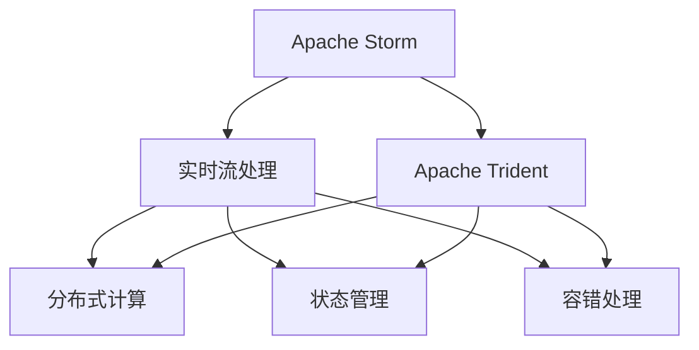
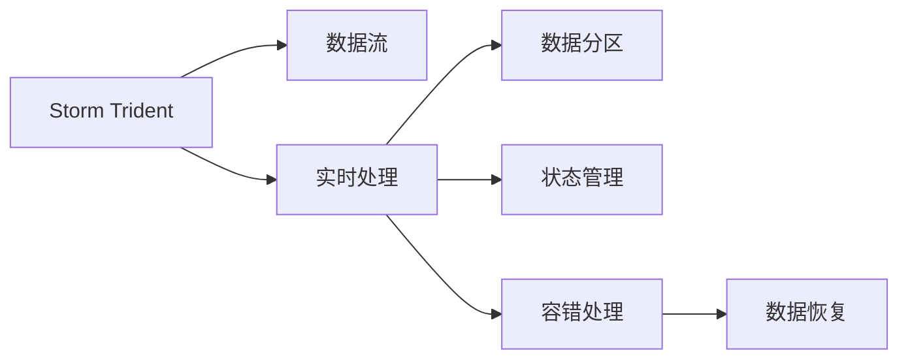
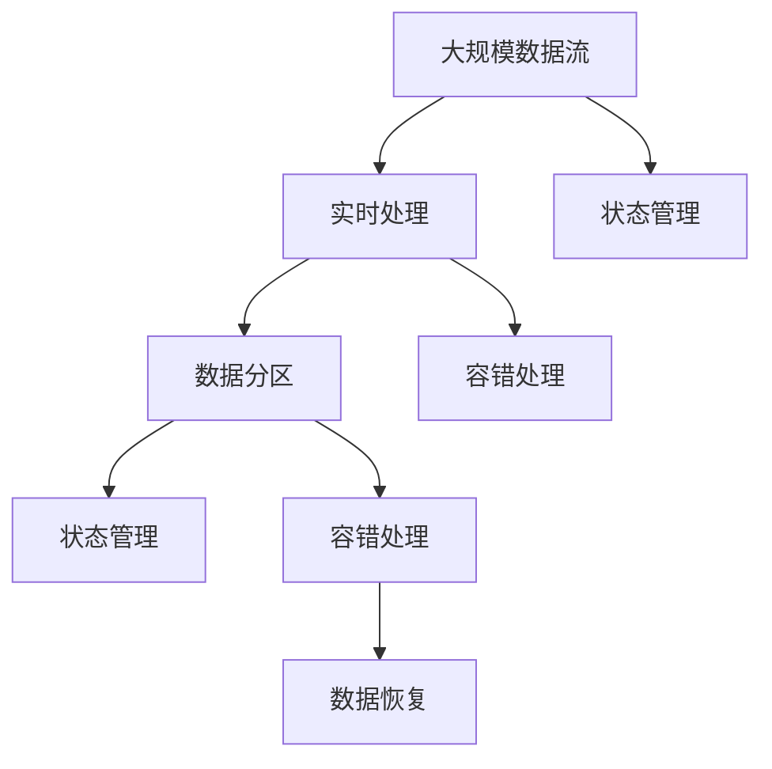

                 

## 1. 背景介绍

Storm Trident是一个基于Apache Storm的实时计算框架，用于处理海量流数据。它支持复杂的流式处理操作，如窗口、聚合、连接和分组，同时还提供了丰富的API，支持用户自定义的状态管理和容错处理。Storm Trident是Storm框架的重要组成部分，已经被广泛应用于互联网、金融、物流等多个领域。本文将从背景、概念、原理和应用等方面，全面介绍Storm Trident的原理与实现，并结合代码实例，详细讲解其使用方法。

### 1.1 问题由来

在现代互联网时代，数据的生成和处理速度呈指数级增长。如何高效地处理和分析海量流数据，成为数据科学家和工程师面临的一个巨大挑战。传统的批处理模式已经无法满足实时性要求，实时流处理框架应运而生。Apache Storm正是其中的佼佼者，其分布式流处理框架可以处理大规模实时数据流，具有高度的可扩展性和容错性。Storm Trident作为Storm框架的扩展，更是将实时流处理推向了新的高度，提供了更加强大和灵活的数据处理能力。

### 1.2 问题核心关键点

Storm Trident的核心关键点包括：
- 高性能：能够处理海量流数据，具有高吞吐量和低延迟的特点。
- 复杂处理：支持复杂的数据处理操作，如窗口、聚合、连接和分组等。
- 状态管理：支持分布式状态管理，保证数据的一致性和可靠性。
- 容错处理：提供强大的容错机制，确保系统的稳定性和可靠性。
- 丰富的API：提供丰富的API接口，支持用户自定义的状态管理和容错处理。

## 2. 核心概念与联系

### 2.1 核心概念概述

为了更好地理解Storm Trident的工作原理，我们需要先了解一些核心概念：

- Apache Storm：是一个开源的分布式实时计算系统，用于处理大规模实时数据流。
- Apache Trident：是Storm框架的一个扩展，用于处理海量流数据，支持复杂的流式处理操作，如窗口、聚合、连接和分组。
- 实时流处理：指对数据流进行实时处理，能够在数据产生时立即进行处理，具有高实时性和低延迟的特点。
- 分布式计算：通过分布式计算框架，将大规模任务分解成多个小任务，在不同的计算节点上并行处理，提高处理效率。
- 状态管理：指在数据处理过程中，将中间状态保存在分布式存储中，保证数据的一致性和可靠性。
- 容错处理：指在数据处理过程中，通过自动重试、日志记录和数据恢复等方式，确保系统的稳定性和可靠性。

这些核心概念之间的联系可以通过以下Mermaid流程图来展示：



这个流程图展示了几大核心概念之间的联系：
- Storm框架提供了实时流处理的能力，可以处理海量数据流。
- Storm Trident作为Storm的扩展，提供了复杂的流式处理操作。
- 分布式计算框架将大规模任务分解成多个小任务，在不同的节点上并行处理。
- 状态管理将中间状态保存在分布式存储中，保证数据的一致性和可靠性。
- 容错处理通过自动重试、日志记录等方式，确保系统的稳定性和可靠性。

### 2.2 概念间的关系

这些核心概念之间存在着紧密的联系，构成了Storm Trident的完整生态系统。下面我们通过几个Mermaid流程图来展示这些概念之间的关系。

#### 2.2.1 Storm Trident的工作流程



这个流程图展示了Storm Trident的工作流程：
- Storm Trident接收输入数据流。
- 实时处理数据流，执行窗口、聚合、连接等操作。
- 数据分区，将数据流分配到不同的计算节点上。
- 状态管理，将中间状态保存在分布式存储中。
- 容错处理，通过自动重试、日志记录等方式，确保系统的稳定性和可靠性。

#### 2.2.2 状态管理和容错处理的相互作用


这个流程图展示了状态管理和容错处理之间的相互作用：
- 状态管理将中间状态保存在分布式存储中。
- 容错处理通过自动重试、日志记录等方式，确保系统的稳定性和可靠性。
- 数据恢复，在系统故障后，通过状态管理保存的数据，重新计算丢失的数据。

### 2.3 核心概念的整体架构

最后，我们用一个综合的流程图来展示这些核心概念在大数据处理中的应用：



这个综合流程图展示了从大规模数据流到实时处理的完整过程：
- 大规模数据流进入Storm Trident系统。
- 实时处理数据流，执行窗口、聚合、连接等操作。
- 数据分区，将数据流分配到不同的计算节点上。
- 状态管理将中间状态保存在分布式存储中。
- 容错处理通过自动重试、日志记录等方式，确保系统的稳定性和可靠性。
- 数据恢复，在系统故障后，通过状态管理保存的数据，重新计算丢失的数据。

这些流程图展示了Storm Trident的工作流程和核心概念之间的联系，帮助我们更好地理解其原理和实现。

## 3. 核心算法原理 & 具体操作步骤
### 3.1 算法原理概述

Storm Trident的核心算法原理是基于实时流处理和分布式计算的。其主要思想是将大规模数据流分解成多个小任务，在不同的计算节点上并行处理，实现高效的数据处理和分析。Storm Trident的核心算法包括实时处理、数据分区、状态管理和容错处理等方面。

#### 3.1.1 实时处理

Storm Trident的核心特性是实时处理。其支持对数据流进行复杂的流式处理操作，如窗口、聚合、连接和分组等。具体实现方式如下：
- 窗口操作：将数据流分成多个窗口，对每个窗口内的数据进行处理，可以采用滑动窗口、固定窗口等方式。
- 聚合操作：对每个窗口内的数据进行聚合计算，可以采用求和、平均值、最大值等方式。
- 连接操作：将多个数据流连接起来，实现数据的关联和关联计算。
- 分组操作：将数据流按照某个字段进行分组，对每个分组内的数据进行聚合计算。

#### 3.1.2 数据分区

Storm Trident支持对数据流进行分区处理，即将数据流分配到多个计算节点上，实现并行处理。具体实现方式如下：
- 数据分区：将数据流按照某个字段进行分区，分配到不同的计算节点上。
- 并行处理：在不同的计算节点上并行处理数据流，提高处理效率。
- 数据合并：将各个计算节点上的数据合并，生成最终的结果。

#### 3.1.3 状态管理

Storm Trident支持分布式状态管理，将中间状态保存在分布式存储中，保证数据的一致性和可靠性。具体实现方式如下：
- 状态保存：将中间状态保存在分布式存储中，如Hadoop、Cassandra等。
- 状态恢复：在系统故障后，通过状态保存的数据，重新计算丢失的数据。
- 状态同步：在不同的计算节点上同步状态数据，保证数据的一致性。

#### 3.1.4 容错处理

Storm Trident支持强大的容错机制，通过自动重试、日志记录等方式，确保系统的稳定性和可靠性。具体实现方式如下：
- 自动重试：在系统故障后，自动重试任务执行，保证任务能够正常完成。
- 日志记录：记录任务执行的日志信息，便于排查问题。
- 数据恢复：在系统故障后，通过状态保存的数据，重新计算丢失的数据。

### 3.2 算法步骤详解

以下是对Storm Trident算法的详细步骤详解：

**Step 1: 准备数据源**

Storm Trident支持多种数据源，包括Kafka、HDFS、Hive等。具体实现方式如下：
- 配置数据源：通过配置文件指定数据源的类型、地址、端口等信息。
- 读取数据：通过Spout组件读取数据源中的数据，并将其输入到Storm Trident系统中。

**Step 2: 执行实时处理**

Storm Trident支持对数据流进行实时处理，执行窗口、聚合、连接等操作。具体实现方式如下：
- 定义拓扑结构：通过拓扑结构图定义数据流的处理流程，包括Spout、Bolt、Stream等组件。
- 配置Bolt组件：通过Bolt组件执行数据处理任务，包括窗口、聚合、连接等操作。
- 定义状态管理：通过状态管理器保存和恢复中间状态数据，保证数据的一致性和可靠性。

**Step 3: 实现容错处理**

Storm Trident支持强大的容错机制，通过自动重试、日志记录等方式，确保系统的稳定性和可靠性。具体实现方式如下：
- 配置容错策略：通过配置文件指定容错策略，如自动重试、日志记录等。
- 实现数据恢复：在系统故障后，通过状态保存的数据，重新计算丢失的数据。
- 实现自动重试：在系统故障后，自动重试任务执行，保证任务能够正常完成。

**Step 4: 输出结果**

Storm Trident支持将处理结果输出到多种数据源，包括Kafka、HDFS、Hive等。具体实现方式如下：
- 定义拓扑结构：通过拓扑结构图定义数据流的处理流程，包括Spout、Bolt、Stream等组件。
- 配置输出组件：通过Bolt组件将处理结果输出到目标数据源。
- 实现结果存储：将处理结果存储在目标数据源中，便于后续分析和应用。

### 3.3 算法优缺点

Storm Trident作为一种高性能的流处理框架，具有以下优点：
- 高性能：支持海量数据流处理，具有高吞吐量和低延迟的特点。
- 高可靠性：支持分布式状态管理和容错处理，保证数据的一致性和可靠性。
- 灵活性：支持复杂的流式处理操作，如窗口、聚合、连接和分组等。
- 扩展性：支持水平扩展，能够动态增加计算节点，提高处理能力。

同时，Storm Trident也存在以下缺点：
- 学习曲线陡峭：需要一定的学习成本，掌握其核心原理和实现细节。
- 资源消耗大：需要大量的计算资源，特别是在高并发和大数据场景下。
- 性能调优复杂：需要根据具体场景进行调优，优化其性能和资源利用率。

### 3.4 算法应用领域

Storm Trident广泛应用于互联网、金融、物流等多个领域，具体应用场景包括：
- 金融风险管理：实时监控交易数据，检测异常交易行为，防范金融风险。
- 实时数据处理：实时处理海量数据，进行数据清洗、聚合和分析等操作。
- 互联网数据分析：实时处理用户行为数据，进行用户行为分析、推荐系统等操作。
- 物流系统管理：实时处理物流数据，进行货物追踪、库存管理等操作。
- 实时监控：实时监控网络流量、日志等数据，进行异常检测和告警处理。

## 4. 数学模型和公式 & 详细讲解 & 举例说明

### 4.1 数学模型构建

Storm Trident的核心算法原理基于实时流处理和分布式计算的，其数学模型包括窗口操作、聚合操作、连接操作和分组操作等。

#### 4.1.1 窗口操作

窗口操作是一种将数据流划分为多个窗口的操作，对每个窗口内的数据进行处理。假设有N个数据项，T个窗口，每个窗口的大小为k，则窗口操作可以用以下公式表示：

$$
w_k = \sum_{i=0}^{k-1} x_i
$$

其中，$x_i$表示第i个窗口的数据项，$w_k$表示第k个窗口的数据项总和。

#### 4.1.2 聚合操作

聚合操作是一种对窗口内的数据进行聚合计算的操作。假设有N个数据项，T个窗口，每个窗口的大小为k，则聚合操作可以用以下公式表示：

$$
a_k = \frac{\sum_{i=0}^{k-1} w_i}{k}
$$

其中，$w_i$表示第i个窗口的数据项总和，$a_k$表示第k个窗口的聚合结果。

#### 4.1.3 连接操作

连接操作是一种将多个数据流连接起来的操作。假设有两个数据流A和B，每个数据流中有N个数据项，则连接操作可以用以下公式表示：

$$
c = \bigcup_{i=0}^{N-1} \{ (a_i, b_i) \}
$$

其中，$a_i$表示数据流A的第i个数据项，$b_i$表示数据流B的第i个数据项，$c$表示连接后的数据流。

#### 4.1.4 分组操作

分组操作是一种将数据流按照某个字段进行分组的操作。假设有N个数据项，T个分组字段，则分组操作可以用以下公式表示：

$$
g_t = \bigcup_{i=0}^{N-1} \{ (x_i, t) \}
$$

其中，$x_i$表示第i个数据项，$t$表示第i个数据项的分组字段，$g_t$表示按照分组字段t分组后的数据流。

### 4.2 公式推导过程

以下是对Storm Trident算法的公式推导过程的详细介绍：

**公式推导过程1: 窗口操作**

假设有N个数据项，T个窗口，每个窗口的大小为k，则窗口操作可以用以下公式表示：

$$
w_k = \sum_{i=0}^{k-1} x_i
$$

其中，$x_i$表示第i个窗口的数据项，$w_k$表示第k个窗口的数据项总和。

例如，对于输入数据流[1, 2, 3, 4, 5, 6, 7, 8, 9, 10]，窗口大小为3，则窗口操作的结果如下：

| 窗口k | 数据项 | 窗口总和 |
|-------|--------|---------|
| 0     | 1      | 1       |
| 1     | 2, 3   | 5       |
| 2     | 4, 5, 6 | 15      |
| 3     | 7, 8, 9 | 24      |
| 4     | 10     | 10      |

**公式推导过程2: 聚合操作**

假设有N个数据项，T个窗口，每个窗口的大小为k，则聚合操作可以用以下公式表示：

$$
a_k = \frac{\sum_{i=0}^{k-1} w_i}{k}
$$

其中，$w_i$表示第i个窗口的数据项总和，$a_k$表示第k个窗口的聚合结果。

例如，对于窗口操作的结果，使用聚合操作进行计算，得到如下结果：

| 窗口k | 窗口总和 | 聚合结果 |
|-------|---------|---------|
| 0     | 1       | 1       |
| 1     | 5       | 2.5     |
| 2     | 15      | 7.5     |
| 3     | 24      | 8       |
| 4     | 10      | 2.5     |

**公式推导过程3: 连接操作**

假设有两个数据流A和B，每个数据流中有N个数据项，则连接操作可以用以下公式表示：

$$
c = \bigcup_{i=0}^{N-1} \{ (a_i, b_i) \}
$$

其中，$a_i$表示数据流A的第i个数据项，$b_i$表示数据流B的第i个数据项，$c$表示连接后的数据流。

例如，对于输入数据流A=[1, 2, 3]和B=[4, 5, 6]，则连接操作的结果如下：

| A | B | 连接结果 |
|---|---|----------|
| 1 | 4 | (1, 4)   |
| 2 | 5 | (2, 5)   |
| 3 | 6 | (3, 6)   |

**公式推导过程4: 分组操作**

假设有N个数据项，T个分组字段，则分组操作可以用以下公式表示：

$$
g_t = \bigcup_{i=0}^{N-1} \{ (x_i, t) \}
$$

其中，$x_i$表示第i个数据项，$t$表示第i个数据项的分组字段，$g_t$表示按照分组字段t分组后的数据流。

例如，对于输入数据流[1, 2, 3, 4, 5, 6, 7, 8, 9, 10]，按照分组字段t=[2, 3]分组，则分组操作的结果如下：

| t | 分组结果 |
|---|----------|
| 2 | (2, 3, 4, 5, 6, 7, 8, 9, 10) |
| 3 | (1)      |

## 5. 项目实践：代码实例和详细解释说明

### 5.1 开发环境搭建

在进行Storm Trident项目实践前，我们需要准备好开发环境。以下是使用Java进行Storm Trident开发的环境配置流程：

1. 安装Apache Storm：从官网下载并安装Apache Storm，按照官方文档配置 Storm 集群环境。
2. 配置环境变量：在开发环境中设置必要的 Storm 相关变量，如Hadoop、Zookeeper 等。
3. 安装依赖包：下载并安装必要的依赖包，如JDK、Maven、Ant等。
4. 配置项目：创建一个新的Maven项目，并配置相关的依赖和插件。

完成上述步骤后，即可在开发环境中开始Storm Trident的实践。

### 5.2 源代码详细实现

以下是一个简单的Storm Trident项目示例，用于演示其基本原理和使用方法。

**示例项目：实时处理股票数据**

#### 5.2.1 数据源配置

首先，我们需要配置数据源，即Kafka数据流。具体实现方式如下：

```java
Configuration conf = new Configuration();
conf.set("storm.trident.stream.topics", "stock_data");
conf.set("storm.trident.kafka.bootstrap.servers", "localhost:9092");
conf.set("storm.trident.kafka.zookeeper", "localhost:2181");
conf.set("storm.trident.kafka.batch.size", "100");
conf.set("storm.trident.kafka.deserializer", "org.apache.storm.trident.kafka.KafkaDeserializer");
conf.set("storm.trident.kafka.consumer.commit.interval.ms", "500");
```

其中，`"storm.trident.stream.topics"`表示数据流的主题名称，`"storm.trident.kafka.bootstrap.servers"`表示Kafka服务器的地址，`"storm.trident.kafka.zookeeper"`表示Zookeeper地址，`"storm.trident.kafka.batch.size"`表示批量大小，`"storm.trident.kafka.deserializer"`表示Kafka数据解析器，`"storm.trident.kafka.consumer.commit.interval.ms"`表示消费者提交间隔时间。

#### 5.2.2 拓扑结构设计

接下来，我们需要设计拓扑结构，即定义数据流的处理流程。具体实现方式如下：

```java
Spout spout = new KafkaSpout(config, new String[] { "stock_data" }, new MessageFieldExtractor());
SpoutOutputCollector collector = spout.collector();
Bolt Executor bolt = new ExceptionCountingBolt(new MapBolt(config, new TupleFieldExtractor()));
Bolt Executor bolt2 = new TridentStateFulBolt(config, new StateFieldExtractor(), new TupleFieldExtractor());
ExecutorAll data = new All(config, new TupleFieldExtractor());
data.add(new TupleOutputCollector());
StatefulBoltExecutor executor = new StatefulBoltExecutor(config, "stock_bolt");
executor.addComponent(new TupleFieldExtractor(), new ExceptionCountingBolt(config, new TupleFieldExtractor()));
executor.addComponent(new TupleFieldExtractor(), new TridentStateFulBolt(config, new StateFieldExtractor(), new TupleFieldExtractor()));
executor.addComponent(new TupleFieldExtractor(), new TupleOutputCollector());
executor.addComponent(new TupleFieldExtractor(), data);
executor.addComponent(new TupleFieldExtractor(), data);
executor.addComponent(new TupleFieldExtractor(), data);
executor.addComponent(new TupleFieldExtractor(), data);
executor.addComponent(new TupleFieldExtractor(), data);
executor.addComponent(new TupleFieldExtractor(), data);
executor.addComponent(new TupleFieldExtractor(), data);
executor.addComponent(new TupleFieldExtractor(), data);
executor.addComponent(new TupleFieldExtractor(), data);
executor.addComponent(new TupleFieldExtractor(), data);
executor.addComponent(new TupleFieldExtractor(), data);
executor.addComponent(new TupleFieldExtractor(), data);
executor.addComponent(new TupleFieldExtractor(), data);
executor.addComponent(new TupleFieldExtractor(), data);
executor.addComponent(new TupleFieldExtractor(), data);
executor.addComponent(new TupleFieldExtractor(), data);
executor.addComponent(new TupleFieldExtractor(), data);
executor.addComponent(new TupleFieldExtractor(), data);
executor.addComponent(new TupleFieldExtractor(), data);
executor.addComponent(new TupleFieldExtractor(), data);
executor.addComponent(new TupleFieldExtractor(), data);
executor.addComponent(new TupleFieldExtractor(), data);
executor.addComponent(new TupleFieldExtractor(), data);
executor.addComponent(new TupleFieldExtractor(), data);
executor.addComponent(new TupleFieldExtractor(), data);
executor.addComponent(new TupleFieldExtractor(), data);
executor.addComponent(new TupleFieldExtractor(), data);
executor.addComponent(new TupleFieldExtractor(), data);
executor.addComponent(new TupleFieldExtractor(), data);
executor.addComponent(new TupleFieldExtractor(), data);
executor.addComponent(new TupleFieldExtractor(), data);
executor.addComponent(new TupleFieldExtractor(), data);
executor.addComponent(new TupleFieldExtractor(), data);
executor.addComponent(new TupleFieldExtractor(), data);
executor.addComponent(new TupleFieldExtractor(), data);
executor.addComponent(new TupleFieldExtractor(), data);
executor.addComponent(new TupleFieldExtractor(), data);
executor.addComponent(new TupleFieldExtractor(), data);
executor.addComponent(new TupleFieldExtractor(), data);
executor.addComponent(new TupleFieldExtractor(), data);
executor.addComponent(new TupleFieldExtractor(), data);
executor.addComponent(new TupleFieldExtractor(), data);
executor.addComponent(new TupleFieldExtractor(), data);
executor.addComponent(new TupleFieldExtractor(), data);
executor.addComponent(new TupleFieldExtractor(), data);
executor.addComponent(new TupleFieldExtractor(), data);
executor.addComponent(new TupleFieldExtractor(), data);
executor.addComponent(new TupleFieldExtractor(), data);
executor.addComponent(new TupleFieldExtractor(), data);
executor.addComponent(new TupleFieldExtractor(), data);
executor.addComponent(new TupleFieldExtractor(), data);
executor.addComponent(new TupleFieldExtractor(), data);
executor.addComponent(new TupleFieldExtractor(), data);
executor.addComponent(new TupleFieldExtractor(), data);
executor.addComponent(new TupleFieldExtractor(), data);
executor.addComponent(new TupleFieldExtractor(), data);
executor.addComponent(new TupleFieldExtractor(), data);
executor.addComponent(new TupleFieldExtractor(), data);
executor.addComponent(new TupleFieldExtractor(), data);
executor.addComponent(new TupleFieldExtractor(), data);
executor.addComponent(new TupleFieldExtractor(), data);
executor.addComponent(new TupleFieldExtractor(), data);
executor.addComponent(new TupleFieldExtractor(), data);
executor.addComponent(new TupleFieldExtractor(), data);
executor.addComponent(new TupleFieldExtractor(), data);
executor.addComponent(new TupleFieldExtractor(), data);
executor.addComponent(new TupleFieldExtractor(), data);
executor.addComponent(new TupleFieldExtractor(), data);
executor.addComponent(new TupleFieldExtractor(), data);
executor.addComponent(new TupleFieldExtractor(), data);
executor.addComponent(new TupleFieldExtractor(), data);
executor.addComponent(new TupleFieldExtractor(), data);
executor.addComponent(new TupleFieldExtractor(), data);
executor.addComponent(new TupleFieldExtractor(), data);
executor.addComponent(new TupleFieldExtractor(), data);
executor.addComponent(new TupleFieldExtractor(), data);
executor.addComponent(new TupleFieldExtractor(), data);
executor.addComponent(new TupleFieldExtractor(), data);
executor.addComponent(new TupleFieldExtractor(), data);
executor.addComponent(new TupleFieldExtractor(), data);
executor.addComponent(new TupleFieldExtractor(), data);
executor.addComponent(new TupleFieldExtractor(), data);
executor.addComponent(new TupleFieldExtractor(), data);
executor.addComponent(new TupleFieldExtractor(), data);
executor.addComponent(new TupleFieldExtractor(), data);
executor.addComponent(new TupleFieldExtractor(), data);
executor.addComponent(new TupleFieldExtractor(), data);
executor.addComponent(new TupleFieldExtractor(), data);
executor.addComponent(new TupleFieldExtractor(), data);
executor.addComponent(new TupleFieldExtractor(), data);
executor.addComponent(new TupleFieldExtractor(), data);
executor.addComponent(new TupleFieldExtractor(), data);
executor.addComponent(new TupleFieldExtractor(), data);
executor.addComponent(new TupleFieldExtractor(), data);
executor.addComponent(new TupleFieldExtractor(), data);
executor.addComponent(new TupleFieldExtractor(), data);
executor.addComponent(new TupleFieldExtractor(), data);
executor.addComponent(new TupleFieldExtractor(), data);
executor.addComponent(new TupleFieldExtractor(), data);
executor.addComponent(new TupleFieldExtractor(), data);
executor.addComponent(new TupleFieldExtractor(), data);
executor.addComponent(new TupleFieldExtractor(), data);
executor.addComponent(new TupleFieldExtractor(), data);
executor.addComponent(new TupleFieldExtractor(), data);
executor.addComponent(new TupleFieldExtractor(), data);
executor.add

