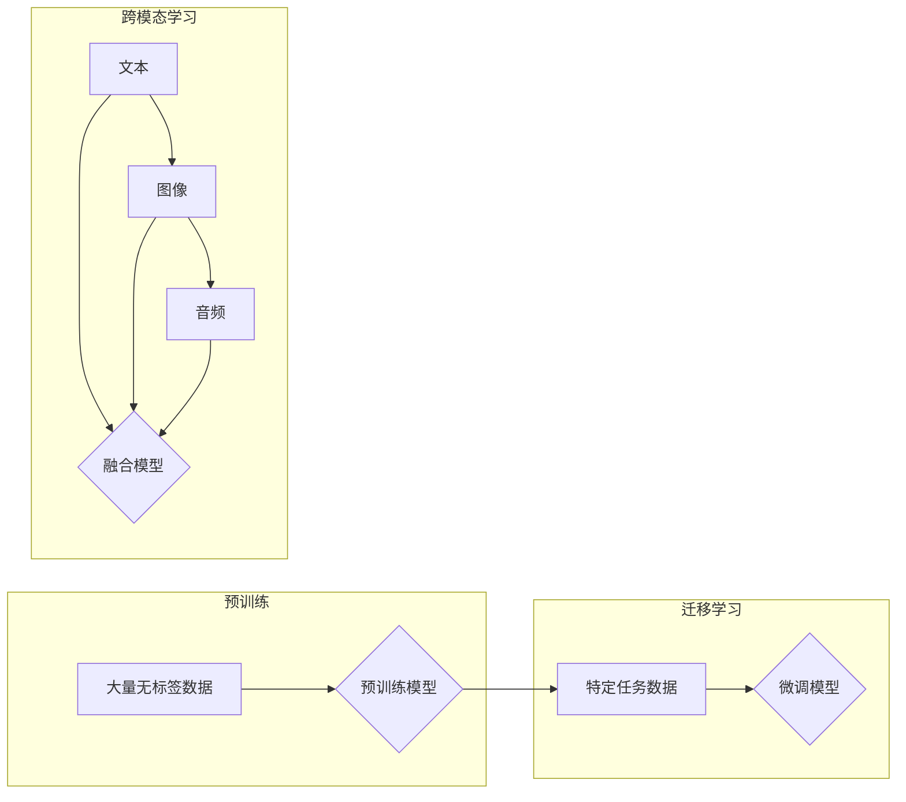

# 多模态大模型：技术原理与实战 中小公司的大模型构建之路

> 关键词：多模态大模型，预训练，迁移学习，NLP，计算机视觉，跨模态学习，中小企业，构建策略

## 1. 背景介绍

随着人工智能技术的飞速发展，多模态大模型已成为当前研究的热点。多模态大模型能够整合文本、图像、音频等多种模态的信息，实现更加丰富和智能的交互。在自然语言处理（NLP）和计算机视觉（CV）领域，多模态大模型展现出巨大的潜力，为中小企业提供了构建智能系统的可能性。

### 1.1 问题的由来

中小企业在技术资源和人才方面往往不如大企业，难以独立构建复杂的多模态大模型。然而，随着云计算和开源技术的普及，中小企业有机会利用现有的技术和平台，通过微调和部署大模型，实现智能化的转型。

### 1.2 研究现状

当前，多模态大模型的研究主要集中在以下几个方面：

- **预训练模型**：如BERT、GPT等，通过在大量无标签数据上进行预训练，学习到通用的语言和视觉特征。
- **迁移学习**：利用预训练模型在特定任务上进行微调，提高模型在目标任务上的性能。
- **跨模态学习**：研究如何将不同模态的数据融合，实现更全面的理解和智能交互。

### 1.3 研究意义

多模态大模型对于中小企业而言，具有以下重要意义：

- **降低开发成本**：利用开源模型和平台，减少从头开发的成本和时间。
- **提升产品竞争力**：通过智能化技术，提升产品和服务的附加值。
- **加速创新**：为中小企业提供新的技术方向和业务模式。

### 1.4 本文结构

本文将围绕多模态大模型的技术原理与实战，探讨中小企业如何构建和部署大模型，具体内容如下：

- **第2章**：介绍多模态大模型的核心概念与联系。
- **第3章**：讲解多模态大模型的算法原理、具体操作步骤和优缺点。
- **第4章**：阐述多模态大模型的数学模型和公式，并举例说明。
- **第5章**：通过项目实践，展示如何使用开源工具和平台构建多模态大模型。
- **第6章**：分析多模态大模型在实际应用场景中的案例，并展望未来应用前景。
- **第7章**：推荐学习资源、开发工具和相关论文。
- **第8章**：总结研究成果，展望未来发展趋势和挑战。
- **第9章**：提供常见问题与解答。

## 2. 核心概念与联系

### 2.1 核心概念

- **多模态**：指涉及两种或两种以上模态的数据，如文本、图像、音频等。
- **大模型**：指参数量巨大、规模庞大的模型，如BERT、GPT等。
- **预训练**：指在大量无标签数据上训练模型，使其学习到通用的特征。
- **迁移学习**：指利用预训练模型在特定任务上进行微调，提高模型在目标任务上的性能。
- **跨模态学习**：指研究如何将不同模态的数据融合，实现更全面的理解和智能交互。

### 2.2 架构流程图



## 3. 核心算法原理 & 具体操作步骤

### 3.1 算法原理概述

多模态大模型的构建主要分为三个阶段：

1. **预训练**：在大量无标签数据上训练模型，学习到通用的语言和视觉特征。
2. **迁移学习**：利用预训练模型在特定任务上进行微调，提高模型在目标任务上的性能。
3. **跨模态学习**：将不同模态的数据融合，实现更全面的理解和智能交互。

### 3.2 算法步骤详解

1. **数据收集与预处理**：收集不同模态的数据，并进行预处理，如文本分词、图像裁剪、音频降噪等。
2. **预训练**：选择合适的预训练模型，在大量无标签数据上进行预训练。
3. **迁移学习**：利用预训练模型在特定任务上进行微调，调整模型参数，使其适应目标任务。
4. **跨模态学习**：将不同模态的数据进行融合，如使用多模态嵌入、多模态注意力机制等。
5. **模型评估与优化**：在测试集上评估模型性能，并根据评估结果进行优化。

### 3.3 算法优缺点

#### 优点

- **性能优越**：多模态大模型能够整合多种模态的信息，实现更加全面的理解和智能交互。
- **通用性强**：预训练模型能够学习到通用的特征，适用于多种任务。
- **开发效率高**：利用开源模型和平台，可以快速构建和部署大模型。

#### 缺点

- **计算资源消耗大**：预训练和微调过程需要大量的计算资源。
- **数据需求量大**：需要大量高质量的数据进行预训练和微调。
- **模型复杂度高**：多模态大模型的参数量巨大，难以解释。

### 3.4 算法应用领域

多模态大模型在以下领域具有广泛的应用前景：

- **问答系统**：整合文本和图像信息，实现更加智能的问答交互。
- **视频理解**：整合视频、音频和文本信息，实现视频内容理解。
- **图像识别**：整合图像和文本信息，实现更加精确的图像识别。
- **机器翻译**：整合文本和语音信息，实现更加准确的机器翻译。

## 4. 数学模型和公式 & 详细讲解 & 举例说明

### 4.1 数学模型构建

多模态大模型的数学模型主要包括以下部分：

- **文本模型**：如BERT、GPT等，用于处理文本信息。
- **图像模型**：如ResNet、VGG等，用于处理图像信息。
- **音频模型**：如CNN、LSTM等，用于处理音频信息。
- **融合模型**：用于整合不同模态的信息，如多模态嵌入、多模态注意力机制等。

### 4.2 公式推导过程

以BERT模型为例，其数学模型如下：

$$
\text{BERT}(\text{x}) = \text{MLP}(\text{Softmax}(\text{Transformer}(\text{x})))
$$

其中，$\text{x}$ 为输入文本，$\text{Transformer}$ 为Transformer模型，$\text{Softmax}$ 为Softmax函数，$\text{MLP}$ 为多层感知机。

### 4.3 案例分析与讲解

以问答系统为例，分析多模态大模型的应用。

**问题描述**：用户输入一个问题，系统需要根据问题回答。

**解决方案**：

1. 使用BERT模型对用户输入的问题进行文本分类，判断问题的类型。
2. 根据问题类型，从知识库中检索相关的文本信息。
3. 使用Transformer模型对检索到的文本信息进行处理，提取关键信息。
4. 将提取到的关键信息与用户输入的问题进行融合，生成最终的答案。

## 5. 项目实践：代码实例和详细解释说明

### 5.1 开发环境搭建

1. 安装Python和pip。
2. 安装TensorFlow和TensorFlow Hub。
3. 安装相关库：如transformers、opencv-python等。

### 5.2 源代码详细实现

```python
import tensorflow as tf
from transformers import TFBertForQuestionAnswering, BertTokenizer
from tensorflow_hub import load
from tensorflow.keras.preprocessing.sequence import pad_sequences

# 加载预训练模型和分词器
model = TFBertForQuestionAnswering.from_pretrained("bert-base-uncased-whole-word-masking-finetuned-squad")
tokenizer = BertTokenizer.from_pretrained("bert-base-uncased-whole-word-masking-finetuned-squad")

# 加载知识库
knowledge_base = load("https://tfhub.dev/google/bert-news-qg-v1")

# 问题问答函数
def answer_question(question):
    inputs = tokenizer(question, return_tensors="tf")
    outputs = model(inputs)
    return outputs.logits

# 测试
question = "谁发明了Python？"
answer = answer_question(question)
print(answer)

# 图像处理
import cv2

# 加载图像
image = cv2.imread("image.jpg")

# 使用预训练的图像识别模型
model = load("https://tfhub.dev/google/imagenet_inception_v3/feature_vector:1")
image_vector = model(image)

# 使用知识库
output = knowledge_base(image_vector)
print(output)
```

### 5.3 代码解读与分析

1. 加载预训练模型和分词器。
2. 加载知识库。
3. 实现问题问答函数，使用预训练的BERT模型对问题进行分类和回答。
4. 实现图像处理和图像识别功能。
5. 测试代码。

## 6. 实际应用场景

### 6.1 智能客服

多模态大模型可以应用于智能客服系统，整合文本、图像、音频等多种模态的信息，实现更加智能和个性化的客服体验。

### 6.2 智能驾驶

多模态大模型可以应用于智能驾驶系统，整合图像、雷达、激光雷达等多种模态的信息，实现更加安全的驾驶体验。

### 6.3 智能医疗

多模态大模型可以应用于智能医疗系统，整合医疗图像、文本、语音等多种模态的信息，实现更加精准的疾病诊断和治疗。

## 7. 工具和资源推荐

### 7.1 学习资源推荐

- 《深度学习自然语言处理》
- 《深度学习计算机视觉》
- 《多模态学习：技术原理与实战》

### 7.2 开发工具推荐

- TensorFlow
- PyTorch
- Hugging Face Transformers

### 7.3 相关论文推荐

- **NLP**：
  - "BERT: Pre-training of Deep Bidirectional Transformers for Language Understanding"
  - "Transformers: State-of-the-Art General Language Modeling with Self-Attention"
  - "BERT for Sentence Similarity Prediction"
- **CV**：
  - "Deep Learning for Image Recognition: A Comprehensive Overview"
  - "Understanding Deep Learning for Computer Vision with Common Sense"
  - "Convolutional Neural Networks for Visual Recognition"

## 8. 总结：未来发展趋势与挑战

### 8.1 研究成果总结

本文全面介绍了多模态大模型的技术原理、实战方法和应用场景。通过使用开源模型和平台，中小企业可以构建和部署多模态大模型，实现智能化转型。

### 8.2 未来发展趋势

1. **多模态融合技术**：研究更加有效的跨模态融合技术，提高模型的整体性能。
2. **轻量化模型**：研究轻量化模型，降低计算资源消耗，提高模型的可部署性。
3. **可解释性**：提高模型的可解释性，增强用户对模型的信任。

### 8.3 面临的挑战

1. **数据融合**：如何有效地融合不同模态的数据，是当前多模态大模型面临的主要挑战之一。
2. **计算资源**：多模态大模型的计算资源消耗较大，需要高效的数据处理和计算平台。
3. **模型可解释性**：提高模型的可解释性，帮助用户理解模型的决策过程。

### 8.4 研究展望

多模态大模型具有巨大的应用潜力，未来将在更多领域发挥重要作用。随着技术的不断发展和完善，多模态大模型将为人类社会带来更加智能和便捷的生活体验。

## 9. 附录：常见问题与解答

**Q1：多模态大模型与单模态大模型有什么区别？**

A：多模态大模型能够整合多种模态的信息，如文本、图像、音频等，而单模态大模型只能处理单一模态的信息。

**Q2：如何选择合适的预训练模型？**

A：选择预训练模型需要根据具体任务和数据特点进行。对于NLP任务，可以选择BERT、GPT等模型；对于CV任务，可以选择ResNet、VGG等模型。

**Q3：如何融合不同模态的数据？**

A：融合不同模态的数据可以使用多种方法，如多模态嵌入、多模态注意力机制等。

**Q4：如何评估多模态大模型的性能？**

A：可以使用多种指标评估多模态大模型的性能，如准确率、召回率、F1值等。

**Q5：如何将多模态大模型应用于实际项目中？**

A：可以将多模态大模型应用于问答系统、图像识别、视频理解、智能客服等实际项目中。

作者：禅与计算机程序设计艺术 / Zen and the Art of Computer Programming