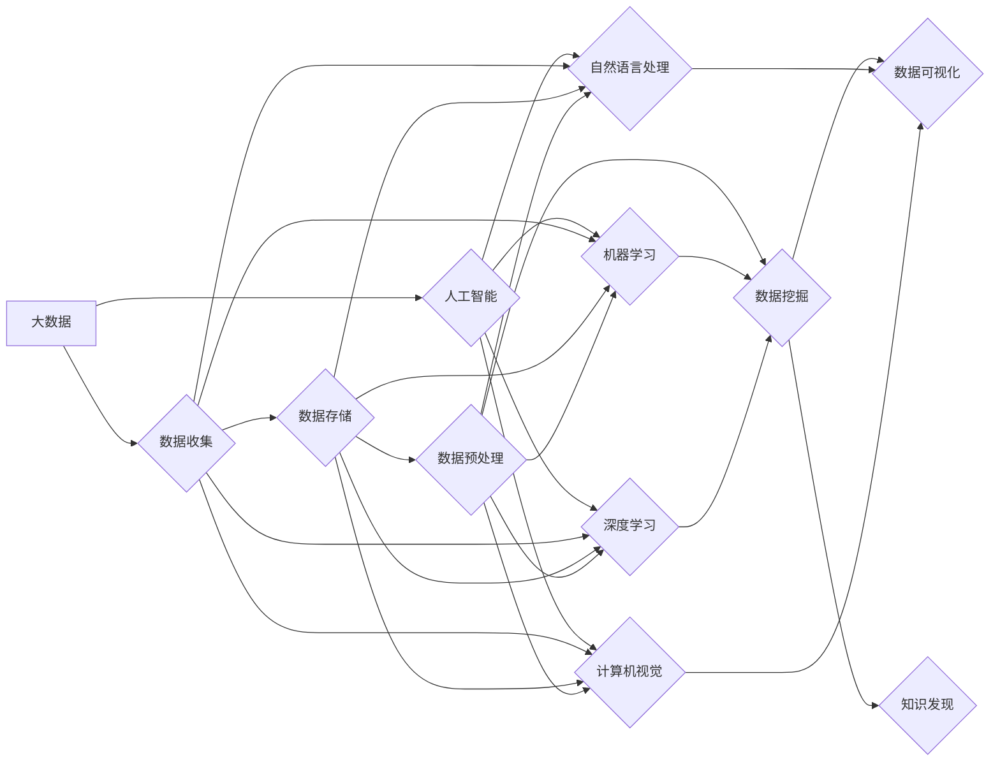

# 大数据与AI的未来发展趋势

> 关键词：大数据，人工智能，机器学习，深度学习，边缘计算，数据隐私，智能应用

## 1. 背景介绍

随着互联网、物联网、移动互联网的快速发展，人类社会的数据量呈指数级增长。这些海量数据包含了丰富的信息，为各行各业带来了前所未有的机遇。同时，人工智能（AI）技术的飞速发展，使得机器学习和深度学习在数据分析、预测、决策等领域的应用越来越广泛。大数据与AI的结合，成为了推动社会进步和产业变革的重要力量。

### 1.1 大数据时代的到来

大数据是指规模巨大、类型多样、价值密度低的数据集合。它具有4V特征：Volume（体量巨大）、Velocity（高速流动）、Variety（类型多样）、Value（价值密度低）。大数据时代，数据已经成为企业、政府和社会的重要资产。

### 1.2 人工智能的崛起

人工智能是一种模拟人类智能的技术，包括机器学习、深度学习、自然语言处理、计算机视觉等领域。AI技术的发展，使得机器能够像人类一样进行学习、推理、决策和交互。

### 1.3 大数据与AI的融合

大数据与AI的融合，使得AI技术能够更好地从海量数据中提取有价值的信息，为各行各业提供智能化的解决方案。大数据为AI提供了丰富的学习资源，AI则为大数据提供了智能化的分析和处理能力。

## 2. 核心概念与联系

### 2.1 大数据与AI的核心概念

**大数据**：
- **Volume（体量巨大）**：数据量达到PB级别，传统数据处理工具难以处理。
- **Velocity（高速流动）**：数据产生和更新的速度非常快，需要实时或近实时处理。
- **Variety（类型多样）**：数据类型丰富，包括结构化数据、半结构化数据和非结构化数据。
- **Value（价值密度低）**：数据中包含的有用信息较少，需要通过算法进行深度挖掘。

**人工智能**：
- **机器学习**：让机器通过数据和算法学习，从而实现自我优化和决策。
- **深度学习**：模拟人脑神经网络结构，通过多层神经网络进行特征提取和学习。
- **自然语言处理**：使计算机能够理解、解释和生成人类语言。
- **计算机视觉**：使计算机能够理解视觉图像，进行图像识别、目标检测等。

### 2.2 Mermaid流程图



### 2.3 核心概念之间的联系

大数据为人工智能提供了丰富的学习资源，人工智能则为大数据提供了智能化的分析和处理能力。两者相辅相成，共同推动着大数据时代的到来。

## 3. 核心算法原理 & 具体操作步骤

### 3.1 算法原理概述

大数据与AI的核心算法主要包括：

- **数据挖掘算法**：如关联规则挖掘、聚类分析、分类算法、回归算法等。
- **机器学习算法**：如线性回归、决策树、支持向量机、神经网络等。
- **深度学习算法**：如卷积神经网络（CNN）、循环神经网络（RNN）、Transformer等。

### 3.2 算法步骤详解

1. **数据收集**：从各种渠道收集数据，如数据库、传感器、网络爬虫等。
2. **数据存储**：将收集到的数据存储在分布式存储系统中，如Hadoop HDFS、Apache Cassandra等。
3. **数据预处理**：对数据进行清洗、去重、转换等处理，提高数据质量。
4. **特征工程**：从原始数据中提取有用的特征，为后续的机器学习算法提供输入。
5. **模型训练**：选择合适的机器学习或深度学习算法，对特征数据进行训练。
6. **模型评估**：使用测试数据评估模型的性能，调整模型参数。
7. **模型部署**：将训练好的模型部署到生产环境中，进行实际应用。

### 3.3 算法优缺点

**优点**：

- **高效处理海量数据**：大数据和AI技术能够高效处理海量数据，挖掘出有价值的信息。
- **自动化决策**：机器学习模型可以自动学习数据中的规律，实现自动化决策。
- **提升效率**：AI技术可以帮助企业提高工作效率，降低成本。

**缺点**：

- **数据质量**：数据质量直接影响到模型的性能，需要确保数据质量。
- **模型解释性**：深度学习等模型的可解释性较差，难以理解模型的决策过程。
- **算法偏见**：模型可能会学习到数据中的偏见，导致不公平的决策结果。

### 3.4 算法应用领域

大数据与AI技术已广泛应用于各个领域，如：

- **金融**：风险管理、欺诈检测、信用评分等。
- **医疗**：疾病预测、药物研发、患者监护等。
- **零售**：推荐系统、精准营销、库存管理等。
- **交通**：智能交通系统、自动驾驶等。
- **教育**：个性化学习、教育评估等。

## 4. 数学模型和公式 & 详细讲解 & 举例说明

### 4.1 数学模型构建

大数据与AI的数学模型主要包括：

- **线性回归**：通过线性关系拟合数据，预测目标变量。
- **逻辑回归**：用于二分类问题，预测样本属于某一类别的概率。
- **决策树**：通过树状结构对数据进行分类或回归。
- **支持向量机**：通过寻找最优的超平面将数据分开。

### 4.2 公式推导过程

以线性回归为例，其公式为：

$$
y = \beta_0 + \beta_1 x_1 + \beta_2 x_2 + \ldots + \beta_n x_n + \epsilon
$$

其中，$y$ 为目标变量，$x_1, x_2, \ldots, x_n$ 为特征变量，$\beta_0, \beta_1, \ldots, \beta_n$ 为模型参数，$\epsilon$ 为误差项。

### 4.3 案例分析与讲解

以一家电商平台为例，使用线性回归模型预测用户购买商品的概率。

1. **数据收集**：收集用户购买商品的记录，包括用户年龄、性别、购买历史等特征。
2. **数据预处理**：对数据进行清洗、去重、转换等处理，提高数据质量。
3. **特征工程**：提取用户年龄、性别、购买历史等特征。
4. **模型训练**：使用线性回归模型对特征数据进行训练。
5. **模型评估**：使用测试数据评估模型的性能，调整模型参数。
6. **模型部署**：将训练好的模型部署到生产环境中，预测用户购买商品的概率。

## 5. 项目实践：代码实例和详细解释说明

### 5.1 开发环境搭建

1. 安装Python环境。
2. 安装必要的库，如NumPy、Pandas、Scikit-learn等。

### 5.2 源代码详细实现

```python
import numpy as np
from sklearn.linear_model import LinearRegression
from sklearn.model_selection import train_test_split
from sklearn.metrics import accuracy_score

# 加载数据
data = np.loadtxt('data.csv', delimiter=',')
X = data[:, :-1]
y = data[:, -1]

# 划分训练集和测试集
X_train, X_test, y_train, y_test = train_test_split(X, y, test_size=0.2, random_state=42)

# 创建线性回归模型
model = LinearRegression()

# 训练模型
model.fit(X_train, y_train)

# 预测测试集
y_pred = model.predict(X_test)

# 评估模型
accuracy = accuracy_score(y_test, y_pred)
print(f'Accuracy: {accuracy:.2f}')
```

### 5.3 代码解读与分析

1. 导入必要的库。
2. 加载数据，将数据分割为特征和标签。
3. 划分训练集和测试集。
4. 创建线性回归模型。
5. 训练模型。
6. 预测测试集。
7. 评估模型。

## 6. 实际应用场景

### 6.1 金融风控

大数据与AI技术在金融风控领域得到广泛应用，如：

- **反欺诈**：通过分析用户行为数据，识别可疑交易，预防欺诈行为。
- **信用评分**：根据用户的信用历史、财务状况等信息，评估其信用风险。
- **风险预警**：对潜在风险进行预测和预警，帮助金融机构及时采取措施。

### 6.2 智能医疗

大数据与AI技术在智能医疗领域具有广阔的应用前景，如：

- **疾病预测**：根据患者的病史、基因信息等，预测患者可能患有的疾病。
- **药物研发**：通过分析大量药物数据，发现新的药物靶点。
- **患者监护**：对患者的生命体征进行实时监测，及时发现问题。

### 6.3 智能交通

大数据与AI技术在智能交通领域具有重要作用，如：

- **智能交通信号控制**：根据实时交通流量，优化交通信号灯控制策略。
- **自动驾驶**：通过计算机视觉和传感器技术，实现车辆的自动驾驶。
- **交通事故预警**：通过分析交通事故数据，预测交通事故发生概率。

## 7. 工具和资源推荐

### 7.1 学习资源推荐

- **《Python数据科学手册》**：介绍了Python在数据分析、机器学习、深度学习等领域的应用。
- **《深度学习》**：介绍了深度学习的基本原理和常用算法。
- **《大数据技术原理与应用》**：介绍了大数据技术的原理、架构和应用。

### 7.2 开发工具推荐

- **Jupyter Notebook**：用于数据分析和机器学习实验。
- **Scikit-learn**：Python机器学习库。
- **TensorFlow**：Google的深度学习框架。
- **PyTorch**：Facebook的深度学习框架。

### 7.3 相关论文推荐

- **"The Hundred-Page Machine Learning Book"**：介绍了机器学习的基本概念和算法。
- **"Deep Learning"**：介绍了深度学习的基本原理和应用。
- **"Big Data: A Revolution That Will Transform How We Live, Work, and Think"**：介绍了大数据的原理和应用。

## 8. 总结：未来发展趋势与挑战

### 8.1 研究成果总结

大数据与AI技术的融合，为各行各业带来了巨大的变革。大数据为AI提供了丰富的学习资源，AI则为大数据提供了智能化的分析和处理能力。

### 8.2 未来发展趋势

- **数据质量提升**：随着数据采集技术的进步，数据质量将得到进一步提升。
- **模型可解释性增强**：通过改进算法和模型设计，提高模型的可解释性。
- **跨领域迁移学习**：实现不同领域之间的知识迁移，提高模型的泛化能力。
- **多模态数据融合**：融合文本、图像、语音等多模态数据，提升模型的感知能力。

### 8.3 面临的挑战

- **数据隐私保护**：随着数据量的增加，数据隐私保护成为一大挑战。
- **算法偏见**：模型可能会学习到数据中的偏见，导致不公平的决策结果。
- **算力资源消耗**：大数据和AI技术的应用需要大量的计算资源。

### 8.4 研究展望

未来，大数据与AI技术将继续深入发展，为人类社会创造更多价值。同时，也需要关注数据隐私、算法偏见、算力资源消耗等问题，以确保技术的可持续发展。

## 9. 附录：常见问题与解答

**Q1：大数据与AI技术有哪些应用场景？**

A：大数据与AI技术广泛应用于金融、医疗、零售、交通、教育等领域。

**Q2：大数据与AI技术如何提高企业竞争力？**

A：大数据与AI技术可以帮助企业提高效率、降低成本、优化决策，从而提高企业竞争力。

**Q3：大数据与AI技术面临哪些挑战？**

A：大数据与AI技术面临数据隐私、算法偏见、算力资源消耗等挑战。

**Q4：如何确保数据隐私保护？**

A：通过数据脱敏、差分隐私等技术，确保数据隐私保护。

**Q5：如何解决算法偏见问题？**

A：通过数据清洗、算法设计、模型评估等方法，解决算法偏见问题。

作者：禅与计算机程序设计艺术 / Zen and the Art of Computer Programming