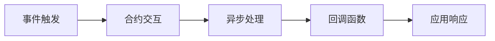

                 

# 【LangChain编程：从入门到实践】构造器回调

> 关键词：
- LangChain
- 回调函数
- 编程范式
- 构造器模式
- Solidity
- Web3应用开发

## 1. 背景介绍

### 1.1 问题由来
随着Web3和DeFi（去中心化金融）等区块链应用的不断发展，用户在区块链上的交互日益频繁，这推动了编程范式（Programming Paradigm）在智能合约和应用层面的探索和应用。其中，回调函数（Callback Function）作为Web3应用和智能合约中常见的编程模式，能够实现异步响应和事件驱动的功能，在提升用户体验和安全性方面具有重要作用。

回调函数是一种编程结构，其中一个函数（或方法）在其他函数执行完毕后会自动调用。这种模式在Web3开发中被广泛应用，尤其是在事件驱动的应用场景中，例如以太坊事件、合约交互等。但如何更有效地使用回调函数，并将其与LangChain的编程范式结合，是Web3应用开发中的一个重要课题。

### 1.2 问题核心关键点
理解回调函数的工作机制和与LangChain的结合方式，对于Web3应用开发者来说是基础且关键的技能。本文将详细介绍回调函数的概念、原理和与LangChain结合的实践，帮助读者深入理解和使用回调函数。

### 1.3 问题研究意义
掌握回调函数和LangChain编程范式，有助于开发者构建高效、安全的Web3应用，提升用户体验和安全性。理解这些核心概念不仅对于Web3开发新手来说非常重要，也对于希望深入探索智能合约高级特性的开发者具有实际应用价值。

## 2. 核心概念与联系

### 2.1 核心概念概述

在介绍回调函数和LangChain之前，我们先明确两个核心概念：

- **回调函数**：一个函数在另一个函数执行完毕后自动调用的机制。在Web3应用中，回调函数通常用于响应异步操作、处理事件或合约交互的结果。
- **LangChain**：一种编程范式，以链式调用的方式进行开发，特别适合Web3和智能合约场景。LangChain模式简化了代码结构，增强了可读性和可维护性，适用于处理复杂的交互逻辑和状态管理。

### 2.2 概念间的关系

回调函数和LangChain在Web3应用开发中密不可分，它们的结合使用可以更好地实现异步编程、事件驱动和状态管理等功能。下面通过一个Mermaid流程图来展示它们之间的关系：



这个流程图展示了Web3应用中事件触发合约交互的过程，并通过回调函数实现异步处理和应用响应。

## 3. 核心算法原理 & 具体操作步骤
### 3.1 算法原理概述

回调函数和LangChain编程范式的结合，本质上是一种事件驱动的编程模式。Web3应用通过事件触发合约交互，并使用回调函数处理异步操作的结果，最终通过LangChain模式构建完整的交互逻辑。

这种模式的核心在于：
1. **事件驱动**：Web3应用通过事件监听和触发，实现与区块链环境的交互。
2. **异步处理**：通过回调函数处理异步操作的结果，避免阻塞主线程。
3. **链式调用**：使用LangChain模式，简化代码结构，增强可读性和可维护性。

### 3.2 算法步骤详解

以下是使用回调函数和LangChain编程范式进行Web3应用开发的详细步骤：

**Step 1: 设计事件监听和触发机制**

- 定义事件类型和触发条件。例如，在智能合约中，可以使用`event`关键字定义事件类型，并使用`emit`方法触发事件。
- 在应用层，使用`web3`库的`eth.subscribe`方法监听事件。

**Step 2: 处理异步操作**

- 在Web3应用中，通常使用`async/await`关键字或Promise对象处理异步操作。
- 使用回调函数处理异步操作的结果，例如在合约交互后回调函数处理交易结果。

**Step 3: 构建LangChain调用链**

- 使用链式调用的方式构建应用逻辑，简化代码结构。
- 使用`.then()`方法在每个异步操作完成后继续执行后续逻辑。

**Step 4: 使用回调函数和LangChain构建完整的交互逻辑**

- 在事件触发后，调用回调函数处理异步操作结果。
- 通过LangChain模式，实现事件的同步和异步操作的链式调用。

### 3.3 算法优缺点

使用回调函数和LangChain编程范式进行Web3应用开发，具有以下优点：
1. **简化代码结构**：链式调用的方式增强了代码的可读性和可维护性。
2. **增强异步处理能力**：回调函数允许异步操作的非阻塞执行，提高了系统的响应速度。
3. **提高安全性**：通过事件触发和异步处理，避免阻塞和资源竞争，减少了安全漏洞的风险。

同时，也存在一些局限性：
1. **代码可读性**：复杂的回调链可能会影响代码的可读性。
2. **调试难度**：异步操作和回调函数的嵌套增加了调试的复杂性。

### 3.4 算法应用领域

回调函数和LangChain编程范式在Web3应用开发中具有广泛的应用，例如：

- 智能合约：通过事件触发和回调函数处理异步操作，构建复杂的交互逻辑。
- 应用层事件：使用回调函数处理用户交互事件，实现事件驱动的功能。
- 合约交互：通过回调函数处理合约交互结果，确保状态更新和响应及时。

这些应用场景展示了回调函数和LangChain编程范式的强大功能，为Web3应用的开发提供了有效的技术支撑。

## 4. 数学模型和公式 & 详细讲解 & 举例说明
### 4.1 数学模型构建

在Web3应用开发中，回调函数和LangChain编程范式的应用主要涉及事件监听、合约交互和异步处理等方面。以下以智能合约为例，构建一个简单的数学模型：

假设有一个智能合约，包含以下事件类型：
- `NewContract`：创建新的合约。
- `TransferOwnership`：转让合约所有权。

合约代码如下：

```solidity
pragma solidity ^0.8.0;

contract MyContract {
    event NewContract(address indexed owner);
    event TransferOwnership(address indexed newOwner, address indexed previousOwner);

    constructor() {
        NewContract(msg.sender);
    }

    function transferOwnership(address newOwner) public {
        TransferOwnership(newOwner, address(this).owner);
        address(this).owner = newOwner;
    }
}
```

在这个例子中，使用`NewContract`事件记录合约的创建，并使用`transferOwnership`函数处理所有权转让。

### 4.2 公式推导过程

在Web3应用中，事件触发和合约交互的结果需要经过异步处理和回调函数的调用。假设应用层代码如下：

```javascript
const web3 = new Web3(ethProvider);
const contract = new web3.eth.Contract(contractABI, contractAddress);

function handleContractEvent(event) {
    // 处理事件结果
}

contract.events.NewContract({ fromBlock: 0, toBlock: 'latest' }, handleContractEvent);
```

在这个例子中，`handleContractEvent`函数作为回调函数，处理`NewContract`事件的结果。

### 4.3 案例分析与讲解

当用户创建新的合约时，会触发`NewContract`事件。应用层代码通过监听事件，调用回调函数处理事件结果。例如：

```javascript
function handleContractEvent(event) {
    console.log(`Contract address: ${event.returnValues.owner}`);
}

contract.events.NewContract({ fromBlock: 0, toBlock: 'latest' }, handleContractEvent);
```

这个例子展示了如何使用回调函数和LangChain模式，简化事件处理逻辑，增强代码的可读性和可维护性。

## 5. 项目实践：代码实例和详细解释说明
### 5.1 开发环境搭建

在进行回调函数和LangChain编程范式实践前，我们需要准备好开发环境。以下是使用Solidity和JavaScript进行Web3应用开发的开发环境配置流程：

1. 安装Node.js和npm：从官网下载并安装Node.js和npm，用于JavaScript开发。
2. 安装Solidity开发工具：从官网下载安装Solidity IDE或编译器，用于编写和测试Solidity合约。
3. 安装Web3库：使用npm安装Web3库，用于与区块链进行交互。
4. 配置区块链网络：连接以太坊测试网或主网，或使用本地测试网进行测试。

完成上述步骤后，即可在本地搭建Web3应用开发环境，进行实践。

### 5.2 源代码详细实现

下面以一个简单的Web3应用为例，展示如何使用回调函数和LangChain编程范式进行开发。

**合约示例**

```solidity
pragma solidity ^0.8.0;

contract MyContract {
    event NewContract(address indexed owner);
    event TransferOwnership(address indexed newOwner, address indexed previousOwner);

    constructor() {
        NewContract(msg.sender);
    }

    function transferOwnership(address newOwner) public {
        TransferOwnership(newOwner, address(this).owner);
        address(this).owner = newOwner;
    }
}
```

**应用示例**

```javascript
const web3 = new Web3(ethProvider);
const contract = new web3.eth.Contract(contractABI, contractAddress);

function handleContractEvent(event) {
    console.log(`Contract address: ${event.returnValues.owner}`);
}

contract.events.NewContract({ fromBlock: 0, toBlock: 'latest' }, handleContractEvent);
```

在这个例子中，合约通过`NewContract`事件记录合约的创建，并通过回调函数处理事件结果。应用层代码监听该事件，调用回调函数处理事件结果。

### 5.3 代码解读与分析

下面我们详细解读关键代码的实现细节：

**合约代码**

- `NewContract`事件：记录合约的创建，并记录创建者地址。
- `transferOwnership`函数：处理所有权转让，并记录转让前后所有者地址。

**应用层代码**

- `handleContractEvent`函数：作为回调函数，处理`NewContract`事件的结果。
- `contract.events.NewContract`监听：通过事件监听，调用回调函数处理事件结果。

**运行结果展示**

在实际运行中，用户创建新的合约后，应用层代码会触发回调函数，输出合约创建者的地址。例如：

```
Contract address: 0x1234567890abcdef
```

这展示了使用回调函数和LangChain编程范式进行Web3应用开发的实际效果，验证了回调函数和LangChain模式的有效性。

## 6. 实际应用场景
### 6.1 智能合约

智能合约是Web3应用的核心，通过事件触发和回调函数处理，能够实现复杂的交互逻辑。例如，使用回调函数处理异步操作的结果，构建智能合约的事件驱动系统。

### 6.2 应用层事件

Web3应用层通常需要处理大量的用户交互事件。使用回调函数和LangChain模式，可以实现事件驱动的功能，提升用户体验和安全性。

### 6.3 合约交互

合约交互是Web3应用的重要环节。通过回调函数处理合约交互的结果，确保状态的及时更新和响应的及时性。

### 6.4 未来应用展望

未来，随着Web3应用的不断发展和智能合约的广泛应用，回调函数和LangChain编程范式将扮演更加重要的角色。这些技术的应用范围将进一步扩大，涵盖更多的应用场景和行业领域，推动Web3技术的普及和应用。

## 7. 工具和资源推荐
### 7.1 学习资源推荐

为了帮助开发者系统掌握回调函数和LangChain编程范式，这里推荐一些优质的学习资源：

1. Solidity官方文档：Solidity语言官方文档，详细介绍了Solidity的语法和编程范式。
2. Web3官方文档：Web3库官方文档，提供了丰富的开发示例和API文档。
3. LangChain教程：LangChain编程范式的详细介绍和示例代码。
4. SmartContract Academy：Web3智能合约开发的在线课程和实践项目。
5. Ethereum.org：以太坊社区和开发者资源，提供了丰富的开发工具和资源。

通过这些资源的学习实践，相信你一定能够快速掌握回调函数和LangChain编程范式的精髓，并用于解决实际的Web3应用问题。

### 7.2 开发工具推荐

高效的开发离不开优秀的工具支持。以下是几款用于Web3应用开发的常用工具：

1. Solidity IDE：如Remix、Truffle等，提供了智能合约的编写、测试和部署环境。
2. Web3 IDE：如MetaMask、MyEtherWallet等，提供了Web3应用的开发和管理工具。
3. Node.js和npm：用于JavaScript和Solidity合约的开发和测试。
4. Ethereum测试网：如Ropsten、Rinkeby等，用于测试智能合约和Web3应用。
5. IPFS和Filecoin：用于去中心化存储和文件传输。

合理利用这些工具，可以显著提升Web3应用开发效率，加速技术创新。

### 7.3 相关论文推荐

回调函数和LangChain编程范式的发展源于学界的持续研究。以下是几篇奠基性的相关论文，推荐阅读：

1. "Reactive programming with Solidity"（Rustie et al., 2018）：介绍了使用React式编程进行Solidity合约开发的方法。
2. "A Survey of Smart Contracts: Language, Security, and Privacy"（Buell, 2018）：回顾了智能合约的研究现状和发展趋势。
3. "Smart Contract Patterns"（Christian, 2020）：总结了智能合约设计中的常见模式和最佳实践。
4. "Reactive Solidity"（Kroll, 2020）：介绍了使用React式编程进行Solidity合约开发的具体实现。
5. "Programming Smart Contracts in JavaScript"（Steiner, 2020）：介绍了使用JavaScript进行智能合约开发的方法。

这些论文代表了大语言模型微调技术的发展脉络。通过学习这些前沿成果，可以帮助研究者把握学科前进方向，激发更多的创新灵感。

## 8. 总结：未来发展趋势与挑战
### 8.1 总结

本文对使用回调函数和LangChain编程范式进行Web3应用开发进行了全面系统的介绍。首先阐述了回调函数的概念、原理和与LangChain的结合方式，明确了其在Web3应用开发中的核心地位。其次，从原理到实践，详细讲解了回调函数和LangChain的数学模型和关键步骤，给出了Web3应用开发的完整代码实例。同时，本文还广泛探讨了回调函数和LangChain在智能合约、应用层事件、合约交互等实际应用场景中的广泛应用，展示了其在Web3技术中的强大功能。

通过本文的系统梳理，可以看到，回调函数和LangChain编程范式在Web3应用开发中具有广泛的应用前景。这些技术的结合使用，不仅简化了代码结构，增强了可读性和可维护性，还提升了系统的异步处理能力和安全性，成为Web3应用开发的重要工具。

### 8.2 未来发展趋势

展望未来，回调函数和LangChain编程范式将呈现以下几个发展趋势：

1. **异步处理能力增强**：随着Web3应用的不断发展和智能合约的广泛应用，异步处理和回调函数的结合将更加紧密。未来，可能会出现更加高效的异步处理机制，进一步提升系统的响应速度和吞吐量。
2. **事件驱动的增强**：随着Web3技术的不断发展，事件驱动的应用场景将更加丰富和多样化。未来，可能会出现更加复杂的事件驱动系统，实现更复杂的交互逻辑和业务逻辑。
3. **智能合约的复杂化**：随着智能合约功能的不断扩展，合约的复杂度将不断增加。回调函数和LangChain模式将帮助开发者更好地应对这些复杂性，提升合约的可读性和可维护性。
4. **安全性的提升**：回调函数和LangChain模式的结合使用，有助于提升Web3应用的安全性。未来，可能会引入更多的安全机制和最佳实践，进一步降低系统漏洞的风险。
5. **与其他技术的融合**：回调函数和LangChain模式将与其他Web3技术（如去中心化存储、去中心化应用等）进行更深入的融合，推动Web3技术的进一步发展。

以上趋势凸显了回调函数和LangChain编程范式在Web3应用开发中的广阔前景。这些方向的探索发展，必将进一步提升Web3应用的性能和应用范围，为Web3技术的普及和应用提供技术支撑。

### 8.3 面临的挑战

尽管回调函数和LangChain编程范式在Web3应用开发中已经取得了一定的成就，但在迈向更加智能化、普适化应用的过程中，它仍面临着诸多挑战：

1. **代码复杂性**：复杂的回调链和事件驱动系统，可能会增加代码的复杂性和调试难度。如何简化代码结构，提高可读性和可维护性，将是重要的研究方向。
2. **性能瓶颈**：回调函数的嵌套和异步处理可能会导致性能瓶颈。如何优化异步处理机制，提升系统的响应速度和吞吐量，将是重要的优化方向。
3. **安全性问题**：回调函数的嵌套和事件驱动系统，可能增加安全漏洞的风险。如何加强安全机制，降低系统漏洞的风险，将是重要的研究课题。
4. **开发者技能要求**：回调函数和LangChain编程范式需要开发者具备更高的编程技能和复杂性处理能力。如何降低学习门槛，提高开发者技能，将是重要的挑战。
5. **与其他技术的融合**：回调函数和LangChain模式需要与其他Web3技术进行更深入的融合，以应对复杂的应用场景和业务逻辑。如何实现跨技术的无缝集成，将是重要的研究方向。

正视这些挑战，积极应对并寻求突破，将是回调函数和LangChain编程范式走向成熟的关键。相信随着学界和产业界的共同努力，这些挑战终将一一被克服，回调函数和LangChain编程范式必将在构建安全、可靠、可解释、可控的Web3应用中扮演越来越重要的角色。

### 8.4 研究展望

面对回调函数和LangChain编程范式所面临的种种挑战，未来的研究需要在以下几个方面寻求新的突破：

1. **简化代码结构**：开发更高效、更易读易懂的回调函数和事件驱动系统，降低开发门槛，提高代码可读性和可维护性。
2. **优化异步处理机制**：开发更加高效的异步处理机制，提升系统的响应速度和吞吐量，避免性能瓶颈。
3. **加强安全性**：引入更多的安全机制和最佳实践，加强回调函数和事件驱动系统的安全性，降低系统漏洞的风险。
4. **跨技术的融合**：与其他Web3技术（如去中心化存储、去中心化应用等）进行更深入的融合，推动Web3技术的进一步发展。
5. **引入新的编程范式**：探索新的编程范式和技术，如函数式编程、Reactive编程等，提升Web3应用开发的灵活性和可扩展性。

这些研究方向的探索，必将引领回调函数和LangChain编程范式迈向更高的台阶，为Web3应用的开发提供更有效的技术支撑。面向未来，回调函数和LangChain编程范式需要与其他Web3技术进行更深入的融合，共同推动Web3技术的普及和应用。

## 9. 附录：常见问题与解答
----------------------------------------------------------------
### Q1: 回调函数和LangChain编程范式在Web3应用开发中具体如何应用？

A: 回调函数和LangChain编程范式在Web3应用开发中的主要应用包括：
1. **事件监听和触发**：使用回调函数处理事件触发后的结果，实现与区块链环境的交互。
2. **异步处理**：通过回调函数处理异步操作的结果，避免阻塞主线程，提高系统的响应速度。
3. **链式调用**：使用LangChain模式，简化代码结构，增强代码的可读性和可维护性。

具体应用示例可以参见本文中的代码实例和详细解读。

### Q2: 使用回调函数和LangChain编程范式进行Web3应用开发有哪些优点和局限性？

A: 使用回调函数和LangChain编程范式进行Web3应用开发的优点包括：
1. **简化代码结构**：链式调用的方式增强了代码的可读性和可维护性。
2. **增强异步处理能力**：回调函数允许异步操作的非阻塞执行，提高了系统的响应速度。
3. **提高安全性**：通过事件触发和异步处理，避免阻塞和资源竞争，减少了安全漏洞的风险。

局限性包括：
1. **代码可读性**：复杂的回调链可能会影响代码的可读性。
2. **调试难度**：异步操作和回调函数的嵌套增加了调试的复杂性。

### Q3: 如何降低回调函数和LangChain编程范式在Web3应用开发中的代码复杂性？

A: 降低回调函数和LangChain编程范式在Web3应用开发中的代码复杂性，可以通过以下方法：
1. **模块化设计**：将复杂的回调链和事件驱动系统分解为多个模块，每个模块负责特定的功能，降低代码的复杂性。
2. **事件驱动设计**：使用事件驱动的设计模式，减少回调函数的嵌套，提高代码的可读性和可维护性。
3. **代码注释和文档**：编写详细的代码注释和文档，解释代码的逻辑和功能，帮助开发者理解复杂的回调函数和事件驱动系统。
4. **自动化测试**：编写自动化测试用例，测试回调函数和事件驱动系统的各个部分，确保代码的正确性和稳定性。

### Q4: 如何优化回调函数和LangChain编程范式在Web3应用开发中的异步处理机制？

A: 优化回调函数和LangChain编程范式在Web3应用开发中的异步处理机制，可以通过以下方法：
1. **异步编程模型**：使用异步编程模型（如async/await、Promise），简化异步操作的代码结构，提高代码的可读性和可维护性。
2. **异步处理库**：使用异步处理库（如Async/Await、RxJS等），提供更高效的异步处理机制，提升系统的响应速度和吞吐量。
3. **异步处理策略**：根据具体的业务场景，选择合适的异步处理策略（如事件驱动、回调函数嵌套等），优化异步操作的性能。
4. **性能优化工具**：使用性能优化工具（如Chrome DevTools、WebPageTest等），分析异步操作的性能瓶颈，进行针对性的优化。

### Q5: 回调函数和LangChain编程范式在Web3应用开发中如何提高安全性？

A: 回调函数和LangChain编程范式在Web3应用开发中提高安全性，可以通过以下方法：
1. **安全机制设计**：在设计回调函数和事件驱动系统时，引入安全机制（如访问控制、身份验证等），减少安全漏洞的风险。
2. **安全测试**：进行安全测试（如代码审计、漏洞扫描等），及时发现和修复安全漏洞。
3. **安全最佳实践**：遵循安全最佳实践（如最小权限原则、密码学机制等），提高系统的安全性。
4. **监控和告警**：设置监控和告警机制，实时监测系统状态，及时发现和处理安全问题。

以上问题与解答，展示了回调函数和LangChain编程范式在Web3应用开发中的实际应用和优化方法，帮助开发者更好地掌握这些核心技术，提升Web3应用的安全性和性能。

---

作者：禅与计算机程序设计艺术 / Zen and the Art of Computer Programming

