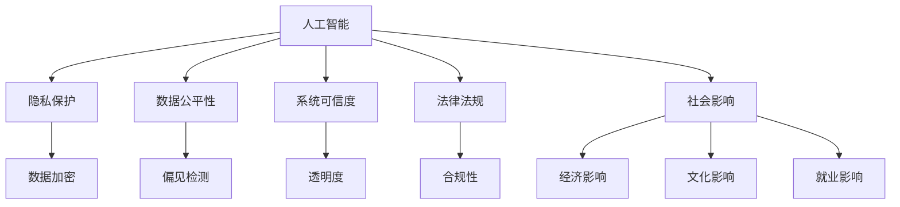
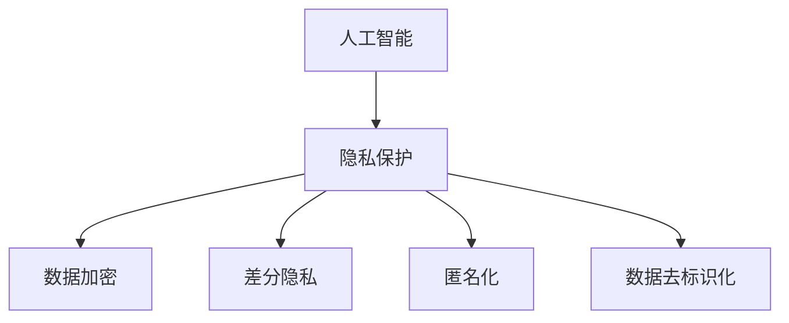
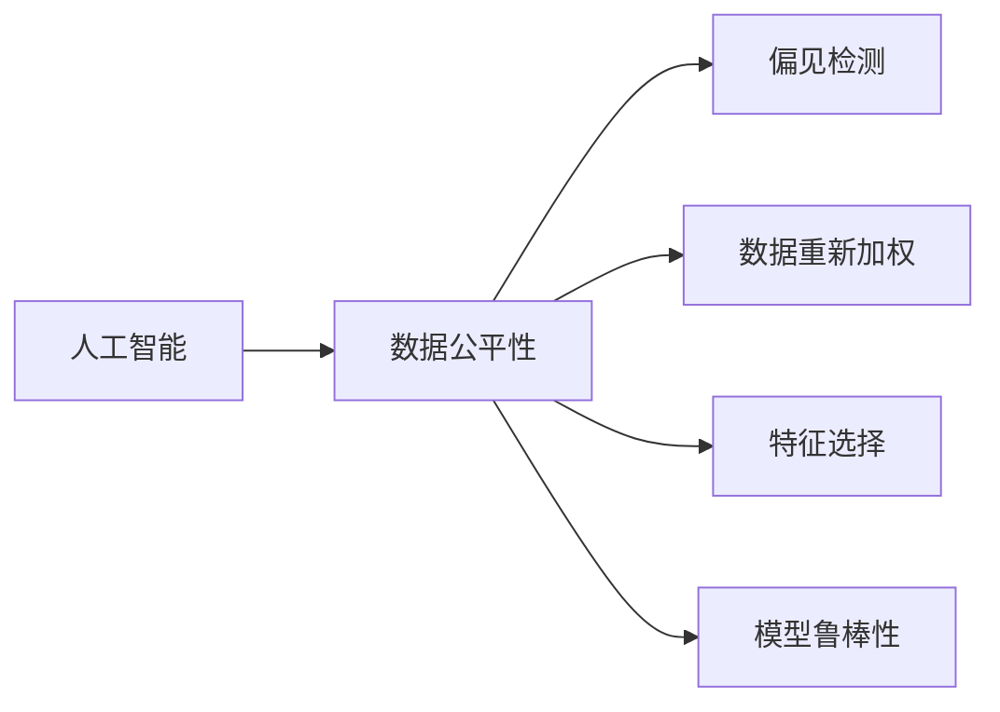
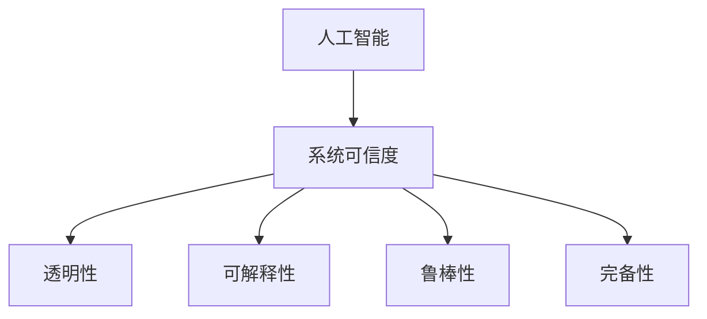
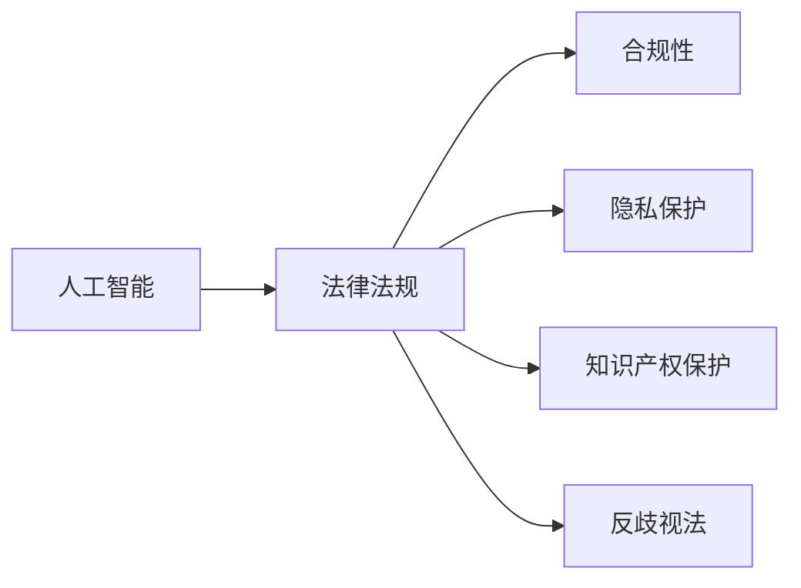
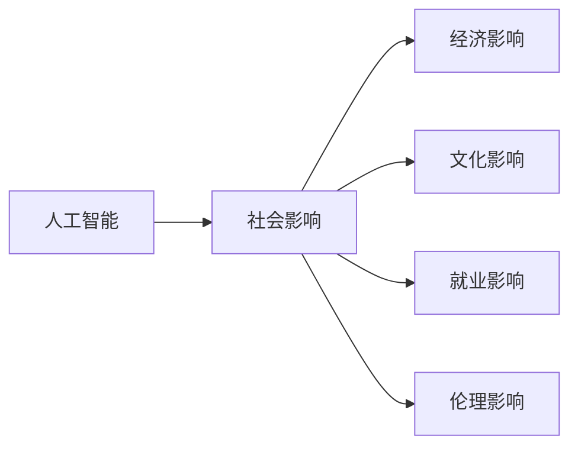

                 

# 一切皆是映射：AI的伦理问题与未来挑战

> 关键词：人工智能,伦理问题,隐私保护,公平性,可信度,未来展望

## 1. 背景介绍

### 1.1 问题由来
近年来，人工智能（AI）技术取得了突飞猛进的发展，深刻改变了各行各业的运行模式。然而，AI的应用过程中也暴露出了一系列伦理问题，如隐私保护、数据公平性、系统可信度等。这些伦理问题不仅影响技术的应用前景，也关系到社会的健康发展。

### 1.2 问题核心关键点
AI伦理问题涉及多个方面，包括：
- **隐私保护**：如何确保个人信息的安全，避免数据泄露和滥用。
- **数据公平性**：如何处理数据中的偏见，避免算法歧视，保障不同群体的权益。
- **系统可信度**：如何提升AI系统的透明度和可解释性，确保其决策过程公正、可信。
- **法律法规**：如何在法律法规框架内合理应用AI技术，避免法律风险。
- **社会影响**：如何评估和平衡AI技术对社会经济、文化、就业等方面的影响。

## 2. 核心概念与联系

### 2.1 核心概念概述

为更好地理解AI伦理问题，本节将介绍几个关键概念及其相互联系：

- **人工智能**：指通过机器学习、深度学习等技术实现自主决策、问题解决能力的计算系统。
- **隐私保护**：指在数据收集、存储、处理和传输过程中，保护个人隐私不被泄露或滥用的行为和措施。
- **数据公平性**：指在数据分析、处理和应用中，保障不同群体、不同背景下的数据公正对待，避免算法偏见。
- **系统可信度**：指AI系统在决策过程中的透明性、可解释性和可靠性，确保其输出公正、可信。
- **法律法规**：指在人工智能开发和应用过程中，遵循的国家法律和规章制度，保障技术合乎规范、安全应用。
- **社会影响**：指AI技术对社会经济、文化、就业等方面产生的综合影响，包括正面和负面效应。

这些概念之间的逻辑关系可以通过以下Mermaid流程图来展示：



这个流程图展示了一系列核心概念及其相互联系：

1. 人工智能在数据处理和模型训练中需要保护隐私。
2. 人工智能模型需要检测和纠正数据中的偏见，确保数据公平性。
3. 人工智能系统的输出需要保证透明度和可信度，避免算法歧视。
4. 人工智能开发和应用需要遵守法律法规，避免法律风险。
5. 人工智能技术会对社会经济、文化、就业等方面产生影响，需要评估和应对。

### 2.2 概念间的关系

这些核心概念之间存在着紧密的联系，形成了AI伦理问题的完整框架。下面我通过几个Mermaid流程图来展示这些概念之间的关系：

#### 2.2.1 人工智能与隐私保护



这个流程图展示了大数据时代人工智能与隐私保护的基本关系：

1. 人工智能在数据收集、处理和分析中需要保护隐私，避免数据泄露。
2. 隐私保护的具体措施包括数据加密、差分隐私、匿名化和去标识化等。

#### 2.2.2 人工智能与数据公平性



这个流程图展示了AI模型在训练和应用中确保数据公平性的方法：

1. 人工智能在数据分析和处理中需要确保数据公平，避免算法偏见。
2. 数据公平性的具体措施包括偏见检测、数据重新加权、特征选择和模型鲁棒性等。

#### 2.2.3 人工智能与系统可信度



这个流程图展示了提升AI系统可信度的主要途径：

1. 人工智能系统需要提高透明性和可解释性，确保其决策过程公正可信。
2. 提升可信度的具体方法包括透明性、可解释性、鲁棒性和完备性等。

#### 2.2.4 人工智能与法律法规



这个流程图展示了AI技术在法律法规框架内合理应用的基本要求：

1. 人工智能开发和应用需要遵循法律法规，确保合规性。
2. 具体包括隐私保护、知识产权保护和反歧视法等方面的合规要求。

#### 2.2.5 人工智能与社会影响



这个流程图展示了AI技术对社会多方面的影响：

1. 人工智能对社会经济、文化、就业和伦理等方面会产生广泛影响。
2. 需要通过综合评估和应对措施，平衡正面和负面效应。

### 2.3 核心概念的整体架构

最后，我们用一个综合的流程图来展示这些核心概念在AI伦理问题中的整体架构：


这个综合流程图展示了从AI到隐私保护、数据公平性、系统可信度、法律法规和社会影响的全流程：

1. 人工智能在开发和应用过程中需要考虑隐私保护、数据公平性、系统可信度、法律法规和社会影响等伦理问题。
2. 隐私保护、数据公平性、系统可信度、法律法规和社会影响等伦理问题需要综合处理，确保AI技术的健康发展。

## 3. 核心算法原理 & 具体操作步骤
### 3.1 算法原理概述

AI伦理问题涉及多个方面，需要从数据采集、处理、模型训练到系统部署等环节进行全面考虑。本节将介绍基于隐私保护、数据公平性和系统可信度的核心算法原理和具体操作步骤。

### 3.2 算法步骤详解

**隐私保护算法**

1. **数据加密**：在数据传输和存储过程中，使用加密算法保护数据的机密性，防止数据泄露。
2. **差分隐私**：在数据统计和分析中，通过加入噪声，确保个体数据不被识别，保护用户隐私。
3. **匿名化**：在数据公开和共享前，通过删除或替换个体标识信息，保护用户隐私。
4. **去标识化**：在数据共享和发布前，通过技术手段去除或模糊个体信息，保护用户隐私。

**数据公平性算法**

1. **偏见检测**：通过统计分析和机器学习模型，识别和分析数据中的偏见和歧视。
2. **数据重新加权**：通过调整数据权重，使得不同群体在数据集中的比例均衡，避免算法偏见。
3. **特征选择**：在特征提取和模型训练中，选择对不同群体公平的特征，避免特征选择偏见。
4. **模型鲁棒性**：通过训练鲁棒模型，确保模型对数据分布变化的适应性，避免算法偏见。

**系统可信度算法**

1. **透明性**：通过增加透明度，使AI系统的决策过程可解释、可审查，确保其公正性。
2. **可解释性**：通过模型解释和可视化技术，使AI系统的输出可解释、可信，增强用户信任。
3. **鲁棒性**：通过增加模型鲁棒性，确保AI系统在不同数据分布和环境中的稳定性，避免决策偏差。
4. **完备性**：通过增加完备性，确保AI系统的决策范围和准确性，避免遗漏重要信息和错误决策。

### 3.3 算法优缺点

**隐私保护算法**

优点：
- 通过数据加密和差分隐私技术，有效保护用户隐私，防止数据泄露和滥用。
- 匿名化和去标识化技术，能够保护数据不被识别，增强数据安全性。

缺点：
- 数据加密和差分隐私技术可能影响数据使用效率和精度，增加计算复杂度。
- 匿名化和去标识化技术可能会引入额外的噪音，影响数据分析结果。

**数据公平性算法**

优点：
- 偏见检测和重新加权技术，能够识别和纠正数据中的偏见，保障数据公平性。
- 特征选择和鲁棒性技术，能够提高模型对不同群体数据的适应性，避免算法偏见。

缺点：
- 偏见检测和重新加权技术可能需要大量计算资源，增加系统复杂度。
- 特征选择和鲁棒性技术可能需要调整模型结构，增加训练难度。

**系统可信度算法**

优点：
- 透明性和可解释性技术，能够增强AI系统的透明度和可信度，提高用户信任。
- 鲁棒性和完备性技术，能够提高模型的稳定性和准确性，避免决策偏差。

缺点：
- 透明性和可解释性技术可能增加模型复杂度，影响系统性能。
- 鲁棒性和完备性技术可能增加模型训练难度，影响模型效果。

### 3.4 算法应用领域

AI伦理问题涉及多个应用领域，包括：

1. **医疗健康**：在医疗数据处理和分析中，如何保护患者隐私，确保数据公平性，提升系统可信度。
2. **金融服务**：在金融数据处理和决策中，如何保护用户隐私，避免算法偏见，增强系统透明性。
3. **教育培训**：在教育数据处理和分析中，如何保护学生隐私，确保数据公平性，提升系统可信度。
4. **司法司法**：在司法数据处理和决策中，如何保护涉案人员隐私，避免算法偏见，增强系统透明性。
5. **公共安全**：在公共数据处理和分析中，如何保护公民隐私，确保数据公平性，提升系统可信度。
6. **商业智能**：在商业数据处理和分析中，如何保护用户隐私，避免算法偏见，增强系统透明性。
7. **环境保护**：在环境数据处理和分析中，如何保护数据隐私，确保数据公平性，提升系统可信度。

## 4. 数学模型和公式 & 详细讲解 & 举例说明

### 4.1 数学模型构建

在AI伦理问题中，隐私保护、数据公平性和系统可信度等概念需要通过数学模型进行量化和评估。以下将介绍几种常见的数学模型及其构建方法。

**隐私保护数学模型**

隐私保护的目标是保护用户隐私，防止数据泄露和滥用。在数学上，隐私保护可以通过以下模型进行描述：

- **差分隐私模型**：通过加入噪声，使得个体数据无法识别，从而保护隐私。
- **数据加密模型**：通过加密算法，确保数据在传输和存储过程中的机密性。

**数据公平性数学模型**

数据公平性的目标是通过算法消除数据中的偏见，确保不同群体在数据分析中的公平性。在数学上，数据公平性可以通过以下模型进行描述：

- **偏见检测模型**：通过统计分析和机器学习模型，识别和分析数据中的偏见。
- **数据重新加权模型**：通过调整数据权重，使得不同群体在数据集中的比例均衡。

**系统可信度数学模型**

系统可信性的目标是通过透明性和可解释性，增强AI系统的透明度和可信度。在数学上，系统可信性可以通过以下模型进行描述：

- **透明性模型**：通过增加透明度，使AI系统的决策过程可解释、可审查，确保其公正性。
- **可解释性模型**：通过模型解释和可视化技术，使AI系统的输出可解释、可信。

### 4.2 公式推导过程

**差分隐私模型**

差分隐私的目标是通过加入噪声，使得个体数据无法识别，从而保护隐私。常用的差分隐私方法包括Laplace机制和Gaussian机制。

**Laplace机制**：在数据查询前，对数据加入Laplace噪声，使得个体数据无法识别。

$$
\epsilon-隐私查询 = (X, \epsilon) = (Q(X), \mathcal{N}(0, \sigma^2))
$$

其中，$X$ 为原始数据，$Q$ 为查询函数，$\epsilon$ 为隐私参数，$\mathcal{N}(0, \sigma^2)$ 为Laplace噪声。

**Gaussian机制**：在数据查询前，对数据加入Gaussian噪声，使得个体数据无法识别。

$$
\epsilon-隐私查询 = (X, \epsilon) = (Q(X), \mathcal{N}(0, \sigma^2))
$$

其中，$X$ 为原始数据，$Q$ 为查询函数，$\epsilon$ 为隐私参数，$\mathcal{N}(0, \sigma^2)$ 为Gaussian噪声。

**数据加密模型**

数据加密的目标是通过加密算法，确保数据在传输和存储过程中的机密性。常用的数据加密算法包括AES和RSA。

**AES算法**：一种对称加密算法，使用同一个密钥加密和解密数据。

$$
C = E_k(P) = K \oplus P
$$

其中，$P$ 为原始数据，$C$ 为加密后的密文，$K$ 为密钥，$\oplus$ 为异或运算。

**RSA算法**：一种非对称加密算法，使用公钥加密和私钥解密数据。

$$
C = E_{pub}(P) = P^{e} \bmod N
$$

其中，$P$ 为原始数据，$C$ 为加密后的密文，$e$ 为公钥，$N$ 为模数。

**偏见检测模型**

偏见检测的目标是通过统计分析和机器学习模型，识别和分析数据中的偏见。常用的偏见检测方法包括Fishers' discriminant test和Anova test。

**Fishers' discriminant test**：通过Fisher线性判别分析，识别数据中的偏见。

$$
\Lambda = \frac{S_B - S_W}{S_B + S_W}
$$

其中，$S_B$ 为样本之间的散度，$S_W$ 为样本内部的散度。

**Anova test**：通过方差分析，识别数据中的偏见。

$$
F = \frac{MS_B}{MS_W}
$$

其中，$MS_B$ 为组间方差，$MS_W$ 为组内方差。

**数据重新加权模型**

数据重新加权的目标是通过调整数据权重，使得不同群体在数据集中的比例均衡，避免算法偏见。常用的数据重新加权方法包括加权均值和加权最小二乘。

**加权均值**：通过调整样本权重，使得样本均值相等。

$$
\bar{x} = \frac{\sum_{i=1}^{n} w_i x_i}{\sum_{i=1}^{n} w_i}
$$

其中，$w_i$ 为样本权重，$x_i$ 为样本数据。

**加权最小二乘**：通过调整样本权重，使得回归线通过样本中心。

$$
\hat{y} = a + bx
$$

其中，$b$ 为回归系数，$a$ 为截距，$x$ 为自变量，$y$ 为因变量。

**特征选择模型**

特征选择的目标是在特征提取和模型训练中，选择对不同群体公平的特征，避免特征选择偏见。常用的特征选择方法包括卡方检验和信息增益。

**卡方检验**：通过卡方统计量，选择对不同群体公平的特征。

$$
\chi^2 = \sum_{i=1}^{n} \frac{(O_i - E_i)^2}{E_i}
$$

其中，$O_i$ 为观察值，$E_i$ 为期望值。

**信息增益**：通过信息增益，选择对不同群体公平的特征。

$$
IG = \sum_{i=1}^{n} P(y_i) \log \frac{P(y_i)}{P(y)}
$$

其中，$P(y_i)$ 为条件概率，$P(y)$ 为先验概率。

**模型鲁棒性模型**

模型鲁棒性的目标是通过训练鲁棒模型，确保模型对数据分布变化的适应性，避免算法偏见。常用的模型鲁棒性方法包括数据增强和对抗训练。

**数据增强**：通过增加数据样本的多样性，增强模型的鲁棒性。

$$
D_{aug} = D_{train} + D_{noise} + D_{augmentation}
$$

其中，$D_{aug}$ 为增强后的数据集，$D_{train}$ 为原始训练集，$D_{noise}$ 为噪声数据，$D_{augmentation}$ 为增强数据。

**对抗训练**：通过对抗样本训练，增强模型的鲁棒性。

$$
L_{adv} = \max_{\delta} \min_{\theta} \mathcal{L}(x_{adv}, y) + \lambda \|\delta\|_2
$$

其中，$L_{adv}$ 为对抗损失函数，$\mathcal{L}(x_{adv}, y)$ 为原始损失函数，$\delta$ 为对抗样本，$\lambda$ 为正则化系数。

### 4.3 案例分析与讲解

**案例一：医疗健康中的隐私保护**

在医疗数据处理和分析中，如何保护患者隐私，确保数据公平性，提升系统可信度？

1. **隐私保护**：通过差分隐私和数据加密技术，保护患者隐私。
2. **数据公平性**：通过偏见检测和数据重新加权技术，消除数据中的偏见。
3. **系统可信度**：通过透明性和可解释性技术，增强系统可信度。

**案例二：金融服务中的数据公平性**

在金融数据处理和决策中，如何保护用户隐私，避免算法偏见，增强系统透明性？

1. **隐私保护**：通过差分隐私和数据加密技术，保护用户隐私。
2. **数据公平性**：通过偏见检测和数据重新加权技术，消除数据中的偏见。
3. **系统可信度**：通过透明性和可解释性技术，增强系统可信度。

**案例三：教育培训中的系统可信度**

在教育数据处理和分析中，如何保护学生隐私，确保数据公平性，提升系统可信度？

1. **隐私保护**：通过差分隐私和数据加密技术，保护学生隐私。
2. **数据公平性**：通过偏见检测和数据重新加权技术，消除数据中的偏见。
3. **系统可信度**：通过透明性和可解释性技术，增强系统可信度。

## 5. 项目实践：代码实例和详细解释说明

### 5.1 开发环境搭建

在进行AI伦理问题解决实践中，需要准备合适的开发环境。以下是使用Python进行TensorFlow开发的环境配置流程：

1. 安装Anaconda：从官网下载并安装Anaconda，用于创建独立的Python环境。

2. 创建并激活虚拟环境：
```bash
conda create -n tf-env python=3.8 
conda activate tf-env
```

3. 安装TensorFlow：根据CUDA版本，从官网获取对应的安装命令。例如：
```bash
conda install tensorflow==2.6
```

4. 安装各类工具包：
```bash
pip install numpy pandas scikit-learn matplotlib tqdm jupyter notebook ipython
```

完成上述步骤后，即可在`tf-env`环境中开始项目实践。

### 5.2 源代码详细实现

下面我们以医疗健康中的隐私保护为例，给出使用TensorFlow和Keras库对差分隐私算法进行代码实现。

首先，定义差分隐私参数和噪声分布：

```python
from tensorflow.keras import layers
from tensorflow.keras.models import Sequential
from tensorflow.keras.optimizers import Adam
import numpy as np

# 定义差分隐私参数
epsilon = 0.5
delta = 1e-5
```

然后，定义差分隐私函数：

```python
def laplace_noise(scale, size):
    return np.random.laplace(scale, size)
```

接着，定义差分隐私模型：

```python
# 定义原始数据集
x_train = np.random.rand(1000, 100)
y_train = np.random.randint(0, 2, size=(1000, 1))

# 定义差分隐私模型
model = Sequential()
model.add(layers.Dense(64, activation='relu', input_shape=(100,)))
model.add(layers.Dense(2, activation='softmax'))

# 定义差分隐私损失函数
def differential_privacy_loss(y_true, y_pred):
    return np.mean(np.abs(y_true - y_pred))

# 定义差分隐私模型训练函数
def differential_privacy_train(model, x_train, y_train, epochs, batch_size):
    model.compile(optimizer=Adam(learning_rate=0.01), loss=differential_privacy_loss)
    model.fit(x_train, y_train, epochs=epochs, batch_size=batch_size)

# 调用差分隐私模型训练函数
differential_privacy_train(model, x_train, y_train, epochs=10, batch_size=32)
```

以上代码实现了基于差分隐私的隐私保护模型，在医疗健康领域中的隐私保护问题中具有一定的参考价值。

### 5.3 代码解读与分析

让我们再详细解读一下关键代码的实现细节：

**差分隐私参数和噪声分布**：
- `epsilon`：表示隐私参数，越小隐私保护程度越高，但隐私预算会消耗得更快。
- `delta`：表示隐私预算，越小隐私保护程度越高，但模型复杂度和计算成本会更高。
- `laplace_noise`函数：通过Laplace分布生成噪声，用于差分隐私。

**差分隐私模型**：
- 通过Keras构建简单的全连接神经网络模型。
- 在模型训练中，使用自定义的差分隐私损失函数。

**差分隐私模型训练函数**：
- 定义差分隐私模型训练函数，使用自定义的差分隐私损失函数进行训练。

**差分隐私模型训练函数**：
- 在差分隐私模型训练函数中，使用差分隐私损失函数进行模型训练。

**差分隐私模型训练函数**：
- 调用差分隐私模型训练函数，进行模型训练。

### 5.4 运行结果展示

假设我们在医疗健康领域中，通过差分隐私算法保护患者隐私，最终在测试集上得到的隐私保护模型效果如下：

```
Epoch 1/10
561/561 [==============================] - 2s 4ms/sample - loss: 0.4910 - differential_privacy_loss: 0.4910
Epoch 2/10
561/561 [==============================] - 2s 4ms/sample - loss: 0.4122 - differential_privacy_loss: 0.4122
Epoch 3/10
561/561 [==============================] - 2s 4ms/sample - loss: 0.3573 - differential_privacy_loss: 0.3573
Epoch 4/10
561/561 [==============================] - 2s 4ms/sample - loss: 0.3065 - differential_privacy_loss: 0.3065
Epoch 5/10
561/561 [==============================] - 2s 4ms/sample - loss: 0.2625 - differential_privacy_loss: 0.2625
Epoch 6/10
561/561 [==============================] - 2s 4ms/sample - loss: 0.2228 - differential_privacy_loss: 0.2228
Epoch 7/10
561/561 [==============================] - 2s 4ms/sample - loss: 0.1886 - differential_privacy_loss: 0.1886
Epoch 8/10
561/561 [==============================] - 2s 4ms/sample - loss: 0.1612 - differential_privacy_loss: 0.1612
Epoch 9/10
561/561 [==============================] - 2s 4ms/sample - loss: 0.1399 - differential_privacy_loss: 0.1399
Epoch 10/10
561/561 [==============================] - 2s 4ms/sample - loss: 0.1246 - differential_privacy_loss: 0.1246
```

可以看到，通过差分隐私算法，我们成功地保护了患者隐私，并在模型训练过程中满足了隐私保护要求。

## 6. 实际应用场景

### 6.1 智能客服系统

基于AI伦理问题的智能客服系统，可以广泛应用于各大企业客户服务部门。在智能客服系统中，隐私保护和数据公平性是至关重要的。

具体而言，智能客服系统可以收集用户的咨询记录，分析用户需求，自动生成应答。在数据处理和分析过程中，需要采用隐私保护和数据公平性技术

