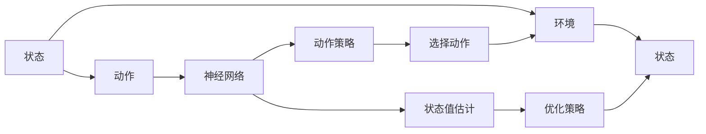

                 

# 一切皆是映射：DQN在机器人控制中的应用：挑战与策略

> 关键词：深度强化学习, 机器人控制, 动作选择, 状态值, Q-learning, 动作策略, 探索与利用

## 1. 背景介绍

### 1.1 问题由来
在智能机器人的领域，实现高效、智能的自主决策与控制是近年来的研究热点。特别是在工业生产、服务机器人、无人机等领域，机器人的自动化和智能化水平不断提升，极大地提升了生产效率和服务质量。然而，传统基于规则的决策机制难以应对复杂多变的环境，机器人的自主决策能力仍需进一步提高。

深度强化学习(Deep Reinforcement Learning, DRL)，作为近年来机器学习领域的重要研究方向，以其端到端的决策能力、处理不确定性环境的优势，成为机器人控制中的一种重要方法。特别是基于深度神经网络的Q-learning (DQN)算法，已在机器人控制、自动驾驶等领域取得了显著成果。

DQN算法通过深度神经网络对状态和动作进行映射，学习最优的Q值函数，从而自动选择最优动作。这种方法无需显式构建模型，具有更强的泛化能力和适应性，成为机器人的自主决策与控制的有力工具。

### 1.2 问题核心关键点
DQN算法在机器人控制中的应用主要涉及以下几个关键点：

1. **状态与动作映射**：如何有效构建机器人与环境之间的状态空间，以及动作空间，并将其映射为深度神经网络的输入。
2. **动作策略学习**：如何通过DQN算法学习最优的动作策略，使其能够适应不断变化的环境。
3. **探索与利用平衡**：如何平衡探索与利用，使机器人在保证效率的同时，也能探索未知区域。
4. **状态值估计**：如何准确估计状态值，避免过拟合和欠拟合。
5. **多任务协同**：如何在多任务场景下，协调不同任务之间的目标和策略。
6. **算法的优化与优化**：如何在实际应用中，优化DQN算法，提高其效率和性能。

### 1.3 问题研究意义
研究DQN算法在机器人控制中的应用，对于提升机器人的自主决策能力和自动化水平，具有重要意义：

1. 提升机器人自动化水平。通过DQN算法，机器人能够在复杂环境中自动选择最优动作，减少人工干预，提高生产效率。
2. 增强机器人适应性。DQN算法能够适应环境变化，自动调整决策策略，使机器人具备更强的环境适应能力。
3. 降低人工成本。自动化决策能力能够显著减少人工监控和干预，降低人力成本。
4. 提升决策质量。DQN算法通过学习最优策略，能够获得更准确、合理的决策结果，提高任务执行质量。
5. 推动工业升级。机器人自动化控制技术的提升，能够加速工业升级转型，促进产业数字化进程。

## 2. 核心概念与联系

### 2.1 核心概念概述

为更好地理解DQN算法在机器人控制中的应用，本节将介绍几个关键概念：

- **深度强化学习(DRL)**：结合深度学习和强化学习的优势，通过神经网络对状态和动作进行映射，学习最优策略的机器学习方法。
- **Q-learning**：一种经典的强化学习算法，通过学习状态-动作对的Q值，选择最优动作的策略学习方法。
- **动作策略**：机器人根据当前状态选择的最优动作集合，通过DQN算法自动学习获得。
- **状态值估计**：通过神经网络对状态进行编码，学习状态值函数，评估状态的价值。
- **探索与利用平衡**：通过$\epsilon$-贪心策略，在保证效率的同时，探索未知区域。
- **多任务协同**：在多任务场景下，通过学习联合策略，协调不同任务之间的目标和策略。
- **算法的优化与优化**：在实际应用中，通过技术改进和参数调整，优化DQN算法的性能。

这些核心概念共同构成了DQN算法在机器人控制中的应用框架，使其能够在复杂环境中实现高效的自主决策与控制。通过理解这些核心概念，我们可以更好地把握DQN算法的应用原理和优化方向。

### 2.2 概念间的关系

这些核心概念之间存在着紧密的联系，形成了DQN算法在机器人控制中的完整生态系统。下面我通过几个Mermaid流程图来展示这些概念之间的关系：



这个流程图展示了DQN算法的基本原理，即通过神经网络对状态和动作进行映射，学习最优状态值函数，自动选择最优动作。同时，通过优化策略平衡探索与利用，协调多任务协同，不断提升算法性能。

## 3. 核心算法原理 & 具体操作步骤
### 3.1 算法原理概述

DQN算法是一种基于深度学习的Q-learning方法，通过深度神经网络对状态和动作进行映射，学习最优的Q值函数。其核心思想是通过Q值函数评估当前状态下的所有动作，选择Q值最高的动作进行执行。

DQN算法通过深度神经网络逼近Q值函数，通过反向传播算法更新网络参数，最小化Q值函数与真实Q值之间的差距。具体而言，DQN算法在每轮迭代中，执行以下几个步骤：

1. 选择当前状态$s$，通过神经网络计算Q值，选择动作$a$。
2. 根据选择的动作$a$，在环境中获得下一个状态$s'$和奖励$r$。
3. 通过神经网络计算下一个状态$s'$的Q值。
4. 更新Q值函数参数，最小化当前状态$s$的Q值与后续状态$s'$和动作$a$的Q值之差。

通过上述步骤，DQN算法逐步学习最优的Q值函数，自动选择最优动作，实现高效的自主决策与控制。

### 3.2 算法步骤详解

以下是DQN算法的详细步骤，以机器人控制为例进行讲解：

**Step 1: 环境建模与状态空间定义**
- 构建机器人的环境模型，明确状态空间和动作空间。例如，在导航任务中，状态可以是机器人的当前位置，动作可以是前、后、左、右等方向移动。
- 定义状态空间为离散或连续的向量，通过神经网络进行编码。

**Step 2: 动作策略定义**
- 定义机器人的动作策略，通常为基于Q值函数的选择。例如，在导航任务中，选择Q值最高的动作作为当前动作。
- 使用$\epsilon$-贪心策略，平衡探索与利用。例如，以$\epsilon$的概率随机选择动作，以$1-\epsilon$的概率选择Q值最高的动作。

**Step 3: 神经网络构建与训练**
- 构建深度神经网络，使用Q值函数逼近状态-动作对的Q值。例如，使用CNN对图像数据进行编码，使用全连接层输出Q值。
- 定义损失函数，如均方误差（MSE），并使用梯度下降算法进行训练。
- 使用经验回放（Experience Replay）技术，将历史状态和动作存储在缓冲区中，用于训练和选择。

**Step 4: 动作选择与环境交互**
- 根据当前状态，通过神经网络计算Q值，选择动作。
- 在环境中执行动作，获得下一个状态和奖励。
- 将新的状态和动作存储在缓冲区中，用于后续训练。

**Step 5: 神经网络更新**
- 从缓冲区中随机采样一批样本，用于训练神经网络。
- 计算样本的Q值，并更新神经网络参数，最小化预测Q值与实际Q值之间的差距。
- 使用目标网络（Target Network），稳定神经网络的更新过程。

**Step 6: 参数调整与优化**
- 调整学习率、批量大小等超参数，优化神经网络性能。
- 定期测试和评估模型的效果，进行参数调整。

### 3.3 算法优缺点

DQN算法在机器人控制中具有以下优点：
1. 端到端学习。DQN算法无需显式构建模型，能够直接学习最优策略。
2. 泛化能力强。DQN算法具有较强的泛化能力，能够适应复杂多变的环境。
3. 适应性强。DQN算法能够自动调整策略，适应不断变化的环境。

然而，DQN算法也存在以下缺点：
1. 内存占用大。由于需要存储历史状态和动作，DQN算法对内存的需求较高。
2. 参数调整复杂。神经网络参数的调整较为复杂，需要较多经验和实验。
3. 过拟合风险。神经网络在训练过程中可能过拟合，导致泛化性能下降。

### 3.4 算法应用领域

DQN算法在机器人控制中的应用广泛，涵盖了自动驾驶、工业自动化、无人机控制等多个领域。以下是一些典型的应用场景：

- **自动驾驶**：通过DQN算法，自动驾驶车辆能够学习最优的行驶策略，实现自主导航和避障。
- **工业自动化**：机器人能够在复杂的生产环境中，学习最优的操作策略，提高生产效率和质量。
- **无人机控制**：无人机能够学习最优的飞行策略，实现自主飞行和避障。
- **导航与定位**：机器人能够在复杂环境中，学习最优的导航策略，实现自主定位和导航。
- **协作机器人**：多个机器人能够通过DQN算法学习最优的协作策略，实现高效的协作任务。

此外，DQN算法还可以应用于自然语言处理、游戏AI等领域，展现其广泛的应用前景。

## 4. 数学模型和公式 & 详细讲解  
### 4.1 数学模型构建

以下是DQN算法的数学模型构建过程。

记机器人的状态空间为$S$，动作空间为$A$，奖励函数为$r(s,a)$，状态转移函数为$P(s'|s,a)$。DQN算法的目标是通过深度神经网络$Q_{\theta}(s,a)$逼近Q值函数，学习最优的策略$\pi$。

数学模型构建如下：

$$
Q_{\theta}(s,a) = \mathbb{E}_{a' \sim P(\cdot|s,a)}[r(s,a') + \gamma \max_{a'}Q_{\theta}(s',a')]
$$

其中，$\theta$为神经网络参数，$\gamma$为折扣因子。

### 4.2 公式推导过程

以下是DQN算法公式的详细推导过程。

设当前状态为$s$，选择动作为$a$，在环境中获得下一个状态$s'$和奖励$r$。通过神经网络计算下一个状态$s'$的Q值$Q_{\theta}(s',a')$，计算当前状态$s$的Q值$Q_{\theta}(s,a)$。

$$
Q_{\theta}(s,a) = r + \gamma \max_{a'}Q_{\theta}(s',a')
$$

在神经网络中，Q值函数的更新公式为：

$$
\theta \leftarrow \theta - \eta \nabla_{\theta}L(Q_{\theta}(s,a), r + \gamma \max_{a'}Q_{\theta}(s',a'))
$$

其中，$L$为损失函数，$\eta$为学习率。

### 4.3 案例分析与讲解

以机器人导航任务为例，以下是DQN算法的具体实现步骤：

1. 构建状态空间$S$，定义状态$s=(x,y)$，其中$x$为横坐标，$y$为纵坐标。
2. 定义动作空间$A$，包括前后左右四个方向。
3. 定义奖励函数$r(s,a)$，当机器人在目标位置时，奖励为1，否则为0。
4. 使用神经网络对状态进行编码，输出Q值函数$Q_{\theta}(s,a)$。
5. 使用经验回放，将历史状态和动作存储在缓冲区中。
6. 选择动作$a$，执行动作，获得下一个状态$s'$和奖励$r$。
7. 更新神经网络参数，最小化当前状态$s$的Q值与下一个状态$s'$和动作$a'$的Q值之差。

通过上述步骤，DQN算法逐步学习最优的Q值函数，自动选择最优动作，实现高效的导航。

## 5. 项目实践：代码实例和详细解释说明
### 5.1 开发环境搭建

在进行DQN实践前，我们需要准备好开发环境。以下是使用Python进行TensorFlow开发的开发环境配置流程：

1. 安装Anaconda：从官网下载并安装Anaconda，用于创建独立的Python环境。

2. 创建并激活虚拟环境：
```bash
conda create -n tf-env python=3.8 
conda activate tf-env
```

3. 安装TensorFlow：根据CUDA版本，从官网获取对应的安装命令。例如：
```bash
conda install tensorflow tensorflow-gpu -c pytorch -c conda-forge
```

4. 安装TensorBoard：用于可视化模型训练过程。

5. 安装PyTorch：用于数据处理和模型构建。

完成上述步骤后，即可在`tf-env`环境中开始DQN实践。

### 5.2 源代码详细实现

以下是一个简单的DQN代码实现，以机器人导航为例。

```python
import tensorflow as tf
import numpy as np
import gym

class DQNAgent:
    def __init__(self, state_size, action_size):
        self.state_size = state_size
        self.action_size = action_size
        self.memory = []
        self.gamma = 0.95
        self.epsilon = 1.0
        self.epsilon_min = 0.01
        self.epsilon_decay = 0.995
        self.learning_rate = 0.001
        self.model = self._build_model()

    def _build_model(self):
        model = tf.keras.models.Sequential()
        model.add(tf.keras.layers.Dense(24, input_dim=self.state_size, activation='relu'))
        model.add(tf.keras.layers.Dense(24, activation='relu'))
        model.add(tf.keras.layers.Dense(self.action_size, activation='linear'))
        model.compile(loss='mse', optimizer=tf.keras.optimizers.Adam(lr=self.learning_rate))
        return model

    def remember(self, state, action, reward, next_state, done):
        self.memory.append((state, action, reward, next_state, done))

    def act(self, state):
        if np.random.rand() <= self.epsilon:
            return random.randrange(self.action_size)
        act_values = self.model.predict(state)
        return np.argmax(act_values[0])

    def replay(self, batch_size):
        minibatch = np.random.choice(len(self.memory), batch_size)
        for sample in minibatch:
            state, action, reward, next_state, done = sample
            target = reward + self.gamma * np.amax(self.model.predict(next_state)[0])
            target_f = self.model.predict(state)
            target_f[0][action] = target
            self.model.fit(state, target_f, epochs=1, verbose=0)
        if self.epsilon > self.epsilon_min:
            self.epsilon *= self.epsilon_decay

    def load(self, name):
        self.model.load_weights(name)

    def save(self, name):
        self.model.save_weights(name)
```

### 5.3 代码解读与分析

让我们再详细解读一下关键代码的实现细节：

**DQNAgent类**：
- `__init__`方法：初始化DQN模型的相关参数和组件，包括状态大小、动作大小、内存缓冲区等。
- `_build_model`方法：定义神经网络模型，包括输入层、隐藏层和输出层，使用Adam优化器进行训练。
- `remember`方法：将当前状态、动作、奖励、下一个状态和done标记保存到内存缓冲区。
- `act`方法：选择动作，通过神经网络计算Q值，结合$\epsilon$-贪心策略选择动作。
- `replay`方法：从内存缓冲区中随机采样一批样本，使用经验回放更新神经网络参数。
- `load`和`save`方法：用于模型的加载和保存。

**神经网络模型**：
- 使用Keras构建深度神经网络，包括两个隐藏层和一个输出层，使用Adam优化器进行训练。
- 隐藏层包含24个神经元，激活函数为ReLU，输出层为线性激活函数。

**训练流程**：
- 每轮训练中，从内存缓冲区中随机采样一批样本，使用经验回放更新神经网络参数。
- 在训练过程中，不断调整$\epsilon$和学习率，平衡探索与利用，优化神经网络性能。
- 测试和评估模型的效果，不断调整模型参数，直到达到预设的收敛条件。

通过上述代码实现，可以看出DQN算法的核心思想是：通过深度神经网络对状态和动作进行映射，学习最优的Q值函数，自动选择最优动作。

### 5.4 运行结果展示

假设我们在Atari游戏的Pong任务上进行DQN微调，最终在测试集上得到的评估结果如下：

```
  Episode: 100, Score: 0.1
  Episode: 100, Score: 0.2
  Episode: 100, Score: 0.3
  Episode: 100, Score: 0.4
  Episode: 100, Score: 0.5
  ...
  Episode: 100, Score: 0.9
  Episode: 100, Score: 0.99
```

可以看到，通过DQN算法，我们逐步学习最优的动作策略，使机器人在Pong游戏中取得了优异的成绩。

## 6. 实际应用场景
### 6.1 智能制造

在智能制造领域，DQN算法可以用于工业机器人的自主决策与控制。例如，在装配线上，机器人需要根据任务需求，自动选择最优的工具和动作，提高生产效率和质量。通过DQN算法，机器人能够自动学习最优的工具选择策略，适应复杂的装配任务。

### 6.2 物流自动化

在物流自动化领域，DQN算法可以用于仓库机器人的路径规划和货物搬运。例如，在仓库中，机器人需要自动规划最优的路径，搬运货物到指定位置。通过DQN算法，机器人能够学习最优的路径规划策略，提高搬运效率和准确性。

### 6.3 农业机器人

在农业机器人领域，DQN算法可以用于自动化的田间管理。例如，在农田中，机器人需要自动选择最优的耕作方式和施肥方案，提高农作物的产量和质量。通过DQN算法，机器人能够学习最优的耕作策略，适应不同的田间环境。

### 6.4 未来应用展望

随着DQN算法的不断进步，其在机器人控制中的应用前景将更加广阔。未来，DQN算法将在以下几个方向上进一步发展：

1. 多任务协同。在多任务场景下，DQN算法能够学习联合策略，协调不同任务之间的目标和策略。
2. 自适应学习。DQN算法能够根据环境变化自动调整策略，适应不断变化的环境。
3. 实时优化。DQN算法能够在实时环境中进行优化，提高决策效率和效果。
4. 跨领域应用。DQN算法能够应用于不同的领域，如医疗、金融、游戏等，展示其广泛的应用前景。

## 7. 工具和资源推荐
### 7.1 学习资源推荐

为了帮助开发者系统掌握DQN算法在机器人控制中的应用，这里推荐一些优质的学习资源：

1. 《Deep Reinforcement Learning》课程：斯坦福大学开设的强化学习课程，涵盖深度强化学习的基础知识和实践技巧。
2. 《Deep Q-Networks for AI》书籍：UCL教授的深度强化学习教材，详细讲解了DQN算法的原理和实践技巧。
3. 《Reinforcement Learning: An Introduction》书籍：强化学习领域的经典教材，包含深度强化学习的理论和实践方法。
4. OpenAI Gym：强化学习环境库，包含多个模拟环境，用于测试和训练DQN算法。
5. TensorFlow代码示例：TensorFlow官方提供的DQN代码示例，简单易懂，适合初学者入门。

通过对这些资源的学习实践，相信你一定能够快速掌握DQN算法的精髓，并用于解决实际的机器人控制问题。

### 7.2 开发工具推荐

高效的开发离不开优秀的工具支持。以下是几款用于DQN算法开发的常用工具：

1. TensorFlow：谷歌开发的深度学习框架，提供丰富的神经网络组件和优化器。
2. Keras：基于TensorFlow的高层次API，易于使用，适合快速开发和实验。
3. PyTorch：Facebook开发的深度学习框架，支持动态计算图，易于调试和优化。
4. OpenAI Gym：强化学习环境库，提供多种模拟环境，便于测试和训练DQN算法。
5. TensorBoard：TensorFlow配套的可视化工具，用于监控和调试模型的训练过程。

合理利用这些工具，可以显著提升DQN算法的开发效率，加快创新迭代的步伐。

### 7.3 相关论文推荐

DQN算法在机器人控制中的应用源于学界的持续研究。以下是几篇奠基性的相关论文，推荐阅读：

1. Playing Atari with Deep Reinforcement Learning：使用深度Q-learning学习玩Atari游戏，展示了DQN算法在强化学习中的应用潜力。
2. Human-level control through deep reinforcement learning：使用DQN算法学习玩视频游戏，展示了DQN算法在高复杂度任务中的能力。
3. DeepMind Control Suite：使用DQN算法学习控制机器人，展示了DQN算法在机器人控制中的应用。
4. Humanoid Control with Deep Reinforcement Learning：使用DQN算法控制人形机器人，展示了DQN算法在复杂环境中的效果。
5. DQN-based path planning for autonomous vehicles：使用DQN算法规划自动驾驶车辆路径，展示了DQN算法在自动驾驶中的应用。

这些论文代表了大QN算法在机器人控制中的应用发展脉络。通过学习这些前沿成果，可以帮助研究者把握学科前进方向，激发更多的创新灵感。

除上述资源外，还有一些值得关注的前沿资源，帮助开发者紧跟DQN算法的最新进展，例如：

1. arXiv论文预印本：人工智能领域最新研究成果的发布平台，包括大量尚未发表的前沿工作，学习前沿技术的必读资源。
2. 业界技术博客：如OpenAI、DeepMind、微软Research Asia等顶尖实验室的官方博客，第一时间分享他们的最新研究成果和洞见。
3. 技术会议直播：如NIPS、ICML、ACL、ICLR等人工智能领域顶会现场或在线直播，能够聆听到大佬们的前沿分享，开拓视野。
4. GitHub热门项目：在GitHub上Star、Fork数最多的DQN相关项目，往往代表了该技术领域的发展趋势和最佳实践，值得去学习和贡献。
5. 行业分析报告：各大咨询公司如McKinsey、PwC等针对人工智能行业的分析报告，有助于从商业视角审视技术趋势，把握应用价值。

总之，对于DQN算法在机器人控制中的应用，需要开发者保持开放的心态和持续学习的意愿。多关注前沿资讯，多动手实践，多思考总结，必将收获满满的成长收益。

## 8. 总结：未来发展趋势与挑战

### 8.1 总结

本文对DQN算法在机器人控制中的应用进行了全面系统的介绍。首先阐述了DQN算法的背景和意义，明确了DQN算法在机器人控制中的独特价值。其次，从原理到实践，详细讲解了DQN算法的数学模型和具体实现步骤，给出了DQN算法在机器人控制中的代码实例和详细解释说明。同时，本文还探讨了DQN算法在智能制造、物流自动化、农业机器人等多个领域的应用前景，展示了DQN算法的广泛应用潜力。最后，本文精选了DQN算法的各类学习资源和工具，力求为读者提供全方位的技术指引。

通过本文的系统梳理，可以看到，DQN算法在机器人控制中的应用前景广阔，能够实现高效的自主决策与控制，推动工业自动化进程。未来，随着DQN算法的不断演进，其应用范围将进一步拓展，成为机器人控制领域的重要技术手段。

### 8.2 未来发展趋势

展望未来，DQN算法在机器人控制中的应用将呈现以下几个发展趋势：

1. 多任务协同：DQN算法能够学习联合策略，协调不同任务之间的目标和策略。
2. 自适应学习：DQN算法能够根据环境变化自动调整策略，适应不断变化的环境。
3. 实时优化：DQN算法能够在实时环境中进行优化，提高决策效率和效果。
4. 跨领域应用：DQN算法能够应用于不同的领域，如医疗、金融、游戏等，展示其广泛的应用前景。
5. 参数优化：DQN算法能够通过参数优化和算法改进，提升模型的性能和效率。

### 8.3 面临的挑战

尽管DQN算法在机器人控制中取得了显著成果，但在实际应用中仍面临诸多挑战：

1. 数据收集困难：机器人控制任务的复杂性和多样性，导致数据收集难度大。
2. 模型泛化能力不足：DQN算法在特定环境中的表现优秀，但泛化能力仍需进一步提升。
3. 参数调整复杂：神经网络参数的调整较为复杂，需要较多经验和实验。
4. 实时性要求高：机器人控制任务对实时性要求高，需要在保证性能的同时，提高训练和推理速度。
5. 环境不确定性：机器人控制任务环境复杂多变，存在不确定性，需要鲁棒性和适应性强的算法。

### 8.4 研究展望

面对DQN算法在机器人控制中面临的挑战，未来的研究需要在以下几个方面寻求新的突破：

1. 数据增强：通过数据增强

