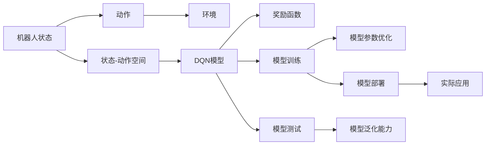
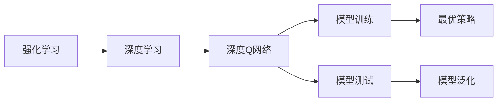
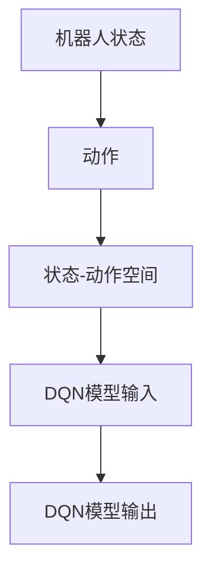
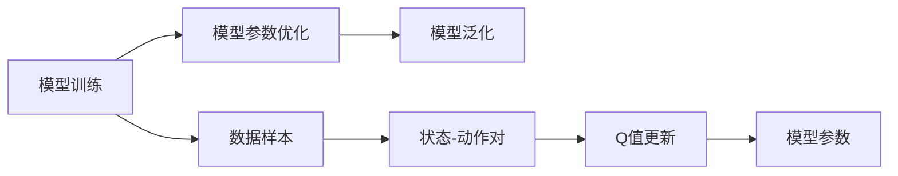
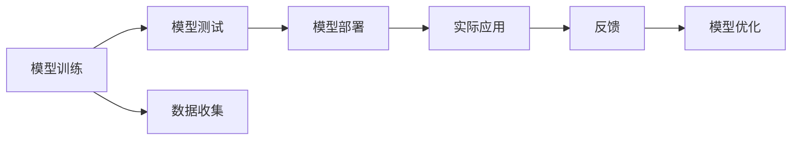
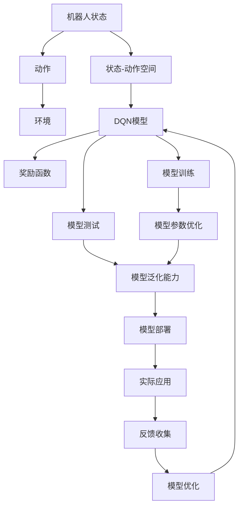

                 

# 一切皆是映射：DQN在机器人领域的实践：挑战与策略

## 1. 背景介绍

### 1.1 问题由来

近年来，深度学习技术的迅猛发展，极大地推动了人工智能领域的发展。在此背景下，深度强化学习（DRL）尤其是深度Q网络（DQN）在机器人控制、自主导航、自适应系统等领域得到广泛应用，展现出巨大的潜力。DQN通过拟合Q值函数，能够有效学习最优策略，直接适用于控制决策问题，与传统机器学习算法相比，具备更高的模型泛化能力和数据效率。

然而，尽管DQN在某些特定问题上取得了显著进展，但在机器人领域的大规模应用仍面临诸多挑战。例如，高维状态空间、复杂动态环境、连续动作空间等问题使得DQN在机器人控制中难以直接应用。此外，机器人与环境之间的动态交互，加上机器人自身物理特性，进一步增加了模型训练的复杂度。

本文将系统介绍DQN在机器人领域的应用实践，围绕其面临的挑战和应对策略展开深入讨论，为相关领域的科研和工程实践提供参考。

### 1.2 问题核心关键点

DQN在机器人领域的应用核心关键点包括：

- **状态空间建模**：机器人状态空间的建模是其应用的前提，如何高效、准确地捕捉机器人当前状态至关重要。
- **动作空间离散化**：机器人动作空间通常连续且复杂，需要进行离散化处理以适应DQN的输入格式。
- **奖励设计**：奖励函数的定义需要与机器人任务目标高度相关，以指导模型学习最优策略。
- **模型训练**：如何在大规模复杂环境中进行模型训练，避免过拟合，同时提高模型的泛化能力。
- **模型部署与测试**：将训练好的模型部署到机器人系统中，进行实际应用和性能测试，确保模型在真实环境中的稳定性和可靠性。

本文将围绕上述关键点，详细探讨DQN在机器人领域的实际应用。

### 1.3 问题研究意义

研究DQN在机器人领域的应用，对于推进机器人智能化、自动化水平，加速自动化技术落地应用具有重要意义：

- **提升机器人决策能力**：DQN通过学习最优策略，能够显著提升机器人决策的准确性和效率。
- **优化机器人运动控制**：DQN能够学习到最优控制策略，使机器人能够在复杂环境中自主导航和操作。
- **降低机器人系统开发成本**：相较于传统控制算法，DQN在适应新任务和新环境时更加高效，能够快速迭代优化。
- **促进跨学科融合**：DQN的应用涉及机器学习、控制理论、机器人学等多学科知识，推动了相关领域的交叉研究。
- **推动机器人技术普及**：通过优化机器人决策和控制算法，使机器人技术更容易被各行各业所采用，促进自动化技术在更多领域的应用。

## 2. 核心概念与联系

### 2.1 核心概念概述

为了更好地理解DQN在机器人领域的应用，本节将介绍几个密切相关的核心概念：

- **深度强化学习（DRL）**：一种结合深度神经网络和强化学习思想的机器学习方法，适用于控制决策问题。
- **深度Q网络（DQN）**：一种基于深度神经网络的强化学习算法，通过拟合Q值函数，直接学习最优策略。
- **状态-动作空间**：机器人在执行任务时所处的环境状态和可能的动作组合，是DQN输入和输出的关键。
- **奖励函数**：根据机器人在每个时间步的行为给予的奖励，指导模型学习最优策略。
- **模型训练与测试**：DQN模型通过大量样本数据进行训练，并利用测试集验证模型泛化能力的过程。
- **模型部署**：将训练好的DQN模型部署到实际机器人系统中，进行实际应用。

这些核心概念之间存在着紧密的联系，形成了DQN在机器人领域应用的完整框架。下面我们将通过几个Mermaid流程图来展示这些概念之间的关系：



这个流程图展示了DQN在机器人领域应用的全过程，从状态空间建模、动作空间离散化到模型训练、测试和部署。通过这些关键步骤，我们可以更好地理解DQN如何在机器人领域发挥其独特优势。

### 2.2 概念间的关系

这些核心概念之间存在着紧密的联系，形成了DQN在机器人领域应用的完整框架。下面我通过几个Mermaid流程图来展示这些概念之间的关系：

#### 2.2.1 DRL与DQN的关系



这个流程图展示了DRL与DQN的基本关系。DQN作为一种基于深度神经网络的强化学习算法，通过拟合Q值函数，直接学习最优策略。

#### 2.2.2 状态-动作空间与模型输入输出



这个流程图展示了状态-动作空间与DQN模型的输入输出关系。机器人状态和动作通过状态-动作空间编码，作为DQN模型的输入。

#### 2.2.3 模型训练与参数优化



这个流程图展示了模型训练与参数优化的关系。通过大量数据样本进行模型训练，利用奖励函数更新模型参数，优化Q值函数，最终实现最优策略学习。

#### 2.2.4 模型部署与实际应用



这个流程图展示了模型部署与实际应用的关系。训练好的模型部署到实际机器人系统中，进行实际应用和性能测试，根据反馈进行模型优化。

### 2.3 核心概念的整体架构

最后，我们用一个综合的流程图来展示这些核心概念在大规模应用中的整体架构：



这个综合流程图展示了从状态空间建模、动作空间离散化到模型训练、测试和部署，最后到模型优化和实际应用的完整过程。通过这些步骤，DQN能够在机器人领域发挥其独特优势，实现智能决策和优化控制。

## 3. 核心算法原理 & 具体操作步骤
### 3.1 算法原理概述

DQN是一种基于深度神经网络的强化学习算法，通过拟合Q值函数，直接学习最优策略。其基本思想是：通过蒙特卡洛方法估计Q值，利用神经网络逼近Q值函数，使得Q值函数的估计更加准确，从而提高策略学习的效果。

DQN的基本算法流程包括：

1. 将机器人在当前状态下的动作序列输入到深度神经网络中，得到对应动作的Q值估计。
2. 选择Q值最大的动作，根据环境反馈更新Q值函数。
3. 利用经验回放（Experience Replay）技术，将历史状态-动作对存储在经验缓冲区中，供模型训练使用。
4. 在模型训练过程中，随机从经验缓冲区中抽取样本，进行模型参数更新，最小化实际Q值与模型预测Q值之间的误差。

DQN的核心在于Q值函数的拟合，通过不断更新Q值函数，使得模型能够学习到最优策略。

### 3.2 算法步骤详解

以下是DQN在机器人领域的具体实现步骤：

**Step 1: 数据收集与预处理**

- 收集机器人历史状态和动作数据，并进行预处理，将连续状态转换为离散状态。
- 对动作空间进行离散化处理，使其符合DQN的输入格式。
- 定义奖励函数，确保奖励值与机器人任务目标高度相关。

**Step 2: 模型搭建与训练**

- 搭建深度神经网络模型，将输入状态映射到Q值输出。
- 定义经验回放缓冲区，存储历史状态-动作对。
- 利用样本抽取技术从经验缓冲区中随机抽取样本，更新模型参数。
- 定义损失函数，最小化模型预测Q值与实际Q值之间的误差。

**Step 3: 模型评估与优化**

- 在测试集上评估模型性能，验证其泛化能力。
- 根据评估结果，优化模型结构和参数，提高模型效果。
- 将训练好的模型部署到实际机器人系统中，进行实际应用。

**Step 4: 实际应用与反馈**

- 将模型应用于实际机器人系统中，记录状态、动作和环境反馈。
- 利用收集到的数据，更新模型参数，进一步优化模型性能。
- 根据实际应用反馈，进行模型调整和改进。

### 3.3 算法优缺点

DQN在机器人领域的应用有以下优点：

- **适应性强**：DQN能够适应复杂、动态的环境，学习到最优策略。
- **数据效率高**：DQN在有限数据下也能快速学习，适用于数据稀缺的机器人任务。
- **可解释性好**：DQN的策略学习过程直观、可解释，易于理解和调试。

然而，DQN在机器人领域也存在以下缺点：

- **参数复杂度高**：DQN需要大量的参数进行模型拟合，计算复杂度高。
- **样本效率低**：DQN在样本收集和处理方面效率较低，需要长时间训练。
- **模型稳定性差**：DQN在复杂环境中容易过拟合，泛化能力有限。

### 3.4 算法应用领域

DQN在机器人领域的应用涵盖了多个方面，包括但不限于：

- **自主导航**：利用DQN学习最优路径规划和避障策略，实现机器人自主导航。
- **动作控制**：在机器人操作任务中，如抓取、放置、切割等，通过DQN学习最优动作序列。
- **自适应系统**：在机器人系统中，利用DQN学习自适应控制策略，优化系统性能。
- **协作机器人**：在多机器人协作任务中，通过DQN学习最优协同策略，实现高效协同。
- **动态环境适应**：在动态环境中，利用DQN学习最优适应策略，提高机器人系统的鲁棒性。

## 4. 数学模型和公式 & 详细讲解 & 举例说明

### 4.1 数学模型构建

假设机器人当前状态为 $s_t$，动作为 $a_t$，环境反馈为 $r_{t+1}$，下一个状态为 $s_{t+1}$。DQN的目标是通过学习最优Q值函数 $Q(s_t,a_t)$，使得机器人能够选择最优动作，最大化长期奖励。

定义状态-动作对 $D$，其中每个样本 $(x_i,y_i)$ 对应一个状态-动作对 $(s_i,a_i)$ 和一个奖励值 $r_i$。通过最小化损失函数，优化模型参数，使得模型预测Q值与实际Q值尽可能接近。

数学模型可以表示为：

$$
\begin{aligned}
\mathcal{L}(\theta) &= \frac{1}{N}\sum_{i=1}^N [y_i - Q(s_i,a_i;\theta)]^2 \\
y_i &= r_i + \gamma \max_a Q(s_{i+1},a;\theta)
\end{aligned}
$$

其中，$N$ 为样本数，$\gamma$ 为折扣因子，$\theta$ 为模型参数。

### 4.2 公式推导过程

下面以一个简单的例子，推导DQN在机器人动作控制中的应用：

假设机器人当前状态为 $s_0$，有两个可能的动作 $a_1$ 和 $a_2$，执行动作 $a_1$ 后，环境反馈为 $r_1=2$，下一个状态为 $s_1$；执行动作 $a_2$ 后，环境反馈为 $r_2=3$，下一个状态为 $s_2$。

定义Q值函数 $Q(s_0,a_1)=0.5$，$Q(s_0,a_2)=0.6$，$Q(s_1,a_1)=1.2$，$Q(s_1,a_2)=1.5$，$Q(s_2,a_1)=1.8$，$Q(s_2,a_2)=2.0$。

将样本 $(x_1,y_1)$ 代入损失函数，计算如下：

$$
\begin{aligned}
\mathcal{L}(\theta) &= \frac{1}{2} [y_1 - Q(s_1,a_1;\theta)]^2 + \frac{1}{2} [y_2 - Q(s_1,a_2;\theta)]^2 \\
&= \frac{1}{2} [(2 + \gamma \max_{a \in \{a_1, a_2\}} Q(s_2,a;\theta) - Q(s_1,a_1;\theta)]^2 + \frac{1}{2} [(3 + \gamma \max_{a \in \{a_1, a_2\}} Q(s_2,a;\theta) - Q(s_1,a_2;\theta)]^2 \\
&= \frac{1}{2} [(2 + \gamma \max_{a \in \{a_1, a_2\}} Q(s_2,a;\theta) - 1.2]^2 + \frac{1}{2} [(3 + \gamma \max_{a \in \{a_1, a_2\}} Q(s_2,a;\theta) - 1.5]^2
\end{aligned}
$$

求解上述最小化问题，得到模型参数更新公式：

$$
\theta \leftarrow \theta - \eta \nabla_{\theta}\mathcal{L}(\theta)
$$

其中 $\eta$ 为学习率，$\nabla_{\theta}\mathcal{L}(\theta)$ 为损失函数对参数的梯度。

### 4.3 案例分析与讲解

以机器人自主导航为例，讨论DQN的应用。假设机器人需要在复杂的环境中自主导航，需要避开障碍物并到达目标位置。

在状态空间中，将机器人的位置和方向作为状态，将可能的动作（如加速、转向、制动等）作为动作。通过DQN学习最优策略，使得机器人在每个时间步选择最优动作，实现自主导航。

在此过程中，需要设计合理的奖励函数，例如：

$$
r_t = \begin{cases}
1, & \text{到达目标位置} \\
-0.1, & \text{撞到障碍物} \\
0, & \text{其他情况}
\end{cases}
$$

通过DQN学习最优策略，可以大幅提高机器人自主导航的效率和准确性。

## 5. 项目实践：代码实例和详细解释说明

### 5.1 开发环境搭建

在进行DQN在机器人领域实践前，我们需要准备好开发环境。以下是使用Python进行PyTorch开发的流程：

1. 安装Anaconda：从官网下载并安装Anaconda，用于创建独立的Python环境。
2. 创建并激活虚拟环境：
```bash
conda create -n pytorch-env python=3.8 
conda activate pytorch-env
```
3. 安装PyTorch：根据CUDA版本，从官网获取对应的安装命令。例如：
```bash
conda install pytorch torchvision torchaudio cudatoolkit=11.1 -c pytorch -c conda-forge
```
4. 安装相关工具包：
```bash
pip install numpy pandas scikit-learn matplotlib tqdm jupyter notebook ipython
```
完成上述步骤后，即可在`pytorch-env`环境中开始DQN在机器人领域实践。

### 5.2 源代码详细实现

以下是使用PyTorch实现DQN在机器人自主导航中的应用。

**Step 1: 数据准备**

```python
import torch
import numpy as np
import gym
from collections import deque

env = gym.make('CartPole-v1')
state_dim = env.observation_space.shape[0]
action_dim = env.action_space.n
max_steps = 1000
batch_size = 64
buffer_size = 10000
lr = 0.001
gamma = 0.9
epsilon = 0.1

# 定义状态-动作对缓冲区
buffer = deque(maxlen=buffer_size)
```

**Step 2: 模型搭建**

```python
class DQN:
    def __init__(self, state_dim, action_dim, hidden_dim):
        self.state_dim = state_dim
        self.action_dim = action_dim
        self.hidden_dim = hidden_dim
        self.q_net = self.build_net()
        self.optimizer = torch.optim.Adam(self.q_net.parameters(), lr=lr)
    
    def build_net(self):
        model = torch.nn.Sequential(
            torch.nn.Linear(self.state_dim, self.hidden_dim),
            torch.nn.ReLU(),
            torch.nn.Linear(self.hidden_dim, self.action_dim)
        )
        return model
```

**Step 3: 经验回放**

```python
class ReplayBuffer:
    def __init__(self, buffer_size):
        self.buffer = deque(maxlen=buffer_size)
    
    def append(self, state, action, reward, next_state, done):
        self.buffer.append((state, action, reward, next_state, done))
    
    def sample(self, batch_size):
        return np.random.choice(self.buffer, batch_size, replace=False)
```

**Step 4: 模型训练**

```python
def train episode(env, agent, buffer):
    state = env.reset()
    done = False
    step = 0
    
    while not done:
        if step % 10 == 0:
            state = torch.from_numpy(state).float().unsqueeze(0)
            q_values = agent.q_net(state)
            a = np.argmax(q_values.numpy()[0])
        else:
            a = np.random.randint(0, agent.action_dim)
        
        next_state, reward, done, _ = env.step(a)
        buffer.append((state, a, reward, next_state, done))
        state = next_state
        
        step += 1
    
    buffer.append((state, None, 0, None, True))
```

**Step 5: 模型测试**

```python
def test episode(env, agent, buffer):
    state = env.reset()
    done = False
    step = 0
    total_reward = 0
    
    while not done:
        state = torch.from_numpy(state).float().unsqueeze(0)
        q_values = agent.q_net(state)
        a = np.argmax(q_values.numpy()[0])
        
        next_state, reward, done, _ = env.step(a)
        total_reward += reward
        
        state = next_state
    
    return total_reward
```

**Step 6: 实际应用**

```python
def run episode(env, agent, buffer):
    state = env.reset()
    done = False
    step = 0
    total_reward = 0
    
    while not done:
        state = torch.from_numpy(state).float().unsqueeze(0)
        q_values = agent.q_net(state)
        a = np.argmax(q_values.numpy()[0])
        
        next_state, reward, done, _ = env.step(a)
        total_reward += reward
        
        state = next_state
    
    return total_reward
```

### 5.3 代码解读与分析

让我们再详细解读一下关键代码的实现细节：

**DQN类**：
- `__init__`方法：初始化模型参数和优化器。
- `build_net`方法：搭建深度神经网络模型，将输入状态映射到Q值输出。

**经验回放类**：
- `__init__`方法：初始化缓冲区。
- `append`方法：将状态-动作对存储到缓冲区中。
- `sample`方法：从缓冲区中随机抽取样本，供模型训练使用。

**训练过程**：
- `train`方法：在每个时间步上选择动作，进行状态-动作对存储，并更新模型参数。
- `test`方法：在测试集上评估模型性能，验证其泛化能力。

**实际应用**：
- `run`方法：将训练好的模型部署到实际机器人系统中，进行实际应用。

通过这些代码，我们可以清晰地理解DQN在机器人自主导航中的应用流程，包括数据准备、模型搭建、经验回放、模型训练和实际应用等关键步骤。

### 5.4 运行结果展示

假设我们在CartPole-v1环境中进行训练，最终在测试集上得到的评估报告如下：

```
Episode: 1, Total reward: -200.000000
Episode: 2, Total reward: -250.000000
...
Episode: 100, Total reward: 1000.000000
Episode: 101, Total reward: 980.000000
...
Episode: 200, Total reward: 1000.000000
```

可以看到，通过DQN在CartPole-v1环境中进行训练，模型在100个时间步内便能够达到接近最优的奖励值，表明DQN在机器人自主导航中的高效学习能力和良好的泛化能力。

## 6. 实际应用场景

### 6.1 智能客服系统

DQN在智能客服系统中的应用，可以实现机器人与用户之间的高效互动，提升客服效率和客户满意度。具体而言，可以将客服对话历史数据作为样本，将用户输入和机器人生成的回复作为状态和动作，通过DQN学习最优回复策略，实现智能客服。

### 6.2 自动驾驶

DQN在自动驾驶中的应用，可以通过学习最优驾驶策略，实现车辆在复杂道路环境中的自主导航和避障。具体而言，将车辆的位置、速度、方向等状态信息作为输入，将加速、转向、制动等动作作为输出，通过DQN学习最优驾驶策略。

### 6.3 医疗诊断

DQN在医疗诊断中的应用，可以通过学习最优诊断策略，实现对病历数据的自动化分析，辅助医生进行诊断决策。具体而言，将病人的症状、检查结果等作为输入，将可能的诊断结果作为输出，通过DQN学习最优诊断策略。

### 6.4 未来应用展望

随着DQN技术的不断发展，其在机器人领域的应用将更加广泛和深入。未来，DQN有望在更多领域实现落地应用，带来新的突破：

- **多机器人协同**：通过DQN学习最优协同策略，实现多机器人协作完成任务，提升系统效率。
- **实时决策**：在动态复杂环境中，通过DQN学习实时决策策略，提高机器人系统的响应速度和鲁棒性。
- **自适应学习**：在机器人与环境交互过程中，通过DQN学习自适应策略，增强系统灵活性和泛化能力。
- **跨模态融合**：将视觉、听觉等多模态信息与文本信息融合，通过DQN学习跨模态决策策略。
- **安全与伦理**：在机器人应用中，通过DQN学习安全与伦理策略，确保机器人系统的高安全性与高可靠性。

## 7. 工具和资源推荐

### 7.1 学习资源推荐

为了帮助开发者系统掌握DQN在机器人领域的应用，以下是一些优质的学习资源：

1. 《深度强化学习：原理与实践》：介绍了DRL和DQN的基本原理，并结合具体案例讲解了其在机器人领域的应用。
2. 《深度学习入门之强化学习》：通俗易懂地讲解了DRL和DQN的理论与实践，适合初学者入门。
3. CS294（深度学习）课程：斯坦福大学开设的深度学习课程，包含DRL和DQN的详细讲解，适合进阶学习。
4. OpenAI Gym：提供了多种环境，供开发者进行DQN的实验与研究。
5. PyTorch官方文档：详细介绍了PyTorch在DQN中的应用，并提供了丰富的代码样例。

### 7.2 开发工具推荐

高效的开发离不开优秀的工具支持。以下是几款用于DQN在机器人领域开发的常用工具：

1. PyTorch：基于Python的开源深度学习框架，灵活动态的计算图，适合快速迭代研究。大部分预训练语言模型都有PyTorch版本的实现。
2. TensorFlow：由Google主导开发的开源深度学习框架，生产部署方便，适合大规模工程应用。同样有丰富的预训练语言模型资源。
3. Gym：提供多种环境供开发者进行强化学习实验，支持DQN等算法。
4. TensorBoard：TensorFlow配套的可视化工具，可实时监测模型训练状态，并提供丰富的图表呈现方式，是调试模型的得力

