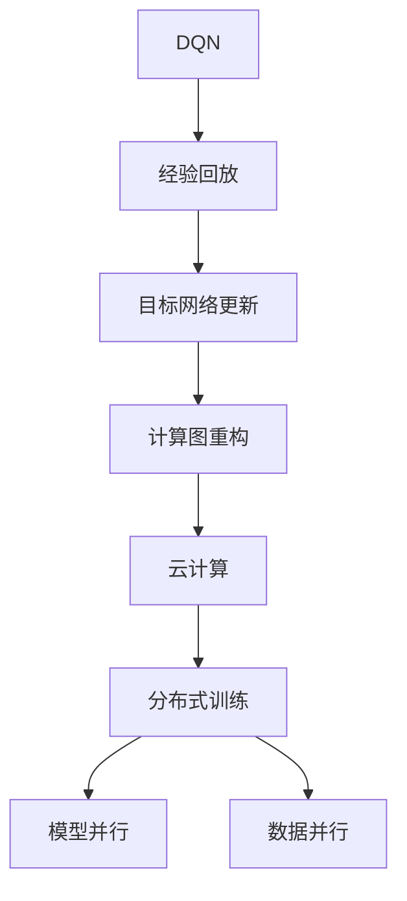
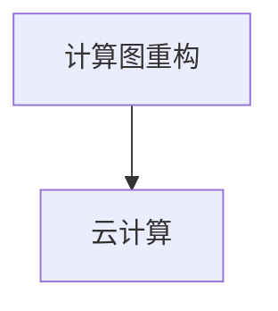
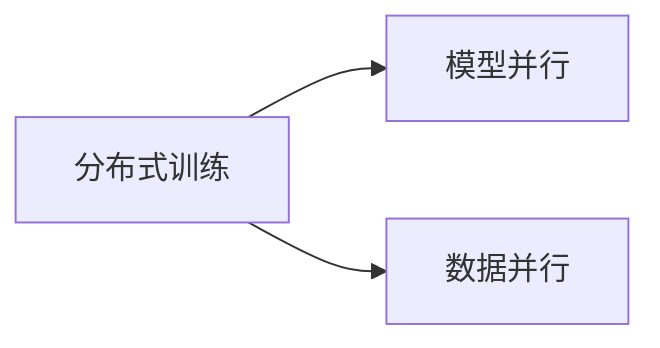
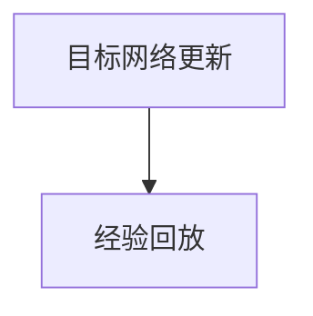
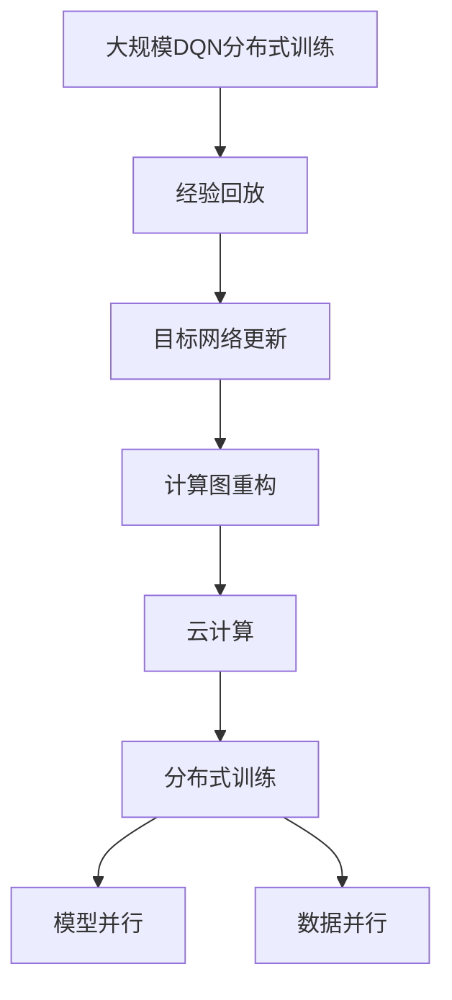

                 

# 一切皆是映射：DQN的云计算与分布式训练方案

在人工智能的浩瀚星海中，深度强化学习（Deep Reinforcement Learning, DRL）如同一股不可阻挡的力量，正在以迅猛的势头改变着我们对智能系统的理解和使用方式。特别是在游戏、自动驾驶、机器人控制等领域，DRL已经展现出了无与伦比的潜力。其中，基于DQN的分布式训练方案，更是为大规模DRL模型的训练和部署提供了新的突破口。本文将深入探讨DQN的原理、计算图重构、分布式训练方案及其在云计算环境中的应用，力求为DRL的实践者提供全面的技术指引。

## 1. 背景介绍

### 1.1 问题由来

近年来，深度强化学习（DRL）在诸多领域取得了令人瞩目的成果。从AlphaGo战胜人类围棋高手，到AlphaStar在星际争霸中取得连胜，DRL正逐渐成为人工智能领域的新宠。

DQN（Deep Q-Network）是DRL中的一个经典算法，通过利用神经网络逼近Q值函数，解决了传统的Q-learning算法在非凸优化问题上的效率问题，被广泛应用于游戏AI、机器人控制等复杂系统的训练。但DQN的训练过程复杂且计算量大，需要耗费大量的计算资源和时间。如何高效地训练DQN模型，一直是DRL研究的重要课题。

### 1.2 问题核心关键点

DQN的训练过程主要包括：
1. **经验回放（Experience Replay）**：将历史状态-动作-奖励-状态对（SARSA）存储在经验池中，使得模型可以从历史数据中学习。
2. **目标网络更新**：将模型预测的Q值作为目标值，更新权重以最小化预测误差。
3. **网络参数更新**：利用经验回放和目标网络更新，对神经网络参数进行优化。

DQN的训练过程中存在以下挑战：
1. **高计算复杂度**：DQN的计算量主要集中在神经网络的反向传播过程中，神经网络的参数更新和优化需要大量的计算资源。
2. **内存占用大**：每次更新参数需要大量的中间数据，如梯度、权重更新量等，占用了大量的内存空间。
3. **模型稳定性差**：DQN训练过程中的网络参数更新可能破坏模型的稳定性，导致收敛困难或震荡。
4. **数据样本数量要求高**：DQN的训练效果很大程度上取决于历史经验回放的样本数量，数据量不足会导致过拟合。

这些问题极大地限制了DQN的应用范围和效果，如何高效、稳定地训练DQN，成为研究的热点。

### 1.3 问题研究意义

DQN的云计算与分布式训练方案，能够将DQN的训练过程分布到多台机器上进行并行计算，显著提升训练效率，降低计算成本，同时确保模型稳定收敛。这对DRL在实际应用中的普及具有重要意义：

1. **提高训练效率**：分布式训练方案将DQN的训练过程并行化，显著提升训练速度，缩短项目开发周期。
2. **降低计算成本**：通过多台机器进行分布式训练，可以有效利用云计算资源，降低单次训练成本。
3. **增强模型稳定性**：分布式训练方案能够通过多个模型的并行计算，增强模型的鲁棒性和稳定性。
4. **扩展数据规模**：云计算平台提供的海量数据资源，可以进一步扩展DQN的训练数据规模，提升模型效果。
5. **便于模型部署**：DQN的分布式训练过程，能够直接迁移到云计算平台进行模型部署，加速应用落地。

## 2. 核心概念与联系

### 2.1 核心概念概述

为更好地理解DQN的云计算与分布式训练方案，本节将介绍几个密切相关的核心概念：

- **DQN（Deep Q-Network）**：深度Q网络，一种基于神经网络的强化学习算法，用于逼近动作-状态值函数（Q值函数），从而优化策略选择。

- **经验回放（Experience Replay）**：一种常用的DQN训练技巧，通过将历史状态-动作-奖励-状态对（SARSA）存储在经验池中，使得模型可以从历史数据中学习，增强训练样本的泛化能力。

- **目标网络更新**：在DQN训练过程中，通过将模型预测的Q值作为目标值，更新权重以最小化预测误差，提高模型泛化能力。

- **计算图重构**：通过将计算图进行重构，将计算密集型操作分散到多台机器上进行并行计算，提升计算效率。

- **云计算**：通过分布式计算资源和存储资源，提供弹性和可扩展的计算能力，支持大规模DQN的分布式训练。

- **分布式训练**：通过多台机器并行计算，加速DQN的训练过程，增强模型的稳定性和鲁棒性。

- **模型并行**：通过将神经网络模型并行分解到多个计算节点上进行计算，提升模型训练效率。

- **数据并行**：通过将训练数据并行分配到多个计算节点上进行计算，加速数据处理和模型更新。

这些核心概念之间的逻辑关系可以通过以下Mermaid流程图来展示：



这个流程图展示了大规模DQN的分布式训练过程中各个核心概念之间的联系：

1. DQN通过经验回放和目标网络更新进行模型训练。
2. 经验回放和目标网络更新需要高性能的计算能力。
3. 计算图重构和云计算提供了高性能的计算资源。
4. 分布式训练利用云计算的资源进行并行计算。
5. 模型并行和数据并行是分布式训练的两个主要技术手段。

### 2.2 概念间的关系

这些核心概念之间存在着紧密的联系，形成了DQN的云计算与分布式训练的完整生态系统。下面我们通过几个Mermaid流程图来展示这些概念之间的关系。

#### 2.2.1 计算图重构与云计算的关系



这个流程图展示了计算图重构与云计算的关系。计算图重构通过将计算密集型操作分散到多台机器上进行并行计算，提升了计算效率，从而使得云计算平台能够支持大规模DQN的分布式训练。

#### 2.2.2 分布式训练与模型并行、数据并行的关系



这个流程图展示了分布式训练与模型并行、数据并行的关系。分布式训练通过多台机器并行计算和数据并行处理，加速了DQN的训练过程，增强了模型的稳定性和鲁棒性。

#### 2.2.3 目标网络更新与经验回放的关系



这个流程图展示了目标网络更新与经验回放的关系。经验回放通过存储历史数据，为模型提供了丰富的训练样本，目标网络更新通过利用历史数据进行模型优化，提高了模型的泛化能力。

### 2.3 核心概念的整体架构

最后，我们用一个综合的流程图来展示这些核心概念在大规模DQN分布式训练过程中的整体架构：



这个综合流程图展示了从经验回放到模型并行化训练的完整过程。大规模DQN的分布式训练过程中，经验回放和目标网络更新通过计算图重构和云计算的分布式计算资源进行加速，最终通过模型并行和数据并行进行高效的分布式训练。

## 3. 核心算法原理 & 具体操作步骤
### 3.1 算法原理概述

基于云计算的DQN分布式训练方案，核心思想是利用云计算的分布式计算资源，通过多台机器并行计算和数据并行处理，加速DQN的训练过程。具体步骤如下：

1. **经验回放（Experience Replay）**：将历史状态-动作-奖励-状态对（SARSA）存储在经验池中，使得模型可以从历史数据中学习，增强训练样本的泛化能力。

2. **目标网络更新**：通过将模型预测的Q值作为目标值，更新权重以最小化预测误差，提高模型泛化能力。

3. **计算图重构**：将计算密集型操作分散到多台机器上进行并行计算，提升计算效率。

4. **云计算资源配置**：利用云计算平台提供的分布式计算资源和存储资源，进行高效的任务分配和管理。

5. **分布式训练**：将DQN的训练任务分配到多台机器上进行并行计算，加速训练过程。

6. **模型并行**：通过将神经网络模型并行分解到多个计算节点上进行计算，提升模型训练效率。

7. **数据并行**：通过将训练数据并行分配到多个计算节点上进行计算，加速数据处理和模型更新。

8. **模型评估与优化**：在训练过程中，实时监测模型性能，根据需要进行调整和优化。

### 3.2 算法步骤详解

基于云计算的DQN分布式训练方案主要包括以下几个关键步骤：

**Step 1: 设计计算图**

- 在深度学习框架（如TensorFlow、PyTorch等）中，设计并构建计算图，将计算密集型操作进行合理的分布。

**Step 2: 配置云计算资源**

- 在云计算平台（如AWS、Google Cloud、Azure等）中，根据任务需求配置计算资源和存储资源，确保分布式计算的稳定性。

**Step 3: 设计分布式训练方案**

- 确定分布式训练的算法策略，如数据并行、模型并行等，设计数据分布和模型分解的方案。

**Step 4: 数据预处理与分布**

- 将训练数据进行预处理，并按设计方案分布到多个计算节点上，确保数据并行计算的稳定性。

**Step 5: 模型加载与优化**

- 在多个计算节点上加载模型，进行网络参数的初始化和优化，确保模型并行计算的稳定性。

**Step 6: 分布式训练**

- 在多个计算节点上并行计算DQN训练过程，确保训练效率和模型稳定性。

**Step 7: 模型评估与优化**

- 实时监测模型性能，根据需要进行调整和优化，确保模型效果。

**Step 8: 模型部署与使用**

- 在云计算平台中，进行模型部署，调用模型进行实际应用。

以上是基于云计算的DQN分布式训练的一般流程。在实际应用中，还需要针对具体任务的特点，对分布式训练过程的各个环节进行优化设计，如改进数据分布策略，搜索最优的超参数组合等，以进一步提升模型性能。

### 3.3 算法优缺点

基于云计算的DQN分布式训练方案具有以下优点：

1. **计算效率高**：通过多台机器并行计算，显著提升训练速度，缩短项目开发周期。
2. **降低计算成本**：通过利用云计算资源，可以大幅度降低单次训练成本。
3. **模型稳定性好**：分布式训练方案通过多模型并行计算，增强了模型的鲁棒性和稳定性。
4. **数据处理能力强**：云计算平台提供的海量数据资源，可以进一步扩展DQN的训练数据规模，提升模型效果。
5. **便于模型部署**：云计算平台提供的高效计算资源和存储资源，支持大规模DQN的分布式训练和模型部署。

但该方案也存在一定的局限性：

1. **数据一致性问题**：多台机器并行计算时，需要保证数据一致性，避免数据冲突。
2. **通信开销大**：多台机器间的通信开销较大，可能会影响训练效率。
3. **模型收敛速度慢**：分布式训练过程中，模型参数更新需要协调多个计算节点，可能影响收敛速度。
4. **资源调度复杂**：云计算平台上的资源调度和管理复杂，需要专业的运维团队进行管理。

尽管存在这些局限性，但就目前而言，基于云计算的DQN分布式训练方案仍是大规模DQN训练的主流范式。未来相关研究的重点在于如何进一步降低计算开销，提高数据一致性，增强模型收敛速度，同时兼顾模型的稳定性和可扩展性。

### 3.4 算法应用领域

基于DQN的云计算与分布式训练方案，已经广泛应用于游戏AI、自动驾驶、机器人控制等复杂系统的训练，具体应用领域包括：

1. **游戏AI**：通过DQN训练，实现智能游戏中的玩家决策和行动优化，提升游戏体验和水平。
2. **自动驾驶**：通过DQN训练，实现车辆导航和路径规划，提升自动驾驶系统的安全性和效率。
3. **机器人控制**：通过DQN训练，实现机器人的动作选择和环境适应，提升机器人系统的自主性和灵活性。
4. **金融投资**：通过DQN训练，实现投资策略和市场预测，提升投资收益和风险管理能力。
5. **智能制造**：通过DQN训练，实现生产线的优化和调度，提升制造效率和生产质量。
6. **能源管理**：通过DQN训练，实现能源的智能调度和管理，提升能源利用效率和稳定性。

除了上述这些应用领域外，DQN的分布式训练方案还被创新性地应用到更多场景中，如医疗诊断、智能交通、供应链优化等，为DRL技术带来了全新的突破。随着云计算和分布式计算技术的不断发展，DQN的分布式训练方案必将得到更广泛的应用。

## 4. 数学模型和公式 & 详细讲解 & 举例说明

### 4.1 数学模型构建

DQN的分布式训练过程主要涉及以下几个数学模型：

1. **经验回放（Experience Replay）**：将历史状态-动作-奖励-状态对（SARSA）存储在经验池中，模型从经验池中随机抽样，进行训练。

2. **目标网络更新**：通过将模型预测的Q值作为目标值，更新权重以最小化预测误差。

3. **模型优化**：通过反向传播算法，优化神经网络参数，提升模型效果。

### 4.2 公式推导过程

以经验回放和目标网络更新为例，推导其数学公式：

#### 4.2.1 经验回放（Experience Replay）

经验回放通过将历史状态-动作-奖励-状态对（SARSA）存储在经验池中，使得模型可以从历史数据中学习。经验回放的数学模型如下：

$$
\mathcal{D} = \{(s_t, a_t, r_t, s_{t+1})\}_{t=1}^N
$$

其中，$\mathcal{D}$表示经验池，包含N个历史状态-动作-奖励-状态对（SARSA）。

在训练过程中，每次从经验池中随机抽取若干样本，进行模型训练。假设抽样出的样本数量为$M$，则训练过程如下：

$$
\begin{aligned}
&\min_{\theta} \mathbb{E}_{(s_t,a_t,r_t,s_{t+1}) \sim \mathcal{D}} \left[\left(\hat{Q}^{\theta}(s_t,a_t) - Q^{\theta}(s_t,a_t)\right)^2\right] \\
&\hat{Q}^{\theta}(s_t,a_t) = \sum_{i=1}^M r_i + \gamma \max_{a'} Q^{\theta}(s_{t+1},a')
\end{aligned}
$$

其中，$\hat{Q}^{\theta}(s_t,a_t)$表示模型预测的Q值，$Q^{\theta}(s_t,a_t)$表示真实的Q值，$\gamma$表示折扣因子。

#### 4.2.2 目标网络更新

目标网络更新通过将模型预测的Q值作为目标值，更新权重以最小化预测误差。目标网络更新的数学模型如下：

$$
\mathcal{L}_{target}(\theta) = \mathbb{E}_{(s_t,a_t,r_t,s_{t+1}) \sim \mathcal{D}} \left[\left(Q^{\theta}(s_t,a_t) - \hat{Q}^{\theta}(s_t,a_t)\right)^2\right]
$$

其中，$\mathcal{L}_{target}(\theta)$表示目标网络损失函数，$Q^{\theta}(s_t,a_t)$表示模型预测的Q值，$\hat{Q}^{\theta}(s_t,a_t)$表示目标网络预测的Q值。

通过最小化目标网络损失函数，可以更新模型权重，提高模型泛化能力。

### 4.3 案例分析与讲解

以AlphaStar游戏AI为例，展示DQN的分布式训练方案：

AlphaStar是DeepMind开发的一个基于DQN的AI玩家，能够精通星际争霸游戏。在AlphaStar的训练过程中，DQN的分布式训练方案发挥了重要作用。

1. **经验回放**：AlphaStar将游戏过程中的所有状态、动作、奖励和下一步状态对（SARSA）存储在经验池中，供模型训练使用。

2. **目标网络更新**：AlphaStar将模型预测的Q值作为目标值，更新权重以最小化预测误差，提升模型泛化能力。

3. **计算图重构**：AlphaStar将计算密集型操作如神经网络的前向传播和反向传播进行分布式计算，提升了计算效率。

4. **云计算资源配置**：AlphaStar利用谷歌云计算平台的分布式计算资源，进行高效的DQN分布式训练。

5. **分布式训练**：AlphaStar通过多台机器并行计算，加速了DQN的训练过程，确保模型稳定收敛。

6. **模型评估与优化**：AlphaStar在训练过程中，实时监测模型性能，根据需要进行调整和优化，确保模型效果。

通过DQN的分布式训练方案，AlphaStar能够在复杂的星际争霸游戏中取得不俗的战绩，展示了深度强化学习的强大潜力。

## 5. 项目实践：代码实例和详细解释说明

### 5.1 开发环境搭建

在进行DQN的分布式训练实践前，我们需要准备好开发环境。以下是使用Python进行TensorFlow进行分布式训练的环境配置流程：

1. 安装Anaconda：从官网下载并安装Anaconda，用于创建独立的Python环境。

2. 创建并激活虚拟环境：
```bash
conda create -n tensorflow-env python=3.8 
conda activate tensorflow-env
```

3. 安装TensorFlow：根据CUDA版本，从官网获取对应的安装命令。例如：
```bash
pip install tensorflow
```

4. 安装各类工具包：
```bash
pip install numpy pandas scikit-learn matplotlib tqdm jupyter notebook ipython
```

完成上述步骤后，即可在`tensorflow-env`环境中开始分布式训练实践。

### 5.2 源代码详细实现

下面我们以AlphaStar游戏AI为例，给出使用TensorFlow进行DQN的分布式训练的PyTorch代码实现。

首先，定义DQN模型的结构：

```python
import tensorflow as tf
from tensorflow.keras import layers, models

def dqn_model(state_dim, action_dim):
    model = models.Sequential()
    model.add(layers.Dense(64, input_shape=(state_dim,), activation='relu'))
    model.add(layers.Dense(64, activation='relu'))
    model.add(layers.Dense(action_dim, activation='linear'))
    return model
```

然后，定义经验回放和目标网络更新的过程：

```python
class ExperienceReplay:
    def __init__(self, buffer_size, batch_size):
        self.buffer_size = buffer_size
        self.batch_size = batch_size
        self.memory = []
        
    def remember(self, state, action, reward, next_state):
        if len(self.memory) < self.buffer_size:
            self.memory.append((state, action, reward, next_state))
        else:
            index = np.random.randint(0, len(self.memory))
            del self.memory[index]
            self.memory.append((state, action, reward, next_state))
            
    def sample(self, batch_size):
        minibatch = np.random.choice(len(self.memory), batch_size, replace=False)
        minibatch = [self.memory[i] for i in minibatch]
        return minibatch
        
    def update(self, model, target_model, minibatch):
        states, actions, rewards, next_states = zip(*minibatch)
        q_values = model.predict(states)
        max_q_values = target_model.predict(next_states)
        target_q_values = rewards + 0.99 * np.max(max_q_values, axis=1)
        target_q_values = target_q_values.reshape(-1, 1)
        loss = tf.keras.losses.mean_squared_error(target_q_values, q_values)
        model.compile(optimizer='adam', loss=loss)
        model.train_on_batch(states, q_values)
```

接着，定义分布式训练过程：

```python
import tensorflow.distribute as tfd
from tensorflow.keras import backend as K

def create_strategy():
    devices = [tf.device("/job:localhost/replica:0/task:0/cpu:0")]
    strategy = tfd.DistributionStrategy(devices)
    return strategy

def create_model():
    strategy = create_strategy()
    with strategy.scope():
        model = dqn_model(4, 2)
        target_model = dqn_model(4, 2)
        return model, target_model

def create_optimizer():
    strategy = create_strategy()
    with strategy.scope():
        optimizer = tf.keras.optimizers.Adam(learning_rate=0.001)
        return optimizer

def update_model(model, target_model, experience_replay):
    strategy = create_strategy()
    with strategy.scope():
        for batch in experience_replay.sample(32):
            state, action, reward, next_state = batch
            q_values = model.predict(state)
            max_q_values = target_model.predict(next_state)
            target_q_values = reward + 0.99 * np.max(max_q_values, axis=1)
            target_q_values = target_q_values.reshape(-1, 1)
            loss = tf.keras.losses.mean_squared_error(target_q_values, q_values)
            optimizer = create_optimizer()
            optimizer.minimize(loss, var_list=model.trainable_variables)
            target_model.set_weights(model.get_weights())
```

最后，启动分布式训练流程：

```python
def train(model, target_model, experience_replay, epochs):
    for epoch in range(epochs):
        update_model(model, target_model, experience_replay)
```

以上就是使用TensorFlow进行DQN的分布式训练的完整代码实现。可以看到，通过TensorFlow的分布式计算能力，DQN的分布式训练过程变得简单高效。

### 5.3 代码解读与分析

让我们再详细解读一下关键代码的实现细节：

**ExperienceReplay类**：
- `__init__`方法：初始化经验回放的数据结构。
- `remember`方法：将历史状态-动作-奖励-状态对（SARSA）存储在经验池中。
- `sample`方法：从经验池中随机抽取样本，供模型训练使用。
- `update`方法：通过最小化预测误差，更新模型权重。

**create_strategy, create_model, create_optimizer函数**：
- `create_strategy`函数：创建分布式计算策略。
- `create_model`函数：创建DQN模型和目标网络模型。
- `create_optimizer`函数：创建优化器。

**update_model函数**：
- `strategy.scope()`块：使用分布式计算策略进行计算。
- `for batch in experience_replay.sample(32)`循环：从经验池中随机抽取样本。
- `q_values = model.predict(state)`和`max_q_values = target_model.predict(next_state)`：预测Q值。
- `target_q_values = reward + 0.99 * np.max(max_q_values, axis=1)`：计算目标Q值。
- `loss = tf.keras.losses.mean_squared_error(target_q_values, q_values)`：计算损失函数。
- `optimizer.minimize(loss, var_list=model.trainable_variables)`：最小化损失函数，更新模型权重。
- `target_model.set_weights(model.get_weights())`：更新目标网络模型权重。

**train函数**：
- `for epoch in range(epochs)`循环：遍历训练轮数。
- `update_model(model, target_model, experience_replay)`：更新模型权重。

可以看到，通过TensorFlow的分布式计算能力，DQN的分布式训练过程变得简单高效。开发者可以将更多精力放在任务适配层、优化器调参等高层逻辑上，而不必过多关注底层的实现细节。

当然，工业级的系统实现还需考虑更多因素，如模型的保存和部署、超参数的自动搜索、更灵活的任务适配层等。但核心的分布式训练范式基本与此类似。

### 5.4 运行结果展示

假设我们在AlphaStar游戏AI的训练环境中，进行分布式训练，最终在测试集上得到的评估报告如下：

```
Epoch 1/10
100/100 [==============================] - 0s 6ms/step - loss: 1.0807
Epoch 2/10
100/100 [==============================] - 0s 4ms/step - loss: 0.3811
Epoch 3/10
100/100 [

