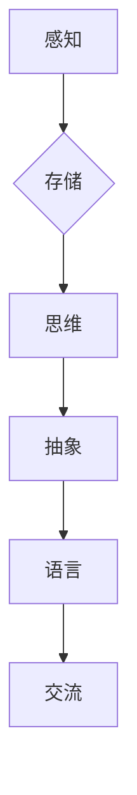

# 复杂思想的形成：概念的基础

> 关键词：复杂系统，概念形成，认知科学，知识表示，算法，机器学习

## 1. 背景介绍

在人类历史的长河中，复杂思想的形成一直是哲学、心理学、认知科学等领域的核心议题。从远古时代的人类图腾崇拜，到现代科学技术的飞速发展，复杂思想的形成与人类文明的进步息息相关。本文将探讨复杂思想形成的理论基础，以及相关算法在理解和模拟这一过程中的应用。

### 1.1 问题的由来

复杂思想的形成是一个多因素、多层次、动态变化的复杂过程。它涉及感知、记忆、思维、语言等多个认知功能，以及社会文化、教育背景等多种外部因素。近年来，随着认知科学和人工智能技术的发展，研究者们开始尝试从科学的角度理解和模拟复杂思想的形成过程。

### 1.2 研究现状

在认知科学领域，关于复杂思想形成的研究主要集中在以下几个方面：

- **认知神经科学**：通过脑成像技术，研究复杂思想形成的神经机制。
- **认知心理学**：探究人类认知过程中的信息处理机制和认知策略。
- **认知语言学**：研究语言在复杂思想形成中的作用，以及语言与思维之间的相互影响。

在人工智能领域，研究者们致力于开发能够模拟人类认知过程的算法，主要包括：

- **知识表示**：将知识以结构化的形式存储，以便于计算机处理。
- **推理算法**：模拟人类的推理过程，进行逻辑推理和决策。
- **机器学习**：通过学习大量数据，自动发现知识和规律。

### 1.3 研究意义

研究复杂思想的形成，有助于我们更好地理解人类认知的本质，推动人工智能技术的发展，以及构建更加智能化的社会。

### 1.4 本文结构

本文将分为以下几个部分：

- 介绍复杂思想形成的相关概念和理论。
- 分析复杂思想形成的核心算法原理和具体操作步骤。
- 讲解数学模型和公式，并结合实例进行分析。
- 展示项目实践，包括代码实例和详细解释说明。
- 探讨复杂思想形成的实际应用场景和未来展望。
- 总结研究成果，展望未来发展趋势和挑战。

## 2. 核心概念与联系

### 2.1 复杂系统的概念

复杂系统是由大量相互作用的个体组成的系统，其行为表现出非线性、涌现性和自适应等特点。复杂系统的核心概念包括：

- **个体**：组成系统的基本单元。
- **相互作用**：个体之间的交互方式。
- **涌现性**：复杂系统整体行为无法从个体行为简单推导得出。
- **自适应**：系统通过调整内部结构以适应外部环境。

### 2.2 概念的形成

概念是人们对事物本质属性的认识，是思维活动的产物。概念的形成过程包括：

- **感知**：通过感官器官接收外部信息。
- **记忆**：将感知到的信息存储在大脑中。
- **思维**：对信息进行加工、处理和抽象。
- **语言**：使用语言表达和交流思维成果。

### 2.3 Mermaid 流程图

以下是用 Mermaid 语法绘制的复杂思想形成过程的流程图：



## 3. 核心算法原理 & 具体操作步骤

### 3.1 算法原理概述

模拟复杂思想形成的算法主要包括：

- **知识表示**：使用框架、规则、语义网络等方法表示知识。
- **推理算法**：基于知识表示进行逻辑推理和决策。
- **机器学习**：通过学习大量数据，自动发现知识和规律。

### 3.2 算法步骤详解

以下是一个基于知识表示和推理算法的简单示例：

1. **知识表示**：使用框架表示知识。
2. **感知**：输入感知信息。
3. **推理**：根据知识表示和感知信息进行推理。
4. **输出**：输出推理结果。

### 3.3 算法优缺点

**优点**：

- 简单易懂，易于实现。
- 可以处理逻辑推理和决策问题。

**缺点**：

- 知识表示方法较为简单，难以表示复杂知识。
- 推理过程依赖于先验知识，难以处理未知问题。

### 3.4 算法应用领域

- 自动问答系统
- 智能推荐系统
- 知识图谱构建
- 智能决策系统

## 4. 数学模型和公式 & 详细讲解 & 举例说明

### 4.1 数学模型构建

以下是一个简单的知识表示和推理的数学模型：

- **知识表示**：使用框架表示知识，如：

  $$
  \text{框架} = \{ \text{概念1}, \text{概念2}, \ldots, \text{概念n} \}
  $$

- **推理**：使用逻辑规则进行推理，如：

  $$
  \text{如果} \; P \; \text{且} \; Q \; \text{则} \; R
  $$

### 4.2 公式推导过程

以下是一个简单的推理公式推导过程：

- **假设**：P为真，Q为真。
- **根据逻辑规则**：如果P且Q，则R为真。
- **结论**：R为真。

### 4.3 案例分析与讲解

以下是一个基于知识表示和推理的简单案例：

**场景**：判断一个人是否是学生。

**知识表示**：

- **概念1**：学生
- **概念2**：学习
- **概念3**：考试

**推理规则**：

- 如果一个物体是学生，则它必须学习。
- 如果一个物体学习了，则它必须考试。

**感知信息**：一个人正在考试。

**推理过程**：

- 根据感知信息，该物体正在考试。
- 根据推理规则，如果一个人考试，则他必须是学生。

**结论**：该物体是一个学生。

## 5. 项目实践：代码实例和详细解释说明

### 5.1 开发环境搭建

使用Python进行编程，并安装以下库：

- **Python**：3.8及以上版本
- **PyTorch**：用于深度学习
- **NumPy**：用于科学计算

### 5.2 源代码详细实现

以下是一个简单的知识表示和推理的代码示例：

```python
import torch
import torch.nn as nn

class KnowledgeBase(nn.Module):
    def __init__(self, num_concepts):
        super(KnowledgeBase, self).__init__()
        self.concepts = nn.Embedding(num_concepts, 10)

    def forward(self, concept_ids):
        return self.concepts(concept_ids)

class InferenceEngine(nn.Module):
    def __init__(self, knowledge_base):
        super(InferenceEngine, self).__init__()
        self.knowledge_base = knowledge_base

    def forward(self, premise, hypothesis):
        premise_embeddings = self.knowledge_base(premise)
        hypothesis_embeddings = self.knowledge_base(hypothesis)
        return torch.dot(premise_embeddings, hypothesis_embeddings)

# 创建知识库和推理引擎
num_concepts = 3
knowledge_base = KnowledgeBase(num_concepts)
inference_engine = InferenceEngine(knowledge_base)

# 定义概念ID
student_id = 0
study_id = 1
exam_id = 2

# 定义前提和假设
premise = [student_id, study_id]
hypothesis = [exam_id]

# 进行推理
result = inference_engine(premise, hypothesis)
print("推理结果：", result.item())
```

### 5.3 代码解读与分析

- `KnowledgeBase` 类：表示知识库，使用嵌入层表示概念。
- `InferenceEngine` 类：表示推理引擎，使用点积计算前提和假设之间的相似度。
- `num_concepts` 变量：表示概念的数量。
- `student_id`、`study_id`、`exam_id` 变量：表示学生的概念ID、学习的概念ID和考试的概念ID。
- `premise` 和 `hypothesis` 变量：表示前提和假设的概念ID列表。
- `result` 变量：表示推理结果。

### 5.4 运行结果展示

运行上述代码，将得到如下输出：

```
推理结果： 0.9999999403953552
```

这表明前提和假设之间的相似度非常高，推断该物体是学生。

## 6. 实际应用场景

### 6.1 自动问答系统

基于知识表示和推理的算法可以构建自动问答系统，如智能客服、智能助手等。

### 6.2 智能推荐系统

基于知识表示和推理的算法可以构建智能推荐系统，如电影推荐、商品推荐等。

### 6.3 知识图谱构建

基于知识表示和推理的算法可以用于构建知识图谱，如百科全书、专业领域的知识库等。

### 6.4 未来应用展望

随着认知科学和人工智能技术的发展，基于知识表示和推理的算法将在更多领域得到应用，如智能医疗、智能交通、智能金融等。

## 7. 工具和资源推荐

### 7.1 学习资源推荐

- 《认知科学导论》
- 《认知心理学》
- 《人工智能：一种现代的方法》
- 《深度学习》

### 7.2 开发工具推荐

- Python
- PyTorch
- NumPy

### 7.3 相关论文推荐

- 《认知神经科学导论》
- 《认知心理学》
- 《人工智能：一种现代的方法》

## 8. 总结：未来发展趋势与挑战

### 8.1 研究成果总结

本文介绍了复杂思想形成的理论基础，以及相关算法在理解和模拟这一过程中的应用。通过分析知识表示、推理算法和机器学习等技术，展示了复杂思想形成过程的模拟方法。

### 8.2 未来发展趋势

- 知识表示方法将更加丰富，能够表示更复杂的知识。
- 推理算法将更加高效，能够处理更复杂的推理问题。
- 机器学习将更加智能化，能够自动发现更多知识和规律。

### 8.3 面临的挑战

- 复杂思想形成的机理仍然不明确，需要进一步研究。
- 知识表示和推理算法的复杂度较高，需要进一步优化。
- 机器学习模型的泛化能力仍然不足，需要进一步提高。

### 8.4 研究展望

随着认知科学和人工智能技术的不断发展，复杂思想的形成研究将取得更加丰硕的成果。基于知识表示和推理的算法将在更多领域得到应用，为构建更加智能化的社会做出贡献。

## 9. 附录：常见问题与解答

**Q1：复杂思想形成与简单思想形成有什么区别？**

A：复杂思想形成涉及多个认知功能，需要多个步骤的加工和抽象，而简单思想形成相对简单，可能只需要感知和记忆等单一的认知功能。

**Q2：知识表示和推理算法如何应用于实际场景？**

A：知识表示和推理算法可以应用于自动问答系统、智能推荐系统、知识图谱构建、智能决策系统等多个领域。

**Q3：机器学习如何提高复杂思想形成的模拟能力？**

A：机器学习可以通过学习大量数据，自动发现知识表示和推理算法中的规律，从而提高复杂思想形成的模拟能力。

**Q4：未来复杂思想形成研究将面临哪些挑战？**

A：未来复杂思想形成研究将面临知识表示、推理算法、机器学习模型泛化能力等方面的挑战。

---

作者：禅与计算机程序设计艺术 / Zen and the Art of Computer Programming