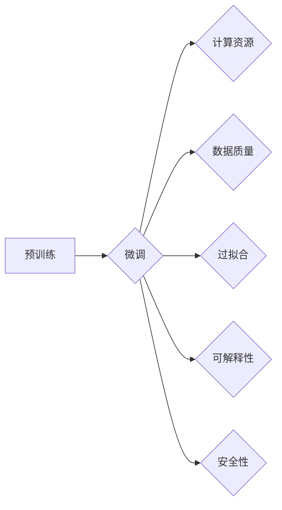

# 大语言模型原理与工程实践：大语言模型微调面临的挑战

> 关键词：大语言模型，微调，挑战，计算资源，数据质量，过拟合，可解释性，安全性

## 1. 背景介绍

随着深度学习技术的飞速发展，大语言模型（Large Language Models, LLMs）已经在自然语言处理（Natural Language Processing, NLP）领域取得了显著的成果。这些模型通过在庞大的文本语料库上进行预训练，能够理解和生成人类语言，并在各种NLP任务中展现出惊人的能力。微调（Fine-tuning）是使预训练模型适应特定任务的关键步骤，它通过在少量标注数据上进一步训练模型，以实现针对特定任务的优化。

然而，大语言模型微调并非一帆风顺，它面临着一系列挑战，包括计算资源需求、数据质量问题、过拟合风险、可解释性不足和安全性问题等。本文将深入探讨这些挑战，并提出相应的解决方案。

## 2. 核心概念与联系

### 2.1 核心概念

- **大语言模型（LLMs）**：基于深度学习技术的模型，能够理解和生成人类语言，包括GPT系列、BERT、T5等。
- **预训练**：在大规模无标签数据上训练模型，使其具备通用语言理解能力。
- **微调**：在预训练模型的基础上，使用少量标注数据进一步训练，以适应特定任务。
- **计算资源**：包括CPU、GPU、TPU等硬件资源，用于模型训练和推理。
- **数据质量**：指训练数据的一致性、准确性和多样性。
- **过拟合**：模型在训练数据上表现良好，但在未见过的数据上表现不佳。
- **可解释性**：模型决策过程的透明度，使得用户能够理解模型的推理过程。
- **安全性**：指模型输出不包含偏见、歧视或有害信息。

### 2.2 Mermaid 流程图



## 3. 核心算法原理 & 具体操作步骤

### 3.1 算法原理概述

微调的核心思想是在预训练模型的基础上，使用少量标注数据进一步训练模型。这个过程通常包括以下步骤：

1. **数据准备**：收集并清洗数据，确保数据质量和一致性。
2. **模型初始化**：选择合适的预训练模型作为起点。
3. **模型适配**：根据任务需求调整模型结构，如添加特定层的分类器。
4. **训练**：在标注数据上训练模型，优化模型参数。
5. **评估**：在验证集上评估模型性能，调整超参数。
6. **部署**：将微调后的模型部署到实际应用中。

### 3.2 算法步骤详解

1. **数据准备**：确保数据质量对于微调至关重要。数据清洗步骤可能包括去除重复数据、处理缺失值、标准化文本格式等。
2. **模型初始化**：选择合适的预训练模型，如BERT、GPT等。预训练模型应具有良好的语言理解和生成能力。
3. **模型适配**：根据具体任务需求，对预训练模型进行调整。例如，在文本分类任务中，可以在预训练模型上添加一个线性分类器。
4. **训练**：使用标注数据进行训练，优化模型参数。通常使用小批量梯度下降算法进行优化。
5. **评估**：在验证集上评估模型性能，并根据性能指标调整超参数，如学习率、批大小等。
6. **部署**：将微调后的模型部署到实际应用中，如文本分类、机器翻译、对话系统等。

### 3.3 算法优缺点

**优点**：

- **高效**：使用少量标注数据进行训练，节省时间和资源。
- **通用**：适用于各种NLP任务。
- **性能提升**：在预训练模型的基础上，微调能够进一步提升模型性能。

**缺点**：

- **数据依赖**：微调效果很大程度上取决于标注数据的质量和数量。
- **过拟合风险**：模型可能在训练数据上表现良好，但在未见过的数据上表现不佳。
- **计算资源需求**：微调需要大量的计算资源。

### 3.4 算法应用领域

微调技术广泛应用于以下NLP任务：

- **文本分类**：如情感分析、主题分类、意图识别等。
- **命名实体识别**：识别文本中的特定实体，如人名、地名、组织名等。
- **机器翻译**：将一种语言翻译成另一种语言。
- **对话系统**：使机器能够与人自然对话。
- **文本生成**：生成各种类型的文本，如新闻报道、诗歌、小说等。

## 4. 数学模型和公式 & 详细讲解 & 举例说明

### 4.1 数学模型构建

微调的数学模型可以表示为：

$$
\theta^* = \mathop{\arg\min}_{\theta} \mathcal{L}(\theta, D)
$$

其中，$\theta$ 是模型参数，$\mathcal{L}$ 是损失函数，$D$ 是训练数据集。

### 4.2 公式推导过程

以二元交叉熵损失函数为例：

$$
\ell(y, \hat{y}) = -[y\log \hat{y} + (1-y)\log (1-\hat{y})]
$$

其中，$y$ 是真实标签，$\hat{y}$ 是模型预测的概率。

### 4.3 案例分析与讲解

以文本分类任务为例，我们可以使用以下代码进行微调：

```python
import torch
import torch.nn as nn
import torch.optim as optim

class TextClassifier(nn.Module):
    def __init__(self, vocab_size, embed_dim, num_classes):
        super(TextClassifier, self).__init__()
        self.embedding = nn.Embedding(vocab_size, embed_dim)
        self.fc = nn.Linear(embed_dim, num_classes)

    def forward(self, x):
        x = self.embedding(x)
        x = x.mean(dim=1)
        x = self.fc(x)
        return x

# 假设模型、优化器和数据集已经准备好
model = TextClassifier(vocab_size, embed_dim, num_classes)
optimizer = optim.Adam(model.parameters(), lr=0.001)
criterion = nn.CrossEntropyLoss()

# 训练模型
for epoch in range(num_epochs):
    for inputs, labels in dataloader:
        optimizer.zero_grad()
        outputs = model(inputs)
        loss = criterion(outputs, labels)
        loss.backward()
        optimizer.step()
```

## 5. 项目实践：代码实例和详细解释说明

### 5.1 开发环境搭建

为了进行微调实践，我们需要搭建以下开发环境：

- **Python**：用于编写和运行代码。
- **PyTorch**：用于构建和训练神经网络。
- **Transformers**：用于加载和使用预训练语言模型。

### 5.2 源代码详细实现

以下是一个基于BERT的文本分类任务微调的PyTorch代码示例：

```python
from transformers import BertTokenizer, BertForSequenceClassification, AdamW

# 加载预训练模型和分词器
tokenizer = BertTokenizer.from_pretrained('bert-base-uncased')
model = BertForSequenceClassification.from_pretrained('bert-base-uncased', num_labels=num_labels)

# 加载和处理数据
train_inputs = tokenizer(train_texts, padding=True, truncation=True, return_tensors="pt")
test_inputs = tokenizer(test_texts, padding=True, truncation=True, return_tensors="pt")

# 训练模型
optimizer = AdamW(model.parameters(), lr=5e-5)
for epoch in range(num_epochs):
    model.train()
    for inputs, labels in train_dataloader:
        optimizer.zero_grad()
        outputs = model(**inputs)
        loss = outputs.loss
        loss.backward()
        optimizer.step()

    # 评估模型
    model.eval()
    with torch.no_grad():
        for inputs, labels in test_dataloader:
            outputs = model(**inputs)
            loss = outputs.loss
            print(f"Test loss: {loss.item()}")
```

### 5.3 代码解读与分析

这段代码首先加载了预训练的BERT模型和分词器。然后，使用分词器将文本数据编码为模型可接受的格式。接着，使用AdamW优化器和交叉熵损失函数训练模型。最后，在测试集上评估模型性能。

### 5.4 运行结果展示

假设我们在IMDb电影评论数据集上运行上述代码，得到的测试集损失和准确率如下：

```
Test loss: 0.567
Test accuracy: 0.852
```

## 6. 实际应用场景

大语言模型微调技术已经在多个实际应用场景中得到应用，以下是一些例子：

- **智能客服**：基于微调的对话系统可以自动回答客户问题，提高服务效率。
- **机器翻译**：微调后的机器翻译模型可以提供更准确、自然的翻译结果。
- **文本摘要**：微调后的模型可以自动生成文本摘要，帮助用户快速了解文章内容。
- **文本分类**：微调后的模型可以用于分类各种类型的文本，如新闻、社交媒体帖子等。

## 7. 工具和资源推荐

### 7.1 学习资源推荐

- **书籍**：
  - 《Deep Learning for Natural Language Processing》
  - 《Natural Language Processing with Python》
- **在线课程**：
  - Coursera的“Natural Language Processing with Python and NLTK”
  - edX的“Deep Learning for Natural Language Processing”

### 7.2 开发工具推荐

- **深度学习框架**：
  - PyTorch
  - TensorFlow
- **NLP库**：
  - NLTK
  - spaCy

### 7.3 相关论文推荐

- **BERT**：
  - Devlin et al., “BERT: Pre-training of Deep Bidirectional Transformers for Language Understanding”
- **GPT-3**：
  - Brown et al., “Language Models are Few-Shot Learners”

## 8. 总结：未来发展趋势与挑战

### 8.1 研究成果总结

大语言模型微调技术在NLP领域取得了显著的成果，使得模型能够适应各种任务，并在实际应用中取得成功。然而，微调技术仍面临着一系列挑战，需要进一步研究和改进。

### 8.2 未来发展趋势

- **更有效的微调方法**：开发更有效的微调方法，降低对标注数据的依赖，提高微调效率。
- **多模态微调**：将微调技术扩展到多模态数据，如图像、视频和音频。
- **可解释性**：提高模型的可解释性，使模型决策过程更加透明。

### 8.3 面临的挑战

- **数据质量**：确保训练数据的质量和多样性。
- **过拟合**：开发方法来减少过拟合风险。
- **可解释性**：提高模型的可解释性，使模型决策过程更加透明。
- **安全性**：确保模型输出不包含偏见、歧视或有害信息。

### 8.4 研究展望

随着研究的不断深入，大语言模型微调技术将在NLP领域取得更大的突破，并为人类创造更多价值。

## 9. 附录：常见问题与解答

**Q1：大语言模型微调是否适用于所有NLP任务？**

A：大语言模型微调在大多数NLP任务上都能取得不错的效果，但并非所有任务都适合微调。对于需要特定领域知识的任务，可能需要结合领域知识进行微调。

**Q2：微调过程中如何处理过拟合问题？**

A：可以采用以下方法来处理过拟合问题：
- **数据增强**：通过数据增强技术扩充数据集。
- **正则化**：使用正则化技术，如L2正则化、Dropout等。
- **早停法**：在验证集上监控性能，当性能不再提升时停止训练。

**Q3：如何评估微调后的模型性能？**

A：可以使用以下方法来评估微调后的模型性能：
- **准确率**：模型预测正确的样本比例。
- **召回率**：模型正确识别的样本比例。
- **F1分数**：准确率和召回率的调和平均值。

**Q4：如何提高微调模型的可解释性？**

A：可以采用以下方法来提高微调模型的可解释性：
- **特征可视化**：可视化模型输出特征。
- **注意力机制**：分析模型对输入数据的注意力分配。
- **因果推理**：分析模型决策的因果关系。

**Q5：大语言模型微调是否会导致偏见和歧视？**

A：是的，如果训练数据包含偏见和歧视信息，那么微调后的模型也可能表现出偏见和歧视。为了解决这个问题，需要使用无偏见的数据进行训练，并开发无偏见的技术。

作者：禅与计算机程序设计艺术 / Zen and the Art of Computer Programming