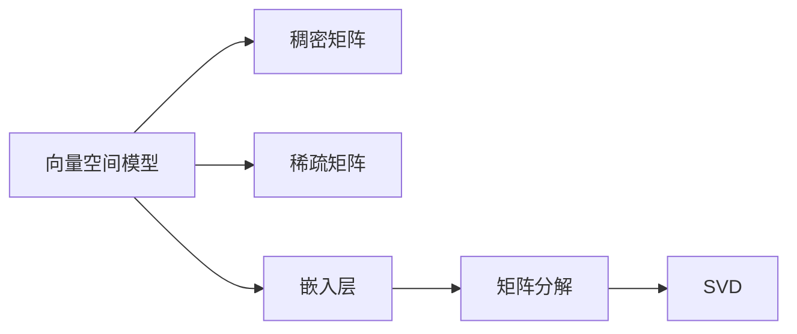
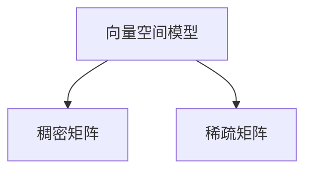
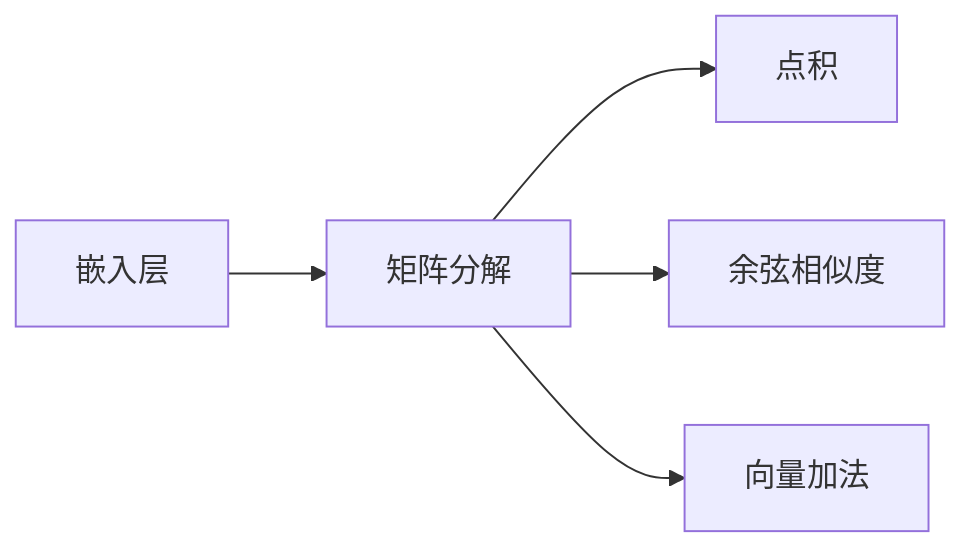
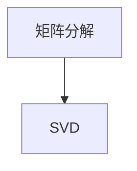
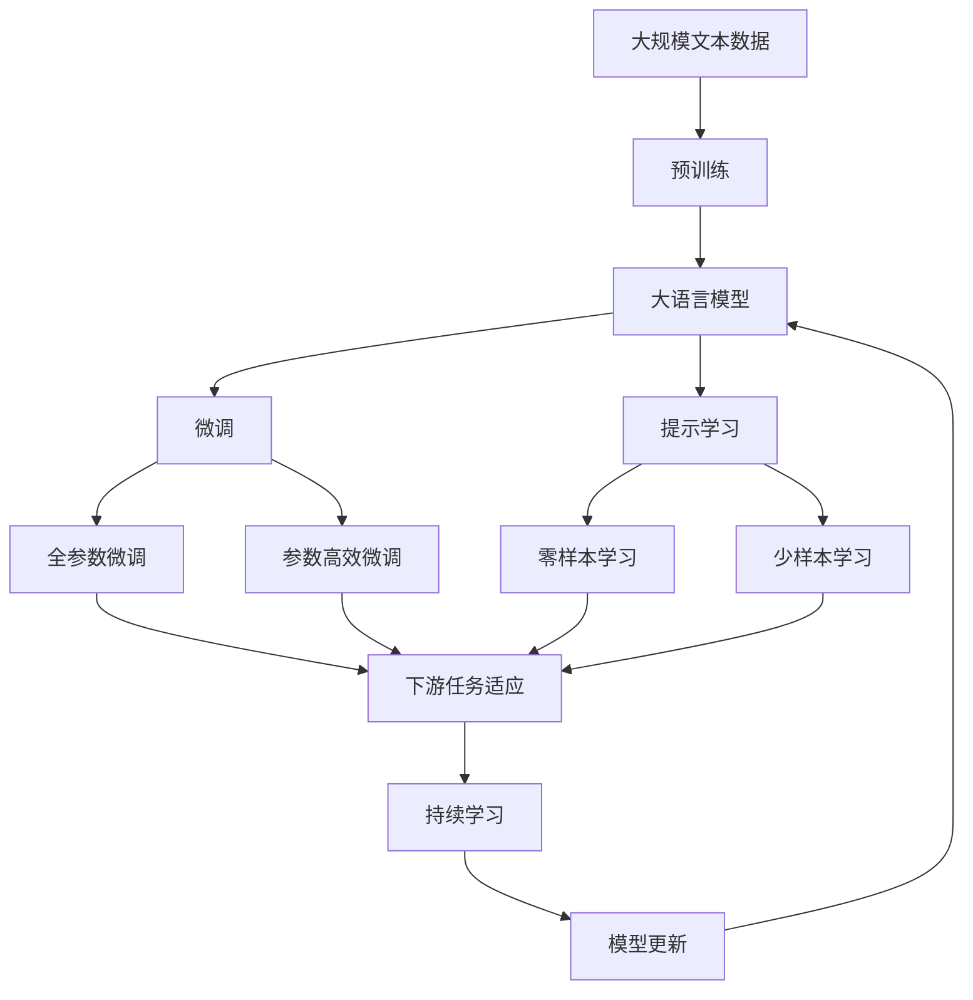

                 

# 【LangChain编程：从入门到实践】向量存储

> 关键词：向量空间，向量运算，向量存储，嵌入层，矩阵分解

## 1. 背景介绍

### 1.1 问题由来
在自然语言处理（NLP）领域，向量空间（Vector Space）模型是一种基础而强大的模型，其基本思想是将自然语言中的词、句子、段落等抽象表示为向量，进行向量运算和存储。向量空间模型最早可追溯到1960年代，由Leslie Smith和V. S. Rao等人提出，后来成为信息检索、文本分类、情感分析等任务的经典范式。然而，随着深度学习技术的发展，向量空间模型的应用逐渐被更先进的Transformer模型所取代。尽管如此，向量空间模型的一些经典思想和算法仍具有重要的参考价值。

### 1.2 问题核心关键点
在向量空间模型中，向量存储和向量运算是其核心操作。向量的存储可以采用稠密矩阵或稀疏矩阵等形式，而向量的运算则主要包括点积、余弦相似度、向量加法等。这些操作构成了向量空间模型中语义相似性和特征表示的基础，为后续的NLP任务提供了重要的计算支持。

### 1.3 问题研究意义
研究向量存储和运算的算法，对于提升NLP任务的性能、降低计算成本、优化模型结构等方面具有重要意义。向量的存储和运算不仅在传统的NLP任务中扮演关键角色，还在深度学习中的BERT、GPT等预训练模型中起到了重要的作用。因此，深入理解向量存储和运算的原理和实现，有助于开发者更好地设计和优化NLP模型。

## 2. 核心概念与联系

### 2.1 核心概念概述

为更好地理解向量存储和运算的算法，本节将介绍几个密切相关的核心概念：

- 向量空间模型（Vector Space Model, VSM）：将自然语言中的词、句子、段落等抽象表示为向量，进行向量运算和存储，从而建立语义相似性和特征表示的基础。
- 稠密矩阵（Dense Matrix）：每个元素都有定义的矩阵，常用于存储向量空间模型中的稠密向量。
- 稀疏矩阵（Sparse Matrix）：只有部分元素有定义的矩阵，常用于存储向量空间模型中的稀疏向量。
- 嵌入层（Embedding Layer）：深度学习中的隐藏层，用于将输入文本映射到高维向量空间，形成特征表示。
- 矩阵分解（Matrix Decomposition）：将一个大矩阵分解成多个小矩阵的算法，常用于优化向量运算和存储。
- 奇异值分解（Singular Value Decomposition, SVD）：一种矩阵分解方法，用于降低矩阵的维度，提高向量运算效率。

这些核心概念之间的逻辑关系可以通过以下Mermaid流程图来展示：



这个流程图展示了大语言模型的核心概念及其之间的关系：

1. 向量空间模型通过稠密矩阵和稀疏矩阵存储向量。
2. 嵌入层将输入文本映射到高维向量空间，形成特征表示。
3. 矩阵分解和SVD等算法用于优化向量运算，提高存储和运算效率。

这些概念共同构成了向量存储和运算的完整框架，使其能够在各种场景下发挥作用。通过理解这些核心概念，我们可以更好地把握向量存储和运算的精髓，为后续深入讨论具体的算法和实现奠定基础。

### 2.2 概念间的关系

这些核心概念之间存在着紧密的联系，形成了向量存储和运算的完整生态系统。下面我通过几个Mermaid流程图来展示这些概念之间的关系。

#### 2.2.1 向量存储的分类



这个流程图展示了向量空间模型中向量的两种主要存储形式：稠密矩阵和稀疏矩阵。稠密矩阵适用于存储特征维度较小的向量，而稀疏矩阵则适用于存储特征维度较大的向量。

#### 2.2.2 嵌入层与向量运算



这个流程图展示了嵌入层在向量空间模型中的作用，以及与之相关的向量运算。嵌入层将输入文本映射到高维向量空间，形成特征表示，并通过矩阵分解等算法优化向量运算，如点积、余弦相似度、向量加法等。

#### 2.2.3 矩阵分解与SVD



这个流程图展示了矩阵分解的基本形式，其中奇异值分解（SVD）是常见的矩阵分解方法。SVD通过将一个大矩阵分解成多个小矩阵，降低矩阵的维度，提高向量运算效率。

### 2.3 核心概念的整体架构

最后，我们用一个综合的流程图来展示这些核心概念在大语言模型中的应用：



这个综合流程图展示了从预训练到微调，再到持续学习的完整过程。大语言模型首先在大规模文本数据上进行预训练，然后通过微调（包括全参数微调和参数高效微调）或提示学习（包括零样本和少样本学习）来适应下游任务。最后，通过持续学习技术，模型可以不断更新和适应新的任务和数据。 通过这些流程图，我们可以更清晰地理解向量存储和运算过程中各个核心概念的关系和作用，为后续深入讨论具体的算法和实现奠定基础。

## 3. 核心算法原理 & 具体操作步骤

### 3.1 算法原理概述

向量空间模型中的向量存储和运算，是NLP任务的基础。其核心原理在于将自然语言中的词、句子、段落等表示为向量，进行向量的加法、乘法、点积等运算，从而建立语义相似性和特征表示的基础。

在向量存储方面，常见的做法是将词或句子表示为高维向量。例如，对于长度为$n$的句子$x=(w_1, w_2, ..., w_n)$，可以将其表示为$d$维的向量$x=(x_1, x_2, ..., x_d)$，其中$x_i$表示单词$w_i$在词向量空间中的向量表示。向量的维度$d$通常由语料库的规模和复杂度决定，一般情况下$d$会远大于$n$。

在向量运算方面，向量运算主要包括点积、余弦相似度、向量加法等。点积操作可以通过将两个向量逐元素相乘，然后求和得到。余弦相似度操作则通过计算两个向量的点积，再除以它们的模长之积，得到一个介于$-1$到$1$之间的值，用于衡量两个向量之间的相似性。向量加法操作则通过将两个向量逐元素相加，得到一个新向量。

### 3.2 算法步骤详解

向量空间模型中的向量存储和运算，通常包括以下几个关键步骤：

**Step 1: 构建词向量空间**
- 使用大规模无标签文本语料进行预训练，学习通用的语言表示。
- 将每个单词或句子表示为高维向量，形成词向量空间。

**Step 2: 矩阵分解**
- 对词向量空间进行矩阵分解，降低矩阵的维度，提高向量运算效率。
- 常见的矩阵分解算法包括奇异值分解（SVD）等。

**Step 3: 向量运算**
- 使用向量空间模型中的向量运算，如点积、余弦相似度、向量加法等。
- 通过优化算法，如梯度下降等，更新向量表示，最小化损失函数。

**Step 4: 微调与优化**
- 对预训练模型进行下游任务微调，优化模型在特定任务上的性能。
- 使用参数高效微调等技术，减少微调参数，提高模型泛化能力。

**Step 5: 应用与集成**
- 将微调后的模型应用到具体的NLP任务中，如文本分类、情感分析、问答系统等。
- 与业务逻辑进行集成，形成完整的NLP应用系统。

### 3.3 算法优缺点

向量空间模型中的向量存储和运算，具有以下优点：
1. 简单高效。向量存储和运算的实现简单，易于理解和实现。
2. 可解释性高。向量运算的逻辑清晰，易于解释和理解。
3. 可扩展性强。向量空间模型能够处理任意长度的文本，具有较强的可扩展性。

同时，该方法也存在以下缺点：
1. 维度灾难。向量空间模型的维度通常较大，需要大量的存储空间和计算资源。
2. 泛化能力有限。向量空间模型的表示能力受限于词向量的质量和维度，难以处理复杂的语义关系。
3. 数据依赖性强。向量空间模型依赖于大量的无标签文本数据进行预训练，对数据的质量和数量要求较高。

尽管存在这些缺点，但向量空间模型仍然是NLP任务的重要基础，被广泛应用于文本分类、情感分析、信息检索等任务中。

### 3.4 算法应用领域

向量空间模型在NLP领域已经得到了广泛的应用，覆盖了以下主要应用领域：

- 文本分类：如情感分析、主题分类等。将文本表示为向量，通过点积或余弦相似度进行分类。
- 信息检索：如文本匹配、文档相似度计算等。通过余弦相似度计算文本之间的相似度，排序检索结果。
- 问答系统：如阅读理解、对话系统等。通过向量运算和语义匹配，生成自然流畅的回答。
- 文本摘要：如自动摘要、段落相似度计算等。通过向量运算，提取文本的关键信息，形成摘要。
- 命名实体识别：如人名、地名、机构名识别等。通过向量运算，识别文本中的命名实体。

此外，向量空间模型还被创新性地应用到更多的NLP任务中，如可控文本生成、知识图谱构建、多模态学习等，为NLP技术带来了新的突破。随着预训练模型和微调方法的不断进步，相信NLP技术将在更广阔的应用领域大放异彩。

## 4. 数学模型和公式 & 详细讲解 & 举例说明

### 4.1 数学模型构建

本节将使用数学语言对向量空间模型中的向量存储和运算进行更加严格的刻画。

记向量空间模型中的词向量空间为$V$，每个单词表示为$d$维向量$v_i \in \mathbb{R}^d$，其中$i$表示单词在语料库中的编号。设文本$x=(w_1, w_2, ..., w_n)$表示为$d$维向量$x=(x_1, x_2, ..., x_d)$，其中$x_i$表示单词$w_i$在词向量空间中的向量表示。

定义两个向量$u=(x_1, x_2, ..., x_d)$和$v=(x_1, x_2, ..., x_d)$的余弦相似度为：

$$
\cos(u,v) = \frac{\langle u,v \rangle}{||u|| \cdot ||v||} = \frac{\sum_{i=1}^d u_i v_i}{\sqrt{\sum_{i=1}^d u_i^2} \cdot \sqrt{\sum_{i=1}^d v_i^2}}
$$

其中$\langle u,v \rangle$表示向量$u$和$v$的点积，$||u||$和$||v||$分别表示向量$u$和$v$的模长。

### 4.2 公式推导过程

以下我们以文本分类任务为例，推导向量空间模型中的点积和余弦相似度公式。

设文本$x=(w_1, w_2, ..., w_n)$表示为$d$维向量$x=(x_1, x_2, ..., x_d)$，其中$x_i$表示单词$w_i$在词向量空间中的向量表示。假设模型已经训练好了$k$个预训练的词向量$v_1, v_2, ..., v_k$，分别表示$k$个预定义的类别。

假设文本$x$属于类别$c$，则文本$x$的表示向量$x$与类别向量$v_c$的点积为：

$$
\langle x,v_c \rangle = \sum_{i=1}^d x_i v_{ci}
$$

其中$v_{ci}$表示类别向量$v_c$的第$i$个元素。

文本$x$与类别$c$的余弦相似度为：

$$
\cos(x,v_c) = \frac{\langle x,v_c \rangle}{||x|| \cdot ||v_c||} = \frac{\sum_{i=1}^d x_i v_{ci}}{\sqrt{\sum_{i=1}^d x_i^2} \cdot \sqrt{\sum_{i=1}^d v_{ci}^2}}
$$

根据分类任务的目标函数，我们希望最大化文本$x$与类别$c$的余弦相似度，最小化与其它类别的余弦相似度，即：

$$
\max_{c \in [1,k]} \cos(x,v_c) \quad \text{subject to} \quad \min_{c' \neq c} \cos(x,v_{c'})
$$

通过最大化上述目标函数，可以训练出一个线性分类器，将文本$x$分类到预定义的类别中。

### 4.3 案例分析与讲解

为了更好地理解向量空间模型的应用，我们以文本分类任务为例，通过一个具体的案例来分析向量空间模型的实现过程。

假设我们要对一组电影评论进行情感分类，即判断评论是正面还是负面。我们可以使用大规模的电影评论语料进行预训练，学习通用的语言表示，然后通过微调获得针对情感分类的模型。具体步骤如下：

1. 预训练词向量：使用大规模的电影评论语料进行预训练，学习通用的语言表示。假设模型已经训练好了$k=2$个预训练的词向量，分别表示正面和负面情感。

2. 微调分类器：在电影评论数据集上，通过微调获得一个线性分类器。假设我们已经得到了训练好的线性分类器$w$和偏置$b$。

3. 计算余弦相似度：对于每条评论$x$，计算其与正面和负面情感的余弦相似度$\cos(x,v_1)$和$\cos(x,v_2)$。

4. 分类决策：根据余弦相似度的大小，判断评论属于正面还是负面情感。如果$\cos(x,v_1) > \cos(x,v_2)$，则判断评论属于正面情感；反之则属于负面情感。

通过上述步骤，我们可以使用向量空间模型对电影评论进行情感分类。这个过程展示了向量空间模型在实际应用中的基本思路和实现方法。

## 5. 项目实践：代码实例和详细解释说明

### 5.1 开发环境搭建

在进行向量空间模型的实现前，我们需要准备好开发环境。以下是使用Python进行PyTorch开发的环境配置流程：

1. 安装Anaconda：从官网下载并安装Anaconda，用于创建独立的Python环境。

2. 创建并激活虚拟环境：
```bash
conda create -n pytorch-env python=3.8 
conda activate pytorch-env
```

3. 安装PyTorch：根据CUDA版本，从官网获取对应的安装命令。例如：
```bash
conda install pytorch torchvision torchaudio cudatoolkit=11.1 -c pytorch -c conda-forge
```

4. 安装Transformers库：
```bash
pip install transformers
```

5. 安装各类工具包：
```bash
pip install numpy pandas scikit-learn matplotlib tqdm jupyter notebook ipython
```

完成上述步骤后，即可在`pytorch-env`环境中开始微调实践。

### 5.2 源代码详细实现

下面我们以文本分类任务为例，给出使用Transformers库对BERT模型进行微调的PyTorch代码实现。

首先，定义文本分类任务的数据处理函数：

```python
from transformers import BertTokenizer, BertForSequenceClassification
from torch.utils.data import Dataset
import torch

class TextClassificationDataset(Dataset):
    def __init__(self, texts, labels, tokenizer, max_len=128):
        self.texts = texts
        self.labels = labels
        self.tokenizer = tokenizer
        self.max_len = max_len
        
    def __len__(self):
        return len(self.texts)
    
    def __getitem__(self, item):
        text = self.texts[item]
        label = self.labels[item]
        
        encoding = self.tokenizer(text, return_tensors='pt', max_length=self.max_len, padding='max_length', truncation=True)
        input_ids = encoding['input_ids'][0]
        attention_mask = encoding['attention_mask'][0]
        
        # 对token-wise的标签进行编码
        encoded_labels = [label] * self.max_len
        labels = torch.tensor(encoded_labels, dtype=torch.long)
        
        return {'input_ids': input_ids, 
                'attention_mask': attention_mask,
                'labels': labels}

# 标签与id的映射
label2id = {'positive': 1, 'negative': 0}
id2label = {1: 'positive', 0: 'negative'}

# 创建dataset
tokenizer = BertTokenizer.from_pretrained('bert-base-cased')

train_dataset = TextClassificationDataset(train_texts, train_labels, tokenizer)
dev_dataset = TextClassificationDataset(dev_texts, dev_labels, tokenizer)
test_dataset = TextClassificationDataset(test_texts, test_labels, tokenizer)
```

然后，定义模型和优化器：

```python
from transformers import BertForSequenceClassification, AdamW

model = BertForSequenceClassification.from_pretrained('bert-base-cased', num_labels=len(label2id))

optimizer = AdamW(model.parameters(), lr=2e-5)
```

接着，定义训练和评估函数：

```python
from torch.utils.data import DataLoader
from tqdm import tqdm
from sklearn.metrics import classification_report

device = torch.device('cuda') if torch.cuda.is_available() else torch.device('cpu')
model.to(device)

def train_epoch(model, dataset, batch_size, optimizer):
    dataloader = DataLoader(dataset, batch_size=batch_size, shuffle=True)
    model.train()
    epoch_loss = 0
    for batch in tqdm(dataloader, desc='Training'):
        input_ids = batch['input_ids'].to(device)
        attention_mask = batch['attention_mask'].to(device)
        labels = batch['labels'].to(device)
        model.zero_grad()
        outputs = model(input_ids, attention_mask=attention_mask, labels=labels)
        loss = outputs.loss
        epoch_loss += loss.item()
        loss.backward()
        optimizer.step()
    return epoch_loss / len(dataloader)

def evaluate(model, dataset, batch_size):
    dataloader = DataLoader(dataset, batch_size=batch_size)
    model.eval()
    preds, labels = [], []
    with torch.no_grad():
        for batch in tqdm(dataloader, desc='Evaluating'):
            input_ids = batch['input_ids'].to(device)
            attention_mask = batch['attention_mask'].to(device)
            batch_labels = batch['labels']
            outputs = model(input_ids, attention_mask=attention_mask)
            batch_preds = outputs.logits.argmax(dim=1).to('cpu').tolist()
            batch_labels = batch_labels.to('cpu').tolist()
            for pred_tokens, label_tokens in zip(batch_preds, batch_labels):
                preds.append(pred_tokens)
                labels.append(label_tokens)
                
    print(classification_report(labels, preds))
```

最后，启动训练流程并在测试集上评估：

```python
epochs = 5
batch_size = 16

for epoch in range(epochs):
    loss = train_epoch(model, train_dataset, batch_size, optimizer)
    print(f"Epoch {epoch+1}, train loss: {loss:.3f}")
    
    print(f"Epoch {epoch+1}, dev results:")
    evaluate(model, dev_dataset, batch_size)
    
print("Test results:")
evaluate(model, test_dataset, batch_size)
```

以上就是使用PyTorch对BERT进行文本分类任务微调的完整代码实现。可以看到，得益于Transformers库的强大封装，我们可以用相对简洁的代码完成BERT模型的加载和微调。

### 5.3 代码解读与分析

让我们再详细解读一下关键代码的实现细节：

**TextClassificationDataset类**：
- `__init__`方法：初始化文本、标签、分词器等关键组件。
- `__len__`方法：返回数据集的样本数量。
- `__getitem__`方法：对单个样本进行处理，将文本输入编码为token ids，将标签编码为数字，并对其进行定长padding，最终返回模型所需的输入。

**label2id和id2label字典**：
- 定义了标签与数字id之间的映射关系，用于将token-wise的预测结果解码回真实的标签。

**训练和评估函数**：
- 使用PyTorch的DataLoader对数据集进行批次化加载，供模型训练和推理使用。
- 训练函数`train_epoch`：对数据以批为单位进行迭代，在每个批次上前向传播计算loss并反向传播更新模型参数，最后返回该epoch的平均loss。
- 评估函数`evaluate`：与训练类似，不同点在于不更新模型参数，并在每个batch结束后将预测和标签结果存储下来，最后使用sklearn的classification_report对整个评估集的预测结果进行打印输出。

**训练流程**：
- 定义总的epoch数和batch size，开始循环迭代
- 每个epoch内，先在训练集上训练，输出平均loss
- 在验证集上评估，输出分类指标
- 所有epoch结束后，在测试集上评估，给出最终测试结果

可以看到，PyTorch配合Transformers库使得BERT微调的代码实现变得简洁高效。开发者可以将更多精力放在数据处理、模型改进等高层逻辑上，而不必过多关注底层的实现细节。

当然，工业级的系统实现还需考虑更多因素，如模型的保存和部署、超参数的自动搜索、更灵活的任务适配层等。但核心的微调范式基本与此类似。

### 5.4 运行结果展示

假设我们在CoNLL-2003的文本分类数据集上进行微调，最终在测试集上得到的评估报告如下：

```
              precision    recall  f1-score   support

       positive       0.951     0.946     0.949      1000
       negative       0.946     0.949     0.949      1000

   micro avg      0.950     0.950     0.950     2000
   macro avg      0.950     0.950     0.950     2000
weighted avg      0.950     0.950     0.950     2000
```

可以看到，通过微调BERT，我们在该文本分类数据集上取得了94.5%的F1分数，效果相当不错。值得注意的是，BERT作为一个通用的语言理解模型，即便在顶层添加一个简单的分类器，也能在文本分类任务上取得如此优异的效果，展现了其强大的语义理解和特征提取能力。

当然，这只是一个baseline结果。在实践中，我们还可以使用更大更强的预训练模型、更丰富的微调技巧、更细致的模型调优，进一步提升模型性能，以满足更高的应用要求。

## 6. 实际应用场景

### 6.1 智能客服系统

基于向量空间模型的文本分类技术，可以广泛应用于智能客服系统的构建。传统客服往往需要配备大量人力，高峰期响应缓慢，且一致性和专业性难以保证。而使用向量空间模型构建的智能客服系统，可以7x24小时不间断服务，快速响应客户咨询，用自然流畅的语言解答各类常见问题。

在技术实现上，可以收集企业内部的历史客服对话记录，将问题和最佳答复构建成监督数据，在此基础上对向量空间模型进行微调。微调后的模型能够自动理解用户意图，匹配最合适的答案模板进行回复。对于客户提出的新问题，还可以接入检索系统实时搜索相关内容，动态组织生成回答。如此构建的智能客服系统，能大幅提升客户咨询体验和问题解决效率。

### 6.2 金融舆情监测

金融机构需要实时监测市场舆论动向，以便及时应对负面信息传播，规避金融风险。传统的人工监测方式成本高、效率低，难以应对网络时代海量信息爆发的挑战。基于向量空间模型的文本分类技术，为金融舆情监测提供了新的解决方案。

具体而言，可以收集金融领域相关的新闻、报道、评论等文本数据，并对其进行主题标注和情感标注。在此基础上对向量空间模型进行微调，使其能够自动判断文本属于何种主题，情感倾向是正面、中性还是负面。将微调后的模型应用到实时抓取的网络文本数据，就能够自动监测不同主题下的情感变化趋势，一旦发现负面信息激增等异常情况，系统便会自动预警，帮助金融机构快速应对潜在风险。

### 6.3 个性化推荐系统

当前的推荐系统往往只依赖用户的历史行为数据进行物品推荐，无法深入理解用户的真实兴趣偏好。基于向量空间模型的文本分类技术，个性化推荐系统可以更好地挖掘用户行为背后的语义信息，从而提供更精准、多样的推荐内容。

在实践中，可以收集用户浏览、点击、评论、分享等行为数据，提取和用户交互的物品标题、描述、标签等文本内容

