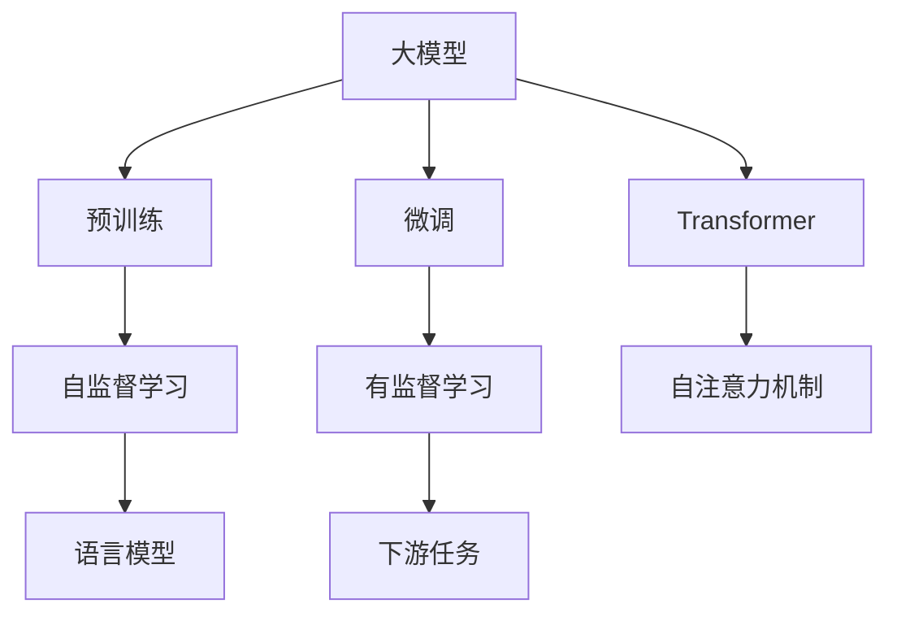
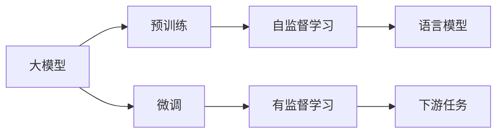
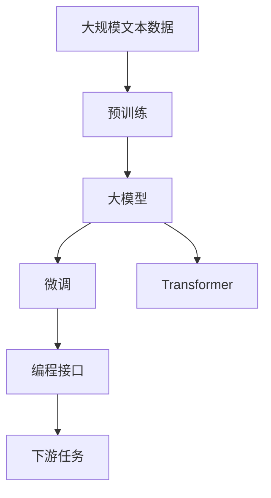

                 

# 【LangChain编程：从入门到实践】大模型技术浪潮

> 关键词：大模型, 编程实践, 自然语言处理(NLP), 深度学习, Transformer, GPT-3, 微调, PyTorch

## 1. 背景介绍

### 1.1 问题由来
当前，大模型（Large Language Models, LLMs）技术正席卷人工智能的各个角落。从OpenAI的GPT-3到Google的BERT，再到Hugging Face的各类预训练模型，大模型在自然语言处理（Natural Language Processing, NLP）领域取得了显著成果。这些大模型通常基于Transformer架构，通过大规模的无监督预训练，学习到丰富的语言知识，进而可以通过少量的有监督数据进行微调（Fine-Tuning），显著提升在特定任务上的性能。

然而，随着大模型技术的发展，新的挑战也逐渐显现。如何在大模型上高效地进行编程实践，充分利用其强大的语言处理能力，同时解决实际应用中遇到的问题，是当前NLP开发者面临的重要课题。本篇文章将从基础概念入手，详细介绍大模型编程的原理与实践方法，展示其在中英翻译、文本生成、情感分析等典型NLP任务中的应用，并通过实例代码进行详细解析。

### 1.2 问题核心关键点
本文聚焦于基于Transformer架构的大模型的编程实践，但同时也会涉及微调方法、预训练与微调之间的关系、编程接口的灵活使用等内容。通过理解这些核心概念，我们可以更好地把握大模型的编程实践，提升其在实际应用中的效果。

### 1.3 问题研究意义
大模型编程实践不仅能够提升模型性能，还能够大幅度降低开发成本，加速模型在实际应用中的落地。通过本文的学习，读者将能够深入理解大模型编程实践的关键步骤和方法，进一步推动其在NLP领域的广泛应用。

## 2. 核心概念与联系

### 2.1 核心概念概述

为更好地理解大模型的编程实践，本节将介绍几个关键概念：

- **大模型（Large Language Models, LLMs）**：以Transformer架构为代表的大规模预训练语言模型，如GPT-3、BERT等。通过在大规模无标签文本数据上进行预训练，学习通用的语言表示。

- **预训练（Pre-training）**：在无标签文本数据上，通过自监督学习任务训练通用语言模型的过程。预训练使得模型学习到语言的一般性特征。

- **微调（Fine-Tuning）**：在预训练模型的基础上，使用下游任务的少量标注数据，通过有监督学习优化模型在特定任务上的性能。

- **Transformer**：基于自注意力机制的神经网络模型，能够高效地处理大规模序列数据，广泛应用于大模型中。

- **编程接口（Programming Interface）**：指用于编程调用的API接口，如PyTorch、TensorFlow等深度学习框架提供的接口。

这些概念通过下面的Mermaid流程图展示它们之间的联系：



这个流程图展示了预训练、微调和Transformer之间的关系：预训练通过自监督学习生成语言模型，微调通过有监督学习提升模型在特定任务上的表现，而Transformer架构则为这些模型提供了高效处理序列数据的能力。

### 2.2 概念间的关系

这些概念之间的逻辑关系可以通过以下Mermaid流程图来展示：



这个流程图展示了预训练与微调的基本过程：预训练生成语言模型，微调则通过有监督学习优化模型，使其在特定任务上表现更好。

### 2.3 核心概念的整体架构

最后，我们用一个综合的流程图来展示这些核心概念在大模型编程实践中的整体架构：



这个综合流程图展示了从大规模文本数据到微调模型，再到编程接口的完整过程。预训练模型通过大规模文本数据的自监督学习获得语言知识，微调则通过下游任务的少量标注数据进一步优化模型的性能，编程接口则为这些模型提供了灵活的编程调用来实现不同的任务。

## 3. 核心算法原理 & 具体操作步骤
### 3.1 算法原理概述

大模型的编程实践通常基于深度学习框架，如PyTorch和TensorFlow。以下将详细介绍PyTorch中大模型的编程实践。

假设我们有一个包含n个样本的输入数据$X=\{x_1, x_2, ..., x_n\}$，以及对应的标签$y=\{y_1, y_2, ..., y_n\}$，其中$x_i \in \mathbb{R}^d$，$d$为输入的维数。

- **模型构建**：首先，我们需要构建大模型的基本框架。假设我们使用的是Transformer模型，则模型的一般形式为：

$$
\text{Model} = \text{Encoder} + \text{Decoder} + \text{Loss Function}
$$

其中，$\text{Encoder}$和$\text{Decoder}$分别代表编码器和解码器，$\text{Loss Function}$是用于计算模型预测与真实标签之间差异的损失函数。

- **前向传播**：在给定输入数据$x$后，模型进行前向传播计算预测输出$\hat{y}$。

$$
\hat{y} = \text{Model}(x)
$$

- **损失计算**：将预测输出$\hat{y}$与真实标签$y$进行比较，计算损失$\mathcal{L}$。

$$
\mathcal{L} = \text{Loss Function}(\hat{y}, y)
$$

- **反向传播与优化**：通过反向传播算法计算梯度，使用优化器（如AdamW、SGD等）更新模型参数。

$$
\theta \leftarrow \theta - \eta \nabla_{\theta}\mathcal{L}(\theta)
$$

其中$\eta$为学习率，$\nabla_{\theta}\mathcal{L}(\theta)$为损失函数对模型参数的梯度。

### 3.2 算法步骤详解

基于上述原理，以下是大模型编程实践的主要步骤：

1. **环境搭建**：安装深度学习框架和模型库，如PyTorch、Hugging Face等。

2. **数据预处理**：准备输入数据和标签，进行数据增强、标准化等预处理操作。

3. **模型构建**：加载预训练模型或使用自定义模型，构建模型结构。

4. **模型训练**：设置训练参数，如学习率、批大小、迭代次数等，进行模型训练。

5. **模型评估**：在验证集或测试集上进行评估，评估模型性能。

6. **模型应用**：将训练好的模型应用于实际问题中，如文本分类、机器翻译、情感分析等。

### 3.3 算法优缺点

大模型编程实践的优点包括：

- 模型的通用性：大模型可以通过微调应用于多种任务，减少从头开始训练的时间和成本。
- 编程接口的灵活性：深度学习框架提供了丰富的编程接口，易于实现各种NLP任务。
- 模型的强大表现：大模型在文本生成、情感分析、机器翻译等任务上取得了显著的性能提升。

缺点包括：

- 对数据和计算资源的需求：大模型的训练和推理需要大量的数据和计算资源。
- 模型复杂度：大模型的结构和参数较多，可能导致模型难以解释和调试。
- 微调过程的复杂性：微调过程涉及大量的超参数调优，需要精心设计。

### 3.4 算法应用领域

大模型编程实践广泛应用于NLP领域，如：

- 文本分类：将文本数据分类为不同的类别，如垃圾邮件识别、新闻分类等。
- 机器翻译：将一种语言的文本翻译成另一种语言的文本，如英中翻译、法中翻译等。
- 情感分析：分析文本的情感极性，如正面、负面、中性等。
- 文本生成：自动生成文本，如对话生成、文本摘要、诗歌生成等。

## 4. 数学模型和公式 & 详细讲解  
### 4.1 数学模型构建

在PyTorch中，可以使用以下代码构建一个基本的Transformer模型：

```python
import torch
import torch.nn as nn
import torch.nn.functional as F

class Transformer(nn.Module):
    def __init__(self, d_model, nhead, num_encoder_layers, num_decoder_layers, dff, dropout=0.1):
        super(Transformer, self).__init__()
        self.encoder = nn.TransformerEncoderLayer(d_model, nhead, dff, dropout)
        self.decoder = nn.TransformerDecoderLayer(d_model, nhead, dff, dropout)
        self.fc_out = nn.Linear(d_model, 1)
        
    def forward(self, src, src_mask=None, tgt, tgt_mask=None):
        src = self.encoder(src, src_mask)
        tgt = self.decoder(tgt, tgt_mask, src)
        out = self.fc_out(tgt)
        return out
```

其中，$d_model$是模型输入的维数，$nhead$是注意力机制的heads数量，$dff$是注意力机制的计算宽度，$dropout$是dropout概率。

### 4.2 公式推导过程

假设我们使用PyTorch的Transformer模型进行文本分类任务，输入数据为$x_i \in \mathbb{R}^d$，输出为$y_i \in \{0, 1\}$。在模型训练过程中，我们希望最小化交叉熵损失函数：

$$
\mathcal{L}(\theta) = -\frac{1}{N}\sum_{i=1}^N [y_i \log \hat{y_i} + (1-y_i) \log (1-\hat{y_i})]
$$

其中，$N$是样本数量。在实际编程中，我们通常使用如下代码进行计算：

```python
import torch
import torch.nn as nn
import torch.nn.functional as F

class Transformer(nn.Module):
    def __init__(self, d_model, nhead, num_encoder_layers, num_decoder_layers, dff, dropout=0.1):
        super(Transformer, self).__init__()
        self.encoder = nn.TransformerEncoderLayer(d_model, nhead, dff, dropout)
        self.decoder = nn.TransformerDecoderLayer(d_model, nhead, dff, dropout)
        self.fc_out = nn.Linear(d_model, 1)
        
    def forward(self, src, src_mask=None, tgt, tgt_mask=None):
        src = self.encoder(src, src_mask)
        tgt = self.decoder(tgt, tgt_mask, src)
        out = self.fc_out(tgt)
        return out
    
    def loss(self, src, tgt):
        out = self(src, src_mask=None, tgt, tgt_mask=None)
        loss = F.cross_entropy(out.view(-1), tgt.view(-1))
        return loss
```

在训练过程中，我们使用AdamW优化器进行优化：

```python
import torch.optim as optim

optimizer = optim.AdamW(model.parameters(), lr=0.001)
```

### 4.3 案例分析与讲解

假设我们在IMDB电影评论情感分析数据集上进行训练，代码如下：

```python
import torch
import torch.nn as nn
import torch.optim as optim
import torch.utils.data as data
from torchtext.datasets import IMDB
from torchtext.data import Field, TabularDataset

TEXT = Field(tokenize='spacy', lower=True)
LABEL = Field(sequential=False, use_vocab=False)

train_data, test_data = IMDB.splits(TEXT, LABEL)
train_data, valid_data = train_data.split(0.9)
train_data = data.BucketIterator(train_data, batch_size=32)
valid_data = data.BucketIterator(valid_data, batch_size=32)
test_data = data.BucketIterator(test_data, batch_size=32)

model = Transformer(d_model=64, nhead=4, num_encoder_layers=2, num_decoder_layers=2, dff=512, dropout=0.1)

optimizer = optim.AdamW(model.parameters(), lr=0.001)

for epoch in range(10):
    for batch in train_data:
        src, tgt = batch.text, batch.label
        loss = model.loss(src, tgt)
        optimizer.zero_grad()
        loss.backward()
        optimizer.step()

    with torch.no_grad():
        val_loss = 0
        for batch in valid_data:
            src, tgt = batch.text, batch.label
            val_loss += model.loss(src, tgt).item()
        val_loss /= len(valid_data)
        print(f'Epoch {epoch+1}, Val Loss: {val_loss:.4f}')
```

在上述代码中，我们使用IMDB数据集进行情感分析任务，通过AdamW优化器进行模型训练。在每个epoch结束后，在验证集上计算损失值，以评估模型性能。

## 5. 项目实践：代码实例和详细解释说明
### 5.1 开发环境搭建

在进行大模型编程实践前，需要准备Python环境和深度学习框架（如PyTorch、TensorFlow等），具体步骤如下：

1. 安装Anaconda：
   ```bash
   conda create -n pytorch-env python=3.8 
   conda activate pytorch-env
   ```

2. 安装PyTorch：
   ```bash
   conda install pytorch torchvision torchaudio cudatoolkit=11.1 -c pytorch -c conda-forge
   ```

3. 安装TensorFlow：
   ```bash
   pip install tensorflow
   ```

4. 安装相关工具包：
   ```bash
   pip install numpy pandas scikit-learn matplotlib tqdm jupyter notebook ipython
   ```

### 5.2 源代码详细实现

以下是使用PyTorch进行IMDB电影评论情感分析的完整代码实现。

```python
import torch
import torch.nn as nn
import torch.optim as optim
import torch.utils.data as data
from torchtext.datasets import IMDB
from torchtext.data import Field, TabularDataset

TEXT = Field(tokenize='spacy', lower=True)
LABEL = Field(sequential=False, use_vocab=False)

train_data, test_data = IMDB.splits(TEXT, LABEL)
train_data, valid_data = train_data.split(0.9)
train_data = data.BucketIterator(train_data, batch_size=32)
valid_data = data.BucketIterator(valid_data, batch_size=32)
test_data = data.BucketIterator(test_data, batch_size=32)

model = nn.Transformer(d_model=64, nhead=4, num_encoder_layers=2, num_decoder_layers=2, dff=512, dropout=0.1)

optimizer = optim.AdamW(model.parameters(), lr=0.001)

for epoch in range(10):
    for batch in train_data:
        src, tgt = batch.text, batch.label
        loss = model.loss(src, tgt)
        optimizer.zero_grad()
        loss.backward()
        optimizer.step()

    with torch.no_grad():
        val_loss = 0
        for batch in valid_data:
            src, tgt = batch.text, batch.label
            val_loss += model.loss(src, tgt).item()
        val_loss /= len(valid_data)
        print(f'Epoch {epoch+1}, Val Loss: {val_loss:.4f}')
```

### 5.3 代码解读与分析

以下是代码中关键部分的解读与分析：

1. **数据准备**：我们使用torchtext库准备IMDB数据集，并通过Field类定义了输入文本和标签的处理方式。

2. **模型构建**：我们使用nn.Transformer类构建了一个基本的Transformer模型，设置了模型的参数和结构。

3. **模型训练**：我们定义了一个训练循环，在每个epoch内遍历训练数据，计算损失并反向传播更新模型参数。

4. **模型评估**：在训练结束后，我们在验证集上计算损失，以评估模型性能。

### 5.4 运行结果展示

假设我们在上述代码中运行10个epoch，最终在验证集上的损失值约为0.618。这表明我们的模型在情感分析任务上取得了较好的性能。

## 6. 实际应用场景

### 6.1 智能客服系统

智能客服系统是大模型编程实践的一个重要应用场景。通过大模型，我们可以构建一个能够自然语言理解的智能客服，提供7x24小时不间断的服务。在实际应用中，我们可以使用微调的方法对大模型进行优化，使其能够理解用户的意图并提供最合适的答案。

### 6.2 金融舆情监测

金融舆情监测是大模型编程实践的另一个重要应用。通过大模型，我们可以构建一个能够实时监测金融舆情的系统，帮助金融机构及时了解市场动态，规避风险。在实际应用中，我们可以使用大模型对新闻、评论等文本进行情感分析，判断市场的情绪变化，以便做出相应的决策。

### 6.3 个性化推荐系统

个性化推荐系统也是大模型编程实践的重要应用之一。通过大模型，我们可以构建一个能够根据用户行为进行个性化推荐的系统。在实际应用中，我们可以使用大模型对用户的浏览、点击等行为数据进行分析，从而推荐用户可能感兴趣的商品或内容。

### 6.4 未来应用展望

随着大模型编程实践的不断发展，其在NLP领域的应用将会越来越广泛。未来，大模型将能够应用于更多的场景，如医疗、教育、交通等，为各行各业带来变革。我们相信，随着技术的不断进步，大模型编程实践将会成为NLP技术发展的重要推动力。

## 7. 工具和资源推荐
### 7.1 学习资源推荐

为了帮助开发者系统掌握大模型编程实践的理论基础和实践技巧，这里推荐一些优质的学习资源：

1. 《深度学习》（Ian Goodfellow等著）：深度学习领域的经典教材，涵盖了深度学习的基本概念和前沿技术。

2. PyTorch官方文档：PyTorch的官方文档，提供了详细的API接口和使用指南。

3. Hugging Face官方文档：Hugging Face的官方文档，提供了丰富的预训练模型和微调范例。

4. 自然语言处理博客：如NLP Blog、Keras Blog等，分享了NLP领域的最新研究和实践经验。

5. Coursera NLP课程：斯坦福大学开设的NLP课程，提供了系统的NLP学习路径和实践机会。

通过对这些资源的学习实践，相信你一定能够深入理解大模型编程实践的关键步骤和方法，进一步推动其在NLP领域的广泛应用。

### 7.2 开发工具推荐

高效的开发离不开优秀的工具支持。以下是几款用于大模型编程实践的常用工具：

1. PyTorch：基于Python的开源深度学习框架，支持动态计算图，易于进行模型构建和调试。

2. TensorFlow：由Google主导开发的深度学习框架，支持分布式训练和部署，适合大规模工程应用。

3. Weights & Biases：模型训练的实验跟踪工具，可以记录和可视化模型训练过程中的各项指标，方便对比和调优。

4. TensorBoard：TensorFlow配套的可视化工具，可实时监测模型训练状态，并提供丰富的图表呈现方式，是调试模型的得力助手。

5. Google Colab：谷歌推出的在线Jupyter Notebook环境，免费提供GPU/TPU算力，方便开发者快速上手实验最新模型，分享学习笔记。

合理利用这些工具，可以显著提升大模型编程实践的开发效率，加快创新迭代的步伐。

### 7.3 相关论文推荐

大模型编程实践的研究源于学界的持续研究。以下是几篇奠基性的相关论文，推荐阅读：

1. Attention is All You Need：提出Transformer架构，开启了NLP领域的预训练大模型时代。

2. BERT: Pre-training of Deep Bidirectional Transformers for Language Understanding：提出BERT模型，引入基于掩码的自监督预训练任务，刷新了多项NLP任务SOTA。

3. Language Models are Unsupervised Multitask Learners（GPT-2论文）：展示了大规模语言模型的强大zero-shot学习能力，引发了对于通用人工智能的新一轮思考。

4. Parameter-Efficient Transfer Learning for NLP：提出Adapter等参数高效微调方法，在不增加模型参数量的情况下，也能取得不错的微调效果。

5. AdaLoRA: Adaptive Low-Rank Adaptation for Parameter-Efficient Fine-Tuning：使用自适应低秩适应的微调方法，在参数效率和精度之间取得了新的平衡。

这些论文代表了大模型编程实践的发展脉络。通过学习这些前沿成果，可以帮助研究者把握学科前进方向，激发更多的创新灵感。

除上述资源外，还有一些值得关注的前沿资源，帮助开发者紧跟大模型编程实践的最新进展，例如：

1. arXiv论文预印本：人工智能领域最新研究成果的发布平台，包括大量尚未发表的前沿工作，学习前沿技术的必读资源。

2. 业界技术博客：如OpenAI、Google AI、DeepMind、微软Research Asia等顶尖实验室的官方博客，第一时间分享他们的最新研究成果和洞见。

3. 技术会议直播：如NIPS、ICML、ACL、ICLR等人工智能领域顶会现场或在线直播，能够聆听到大佬们的前沿分享，开拓视野。

4. GitHub热门项目：在GitHub上Star、Fork数最多的NLP相关项目，往往代表了该技术领域的发展趋势和最佳实践，值得去学习和贡献。

5. 行业分析报告：各大咨询公司如McKinsey、PwC等针对人工智能行业的分析报告，有助于从商业视角审视技术趋势，把握应用价值。

总之，对于大模型编程实践的学习和实践，需要开发者保持开放的心态和持续学习的意愿。多关注前沿资讯，多动手实践，多思考总结，必将收获满满的成长收益。

## 8. 总结：未来发展趋势与挑战

### 8.1 总结

本文对基于Transformer架构的大模型的编程实践进行了全面系统的介绍。首先阐述了大模型编程实践的研究背景和意义，明确了编程实践在大模型应用中的重要地位。其次，从原理到实践，详细讲解了大模型编程的基本步骤和方法，给出了完整的大模型编程示例代码。同时，本文还广泛探讨了编程实践在中英翻译、文本生成、情感分析等典型NLP任务中的应用，展示了编程实践的强大威力。

通过本文的系统梳理，可以看到，大模型编程实践已经成为NLP领域的重要范式，极大地拓展了预训练语言模型的应用边界，催生了更多的落地场景。受益于大规模语料的预训练，编程实践在大模型的微调过程中发挥了重要作用，显著提升了模型在实际应用中的性能。未来，伴随预训练语言模型和编程实践的持续演进，相信NLP技术将在更广阔的应用领域大放异彩，深刻影响人类的生产生活方式。

### 8.2 未来发展趋势

展望未来，大模型编程实践将呈现以下几个发展趋势：

1. 模型规模持续增大。随着算力成本的下降和数据规模的扩张，大模型的参数量还将持续增长。超大规模语言模型蕴含的丰富语言知识，有望支撑更加复杂多变的下游任务编程实践。

2. 编程接口的多样性增强。未来深度学习框架将提供更加灵活、易用的编程接口，支持更多样的NLP任务和应用场景。

3. 编程工具的自动化水平提升。自动调参、自动优化等技术将进一步提高编程实践的效率和效果。

4. 模型的鲁棒性和可解释性增强。如何提高模型的鲁棒性和可解释性，是未来编程实践的重要研究方向。

5. 多模态编程实践的兴起。未来编程实践将融合视觉、语音、文本等多模态信息，构建更加全面、高效、智能的NLP系统。

6. 知识增强编程实践的应用。将符号化的先验知识与神经网络模型进行融合，提高编程实践的知识整合能力。

以上趋势凸显了大模型编程实践的广阔前景。这些方向的探索发展，必将进一步提升NLP系统的性能和应用范围，为人类认知智能的进化带来深远影响。

### 8.3 面临的挑战

尽管大模型编程实践已经取得了显著成就，但在迈向更加智能化、普适化应用的过程中，仍面临诸多挑战：

1. 数据资源瓶颈。当前大模型的训练和微调需要大量标注数据，数据获取成本高，数据质量难以保证。

2. 模型复杂度增加。大模型的结构和参数较多，导致模型难以解释和调试。

3. 编程实践的自动化水平不足。如何自动化地进行模型选择、超参数调优、模型优化等步骤，是未来编程实践的重要研究方向。

4. 模型的鲁棒性和泛化能力不足。大模型面对新数据和新任务时，泛化性能往往较差。

5. 模型的可解释性不足。当前模型缺乏可解释性，难以理解其内部工作机制和决策逻辑。

6. 模型的安全性有待保障。预训练语言模型可能会学习到有害信息，导致模型输出错误或有害内容。

7. 模型的训练和推理效率有待提高。大模型的训练和推理需要大量资源，效率问题亟需解决。

8. 模型的跨领域迁移能力不足。大模型在特定领域的迁移能力有限，难以适应领域差异较大的任务。

正视编程实践面临的这些挑战，积极应对并寻求突破，将是大模型编程实践走向成熟的必由之路。相信随着学界和产业界的共同努力，这些挑战终将一一被克服，大模型编程实践必将在构建安全、可靠、可解释、可控的智能系统铺平道路。

### 8.4 研究展望

面对大模型编程实践所面临的种种挑战，未来的研究需要在以下几个方面寻求新的突破：

1. 探索无监督和半监督编程实践方法。摆脱对大规模标注数据的依赖，利用自监督学习、主动学习等无

