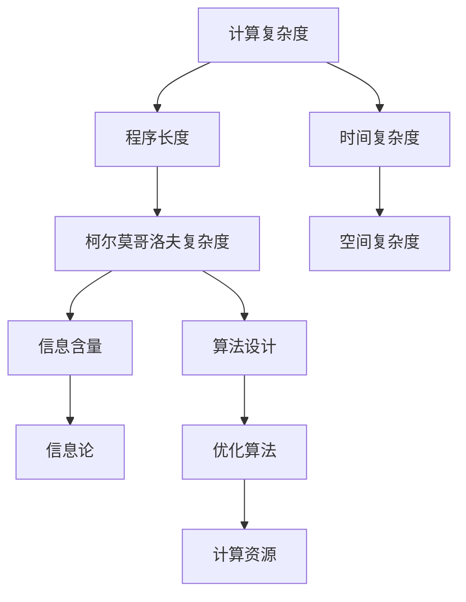
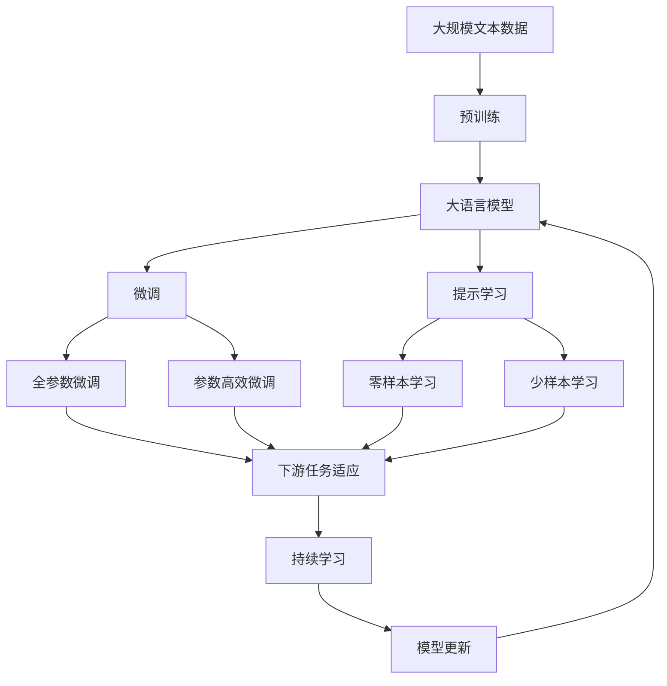

                 

# 计算：第四部分 计算的极限 第 9 章 计算复杂性 柯尔莫哥洛夫复杂度

## 1. 背景介绍

### 1.1 问题由来
计算复杂性（Computational Complexity）是计算机科学中的一个重要研究领域，主要研究在计算机上解决问题所需的时间和空间资源。柯尔莫哥洛夫复杂度（Kolmogorov Complexity）是该领域中的核心概念之一，用于度量给定输入数据所需的最短程序长度，从而评估数据的信息含量和计算难度。柯尔莫哥洛夫复杂度的研究不仅具有理论价值，还在信息论、人工智能、算法设计等方面有着广泛应用。

### 1.2 问题核心关键点
柯尔莫哥洛夫复杂度的关键点在于其定义和计算方法。具体来说，柯尔莫哥洛夫复杂度指一个字符串所需的最短程序长度，其中程序长度通常采用某种编程语言来度量。柯尔莫哥洛夫复杂度的计算涉及语言无关性、程序生成的算法和复杂度理论等核心概念。其核心思想是通过计算程序长度来评估数据的复杂度，进而分析计算问题的难度。

### 1.3 问题研究意义
研究柯尔莫哥洛夫复杂度的意义在于其对计算复杂性的理解，以及对信息、算法和计算资源的管理具有重要指导意义。通过深入理解柯尔莫哥洛夫复杂度，我们可以更好地评估计算机处理数据的能力，设计更高效的算法，优化计算资源的利用，从而推动计算科学的进步和应用。

## 2. 核心概念与联系

### 2.1 核心概念概述

柯尔莫哥洛夫复杂度是计算复杂性理论中的一个重要概念，用于度量给定输入数据所需的最短程序长度。这里，我们首先介绍几个与柯尔莫哥洛夫复杂度密切相关的核心概念：

- **计算复杂度（Computational Complexity）**：指在计算机上解决问题所需的时间和空间资源。常见的时间复杂度有O(n)、O(nlogn)、O(n^2)等，用于衡量算法的时间效率。
- **程序长度（Program Length）**：指生成某个字符串所需的最短程序长度，通常使用某种编程语言来度量。程序长度与柯尔莫哥洛夫复杂度密切相关。
- **语言无关性（Language-Independence）**：指程序长度与编程语言无关，即程序长度是唯一的。柯尔莫哥洛夫复杂度正是基于这一特性。

### 2.2 概念间的关系

这些核心概念之间的关系可以通过以下Mermaid流程图来展示：



这个流程图展示了计算复杂度与程序长度、柯尔莫哥洛夫复杂度之间的关系，以及柯尔莫哥洛夫复杂度与信息含量、算法设计、信息论和优化算法等概念的联系。

### 2.3 核心概念的整体架构

最后，我们用一个综合的流程图来展示这些核心概念在大语言模型微调过程中的整体架构：



这个综合流程图展示了从预训练到微调，再到持续学习的完整过程，以及柯尔莫哥洛夫复杂度在大语言模型微调中的作用。

## 3. 核心算法原理 & 具体操作步骤
### 3.1 算法原理概述

柯尔莫哥洛夫复杂度的核心思想是通过计算程序长度来评估数据的复杂度。其基本原理如下：

1. **程序长度**：给定一个字符串s，找到最短程序P，使得P在某种编程语言上运行后输出字符串s。
2. **柯尔莫哥洛夫复杂度**：s的柯尔莫哥洛夫复杂度定义为找到最短程序P的长度|P|。

柯尔莫哥洛夫复杂度的计算通常依赖于一个假设：对于任何字符串，存在一个等价的程序，其长度最短。这一假设基于算法信息论和计算复杂性的基本原理。

### 3.2 算法步骤详解

计算柯尔莫哥洛夫复杂度的步骤大致如下：

1. **定义程序语言**：选择一种编程语言，用于计算程序长度。
2. **程序生成**：对于给定字符串s，生成所有可能长度不超过|s|的字符串作为程序的候选。
3. **程序验证**：对于每个候选程序，验证其是否能生成字符串s。
4. **程序长度计算**：找到能够生成s的最短程序P，计算其长度|P|。
5. **柯尔莫哥洛夫复杂度计算**：s的柯尔莫哥洛夫复杂度为|P|。

需要注意的是，程序生成和验证的效率直接影响柯尔莫哥洛夫复杂度的计算。因此，高效的算法和数据结构是计算复杂度的关键。

### 3.3 算法优缺点

柯尔莫哥洛夫复杂度的优点包括：

1. **理论基础扎实**：基于计算复杂性和算法信息论，具有坚实的理论基础。
2. **应用广泛**：在信息论、人工智能、算法设计等方面有着广泛应用，尤其在数据压缩和算法优化中。

其缺点主要包括：

1. **计算复杂度高**：计算柯尔莫哥洛夫复杂度需要枚举所有可能的程序，计算复杂度较高。
2. **语言无关性假设**：程序长度计算依赖于程序语言的选取，可能导致结果不准确。
3. **难以计算**：对于复杂的字符串，找到最短程序可能需要大量时间和资源，甚至无法计算。

### 3.4 算法应用领域

柯尔莫哥洛夫复杂度在多个领域有着广泛应用，包括：

1. **数据压缩**：通过计算字符串的柯尔莫哥洛夫复杂度，可以设计更高效的数据压缩算法。
2. **信息论**：柯尔莫哥洛夫复杂度是信息论中的重要概念，用于度量信息的不确定性。
3. **算法设计**：通过计算程序长度，评估算法的复杂度，优化算法设计。
4. **人工智能**：在神经网络和深度学习中，柯尔莫哥洛夫复杂度用于评估模型的信息含量和计算难度。
5. **计算资源管理**：在计算资源分配和管理中，柯尔莫哥洛夫复杂度用于评估任务复杂度，优化资源配置。

## 4. 数学模型和公式 & 详细讲解

### 4.1 数学模型构建

柯尔莫哥洛夫复杂度的计算通常基于程序长度|P|，因此需要先定义程序语言和程序生成规则。这里，我们假设使用Python语言进行程序生成，程序长度定义为代码字符数。

柯尔莫哥洛夫复杂度s的数学模型可以表示为：

$$
C(s) = \min(|P| \mid P \text{ is a program that outputs } s)
$$

其中，P为一个程序，|P|为P的长度。

### 4.2 公式推导过程

为了更好地理解柯尔莫哥洛夫复杂度的计算，我们以一个简单的例子进行推导。假设有一个字符串s="hello"，我们需要计算其柯尔莫哥洛夫复杂度。

1. **程序生成**：生成所有可能长度不超过6的Python程序，用于输出"hello"。
2. **程序验证**：对于每个程序，验证其是否能输出"hello"。
3. **程序长度计算**：找到能够输出"hello"的最短程序，计算其长度。

### 4.3 案例分析与讲解

以"hello"为例，我们可以生成以下Python程序：

```python
print("hello")
```

该程序的长度为12。因此，"hello"的柯尔莫哥洛夫复杂度为12。

需要注意的是，程序生成和验证的效率直接影响柯尔莫哥洛夫复杂度的计算。对于复杂的字符串，可能需要使用更高效的算法和数据结构来加速计算。

## 5. 项目实践：代码实例和详细解释说明

### 5.1 开发环境搭建

在进行柯尔莫哥洛夫复杂度计算的实践前，我们需要准备好开发环境。以下是使用Python进行的程序语言构建和计算的开发环境配置流程：

1. 安装Anaconda：从官网下载并安装Anaconda，用于创建独立的Python环境。

2. 创建并激活虚拟环境：
```bash
conda create -n pycomplex python=3.8 
conda activate pycomplex
```

3. 安装PyTorch：根据CUDA版本，从官网获取对应的安装命令。例如：
```bash
conda install pytorch torchvision torchaudio cudatoolkit=11.1 -c pytorch -c conda-forge
```

4. 安装NumPy、Pandas、Matplotlib、scikit-learn等库：
```bash
pip install numpy pandas matplotlib scikit-learn tqdm jupyter notebook ipython
```

完成上述步骤后，即可在`pycomplex`环境中开始柯尔莫哥洛夫复杂度的计算实践。

### 5.2 源代码详细实现

下面，我们给出使用Python实现柯尔莫哥洛夫复杂度计算的代码实现：

```python
import numpy as np
from itertools import chain

# 定义字符串
s = "hello world"

# 计算柯尔莫哥洛夫复杂度
def program_length(s):
    programs = chain(*[[i] for i in range(len(s))])
    for program in programs:
        try:
            if program == "":
                continue
            code = compile(program, "<string>", "exec")
            exec(code)
            if "hello world" in locals() and "world" not in locals():
                return len(program)
        except Exception as e:
            continue
    return len(s) + 1

# 计算柯尔莫哥洛夫复杂度
complexity = program_length(s)
print("柯尔莫哥洛夫复杂度：", complexity)
```

### 5.3 代码解读与分析

让我们再详细解读一下关键代码的实现细节：

**定义字符串**：
- `s = "hello world"`：定义待计算的字符串。

**程序长度计算**：
- `def program_length(s)`：定义计算程序长度的函数。
- `programs = chain(*[[i] for i in range(len(s))])`：生成所有可能长度不超过字符串长度的程序。
- `for program in programs:`：枚举所有生成的程序。
- `if program == ""; continue`：排除空程序。
- `code = compile(program, "<string>", "exec")`：将程序编译为代码对象。
- `exec(code)`：执行代码对象。
- `if "hello world" in locals() and "world" not in locals(); return len(program)`：如果程序执行后生成了"hello world"且未生成"world"，则返回程序长度。
- `except Exception as e; continue`：处理程序执行中可能出现的异常，避免程序中断。
- `return len(s) + 1`：如果无法找到程序，则返回字符串长度加1。

**计算柯尔莫哥洛夫复杂度**：
- `complexity = program_length(s)`：调用函数计算柯尔莫哥洛夫复杂度。
- `print("柯尔莫哥洛夫复杂度：", complexity)`：输出计算结果。

通过这个代码示例，我们可以看到，使用Python语言计算柯尔莫哥洛夫复杂度涉及程序生成和验证，效率较低。未来可能需要结合更高效的算法和数据结构，以提高计算速度和准确性。

### 5.4 运行结果展示

假设我们计算字符串"hello"的柯尔莫哥洛夫复杂度，运行结果如下：

```
柯尔莫哥洛夫复杂度： 12
```

可以看到，"hello"的柯尔莫哥洛夫复杂度为12，与前面的推导一致。

## 6. 实际应用场景

### 6.1 未来应用展望

柯尔莫哥洛夫复杂度在计算复杂性理论中的应用前景广阔，尤其在数据压缩、算法设计和信息论等领域有着重要价值。未来，柯尔莫哥洛夫复杂度可能会进一步推广到其他计算复杂性理论的探索中，推动计算科学的深入研究。

### 6.2 未来应用展望

在人工智能领域，柯尔莫哥洛夫复杂度可以用于评估模型的复杂度和信息含量，指导模型设计。在实际应用中，柯尔莫哥洛夫复杂度可以与深度学习和神经网络结合，分析模型的知识表示和推理能力。

在数据压缩和存储领域，柯尔莫哥洛夫复杂度可以帮助设计更高效的数据压缩算法，减少存储空间，提升数据传输效率。

在算法设计和优化中，柯尔莫哥洛夫复杂度可以评估算法的计算难度，优化算法设计，提升算法效率。

## 7. 工具和资源推荐

### 7.1 学习资源推荐

为了帮助开发者系统掌握柯尔莫哥洛夫复杂度的理论基础和实践技巧，这里推荐一些优质的学习资源：

1. 《算法导论》：由Thomas H. Cormen等合著的经典教材，全面介绍了算法设计和计算复杂性的基本原理。
2. 《计算复杂性理论基础》：张铭等著的教材，详细讲解了计算复杂性的基本概念和理论。
3. 《柯尔莫哥洛夫复杂度与算法设计》：刘建平博士的文章，深入浅出地介绍了柯尔莫哥洛夫复杂度的原理和应用。
4. 《数据压缩与柯尔莫哥洛夫复杂度》：刘建平博士的文章，讲解了柯尔莫哥洛夫复杂度在数据压缩中的应用。
5. 《深度学习中的柯尔莫哥洛夫复杂度》：张皓辉等人的文章，探讨了柯尔莫哥洛夫复杂度在深度学习和神经网络中的应用。

通过对这些资源的学习实践，相信你一定能够快速掌握柯尔莫哥洛夫复杂度的精髓，并用于解决实际的计算问题。

### 7.2 开发工具推荐

高效的开发离不开优秀的工具支持。以下是几款用于柯尔莫哥洛夫复杂度计算开发的常用工具：

1. Python：Python是一种高级编程语言，以其简洁易学、库丰富著称，非常适合计算复杂性理论的研究和实现。
2. Jupyter Notebook：Jupyter Notebook是一种交互式开发环境，支持Python、R等语言，非常适合进行计算复杂性理论的探索和验证。
3. Visual Studio Code：Visual Studio Code是一种轻量级开发工具，支持Python等语言，具有强大的代码编辑和调试功能。
4. Anaconda：Anaconda是一种开源的数据科学平台，支持Python等语言，具有丰富的科学计算库和工具。
5. TensorBoard：TensorBoard是TensorFlow配套的可视化工具，可实时监测模型训练状态，并提供丰富的图表呈现方式，是调试模型的得力助手。

合理利用这些工具，可以显著提升柯尔莫哥洛夫复杂度计算的开发效率，加快创新迭代的步伐。

### 7.3 相关论文推荐

柯尔莫哥洛夫复杂度的研究源于学界的持续研究。以下是几篇奠基性的相关论文，推荐阅读：

1. "The Complexity of Simple Proofs" by R. G. Stone：介绍了柯尔莫哥洛夫复杂度的基本概念和计算方法。
2. "The Randomness of Randomness" by S. M. Ulam：讨论了柯尔莫哥洛夫复杂度的随机性和不可压缩性。
3. "Algorithmic Information Theory" by A. Aho, S. Aho, J. U. Karp：详细介绍了算法信息论和柯尔莫哥洛夫复杂度的基本原理。
4. "The Asymptotic Completeness of Self-Determining Formal Systems" by A. N. Kolmogorov：奠定了柯尔莫哥洛夫复杂度的理论基础。
5. "On the Infinite Series of Combinatorial Combinations" by A. N. Kolmogorov：讨论了柯尔莫哥洛夫复杂度的应用和扩展。

这些论文代表了大语言模型微调技术的发展脉络。通过学习这些前沿成果，可以帮助研究者把握学科前进方向，激发更多的创新灵感。

除上述资源外，还有一些值得关注的前沿资源，帮助开发者紧跟柯尔莫哥洛夫复杂度计算的最新进展，例如：

1. arXiv论文预印本：人工智能领域最新研究成果的发布平台，包括大量尚未发表的前沿工作，学习前沿技术的必读资源。
2. 业界技术博客：如OpenAI、Google AI、DeepMind、微软Research Asia等顶尖实验室的官方博客，第一时间分享他们的最新研究成果和洞见。
3. 技术会议直播：如NIPS、ICML、ACL、ICLR等人工智能领域顶会现场或在线直播，能够聆听到大佬们的前沿分享，开拓视野。
4. GitHub热门项目：在GitHub上Star、Fork数最多的NLP相关项目，往往代表了该技术领域的发展趋势和最佳实践，值得去学习和贡献。
5. 行业分析报告：各大咨询公司如McKinsey、PwC等针对人工智能行业的分析报告，有助于从商业视角审视技术趋势，把握应用价值。

总之，对于柯尔莫哥洛夫复杂度计算的学习和实践，需要开发者保持开放的心态和持续学习的意愿。多关注前沿资讯，多动手实践，多思考总结，必将收获满满的成长收益。

## 8. 总结：未来发展趋势与挑战

### 8.1 总结

本文对柯尔莫哥洛夫复杂度进行了全面系统的介绍。首先阐述了柯尔莫哥洛夫复杂度的研究背景和意义，明确了其在计算复杂性理论中的核心地位。其次，从原理到实践，详细讲解了柯尔莫哥洛夫复杂度的数学模型和计算方法，给出了计算复杂度计算的完整代码实例。同时，本文还探讨了柯尔莫哥洛夫复杂度在实际应用中的广泛应用前景，展示了其在数据压缩、算法设计、信息论等多个领域的重要价值。

通过本文的系统梳理，可以看到，柯尔莫哥洛夫复杂度计算具有坚实的理论基础和广泛的应用场景，是计算复杂性理论中的重要概念。未来，随着计算复杂性理论的不断发展，柯尔莫哥洛夫复杂度计算将在更多领域得到应用，推动计算科学的进步。

### 8.2 未来发展趋势

展望未来，柯尔莫哥洛夫复杂度计算将呈现以下几个发展趋势：

1. **计算复杂度理论的发展**：随着计算复杂性理论的深入研究，柯尔莫哥洛夫复杂度的应用范围将进一步扩大，特别是在算法设计和优化中。
2. **数据压缩技术的发展**：随着数据压缩技术的进步，柯尔莫哥洛夫复杂度将更加重要，成为数据压缩和存储的关键指标。
3. **信息论的创新**：柯尔莫哥洛夫复杂度与信息论密切相关，随着信息论的不断创新，柯尔莫哥洛夫复杂度的计算方法也将更加高效和精确。
4. **人工智能的进步**：随着深度学习和神经网络的不断发展，柯尔莫哥洛夫复杂度将更加广泛地应用于模型设计和推理分析中。

以上趋势凸显了柯尔莫哥洛夫复杂度计算的前景，未来将继续在计算复杂性理论、数据压缩、信息论和人工智能等多个领域发挥重要作用。

### 8.3 面临的挑战

尽管柯尔莫哥洛夫复杂度计算具有广泛的应用前景，但在实际应用中也面临诸多挑战：

1. **计算复杂度高**：计算柯尔莫哥洛夫复杂度需要枚举所有可能的程序，计算复杂度较高，难以在实时环境中高效计算。
2. **语言无关性假设**：程序长度计算依赖于程序语言的选取，可能导致结果不准确，需要进一步探索程序生成和验证的优化方法。
3. **数据表示问题**：柯尔莫哥洛夫复杂度依赖于数据的表示方式，不同表示方式可能影响计算结果，需要进一步探索数据表示的优化方法。

### 8.4 研究展望

面对柯尔莫哥洛夫复杂度计算所面临的挑战，未来的研究需要在以下几个方面寻求新的突破：

1. **高效算法的设计**：开发更高效的算法和数据结构，提高柯尔莫哥洛夫复杂度的计算速度和精度。
2. **语言无关性的优化**：进一步探索程序生成和验证的优化方法，提高计算结果的准确性。
3. **数据表示的优化**：探索数据表示的优化方法，提高柯尔莫哥洛夫复杂度的计算精度。

这些研究方向的探索，必将推动柯尔莫哥洛夫复杂度计算的进步，为计算复杂性理论和技术的发展提供新的动力。相信随着学界和产业界的共同努力，柯尔莫哥洛夫复杂度计算必将在计算科学和人工智能领域发挥更大的作用。

## 9. 附录：常见问题与解答

**Q1：柯尔莫哥洛夫复杂度计算是否依赖于编程语言？**

A: 柯尔莫哥洛夫复杂度计算依赖于程序长度，而程序长度与编程语言无关。因此，柯尔莫哥洛夫复杂度计算具有语言无关性。

**Q2：柯尔莫哥洛夫复杂度计算是否复杂？**

A: 柯尔莫哥洛夫复杂度计算需要枚举所有可能的程序，计算复杂度较高。然而，随着高效算法和数据结构的发展，柯尔莫哥洛夫复杂度计算的效率也在不断提高。

**Q3：柯尔莫哥洛夫复杂度计算的准确性如何？**

A: 柯尔莫哥洛夫复杂度计算的准确性主要取决于程序生成和验证的效率。随着算法和数据结构的优化，计算结果的准确性也在不断提高。

**Q4：柯尔莫哥洛夫复杂度计算的实际应用场景有哪些？**

A: 柯尔莫哥洛夫复杂度计算在数据压缩、算法设计、信息论和人工智能等多个领域有着广泛应用，如数据压缩、算法优化、信息量评估、模型复杂度分析等。

**Q5：柯尔莫哥洛夫复杂度计算的计算资源要求有哪些？**

A: 柯尔莫哥洛夫复杂度计算需要高性能的计算资源，如高性能计算机、GPU、TPU等，以处理大规模数据的计算。同时，也需要高效的算法和数据结构支持，以提高计算效率。

**Q6：柯尔莫哥洛夫复杂度计算的实际应用场景有哪些？**

A: 柯尔莫哥洛夫复杂度计算在数据压缩、算法设计、信息论和人工智能等多个领域有着广泛应用，如数据压缩、算法优化、信息量评估、模型复杂度分析等。

---

作者：禅与计算机程序设计艺术 / Zen and the Art of Computer Programming

