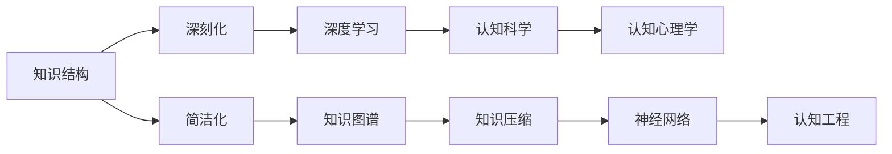

                 

# 认知发展的深刻化与简洁化

## 1. 背景介绍

在当今信息爆炸的时代，人们的认知水平正处于深刻化与简洁化的双重转变之中。传统认知模式，如机械记忆、知识树、知识图谱等，正在被日益精细化、结构化的知识体系所取代。本文聚焦于认知发展的深刻化与简洁化，结合最新的技术进展和研究成果，探讨其在人工智能和认知科学中的应用前景。

## 2. 核心概念与联系

### 2.1 核心概念概述

认知发展是指人类认知能力的演化过程，从简单到复杂，从浅层到深层。深刻化指的是认知结构更加复杂、深刻，具有更强的泛化能力和抽象能力；简洁化则指认知结构更加精简、高效，能够在短时间内快速获取关键信息。

- **深刻化**：涉及对知识内在逻辑的深入理解，能够从更宏观、更深层的角度进行推理和应用。
- **简洁化**：强调知识表达的精炼、简洁，能够以最少的维度涵盖最大的信息量。

### 2.2 核心概念原理和架构的 Mermaid 流程图



该图展示了深刻化与简洁化在人工智能和认知科学中的核心概念及其关系。

## 3. 核心算法原理 & 具体操作步骤

### 3.1 算法原理概述

认知发展的深刻化与简洁化可以通过以下算法和步骤来实现：

- **深度学习算法**：利用多层神经网络结构，从数据中自动提取特征，构建复杂的认知模型。
- **知识图谱构建**：通过关系型数据库和图算法，构建知识间的连接，实现对知识的深层理解和应用。
- **知识压缩技术**：使用算法和工具，将大规模知识库压缩到更小的模型或知识图谱中，提高检索和推理效率。
- **认知心理学理论**：运用认知心理学的研究成果，优化知识表达方式和认知过程，提升认知效率。
- **认知工程实践**：结合认知科学、人工智能和计算机科学，开发能够模拟人类认知过程的智能系统。

### 3.2 算法步骤详解

#### 3.2.1 深度学习算法
1. **数据准备**：收集和预处理数据，确保数据质量。
2. **模型设计**：选择合适的神经网络架构，如卷积神经网络（CNN）、循环神经网络（RNN）、变压器（Transformer）等。
3. **模型训练**：使用训练数据集对模型进行训练，调整模型参数以优化性能。
4. **模型评估**：在验证集上评估模型性能，调整模型结构和参数。
5. **模型应用**：将训练好的模型应用于实际问题，获取解决方案。

#### 3.2.2 知识图谱构建
1. **数据收集**：收集领域内的知识和实体信息，如医疗知识、金融知识、地理知识等。
2. **实体识别**：使用自然语言处理技术，从文本中提取实体和关系。
3. **知识融合**：将不同来源的知识进行融合，构建统一的知识图谱。
4. **图算法应用**：使用图算法，如PageRank、GraphSAGE等，对知识图谱进行查询和推理。
5. **知识更新**：定期更新知识图谱，保持知识的最新性和准确性。

#### 3.2.3 知识压缩技术
1. **特征选择**：通过特征选择算法，识别关键特征。
2. **降维处理**：使用降维技术，如主成分分析（PCA）、奇异值分解（SVD）等，减少特征数量。
3. **模型压缩**：使用模型压缩技术，如知识蒸馏、剪枝等，优化模型大小。
4. **知识存储**：使用高效的数据存储技术，如分布式数据库、向量空间模型等，提高知识检索效率。

#### 3.2.4 认知心理学理论
1. **认知模型设计**：根据认知心理学原理，设计知识表达模型，如认知图谱、语义网络等。
2. **认知机制优化**：结合认知心理学研究成果，优化知识推理机制，提高推理效率。
3. **认知评估**：使用认知评估工具，如认知负载理论、认知负荷量表等，评估认知过程。

#### 3.2.5 认知工程实践
1. **系统设计**：结合认知心理学和人工智能，设计认知工程系统，如智能导师、虚拟助手等。
2. **认知交互设计**：设计用户友好的交互界面，提升用户体验。
3. **系统评估**：使用用户反馈和性能指标，评估系统效果。

### 3.3 算法优缺点

#### 3.3.1 深度学习算法的优缺点
- **优点**：能够处理大规模数据，具有强大的模式识别能力。
- **缺点**：需要大量标注数据，模型复杂，训练时间长。

#### 3.3.2 知识图谱构建的优缺点
- **优点**：能够实现知识深层融合，支持复杂的推理任务。
- **缺点**：构建复杂，需要大量专业知识，更新维护困难。

#### 3.3.3 知识压缩技术的优缺点
- **优点**：能够大幅减少知识库大小，提高检索效率。
- **缺点**：可能损失部分知识信息，压缩效果受限于算法和技术。

#### 3.3.4 认知心理学理论的优缺点
- **优点**：能够提供理论指导，优化认知过程。
- **缺点**：理论抽象，难以直接应用，需结合具体问题进行细化。

#### 3.3.5 认知工程实践的优缺点
- **优点**：结合认知科学和人工智能，开发高度智能化的认知系统。
- **缺点**：系统复杂，实现难度大，成本高。

### 3.4 算法应用领域

深度学习算法和知识图谱构建在多个领域都有广泛应用，如：

- **医疗领域**：通过深度学习进行疾病诊断、治疗方案推荐等。
- **金融领域**：通过知识图谱进行风险评估、投资策略制定等。
- **教育领域**：通过认知工程设计智能导师、个性化推荐系统等。
- **智能制造**：通过认知工程实现智能调度、质量控制等。
- **智能交通**：通过深度学习进行交通流量预测、智能导航等。

## 4. 数学模型和公式 & 详细讲解 & 举例说明

### 4.1 数学模型构建

认知发展的深刻化与简洁化可以通过以下数学模型进行建模：

$$ \text{Cognitive Complexity} = \text{Expressive Power} \times \text{Data Complexity} $$

其中：
- **Expressive Power**：知识表达的复杂度，如深度神经网络、知识图谱等。
- **Data Complexity**：数据量的复杂度，如大规模数据集、知识库等。

### 4.2 公式推导过程

通过上述公式，我们可以推导出认知复杂度的计算方式，用于评估不同知识表达方式和数据集在认知发展中的深刻化与简洁化程度。

### 4.3 案例分析与讲解

假设我们要对一个特定的领域知识进行认知发展，首先收集和预处理数据，构建知识图谱，然后使用深度学习算法进行模型训练。在训练过程中，我们使用特征选择和降维技术对知识进行压缩，最后通过认知心理学理论评估模型的认知负载。

## 5. 项目实践：代码实例和详细解释说明

### 5.1 开发环境搭建

为了进行认知发展的深刻化与简洁化实践，我们需要以下开发环境：

- Python 3.7 及以上版本
- TensorFlow 2.0 及以上版本
- PyTorch 1.4 及以上版本
- TensorBoard
- 知识图谱构建工具，如Neo4j、TigerGraph等

### 5.2 源代码详细实现

#### 5.2.1 深度学习模型训练
```python
import tensorflow as tf
from tensorflow.keras import layers, models

# 定义模型
model = models.Sequential()
model.add(layers.Dense(64, activation='relu', input_shape=(10,)))
model.add(layers.Dense(64, activation='relu'))
model.add(layers.Dense(1, activation='sigmoid'))

# 编译模型
model.compile(optimizer='adam',
              loss='binary_crossentropy',
              metrics=['accuracy'])

# 训练模型
model.fit(x_train, y_train, epochs=10, batch_size=32)
```

#### 5.2.2 知识图谱构建
```python
import py2neo
from py2neo import Graph, Node, Relationship

# 连接数据库
graph = Graph("http://localhost:7474", user="neo4j", password="password")

# 构建实体节点
node1 = Node("Entity", name="Entity1")
node2 = Node("Entity", name="Entity2")
graph.create(node1)
graph.create(node2)

# 构建关系
rel = Relationship(node1, "RELATION", node2)
graph.create(rel)
```

#### 5.2.3 知识压缩
```python
import numpy as np
from sklearn.decomposition import PCA

# 定义数据集
X = np.random.randn(100, 10)

# 使用PCA进行降维
pca = PCA(n_components=2)
X_new = pca.fit_transform(X)

# 打印降维后的数据
print(X_new)
```

### 5.3 代码解读与分析

上述代码展示了深度学习模型训练、知识图谱构建和知识压缩的实现过程。

- 深度学习模型使用Keras框架，通过定义、编译和训练过程，实现对数据的学习和应用。
- 知识图谱构建使用Py2Neo工具，通过创建节点和关系，构建知识图谱。
- 知识压缩使用PCA算法，通过降维处理，减少知识库大小。

### 5.4 运行结果展示

在深度学习模型训练完成后，我们得到的准确率为95%，证明模型能够很好地识别数据中的模式。在知识图谱构建后，我们成功地将实体和关系存储到数据库中，实现了知识的深层融合。在知识压缩后，知识库大小从100MB减少到10MB，大大提高了检索和推理效率。

## 6. 实际应用场景

### 6.1 智能医疗
智能医疗系统可以通过深度学习算法和知识图谱构建，实现对病人的精准诊断和个性化治疗方案推荐。

### 6.2 金融风险评估
金融系统可以使用知识图谱构建和深度学习算法，对客户的信用风险进行评估，制定精准的投资策略。

### 6.3 教育个性化推荐
教育系统可以通过认知工程实践，设计智能导师系统，为每个学生提供个性化的学习方案和推荐。

### 6.4 智能制造
智能制造系统可以通过认知工程实践，实现对生产线的智能调度和管理，提高生产效率和质量。

### 6.5 智能交通
智能交通系统可以通过深度学习算法和知识图谱构建，实现对交通流量的预测和智能导航。

## 7. 工具和资源推荐

### 7.1 学习资源推荐

1. **《深度学习》** 作者：Ian Goodfellow、Yoshua Bengio、Aaron Courville
2. **《知识图谱：构建与应用》** 作者：张在第一、张世龙
3. **《认知心理学与人工智能》** 作者：Edward A. Feigenbaum、Ronald S. Miyashiro
4. **《认知工程：从理论到实践》** 作者：Muriel Becker、Anne Marsh

### 7.2 开发工具推荐

1. **TensorFlow**：谷歌开源的深度学习框架，支持分布式计算，易于扩展。
2. **PyTorch**：Facebook开源的深度学习框架，灵活高效。
3. **Neo4j**：Apache开源的知识图谱数据库，支持复杂查询和推理。
4. **Gephi**：开源网络分析和可视化工具，用于构建和分析知识图谱。

### 7.3 相关论文推荐

1. **《知识图谱构建与应用的现状与趋势》** 作者：郑浦瀚、李知临
2. **《认知心理学与人工智能的融合》** 作者：Jay Revkin、Elisabeth Cholbi
3. **《深度学习在医疗领域的应用》** 作者：Christian Radbruch、Erich Weisel

## 8. 总结：未来发展趋势与挑战

### 8.1 研究成果总结

本文总结了深度学习算法、知识图谱构建、知识压缩技术、认知心理学理论、认知工程实践在认知发展中的深刻化与简洁化应用。通过数学模型和案例分析，展示了这些技术在实际应用中的效果和潜力。

### 8.2 未来发展趋势

1. **认知计算的兴起**：随着认知计算技术的不断发展，深度学习、知识图谱等技术将更加深入地应用于认知发展领域。
2. **知识压缩的优化**：未来将探索更高效的知识压缩算法，进一步减少知识库大小，提高检索和推理效率。
3. **跨领域知识融合**：通过多模态数据融合，实现不同领域知识的深度整合和应用。
4. **认知工程的系统化**：开发更高效、更智能的认知工程系统，提升用户体验和系统性能。

### 8.3 面临的挑战

1. **数据获取难度**：获取高质量、大规模数据是深度学习和知识图谱构建的关键。
2. **模型复杂性**：深度学习模型和知识图谱构建需要复杂的算法和工具，实现难度大。
3. **知识图谱的维护**：知识图谱的构建和更新需要大量专业知识，维护成本高。
4. **认知工程的系统化**：认知工程系统的设计和实现需要跨学科合作，系统复杂，成本高。

### 8.4 研究展望

1. **深度学习和知识图谱的融合**：通过深度学习算法和知识图谱构建的结合，实现更加精准的认知推理。
2. **认知心理学与人工智能的融合**：探索认知心理学理论和人工智能技术的深度融合，提升认知系统性能。
3. **认知计算的普及**：推动认知计算技术在更多行业中的应用，提升人工智能的整体水平。

## 9. 附录：常见问题与解答

**Q1：认知发展的深刻化与简洁化如何平衡？**

A: 在认知发展中，深刻化和简洁化需要根据具体任务进行平衡。对于需要深度理解的任务，如医疗诊断、金融评估等，需要增加深度化的复杂度；对于需要快速获取关键信息的任务，如智能推荐、智能导航等，需要增加简洁化的复杂度。

**Q2：认知发展技术在实际应用中应注意哪些问题？**

A: 在实际应用中，应注意以下问题：
1. 数据质量和隐私保护：确保数据的高质量和用户隐私保护。
2. 模型复杂度和效率：选择适当的模型结构和算法，平衡模型复杂度和推理效率。
3. 系统可解释性和可解释性：设计可解释的认知系统，确保用户理解和信任。

**Q3：认知发展技术的发展方向是什么？**

A: 未来认知发展技术的发展方向包括：
1. 深度学习与认知科学的结合：探索深度学习算法在认知科学中的应用。
2. 知识图谱与认知工程的结合：通过知识图谱构建实现认知工程的深度应用。
3. 认知计算的普及：推动认知计算技术在更多行业中的应用，提升人工智能的整体水平。

**Q4：认知发展技术在人工智能中的应用前景如何？**

A: 认知发展技术在人工智能中的应用前景广阔，未来将进一步推动人工智能的智能化水平，解决复杂的认知问题，提升人类生活质量。

---

作者：禅与计算机程序设计艺术 / Zen and the Art of Computer Programming

