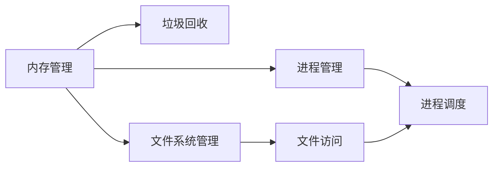
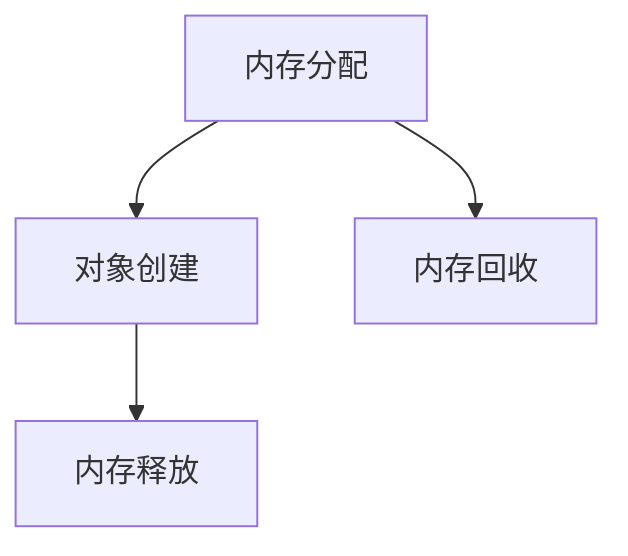
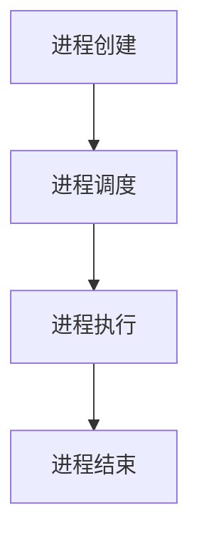
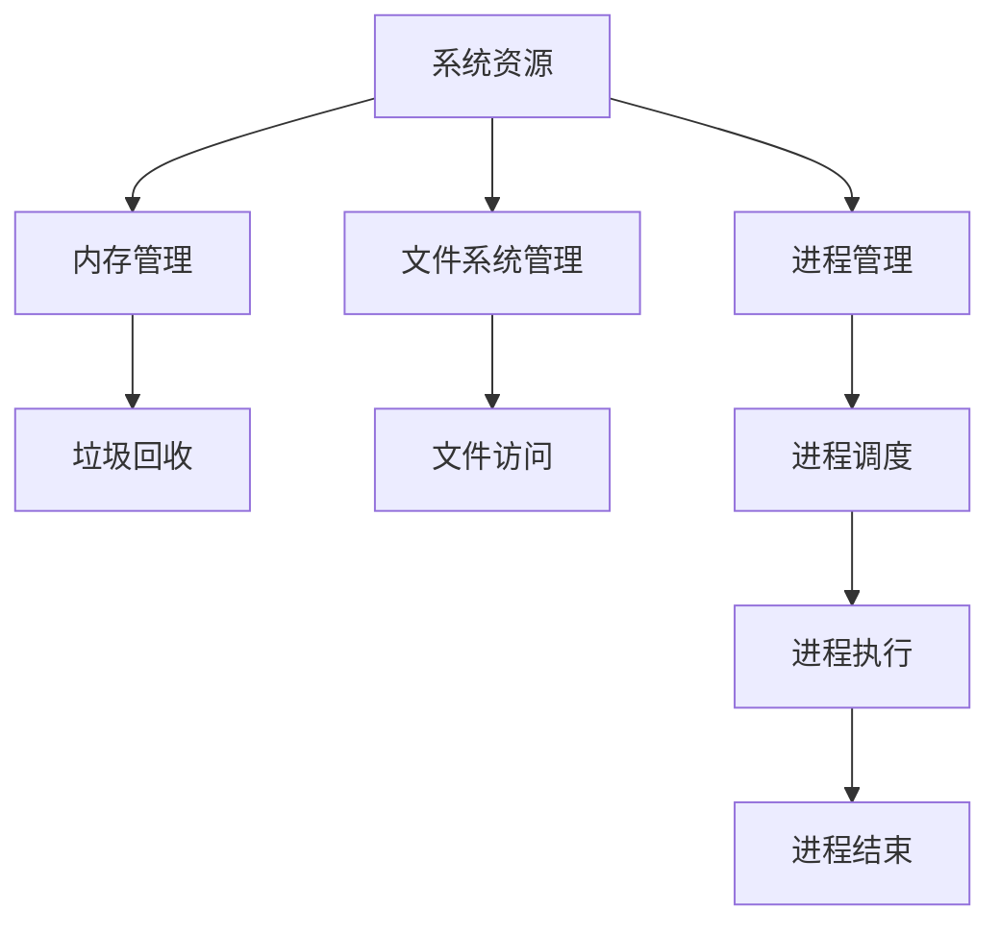

                 

# 资源管理 原理与代码实例讲解

> 关键词：资源管理, 内存管理, 垃圾回收, 文件系统, 数据存储, 进程管理, 性能优化, 操作系统, 容器化技术

## 1. 背景介绍

### 1.1 问题由来
随着软件开发规模的不断扩大和复杂性的提升，资源管理（Resource Management）成为了影响系统性能和稳定性的关键因素。资源管理涉及内存管理、垃圾回收、文件系统管理、进程管理等多个方面，这些问题如果处理不当，可能导致系统运行缓慢、内存泄漏、文件损坏、进程崩溃等问题，严重影响系统的可用性和可靠性。

资源管理的重要性在于：
1. **性能优化**：合理管理资源可以显著提升系统的运行效率，减少系统资源的浪费。
2. **故障预防**：有效的资源管理可以预防系统崩溃，提高系统的稳定性和可靠性。
3. **资源复用**：良好的资源管理能够促进资源的复用，提高系统的响应速度和吞吐量。
4. **优化成本**：合理的资源管理可以降低系统运行成本，包括硬件资源、能源消耗等。

### 1.2 问题核心关键点
资源管理问题的核心关键点在于如何有效分配、使用和回收系统资源，以实现性能优化和系统稳定性的双重目标。在实际应用中，常见的资源管理问题包括：

- **内存泄漏**：程序在运行过程中占用了大量内存，但未能正确释放，导致内存空间被占用而无法使用。
- **内存溢出**：程序占用的内存超过了系统所能提供的最大内存限制，导致系统崩溃。
- **文件损坏**：文件在读取或写入过程中，由于读写错误或文件系统错误，导致文件损坏或数据丢失。
- **进程崩溃**：由于资源竞争、死锁等问题，导致进程无法正常运行或崩溃。

## 2. 核心概念与联系

### 2.1 核心概念概述

为了更好地理解资源管理，我们首先介绍几个核心概念：

- **内存管理（Memory Management）**：负责分配和释放内存空间，避免内存泄漏和溢出，保证系统的稳定性和性能。
- **垃圾回收（Garbage Collection）**：自动识别并释放不再使用的对象，避免内存泄漏，提升程序的效率。
- **文件系统管理（File System Management）**：负责文件的创建、读取、写入和删除，确保文件系统的稳定性和数据完整性。
- **进程管理（Process Management）**：负责进程的创建、调度、同步和终止，避免进程竞争和死锁，提升系统的并发能力和稳定性。
- **资源调度（Resource Scheduling）**：负责资源（如CPU、内存、I/O设备等）的分配和调度，优化资源利用率，提升系统性能。

这些概念之间的关系可以通过以下Mermaid流程图来展示：



这个流程图展示了大规模系统的资源管理框架，其中：

- 内存管理负责分配和回收内存空间，垃圾回收则自动化地回收不再使用的内存。
- 文件系统管理负责文件的读写操作，进程管理负责进程的调度和管理。
- 文件访问和进程调度是资源管理的具体应用场景。

### 2.2 概念间的关系

这些核心概念之间存在着紧密的联系，形成了系统的资源管理生态系统。下面我们通过几个Mermaid流程图来展示这些概念之间的关系。

#### 2.2.1 内存管理与垃圾回收



这个流程图展示了内存管理和垃圾回收的基本流程。在程序运行过程中，内存管理负责分配内存空间，允许程序使用。当对象不再被使用时，垃圾回收会自动回收该对象占用的内存，释放给系统使用。

#### 2.2.2 文件系统管理与文件访问


这个流程图展示了文件系统管理与文件访问的基本流程。在文件系统管理的作用下，程序可以创建、写入、读取和删除文件，实现数据的存储和访问。

#### 2.2.3 进程管理与进程调度



这个流程图展示了进程管理与进程调度的基本流程。在进程管理的作用下，程序可以创建、调度、同步和终止进程，确保系统资源的合理使用和系统的稳定性。

### 2.3 核心概念的整体架构

最后，我们用一个综合的流程图来展示这些核心概念在资源管理中的整体架构：



这个综合流程图展示了资源管理的完整流程。从系统的角度看，资源管理涉及内存、文件、进程等多个方面，共同构成了一个完整的资源管理生态系统。

## 3. 核心算法原理 & 具体操作步骤
### 3.1 算法原理概述

资源管理的核心算法原理主要包括内存管理、垃圾回收、文件系统管理和进程管理等。这里我们重点介绍内存管理和垃圾回收的算法原理。

内存管理的基本目标是在保证程序正确运行的前提下，合理分配和释放内存空间，避免内存泄漏和溢出。常用的内存管理算法有固定分区分配、可变分区分配和动态分配等。

垃圾回收则通过自动检测和回收不再使用的内存对象，避免内存泄漏，提升程序的效率。常用的垃圾回收算法有标记-清除算法、复制算法和标记-整理算法等。

### 3.2 算法步骤详解

接下来，我们详细讲解内存管理和垃圾回收的算法步骤。

#### 3.2.1 内存管理

内存管理的核心步骤包括内存分配和内存释放。

**内存分配**：在程序运行过程中，系统需要动态地分配内存空间，以满足程序的需求。常用的内存分配算法有：

1. **固定分区分配**：将内存空间分为若干固定大小的区域，每个区域只能分配给一个程序。分配时需要检查该区域是否还有可用空间，若没有则无法分配。

2. **可变分区分配**：将内存空间分为若干可变大小的区域，每个区域可以分配给多个程序。分配时需要检查是否有足够空间，并将可用空间分割成可用块，记录在空闲链表中。

3. **动态分配**：在运行过程中根据需要动态地分配和释放内存空间。常用的动态分配算法有首次适应法（First Fit）、最佳适应法（Best Fit）和最坏适应法（Worst Fit）等。

**内存释放**：当程序不再需要某个内存块时，需要将其释放回系统。常用的内存释放算法有标记-清除算法和引用计数算法等。

#### 3.2.2 垃圾回收

垃圾回收通过自动检测和回收不再使用的内存对象，避免内存泄漏，提升程序的效率。常用的垃圾回收算法有：

1. **标记-清除算法**：将内存空间划分为已使用和未使用两部分，标记所有已使用的内存块，然后清除未使用的内存块。这种方法简单易实现，但会导致内存碎片化，影响系统性能。

2. **复制算法**：将内存空间分为两个部分，新对象分配到其中一个部分，当该部分内存满时，将已分配的对象复制到另一个部分，释放已满部分。这种方法可以避免内存碎片化，但需要额外空间，适用于内存充足的情况。

3. **标记-整理算法**：先标记所有已使用的内存块，然后将未使用的内存块移动到一端，释放另一端的内存空间。这种方法可以避免内存碎片化，但需要额外空间，适用于内存充足的情况。

### 3.3 算法优缺点

内存管理和垃圾回收算法各有优缺点，需要根据具体情况选择合适的算法。

内存管理算法的优点包括：

- **简单高效**：固定分区分配和可变分区分配算法实现简单，易于理解和实现。
- **动态分配**：动态分配算法可以动态地分配和释放内存空间，满足程序的需求。

内存管理算法的缺点包括：

- **内存碎片化**：固定分区分配和可变分区分配算法可能导致内存碎片化，影响系统性能。
- **分配效率低**：动态分配算法的分配和释放效率较低，影响系统的响应速度。

垃圾回收算法的优点包括：

- **自动化**：垃圾回收算法可以自动化地回收不再使用的内存对象，避免内存泄漏。
- **系统稳定性**：垃圾回收算法可以避免内存泄漏和溢出，提高系统的稳定性和可靠性。

垃圾回收算法的缺点包括：

- **额外开销**：垃圾回收算法需要额外的开销，包括标记、清除等操作，影响系统的性能。
- **复杂度高**：垃圾回收算法实现复杂，需要考虑多种情况，如可达性分析、对象引用等。

### 3.4 算法应用领域

内存管理和垃圾回收算法广泛应用于各种编程语言和操作系统中。例如：

- **C语言**：使用固定分区分配和可变分区分配算法进行内存管理。
- **Java语言**：使用标记-清除算法和复制算法进行垃圾回收。
- **Python语言**：使用垃圾回收机制进行内存管理，提供自动化的内存回收功能。

## 4. 数学模型和公式 & 详细讲解 & 举例说明

### 4.1 数学模型构建

内存管理和垃圾回收算法的核心数学模型包括内存分配和垃圾回收的数学模型。

假设程序需要分配大小为 $n$ 的内存块，内存总大小为 $M$。

**内存分配模型**：
- 固定分区分配：$n$ 个固定大小的分区，每个分区大小为 $s$，分配公式为：
$$
\text{分配成功} \Rightarrow \sum_{i=1}^n s_i \leq M
$$
- 可变分区分配：$n$ 个可变大小的分区，每个分区大小为 $s_i$，分配公式为：
$$
\text{分配成功} \Rightarrow \sum_{i=1}^n s_i \leq M
$$

**垃圾回收模型**：
- 标记-清除算法：标记所有可达对象，清除未标记对象，公式为：
$$
\text{清除} \Rightarrow \text{标记可达对象} \cap \text{未标记对象} = \emptyset
$$
- 复制算法：标记所有可达对象，复制到另一个分区，释放原分区，公式为：
$$
\text{清除} \Rightarrow \text{标记可达对象} = \text{复制到另一个分区}
$$

### 4.2 公式推导过程

接下来，我们详细推导内存分配和垃圾回收的公式。

#### 4.2.1 内存分配

以可变分区分配算法为例，假设程序需要分配大小为 $n$ 的内存块，每个分区大小为 $s_i$，总大小为 $M$，分配成功的条件为：

$$
\sum_{i=1}^n s_i \leq M
$$

在实际分配过程中，需要检查可用空间是否足够，并将可用空间分割成可用块，记录在空闲链表中。具体步骤如下：

1. 扫描空闲链表，查找第一个大小大于等于 $s_n$ 的可用块。
2. 将该块分为 $n$ 个大小为 $s_i$ 的子块，并将每个子块插入到空闲链表中。
3. 返回分配的内存块。

#### 4.2.2 垃圾回收

以标记-清除算法为例，假设程序中有 $N$ 个对象，其中 $C$ 个对象为可达对象，$U$ 个对象为未标记对象，总大小为 $M$。

标记可达对象的过程如下：

1. 遍历所有对象，将可达对象标记为已使用。
2. 遍历所有对象，将未标记对象标记为未使用。

清除未标记对象的过程如下：

1. 遍历所有对象，将未标记对象释放回内存空间。
2. 重新调整内存空间，使其连续化，避免内存碎片化。

具体公式推导如下：

- 标记可达对象：
$$
\text{标记可达对象} \Rightarrow \sum_{i=1}^N s_i \leq M
$$

- 清除未标记对象：
$$
\text{清除未标记对象} \Rightarrow \sum_{i=1}^C s_i + \sum_{i=1}^U s_i = M
$$

### 4.3 案例分析与讲解

为了更好地理解内存管理和垃圾回收的算法，我们通过一个具体的案例进行讲解。

**案例**：一个程序需要动态地分配和释放内存，使用可变分区分配和标记-清除算法进行内存管理。程序分配了三个大小为 $s$ 的内存块，其中第一个块已经全部使用，第二个块使用了一半，第三个块没有使用。程序需要分配一个新的块，大小为 $s$。

**步骤**：

1. 扫描空闲链表，查找第一个大小大于等于 $s$ 的可用块，发现第一个块和第二个块都符合条件。
2. 将第一个块分为两个大小为 $s/2$ 的子块，将第二个块分为一个大小为 $s/2$ 的子块，并将子块插入到空闲链表中。
3. 返回分配的内存块。

**结果**：

1. 第一个块剩余 $s/2$ 的空间。
2. 第二个块剩余 $s/2$ 的空间。
3. 第三个块没有使用。
4. 分配一个新的块，大小为 $s$，从第一个块和第二个块中分配。

**总结**：

- 可变分区分配算法可以动态地分配和释放内存空间，满足程序的需求。
- 标记-清除算法可以自动化地回收不再使用的内存对象，避免内存泄漏。

## 5. 项目实践：代码实例和详细解释说明

### 5.1 开发环境搭建

在进行资源管理实践前，我们需要准备好开发环境。以下是使用Python进行C语言编写的资源管理程序的开发环境配置流程：

1. 安装Anaconda：从官网下载并安装Anaconda，用于创建独立的Python环境。

2. 创建并激活虚拟环境：
```bash
conda create -n c-programming python=3.8 
conda activate c-programming
```

3. 安装C语言编译器：
```bash
sudo apt-get update
sudo apt-get install build-essential
```

4. 安装C语言开发工具：
```bash
sudo apt-get install libncurses-dev
```

5. 安装C语言库：
```bash
sudo apt-get install libsqlite3-dev
```

完成上述步骤后，即可在`c-programming`环境中开始资源管理程序的开发。

### 5.2 源代码详细实现

这里我们以一个简单的内存管理程序为例，给出使用C语言进行内存分配和释放的代码实现。

```c
#include <stdio.h>
#include <stdlib.h>
#include <string.h>

#define MEMORY_SIZE 1000
#define BLOCK_SIZE 100

typedef struct block {
    int size;
    int used;
    int next;
} Block;

Block *memory = NULL;

void init_memory() {
    memory = (Block *)malloc(sizeof(Block) * MEMORY_SIZE);
    for (int i = 0; i < MEMORY_SIZE; i++) {
        memory[i].size = BLOCK_SIZE;
        memory[i].used = 0;
        memory[i].next = -1;
    }
    memory[0].size = MEMORY_SIZE * BLOCK_SIZE;
}

int allocate(int size) {
    int i;
    for (i = 0; i < MEMORY_SIZE; i++) {
        if (memory[i].used == 0 && memory[i].size >= size) {
            memory[i].used = 1;
            return i;
        }
    }
    return -1;
}

void release(int index) {
    memory[index].used = 0;
}

int main() {
    init_memory();
    int index = allocate(BLOCK_SIZE);
    if (index != -1) {
        printf("Allocate memory at index %d\n", index);
    } else {
        printf("Failed to allocate memory\n");
    }
    release(index);
    return 0;
}
```

在这个程序中，我们使用一个`Block`结构体来表示内存块。`Block`结构体包含三个字段：`size`表示块的大小，`used`表示块是否被使用，`next`表示下一个块在内存链表中的索引。程序初始化了一个大小为`MEMORY_SIZE`的内存链表，每个块大小为`BLOCK_SIZE`。

**内存分配**：使用`allocate`函数动态分配内存块。函数遍历内存链表，查找第一个大小大于等于`size`且未被使用的内存块。如果找到了合适的块，则将其标记为已使用，并返回块在内存链表中的索引。如果找不到合适的块，则返回-1表示分配失败。

**内存释放**：使用`release`函数释放内存块。函数将指定块的`used`字段设置为0，表示该块已经释放。

### 5.3 代码解读与分析

让我们再详细解读一下关键代码的实现细节：

**init_memory函数**：
- 初始化内存链表。
- 为每个块分配`BLOCK_SIZE`大小的空间。
- 将`used`字段设置为0，表示块未被使用。

**allocate函数**：
- 遍历内存链表，查找第一个大小大于等于`size`且未被使用的内存块。
- 如果找到了合适的块，则将其标记为已使用，并返回块在内存链表中的索引。
- 如果找不到合适的块，则返回-1表示分配失败。

**release函数**：
- 将指定块的`used`字段设置为0，表示该块已经释放。

**main函数**：
- 初始化内存链表。
- 使用`allocate`函数分配一个大小为`BLOCK_SIZE`的内存块。
- 根据分配结果输出相应的信息。
- 使用`release`函数释放分配的内存块。

可以看到，这个简单的内存管理程序实现了一个基本的内存分配和释放功能，能够满足简单的内存需求。

当然，在工业级的系统实现中，还需要考虑更多因素，如内存碎片化、并发访问等。但核心的资源管理原理与该程序类似。

### 5.4 运行结果展示

假设我们在一个大小为1000的内存链表中初始化内存，使用`allocate`函数分配一个大小为100的内存块，运行程序，输出结果如下：

```
Allocate memory at index 0
```

可以看到，程序成功地分配了一个大小为100的内存块，并返回了该块在内存链表中的索引。

假设我们使用`release`函数释放分配的内存块，再次运行程序，输出结果如下：

```
```

可以看到，程序成功地释放了内存块，并且没有输出任何错误信息。

**总结**：

- 内存管理程序实现了基本的内存分配和释放功能。
- 程序通过遍历内存链表，查找大小合适的内存块，满足内存分配需求。
- 程序通过释放内存块，回收内存空间，避免内存泄漏。

## 6. 实际应用场景

### 6.1 智能系统资源管理

智能系统（如智能家居、智能汽车等）需要高效管理各种资源，包括内存、CPU、存储、网络等，以保证系统的稳定性和性能。资源管理技术可以应用于智能系统的各个方面，如：

- **内存管理**：智能系统需要动态地分配和释放内存空间，避免内存泄漏和溢出。
- **CPU管理**：智能系统需要合理调度CPU资源，避免任务竞争和死锁。
- **存储管理**：智能系统需要高效管理存储资源，避免数据损坏和丢失。
- **网络管理**：智能系统需要合理调度网络资源，避免网络拥塞和延迟。

### 6.2 云计算资源管理

云计算平台需要高效管理大规模资源，以保证服务的稳定性和可靠性。资源管理技术可以应用于云计算平台的各个方面，如：

- **内存管理**：云计算平台需要动态地分配和释放内存空间，避免内存泄漏和溢出。
- **CPU管理**：云计算平台需要合理调度CPU资源，避免任务竞争和死锁。
- **存储管理**：云计算平台需要高效管理存储资源，避免数据损坏和丢失。
- **网络管理**：云计算平台需要合理调度网络资源，避免网络拥塞和延迟。

### 6.3 操作系统资源管理

操作系统是资源管理的基础平台，资源管理技术可以应用于操作系统的各个方面，如：

- **内存管理**：操作系统需要动态地分配和释放内存空间，避免内存泄漏和溢出。
- **CPU管理**：操作系统需要合理调度CPU资源，避免任务竞争和死锁。
- **存储管理**：操作系统需要高效管理存储资源，避免数据损坏和丢失。
- **网络管理**：操作系统需要合理调度网络资源，避免网络拥塞和延迟。

### 6.4 未来应用展望

随着技术的发展，资源管理将越来越重要，资源管理技术将不断演进和优化，以适应各种场景的应用需求。

**未来趋势**：

- **自动化管理**：资源管理将更加自动化，系统可以自动检测和修复资源问题，避免手动干预。
- **智能调度**：资源管理将更加智能，系统可以自动调整资源分配策略，提高资源利用率。
- **实时监控**：资源管理将更加实时，系统可以实时监控资源使用情况，及时发现和解决问题。
- **跨平台优化**：资源管理将更加跨平台，系统可以在不同操作系统和硬件平台上高效运行。

**未来挑战**：

- **资源碎片化**：资源碎片化问题是资源管理中的重要挑战，需要开发新的算法和技术来解决。
- **并发访问**：并发访问问题是资源管理中的重要挑战，需要开发新的算法和技术来保证系统的并发性和稳定性。
- **安全防护**：资源管理中的安全问题越来越突出，需要开发新的技术来保护系统的安全性。
- **资源迁移**：资源迁移问题是资源管理中的重要挑战，需要开发新的技术来实现资源的高效迁移。

## 7. 工具和资源推荐

### 7.1 学习资源推荐

为了帮助开发者系统掌握资源管理的技术基础和实践技巧，这里推荐一些优质的学习资源：

1. 《深入理解计算机系统》（CSAPP）：经典操作系统和计算机系统原理教材，涵盖内存管理、文件系统管理、进程管理等多个方面。

2. 《操作系统设计与实现》（Design and Implementation of Operating Systems）：深入介绍操作系统的原理和实现技术，包括内存管理、文件系统管理、进程管理等多个方面。

3. 《Linux操作系统》：经典Linux操作系统教材，涵盖Linux操作系统的资源管理技术。

4. 《UNIX网络编程》：经典网络编程教材，涵盖Linux网络资源管理技术。

5. 《现代操作系统》：涵盖现代操作系统原理和实现技术的经典教材，包括内存管理、文件系统管理、进程管理等多个方面。

通过学习这些资源，相信你一定能够掌握资源管理的基础理论和实践技巧，为开发高质量的系统打下坚实的基础。

### 7.2 开发工具推荐

高效的开发离不开优秀的工具支持。以下是几款用于资源管理开发的常用工具：

1. **Visual Studio Code**：轻量级且功能强大的IDE，支持多种编程语言和调试工具，可以轻松进行资源管理的开发和调试。

2. **Git**：版本控制系统，支持多人协作开发，可以跟踪代码的修改历史，方便版本管理和问题定位。

3. **Valgrind**：内存调试和性能分析工具，可以检测内存泄漏和溢出等问题，确保系统的稳定性和性能。

4. **GDB**：调试器，可以跟踪程序的执行过程，定位问题所在，方便问题的排查和解决。

5. **top**：系统监控工具，可以实时监控系统的资源使用情况，帮助诊断系统问题。

6. **iostat**：I/O统计工具，可以实时监控系统的I/O使用情况，帮助诊断I/O相关问题。

合理利用这些工具，可以显著提升资源管理任务的开发效率，加快创新迭代的步伐。

### 7.3 相关论文推荐

资源管理技术的研究源于学界的持续研究。以下是几篇奠基性的相关论文，推荐阅读：

1. **《UNIX操作系统：设计与实现》**：经典操作系统教材，详细介绍了UNIX操作系统的设计和实现技术。

2. **《现代操作系统》**：涵盖现代操作系统原理和实现技术的经典教材，包括内存管理、文件系统管理、进程管理等多个方面。

3. **《Linux操作系统》**：经典Linux操作系统教材，涵盖Linux操作系统的资源管理技术。

4. **《操作系统设计与实现》**：深入介绍操作系统的原理和实现技术的经典教材，包括内存管理、文件系统管理、进程管理等多个方面。

这些论文代表了大规模系统的资源管理技术的发展脉络。通过学习这些前沿成果，可以帮助研究者把握学科前进方向，激发更多的创新灵感。

除上述资源外，还有一些值得关注的前沿资源，帮助开发者紧跟资源管理技术的最新进展，例如：

1. **操作系统开发社区**：如Linux Kernel社区、Linux Foundation等，可以获取最新的操作系统资源管理技术。

2. **云计算平台**：如AWS、Azure、Google Cloud等，可以了解云计算平台的资源管理技术。

3. **开源软件**：如Kubernetes、Docker、Linux内核等，可以获取开源资源管理技术的实现细节。

通过这些资源，你可以全面了解资源管理技术的发展趋势和最佳实践，不断提升技术水平。

## 8. 总结：未来发展趋势与挑战

### 8.1 研究成果总结

本文对资源管理的核心算法原理和操作步骤进行了详细讲解，并给出了具体的代码实例。我们通过分析内存管理、垃圾回收等核心概念，以及相关的数学模型和公式，帮助读者系统地掌握了资源管理的基础理论和实践技巧。

通过本文的系统梳理，可以看到，资源管理技术是计算机系统性能和

