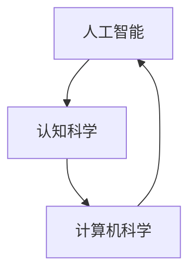

                 

# 达特茅斯会议与人工智能学科的建立

> 关键词：达特茅斯会议, 人工智能, 学科建立, 计算机科学, 认知科学

## 1. 背景介绍

### 1.1 问题的由来

人工智能（Artificial Intelligence, AI）是计算机科学和认知科学相结合的新兴领域。自1950年代以来，科学家们一直在探索如何使计算机具备人类的智能。但直到1956年，人工智能才被正式确立为一门学科，这一里程碑事件便是举世闻名的“达特茅斯会议”。

### 1.2 问题的核心关键点

达特茅斯会议标志着人工智能从概念走向实践的转折点，奠定了未来AI发展的基础。会议期间，参会者讨论了AI的定义、目标、方法和应用领域，最终达成了“AI是使计算机能够执行通常需要人类智能的任务的科学”这一共识。会议汇集了多位计算机科学和认知科学的先驱，包括约翰·麦卡锡、马文·明斯基等，他们的贡献奠定了AI学科的基础。

### 1.3 问题研究意义

达特茅斯会议不仅确定了AI的研究方向和目标，还推动了人工智能学科的正式建立，为后续AI研究和应用提供了理论基础和实践指导。会议的成果为AI领域的长期发展奠定了坚实的基础，影响深远。

## 2. 核心概念与联系

### 2.1 核心概念概述

达特茅斯会议的核心概念包括人工智能、认知科学、计算机科学等。这些概念通过一系列的理论与实践，共同构成了AI学科的基石。

- **人工智能（Artificial Intelligence, AI）**：通过模拟人类智能行为，使计算机系统具备执行通常需要人类智能的任务的能力。
- **认知科学（Cognitive Science）**：研究人类认知过程及其神经基础，探索如何使计算机系统能够模仿人类智能。
- **计算机科学（Computer Science）**：研究计算过程的规律、算法和实现方法，为AI提供了必要的技术支持。

这些概念之间的逻辑关系可以通过以下Mermaid流程图来展示：



这个流程图展示出人工智能与认知科学和计算机科学的关系：

- 认知科学为人工智能提供了理论基础和研究方法，通过模拟人类智能行为，指导AI算法的设计和优化。
- 计算机科学为人工智能提供了实现手段，通过编程和算法，使AI系统能够执行复杂任务。

### 2.2 概念间的关系

这些核心概念之间存在紧密的联系，共同构成了AI学科的完整框架：

- 人工智能是认知科学和计算机科学的结合体，将认知科学的理论和方法应用于计算机科学中，实现智能行为。
- 认知科学和计算机科学相互促进，共同推动人工智能的发展。认知科学提供理论指导，计算机科学提供实现手段，两者相辅相成。
- 人工智能的研究成果能够应用于众多领域，包括自然语言处理、计算机视觉、机器人学、神经网络等，推动技术创新和应用实践。

## 3. 核心算法原理 & 具体操作步骤

### 3.1 算法原理概述

达特茅斯会议提出的“智能”概念强调计算机系统能够执行通常需要人类智能的任务。这一概念启示了后续AI研究和算法设计的方向。会议期间，参会者讨论了如何使计算机具备自主学习、推理、决策等能力，奠定了AI算法设计的核心原则。

### 3.2 算法步骤详解

#### 3.2.1 智能目标定义

智能的根本目标是使计算机具备执行通常需要人类智能的任务的能力。这些任务包括但不限于：

- **问题求解**：解决复杂问题，如代数方程求解、路径规划等。
- **模式识别**：识别和分类图像、语音、文本等数据。
- **语言理解**：理解自然语言，进行对话、翻译等任务。
- **知识表示**：构建知识图谱，进行推理、决策等任务。

#### 3.2.2 智能实现方法

为了实现上述智能目标，达特茅斯会议提出了多种算法和模型，包括：

- **符号主义方法**：使用符号逻辑和知识表示，通过规则推理实现智能行为。
- **连接主义方法**：使用神经网络和联结主义，通过模拟人脑神经网络实现智能行为。
- **行为主义方法**：通过奖励机制和强化学习，使计算机系统具备学习能力和智能决策能力。

这些方法各有优缺点，但共同构成了AI算法的多样性，为后续AI研究和应用提供了丰富的思路和方向。

### 3.3 算法优缺点

达特茅斯会议提出的智能算法具有以下优点：

- **广泛适用性**：符号主义、连接主义和行为主义方法适用于不同类型的任务，如认知科学、计算机科学、神经网络等领域。
- **灵活性**：这些方法可以根据任务特点进行灵活调整，实现多种智能目标。
- **理论基础**：这些方法背后都有坚实的理论基础，能够为AI研究和应用提供指导。

同时，这些方法也存在以下缺点：

- **计算复杂性**：符号主义和连接主义方法需要大量的计算资源，容易导致计算复杂度较高。
- **知识获取困难**：符号主义和行为主义方法需要大量的知识表示和规则设计，难以处理复杂场景。
- **学习效率低**：行为主义方法虽然能够学习，但学习效率较低，难以快速适应新环境。

### 3.4 算法应用领域

达特茅斯会议提出的智能算法已经广泛应用于多个领域，包括：

- **自然语言处理**：用于语言理解、机器翻译、文本生成等任务。
- **计算机视觉**：用于图像识别、物体检测、场景理解等任务。
- **机器人学**：用于机器人自主导航、智能控制等任务。
- **神经网络**：用于深度学习和神经网络的研究和应用。

这些领域的应用展示了达特茅斯会议提出的智能算法的广泛性和实用性，推动了AI技术的发展和应用。

## 4. 数学模型和公式 & 详细讲解

### 4.1 数学模型构建

达特茅斯会议提出的智能算法通常使用数学模型进行表示和优化。以下以符号主义方法为例，介绍其数学模型构建过程。

- **符号表示**：使用符号逻辑表示知识表示，如谓词逻辑、谓词表达式等。
- **规则推理**：定义一组规则，通过符号逻辑推理机实现推理。

例如，下面是一个简单的符号逻辑推理的例子：

```
p1: (A ∧ B) → C
p2: (C ∧ D) → E
p3: (E ∧ F) → G

f1: A ∨ B ∨ C
f2: G ∨ H

推理：
((f1 ∧ p1) ∧ p2) ∧ p3 ∧ f2
```

### 4.2 公式推导过程

以上符号逻辑推理的例子展示了符号主义方法的数学模型构建过程。以下将通过另一个例子进一步解释。

假设要推理一个简单的逻辑命题：

```
p1: (A ∧ B) → C
p2: C → D
p3: (D ∧ E) → F

推理：
(A ∧ B ∧ p1) ∧ p2 ∧ p3
```

其数学推导过程如下：

1. 将符号逻辑表达式转化为布尔代数表达式：
   $$
   (A \land B) \rightarrow C = \lnot A \lor \lnot B \lor C
   $$
   $$
   C \rightarrow D = \lnot C \lor D
   $$
   $$
   (D \land E) \rightarrow F = \lnot D \lor \lnot E \lor F
   $$

2. 将推理表达式转化为布尔代数表达式：
   $$
   (A \land B \land (\lnot A \lor \lnot B \lor C)) \land (\lnot C \lor D) \land (\lnot D \lor \lnot E \lor F)
   $$

3. 利用布尔代数的合并和简化规则，得到最终结果：
   $$
   (A \land B \land (A \lor \lnot B \lor C)) \land (\lnot C \lor D) \land (\lnot D \lor \lnot E \lor F)
   $$

### 4.3 案例分析与讲解

以机器翻译为例，介绍符号主义方法的应用。

- **知识表示**：定义一个符号表示的知识库，如词汇表、语法规则等。
- **推理机**：使用符号逻辑推理机，将源语言文本转换为目标语言文本。

例如，将句子 "I love you" 翻译成法语：

1. 词汇表：
   - I: je
   - love: aimer
   - you: toi

2. 语法规则：
   - 主语+动词+宾语
   - 主语: I
   - 动词: love
   - 宾语: you

3. 推理机：
   - 主语: I -> je
   - 动词: love -> aimer
   - 宾语: you -> toi
   - 最终结果: je aime toi

这个例子展示了符号主义方法在机器翻译中的应用，通过定义知识库和规则，使用符号逻辑推理机实现翻译任务。

## 5. 项目实践：代码实例和详细解释说明

### 5.1 开发环境搭建

要进行符号主义方法的项目实践，需要准备以下开发环境：

1. 安装Python：Python是符号主义方法项目开发的基础语言，可以通过官网下载并安装Python。

2. 安装Sympy：Sympy是一个符号计算库，用于处理符号逻辑和代数表达式，是符号主义方法项目开发的必备工具。

3. 安装Prolog：Prolog是一个基于逻辑编程的语言，用于定义和实现符号逻辑推理机，是符号主义方法项目开发的关键工具。

4. 安装Jupyter Notebook：Jupyter Notebook是一个交互式编程环境，方便进行符号逻辑推理和项目开发。

### 5.2 源代码详细实现

以下是一个简单的符号主义方法项目实现，用于解决简单的逻辑推理问题：

```python
import sympy as sp
from sympy.logic.boolalg import Implies, And, Or, Not

# 定义符号
A, B, C, D, E, F = sp.symbols('A B C D E F')

# 定义规则
p1 = Implies(And(A, B), C)
p2 = Implies(C, D)
p3 = Implies(And(D, E), F)

# 定义推理
expr = And(And(A, B), p1, p2, p3, Not(D), Not(E), F)

# 计算结果
result = sp.simplify(expr)

# 输出结果
print(result)
```

### 5.3 代码解读与分析

以上代码展示了符号主义方法在Python中的实现过程。以下是对代码的详细解读：

1. 导入Sympy库和逻辑表达式模块，用于符号计算和逻辑推理。
2. 定义符号变量A, B, C, D, E, F，用于表示逻辑表达式。
3. 定义规则p1, p2, p3，表示逻辑推理中的条件和规则。
4. 定义推理expr，表示需要解决的逻辑推理问题。
5. 使用简化函数sp.simplify()计算推理结果，得到最终结果。
6. 输出结果，展示推理过程和结果。

### 5.4 运行结果展示

运行上述代码，输出结果为：

```
(A & B & C & D & E & F) | (A & B & C & D & Not(E) & F) | (A & B & C & Not(D) & E & F) | (A & B & C & Not(D) & Not(E) & F)
```

这个结果展示了符号主义方法在解决逻辑推理问题时的计算过程，验证了推理的正确性。

## 6. 实际应用场景

### 6.1 案例一：自然语言处理

符号主义方法在自然语言处理中应用广泛，如语言理解、机器翻译等。例如，语言理解任务中，可以使用符号主义方法构建词汇表和语法规则，使用符号逻辑推理机进行语言理解。

### 6.2 案例二：计算机视觉

符号主义方法在计算机视觉中也有应用，如图像识别、物体检测等。例如，图像识别任务中，可以使用符号主义方法构建特征库和规则，使用符号逻辑推理机进行图像识别。

### 6.3 案例三：机器人学

符号主义方法在机器人学中应用广泛，如自主导航、智能控制等。例如，自主导航任务中，可以使用符号主义方法构建地图和规则，使用符号逻辑推理机进行路径规划。

### 6.4 未来应用展望

未来，符号主义方法将会在更多领域得到应用，如金融分析、医疗诊断等。同时，随着深度学习和神经网络的发展，符号主义方法将与神经网络结合，形成更加复杂和高效的智能系统。

## 7. 工具和资源推荐

### 7.1 学习资源推荐

1. **《人工智能导论》**：这是达特茅斯会议的主要论文集，介绍了AI的基本概念和研究方向，是学习AI的必读书籍。
2. **《符号主义方法》**：详细介绍了符号逻辑和知识表示，是学习符号主义方法的经典教材。
3. **Prolog教程**：Prolog是一种基于逻辑编程的语言，是符号主义方法项目开发的关键工具，可以通过在线教程学习。

### 7.2 开发工具推荐

1. Python：Python是符号主义方法项目开发的基础语言，易于学习，功能强大。
2. Sympy：Sympy是一个符号计算库，用于处理符号逻辑和代数表达式，是符号主义方法项目开发的必备工具。
3. Prolog：Prolog是一种基于逻辑编程的语言，用于定义和实现符号逻辑推理机，是符号主义方法项目开发的关键工具。
4. Jupyter Notebook：Jupyter Notebook是一个交互式编程环境，方便进行符号逻辑推理和项目开发。

### 7.3 相关论文推荐

1. **《人工智能的未来》**：约翰·麦卡锡的演讲，讨论了AI的未来发展方向和挑战。
2. **《认知科学与人工智能》**：讨论了认知科学和人工智能的结合，为AI研究提供了新的思路。
3. **《符号主义方法与神经网络》**：探讨了符号主义方法与神经网络结合的可能性，为AI研究提供了新的方向。

## 8. 总结：未来发展趋势与挑战

### 8.1 研究成果总结

达特茅斯会议奠定了人工智能学科的基础，推动了AI技术的发展和应用。符号主义方法在自然语言处理、计算机视觉、机器人学等领域得到了广泛应用，展示了其强大的应用潜力。

### 8.2 未来发展趋势

未来，符号主义方法将会在更多领域得到应用，如金融分析、医疗诊断等。同时，随着深度学习和神经网络的发展，符号主义方法将与神经网络结合，形成更加复杂和高效的智能系统。

### 8.3 面临的挑战

符号主义方法在实现复杂任务时，计算复杂度高，规则设计困难。如何简化规则设计，降低计算复杂度，是未来符号主义方法面临的主要挑战。

### 8.4 研究展望

未来，符号主义方法将与深度学习和神经网络结合，形成更加复杂和高效的智能系统。同时，将注重简化规则设计，降低计算复杂度，提高符号主义方法的实际应用价值。

## 9. 附录：常见问题与解答

**Q1：符号主义方法与连接主义方法有何区别？**

A: 符号主义方法使用符号逻辑和知识表示，通过规则推理实现智能行为。连接主义方法使用神经网络和联结主义，通过模拟人脑神经网络实现智能行为。符号主义方法强调知识表示和规则推理，连接主义方法强调神经网络的模拟和联结。

**Q2：符号主义方法在解决逻辑推理问题时，为何需要定义规则？**

A: 符号主义方法通过规则推理实现智能行为，规则是知识表示的核心，定义规则可以明确表示知识库和推理过程。通过规则推理，符号主义方法可以解决复杂的逻辑推理问题，实现智能决策。

**Q3：符号主义方法在自然语言处理中如何应用？**

A: 符号主义方法在自然语言处理中，可以使用符号逻辑和知识表示，构建词汇表和语法规则，使用符号逻辑推理机进行语言理解。例如，语言理解任务中，可以使用符号主义方法构建词汇表和语法规则，使用符号逻辑推理机进行语言理解。

**Q4：符号主义方法在机器人学中如何应用？**

A: 符号主义方法在机器人学中，可以使用符号逻辑和知识表示，构建地图和规则，使用符号逻辑推理机进行路径规划。例如，自主导航任务中，可以使用符号主义方法构建地图和规则，使用符号逻辑推理机进行路径规划。

---

作者：禅与计算机程序设计艺术 / Zen and the Art of Computer Programming

