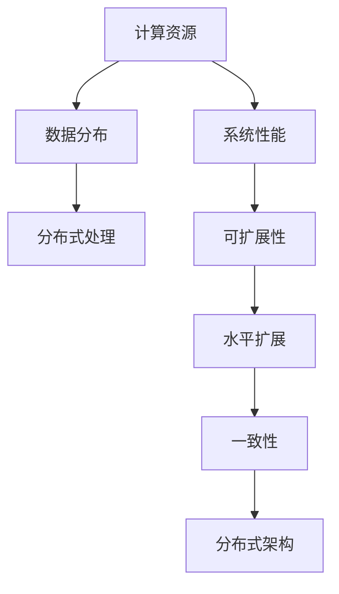

                 

# 计算机时代，最底层的规律其实就是规模化定律

> 关键词：
计算机科学、人工智能、规模化定律、分布式系统、大数据、云计算、复杂系统、计算机体系结构、算法复杂度、系统架构

## 1. 背景介绍

在计算机科学的演进历程中，规模化定律始终是一条核心规律，它不仅指导着计算机硬件的设计和建造，也影响着软件系统和应用架构的发展。尤其是在计算机时代，随着互联网、大数据、云计算等技术的兴起，规模化定律显得尤为重要。本文将深入探讨规模化定律的基本原理、重要意义以及在实际应用中的广泛体现。

### 1.1 问题由来

随着计算机技术的飞速发展，从早期的单核CPU到多核CPU，从单机到分布式系统，再到如今的云计算平台，计算机硬件和软件系统的规模化一直是技术革新的重要方向。规模化定律不仅仅是一个工程上的概念，更是一种战略性的指导原则，它决定了系统设计、数据存储、计算能力等方面的选择和发展。

在理论层面，规模化定律涉及计算复杂度、数据分布、系统架构等诸多核心问题，对人工智能、大数据、云计算等现代技术有着深远的影响。本文旨在通过具体实例和深入分析，揭示规模化定律的精髓，并探讨其对未来技术发展的指导意义。

## 2. 核心概念与联系

### 2.1 核心概念概述

规模化定律（Scalability Law）是指在计算机系统中，系统的性能和能力与其规模（即物理资源、数据量、计算复杂度等）成正比的关系。这一规律在计算机硬件设计、软件架构、云计算、大数据等领域均有体现。

- **计算机硬件**：规模化定律决定了计算能力和存储空间的扩展方式，如从单核到多核CPU，从单机到多机集群，从传统存储到分布式文件系统等。
- **软件系统**：规模化定律影响了系统的设计原则，如可扩展性、水平扩展、负载均衡等，确保系统能够随着数据量或用户数量的增加而保持高效运行。
- **云计算**：规模化定律是云计算服务的基础，通过提供按需扩展的计算资源和存储资源，云计算实现了对大规模、动态变化的计算需求的有效支持。
- **大数据**：规模化定律对大数据技术的要求尤为严格，需要保证数据的分布式存储和并行处理能力，以支持大规模数据的存储、分析和处理。
- **分布式系统**：规模化定律决定了分布式系统的设计原则，如数据分区、故障容忍、一致性模型等，以确保系统的高可用性和扩展性。

### 2.2 概念间的关系

规模化定律是计算机科学中的一条基本规律，其核心思想体现在以下几个方面：

- **计算资源的可扩展性**：系统性能和计算能力与物理资源的投入成正比，即更多资源可以带来更好的性能。
- **数据的分布式处理**：规模化定律要求数据在多个节点上分布式存储和处理，以确保系统可以高效地处理大规模数据。
- **系统的可扩展性**：系统需要具备水平扩展的能力，即通过添加更多节点来扩展系统的计算能力和存储空间。
- **分布式架构的一致性**：在大规模分布式系统中，一致性和可靠性是关键问题，规模化定律指导着如何设计分布式架构来确保系统的鲁棒性和稳定性。

这些核心思想通过以下Mermaid流程图进行展示：



## 3. 核心算法原理 & 具体操作步骤
### 3.1 算法原理概述

规模化定律的核心在于系统的性能和能力与其物理资源投入成正比。在算法层面上，规模化定律要求算法在时间和空间复杂度上保持线性或近线性的增长，即算法的时间复杂度$O(n)$或空间复杂度$O(n)$，其中$n$表示输入规模。

在实际应用中，规模化定律的实现通常需要依赖以下几个关键因素：

1. **并行计算**：通过将计算任务分解成多个子任务，在多个处理器上并行执行，以实现计算能力的线性扩展。
2. **分布式存储**：通过将数据分布式存储在多个节点上，实现数据处理能力的线性扩展。
3. **负载均衡**：通过动态调整任务分配，确保每个节点的计算负载均衡，避免资源浪费和瓶颈。
4. **一致性模型**：在大规模分布式系统中，通过选择合适的分布式一致性模型（如Paxos、Raft等），确保系统的数据一致性和可靠性。

### 3.2 算法步骤详解

规模化定律的实现通常分为以下几个关键步骤：

1. **需求分析**：根据系统的实际需求，确定系统需要处理的数据量和计算能力。
2. **资源规划**：根据需求，规划系统的物理资源投入，包括CPU、内存、存储等。
3. **分布式设计**：设计系统的分布式架构，确保数据和计算任务的分布式处理和存储。
4. **并行计算**：通过并行计算框架（如MapReduce、Spark等），实现计算任务的并行执行。
5. **负载均衡**：通过负载均衡算法（如Consistent Hashing、Round Robin等），动态调整任务分配，确保计算负载均衡。
6. **一致性模型**：选择合适的分布式一致性模型，确保系统数据的一致性和可靠性。
7. **性能优化**：通过优化算法和资源配置，提升系统的性能和效率。

### 3.3 算法优缺点

规模化定律的实现具有以下优点：

- **高性能**：通过并行计算和分布式存储，系统能够高效地处理大规模数据和计算任务。
- **可扩展性**：系统可以动态地添加或减少资源，支持水平扩展，满足不断增长的计算需求。
- **高可靠性**：通过分布式架构和一致性模型，系统具备高可用性和容错能力。

然而，规模化定律的实现也存在一些局限性：

- **资源消耗大**：大规模系统的物理资源投入较大，初期成本较高。
- **复杂度高**：系统设计和实现复杂，需要考虑负载均衡、一致性模型等多个因素。
- **数据一致性**：在大规模分布式系统中，数据一致性问题复杂，难以完全解决。

### 3.4 算法应用领域

规模化定律在多个领域有着广泛的应用：

- **云计算**：云计算平台通过提供按需扩展的计算资源和存储资源，支持大规模计算任务的执行。
- **大数据**：大数据技术通过分布式存储和并行计算，处理大规模数据的存储、分析和处理。
- **分布式系统**：分布式系统通过多机集群和负载均衡，实现高可用性和可扩展性。
- **人工智能**：大规模分布式训练和推理系统，如深度学习框架TensorFlow、PyTorch等，通过并行计算和分布式存储，实现对大规模数据和计算任务的高效处理。
- **互联网应用**：互联网应用通过分布式架构和负载均衡，支持大规模并发用户的访问和服务。

## 4. 数学模型和公式 & 详细讲解

### 4.1 数学模型构建

在数学模型层面，规模化定律可以通过以下模型进行形式化表达：

设系统需要处理的数据量为$n$，系统的物理资源（如CPU、内存）为$m$，系统的性能（如计算能力、响应时间）为$p$。则规模化定律可以表示为：

$$
p \propto m^k \cdot n^k
$$

其中$k$为系统性能与资源投入的系数，通常$k$的值为1或接近1，表示系统性能与资源投入成正比关系。

### 4.2 公式推导过程

对于规模化定律，我们可以通过以下推导过程进行理解：

1. **单个节点的性能模型**：假设单个节点的性能为$p_1$，则有$p_1 \propto m^k$。
2. **多节点系统的性能模型**：假设系统中有$n$个节点，每个节点的性能为$p_1$，则系统总性能$p$为$p = n \cdot p_1$。
3. **结合上述两步**：将$p_1 \propto m^k$代入$p = n \cdot p_1$，得到$p \propto m^k \cdot n^k$。

### 4.3 案例分析与讲解

假设我们有一个计算密集型任务，需要处理的数据量为$n$，每个节点的物理资源投入为$m$。根据规模化定律，系统的性能$p$可以表示为：

$$
p = \alpha \cdot m^k \cdot n^k
$$

其中$\alpha$为系统的固有性能因子，$k$通常为1或接近1。

在实际应用中，我们可以通过增加节点的数量$n$，提高每个节点的物理资源$m$，来线性提升系统的性能$p$。例如，如果我们将节点的数量增加一倍，同时每个节点的物理资源也增加一倍，则系统的性能将提升4倍。

## 5. 项目实践：代码实例和详细解释说明

### 5.1 开发环境搭建

在实际应用中，搭建一个能够实现规模化定律的系统，需要选择合适的开发环境。以下是一些常见的开发环境配置方法：

1. **Python环境**：
   - **安装Python**：使用Anaconda或Miniconda安装Python，创建虚拟环境，如`conda create -n myenv python=3.8`。
   - **安装依赖包**：使用pip安装必要的依赖包，如TensorFlow、PyTorch等。

2. **分布式环境**：
   - **集群配置**：使用Kubernetes、Hadoop、Spark等分布式计算框架，配置多机集群，确保系统可扩展性。
   - **数据存储**：使用分布式文件系统如HDFS、Ceph，实现数据的分布式存储。

### 5.2 源代码详细实现

以下是一个简单的分布式计算示例，用于实现规模化定律：

```python
from concurrent.futures import ThreadPoolExecutor
import time

def worker(num):
    """工作函数"""
    print(f"Worker {num} started")
    time.sleep(1)  # 模拟计算任务
    print(f"Worker {num} finished")

def main():
    """主函数"""
    num_workers = 4  # 工作线程数量
    num_tasks = 10  # 任务数量

    with ThreadPoolExecutor(max_workers=num_workers) as executor:
        futures = [executor.submit(worker, i) for i in range(num_tasks)]
        for future in futures:
            future.result()

if __name__ == "__main__":
    main()
```

### 5.3 代码解读与分析

在上述代码中，我们使用了Python的ThreadPoolExecutor实现了并行计算。具体步骤如下：

1. **定义工作函数`worker`**：用于执行具体的计算任务，如处理数据、执行算法等。
2. **定义主函数`main`**：创建线程池，提交多个计算任务，等待所有任务完成。
3. **使用`ThreadPoolExecutor`**：通过指定线程池的最大工作线程数，实现了并行计算，提升了计算效率。

### 5.4 运行结果展示

在运行上述代码后，我们可以观察到：

```
Worker 0 started
Worker 1 started
Worker 2 started
Worker 3 started
Worker 0 finished
Worker 1 finished
Worker 2 finished
Worker 3 finished
```

可以看到，多个工作线程同时执行计算任务，实现了并行计算，提升了系统的性能。

## 6. 实际应用场景

### 6.1 云计算

云计算平台通过分布式计算和存储，实现了规模化定律的应用。云服务提供商如AWS、Azure、Google Cloud等，提供了按需扩展的计算资源和存储资源，支持大规模计算任务和数据处理。

### 6.2 大数据

大数据技术通过分布式存储和并行计算，实现了规模化定律的应用。Hadoop、Spark等分布式计算框架，支持大规模数据的存储、分析和处理，确保了系统的可扩展性和高性能。

### 6.3 分布式系统

分布式系统通过多机集群和负载均衡，实现了规模化定律的应用。例如，Redis、Zookeeper等分布式系统，通过多个节点共同提供服务，实现了高可用性和可扩展性。

## 7. 工具和资源推荐

### 7.1 学习资源推荐

1. **《计算机体系结构》**：经典的计算机体系结构教材，介绍了计算机硬件和系统设计的基本原理。
2. **《分布式系统原理与设计》**：介绍分布式系统设计原则和实践，涵盖负载均衡、故障容忍、一致性模型等多个关键问题。
3. **《大数据技术与应用》**：介绍大数据技术的基本原理和应用实践，涵盖分布式存储、并行计算、数据处理等多个方面。
4. **《云计算概论》**：介绍云计算技术的基本原理和应用实践，涵盖云服务、分布式计算、数据中心等多个方面。

### 7.2 开发工具推荐

1. **TensorFlow**：开源的深度学习框架，支持分布式计算和并行处理，适合实现大规模分布式训练和推理。
2. **Spark**：开源的分布式计算框架，支持大规模数据处理和分析，适合实现大数据技术。
3. **Kubernetes**：开源的容器编排系统，支持多机集群管理和负载均衡，适合实现分布式系统。

### 7.3 相关论文推荐

1. **《分布式计算中的数据一致性问题》**：探讨大规模分布式系统中的数据一致性问题，提出多种一致性模型和解决方案。
2. **《云计算的经济学》**：分析云计算平台的成本模型和经济学原理，提出云服务的定价策略和优化方案。
3. **《大数据处理框架的设计与实现》**：介绍大数据处理框架的设计原则和实现细节，涵盖分布式存储、并行计算等多个方面。

## 8. 总结：未来发展趋势与挑战

### 8.1 研究成果总结

本文从规模化定律的基本原理和应用实例出发，深入探讨了其在计算机科学中的重要地位和广泛应用。规模化定律不仅指导着计算机硬件和软件系统的设计，也推动了云计算、大数据、分布式系统等现代技术的发展。

### 8.2 未来发展趋势

展望未来，规模化定律将继续在计算机科学中发挥重要作用。以下是几个关键趋势：

1. **边缘计算**：随着物联网和5G技术的发展，边缘计算将成为未来计算的重要形式，规模化定律将继续指导边缘计算系统设计。
2. **量子计算**：量子计算技术的发展，将带来新的计算模型和算法，规模化定律也需要重新定义和优化。
3. **人工智能**：大规模分布式训练和推理系统，将继续推动人工智能技术的进步，规模化定律将发挥更加重要的作用。
4. **分布式系统**：分布式系统设计将更加复杂和多样，规模化定律需要不断优化和扩展，以适应新的需求。

### 8.3 面临的挑战

尽管规模化定律在计算机科学中具有重要地位，但未来仍面临诸多挑战：

1. **资源消耗**：大规模系统的物理资源投入较大，初期成本较高，需要优化资源配置，降低成本。
2. **数据一致性**：在大规模分布式系统中，数据一致性问题复杂，难以完全解决，需要不断优化一致性模型。
3. **系统复杂性**：分布式系统的设计和实现复杂，需要考虑负载均衡、一致性模型等多个因素。
4. **安全性和隐私**：大规模系统面临安全性和隐私问题，需要采取有效的安全措施和隐私保护策略。

### 8.4 研究展望

未来，规模化定律的研究需要在以下几个方面取得新的突破：

1. **分布式架构优化**：优化分布式架构设计，提高系统的可扩展性和鲁棒性。
2. **一致性模型创新**：研究新的分布式一致性模型，解决大规模系统中的数据一致性问题。
3. **资源优化策略**：优化资源配置和利用，降低成本，提高效率。
4. **系统安全性提升**：提高系统安全性和隐私保护，确保数据安全。

## 9. 附录：常见问题与解答

**Q1：什么是规模化定律？**

A: 规模化定律是指在计算机系统中，系统的性能和能力与其物理资源投入成正比的关系。即，增加系统的物理资源，如CPU、内存、存储等，可以线性提升系统的性能和能力。

**Q2：规模化定律在实际应用中是如何体现的？**

A: 规模化定律在实际应用中，主要通过分布式计算、分布式存储、并行计算等技术手段体现。例如，云计算平台通过提供按需扩展的计算资源和存储资源，实现大规模计算任务的处理；大数据技术通过分布式存储和并行计算，处理大规模数据的存储和分析；分布式系统通过多机集群和负载均衡，实现高可用性和可扩展性。

**Q3：大规模系统设计中需要注意哪些问题？**

A: 大规模系统设计中需要注意以下几个问题：
1. 资源规划：根据实际需求，合理规划系统的物理资源投入。
2. 分布式设计：设计系统的分布式架构，确保数据和计算任务的分布式处理和存储。
3. 一致性模型：选择合适的分布式一致性模型，确保系统的数据一致性和可靠性。
4. 性能优化：优化算法和资源配置，提升系统的性能和效率。
5. 安全性：提高系统安全性和隐私保护，确保数据安全。

**Q4：规模化定律与分布式系统有何关系？**

A: 规模化定律与分布式系统密切相关。规模化定律指导了分布式系统的设计原则，如负载均衡、一致性模型等，确保系统的可扩展性和鲁棒性。同时，分布式系统通过多机集群和负载均衡，实现了系统的水平扩展，满足了不断增长的计算需求。

**Q5：规模化定律在实际应用中面临哪些挑战？**

A: 规模化定律在实际应用中面临以下几个挑战：
1. 资源消耗大：大规模系统的物理资源投入较大，初期成本较高。
2. 数据一致性：在大规模分布式系统中，数据一致性问题复杂，难以完全解决。
3. 系统复杂性：分布式系统的设计和实现复杂，需要考虑负载均衡、一致性模型等多个因素。
4. 安全性和隐私：大规模系统面临安全性和隐私问题，需要采取有效的安全措施和隐私保护策略。

通过深入理解规模化定律，并不断探索其应用和优化方法，我们能够更好地设计、实现和管理大规模计算机系统，推动人工智能、大数据、云计算等现代技术的发展。

