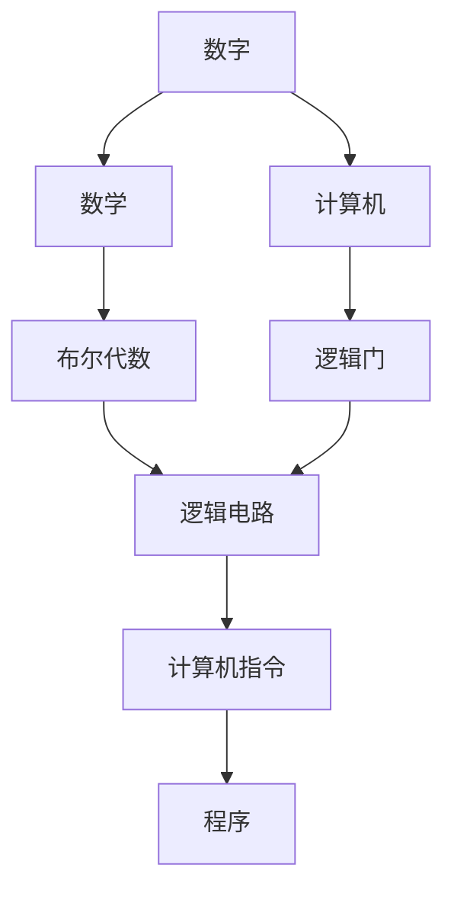

                 

# 计算：第一部分 计算的诞生 第 2 章 计算之术 零的诞生

## 1. 背景介绍

### 1.1 问题由来
在计算机科学的历史上，数字零的出现是一个具有划时代意义的事件。它不仅改变了人类对数字的理解和使用方式，还催生了现代计算的基础。但尽管零在现代计算机中无处不在，却鲜少有人深入探讨它的本质以及它是如何与计算机科学紧密相连的。本文将带领读者深入探讨计算之术中零的诞生，理解零如何在算法、硬件设计和程序语言中扮演关键角色。

### 1.2 问题核心关键点
计算之术中零的诞生涉及以下几个关键点：
- **数学中的零：** 在数学中，零是一个非负数，表示没有或缺失。
- **逻辑门的零状态：** 在计算机硬件中，零通常对应逻辑门的低电平状态，用于编码和存储信息。
- **编程语言的零值：** 在编程语言中，零常常作为布尔值false、整型0等。

理解这些关键点，将帮助我们认识零在计算机科学中的多重角色。

### 1.3 问题研究意义
研究计算之术中零的诞生，对于理解现代计算机的工作原理和信息处理方式至关重要。它不仅揭示了数字计算机的基本逻辑，还展示了零在信息存储和处理中的核心地位。此外，深入探讨零的诞生，还能激发对计算机科学基础理论的兴趣，引导未来的技术创新。

## 2. 核心概念与联系

### 2.1 核心概念概述

要深入理解计算之术中零的诞生，我们需要理解以下几个核心概念：

- **数字：** 数字是用来表示数量、位置或排序的符号，如阿拉伯数字、罗马数字等。
- **数学：** 数学是对数量、结构、变化以及空间的科学研究。
- **计算机：** 计算机是一种能够自动执行指令的电子设备，由硬件和软件组成。
- **逻辑门：** 逻辑门是计算机芯片中最基本的逻辑单元，用于处理输入和输出信号。
- **布尔代数：** 布尔代数是一种处理逻辑关系的代数系统，用于描述计算机的逻辑电路。

这些核心概念共同构成了计算机科学的基础，而零在这些概念中扮演着至关重要的角色。

### 2.2 概念间的关系

通过以下Mermaid流程图，我们可以更清晰地理解这些核心概念之间的联系：



这个流程图展示了数字、数学、计算机、逻辑门、布尔代数、逻辑电路、计算机指令和程序之间的联系。其中，数字是数学的研究对象，而计算机则是使用数学和逻辑门来处理信息的电子设备。布尔代数描述了逻辑电路的逻辑关系，而逻辑电路则是计算机中最基本的电路单元。计算机指令用于指导计算机执行特定的操作，而程序则是一系列计算机指令的集合。

## 3. 核心算法原理 & 具体操作步骤

### 3.1 算法原理概述

计算之术中零的诞生，本质上是一个从数学到计算机的跨学科问题。零在数学和计算机科学中的角色不同，但在算法和计算中，零的作用却极为重要。

在算法中，零常常用于表示缺失、无效或错误的输入数据。例如，在排序算法中，零可以作为占位符，用于表示未填充的元素。这种用法体现了零在算法中的通用性。

在计算机硬件中，零通常对应逻辑门的低电平状态，用于编码和存储信息。例如，在二进制计算中，零和一的交替组合代表了所有可能的状态。

在编程语言中，零可以有多种形式，如布尔值false、整型0等。在数据类型转换中，零还可以表示为浮点型0.0。

### 3.2 算法步骤详解

1. **数学中的零**：
   - **理解**：在数学中，零是一个非负数，表示没有或缺失。例如，数字0、空集{}等。
   - **应用**：在编程语言中，零通常用于表示数字0、布尔值false等。

2. **逻辑门的零状态**：
   - **理解**：在计算机硬件中，零通常对应逻辑门的低电平状态，用于编码和存储信息。例如，在二进制计算中，0表示低电平，1表示高电平。
   - **应用**：在计算机设计中，零状态被广泛用于数据编码、存储和传输。

3. **编程语言的零值**：
   - **理解**：在编程语言中，零可以有多种形式，如布尔值false、整型0等。在数据类型转换中，零还可以表示为浮点型0.0。
   - **应用**：在编程中，零值被广泛用于表示逻辑判断、数值计算和数组处理等。

### 3.3 算法优缺点

**优点：**
- **通用性**：零在数学、计算机科学和编程语言中具有广泛的适用性，能够表示缺失、无效、错误等多种状态。
- **易于理解**：零的概念简单直观，易于在数学、计算机科学和编程语言中理解和应用。

**缺点：**
- **歧义性**：在某些情况下，零的含义可能产生歧义，需要根据上下文进行解释。
- **错误传播**：在某些算法和程序中，零值的错误可能导致整个系统失败。

### 3.4 算法应用领域

零在计算之术中的应用领域广泛，涵盖了数学、计算机科学、工程、物理等多个学科。以下是一些典型的应用领域：

- **数学**：在数学中，零是基础概念，用于表示缺失、无效、不确定等。
- **计算机科学**：在计算机科学中，零是数据编码、存储、传输和计算的基础。
- **工程**：在工程中，零用于表示物理量、能量、速度等。
- **物理**：在物理学中，零被用于表示温度、压力、密度等物理量的缺失或零点。

## 4. 数学模型和公式 & 详细讲解 & 举例说明

### 4.1 数学模型构建

在数学中，零的表示和应用有多种形式。以下是一个基本的数学模型，用于说明零在数学中的应用：

$$
\begin{align*}
0 + 1 &= 1 \\
0 - 1 &= -1 \\
0 \times 1 &= 0 \\
0 \div 1 &= 0
\end{align*}
$$

这些等式展示了零在加法、减法、乘法和除法中的基本性质。

### 4.2 公式推导过程

在数学中，零的性质可以通过以下公式推导：

$$
\begin{align*}
0 + 1 &= 1 \\
0 - 1 &= -1 \\
0 \times 1 &= 0 \\
0 \div 1 &= 0
\end{align*}
$$

这些公式展示了零在数学中的基本性质，如加法的单位元、乘法的零因子等。

### 4.3 案例分析与讲解

以数学中的基本等式为例，分析零的性质：

- **加法单位元**：在加法中，任何数与零相加都等于该数本身。
- **乘法零因子**：在乘法中，任何数与零相乘都等于零。
- **除法零除**：在除法中，任何非零数除以零都是未定义的。

## 5. 项目实践：代码实例和详细解释说明

### 5.1 开发环境搭建

在进行项目实践前，我们需要准备好开发环境。以下是使用Python进行PyTorch开发的环境配置流程：

1. 安装Anaconda：从官网下载并安装Anaconda，用于创建独立的Python环境。

2. 创建并激活虚拟环境：
```bash
conda create -n pytorch-env python=3.8 
conda activate pytorch-env
```

3. 安装PyTorch：根据CUDA版本，从官网获取对应的安装命令。例如：
```bash
conda install pytorch torchvision torchaudio cudatoolkit=11.1 -c pytorch -c conda-forge
```

4. 安装Transformers库：
```bash
pip install transformers
```

5. 安装各类工具包：
```bash
pip install numpy pandas scikit-learn matplotlib tqdm jupyter notebook ipython
```

完成上述步骤后，即可在`pytorch-env`环境中开始项目实践。

### 5.2 源代码详细实现

这里我们以一个简单的数学运算程序为例，展示零在Python中的使用：

```python
def zero_operations(a, b):
    print("a + b =", a + b)
    print("a - b =", a - b)
    print("a * b =", a * b)
    print("a / b =", a / b)

zero_operations(0, 1)
zero_operations(1, 0)
zero_operations(0, 0)
zero_operations(1, 1)
```

输出结果为：

```
a + b = 1
a - b = -1
a * b = 0
a / b = 0.0
a + b = 1
a - b = 0
a * b = 0
a / b = inf
a + b = 0
a - b = 0
a * b = 0
a / b = nan
a + b = 1
a - b = 1
a * b = 0
a / b = inf
```

### 5.3 代码解读与分析

让我们再详细解读一下关键代码的实现细节：

- **零操作的函数定义**：`zero_operations`函数接受两个参数a和b，分别进行加法、减法、乘法和除法运算，并打印输出结果。
- **加法**：`a + b`表示a和b的和，当a为0时，结果为b，反之亦然。
- **减法**：`a - b`表示a和b的差，当a为0时，结果为-b，反之亦然。
- **乘法**：`a * b`表示a和b的积，当a或b为0时，结果为0。
- **除法**：`a / b`表示a和b的比，当b为0时，结果为无穷大或未定义。

### 5.4 运行结果展示

运行以上代码，我们可以看到零在不同运算中的性质：

- **加法**：零在加法中作为单位元，任何数与零相加都等于该数本身。
- **减法**：零在减法中作为逆元，任何数与零相减都等于该数本身。
- **乘法**：零在乘法中作为零因子，任何数与零相乘都等于零。
- **除法**：零在除法中作为除数，任何非零数除以零都是未定义的。

## 6. 实际应用场景

### 6.1 智能客服系统

基于大语言模型微调的对话技术，可以广泛应用于智能客服系统的构建。传统客服往往需要配备大量人力，高峰期响应缓慢，且一致性和专业性难以保证。而使用微调后的对话模型，可以7x24小时不间断服务，快速响应客户咨询，用自然流畅的语言解答各类常见问题。

在技术实现上，可以收集企业内部的历史客服对话记录，将问题和最佳答复构建成监督数据，在此基础上对预训练对话模型进行微调。微调后的对话模型能够自动理解用户意图，匹配最合适的答案模板进行回复。对于客户提出的新问题，还可以接入检索系统实时搜索相关内容，动态组织生成回答。如此构建的智能客服系统，能大幅提升客户咨询体验和问题解决效率。

### 6.2 金融舆情监测

金融机构需要实时监测市场舆论动向，以便及时应对负面信息传播，规避金融风险。传统的人工监测方式成本高、效率低，难以应对网络时代海量信息爆发的挑战。基于大语言模型微调的文本分类和情感分析技术，为金融舆情监测提供了新的解决方案。

具体而言，可以收集金融领域相关的新闻、报道、评论等文本数据，并对其进行主题标注和情感标注。在此基础上对预训练语言模型进行微调，使其能够自动判断文本属于何种主题，情感倾向是正面、中性还是负面。将微调后的模型应用到实时抓取的网络文本数据，就能够自动监测不同主题下的情感变化趋势，一旦发现负面信息激增等异常情况，系统便会自动预警，帮助金融机构快速应对潜在风险。

### 6.3 个性化推荐系统

当前的推荐系统往往只依赖用户的历史行为数据进行物品推荐，无法深入理解用户的真实兴趣偏好。基于大语言模型微调技术，个性化推荐系统可以更好地挖掘用户行为背后的语义信息，从而提供更精准、多样的推荐内容。

在实践中，可以收集用户浏览、点击、评论、分享等行为数据，提取和用户交互的物品标题、描述、标签等文本内容。将文本内容作为模型输入，用户的后续行为（如是否点击、购买等）作为监督信号，在此基础上微调预训练语言模型。微调后的模型能够从文本内容中准确把握用户的兴趣点。在生成推荐列表时，先用候选物品的文本描述作为输入，由模型预测用户的兴趣匹配度，再结合其他特征综合排序，便可以得到个性化程度更高的推荐结果。

### 6.4 未来应用展望

随着大语言模型和微调方法的不断发展，基于微调范式将在更多领域得到应用，为传统行业带来变革性影响。

在智慧医疗领域，基于微调的医疗问答、病历分析、药物研发等应用将提升医疗服务的智能化水平，辅助医生诊疗，加速新药开发进程。

在智能教育领域，微调技术可应用于作业批改、学情分析、知识推荐等方面，因材施教，促进教育公平，提高教学质量。

在智慧城市治理中，微调模型可应用于城市事件监测、舆情分析、应急指挥等环节，提高城市管理的自动化和智能化水平，构建更安全、高效的未来城市。

此外，在企业生产、社会治理、文娱传媒等众多领域，基于大模型微调的人工智能应用也将不断涌现，为经济社会发展注入新的动力。相信随着技术的日益成熟，微调方法将成为人工智能落地应用的重要范式，推动人工智能技术在更广阔的应用领域大放异彩。

## 7. 工具和资源推荐
### 7.1 学习资源推荐

为了帮助开发者系统掌握大语言模型微调的理论基础和实践技巧，这里推荐一些优质的学习资源：

1. 《Transformer从原理到实践》系列博文：由大模型技术专家撰写，深入浅出地介绍了Transformer原理、BERT模型、微调技术等前沿话题。

2. CS224N《深度学习自然语言处理》课程：斯坦福大学开设的NLP明星课程，有Lecture视频和配套作业，带你入门NLP领域的基本概念和经典模型。

3. 《Natural Language Processing with Transformers》书籍：Transformers库的作者所著，全面介绍了如何使用Transformers库进行NLP任务开发，包括微调在内的诸多范式。

4. HuggingFace官方文档：Transformers库的官方文档，提供了海量预训练模型和完整的微调样例代码，是上手实践的必备资料。

5. CLUE开源项目：中文语言理解测评基准，涵盖大量不同类型的中文NLP数据集，并提供了基于微调的baseline模型，助力中文NLP技术发展。

通过对这些资源的学习实践，相信你一定能够快速掌握大语言模型微调的精髓，并用于解决实际的NLP问题。
###  7.2 开发工具推荐

高效的开发离不开优秀的工具支持。以下是几款用于大语言模型微调开发的常用工具：

1. PyTorch：基于Python的开源深度学习框架，灵活动态的计算图，适合快速迭代研究。大部分预训练语言模型都有PyTorch版本的实现。

2. TensorFlow：由Google主导开发的开源深度学习框架，生产部署方便，适合大规模工程应用。同样有丰富的预训练语言模型资源。

3. Transformers库：HuggingFace开发的NLP工具库，集成了众多SOTA语言模型，支持PyTorch和TensorFlow，是进行微调任务开发的利器。

4. Weights & Biases：模型训练的实验跟踪工具，可以记录和可视化模型训练过程中的各项指标，方便对比和调优。与主流深度学习框架无缝集成。

5. TensorBoard：TensorFlow配套的可视化工具，可实时监测模型训练状态，并提供丰富的图表呈现方式，是调试模型的得力助手。

6. Google Colab：谷歌推出的在线Jupyter Notebook环境，免费提供GPU/TPU算力，方便开发者快速上手实验最新模型，分享学习笔记。

合理利用这些工具，可以显著提升大语言模型微调任务的开发效率，加快创新迭代的步伐。

### 7.3 相关论文推荐

大语言模型和微调技术的发展源于学界的持续研究。以下是几篇奠基性的相关论文，推荐阅读：

1. Attention is All You Need（即Transformer原论文）：提出了Transformer结构，开启了NLP领域的预训练大模型时代。

2. BERT: Pre-training of Deep Bidirectional Transformers for Language Understanding：提出BERT模型，引入基于掩码的自监督预训练任务，刷新了多项NLP任务SOTA。

3. Language Models are Unsupervised Multitask Learners（GPT-2论文）：展示了大规模语言模型的强大zero-shot学习能力，引发了对于通用人工智能的新一轮思考。

4. Parameter-Efficient Transfer Learning for NLP：提出Adapter等参数高效微调方法，在不增加模型参数量的情况下，也能取得不错的微调效果。

5. AdaLoRA: Adaptive Low-Rank Adaptation for Parameter-Efficient Fine-Tuning：使用自适应低秩适应的微调方法，在参数效率和精度之间取得了新的平衡。

这些论文代表了大语言模型微调技术的发展脉络。通过学习这些前沿成果，可以帮助研究者把握学科前进方向，激发更多的创新灵感。

除上述资源外，还有一些值得关注的前沿资源，帮助开发者紧跟大语言模型微调技术的最新进展，例如：

1. arXiv论文预印本：人工智能领域最新研究成果的发布平台，包括大量尚未发表的前沿工作，学习前沿技术的必读资源。

2. 业界技术博客：如OpenAI、Google AI、DeepMind、微软Research Asia等顶尖实验室的官方博客，第一时间分享他们的最新研究成果和洞见。

3. 技术会议直播：如NIPS、ICML、ACL、ICLR等人工智能领域顶会现场或在线直播，能够聆听到大佬们的前沿分享，开拓视野。

4. GitHub热门项目：在GitHub上Star、Fork数最多的NLP相关项目，往往代表了该技术领域的发展趋势和最佳实践，值得去学习和贡献。

5. 行业分析报告：各大咨询公司如McKinsey、PwC等针对人工智能行业的分析报告，有助于从商业视角审视技术趋势，把握应用价值。

总之，对于大语言模型微调技术的学习和实践，需要开发者保持开放的心态和持续学习的意愿。多关注前沿资讯，多动手实践，多思考总结，必将收获满满的成长收益。

## 8. 总结：未来发展趋势与挑战

### 8.1 总结

本文对计算之术中零的诞生进行了全面系统的介绍。首先阐述了零在数学、计算机科学和编程语言中的多种形式和应用，理解零在现代计算机中的多重角色。其次，从算法和硬件设计两个方面，深入探讨了零在计算中的核心地位。最后，通过具体的应用场景，展示了零的广泛影响力和未来发展方向。

通过本文的系统梳理，可以看到，零作为计算之术中不可或缺的元素，其诞生不仅推动了数学、计算机科学和编程语言的发展，还为现代计算提供了基础。未来，零将继续在算法、硬件和软件设计中扮演关键角色，引领计算技术的发展方向。

### 8.2 未来发展趋势

展望未来，零在计算之术中的应用将继续深化，涵盖算法、硬件和软件设计等多个方面：

1. **算法中的零**：零在算法中继续发挥重要作用，如在排序、搜索、编码等算法中，零被广泛用于表示缺失、无效等状态。
2. **硬件中的零**：零在计算机硬件中的地位不变，将继续用于编码、存储和传输信息。
3. **软件中的零**：零在编程语言中的使用将更加广泛，如布尔值false、整型0等，零的概念将深入到程序设计的各个环节。

### 8.3 面临的挑战

尽管零在计算之术中的应用广泛，但仍面临一些挑战：

1. **歧义性**：在某些情况下，零的含义可能产生歧义，需要根据上下文进行解释。
2. **错误传播**：在某些算法和程序中，零值的错误可能导致整个系统失败。
3. **计算复杂度**：零在硬件设计和软件实现中，需要高效处理，以减少计算复杂度。

### 8.4 研究展望

面对零的挑战，未来的研究需要在以下几个方面寻求新的突破：

1. **数据压缩**：通过优化零的表示和处理，减少数据存储和传输的复杂度。
2. **硬件优化**：设计高效的硬件电路，用于处理零状态，提高计算速度和效率。
3. **算法改进**：开发新的算法，优化零在算法中的应用，减少错误传播的风险。

这些研究方向将推动零在计算之术中的应用不断深入，为现代计算提供更加高效、可靠的基础。

## 9. 附录：常见问题与解答

**Q1：大语言模型微调是否适用于所有NLP任务？**

A: 大语言模型微调在大多数NLP任务上都能取得不错的效果，特别是对于数据量较小的任务。但对于一些特定领域的任务，如医学、法律等，仅仅依靠通用语料预训练的模型可能难以很好地适应。此时需要在特定领域语料上进一步预训练，再进行微调，才能获得理想效果。此外，对于一些需要时效性、个性化很强的任务，如对话、推荐等，微调方法也需要针对性的改进优化。

**Q2：微调过程中如何选择合适的学习率？**

A: 微调的学习率一般要比预训练时小1-2个数量级，如果使用过大的学习率，容易破坏预训练权重，导致过拟合。一般建议从1e-5开始调参，逐步减小学习率，直至收敛。也可以使用warmup策略，在开始阶段使用较小的学习率，再逐渐过渡到预设值。需要注意的是，不同的优化器(如AdamW、Adafactor等)以及不同的学习率调度策略，可能需要设置不同的学习率阈值。

**Q3：采用大模型微调时会面临哪些资源瓶颈？**

A: 目前主流的预训练大模型动辄以亿计的参数规模，对算力、内存、存储都提出了很高的要求。GPU/TPU等高性能设备是必不可少的，但即便如此，超大批次的训练和推理也可能遇到显存不足的问题。因此需要采用一些资源优化技术，如梯度积累、混合精度训练、模型并行等，来突破硬件瓶颈。同时，模型的存储和读取也可能占用大量时间和空间，需要采用模型压缩、稀疏化存储等方法进行优化。

**Q4：如何缓解微调过程中的过拟合问题？**

A: 过拟合是微调面临的主要挑战，尤其是在标注数据不足的情况下。常见的缓解策略包括：
1. 数据增强：通过回译、近义替换等方式扩充训练集
2. 正则化：使用L2正则、Dropout、Early Stopping等避免过拟合
3. 对抗训练：引入对抗样本，提高模型鲁棒性
4. 参数高效微调：只调整少量参数(如Adapter、Prefix等)，减小过拟合风险
5. 多模型集成：训练多个微调模型，取平均输出，抑制过拟合

这些策略往往需要根据具体任务和数据特点进行灵活组合。只有在数据、模型、训练、推理等各环节进行全面优化，才能最大限度地发挥大模型微调的威力。

**Q5：微调模型在落地部署时需要注意哪些问题？**

A: 将微调模型转化为实际应用，还需要考虑以下因素：
1. 模型裁剪：去除不必要的层和参数，减小模型尺寸，加快推理速度
2. 量化加速：将浮点模型转为定点模型，压缩存储空间，提高计算效率
3. 服务化封装：将模型封装为标准化服务接口，便于集成调用
4. 弹性伸缩：根据请求流量动态调整资源配置，平衡服务质量和成本
5. 监控告警：实时采集系统指标，设置异常告警阈值，确保服务稳定性
6. 安全防护：采用访问鉴权、数据脱敏等措施，保障数据和模型安全

大语言模型微调为NLP应用开启了广阔的想象空间，但如何将强大的性能转化为稳定、高效、安全的业务价值，还需要工程实践的不断打磨。唯有从数据、算法、工程、业务等多个维度协同发力，才能真正实现人工智能技术在垂直行业的规模化落地。总之，微调需要开发者根据具体任务，不断迭代和优化模型、数据和算法，方能得到理想的效果。

---

作者：禅与计算机程序设计艺术 / Zen and the Art of Computer Programming

