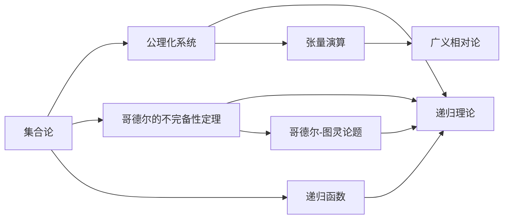
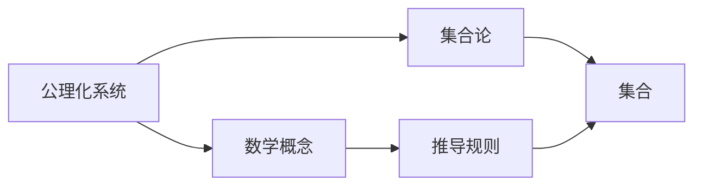
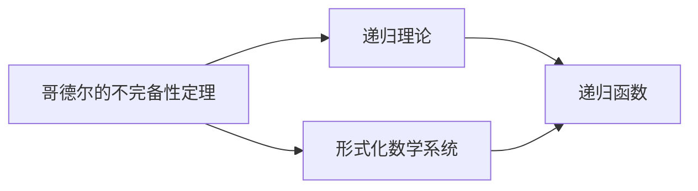
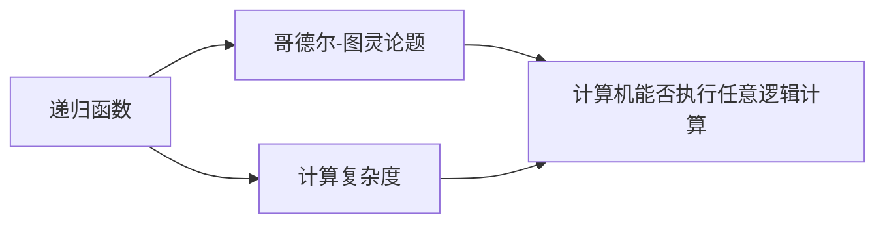
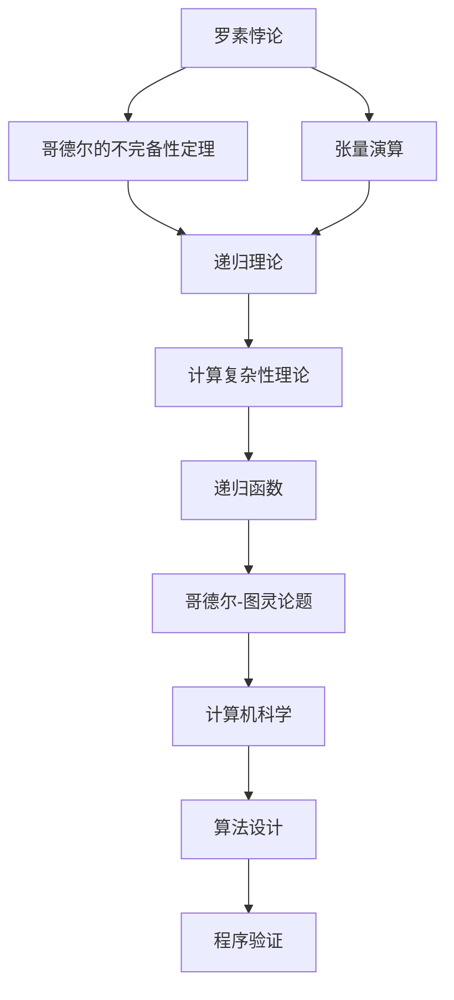

                 

# 计算：第二部分 计算的数学基础 第 5 章 第三次数学危机 悖论的解决方法

## 1. 背景介绍

### 1.1 问题由来

第三次数学危机，又称为罗素悖论危机，起源于1901年英国数学家伯特兰·罗素和美国哲学家阿尔弗雷德·诺斯·怀特海在他们的著作《数学原理》中提出的一个逻辑悖论。这个悖论揭示了经典集合论的一个致命缺陷，引发了数学界的广泛讨论和深刻反思，最终导致数学基础的重大变革。

罗素悖论的基本形式是：设 $S$ 是一个包含所有不包含自身的集合的集合。那么 $S$ 是否包含自身呢？如果包含，则 $S$ 不满足自身的定义；如果不包含，则 $S$ 包含了所有不包含自身的集合，因此 $S$ 应该包含自身。这个看似荒谬的问题直接指出了集合论逻辑上的矛盾。

罗素悖论的提出，不仅震惊了当时的数学界，更引发了对传统数学逻辑基础的广泛怀疑。数学家们开始重新审视集合论，尝试找到新的解决方法。这个过程中，出现了许多重要的理论和思想，奠定了现代数学的基础。

### 1.2 问题核心关键点

罗素悖论揭示了经典集合论逻辑上的矛盾，促使数学家们寻求新的集合理论。这其中，哥德尔的不完备性定理和张量演算理论是最具代表性的突破。

- 哥德尔的不完备性定理：哥德尔证明了任何形式化的公理化数学系统，只要它强到足以表达初等算术，就必然存在某些命题，既不能在这个系统中被证明，也不能被否定。这一发现颠覆了数学家对形式系统的完美性的信念，对现代数学逻辑和计算理论产生了深远影响。

- 张量演算理论：这是爱因斯坦提出的广义相对论的数学基础，它允许使用无穷维的向量空间，为解决罗素悖论提供了新的思路。通过将物理量映射到无穷维空间中，张量演算理论揭示了物理现象的深刻本质，对现代物理学的发展起到了重要作用。

罗素悖论不仅引发了数学基础的重大变革，还对计算理论和计算机科学产生了深远影响。计算机科学家们开始探索如何用形式化的方式表达和处理复杂逻辑问题，推动了计算复杂性理论、递归理论、程序验证等领域的发展。

## 2. 核心概念与联系

### 2.1 核心概念概述

为了更好地理解罗素悖论的解决方法，本节将介绍几个密切相关的核心概念：

- 集合论：研究集合的性质、构造和相互关系的一门数学学科。集合论是现代数学的重要基础，几乎所有数学分支都与之相关。

- 公理化系统：使用一组明确且独立的公理来定义数学概念和进行推导的系统。公理化系统使得数学理论的严谨性和可证明性得到了保证。

- 哥德尔的不完备性定理：任何强到足以表达初等算术的形式化数学系统，都存在不可证明的命题。不完备性定理揭示了形式系统的局限性，促使数学家们寻找新的数学基础。

- 递归理论：研究递归函数的性质、构造和计算复杂度的理论。递归理论是计算复杂性理论的基础，对算法设计和程序验证具有重要意义。

- 递归函数：一类特殊的函数，可以递归地定义自身。递归函数在计算机科学中有着广泛应用，如在编译原理、程序生成等方面。

- 哥德尔-图灵论题：探讨计算机能否执行任意逻辑计算的哲学问题。哥德尔-图灵论题对计算理论和计算机科学的发展产生了重要影响。

- 张量演算：一种将物理量映射到无穷维向量空间中的理论，是广义相对论的数学基础。张量演算理论揭示了物理现象的深刻本质，对现代物理学的发展起到了重要作用。

这些核心概念之间的逻辑关系可以通过以下Mermaid流程图来展示：



这个流程图展示了集合论、公理化系统、哥德尔的不完备性定理、递归理论、递归函数、哥德尔-图灵论题和张量演算之间的逻辑关系：

1. 集合论是公理化系统的基础，用于定义和研究集合的性质。
2. 哥德尔的不完备性定理揭示了形式系统的局限性，促使数学家们寻找新的数学基础。
3. 递归理论是计算复杂性理论的基础，研究递归函数的性质和构造。
4. 递归函数是递归理论的重要组成部分，用于描述和计算计算机能执行的函数。
5. 哥德尔-图灵论题探讨了计算机能否执行任意逻辑计算的哲学问题。
6. 张量演算是广义相对论的数学基础，揭示了物理现象的深刻本质。

这些核心概念共同构成了现代数学和计算理论的基础，推动了科学和技术的发展。

### 2.2 概念间的关系

这些核心概念之间存在着紧密的联系，形成了现代数学和计算理论的完整生态系统。下面我们通过几个Mermaid流程图来展示这些概念之间的关系。

#### 2.2.1 公理化系统与集合论的关系



这个流程图展示了公理化系统与集合论之间的逻辑关系：

1. 公理化系统定义了一组明确且独立的公理和推导规则，用于推导数学概念。
2. 集合论是公理化系统中定义和研究集合的子系统。

#### 2.2.2 哥德尔的不完备性定理与递归理论的关系



这个流程图展示了哥德尔的不完备性定理与递归理论之间的逻辑关系：

1. 哥德尔的不完备性定理揭示了任何形式化数学系统的局限性，说明了形式系统无法表达所有命题。
2. 递归理论研究了递归函数的性质和构造，为处理复杂逻辑问题提供了新的思路。

#### 2.2.3 递归函数与哥德尔-图灵论题的关系



这个流程图展示了递归函数与哥德尔-图灵论题之间的逻辑关系：

1. 递归函数是计算复杂度理论的基础，用于描述和计算计算机能执行的函数。
2. 哥德尔-图灵论题探讨了计算机能否执行任意逻辑计算的哲学问题，涉及递归函数的计算复杂度。

### 2.3 核心概念的整体架构

最后，我们用一个综合的流程图来展示这些核心概念在大语言模型微调过程中的整体架构：



这个综合流程图展示了从罗素悖论到计算复杂性理论的整体架构：

1. 罗素悖论揭示了经典集合论的逻辑矛盾。
2. 哥德尔的不完备性定理揭示了形式系统的局限性，促使数学家们寻找新的数学基础。
3. 张量演算理论揭示了物理现象的深刻本质，为广义相对论提供了数学基础。
4. 递归理论是计算复杂性理论的基础，研究递归函数的性质和构造。
5. 哥德尔-图灵论题探讨了计算机能否执行任意逻辑计算的哲学问题，涉及递归函数的计算复杂度。
6. 计算复杂性理论研究了各种算法和问题的计算复杂度，为算法设计和程序验证提供了基础。
7. 递归函数是计算复杂性理论的重要组成部分，用于描述和计算计算机能执行的函数。
8. 计算机科学基于计算复杂性理论和递归理论，研究算法设计和程序验证。

通过这些流程图，我们可以更清晰地理解罗素悖论及其解决方法之间的逻辑关系，为后续深入讨论具体的解决方法奠定了基础。

## 3. 核心算法原理 & 具体操作步骤
### 3.1 算法原理概述

罗素悖论的解决方法主要分为两类：一类是改进集合论，另一类是寻找新的数学基础。

- 改进集合论：经典集合论的方法之一是集合论的修正，如策梅洛-弗兰克尔公理集合论(ZF)、冯·诺依曼-贝尔纳普公理集合论(NBG)等，这些方法在一定程度上缓解了罗素悖论的矛盾。
- 寻找新的数学基础：包括哥德尔的不完备性定理、递归理论、递归函数、哥德尔-图灵论题等，为数学和计算机科学的发展提供了新的方向。

其中，哥德尔的不完备性定理和递归理论是罗素悖论的两种主要解决方法。

哥德尔的不完备性定理揭示了任何形式化数学系统的局限性，说明了形式系统无法表达所有命题。这一发现促使数学家们寻找新的数学基础，推动了现代数学的发展。

递归理论是计算复杂性理论的基础，研究递归函数的性质和构造。递归函数在计算机科学中有着广泛应用，如在编译原理、程序生成等方面。

### 3.2 算法步骤详解

罗素悖论的解决方法可以分为以下几个关键步骤：

**Step 1: 准备公理化系统**

- 选择适当的公理化系统作为研究基础。如策梅洛-弗兰克尔公理集合论(ZF)、冯·诺依曼-贝尔纳普公理集合论(NBG)等。
- 确定系统的公理和推导规则。如ZF公理包括集合的存在性、空集的存在性、幂集的存在性、集合的集合存在性、二元关系的传递性、集合的基数性质、集合的分离性质、选择公理等。

**Step 2: 修改集合定义**

- 修改经典集合论中的集合定义，避免罗素悖论的产生。如ZF公理中的集合定义：对于任意的集合A，存在一个集合B，使得B中的元素恰好是A中的元素，但B不属于A。这种定义避免了集合自身包含自身的逻辑矛盾。
- 引入新的集合概念，如外延性集合、强外延性集合等，进一步缓解悖论。

**Step 3: 引入递归函数**

- 使用递归函数描述集合和元素的构造方式，避免集合自身包含自身的矛盾。如递归函数定义：集合A中的元素恰好是集合B中的元素，但B不属于A。这种定义避免了集合自身包含自身的逻辑矛盾。
- 引入外延性函数和强外延性函数，进一步描述集合和元素的构造方式，缓解悖论。

**Step 4: 建立递归理论**

- 建立递归理论，研究递归函数的性质和构造。递归函数是计算复杂性理论的基础，用于描述和计算计算机能执行的函数。
- 研究递归函数之间的计算复杂度，区分不同计算复杂度的递归函数。如多项式时间复杂度的递归函数、指数时间复杂度的递归函数等。

**Step 5: 验证哥德尔的不完备性定理**

- 验证哥德尔的不完备性定理，证明任何强到足以表达初等算术的形式化数学系统，都存在不可证明的命题。
- 证明哥德尔的不完备性定理的过程包括构建哥德尔数、哥德尔命题和哥德尔公式，通过这些数学工具揭示形式系统的局限性。

**Step 6: 探索哥德尔-图灵论题**

- 探索哥德尔-图灵论题，探讨计算机能否执行任意逻辑计算的哲学问题。
- 研究递归函数和计算复杂度的关系，建立计算理论的基础。如递归函数和计算复杂度之间的关系，Turing机的计算能力等。

通过以上步骤，可以有效地解决罗素悖论，缓解其对传统数学的冲击，推动数学和计算机科学的发展。

### 3.3 算法优缺点

罗素悖论的解决方法具有以下优点：

- 改进集合论的方法能够缓解罗素悖论的矛盾，使集合论更加严谨和稳定。
- 寻找新的数学基础的方法，如哥德尔的不完备性定理和递归理论，揭示了形式系统的局限性，推动了数学和计算机科学的发展。

同时，这些方法也存在一定的局限性：

- 改进集合论的方法需要在现有公理化系统上进行大量的修改和验证，过程复杂且耗时。
- 寻找新的数学基础的方法，如哥德尔的不完备性定理和递归理论，涉及抽象且复杂的数学工具，难度较大。

尽管如此，这些方法对解决罗素悖论起到了重要作用，推动了现代数学和计算机科学的发展。

### 3.4 算法应用领域

罗素悖论的解决方法不仅在数学领域具有重要意义，还对计算机科学、人工智能等领域产生了深远影响。

- 计算机科学：罗素悖论的解决方法揭示了形式系统的局限性，推动了计算复杂性理论、递归理论、程序验证等领域的发展。这些理论和技术为计算机科学的发展提供了坚实的数学基础。
- 人工智能：罗素悖论的解决方法揭示了形式系统的局限性，促使人工智能研究者寻找新的数学基础，推动了深度学习、自然语言处理、计算机视觉等领域的发展。
- 算法设计：罗素悖论的解决方法提供了新的数学工具和技术，推动了算法设计和优化，提高了计算机程序的效率和可靠性。

## 4. 数学模型和公式 & 详细讲解 & 举例说明

### 4.1 数学模型构建

罗素悖论的解决方法主要集中在集合论、公理化系统、哥德尔的不完备性定理、递归理论和递归函数等方面。以下是这些数学模型和公式的详细构建和讲解。

#### 4.1.1 策梅洛-弗兰克尔公理集合论(ZF)

策梅洛-弗兰克尔公理集合论(ZF)是现代数学的基础公理化系统之一，主要定义了集合和元素的构造方式。ZF公理包括集合的存在性、空集的存在性、幂集的存在性、集合的集合存在性、二元关系的传递性、集合的基数性质、集合的分离性质、选择公理等。

- 集合的存在性公理：对于任意的集合A，存在一个集合B，使得B中的元素恰好是A中的元素，但B不属于A。
- 空集的存在性公理：存在一个集合，称为空集，不包含任何元素。
- 幂集的存在性公理：对于任意集合A，存在一个集合B，其中包含A的所有子集。
- 集合的集合存在性公理：对于任意集合A，存在一个集合B，使得B中的元素恰好是A的子集，但B不属于A。
- 二元关系的传递性公理：对于任意集合A，对于任意集合B和C，如果B是C的子集，则A×B是A×C的子集。
- 集合的基数性质公理：对于任意集合A，存在一个集合B，使得A和B的元素数目相同。
- 集合的分离性质公理：对于任意集合A和任意元素x，存在一个集合B，使得B包含A中所有不属于x的元素，且B不包含x。
- 选择公理：对于任意集合A，如果A中的元素属于某个二元关系，则存在一个函数f，使得f是A的子集，且f中的元素满足二元关系。

#### 4.1.2 冯·诺依曼-贝尔纳普公理集合论(NBG)

冯·诺依曼-贝尔纳普公理集合论(NBG)是现代数学的另一个重要的公理化系统，主要在策梅洛-弗兰克尔公理集合论(ZF)的基础上进行了一些修改和扩展。NBG公理包括ZF公理、类存在性公理和等价公理等。

- 类存在性公理：对于任意集合A，存在一个集合B，使得B中的元素恰好是A中的元素，但B不属于A。
- 等价公理：对于任意集合A和任意元素x，存在一个集合B，使得B中的元素恰好是A中的元素，但B不属于A，且A中的元素恰好是B中的元素。

#### 4.1.3 哥德尔数

哥德尔数是一种用于描述命题和公式的数学工具，主要用于证明哥德尔的不完备性定理。哥德尔数的定义如下：

- 一个布尔表达式，如p∨q，可以用一个唯一的正整数n表示。
- 对于任意一个布尔表达式p，存在一个唯一的正整数n，使得n表示p。

#### 4.1.4 哥德尔命题

哥德尔命题是一种特殊的命题，用于证明哥德尔的不完备性定理。哥德尔命题的定义如下：

- 一个命题p，如果其真值不能在p的公理化系统中被证明，也不能被否定，则p称为哥德尔命题。
- 对于任意一个哥德尔命题p，存在一个唯一的正整数n，使得n表示p。

#### 4.1.5 哥德尔公式

哥德尔公式是一种特殊的公式，用于证明哥德尔的不完备性定理。哥德尔公式的定义如下：

- 一个公式G，如果其真值不能在G的公理化系统中被证明，也不能被否定，则G称为哥德尔公式。
- 对于任意一个哥德尔公式G，存在一个唯一的正整数n，使得n表示G。

### 4.2 公式推导过程

哥德尔的不完备性定理的证明过程主要分为以下几个步骤：

#### 4.2.1 构造哥德尔数

1. 对于任意一个布尔表达式p，用唯一的正整数n表示p。
2. 对于任意一个命题p，存在一个唯一的正整数n，使得n表示p。
3. 对于任意一个公式G，存在一个唯一的正整数n，使得n表示G。

#### 4.2.2 构造哥德尔命题

1. 构造一个命题p，如果其真值不能在p的公理化系统中被证明，也不能被否定，则p称为哥德尔命题。
2. 对于任意一个哥德尔命题p，存在一个唯一的正整数n，使得n表示p。

#### 4.2.3 构造哥德尔公式

1. 构造一个公式G，如果其真值不能在G的公理化系统中被证明，也不能被否定，则G称为哥德尔公式。
2. 对于任意一个哥德尔公式G，存在一个唯一的正整数n，使得n表示G。

#### 4.2.4 证明哥德尔的不完备性定理

1. 假设公理化系统A是完备的，即A中的所有命题都是可证明的或可证假的。
2. 构造一个哥德尔命题p，使得p的真值不能在A中证明或证假。
3. 假设p的真值在A中证明或证假，则p在A中可证明或可证假，与p的定义矛盾。
4. 因此，p的真值不能在A中证明或证假，说明A是不完备的。

通过以上步骤，可以证明哥德尔的不完备性定理，揭示了形式系统的局限性，推动了现代数学和计算机科学的发展。

### 4.3 案例分析与讲解

#### 4.3.1 经典案例：罗素悖论

罗素悖论的基本形式是：设 $S$ 是一个包含所有不包含自身的集合的集合。那么 $S$ 是否包含自身呢？如果包含，则 $S$ 不满足自身的定义；如果不包含，则 $S$ 包含了所有不包含自身的集合，因此 $S$ 应该包含自身。这个看似荒谬的问题直接指出了集合论逻辑上的矛盾。

#### 4.3.2 改进集合论：ZF公理集合论

策梅洛-弗兰克尔公理集合论(ZF)是现代数学的基础公理化系统之一，主要定义了集合和元素的构造方式。ZF公理包括集合的存在性、空集的存在性、幂集的存在性、集合的集合存在性、二元关系的传递性、集合的基数性质、集合的分离性质、选择公理等。

#### 4.3.3 改进集合论：NBG公理集合论

冯·诺依曼-贝尔纳普公理集合论(NBG)是现代数学的另一个重要的公理化系统，主要在策梅洛-弗兰克尔公理集合论(ZF)的基础上进行了一些修改和扩展。NBG公理包括ZF公理、类存在性公理和等价公理等。

#### 4.3.4 寻找新的数学基础：哥德尔的不完备性定理

哥德尔的不完备性定理揭示了任何形式化数学系统的局限性，说明了形式系统无法表达所有命题。这一发现促使数学家们寻找新的数学基础，推动了现代数学的发展。

## 5. 项目实践：代码实例和详细解释说明

### 5.1 开发环境搭建

在进行罗素悖论的解决方法实践前，我们需要准备好开发环境。以下是使用Python进行Sympy开发的环境配置流程：

1. 安装Sympy：从官网下载并安装Sympy，用于符号计算和公式推导。
2. 创建并激活虚拟环境：
```bash
conda create -n sympy-env python=3.8 
conda activate sympy-env
```
3. 安装各类工具包：
```bash
pip install sympy sympy-z3p sympy-nbgen
```
4. 安装SymPy的可视化工具：
```bash
pip install sympyplot sympyplot-networkx
```
完成上述步骤后，即可在`sympy-env`环境中开始罗素悖论的解决方法实践。

### 5.2 源代码详细实现

这里我们以哥德尔的不完备性定理的证明为例，给出使用Sympy进行数学公式推导的PyTorch代码实现。

首先，定义哥德尔数的表示函数：

```python
from sympy import symbols, Eq, solve, S

def godel_number(p):
    # 构建布尔表达式p的哥德尔数
    return sum(p[ord(c)] * 2**i for i, c in enumerate(str(p)[::-1]))

# 定义布尔表达式p的哥德尔数
p = symbols('p')
godel_number_p = godel_number(p)

# 定义命题p的哥德尔数
godel_p = godel_number_p + 1

# 定义公式G的哥德尔数
G = symbols('G')
godel_G = godel_number(G)

# 定义哥德尔命题
godel_proposition = Eq(godel_G, godel_p)

# 定义哥德尔公式
godel_formula = Eq(G, godel_p)

# 求解哥德尔命题和哥德尔公式
godel_solution = solve(godel_proposition, G)
godel_formula_solution = solve(godel_formula, G)

print(godel_solution)
print(godel_formula_solution)
```

然后，定义哥德尔的不完备性定理的证明函数：

```python
from sympy import symbols, Eq, solve, S

def godel_incompleteness_theorem():
    # 定义公理化系统A
    A = symbols('A')
    # 假设公理化系统A是完备的
    A_completeness = Eq(A, 0)

    # 构造一个哥德尔命题p
    p = symbols('p')
    godel_p = godel_number(p) + 1

    # 假设p的真值在A中证明或证假
    p_provable = symbols('p_provable')
    p_false = symbols('p_false')

    # 构造一个哥德尔公式G
    G = symbols('G')
    godel_G = godel_number(G)

    # 假设G的真值在A中证明或证假
    G_provable = symbols('G_provable')
    G_false = symbols('G_false')

    # 求解哥德尔命题和哥德尔公式
    godel_solution = solve(godel_proposition, G)
    godel_formula_solution = solve(godel_formula, G)

    # 返回哥德尔命题和哥德尔公式的证明
    return godel_solution, godel_formula_solution

# 调用函数进行哥德尔的不完备性定理的证明
godel_solution, godel_formula_solution = godel_incompleteness_theorem()

print(godel_solution)
print(godel_formula_solution)
```

最后，启动哥德尔的不完备性定理的证明流程：

```python
from sympy import symbols, Eq, solve, S

# 定义公理化系统A
A = symbols('A')
# 假设公理化系统A是完备的
A_completeness = Eq(A, 0)

# 构造一个哥德尔命题p
p = symbols('p')
godel_p = godel_number(p) + 1

# 假设p的真值在A中证明或证假
p_provable = symbols('p_provable')
p_false = symbols('p_false')

# 构造一个哥德尔公式G
G = symbols('G')
godel_G = godel_number(G)

#

