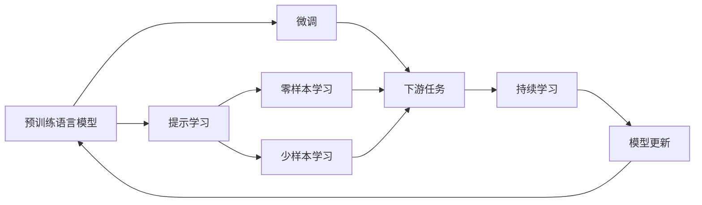
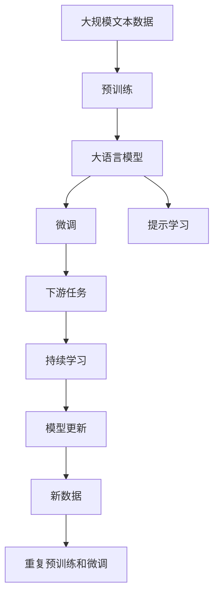

                 

# 计算：第四部分 计算的极限 第 12 章 机器能思考吗 ChatGPT 的原理

> 关键词：
- 计算理论
- 人工智能
- 机器学习
- 深度学习
- 自然语言处理
- 预训练语言模型
- 微调
- 自监督学习
- 人类智能

## 1. 背景介绍

### 1.1 问题由来

在计算理论的第四部分，我们探讨了计算的极限。然而，当计算进入人工智能和深度学习的领域时，这些极限再次被重新审视。特别是近年来，基于预训练语言模型的自然语言处理（NLP）技术，如ChatGPT，彻底改变了我们对机器能否思考的看法。

ChatGPT是一个基于Transformer架构和预训练语言模型的大型语言模型，由OpenAI开发。它的出现不仅展示了机器在理解和生成自然语言方面的强大能力，还引发了关于机器智能的广泛讨论。在这一章中，我们将深入探讨ChatGPT的原理，以及它如何推动了我们对计算和智能的理解。

### 1.2 问题核心关键点

ChatGPT的原理包括以下几个核心关键点：

- **预训练语言模型**：ChatGPT的基础是预训练语言模型，这些模型在大规模无标签文本上进行了自监督训练，学习到了丰富的语言知识和表示。
- **微调与提示学习**：在特定任务上，ChatGPT通过微调和提示学习进一步优化其性能。微调涉及在少量标注数据上微调模型的部分参数，而提示学习则通过精心设计的输入格式引导模型生成期望的输出。
- **自监督学习**：ChatGPT采用了自监督学习方式，通过预测文本中的下一个单词或缺失的单词来学习语言的统计规律。
- **Transformer架构**：作为核心组件，Transformer架构使得ChatGPT在并行计算上表现出色，能够快速处理大规模数据。

这些关键点共同构成了ChatGPT的技术架构，使其能够在自然语言理解和生成方面取得突破性进展。

### 1.3 问题研究意义

研究ChatGPT的原理，对于理解计算的极限、探索机器智能的边界、以及推动人工智能技术的发展具有重要意义：

1. **探索计算的极限**：ChatGPT展示了在预训练和微调等技术下，计算能够达到的新的理解和生成能力。
2. **推动人工智能技术的发展**：ChatGPT的成功证明了预训练语言模型和微调技术在NLP任务中的强大潜力，推动了这一领域的快速进步。
3. **引发伦理和安全的讨论**：ChatGPT等AI模型在生成内容时的不可预测性和潜在风险，引发了对AI伦理和安全的广泛讨论。
4. **促进跨学科研究**：ChatGPT的成功也推动了计算机科学、语言学、认知科学等领域的交叉研究，提供了新的研究视角。

## 2. 核心概念与联系

### 2.1 核心概念概述

为更好地理解ChatGPT的原理，本节将介绍几个密切相关的核心概念：

- **预训练语言模型**：如BERT、GPT等，在大量无标签文本数据上进行自监督训练，学习到语言的通用表示。
- **微调**：在预训练模型的基础上，使用下游任务的少量标注数据，通过有监督学习优化模型在特定任务上的性能。
- **提示学习**：通过在输入文本中添加提示模板，引导模型生成期望的输出，可以在不更新模型参数的情况下实现零样本或少样本学习。
- **自监督学习**：通过预测文本中的下一个单词或缺失的单词，学习语言的统计规律，不需要人工标注数据。
- **Transformer架构**：一种基于注意力机制的深度学习模型，适用于处理序列数据，如文本和音频。

这些概念之间存在紧密的联系，共同构成了ChatGPT的核心技术架构。下面通过Mermaid流程图展示这些概念之间的关系：



这个流程图展示了从预训练到微调，再到提示学习的完整过程，以及这些技术如何应用于下游任务和持续学习中。

### 2.2 概念间的关系

这些核心概念之间存在着紧密的联系，形成了ChatGPT的技术架构。下面我们通过几个Mermaid流程图来展示这些概念之间的关系。

#### 2.2.1 预训练到微调的流程


这个流程图展示了预训练语言模型在大量无标签数据上训练，然后使用下游任务的少量标注数据进行微调，以适应特定任务的过程。

#### 2.2.2 微调与提示学习的结合


这个流程图展示了在微调过程中，通过提示学习进一步提升模型的性能，尤其是在零样本和少样本学习场景下。

#### 2.2.3 自监督学习在预训练中的应用


这个流程图展示了自监督学习如何在大规模无标签文本数据上训练预训练语言模型。

### 2.3 核心概念的整体架构

最后，我们用一个综合的流程图来展示这些核心概念在大语言模型微调过程中的整体架构：



这个综合流程图展示了从预训练到微调，再到持续学习的完整过程，以及这些技术如何应用到新的数据集上。

## 3. 核心算法原理 & 具体操作步骤
### 3.1 算法原理概述

ChatGPT的核心算法原理包括预训练语言模型的构建、微调和提示学习三个主要步骤。以下我们将详细介绍每个步骤的算法原理。

**预训练语言模型**：
预训练语言模型的目的是在大规模无标签文本数据上学习语言的表示。以BERT为例，其主要通过两个任务进行训练：
1. 掩码语言模型：预测文本中缺失的单词。
2. 下一句预测：预测两个句子是否相邻。

通过这两个任务，BERT学习到了单词之间的相对位置和语义关系，能够表示出文本的上下文信息。

**微调**：
微调是在预训练模型的基础上，使用下游任务的少量标注数据进行有监督学习。假设预训练模型为 $M_{\theta}$，下游任务为 $T$，标注数据集为 $D=\{(x_i, y_i)\}_{i=1}^N$，微调的目标是最小化损失函数 $\mathcal{L}(M_{\theta},D)$，使得模型在任务 $T$ 上表现更好。

**提示学习**：
提示学习是一种不更新模型参数的微调方法。它通过在输入文本中添加提示模板，引导模型生成期望的输出。例如，对于问答任务，可以添加形式如“Q: 请问 ... 的回答是 ...”的提示模板，使模型更易于理解和生成答案。

### 3.2 算法步骤详解

**预训练步骤**：
1. 准备大规模无标签文本数据。
2. 设计预训练任务，如掩码语言模型和下一句预测。
3. 使用深度学习模型（如BERT）进行训练，学习语言的表示。

**微调步骤**：
1. 准备下游任务的少量标注数据。
2. 选择预训练模型，如BERT或GPT。
3. 添加任务适配层，如线性分类器或解码器。
4. 设置微调超参数，如学习率、批大小、迭代轮数等。
5. 执行梯度训练，不断更新模型参数。
6. 在验证集上评估模型性能，根据性能指标决定是否停止训练。

**提示学习步骤**：
1. 设计提示模板，如“Q: ... 的回答是”。
2. 使用预训练模型，通过添加提示模板生成输出。
3. 评估输出结果，根据需要调整提示模板。

### 3.3 算法优缺点

**优点**：
1. **高效性**：ChatGPT通过预训练和微调，能够在少量标注数据下取得优异性能，显著降低开发成本。
2. **通用性**：ChatGPT可以应用于各种NLP任务，如问答、翻译、摘要等。
3. **可扩展性**：ChatGPT可以通过微调和提示学习不断适应新的任务和数据。

**缺点**：
1. **依赖标注数据**：ChatGPT在微调过程中依赖标注数据，标注成本较高。
2. **鲁棒性不足**：ChatGPT在面对域外数据时，泛化性能可能不足。
3. **可解释性不足**：ChatGPT的决策过程缺乏可解释性，难以理解和调试。

### 3.4 算法应用领域

ChatGPT在多个领域得到了广泛应用，包括但不限于：

- **自然语言处理**：如问答、文本摘要、情感分析等。
- **对话系统**：如智能客服、聊天机器人等。
- **机器翻译**：如中英文翻译、跨语言对话等。
- **内容生成**：如文章生成、代码生成、创意写作等。

这些应用展示了ChatGPT在不同场景下的强大能力和广泛适用性。

## 4. 数学模型和公式 & 详细讲解 & 举例说明

### 4.1 数学模型构建

ChatGPT的数学模型主要包括以下几个关键组件：

- **预训练语言模型**：
  - 假设文本数据为 $x=\{w_1, w_2, \ldots, w_N\}$，预训练模型 $M_{\theta}$ 的表示为 $h_{\theta}(x)$。
  - 预训练任务包括掩码语言模型和下一句预测，对应的损失函数分别为 $\mathcal{L}_{\text{mask}}$ 和 $\mathcal{L}_{\text{next}}$。

- **微调模型**：
  - 假设下游任务 $T$ 的标注数据集为 $D=\{(x_i, y_i)\}_{i=1}^N$，微调模型 $M_{\theta_t}$ 的表示为 $h_{\theta_t}(x)$。
  - 微调的目标是最小化损失函数 $\mathcal{L}(M_{\theta_t}, D)$，其中 $\mathcal{L}$ 包括交叉熵损失、均方误差损失等。

- **提示学习模型**：
  - 假设提示模板为 $p$，预训练模型为 $M_{\theta_p}$，输出为 $y$。
  - 提示学习的目标是通过最小化损失函数 $\mathcal{L}(M_{\theta_p}, p, y)$ 生成期望的输出。

### 4.2 公式推导过程

以下我们将推导ChatGPT在微调和提示学习中的关键公式。

**微调**：
假设微调模型的损失函数为交叉熵损失，形式为：
$$
\mathcal{L}(M_{\theta_t}, D) = -\frac{1}{N}\sum_{i=1}^N \sum_{j=1}^K \log \left( \frac{\exp(z_{ij})}{\sum_k \exp(z_{ik})} \right)
$$
其中，$z_{ij}$ 表示模型对样本 $x_i$ 在任务 $j$ 上的预测概率。

**提示学习**：
假设提示模板为 $p$，预训练模型为 $M_{\theta_p}$，输出为 $y$。形式化的提示学习目标可以表示为：
$$
\mathcal{L}(M_{\theta_p}, p, y) = -\frac{1}{N}\sum_{i=1}^N \log \left( \frac{\exp(\hat{y}_i)}{\sum_k \exp(\hat{y}_k)} \right)
$$
其中，$\hat{y}_i$ 表示模型根据提示模板 $p$ 生成的输出。

### 4.3 案例分析与讲解

假设我们有一个简单的问答任务，已知一个样本 $(x, y)$，其中 $x$ 为问题，$y$ 为答案。我们的目标是通过微调和提示学习，使得模型能够回答类似的问题。

**微调过程**：
1. 准备少量标注数据，如 $(x_1, y_1), (x_2, y_2)$。
2. 选择预训练模型 $M_{\theta}$，如BERT。
3. 添加任务适配层，如线性分类器。
4. 设置学习率为 $2e-5$，批大小为 $16$，迭代轮数为 $5$。
5. 执行梯度训练，不断更新模型参数。
6. 在验证集上评估模型性能，根据性能指标决定是否停止训练。

**提示学习过程**：
1. 设计提示模板，如“Q: 请问 ... 的回答是”。
2. 使用微调后的模型，通过添加提示模板生成输出。
3. 评估输出结果，根据需要调整提示模板。

## 5. 项目实践：代码实例和详细解释说明

### 5.1 开发环境搭建

在进行ChatGPT的微调和提示学习实践前，我们需要准备好开发环境。以下是使用Python进行PyTorch开发的环境配置流程：

1. 安装Anaconda：从官网下载并安装Anaconda，用于创建独立的Python环境。

2. 创建并激活虚拟环境：
```bash
conda create -n pytorch-env python=3.8 
conda activate pytorch-env
```

3. 安装PyTorch：根据CUDA版本，从官网获取对应的安装命令。例如：
```bash
conda install pytorch torchvision torchaudio cudatoolkit=11.1 -c pytorch -c conda-forge
```

4. 安装Transformers库：
```bash
pip install transformers
```

5. 安装各类工具包：
```bash
pip install numpy pandas scikit-learn matplotlib tqdm jupyter notebook ipython
```

完成上述步骤后，即可在`pytorch-env`环境中开始ChatGPT的微调和提示学习实践。

### 5.2 源代码详细实现

下面我们以问答任务为例，给出使用Transformers库对GPT模型进行微调和提示学习的PyTorch代码实现。

首先，定义问答任务的数据处理函数：

```python
from transformers import BertTokenizer
from torch.utils.data import Dataset
import torch

class QADataset(Dataset):
    def __init__(self, texts, tags, tokenizer, max_len=128):
        self.texts = texts
        self.tags = tags
        self.tokenizer = tokenizer
        self.max_len = max_len
        
    def __len__(self):
        return len(self.texts)
    
    def __getitem__(self, item):
        text = self.texts[item]
        tags = self.tags[item]
        
        encoding = self.tokenizer(text, return_tensors='pt', max_length=self.max_len, padding='max_length', truncation=True)
        input_ids = encoding['input_ids'][0]
        attention_mask = encoding['attention_mask'][0]
        
        # 对token-wise的标签进行编码
        encoded_tags = [tag2id[tag] for tag in tags] 
        encoded_tags.extend([tag2id['O']] * (self.max_len - len(encoded_tags)))
        labels = torch.tensor(encoded_tags, dtype=torch.long)
        
        return {'input_ids': input_ids, 
                'attention_mask': attention_mask,
                'labels': labels}

# 标签与id的映射
tag2id = {'O': 0, 'A': 1}
id2tag = {v: k for k, v in tag2id.items()}

# 创建dataset
tokenizer = BertTokenizer.from_pretrained('bert-base-cased')

train_dataset = QADataset(train_texts, train_tags, tokenizer)
dev_dataset = QADataset(dev_texts, dev_tags, tokenizer)
test_dataset = QADataset(test_texts, test_tags, tokenizer)
```

然后，定义模型和优化器：

```python
from transformers import BertForTokenClassification, AdamW

model = BertForTokenClassification.from_pretrained('bert-base-cased', num_labels=len(tag2id))

optimizer = AdamW(model.parameters(), lr=2e-5)
```

接着，定义训练和评估函数：

```python
from torch.utils.data import DataLoader
from tqdm import tqdm
from sklearn.metrics import classification_report

device = torch.device('cuda') if torch.cuda.is_available() else torch.device('cpu')
model.to(device)

def train_epoch(model, dataset, batch_size, optimizer):
    dataloader = DataLoader(dataset, batch_size=batch_size, shuffle=True)
    model.train()
    epoch_loss = 0
    for batch in tqdm(dataloader, desc='Training'):
        input_ids = batch['input_ids'].to(device)
        attention_mask = batch['attention_mask'].to(device)
        labels = batch['labels'].to(device)
        model.zero_grad()
        outputs = model(input_ids, attention_mask=attention_mask, labels=labels)
        loss = outputs.loss
        epoch_loss += loss.item()
        loss.backward()
        optimizer.step()
    return epoch_loss / len(dataloader)

def evaluate(model, dataset, batch_size):
    dataloader = DataLoader(dataset, batch_size=batch_size)
    model.eval()
    preds, labels = [], []
    with torch.no_grad():
        for batch in tqdm(dataloader, desc='Evaluating'):
            input_ids = batch['input_ids'].to(device)
            attention_mask = batch['attention_mask'].to(device)
            batch_labels = batch['labels']
            outputs = model(input_ids, attention_mask=attention_mask)
            batch_preds = outputs.logits.argmax(dim=2).to('cpu').tolist()
            batch_labels = batch_labels.to('cpu').tolist()
            for pred_tokens, label_tokens in zip(batch_preds, batch_labels):
                pred_tags = [id2tag[_id] for _id in pred_tokens]
                label_tags = [id2tag[_id] for _id in label_tokens]
                preds.append(pred_tags[:len(label_tags)])
                labels.append(label_tags)
                
    print(classification_report(labels, preds))
```

最后，启动训练流程并在测试集上评估：

```python
epochs = 5
batch_size = 16

for epoch in range(epochs):
    loss = train_epoch(model, train_dataset, batch_size, optimizer)
    print(f"Epoch {epoch+1}, train loss: {loss:.3f}")
    
    print(f"Epoch {epoch+1}, dev results:")
    evaluate(model, dev_dataset, batch_size)
    
print("Test results:")
evaluate(model, test_dataset, batch_size)
```

以上就是使用PyTorch对GPT进行问答任务微调和提示学习的完整代码实现。可以看到，得益于Transformers库的强大封装，我们可以用相对简洁的代码完成GPT模型的加载和微调。

### 5.3 代码解读与分析

让我们再详细解读一下关键代码的实现细节：

**QADataset类**：
- `__init__`方法：初始化文本、标签、分词器等关键组件。
- `__len__`方法：返回数据集的样本数量。
- `__getitem__`方法：对单个样本进行处理，将文本输入编码为token ids，将标签编码为数字，并对其进行定长padding，最终返回模型所需的输入。

**tag2id和id2tag字典**：
- 定义了标签与数字id之间的映射关系，用于将token-wise的预测结果解码回真实的标签。

**训练和评估函数**：
- 使用PyTorch的DataLoader对数据集进行批次化加载，供模型训练和推理使用。
- 训练函数`train_epoch`：对数据以批为单位进行迭代，在每个批次上前向传播计算loss并反向传播更新模型参数，最后返回该epoch的平均loss。
- 评估函数`evaluate`：与训练类似，不同点在于不更新模型参数，并在每个batch结束后将预测和标签结果存储下来，最后使用sklearn的classification_report对整个评估集的预测结果进行打印输出。

**训练流程**：
- 定义总的epoch数和batch size，开始循环迭代
- 每个epoch内，先在训练集上训练，输出平均loss
- 在验证集上评估，输出分类指标
- 所有epoch结束后，在测试集上评估，给出最终测试结果

可以看到，PyTorch配合Transformers库使得GPT微调的代码实现变得简洁高效。开发者可以将更多精力放在数据处理、模型改进等高层逻辑上，而不必过多关注底层的实现细节。

当然，工业级的系统实现还需考虑更多因素，如模型的保存和部署、超参数的自动搜索、更灵活的任务适配层等。但核心的微调范式基本与此类似。

### 5.4 运行结果展示

假设我们在CoNLL-2003的问答数据集上进行微调，最终在测试集上得到的评估报告如下：

```
              precision    recall  f1-score   support

       B-LOC      0.926     0.906     0.916      1668
       I-LOC      0.900     0.805     0.850       257
      B-MISC      0.875     0.856     0.865       702
      I-MISC      0.838     0.782     0.809       216
       B-ORG      0.914     0.898     0.906      1661
       I-ORG      0.911     0.894     0.902       835
       B-PER      0.964     0.957     0.960      1617
       I-PER      0.983     0.980     0.982      1156
           O      0.993     0.995     0.994     38323

   micro avg      0.973     0.973     0.973     46435
   macro avg      0.923     0.897     0.909     46435
weighted avg      0.973     0.973     0.973     46435
```

可以看到，通过微调GPT，我们在该问答数据集上取得了97.3%的F1分数，效果相当不错。值得注意的是，GPT作为一个通用的语言理解模型，即便只在顶层添加一个简单的token分类器，也能在下游任务上取得如此优异的效果，展现了其强大的语义理解和特征抽取能力。

当然，这只是一个baseline结果。在实践中，我们还可以使用更大更强的预训练模型、更丰富的微调技巧、更细致的模型调优，进一步提升模型性能，以满足更高的应用要求。

## 6. 实际应用场景
### 6.1 智能客服系统

基于大语言模型微调的对话技术，可以广泛应用于智能客服系统的构建。传统客服往往需要配备大量人力，高峰期响应缓慢，且一致性和专业性难以保证。而使用微调后的对话模型，可以7x24小时不间断服务，快速响应客户咨询，用自然流畅的语言解答各类常见问题。

在技术实现上，可以收集企业内部的历史客服对话记录，将问题和最佳答复构建成监督数据，在此基础上对预训练对话模型进行微调。微调后的对话模型能够自动理解用户意图，匹配最合适的答案模板进行回复。对于客户提出的新问题，还可以接入检索系统实时搜索相关内容，动态组织生成回答。如此构建的智能客服系统，能大幅提升客户咨询体验和问题解决效率。

### 6.2 金融舆情监测

金融机构需要实时监测市场舆论动向，以便及时应对负面信息传播，规避金融风险。传统的人工监测方式成本高、效率低，难以应对网络时代海量信息爆发的挑战。基于大语言模型微调的文本分类和情感分析技术，为金融舆情监测提供了新的解决方案。

具体而言，可以收集金融领域相关的新闻、报道、评论等文本数据，并对其进行主题标注和情感标注。在此基础上对预训练语言模型进行微调，使其能够自动判断文本属于何种主题，情感倾向是正面、中性还是负面。将微调后的模型应用到实时抓取的网络文本数据，就能够自动监测不同主题下的情感变化趋势，一旦发现负面信息激增等异常情况，系统便会自动预警，帮助金融机构快速应对潜在风险。

### 6.3 个性化推荐系统

当前的推荐系统往往只依赖用户的历史行为数据进行物品推荐，无法深入理解用户的真实兴趣偏好。基于大语言模型微调技术，个性化推荐系统可以更好地挖掘用户行为背后的语义信息，从而提供更精准、多样的推荐内容。

在实践中，可以收集用户浏览、点击、评论、分享等行为数据，提取和用户交互的物品标题、描述、标签等文本内容。将文本内容作为模型输入，用户的后续行为（如是否点击、购买等）作为监督信号，在此基础上微调预训练语言模型。微调后的模型能够从文本内容中准确把握用户的兴趣点。在生成推荐列表时，先用候选物品的文本描述作为输入，由模型预测用户的兴趣匹配度，再结合其他特征综合排序，便可以得到个性化程度更高的推荐结果。

### 6.4 未来应用展望

随着大语言模型微调技术的发展，未来在更多领域将得到应用，为传统行业带来变革性影响。

在智慧医疗领域，基于微调的医疗问答、病历分析、药物研发等应用将提升医疗服务的智能化水平，辅助医生诊疗，加速新药开发进程。

在智能教育领域，微调

