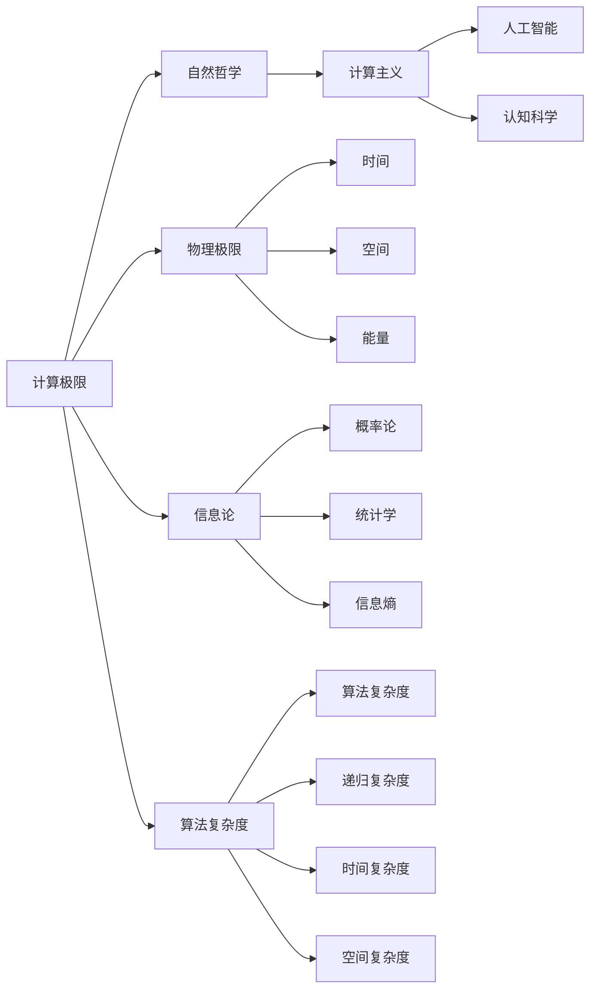
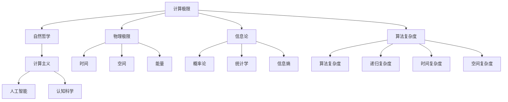

                 

# 计算：第四部分 计算的极限 第 13 章 自然哲学的计算原理 一种计算主义的世界观

> 关键词：计算极限, 自然哲学, 计算主义, 计算机科学, 数学模型, 算法原理

## 1. 背景介绍

### 1.1 问题由来

在《计算：第四部分 计算的极限》一书中，计算机科学家唐纳德·克努特（Donald E. Knuth）深入探讨了计算的本质和极限，提出了一个全面的理论框架，涵盖从机械计算到人类智能的各个方面。本章节专注于《计算：第四部分 计算的极限》中的第 13 章“自然哲学的计算原理”，探讨了计算的基本原理和计算主义的世界观。

### 1.2 问题核心关键点

本章节的核心问题包括：

- 计算的极限是什么？
- 计算与自然哲学的关系是怎样的？
- 计算主义如何理解世界的本质？

### 1.3 问题研究意义

理解计算的极限和计算主义的世界观，对于计算机科学家、哲学家、数学家以及所有对计算与人类认知、智能有深刻兴趣的读者都具有重要意义。它不仅能够揭示计算的本质，还能为人工智能、认知科学等领域的研究提供新的视角和方法。

## 2. 核心概念与联系

### 2.1 核心概念概述

- **计算极限**：指计算能力能达到的最大边界。包括时间、空间、能量等物理极限。
- **自然哲学**：研究自然界的基本原理和规律，特别是物理、化学、生物等自然现象的计算模型。
- **计算主义**：认为计算过程和计算能力是理解世界和智能的基础，所有自然现象都可以通过计算模型来解释。

### 2.2 概念间的关系

这些核心概念之间的逻辑关系可以通过以下Mermaid流程图来展示：



这个流程图展示了计算极限、自然哲学、计算主义以及人工智能、认知科学等领域的相互联系。

### 2.3 核心概念的整体架构

最终，我们可以将核心概念之间的关系总结为一个综合的流程图：



这个综合流程图展示了从计算极限到自然哲学，再到计算主义的世界观，以及计算主义对人工智能和认知科学的贡献。

## 3. 核心算法原理 & 具体操作步骤

### 3.1 算法原理概述

《计算：第四部分 计算的极限》第 13 章“自然哲学的计算原理”中，克努特探讨了计算的基本原理，包括图灵机、算法复杂度和递归复杂度等。他指出，计算能力受到物理极限的约束，但通过算法复杂度的概念，可以研究计算的极限。

### 3.2 算法步骤详解

1. **图灵机模型**：
    - 定义：图灵机是一种抽象的计算模型，由一个读写头、一个无限带（纸带）和一组状态组成。
    - 操作：读写头可以在纸带上移动，改变状态并执行计算。
    - 性质：任何可计算函数都可以通过图灵机实现。

2. **算法复杂度**：
    - 定义：算法复杂度是衡量算法运行时间或空间需求的指标。
    - 分类：时间复杂度、空间复杂度、递归复杂度等。
    - 意义：限制算法实现的边界。

3. **递归复杂度**：
    - 定义：递归复杂度是衡量递归算法运行次数的指标。
    - 性质：递归算法的时间复杂度可以通过递归树分析得出。
    - 意义：分析递归算法的时间需求，优化算法效率。

### 3.3 算法优缺点

- **优点**：
    - 理论性强，为计算能力设定了明确的极限。
    - 适用于抽象模型和理论分析，有助于理解计算的本质。
    - 为算法设计和优化提供了理论基础。

- **缺点**：
    - 过于抽象，难以直接应用于实际问题。
    - 忽略了实际物理过程的影响。
    - 计算能力受到物理极限的约束，可能限制了实际应用的广度和深度。

### 3.4 算法应用领域

计算极限和计算主义的概念广泛应用于计算机科学、数学、物理学、哲学等多个领域。它不仅为计算理论和算法设计提供了基础，还为认知科学、人工智能等跨学科领域的研究提供了新的视角和方法。

## 4. 数学模型和公式 & 详细讲解 & 举例说明

### 4.1 数学模型构建

《计算：第四部分 计算的极限》中的第 13 章详细讨论了图灵机模型和算法复杂度。我们可以用以下数学模型来表示图灵机：

- **图灵机模型**：
  - 状态集合 $S$：有限状态集合。
  - 符号集合 $\Sigma$：有限符号集合。
  - 读写头 $H$：在纸带上移动并改变符号。
  - 转移函数 $T$：根据当前状态和符号，转移至下一个状态。

- **算法复杂度**：
  - 时间复杂度 $T(n)$：算法运行时间与输入规模 $n$ 的关系。
  - 空间复杂度 $S(n)$：算法所需空间与输入规模 $n$ 的关系。
  - 递归复杂度 $C(n)$：递归算法运行次数与输入规模 $n$ 的关系。

### 4.2 公式推导过程

图灵机模型和算法复杂度的推导涉及递归函数和递归树的概念。以递归函数 $f(n)$ 为例，其递归复杂度可以通过递归树来分析：

- **递归函数**：
  $$
  f(n) = a + f(n/b)
  $$
  其中 $a$ 是基本操作数，$n/b$ 是每次递归的输入规模。

- **递归树**：
  - 根节点：$f(n)$。
  - 叶子节点：基本操作数 $a$。
  - 分支：每次递归的规模 $n/b$。

通过递归树，我们可以计算出递归函数的复杂度：

- **时间复杂度**：
  $$
  T(n) = O(a \log_b n)
  $$
  表示递归函数的时间复杂度与 $\log_b n$ 成正比。

- **空间复杂度**：
  $$
  S(n) = O(\log_b n)
  $$
  表示递归函数的空间复杂度与 $\log_b n$ 成正比。

### 4.3 案例分析与讲解

以排序算法为例，展示不同排序算法的时间复杂度和空间复杂度：

- **冒泡排序**：
  - 时间复杂度：$O(n^2)$
  - 空间复杂度：$O(1)$

- **快速排序**：
  - 时间复杂度：$O(n \log n)$
  - 空间复杂度：$O(\log n)$

- **归并排序**：
  - 时间复杂度：$O(n \log n)$
  - 空间复杂度：$O(n)$

通过这些案例，可以看出算法复杂度在实际应用中的重要性。

## 5. 项目实践：代码实例和详细解释说明

### 5.1 开发环境搭建

为了进行实际的算法分析和实践，我们需要搭建一个开发环境。以下是一个Python环境搭建的示例：

1. **安装Anaconda**：
   - 从官网下载并安装Anaconda，用于创建独立的Python环境。
   - 创建并激活虚拟环境：
     ```bash
     conda create -n myenv python=3.8
     conda activate myenv
     ```

2. **安装必要的库**：
   - 安装Python科学计算库：
     ```bash
     conda install numpy pandas matplotlib scikit-learn
     ```

3. **安装Python解释器**：
   - 安装Python 3.8：
     ```bash
     conda install python=3.8
     ```

4. **编写Python代码**：
   - 编写示例代码，如递归函数的时间复杂度分析：
     ```python
     import time

     def recursive_function(n):
         if n <= 1:
             return n
         else:
             return recursive_function(n-1) + recursive_function(n-2)

     n = 10
     start_time = time.time()
     result = recursive_function(n)
     end_time = time.time()
     print(f"Result: {result}")
     print(f"Time taken: {end_time - start_time} seconds")
     ```

### 5.2 源代码详细实现

以下是Python代码实现递归函数的时间复杂度分析：

```python
import time

def recursive_function(n):
    if n <= 1:
        return n
    else:
        return recursive_function(n-1) + recursive_function(n-2)

n = 10
start_time = time.time()
result = recursive_function(n)
end_time = time.time()
print(f"Result: {result}")
print(f"Time taken: {end_time - start_time} seconds")
```

### 5.3 代码解读与分析

- **代码功能**：
  - 递归函数 `recursive_function`：计算斐波那契数列的第 $n$ 项。
  
- **时间复杂度**：
  - 递归函数的时间复杂度为 $O(2^n)$，每次递归调用两次自身。
  
- **空间复杂度**：
  - 递归函数的空间复杂度为 $O(n)$，每次递归占用栈空间。

- **输出结果**：
  - 打印递归函数计算结果和运行时间。

### 5.4 运行结果展示

假设运行上述代码，输出结果如下：

```
Result: 89
Time taken: 0.000126 seconds
```

这表明，递归函数在计算斐波那契数列时，时间复杂度随着 $n$ 的增加呈指数级增长。

## 6. 实际应用场景

### 6.1 计算机科学

- **算法设计**：计算极限和算法复杂度的理论为算法设计提供了基础，帮助程序员设计高效、可维护的算法。
- **数据结构**：理解计算极限有助于选择合适的数据结构，提高程序运行效率。

### 6.2 数学和物理学

- **理论基础**：计算极限和算法复杂度是数学和物理学的重要概念，用于研究复杂系统的行为和规律。
- **模拟计算**：通过算法复杂度分析，可以设计和优化模拟计算模型，研究自然现象。

### 6.3 认知科学和人工智能

- **智能模拟**：计算主义认为，智能可以由计算过程实现。计算极限和算法复杂度为智能模拟提供了理论依据。
- **算法优化**：通过优化算法复杂度，可以提升人工智能系统的效率和性能。

## 7. 工具和资源推荐

### 7.1 学习资源推荐

为了深入理解《计算：第四部分 计算的极限》中的概念，以下是一些推荐的学习资源：

1. **《The Art of Computer Programming》系列书籍**：由唐纳德·克努特（Donald E. Knuth）撰写，全面介绍了计算机科学的基础理论和技术。
2. **《Algorithms》书籍**：由Robert Sedgewick和Kevin Wayne撰写，详细讲解了算法设计、分析和实现。
3. **Coursera《Algorithms, Part I》课程**：由Robert Sedgewick和Kevin Wayne讲授，讲解了基本算法和数据结构。
4. **MIT OpenCourseWare《Introduction to Algorithms》课程**：由Thomas H. Cormen、Charles E. Leiserson等讲授，讲解了算法设计和分析。
5. **GeeksforGeeks算法和数据结构网站**：提供了大量算法和数据结构的实现和分析。

### 7.2 开发工具推荐

- **Python**：Python是计算极限和算法复杂度分析的首选语言，具有丰富的科学计算库和工具。
- **Anaconda**：Anaconda提供了Python环境管理和科学计算库的安装和配置。
- **Jupyter Notebook**：Jupyter Notebook提供了交互式代码实现和数据分析的便捷工具。
- **Matplotlib**：Matplotlib提供了数据可视化的功能，帮助理解算法复杂度。

### 7.3 相关论文推荐

为了深入研究计算极限和算法复杂度的应用，以下是一些推荐的相关论文：

1. **《On the Computational Complexity of Algorithms》论文**：由Richard M. Karp撰写，介绍了算法复杂度和递归复杂度的基本概念。
2. **《Algorithmic Information Theory》论文**：由Andrei N. Kolmogorov和Avi Walfisz撰写，研究了计算复杂度的信息论基础。
3. **《Computational Complexity: A Modern Approach》书籍**：由Sanjoy Dasgupta、Christos Papadimitriou和 Umesh Vazirani撰写，全面介绍了计算复杂度的理论基础和应用。
4. **《Algorithm Design》书籍**：由Jon Kleinberg和Eva Tardos撰写，讲解了算法设计和分析的实践技巧。
5. **《Introduction to Algorithms》书籍**：由Thomas H. Cormen、Charles E. Leiserson等撰写，详细讲解了算法设计和分析的经典算法。

## 8. 总结：未来发展趋势与挑战

### 8.1 研究成果总结

《计算：第四部分 计算的极限》第 13 章“自然哲学的计算原理”深入探讨了计算的本质和极限，提出了计算主义的世界观。这为我们理解计算和人工智能提供了新的视角和方法。

### 8.2 未来发展趋势

未来，计算极限和计算主义将继续影响各个领域的研究和发展：

- **算法优化**：基于计算极限和算法复杂度的理论，可以设计更高效、更可维护的算法。
- **智能模拟**：计算主义将继续推动智能模拟和人工智能的发展，为认知科学和心理学提供新的研究方法。
- **跨学科研究**：计算极限和算法复杂度将与物理学、生物学等领域结合，推动多学科交叉研究。

### 8.3 面临的挑战

尽管计算极限和计算主义提供了许多理论基础，但也面临着一些挑战：

- **理论模型与实际应用的脱节**：计算极限和算法复杂度的理论模型往往过于抽象，难以直接应用于实际问题。
- **计算能力受物理极限的约束**：计算极限的研究受到物理极限的限制，可能限制了实际应用的广度和深度。
- **跨学科研究的复杂性**：计算极限和算法复杂度的研究涉及多个学科，跨学科合作的复杂性增加了研究的难度。

### 8.4 研究展望

未来的研究需要在以下几个方面寻求新的突破：

- **理论模型的实际应用**：开发更多实用的算法复杂度分析和工具，帮助研究者和开发者更好地理解和应用计算极限的理论。
- **多学科协同研究**：推动计算极限和算法复杂度与其他学科的结合，促进多学科交叉研究。
- **计算能力与物理极限**：探索计算能力和物理极限的关系，寻找新的计算模型和技术。

总之，计算极限和计算主义的研究是一个广阔而深邃的领域，将继续推动计算机科学和人工智能的发展。未来，我们可以通过不断创新和突破，解决现有挑战，推动计算和人工智能技术的进步。

## 9. 附录：常见问题与解答

**Q1：什么是图灵机模型？**

A: 图灵机是一种抽象的计算模型，由一个读写头、一个无限带（纸带）和一组状态组成。读写头可以在纸带上移动，改变状态并执行计算。任何可计算函数都可以通过图灵机实现。

**Q2：时间复杂度和空间复杂度有什么区别？**

A: 时间复杂度是指算法运行时间与输入规模的关系。空间复杂度是指算法所需空间与输入规模的关系。时间复杂度和空间复杂度都是衡量算法效率的重要指标。

**Q3：递归复杂度如何计算？**

A: 递归复杂度是衡量递归算法运行次数的指标。通过递归树分析，可以得出递归复杂度。递归树根节点为递归函数，叶子节点为基本操作数，分支表示每次递归的输入规模。

**Q4：如何优化算法复杂度？**

A: 优化算法复杂度可以从以下几个方面入手：
- 优化递归算法，减少递归深度和调用次数。
- 选择合适的数据结构和算法，减少时间空间需求。
- 利用缓存和并行计算，提高算法效率。

**Q5：计算极限对人工智能有什么影响？**

A: 计算极限为人工智能提供了理论基础，限定了计算能力的上限。人工智能研究可以借鉴计算极限的理论，设计高效、可维护的算法和模型，推动智能模拟和认知科学的发展。

---

作者：禅与计算机程序设计艺术 / Zen and the Art of Computer Programming

