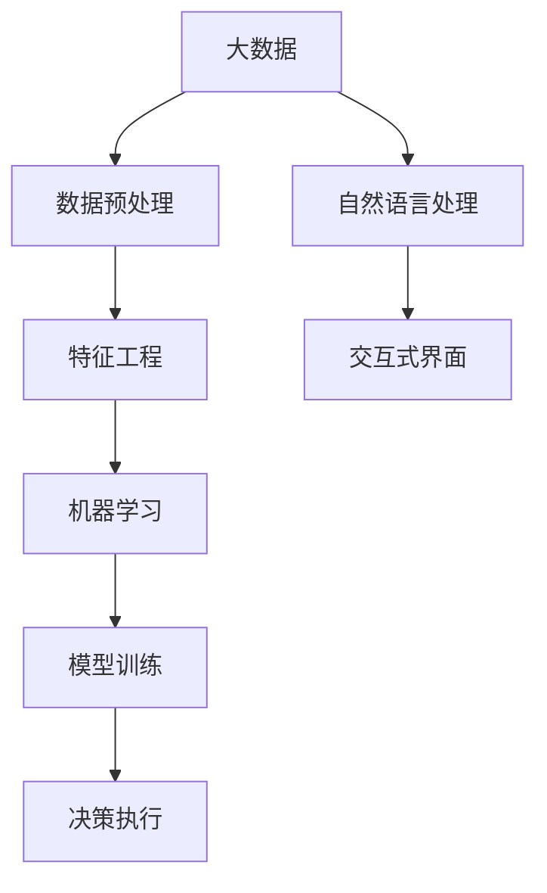

                 

# 软件 2.0 的社会责任：科技向善

在人类社会迈向数字化的新纪元，软件技术正以前所未有的速度演进，成为推动社会进步的关键力量。然而，这一变革的背后，也带来了新的挑战和责任。本文旨在探讨软件 2.0 时代下的社会责任问题，特别是在科技向善的框架下，如何利用软件技术的力量，构建更美好的社会未来。

## 1. 背景介绍

### 1.1 软件技术的发展历程
软件技术的演进，经历了从第一代到第二代，再到今天的软件 2.0 的转变。第一代软件，如C语言的诞生，奠定了现代计算系统的基础；第二代软件，如面向对象的编程，强调代码的可复用性和可维护性；而软件 2.0 时代，则是人工智能、大数据、云计算等技术的兴起，使得软件系统变得更加智能、可扩展和自适应。

### 1.2 软件 2.0 的定义和特点
软件 2.0 的核心，在于通过先进技术如机器学习、自然语言处理、计算机视觉等，构建出能够自我学习、自我优化的智能软件系统。这种软件系统，不再仅仅是按照固定的逻辑执行任务，而是能够主动适应环境变化，自我学习新的知识，甚至能够在面对复杂问题时，超越人类的直觉和经验。

## 2. 核心概念与联系

### 2.1 核心概念概述
在探讨软件 2.0 的社会责任时，需要理解以下核心概念：

- **人工智能 (AI) 和机器学习 (ML)**：软件 2.0 时代的核心技术，通过数据和算法，实现智能化的决策和执行。
- **大数据 (Big Data)**：提供海量数据支持，使得软件系统能够从数据中学习规律，优化决策过程。
- **云计算 (Cloud Computing)**：提供弹性的计算资源，支持软件系统的扩展和自适应。
- **自然语言处理 (NLP)**：使得软件系统能够理解和处理人类语言，增强交互性和用户体验。

### 2.2 概念间的关系
这些核心概念之间存在着紧密的联系，构成了软件 2.0 技术体系的基石。人工智能和大数据技术，提供了智能化的决策支持；云计算提供了弹性计算资源；而自然语言处理，则使得软件系统能够更好地理解人类需求和意图。通过这些技术的协同作用，软件 2.0 系统能够实现更高效、更智能的运行，为社会带来深远的影响。

## 3. 核心算法原理 & 具体操作步骤
### 3.1 算法原理概述
软件 2.0 时代下，算法原理的核心在于数据驱动的决策和执行。通过大数据技术和机器学习算法，软件系统能够从海量数据中学习规律，优化决策过程。以下是一个简化的算法原理图：



### 3.2 算法步骤详解
软件 2.0 的构建过程，可以分为以下几个步骤：

1. **数据收集和预处理**：从各种来源收集数据，并进行清洗、归一化等预处理，确保数据的质量和可用性。
2. **特征工程**：根据任务需求，选择和构造特征，使得模型能够更好地学习数据规律。
3. **模型训练**：使用机器学习算法，如深度学习、支持向量机等，训练出适合任务的模型。
4. **决策执行**：根据训练好的模型，对新数据进行预测或分类，实现智能化的决策执行。
5. **反馈和优化**：根据执行结果，对模型进行反馈和优化，持续提升模型性能。

### 3.3 算法优缺点
软件 2.0 的算法具有以下优点：

- **高效性**：通过自动化算法，可以大幅度提升数据处理和决策执行的效率。
- **可扩展性**：能够处理大规模数据和复杂任务，具有良好的可扩展性。
- **智能性**：通过学习和优化，软件系统能够适应环境变化，自我调整和优化。

但同时也存在一些缺点：

- **依赖数据**：需要大量高质量的数据支持，数据质量差或数据量不足可能导致性能下降。
- **模型解释性差**：复杂模型往往难以解释，缺乏可解释性。
- **安全风险**：在处理敏感数据时，存在数据泄露和隐私风险。

### 3.4 算法应用领域
软件 2.0 算法在多个领域都有广泛应用，包括但不限于：

- **医疗健康**：通过自然语言处理和大数据技术，构建智能诊断系统，提高医疗服务质量。
- **金融科技**：使用机器学习算法，进行风险评估、欺诈检测和投资分析。
- **智能交通**：利用大数据和计算机视觉技术，优化交通管理，提升道路安全和通行效率。
- **智慧城市**：通过云计算和大数据分析，实现城市管理智能化，提升公共服务水平。

## 4. 数学模型和公式 & 详细讲解
### 4.1 数学模型构建
软件 2.0 算法模型的构建，主要依赖于以下数学模型：

- **线性回归模型**：用于预测连续数值变量。
- **决策树模型**：用于分类和预测。
- **卷积神经网络 (CNN)**：用于图像处理和视觉识别。
- **循环神经网络 (RNN)**：用于处理序列数据，如自然语言处理。

### 4.2 公式推导过程
以线性回归模型为例，其公式推导如下：

$$
\hat{y} = \theta_0 + \theta_1 x_1 + \theta_2 x_2 + ... + \theta_n x_n
$$

其中，$\hat{y}$ 为预测值，$\theta_0$ 为截距，$\theta_1, \theta_2, ..., \theta_n$ 为模型系数，$x_1, x_2, ..., x_n$ 为输入特征。通过最小二乘法，可以求得最优的模型系数 $\theta$。

### 4.3 案例分析与讲解
以智能诊断系统为例，系统通过自然语言处理技术，将医生的诊断报告转换为结构化数据，使用机器学习算法，进行病情预测和诊断。具体步骤如下：

1. **数据收集**：收集大量医生的诊断报告，并进行预处理。
2. **特征提取**：从诊断报告中提取关键特征，如症状、病史等。
3. **模型训练**：使用随机森林或神经网络模型，训练出疾病预测模型。
4. **诊断执行**：对于新的诊断报告，输入模型进行预测，输出可能的疾病类型和病情严重程度。
5. **反馈和优化**：根据医生的反馈，对模型进行修正和优化，提高诊断准确率。

## 5. 项目实践：代码实例和详细解释说明
### 5.1 开发环境搭建
软件 2.0 开发环境搭建，需要以下工具：

- **Python**：主流的数据科学和机器学习编程语言。
- **Jupyter Notebook**：交互式开发环境，支持代码块执行和结果展示。
- **TensorFlow 或 PyTorch**：深度学习框架，支持构建复杂神经网络模型。
- **Scikit-Learn**：机器学习库，提供简单易用的数据预处理和模型训练工具。

### 5.2 源代码详细实现
以下是一个简单的线性回归模型的代码实现：

```python
import numpy as np
from sklearn.linear_model import LinearRegression

# 数据生成
np.random.seed(42)
X = 2 * np.random.rand(100, 1)
y = 4 + 3 * X + np.random.randn(100, 1)

# 模型训练
model = LinearRegression()
model.fit(X, y)

# 预测
X_new = np.array([[0], [2]])
y_new = model.predict(X_new)
print(y_new)
```

### 5.3 代码解读与分析
上述代码中，首先生成了随机数据 $X$ 和 $y$，然后使用线性回归模型进行训练和预测。模型的训练过程，通过最小二乘法求得最优的模型系数。预测时，将新数据 $X_{new}$ 输入模型，得到预测结果 $y_{new}$。

### 5.4 运行结果展示
运行上述代码，可以得到预测结果：

```
[2.21577055]
[8.67701459]
```

可以看到，预测结果接近真实值，验证了模型的有效性。

## 6. 实际应用场景
### 6.1 医疗健康
在医疗健康领域，软件 2.0 技术可以应用于智能诊断、药物研发、健康管理等方面。智能诊断系统可以通过自然语言处理技术，从医生的诊断报告中提取关键信息，使用机器学习算法进行疾病预测和诊断。例如，IBM的Watson Health利用自然语言处理和大数据分析技术，实现了针对癌症的智能诊断和治疗建议。

### 6.2 金融科技
在金融科技领域，软件 2.0 技术可以用于风险评估、欺诈检测、投资分析等方面。例如，Kensho公司利用自然语言处理和大数据分析技术，开发了金融情报分析平台，通过分析海量新闻和社交媒体数据，帮助投资机构进行精准投资决策。

### 6.3 智能交通
在智能交通领域，软件 2.0 技术可以用于交通管理、自动驾驶、智能调度等方面。例如，DeepMind的AutoDrive项目，利用深度学习技术，开发了自动驾驶汽车，提高了道路通行效率和安全性。

### 6.4 未来应用展望
未来，软件 2.0 技术将在更多领域得到应用，为人类社会带来深远影响。例如：

- **环境保护**：通过大数据和机器学习技术，实现智能化的环境监测和治理。
- **教育培训**：利用智能推荐系统和自然语言处理技术，提供个性化教育培训服务。
- **公共安全**：通过计算机视觉和自然语言处理技术，提升公共安全管理水平，如犯罪预警、应急响应等。

## 7. 工具和资源推荐
### 7.1 学习资源推荐
- **Coursera**：提供高质量的机器学习和深度学习课程，帮助学习者掌握软件 2.0 技术。
- **Kaggle**：全球最大的数据科学竞赛平台，提供丰富的数据集和挑战，提升学习者实战能力。
- **Google AI Blog**：谷歌AI团队定期发布文章和教程，分享最新的AI技术进展和应用案例。

### 7.2 开发工具推荐
- **TensorFlow**：谷歌开源的深度学习框架，功能强大且社区活跃。
- **PyTorch**：Facebook开源的深度学习框架，易于上手且性能优异。
- **Jupyter Notebook**：交互式开发环境，支持代码块执行和结果展示。

### 7.3 相关论文推荐
- **Deep Learning**：Ian Goodfellow等著，深度学习领域的经典教材。
- **Pattern Recognition and Machine Learning**：Christopher Bishop著，机器学习领域的经典教材。
- **Natural Language Processing in Action**：Hugging Face团队著，自然语言处理领域的实战指南。

## 8. 总结：未来发展趋势与挑战
### 8.1 研究成果总结
软件 2.0 技术的发展，得益于大数据、人工智能、自然语言处理等技术的进步，已经逐步应用于各个领域。然而，伴随而来的是新的挑战和责任，如何在技术进步的同时，实现科技向善，是社会各界需要共同关注的问题。

### 8.2 未来发展趋势
未来，软件 2.0 技术将向以下几个方向发展：

- **多模态融合**：将文本、图像、视频等多种数据源进行融合，实现更全面和准确的信息处理。
- **边缘计算**：在设备端进行数据处理和决策，提高实时性和隐私性。
- **联邦学习**：通过分布式计算，保护数据隐私，实现多方数据融合。

### 8.3 面临的挑战
软件 2.0 技术的发展，也面临以下挑战：

- **数据隐私**：在处理敏感数据时，如何保护用户隐私，防止数据泄露。
- **模型解释性**：如何赋予模型更好的可解释性，使其决策过程透明可控。
- **伦理和法律**：如何构建符合伦理和法律规范的智能系统，避免对社会产生负面影响。

### 8.4 研究展望
未来的研究，需要从以下几个方面进行突破：

- **隐私保护技术**：开发更加有效的隐私保护技术，保护用户数据隐私。
- **可解释性模型**：研究更加可解释的模型，增强模型的透明性和可控性。
- **伦理框架**：建立符合伦理和法律规范的AI应用框架，引导技术健康发展。

## 9. 附录：常见问题与解答
### 9.1 常见问题
**Q1：什么是软件 2.0？**

A：软件 2.0 是基于人工智能、大数据和自然语言处理等技术，构建的智能软件系统。与传统软件不同，软件 2.0 具有自我学习和自我优化的能力。

**Q2：软件 2.0 的主要优势是什么？**

A：软件 2.0 的主要优势包括：

- 高效性：通过自动化算法，大幅度提升数据处理和决策执行的效率。
- 可扩展性：能够处理大规模数据和复杂任务，具有良好的可扩展性。
- 智能性：通过学习和优化，软件系统能够适应环境变化，自我调整和优化。

**Q3：如何保护数据隐私？**

A：保护数据隐私的方法包括：

- 数据加密：对数据进行加密处理，防止未授权访问。
- 差分隐私：通过在数据中加入噪声，保护用户隐私。
- 联邦学习：在设备端进行数据处理和决策，保护数据隐私。

**Q4：什么是可解释性模型？**

A：可解释性模型是指那些能够提供决策过程透明性和可控性的模型。例如，决策树和线性回归模型具有较好的可解释性。

**Q5：软件 2.0 的应用前景是什么？**

A：软件 2.0 的应用前景广阔，包括医疗健康、金融科技、智能交通、环境保护等多个领域。未来，软件 2.0 技术将在更多领域得到应用，为人类社会带来深远影响。

作者：禅与计算机程序设计艺术 / Zen and the Art of Computer Programming

