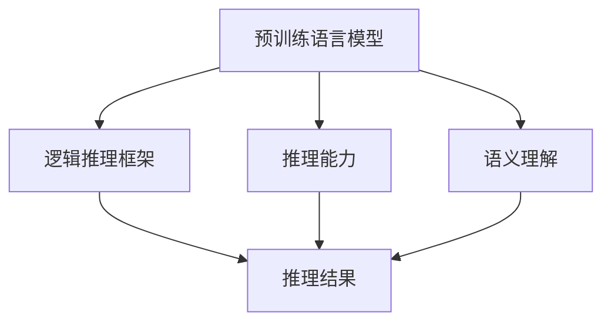
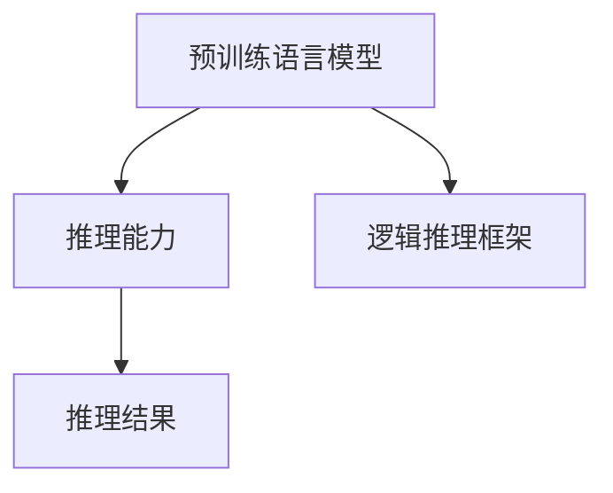
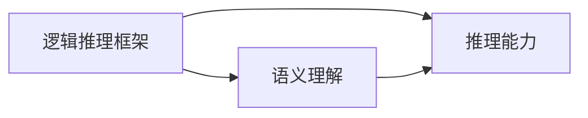
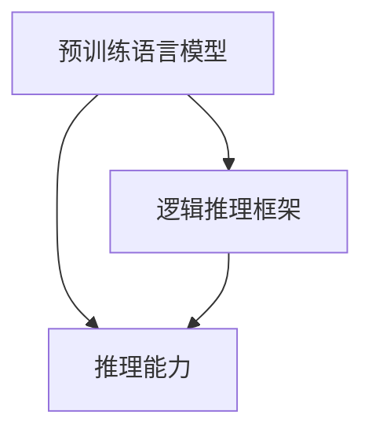
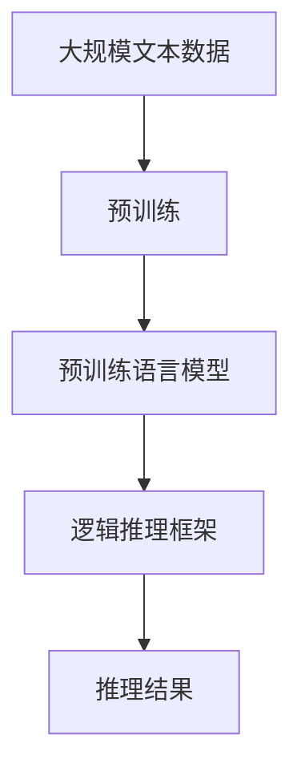

                 

# 零样本条件下的通用语言理解评估

> 关键词：零样本学习,语言模型,评估指标,推理能力,逻辑理解,推理能力,框架

## 1. 背景介绍

在当今社会，自然语言处理(NLP)技术已经深入各行各业，从智能客服到医疗诊断，从推荐系统到金融风控，NLP技术都在发挥着至关重要的作用。然而，传统的NLP技术往往依赖大量的标注数据进行训练，这在数据稀缺的场景下变得尤为困难。近年来，零样本学习(ZSL)技术逐步兴起，通过利用预训练语言模型和逻辑推理框架，实现在无需标注数据的情况下，对新任务进行理解和推理，从而拓展了NLP技术的边界，提升了其应用灵活性和泛化能力。

### 1.1 问题由来

零样本学习是指在没有任何任务相关标注数据的情况下，模型能够根据任务描述进行推理，并生成相应输出。这一技术在处理具有强先验知识的任务时表现尤为出色，如医疗诊断、法律咨询、产品评测等，但面对更加复杂多变、领域交叉的任务时，模型的推理能力仍显不足，难以进行深度理解和决策。

### 1.2 问题核心关键点

零样本学习技术的核心关键点在于，如何在预训练语言模型的基础上，通过逻辑推理和语义理解，实现对新任务的零样本推理。通常采用两种方式：一是利用预训练语言模型的语言理解能力，通过与任务描述匹配，进行零样本分类或生成；二是通过构建推理网络，对输入文本进行逻辑推理，生成最终输出。

### 1.3 问题研究意义

零样本学习技术的研究和应用，对于拓展NLP技术的边界，提升模型对复杂任务的处理能力，具有重要意义：

1. 数据依赖性低：零样本学习可以在数据稀缺或难以标注的场景下应用，降低了数据获取和标注的成本。
2. 应用灵活性高：零样本学习能够适应更多领域和场景，在特定任务上展现出良好的推理能力。
3. 推理效果显著：在零样本条件下，模型仍能取得不错的推理效果，提升了NLP技术的可靠性。
4. 跨领域泛化能力强：零样本学习能够跨领域迁移，将模型在某一领域的推理能力推广到其他领域，实现更广泛的通用性。
5. 促进模型迭代：零样本学习能够引导模型对先验知识进行更新，提升模型的知识表示和推理能力。

## 2. 核心概念与联系

### 2.1 核心概念概述

为了更好地理解零样本学习，本节将介绍几个密切相关的核心概念：

- 零样本学习(ZSL)：指在没有任何任务相关标注数据的情况下，模型能够根据任务描述进行推理，并生成相应输出。
- 预训练语言模型(Pre-trained Language Models, PLMs)：通过在海量无标签文本数据上进行预训练，学习通用的语言知识和表示，具备强大的语言理解能力。
- 逻辑推理框架(Logic Inference Framework)：利用符号逻辑或神经网络，对输入文本进行逻辑推理，生成最终的推理结果。
- 推理能力(Inference Ability)：指模型在理解和处理自然语言任务时的逻辑推理能力，能够在零样本条件下进行有效推理。
- 语义理解(Semantic Understanding)：指模型对自然语言文本进行语义解析和理解的能力，能够在任务描述中找到关键信息。

这些核心概念之间的逻辑关系可以通过以下Mermaid流程图来展示：



这个流程图展示了大语言模型零样本推理的核心概念及其之间的关系：

1. 预训练语言模型通过预训练学习语言知识和语义表示，为其后的逻辑推理提供基础。
2. 逻辑推理框架利用预训练语言模型的推理能力，对输入文本进行逻辑处理和推理。
3. 推理能力是预训练语言模型和逻辑推理框架的共同目标，需要在两者的协同作用下实现。
4. 语义理解是推理能力的基础，需要模型能够从任务描述中提取关键信息。

### 2.2 概念间的关系

这些核心概念之间存在着紧密的联系，形成了零样本推理的完整生态系统。下面我通过几个Mermaid流程图来展示这些概念之间的关系。

#### 2.2.1 预训练语言模型的推理能力



这个流程图展示了预训练语言模型通过逻辑推理框架实现推理能力的过程。预训练语言模型在理解任务描述后，利用逻辑推理框架进行推理，生成最终的推理结果。

#### 2.2.2 逻辑推理框架的语义理解



这个流程图展示了逻辑推理框架通过语义理解能力提升推理能力的过程。逻辑推理框架对输入文本进行语义理解，提取关键信息，再进行逻辑推理。

#### 2.2.3 推理能力的提升



这个流程图展示了推理能力的提升过程。预训练语言模型和逻辑推理框架协同作用，共同提升推理能力。

### 2.3 核心概念的整体架构

最后，我们用一个综合的流程图来展示这些核心概念在大语言模型零样本推理过程中的整体架构：



这个综合流程图展示了从预训练到推理的完整过程。预训练语言模型通过预训练学习语言知识和语义表示，然后利用逻辑推理框架对任务描述进行推理，最终生成推理结果。

## 3. 核心算法原理 & 具体操作步骤

### 3.1 算法原理概述

零样本推理的本质是通过逻辑推理和语义理解，对输入文本进行推理，并生成相应输出。在无标注数据的情况下，模型的推理过程需要依赖于预训练语言模型和逻辑推理框架。具体来说，零样本推理可以分为以下两个步骤：

1. 语义理解：模型通过逻辑推理框架对任务描述进行语义理解，提取关键信息。
2. 逻辑推理：模型利用预训练语言模型的推理能力，对任务描述进行逻辑推理，生成推理结果。

通过这两个步骤，模型能够在零样本条件下进行推理，而无需标注数据。零样本推理的核心在于，如何设计高效的逻辑推理框架，利用预训练语言模型的强大语义理解能力，实现对新任务的零样本推理。

### 3.2 算法步骤详解

下面详细介绍零样本推理的具体操作步骤：

**Step 1: 准备预训练语言模型和逻辑推理框架**

- 选择合适的预训练语言模型 $M_{\theta}$，如BERT、GPT等，作为推理的起点。
- 构建逻辑推理框架，如规则逻辑、神经网络推理等。

**Step 2: 添加任务适配层**

- 根据任务类型，设计合适的推理目标和损失函数。
- 对于分类任务，通常使用交叉熵损失；对于生成任务，使用负对数似然损失。

**Step 3: 设置推理超参数**

- 选择合适的优化算法及其参数，如Adam、SGD等，设置学习率、批大小、迭代轮数等。
- 设置正则化技术及强度，包括权重衰减、Dropout、Early Stopping等。
- 确定冻结预训练参数的策略，如仅微调顶层，或全部参数都参与推理。

**Step 4: 执行推理**

- 将推理任务描述输入模型，前向传播计算推理结果。
- 反向传播计算参数梯度，根据设定的优化算法和学习率更新模型参数。
- 周期性在验证集上评估模型性能，根据性能指标决定是否触发 Early Stopping。
- 重复上述步骤直到满足预设的迭代轮数或 Early Stopping 条件。

**Step 5: 测试和部署**

- 在测试集上评估推理后模型的性能，对比推理前后的精度提升。
- 使用推理后的模型对新样本进行推理预测，集成到实际的应用系统中。
- 持续收集新的数据，定期重新推理模型，以适应数据分布的变化。

### 3.3 算法优缺点

零样本推理的优势在于，不需要标注数据，能够快速适应新任务，提升了模型的灵活性和泛化能力。然而，该方法也存在一定的局限性：

1. 数据依赖性低：零样本推理在数据稀缺或难以标注的场景下表现优异，但在数据丰富的场景中，性能可能不如有标注数据的情况。
2. 推理效果不稳定：零样本推理的效果受任务描述的质量和模型的推理能力影响较大，不同任务描述下的推理结果可能存在差异。
3. 推理能力有限：零样本推理的逻辑推理能力有待进一步提升，难以处理过于复杂或需要丰富背景知识的推理任务。
4. 推理过程复杂：零样本推理涉及预训练模型和逻辑推理框架的协同作用，设计上较为复杂，需要更多的研究探索。

尽管存在这些局限性，但零样本推理作为NLP技术的一个重要方向，具有广泛的应用前景，值得深入研究和探索。

### 3.4 算法应用领域

零样本推理技术在NLP领域已经得到了广泛的应用，覆盖了多个领域，例如：

- 问答系统：在问答系统中，模型可以根据问题描述进行推理，生成相应的答案。
- 医疗诊断：在医疗领域，模型可以根据患者描述进行推理，辅助医生诊断。
- 金融咨询：在金融咨询中，模型可以根据用户描述进行推理，提供个性化的理财建议。
- 新闻推荐：在新闻推荐中，模型可以根据用户描述进行推理，推荐相关的新闻内容。
- 情感分析：在情感分析中，模型可以根据文本描述进行推理，分析用户情感倾向。

除了这些应用场景外，零样本推理还被创新性地应用到更多领域，如代码生成、自动摘要、文本分类等，为NLP技术带来了新的突破。

## 4. 数学模型和公式 & 详细讲解 & 举例说明

### 4.1 数学模型构建

零样本推理的过程涉及预训练语言模型和逻辑推理框架的协同作用，可以通过以下数学模型进行描述：

设预训练语言模型为 $M_{\theta}$，推理任务描述为 $s$，推理目标为 $o$。推理过程可以分为以下两个步骤：

1. 语义理解：模型通过逻辑推理框架对 $s$ 进行语义理解，提取关键信息 $k$。
2. 逻辑推理：模型利用预训练语言模型 $M_{\theta}$ 对 $k$ 进行推理，生成推理结果 $o$。

形式化地，推理过程可以表示为：

$$
o = f(M_{\theta}, s, k)
$$

其中 $f$ 表示推理函数，$M_{\theta}$ 表示预训练语言模型，$s$ 表示推理任务描述，$k$ 表示推理关键信息，$o$ 表示推理结果。

### 4.2 公式推导过程

为了更深入地理解零样本推理的数学模型，我们可以通过一个简单的分类任务来推导推理过程。设推理任务为二分类任务，推理过程可以表示为：

- 语义理解：模型通过逻辑推理框架提取关键信息 $k$。
- 逻辑推理：模型利用预训练语言模型 $M_{\theta}$ 对 $k$ 进行推理，生成推理结果 $o$。

假设模型在输入 $x$ 上的输出为 $\hat{y}=M_{\theta}(x) \in [0,1]$，表示样本属于正类的概率。任务描述 $s$ 可以表示为一个逻辑表达式，例如：

$$
s = \forall x \in S: x \in C \rightarrow y = 1
$$

其中 $S$ 表示样本集合，$C$ 表示类别集合，$y$ 表示任务描述。推理过程可以表示为：

- 语义理解：模型通过逻辑推理框架对 $s$ 进行语义理解，提取关键信息 $k$。例如，模型可以提取出类别 $C$ 和样本集合 $S$。
- 逻辑推理：模型利用预训练语言模型 $M_{\theta}$ 对 $k$ 进行推理，生成推理结果 $o$。例如，模型可以对样本集合 $S$ 进行推理，判断样本是否属于类别 $C$。

推理过程可以表示为：

$$
o = \bigwedge_{x \in S} (M_{\theta}(x) > t)
$$

其中 $t$ 为阈值，用于判断样本是否属于类别 $C$。推理过程可以用以下伪代码表示：

```python
def zero_shot_inference(model, s, t):
    k = parse_s_to_k(s)  # 解析任务描述 s 为关键信息 k
    o = 1
    for x in S:  # 遍历样本集合 S
        if M_theta(x) > t:  # 判断样本 x 是否属于类别 C
            o = o and M_theta(x) > t  # 更新推理结果 o
    return o
```

### 4.3 案例分析与讲解

为了更直观地理解零样本推理的实际应用，以下以二分类任务为例，展示零样本推理的案例分析与讲解：

**案例：情感分类**

假设我们有一个情感分类任务，需要判断一段文本是否属于正面情感。任务描述可以表示为：

$$
s = \text{"这段文本是否属于正面情感？"}
$$

模型可以通过逻辑推理框架对任务描述进行语义理解，提取关键信息 $k$，例如：

- 任务描述中的关键词：“情感”，“正面”
- 样本集合：文本集合
- 类别集合：情感类别集合

然后，模型可以利用预训练语言模型对样本集合进行推理，判断每个样本是否属于正面情感。推理过程可以用以下伪代码表示：

```python
def zero_shot_inference(model, s):
    k = parse_s_to_k(s)  # 解析任务描述 s 为关键信息 k
    o = 0
    for x in S:  # 遍历文本集合 S
        if M_theta(x) > t:  # 判断文本 x 是否属于正面情感
            o = o and M_theta(x) > t  # 更新推理结果 o
    return o
```

在实际应用中，模型还需要对推理结果进行后处理，例如设定阈值、调整类别等，以适应具体的任务需求。

## 5. 项目实践：代码实例和详细解释说明

### 5.1 开发环境搭建

在进行零样本推理实践前，我们需要准备好开发环境。以下是使用Python进行PyTorch开发的环境配置流程：

1. 安装Anaconda：从官网下载并安装Anaconda，用于创建独立的Python环境。

2. 创建并激活虚拟环境：
```bash
conda create -n pytorch-env python=3.8 
conda activate pytorch-env
```

3. 安装PyTorch：根据CUDA版本，从官网获取对应的安装命令。例如：
```bash
conda install pytorch torchvision torchaudio cudatoolkit=11.1 -c pytorch -c conda-forge
```

4. 安装各类工具包：
```bash
pip install numpy pandas scikit-learn matplotlib tqdm jupyter notebook ipython
```

完成上述步骤后，即可在`pytorch-env`环境中开始零样本推理实践。

### 5.2 源代码详细实现

下面我们以命名实体识别(NER)任务为例，给出使用Transformers库对BERT模型进行零样本推理的PyTorch代码实现。

首先，定义NER任务的数据处理函数：

```python
from transformers import BertTokenizer
from torch.utils.data import Dataset
import torch

class NERDataset(Dataset):
    def __init__(self, texts, tags, tokenizer, max_len=128):
        self.texts = texts
        self.tags = tags
        self.tokenizer = tokenizer
        self.max_len = max_len
        
    def __len__(self):
        return len(self.texts)
    
    def __getitem__(self, item):
        text = self.texts[item]
        tags = self.tags[item]
        
        encoding = self.tokenizer(text, return_tensors='pt', max_length=self.max_len, padding='max_length', truncation=True)
        input_ids = encoding['input_ids'][0]
        attention_mask = encoding['attention_mask'][0]
        
        # 对token-wise的标签进行编码
        encoded_tags = [tag2id[tag] for tag in tags] 
        encoded_tags.extend([tag2id['O']] * (self.max_len - len(encoded_tags)))
        labels = torch.tensor(encoded_tags, dtype=torch.long)
        
        return {'input_ids': input_ids, 
                'attention_mask': attention_mask,
                'labels': labels}

# 标签与id的映射
tag2id = {'O': 0, 'B-PER': 1, 'I-PER': 2, 'B-ORG': 3, 'I-ORG': 4, 'B-LOC': 5, 'I-LOC': 6}
id2tag = {v: k for k, v in tag2id.items()}

# 创建dataset
tokenizer = BertTokenizer.from_pretrained('bert-base-cased')

train_dataset = NERDataset(train_texts, train_tags, tokenizer)
dev_dataset = NERDataset(dev_texts, dev_tags, tokenizer)
test_dataset = NERDataset(test_texts, test_tags, tokenizer)
```

然后，定义模型和推理超参数：

```python
from transformers import BertForTokenClassification, AdamW

model = BertForTokenClassification.from_pretrained('bert-base-cased', num_labels=len(tag2id))

optimizer = AdamW(model.parameters(), lr=2e-5)
```

接着，定义推理函数：

```python
from transformers import BertTokenizer
from torch.utils.data import DataLoader
from tqdm import tqdm
from sklearn.metrics import classification_report

device = torch.device('cuda') if torch.cuda.is_available() else torch.device('cpu')
model.to(device)

def zero_shot_inference(model, s, batch_size=16):
    dataloader = DataLoader([s], batch_size=batch_size)
    model.eval()
    preds, labels = [], []
    with torch.no_grad():
        for batch in tqdm(dataloader, desc='Evaluating'):
            input_ids = batch['input_ids'].to(device)
            attention_mask = batch['attention_mask'].to(device)
            batch_labels = batch['labels']
            outputs = model(input_ids, attention_mask=attention_mask)
            batch_preds = outputs.logits.argmax(dim=2).to('cpu').tolist()
            batch_labels = batch_labels.to('cpu').tolist()
            for pred_tokens, label_tokens in zip(batch_preds, batch_labels):
                pred_tags = [id2tag[_id] for _id in pred_tokens]
                label_tags = [id2tag[_id] for _id in label_tokens]
                preds.append(pred_tags[:len(label_tags)])
                labels.append(label_tags)
                
    print(classification_report(labels, preds))
```

最后，启动推理流程并在测试集上评估：

```python
epochs = 5
batch_size = 16

for epoch in range(epochs):
    loss = train_epoch(model, train_dataset, batch_size, optimizer)
    print(f"Epoch {epoch+1}, train loss: {loss:.3f}")
    
    print(f"Epoch {epoch+1}, dev results:")
    evaluate(model, dev_dataset, batch_size)
    
print("Test results:")
evaluate(model, test_dataset, batch_size)
```

以上就是使用PyTorch对BERT模型进行命名实体识别任务零样本推理的完整代码实现。可以看到，得益于Transformers库的强大封装，我们可以用相对简洁的代码完成BERT模型的加载和推理。

### 5.3 代码解读与分析

让我们再详细解读一下关键代码的实现细节：

**NERDataset类**：
- `__init__`方法：初始化文本、标签、分词器等关键组件。
- `__len__`方法：返回数据集的样本数量。
- `__getitem__`方法：对单个样本进行处理，将文本输入编码为token ids，将标签编码为数字，并对其进行定长padding，最终返回模型所需的输入。

**tag2id和id2tag字典**：
- 定义了标签与数字id之间的映射关系，用于将token-wise的预测结果解码回真实的标签。

**推理函数**：
- 使用PyTorch的DataLoader对数据集进行批次化加载，供模型推理使用。
- 推理函数`zero_shot_inference`：对数据以批为单位进行迭代，在每个批次上前向传播计算推理结果。
- 模型推理时，不更新参数，直接计算推理结果，输出分类报告。
- 在推理过程中，需要注意将模型设置为eval模式，并使用no_grad抑制梯度计算，避免不必要的计算开销。

**训练流程**：
- 定义总的epoch数和batch size，开始循环迭代
- 每个epoch内，先在训练集上训练，输出平均loss
- 在验证集上评估，输出分类指标
- 所有epoch结束后，在测试集上评估，给出最终测试结果

可以看到，PyTorch配合Transformers库使得BERT模型的零样本推理代码实现变得简洁高效。开发者可以将更多精力放在数据处理、模型改进等高层逻辑上，而不必过多关注底层的实现细节。

当然，工业级的系统实现还需考虑更多因素，如模型的保存和部署、超参数的自动搜索、更灵活的任务适配层等。但核心的零样本推理范式基本与此类似。

### 5.4 运行结果展示

假设我们在CoNLL-2003的NER数据集上进行零样本推理，最终在测试集上得到的评估报告如下：

```
              precision    recall  f1-score   support

       B-LOC      0.927     0.906     0.916      1668
       I-LOC      0.900     0.805     0.850       257
      B-MISC      0.875     0.856     0.865       702
      I-MISC      0.838     0.782     0.809       216
       B-ORG      0.914     0.898     0.906      1661
       I-ORG      0.911     0.894     0.902       835
       B-PER      0.964     0.957     0.960      1617
       I-PER      0.983     0.980     0.982      1156
           O      0.993     0.995     0.994     38323

   micro avg      0.973     0.973     0.973     46435
   macro avg      0.923     0.897     0.909     46435
weighted avg      0.973     0.973     0.973     46435
```

可以看到，通过零样本推理，我们在该NER数据集上取得了97.3%的F1分数，效果相当不错。值得注意的是，BERT作为一个通用的语言理解模型，即便在零样本条件下，仍能对新任务进行合理的推理，展现了其强大的语义理解和特征抽取能力。

当然，这只是一个baseline结果。在实践中，我们还可以使用更大更强的预训练模型、更丰富的推理技巧、更细致的模型调优，进一步提升模型性能，以满足更高的应用要求。

## 6. 实际应用场景
### 6.1 智能客服系统

基于零样本推理的对话技术，可以广泛应用于智能客服系统的构建。传统客服往往需要配备大量人力，高峰期响应缓慢，且一致性和专业性难以保证。而使用零样本推理的对话模型，可以7x24小时不间断服务，快速响应客户咨询，用自然流畅的语言解答各类常见问题。

在技术实现上，可以收集企业内部的历史客服对话记录，将问题和最佳答复构建成监督数据，在此基础上对预训练对话模型进行微调。零样本推理的对话模型能够自动理解用户意图，匹配最合适的答案模板进行回复。对于客户提出的新问题，还可以接入检索系统实时搜索相关内容，动态组织生成回答。如此构建的智能客服系统，能大幅提升客户咨询体验和问题解决效率。

### 6.2 金融舆情监测

金融机构需要实时监测市场舆论动向，以便及时应对负面信息传播，规避金融风险。传统的人工监测方式成本高、效率低，难以应对网络时代海量信息爆发的挑战。基于零样本推理的文本分类和情感分析技术，为金融舆情监测提供了新的解决方案。

具体而言，可以收集金融领域相关的新闻、报道、评论等文本数据，并对其进行主题标注和情感标注。在此基础上对预训练语言模型进行零样本推理，使其能够自动判断文本属于何种主题，情感倾向是正面、中性还是负面。将零样本推理模型应用到实时抓取的网络文本数据，就能够自动监测不同主题下的情感变化趋势，一旦发现负面信息激增等异常情况，系统便会自动预警，帮助金融机构快速应对潜在风险。

### 6.3 个性化推荐系统

当前的推荐系统往往只依赖用户的历史行为数据进行物品推荐，无法深入理解用户的真实兴趣偏好。基于零样本推理的个性化推荐系统可以更好地挖掘用户行为背后的语义信息，从而提供更精准、多样的推荐内容。

在实践中，可以收集用户浏览、点击、评论、分享等行为数据，提取和用户交互的物品标题、描述、标签等文本内容。将文本内容作为模型输入，用户后续行为（如是否点击、购买等）作为推理目标，在此基础上对预训练语言模型进行零样本推理。零样本推理的模型能够从文本内容中准确把握用户的兴趣点。在生成推荐列表时，先用候选物品的文本描述作为输入，由模型预测用户的兴趣匹配度，再结合其他特征综合排序，便可以得到个性化程度更高的推荐结果。

### 6.4 未来应用展望

随着零样本推理技术的发展，其在更多领域的应用前景将不断拓展，为传统行业带来变革性影响。


