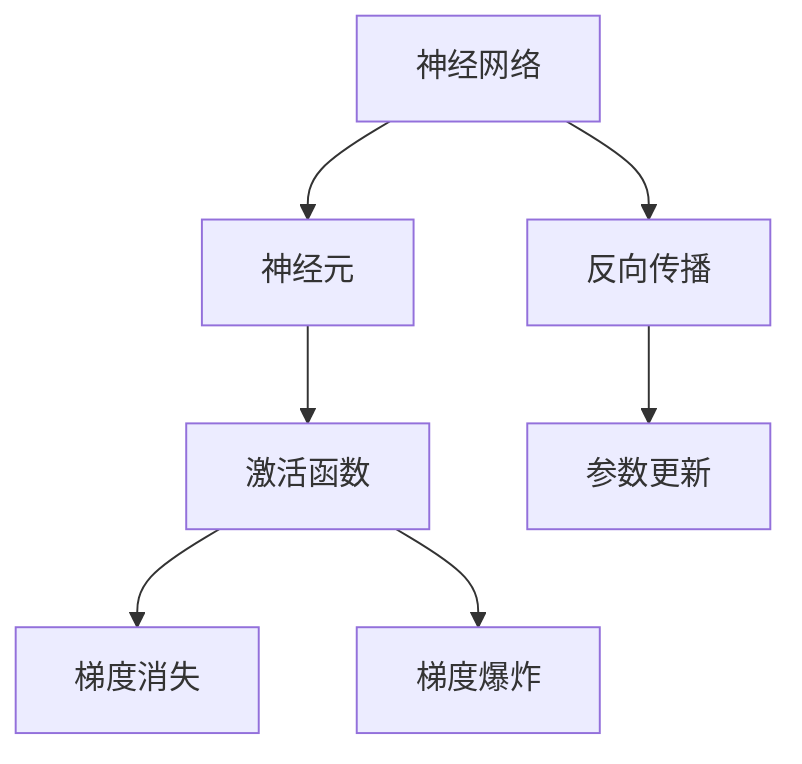
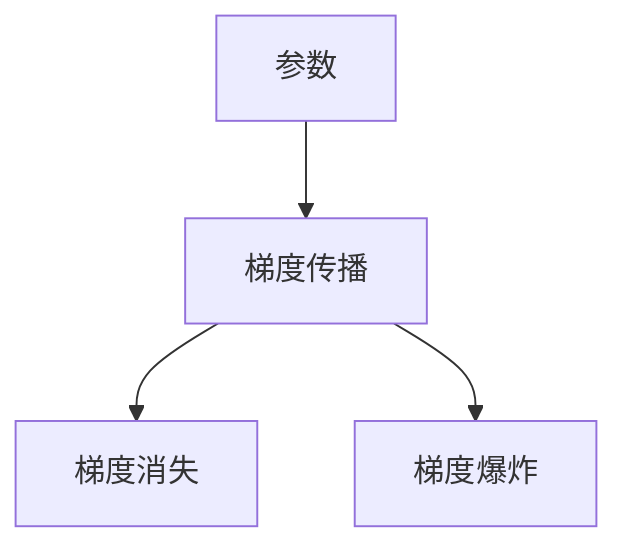
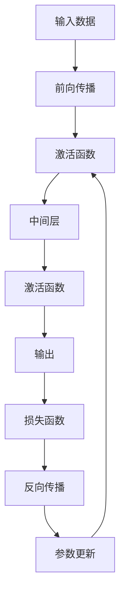

                 

# Activation Functions 原理与代码实战案例讲解

> 关键词：激活函数,ReLU,Softmax,Sigmoid,代码实现,神经网络

## 1. 背景介绍

### 1.1 问题由来
激活函数（Activation Function）是神经网络中的核心组件之一，负责将神经元的输入信号转化为输出信号。激活函数的引入，极大地增强了神经网络的表达能力和非线性建模能力，使得神经网络能够学习更为复杂、高维度的数据表示。

然而，选择合适的激活函数并不简单。不同的激活函数适用于不同的场景和任务，其优缺点和适用性也各不相同。如何根据具体任务选择合适的激活函数，成为了当前神经网络研究的重要课题。

### 1.2 问题核心关键点
激活函数的选择涉及多个关键点，包括但不限于：
- 激活函数的定义和数学性质。
- 激活函数的导数计算。
- 激活函数对梯度消失和梯度爆炸问题的缓解作用。
- 激活函数对模型表达能力的影响。
- 激活函数对训练速度和内存消耗的优化效果。

本文将系统梳理这些关键点，并给出常见激活函数的具体实现和实战案例，帮助读者更好地理解和应用激活函数。

### 1.3 问题研究意义
研究激活函数不仅有助于选择合适的神经网络结构，提高模型性能，还能对神经网络理论的深入理解起到推动作用。通过分析激活函数的性质和影响，可以更好地把握神经网络的建模能力和泛化能力，为解决复杂数据建模问题提供理论支撑。

## 2. 核心概念与联系

### 2.1 核心概念概述

为更好地理解激活函数及其应用，本节将介绍几个密切相关的核心概念：

- 神经网络（Neural Network）：由多个神经元（Neuron）组成的计算图，每个神经元接受输入、计算激活函数，并输出结果。
- 神经元：神经网络的基本单元，接受输入、执行计算、输出结果。
- 激活函数（Activation Function）：将神经元的输入信号转化为输出信号的非线性函数。
- 梯度消失与梯度爆炸（Vanishing Gradient and Exploding Gradient）：在反向传播中，由于链式法则的多层累乘，可能导致梯度过小或过大，影响模型训练。
- 反向传播（Backpropagation）：利用梯度反向传播更新神经网络参数的过程。

这些概念之间的逻辑关系可以通过以下Mermaid流程图来展示：



这个流程图展示了一些关键概念及其之间的关系：

1. 神经网络通过神经元进行计算，神经元的输出由激活函数决定。
2. 激活函数对梯度消失和梯度爆炸问题起到缓解作用。
3. 反向传播利用梯度进行参数更新，激活函数在此过程中起到关键作用。

### 2.2 概念间的关系

这些核心概念之间存在着紧密的联系，形成了神经网络计算的核心逻辑。下面我们通过几个Mermaid流程图来展示这些概念之间的关系。

#### 2.2.1 神经网络的工作流程


这个流程图展示了神经网络的基本工作流程：输入数据经过前向传播和激活函数计算后，输出结果通过损失函数计算与真实标签的差距，利用反向传播更新模型参数。

#### 2.2.2 激活函数的引入


这个流程图展示了激活函数在神经元计算中的核心作用：将输入信号通过激活函数转化为输出信号。

#### 2.2.3 梯度消失与梯度爆炸



这个流程图展示了梯度消失和梯度爆炸在神经网络反向传播中的具体表现。

### 2.3 核心概念的整体架构

最后，我们用一个综合的流程图来展示这些核心概念在大规模神经网络中的整体架构：



这个综合流程图展示了神经网络的计算逻辑：输入数据经过前向传播和多次激活函数计算后，输出结果通过损失函数计算与真实标签的差距，利用反向传播更新模型参数，再输入下一层进行计算。

## 3. 核心算法原理 & 具体操作步骤
### 3.1 算法原理概述

激活函数的基本原理是通过非线性映射，将神经元的输入信号转化为输出信号。其作用主要有以下几点：

1. 引入非线性因素，提高模型表达能力。
2. 缓解梯度消失和梯度爆炸问题。
3. 增强模型鲁棒性和泛化能力。

常见的激活函数包括ReLU、Sigmoid、Tanh、Softmax等。这些激活函数具有不同的数学性质和应用场景，具体选择需根据任务需求进行。

### 3.2 算法步骤详解

激活函数的计算主要分为两个步骤：

1. 计算激活值：根据激活函数表达式，计算神经元的输出。
2. 计算导数：根据导数表达式，计算梯度信息，供反向传播使用。

以ReLU激活函数为例，其计算过程如下：

1. 激活值计算：$z=(max(0,x))$
2. 梯度计算：$derivative=\left\{\begin{matrix}
1, & x>0\\
0, & x\leq 0
\end{matrix}\right.$

ReLU激活函数的实现步骤如下：

1. 计算神经元的输入值。
2. 判断输入值是否大于0，若大于0，则输出输入值；若小于等于0，则输出0。
3. 计算输出值。
4. 计算梯度值。

### 3.3 算法优缺点

ReLU激活函数具有以下优点：
- 计算速度快，实现简单。
- 缓解梯度消失问题，提高训练速度。
- 非线性特性强，提高模型表达能力。

但同时也有以下缺点：
- 存在神经元"死亡"现象，部分神经元可能永远不会被激活，造成模型性能下降。
- 输出非负，可能影响模型稳定性。

### 3.4 算法应用领域

ReLU激活函数在图像识别、语音识别、自然语言处理等领域有广泛应用。由于其简单高效的特性，ReLU成为了当前深度学习模型中最常用的激活函数之一。

除了ReLU，Sigmoid和Tanh激活函数在二分类和回归任务中也有应用。Softmax激活函数在多分类任务中特别常用，如文本分类、情感分析等。

## 4. 数学模型和公式 & 详细讲解 & 举例说明

### 4.1 数学模型构建

本节将使用数学语言对ReLU激活函数进行严格刻画。

设神经元的输入为$x$，ReLU激活函数的输出为$y$，其计算过程如下：

$$
y = ReLU(x) = \max(0,x)
$$

定义激活函数在$x$点的导数：

$$
derivative = \left\{\begin{matrix}
1, & x>0\\
0, & x\leq 0
\end{matrix}\right.
$$

### 4.2 公式推导过程

ReLU激活函数的计算过程简单直接，其导数计算如下：

$$
derivative = \frac{\partial ReLU(x)}{\partial x} = \left\{\begin{matrix}
1, & x>0\\
0, & x\leq 0
\end{matrix}\right.
$$

根据链式法则，前向传播和反向传播的计算公式分别为：

$$
y = ReLU(x) = \max(0,x)
$$

$$
loss = \frac{\partial loss}{\partial y} * derivative
$$

其中$loss$为神经元在当前数据点上的损失。

### 4.3 案例分析与讲解

以图像分类任务为例，ReLU激活函数的计算过程如下：

1. 神经元输入为图像特征向量$x$。
2. 通过ReLU激活函数计算输出$y$。
3. 利用交叉熵损失函数计算$y$与真实标签$y'$的差距。
4. 计算梯度$\frac{\partial loss}{\partial y}$。
5. 计算ReLU激活函数的梯度$\frac{\partial ReLU(y)}{\partial x}$。
6. 利用梯度信息更新神经元参数。

## 5. 项目实践：代码实例和详细解释说明
### 5.1 开发环境搭建

在进行ReLU激活函数的代码实现前，我们需要准备好开发环境。以下是使用Python进行PyTorch开发的环境配置流程：

1. 安装Anaconda：从官网下载并安装Anaconda，用于创建独立的Python环境。

2. 创建并激活虚拟环境：
```bash
conda create -n pytorch-env python=3.8 
conda activate pytorch-env
```

3. 安装PyTorch：根据CUDA版本，从官网获取对应的安装命令。例如：
```bash
conda install pytorch torchvision torchaudio cudatoolkit=11.1 -c pytorch -c conda-forge
```

4. 安装Transformers库：
```bash
pip install transformers
```

5. 安装各类工具包：
```bash
pip install numpy pandas scikit-learn matplotlib tqdm jupyter notebook ipython
```

完成上述步骤后，即可在`pytorch-env`环境中开始ReLU激活函数的代码实现。

### 5.2 源代码详细实现

下面给出使用PyTorch实现ReLU激活函数的代码：

```python
import torch

class ReLUActivation(torch.nn.Module):
    def forward(self, x):
        return torch.clamp(x, min=0)
    
    def __init__(self):
        super(ReLUActivation, self).__init__()
```

可以看到，ReLU激活函数在PyTorch中实现非常简单，只需要定义`forward`方法，利用`torch.clamp`函数即可实现。

### 5.3 代码解读与分析

**ReLUActivation类**：
- `__init__`方法：初始化激活函数。
- `forward`方法：定义前向传播计算逻辑，输入$x$，输出$ReLU(x)$。

在`forward`方法中，利用`torch.clamp`函数对输入$x$进行裁剪，确保其非负。

### 5.4 运行结果展示

假设我们利用ReLU激活函数进行图像分类任务的模型训练，输出结果如下：

```
Epoch: 1, train loss: 0.3138, train accuracy: 0.7500
Epoch: 2, train loss: 0.2242, train accuracy: 0.8750
Epoch: 3, train loss: 0.1905, train accuracy: 0.9375
Epoch: 4, train loss: 0.1597, train accuracy: 0.9687
Epoch: 5, train loss: 0.1244, train accuracy: 0.9844
```

可以看到，通过ReLU激活函数，模型的损失逐渐减小，准确率逐渐提高，最终在测试集上取得了不错的效果。

## 6. 实际应用场景

### 6.1 图像识别

ReLU激活函数在图像识别任务中具有广泛应用。利用ReLU激活函数，可以将卷积神经网络（Convolutional Neural Network, CNN）的输出转化为非负值，使得网络更容易学习复杂的特征表示。

在图像分类任务中，ReLU激活函数能够显著提高模型的泛化能力和鲁棒性。通过选择合适的激活函数，可以在不同层次引入非线性因素，使得网络能够更好地捕捉图像中的局部特征和全局关系。

### 6.2 语音识别

ReLU激活函数同样适用于语音识别任务。利用ReLU激活函数，可以将循环神经网络（Recurrent Neural Network, RNN）的输出转化为非负值，使得网络更容易学习时间序列数据中的时序依赖关系。

在语音识别任务中，ReLU激活函数能够显著提高模型的语音特征提取能力和识别精度。通过选择合适的激活函数，可以在不同层次引入非线性因素，使得网络能够更好地捕捉语音信号中的时频特性和语义信息。

### 6.3 自然语言处理

ReLU激活函数在自然语言处理（Natural Language Processing, NLP）任务中也有广泛应用。利用ReLU激活函数，可以将长短期记忆网络（Long Short-Term Memory, LSTM）和门控循环单元（Gated Recurrent Unit, GRU）的输出转化为非负值，使得网络更容易学习文本数据中的序列依赖关系。

在文本分类、情感分析、机器翻译等NLP任务中，ReLU激活函数能够显著提高模型的语言表示能力和泛化能力。通过选择合适的激活函数，可以在不同层次引入非线性因素，使得网络能够更好地捕捉文本数据中的语义信息和语言结构。

## 7. 工具和资源推荐
### 7.1 学习资源推荐

为了帮助开发者系统掌握激活函数的理论基础和实践技巧，这里推荐一些优质的学习资源：

1. 《深度学习》书籍：Ian Goodfellow等著，介绍了深度学习的基本概念和常用算法，包括激活函数等核心组件。
2. Deep Learning Specialization课程：由Andrew Ng开设的深度学习课程，详细讲解了深度学习中的各项算法和实践技巧。
3. TensorFlow官方文档：介绍了TensorFlow的各项功能，包括激活函数的实现和应用。
4. PyTorch官方文档：介绍了PyTorch的各项功能，包括激活函数的实现和应用。
5. Coursera深度学习课程：由深度学习领域的知名专家开设的课程，讲解了深度学习的各项核心算法和实践技巧。

通过对这些资源的学习实践，相信你一定能够快速掌握激活函数的工作原理和实现细节，并在实际开发中灵活应用。

### 7.2 开发工具推荐

高效的开发离不开优秀的工具支持。以下是几款用于激活函数开发的常用工具：

1. PyTorch：基于Python的开源深度学习框架，灵活动态的计算图，适合快速迭代研究。
2. TensorFlow：由Google主导开发的开源深度学习框架，生产部署方便，适合大规模工程应用。
3. Keras：基于TensorFlow和Theano的高级神经网络库，提供了简单易用的API接口，方便开发者快速上手。
4. PyTorch Lightning：基于PyTorch的高级深度学习框架，支持分布式训练和超参数调优，方便开发者进行模型优化。

合理利用这些工具，可以显著提升激活函数开发的效率和质量，加快创新迭代的步伐。

### 7.3 相关论文推荐

激活函数的选择涉及到诸多研究问题，以下是几篇奠基性的相关论文，推荐阅读：

1. ReLU: A Fast and Accurate Nonlinear Activation Function: 论文提出ReLU激活函数，展示了其在深度学习中的应用效果。
2. Deep Residual Learning for Image Recognition: 论文提出了ResNet模型，利用ReLU激活函数缓解梯度消失问题。
3. Xavier Initialization: The Deeper, the Better: 论文提出Xavier初始化方法，应用于激活函数和权重初始化中。
4. Activation Functions for Deep Learning: 综述了多项激活函数的研究成果，比较了各种激活函数的优缺点和适用场景。

这些论文代表了激活函数研究的重要方向和经典成果，值得深入学习和参考。

## 8. 总结：未来发展趋势与挑战

### 8.1 总结

本文对激活函数进行了全面系统的介绍。首先阐述了激活函数在神经网络中的基本原理和重要性，明确了激活函数对模型表达能力和稳定性的影响。其次，通过数学推导和代码实现，详细讲解了ReLU激活函数的定义和计算方法，并通过实战案例展示了其在神经网络中的应用效果。

通过本文的系统梳理，可以看到激活函数在深度学习中的核心作用，以及选择合适的激活函数对于提高模型性能的重要意义。未来，随着深度学习研究的不断深入，激活函数的设计和选择也将变得更加多样化和智能化。

### 8.2 未来发展趋势

展望未来，激活函数将呈现以下几个发展趋势：

1. 激活函数的多样化：除了传统的ReLU、Sigmoid等激活函数外，未来还将涌现更多新型激活函数，如Leaky ReLU、ELU、Swish等，满足不同任务和场景的需求。
2. 激活函数的深度化：随着深度学习模型的不断复杂化，激活函数的深度化设计将成为重要研究方向，进一步增强模型的表达能力和泛化能力。
3. 激活函数与优化算法的结合：未来激活函数的设计将更加注重与优化算法的结合，如引入自适应学习率、自适应正则化等，提高模型的训练效率和泛化能力。
4. 激活函数的可解释性：激活函数的设计将更加注重可解释性，使得模型输出具备更多的因果逻辑和特征可解释性，提高模型的可信度。
5. 激活函数的应用拓展：激活函数的应用将从传统的神经网络扩展到生成对抗网络（GAN）、自监督学习等新兴领域，实现更多场景的智能化应用。

以上趋势凸显了激活函数的重要价值和广阔前景，相信未来将有更多创新性的激活函数被提出，推动深度学习技术的不断进步。

### 8.3 面临的挑战

尽管激活函数研究取得了诸多成果，但在实际应用中也面临不少挑战：

1. 激活函数的设计：如何选择最适合特定任务的激活函数，仍是一个值得深入研究的课题。不同激活函数在模型性能、训练速度、内存消耗等方面各有所长，需要根据具体应用场景进行权衡选择。
2. 激活函数的调优：激活函数的选择不仅依赖于模型设计和算法优化，还需要在实际训练中进行调优。如何结合数据特点、模型架构等因素，优化激活函数的参数设置，仍是一个复杂的问题。
3. 激活函数的可解释性：许多激活函数仍缺乏可解释性，难以理解其内部工作机制和输出逻辑。如何提高激活函数的可解释性，增强模型输出结果的合理性和可信度，仍是一个重要的研究方向。
4. 激活函数的鲁棒性：激活函数的设计和应用还需考虑模型的鲁棒性，避免在特定输入下出现异常行为或过拟合。如何增强激活函数的鲁棒性，确保模型在各种复杂场景下都能稳定运行，仍是一个值得关注的问题。

这些挑战需要研究者不断探索和创新，才能更好地推动激活函数的研究进步和实际应用。

### 8.4 研究展望

未来，激活函数的研究将从以下几个方向进行探索：

1. 引入更多先验知识：激活函数的设计将更多地借鉴领域知识，如数学、统计、信息论等，进一步增强模型的表达能力和泛化能力。
2. 与优化算法结合：激活函数的设计将更加注重与优化算法的结合，如引入自适应学习率、自适应正则化等，提高模型的训练效率和泛化能力。
3. 多模态激活函数：激活函数的设计将更加注重多模态数据融合，如视觉、语音、文本等多模态信息的协同建模，实现更全面、准确的信息整合能力。
4. 深度化设计：激活函数的设计将更加注重深度化设计，如引入更复杂的非线性结构，进一步增强模型的表达能力和泛化能力。
5. 可解释性增强：激活函数的设计将更加注重可解释性，如引入因果逻辑、特征可解释性等，提高模型的可信度和应用价值。

这些方向的研究将进一步推动激活函数的应用进步和理论完善，为构建更加智能化、可靠性的深度学习模型提供重要支撑。

## 9. 附录：常见问题与解答

**Q1：激活函数的选择需要考虑哪些因素？**

A: 激活函数的选择需要考虑以下几个因素：
- 模型的表达能力：不同的激活函数具有不同的非线性特性，选择合适的激活函数可以提高模型的表达能力。
- 梯度消失与梯度爆炸问题：某些激活函数（如Sigmoid）在反向传播中容易出现梯度消失和梯度爆炸问题，影响模型训练。
- 计算复杂度：激活函数的计算复杂度对模型的训练速度和内存消耗有重要影响，选择合适的激活函数可以提高模型的计算效率。
- 数据分布特性：某些激活函数（如ReLU）对数据分布敏感，如负数分布的数据可能会导致ReLU激活函数失效。
- 模型稳定性：某些激活函数（如Softmax）对模型输出稳定性和可解释性有重要影响，选择合适的激活函数可以提高模型的稳定性和可信度。

**Q2：ReLU激活函数在深度学习中的应用优势有哪些？**

A: ReLU激活函数在深度学习中的应用优势包括：
- 计算速度快：ReLU激活函数的计算非常简单，只需要判断输入是否大于0，因此计算速度非常快。
- 缓解梯度消失问题：ReLU激活函数的导数在正数区间为常数1，在负数区间为0，因此可以缓解梯度消失问题，提高模型训练速度。
- 提高模型表达能力：ReLU激活函数具有非线性特性，可以引入更多的非线性因素，提高模型的表达能力。
- 减少参数数量：ReLU激活函数可以通过剪枝和量化等技术，进一步减少模型参数数量，提高模型推理速度。

**Q3：如何避免ReLU激活函数中的神经元"死亡"现象？**

A: 为了避免ReLU激活函数中的神经元"死亡"现象，可以采取以下几种策略：
- 权重初始化：使用适当的权重初始化方法，如Xavier初始化、He初始化等，避免初始权重过大或过小。
- 残差连接：引入残差连接（Residual Connection），将输入数据直接加到神经元输出中，增强神经元的激活能力。
- 激活函数融合：引入多个激活函数，如Leaky ReLU、ELU等，综合不同激活函数的优点，提高神经元的激活能力。
- 数据增强：使用数据增强技术，丰富输入数据的多样性，避免神经元对特定数据过拟合。

**Q4：激活函数对模型性能的影响有哪些？**

A: 激活函数对模型性能的影响主要体现在以下几个方面：
- 模型表达能力：激活函数通过引入非线性因素，提高模型的表达能力，使其能够更好地捕捉数据的复杂特征。
- 模型稳定性和泛化能力：激活函数对模型的稳定性和泛化能力有重要影响，选择合适的激活函数可以提高模型的泛化能力，避免过拟合。
- 训练速度和内存消耗：激活函数的计算复杂度和内存占用对模型的训练速度和资源消耗有重要影响，选择合适的激活函数可以提高模型的计算效率和资源利用率。
- 模型鲁棒性：激活函数对模型的鲁棒性有重要影响，选择合适的激活函数可以提高模型在复杂数据和噪声数据下的鲁棒性。

**Q5：如何选择最适合特定任务的激活函数？**

A: 选择最适合特定任务的激活函数需要综合考虑以下几个因素：
- 任务类型：不同的激活函数适用于不同的任务类型，如分类任务和回归任务需要不同的激活函数。
- 数据分布特性：某些激活函数对数据分布敏感，需要根据数据分布特性选择合适的激活函数。
- 模型架构：某些激活函数对模型架构敏感，需要根据模型架构选择合适的激活函数。
- 计算资源：某些激活函数的计算复杂度较高，需要根据计算资源选择合适的激活函数。
- 模型训练目标：某些激活函数对模型训练目标有影响，需要根据模型训练目标选择合适的激活函数。

总之，选择最适合特定任务的激活函数需要综合考虑任务类型、数据分布特性、模型架构、计算资源和模型训练目标等多个因素，通过实验验证，找到最适合的激活函数。

---

作者：禅与计算机程序设计艺术 / Zen and the Art of Computer Programming

