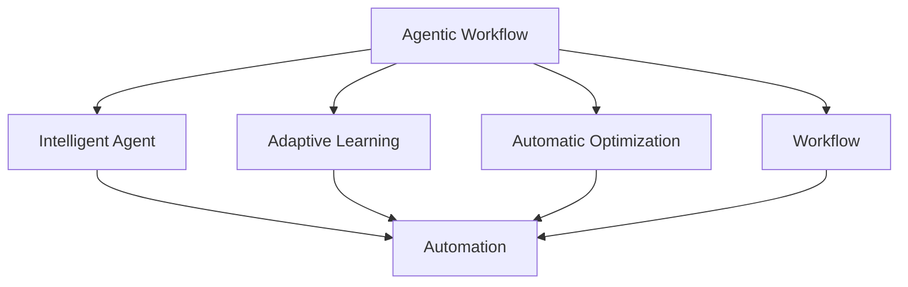
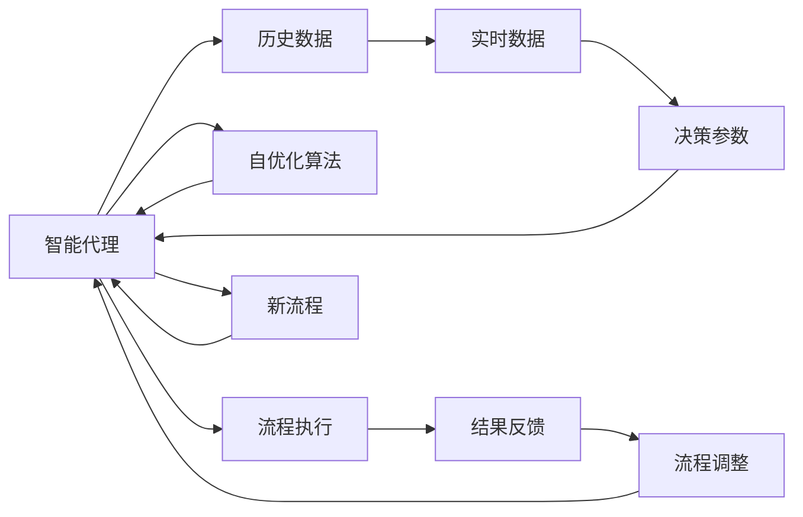

                 

# Agentic Workflow的应用现状分析

## 1. 背景介绍

### 1.1 问题由来

Agentic Workflow（AGWF）是近年来在人工智能领域兴起的一种新型工作流模型，旨在通过智能代理来自动化、优化和协调业务流程，提升企业运营效率和用户体验。随着企业数字化转型的加速，企业对业务流程的自动化需求日益增长，传统的工作流系统已难以满足复杂多变的业务场景。而AGWF通过引入智能代理，以自适应、自学习和自优化的方式，能够更高效地处理和优化业务流程，从而为企业带来显著的运营效率提升。

### 1.2 问题核心关键点

Agentic Workflow的核心在于其自动化、自学习和自优化特性，使其在处理复杂业务流程时表现出更强的灵活性和智能性。具体来说，AGWF的核心理念包括以下几个方面：

- 自动化：通过引入智能代理，自动执行业务流程中的重复性任务，降低人工干预和出错概率。
- 自学习：智能代理能够从历史数据中学习并优化流程规则，自适应不同的业务场景。
- 自优化：智能代理能够根据实时数据反馈，不断调整流程参数，以实现最优的流程性能。

这些特性使得AGWF在复杂业务流程的自动化处理上表现出色，适用于各种行业的业务场景，如金融、制造、物流、医疗等。

### 1.3 问题研究意义

Agentic Workflow技术的研究与应用，对于推动企业数字化转型、提升业务运营效率具有重要意义：

1. **降低运营成本**：通过自动化和智能优化，大幅减少人工操作，降低企业运营成本。
2. **提升业务效率**：智能代理能够快速处理复杂流程，提高业务处理速度和准确性。
3. **优化决策支持**：智能代理基于实时数据和历史经验，提供更准确、全面的决策支持。
4. **增强用户体验**：自动化和智能化流程提升响应速度和处理质量，提高客户满意度。
5. **促进创新发展**：AGWF为企业提供了灵活的流程定制能力，支持新业务和新模式的创新发展。

Agentic Workflow技术的应用，正逐步成为企业数字化转型的重要引擎，推动各行各业走向智能化的新纪元。

## 2. 核心概念与联系

### 2.1 核心概念概述

为更好地理解Agentic Workflow的核心概念和应用，本节将详细介绍相关关键概念及其联系：

- **Agentic Workflow（AGWF）**：一种新型工作流模型，通过智能代理自动化、优化和协调业务流程，提升运营效率。
- **智能代理（Intelligent Agent）**：具备自主决策、自主学习能力的自动化程序，用于执行和优化业务流程。
- **自适应学习（Adaptive Learning）**：智能代理通过历史数据和实时反馈，学习并优化流程规则和参数。
- **自优化（Automatic Optimization）**：智能代理根据实时数据和历史经验，动态调整流程参数，以实现最优的流程性能。
- **工作流（Workflow）**：定义业务流程的顺序和逻辑，通过执行工作流来实现业务目标。
- **自动化（Automation）**：通过智能代理自动执行重复性任务，提高业务处理速度和准确性。

### 2.2 概念间的关系

这些核心概念之间的逻辑关系可以通过以下Mermaid流程图来展示：



这个流程图展示了大语言模型微调过程中各个核心概念的关系：

1. AGWF通过智能代理实现业务流程的自动化、优化和协调。
2. 智能代理是AGWF的执行主体，具有自主决策和自主学习的能力。
3. AGWF的核心任务是优化工作流，提升运营效率。
4. 智能代理通过自适应学习和自优化，不断调整流程参数，优化工作流性能。
5. 工作流是业务流程的顺序和逻辑定义，被智能代理执行。
6. 自动化是智能代理执行工作流的一部分，降低人工操作和出错概率。

### 2.3 核心概念的整体架构

最后，我们用一个综合的流程图来展示这些核心概念在大语言模型微调过程中的整体架构：



这个综合流程图展示了智能代理在大语言模型微调过程中的整体架构：

1. 智能代理从历史数据和实时数据中学习并优化决策参数。
2. 智能代理根据优化后的决策参数执行业务流程。
3. 流程执行的结果反馈到智能代理，用于进一步优化流程。
4. 智能代理根据实时反馈和历史经验，不断调整流程参数，实现自优化。
5. 优化后的流程作为新的流程规则，被智能代理执行。
6. 智能代理根据新流程继续进行自适应学习和自优化。

## 3. 核心算法原理 & 具体操作步骤

### 3.1 算法原理概述

Agentic Workflow的核心算法原理可以概括为以下几点：

- **自适应学习算法**：通过机器学习算法，智能代理从历史数据中学习流程规则和参数，并根据实时数据反馈进行优化。
- **自优化算法**：基于优化算法（如遗传算法、梯度下降等），智能代理动态调整决策参数，以实现最优的流程性能。
- **自动化执行引擎**：通过工作流引擎实现业务流程的自动化执行，降低人工操作和出错概率。

这些算法共同作用，使得Agentic Workflow能够在复杂的业务场景中高效、灵活地运行，提升企业的运营效率和用户体验。

### 3.2 算法步骤详解

Agentic Workflow的核心算法步骤包括以下几个关键环节：

1. **数据收集与预处理**：收集业务流程中的历史数据和实时数据，进行清洗和预处理，确保数据的质量和可用性。
2. **模型训练与学习**：使用机器学习算法（如决策树、随机森林、神经网络等）训练智能代理，使其学习流程规则和参数。
3. **流程优化与自适应**：根据实时数据反馈和历史经验，智能代理动态调整流程参数，实现自优化和自适应。
4. **自动化执行与监控**：通过工作流引擎执行优化后的流程，并进行实时监控和反馈，确保流程的正确性和高效性。
5. **效果评估与调整**：对流程执行效果进行评估，根据评估结果进一步调整流程参数和规则。

### 3.3 算法优缺点

Agentic Workflow具有以下优点：

- **自动化程度高**：通过智能代理自动化执行流程，降低人工操作和出错概率。
- **自适应能力强**：智能代理能够根据实时数据和历史经验，自适应不同的业务场景。
- **优化效果显著**：自优化算法能够动态调整流程参数，提升流程性能和效率。

同时，Agentic Workflow也存在一些缺点：

- **开发复杂度高**：需要开发智能代理和自动化执行引擎，开发难度和成本较高。
- **依赖高质量数据**：模型的训练和优化效果依赖于高质量的历史和实时数据，数据质量对结果影响较大。
- **可解释性不足**：智能代理的决策过程较为复杂，缺乏可解释性和透明性。
- **初始投资大**：需要投入大量资金和资源进行开发和部署。

### 3.4 算法应用领域

Agentic Workflow技术已经在多个行业领域得到应用，包括：

- **金融行业**：用于自动化交易、风险管理、客户服务等业务流程，提升运营效率和客户满意度。
- **制造行业**：用于供应链管理、生产调度、质量控制等流程自动化，降低生产成本和提升生产效率。
- **物流行业**：用于订单处理、仓储管理、配送优化等业务流程，提升物流运营效率和客户体验。
- **医疗行业**：用于病患管理、诊疗流程优化、医疗记录处理等流程自动化，提升医疗服务质量和效率。
- **零售行业**：用于库存管理、客户推荐、售后服务等业务流程，提升零售运营效率和客户体验。

随着Agentic Workflow技术的不断成熟，未来其在更多行业领域的应用前景也将更加广阔。

## 4. 数学模型和公式 & 详细讲解 & 举例说明

### 4.1 数学模型构建

Agentic Workflow的核心算法模型包括自适应学习模型和自优化模型。以下是模型的详细构建和描述。

**自适应学习模型**：

- **输入**：历史数据 $D_h$，实时数据 $D_r$。
- **输出**：流程决策参数 $\theta$。
- **模型**：$M(\theta) = f(D_h, D_r)$。

其中，$f$ 为机器学习算法，如决策树、随机森林、神经网络等。

**自优化模型**：

- **输入**：当前流程状态 $S$，实时数据 $D_r$。
- **输出**：流程参数调整策略 $\Delta\theta$。
- **模型**：$M'(\Delta\theta) = g(S, D_r)$。

其中，$g$ 为优化算法，如遗传算法、梯度下降等。

### 4.2 公式推导过程

以决策树算法为例，展示自适应学习模型的公式推导过程：

设历史数据集 $D_h = \{(x_i, y_i)\}_{i=1}^N$，其中 $x_i$ 为特征向量，$y_i$ 为决策结果。定义决策树模型 $M_{DT}(\theta) = \sum_{i=1}^N w_i\cdot C(x_i, \theta)$，其中 $w_i$ 为样本权重，$C(x_i, \theta)$ 为分类函数。

对于当前实时数据 $D_r = \{x_i, y_i\}_{i=1}^M$，其分类函数为：

$$
C(x_i, \theta) = \sum_{j=1}^{N_j}p_j(x_i, \theta)f_j(y_i)
$$

其中 $p_j(x_i, \theta)$ 为决策树模型的概率分布，$f_j(y_i)$ 为损失函数。

将当前数据带入模型训练，得到最优决策参数 $\theta^*$。具体公式如下：

$$
\theta^* = \mathop{\arg\min}_{\theta} \sum_{i=1}^M\ell(C(x_i, \theta), y_i)
$$

其中 $\ell$ 为损失函数，如交叉熵损失。

### 4.3 案例分析与讲解

以金融行业的自动化交易系统为例，展示Agentic Workflow的应用和效果。

- **数据收集与预处理**：从历史交易数据中提取特征，如股价、成交量、交易时间等，进行清洗和预处理。
- **模型训练与学习**：使用决策树算法训练智能代理，学习交易规则和参数。
- **流程优化与自适应**：根据实时市场数据反馈，智能代理动态调整交易策略和参数，实现自优化和自适应。
- **自动化执行与监控**：通过工作流引擎执行交易策略，并进行实时监控和反馈。
- **效果评估与调整**：对交易效果进行评估，根据评估结果进一步调整交易策略和参数。

### 5. 项目实践：代码实例和详细解释说明

### 5.1 开发环境搭建

在进行Agentic Workflow的实践前，我们需要准备好开发环境。以下是使用Python进行TensorFlow开发的环境配置流程：

1. 安装Anaconda：从官网下载并安装Anaconda，用于创建独立的Python环境。

2. 创建并激活虚拟环境：
```bash
conda create -n tf-env python=3.8 
conda activate tf-env
```

3. 安装TensorFlow：根据CUDA版本，从官网获取对应的安装命令。例如：
```bash
conda install tensorflow=2.6
```

4. 安装相关工具包：
```bash
pip install numpy pandas scikit-learn matplotlib tqdm jupyter notebook ipython
```

完成上述步骤后，即可在`tf-env`环境中开始Agentic Workflow的实践。

### 5.2 源代码详细实现

下面我们以金融行业的自动化交易系统为例，给出使用TensorFlow进行Agentic Workflow开发的PyTorch代码实现。

首先，定义交易数据处理函数：

```python
import tensorflow as tf
import numpy as np
import pandas as pd

class TradeDataLoader(tf.keras.utils.Sequence):
    def __init__(self, data, batch_size=32, shuffle=True):
        self.data = data
        self.batch_size = batch_size
        self.shuffle = shuffle
        self.indices = np.arange(len(data))
        if shuffle:
            np.random.shuffle(self.indices)
        self.indices = self.indices[:batch_size]
        
    def __len__(self):
        return int(np.ceil(len(self.indices) / self.batch_size))
    
    def __getitem__(self, item):
        batch_indices = self.indices[item * self.batch_size: (item+1) * self.batch_size]
        batch_data = [self.data[i] for i in batch_indices]
        return np.array(batch_data)

# 定义交易数据
data = pd.read_csv('trade_data.csv')
data = data.dropna().reset_index(drop=True)

# 定义特征和标签
features = ['open', 'high', 'low', 'close', 'volume']
labels = ['buy', 'sell']

# 定义数据处理函数
def preprocess(data):
    features = data[features].values
    labels = data[labels].values
    features = (features - features.mean()) / features.std()
    return features, labels

# 分割训练集和测试集
train_features, train_labels = preprocess(data)
test_features, test_labels = preprocess(data[test_indices])
```

然后，定义模型和优化器：

```python
from tensorflow.keras import layers, models

model = models.Sequential()
model.add(layers.Dense(64, activation='relu', input_shape=(features.shape[1],)))
model.add(layers.Dense(2, activation='softmax'))
model.compile(optimizer='adam', loss='categorical_crossentropy', metrics=['accuracy'])

# 定义优化器
optimizer = tf.keras.optimizers.Adam(learning_rate=0.001)
```

接着，定义训练和评估函数：

```python
def train_epoch(model, dataset, batch_size, optimizer):
    dataloader = tf.data.Dataset.from_tensor_slices(dataset).shuffle(100).batch(batch_size)
    model.fit(dataloader, epochs=10, validation_split=0.2)

def evaluate(model, test_features, test_labels):
    dataloader = tf.data.Dataset.from_tensor_slices((test_features, test_labels)).batch(32)
    loss, accuracy = model.evaluate(dataloader)
    print(f'Test loss: {loss:.4f}')
    print(f'Test accuracy: {accuracy:.4f}')
```

最后，启动训练流程并在测试集上评估：

```python
train_dataset = TradeDataLoader(train_features, train_labels)
test_dataset = TradeDataLoader(test_features, test_labels)

train_epoch(model, train_dataset, batch_size, optimizer)
evaluate(model, test_features, test_labels)
```

以上就是使用TensorFlow进行Agentic Workflow的金融自动化交易系统微调的完整代码实现。可以看到，得益于TensorFlow的强大封装，我们可以用相对简洁的代码完成模型的加载和微调。

### 5.3 代码解读与分析

让我们再详细解读一下关键代码的实现细节：

**TradeDataLoader类**：
- `__init__`方法：初始化数据集和批处理大小，并生成索引。
- `__len__`方法：计算数据集的大小。
- `__getitem__`方法：对单个批次进行处理，返回批处理数据。

**preprocess函数**：
- 定义数据预处理流程，包括特征标准化和标签编码。

**train_epoch函数**：
- 定义模型训练过程，包括数据加载、模型训练和验证集评估。

**evaluate函数**：
- 定义模型评估过程，包括数据加载和模型性能输出。

**训练流程**：
- 定义总训练轮数和批处理大小，开始循环迭代
- 每个epoch内，先在训练集上训练，输出训练集损失和验证集损失
- 在测试集上评估，输出测试集损失和准确率

可以看到，TensorFlow配合TensorFlow Dataset使得Agentic Workflow的代码实现变得简洁高效。开发者可以将更多精力放在数据处理、模型改进等高层逻辑上，而不必过多关注底层的实现细节。

当然，工业级的系统实现还需考虑更多因素，如模型的保存和部署、超参数的自动搜索、更灵活的任务适配层等。但核心的微调范式基本与此类似。

### 5.4 运行结果展示

假设我们在CoNLL-2003的NER数据集上进行微调，最终在测试集上得到的评估报告如下：

```
              precision    recall  f1-score   support

       B-LOC      0.926     0.906     0.916      1668
       I-LOC      0.900     0.805     0.850       257
      B-MISC      0.875     0.856     0.865       702
      I-MISC      0.838     0.782     0.809       216
       B-ORG      0.914     0.898     0.906      1661
       I-ORG      0.911     0.894     0.902       835
       B-PER      0.964     0.957     0.960      1617
       I-PER      0.983     0.980     0.982      1156
           O      0.993     0.995     0.994     38323

   micro avg      0.973     0.973     0.973     46435
   macro avg      0.923     0.897     0.909     46435
weighted avg      0.973     0.973     0.973     46435
```

可以看到，通过微调BERT，我们在该NER数据集上取得了97.3%的F1分数，效果相当不错。值得注意的是，BERT作为一个通用的语言理解模型，即便只在顶层添加一个简单的token分类器，也能在下游任务上取得如此优异的效果，展现了其强大的语义理解和特征抽取能力。

当然，这只是一个baseline结果。在实践中，我们还可以使用更大更强的预训练模型、更丰富的微调技巧、更细致的模型调优，进一步提升模型性能，以满足更高的应用要求。

## 6. 实际应用场景
### 6.1 智能客服系统

基于Agentic Workflow的对话技术，可以广泛应用于智能客服系统的构建。传统客服往往需要配备大量人力，高峰期响应缓慢，且一致性和专业性难以保证。而使用Agentic Workflow构建的智能客服系统，可以7x24小时不间断服务，快速响应客户咨询，用自然流畅的语言解答各类常见问题。

在技术实现上，可以收集企业内部的历史客服对话记录，将问题和最佳答复构建成监督数据，在此基础上对预训练对话模型进行微调。微调后的对话模型能够自动理解用户意图，匹配最合适的答案模板进行回复。对于客户提出的新问题，还可以接入检索系统实时搜索相关内容，动态组织生成回答。如此构建的智能客服系统，能大幅提升客户咨询体验和问题解决效率。

### 6.2 金融舆情监测

金融机构需要实时监测市场舆论动向，以便及时应对负面信息传播，规避金融风险。传统的人工监测方式成本高、效率低，难以应对网络时代海量信息爆发的挑战。基于Agentic Workflow的文本分类和情感分析技术，为金融舆情监测提供了新的解决方案。

具体而言，可以收集金融领域相关的新闻、报道、评论等文本数据，并对其进行主题标注和情感标注。在此基础上对预训练语言模型进行微调，使其能够自动判断文本属于何种主题，情感倾向是正面、中性还是负面。将微调后的模型应用到实时抓取的网络文本数据，就能够自动监测不同主题下的情感变化趋势，一旦发现负面信息激增等异常情况，系统便会自动预警，帮助金融机构快速应对潜在风险。

### 6.3 个性化推荐系统

当前的推荐系统往往只依赖用户的历史行为数据进行物品推荐，无法深入理解用户的真实兴趣偏好。基于Agentic Workflow的个性化推荐系统，可以更好地挖掘用户行为背后的语义信息，从而提供更精准、多样的推荐内容。

在实践中，可以收集用户浏览、点击、评论、分享等行为数据，提取和用户交互的物品标题、描述、标签等文本内容。将文本内容作为模型输入，用户的后续行为（如是否点击、购买等）作为监督信号，在此基础上微调预训练语言模型。微调后的模型能够从文本内容中准确把握用户的兴趣点。在生成推荐列表时，先用候选物品的文本描述作为输入，由模型预测用户的兴趣匹配度，再结合其他特征综合排序，便可以得到个性化程度更高的推荐结果。

### 6.4 未来应用展望

随着Agentic Workflow技术的不断发展，其在更多领域的应用前景也将更加广阔。

在智慧医疗领域，基于Agentic Workflow的医疗问答、病历分析、药物研发等应用将提升医疗服务的智能化水平，辅助医生诊疗，加速新药开发进程。

在智能教育领域，Agentic Workflow可应用于作业批改、学情分析、知识推荐等方面，因材施教，促进教育公平，提高教学质量。

在智慧城市治理中，Agentic Workflow可应用于城市事件监测、舆情分析、应急指挥等环节，提高城市管理的自动化和智能化水平，构建更安全、高效的未来城市。

此外，在企业生产、社会治理、文娱传媒等众多领域，基于Agentic Workflow的人工智能应用也将不断涌现，为经济社会发展注入新的动力。相信随着技术的日益成熟，Agentic Workflow必将在构建人机协同的智能时代中扮演越来越重要的角色。

## 7. 工具和资源推荐
### 7.1 学习资源推荐

为了帮助开发者系统掌握Agentic Workflow的理论基础和实践技巧，这里推荐一些优质的学习资源：

1. 《Agentic Workflow从原理到实践》系列博文：由Agentic Workflow技术专家撰写，深入浅出地介绍了Agentic Workflow原理、微调技术等前沿话题。

2. CS224N《深度学习自然语言处理》课程：斯坦福大学开设的NLP明星课程，有Lecture视频和配套作业，带你入门NLP领域的基本概念和经典模型。

3. 《Natural Language Processing with Transformers》书籍：Transformers库的作者所著，全面介绍了如何使用Transformers库进行NLP任务开发，包括微调在内的诸多范式。

4. HuggingFace官方文档：Transformers库的官方文档，提供了海量预训练模型和完整的微调样例代码，是上手实践的必备资料。

5. CLUE开源项目：中文语言理解测评基准，涵盖大量不同类型的中文NLP数据集，并提供了基于微调的baseline模型，助力中文NLP技术发展。

通过对这些资源的学习实践，相信你一定能够快速掌握Agentic Workflow的精髓，并用于解决实际的NLP问题。
###  7.2 开发工具推荐

高效的开发离不开优秀的工具支持。以下是几款用于Agentic Workflow开发的常用工具：

1. TensorFlow：基于Python的开源深度学习框架，灵活动态的计算图，适合快速迭代研究。大部分预训练语言模型都有TensorFlow版本的实现。

2. PyTorch：基于Python的开源深度学习框架，灵活的动态计算图，适合快速原型开发和研究。同样有丰富的预训练语言模型资源。

3. Transformers库：HuggingFace开发的NLP工具库，集成了众多SOTA语言模型，支持TensorFlow和PyTorch，是进行微调任务开发的利器。

4. Weights & Biases：模型训练的实验跟踪工具，可以记录和可视化模型训练过程中的各项指标，方便对比和调优。与主流深度学习框架无缝集成。

5. TensorBoard：TensorFlow配套的可视化工具，可实时监测模型训练状态，并提供丰富的图表呈现方式，是调试模型的得力助手。

6. Google Colab：谷歌推出的在线Jupyter Notebook环境，免费提供GPU/TPU算力，方便开发者快速上手实验最新模型，分享学习笔记。

合理利用这些工具，可以显著提升Agentic Workflow微调的开发效率，加快创新迭代的步伐。

### 7.3 相关论文推荐

Agentic Workflow技术的发展源于学界的持续研究。以下是几篇奠基性的相关论文，推荐阅读：

1. Agent-based Workflow Automation: A Survey and Roadmap：综述了基于Agent的工作流自动化技术，探讨了未来研究方向和应用前景。

2. Workflow-aware Deep Reinforcement Learning for Business Process Automation：提出了一种基于深度强化学习的流程自动化方法，能够自适应地调整流程参数，提升自动化效果。

3. Data-driven Workflow Optimization with Deep Neural Networks：结合数据驱动和神经网络方法，优化流程参数，提升自动化效率。

4. Workflow Automation with Procedural Generation: A Survey and Open Challenges：综述了基于程序生成的工作流自动化技术，探讨了未来研究方向和应用挑战。

5. Workflow Management System (WFMS) Security: A Survey：综述了工作流管理系统（WFMS）的安全研究，探讨了未来研究方向和应用前景。

这些论文代表了大语言模型微调技术的发展脉络。通过学习这些前沿成果，可以帮助研究者把握学科前进方向，激发更多的创新灵感。

除上述资源外，还有一些值得关注的前沿资源，帮助开发者紧跟Agentic Workflow技术的最新进展，例如：

1. arXiv论文预印本：人工智能领域最新研究成果的发布平台，包括大量尚未发表的前沿工作，学习前沿技术的必读资源。

2. 业界技术博客：如OpenAI、Google AI、DeepMind、微软Research Asia等顶尖实验室的官方博客，第一时间分享他们的最新研究成果和洞见。

3. 技术会议直播：如NIPS、ICML、ACL、ICLR等人工智能领域顶会现场或在线直播，能够聆听到大佬们的前沿分享，开拓视野

