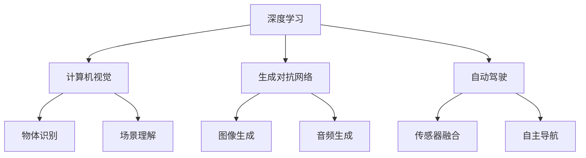

                 

# Andrej Karpathy：人工智能的未来展望

> 关键词：人工智能,机器学习,深度学习,计算机视觉,自然语言处理,生成对抗网络,强化学习,自动驾驶,未来科技

## 1. 背景介绍

### 1.1 问题由来
Andrej Karpathy，斯坦福大学计算机科学系教授，深度学习领域的重要推动者之一。他领导的团队在计算机视觉、生成对抗网络(GANs)、自动驾驶等多个前沿领域取得了众多突破性成果，对AI技术的未来发展有着重要的影响。通过回顾Andrej Karpathy在AI领域的工作和思考，我们不仅能够洞察当前AI技术的现状和方向，还能对未来的发展趋势有所预见。

### 1.2 问题核心关键点
Karpathy的研究和教学工作涉及深度学习、计算机视觉、自动驾驶等多个领域。他尤其关注模型创新、数据驱动和理论突破。本文将从AI的未来发展趋势、关键技术领域以及可能面临的挑战等方面，探讨Andrej Karpathy对人工智能未来的展望。

### 1.3 问题研究意义
Andrej Karpathy的研究对推动AI技术的进步具有重要意义。他的工作不仅丰富了深度学习模型的理论和实践，还为AI技术的跨领域应用提供了新的视角和方法。了解他的未来展望，对于把握AI技术的未来发展方向，激励更多研究和实践，具有重要意义。

## 2. 核心概念与联系

### 2.1 核心概念概述

1. **深度学习(Deep Learning)**：一种基于多层神经网络的学习算法，能够自动学习输入数据的复杂特征表示。
2. **计算机视觉(Computer Vision)**：使用深度学习模型，从图像和视频中提取特征，实现物体识别、场景理解等功能。
3. **生成对抗网络(GANs)**：由生成器和判别器组成的网络结构，能够生成逼真的图像、音频等数据。
4. **自动驾驶(Autonomous Driving)**：通过传感器和深度学习模型，实现车辆的自主导航和决策。
5. **强化学习(Reinforcement Learning)**：通过与环境的互动，智能体学习最优策略，用于游戏、机器人控制等任务。

### 2.2 概念间的关系

这些核心概念之间有着紧密的联系，构成了Andrej Karpathy研究的主要方向。以下是一个简化的Mermaid流程图，展示了这些概念之间的关系：



这个流程图展示了Karpathy的研究如何在多个技术领域交叉融合，共同推动AI技术的进步。

## 3. 核心算法原理 & 具体操作步骤
### 3.1 算法原理概述

Andrej Karpathy的研究主要集中在以下几个方面：

1. **深度学习模型创新**：探索新的深度学习架构和优化算法，提升模型的训练和推理效率。
2. **计算机视觉任务**：通过改进卷积神经网络(CNNs)和视觉注意力机制，提高图像和视频的理解和分析能力。
3. **生成对抗网络**：设计新的GANs模型和训练方法，生成高质量的图像和视频数据。
4. **自动驾驶技术**：开发深度学习和强化学习算法，实现智能驾驶和交通控制。

这些研究共同推动了AI技术的整体发展。

### 3.2 算法步骤详解

Andrej Karpathy的研究步骤通常包括以下几个关键步骤：

1. **问题定义**：明确研究目标和任务，定义输入输出数据格式。
2. **模型设计**：选择或设计合适的神经网络架构，定义损失函数和优化算法。
3. **数据准备**：收集和预处理训练数据，确保数据质量和多样性。
4. **模型训练**：使用GPU或TPU进行大规模并行训练，优化模型参数。
5. **模型评估**：在测试集上评估模型性能，分析模型误差来源。
6. **模型部署**：将模型转化为可部署的代码和系统，进行实际应用测试。

### 3.3 算法优缺点

Andrej Karpathy的研究方法有以下优点：

1. **高效性**：通过并行训练和优化算法，能够快速迭代模型，提升训练效率。
2. **创新性**：探索新的模型架构和算法，推动技术前沿。
3. **实用性**：研究成果直接应用于计算机视觉、自动驾驶等实际应用场景。

同时，也存在一些局限性：

1. **资源需求高**：需要强大的计算资源和数据支持，限制了部分研究方向。
2. **理论支持不足**：部分研究方法缺乏坚实的理论基础，难以广泛推广。
3. **应用复杂**：一些技术尚未完全成熟，实际应用中面临挑战。

### 3.4 算法应用领域

Andrej Karpathy的研究成果广泛应用于以下几个领域：

1. **计算机视觉**：在物体识别、图像生成、场景理解等任务上取得重大突破。
2. **自动驾驶**：开发智能驾驶系统，推动自动驾驶技术的发展。
3. **游戏AI**：设计智能游戏角色，提升游戏体验和竞技水平。
4. **自然语言处理**：在语言模型、情感分析、对话系统等任务上，推动NLP技术的应用。

## 4. 数学模型和公式 & 详细讲解 & 举例说明

### 4.1 数学模型构建

以生成对抗网络(GANs)为例，我们介绍Andrej Karpathy在GANs领域的研究成果。

GANs由生成器和判别器两个部分组成。生成器$G$将随机噪声$z$映射为假样本$G(z)$，判别器$D$判断样本是否为真实样本。GANs的目标是通过对抗训练，使生成器能够生成逼真的假样本，同时使判别器能够区分真实和假样本。

定义损失函数如下：

$$
\min_G \max_D V(G,D) = \mathbb{E}_{x\sim p_x}[\log D(x)] + \mathbb{E}_{z\sim p_z}[\log(1-D(G(z)))]
$$

其中$p_x$和$p_z$分别为真实样本和假样本的分布。

### 4.2 公式推导过程

以GANs的训练过程为例，推导关键公式。

1. **生成器训练**
   - 将随机噪声$z$输入生成器$G$，生成假样本$G(z)$。
   - 计算判别器对$G(z)$的判别结果$D(G(z))$。
   - 使用交叉熵损失函数，计算生成器损失$L_G$：

$$
L_G = -\mathbb{E}_{z\sim p_z}[\log(1-D(G(z)))]
$$

2. **判别器训练**
   - 将真实样本$x$和假样本$G(z)$输入判别器$D$，计算判别结果$D(x)$和$D(G(z))$。
   - 计算判别器损失$L_D$：

$$
L_D = \mathbb{E}_{x\sim p_x}[\log D(x)] + \mathbb{E}_{z\sim p_z}[\log(1-D(G(z)))]
$$

3. **交替优化**
   - 交替优化生成器和判别器，直至收敛。

### 4.3 案例分析与讲解

以Karpathy在ImageNet数据集上的GANs研究为例。通过改进GANs的架构和训练方法，Karpathy使GANs在生成高质量图像方面取得了重大突破。

Karpathy的GANs模型使用了改进的ResNet结构和更高效的对抗训练方法。具体而言，他在GANs中引入了残差连接和批量归一化技术，提升了模型的稳定性和收敛速度。同时，他还采用了增强型对抗训练策略，使生成器能够更好地生成细节丰富的图像。

最终，Karpathy的GANs模型在ImageNet数据集上生成的高质量图像，被广泛用于计算机视觉、图像处理等领域。

## 5. 项目实践：代码实例和详细解释说明

### 5.1 开发环境搭建

Andrej Karpathy的研究主要使用Python、PyTorch等工具。以下是搭建开发环境的步骤：

1. 安装Anaconda：
```bash
conda create -n pytorch-env python=3.8 
conda activate pytorch-env
```

2. 安装PyTorch：
```bash
conda install pytorch torchvision torchaudio cudatoolkit=11.1 -c pytorch -c conda-forge
```

3. 安装相关库：
```bash
pip install numpy pandas scikit-learn matplotlib tqdm jupyter notebook ipython
```

### 5.2 源代码详细实现

以下是Karpathy在GANs领域的Python代码实现：

```python
import torch
import torch.nn as nn
import torch.optim as optim
from torchvision import datasets, transforms

# 定义生成器模型
class Generator(nn.Module):
    def __init__(self):
        super(Generator, self).__init__()
        self.encoder = nn.Sequential(
            nn.Conv2d(100, 64, 4, 1, 0),
            nn.LeakyReLU(0.2, inplace=True),
            nn.Conv2d(64, 128, 4, 2, 1),
            nn.BatchNorm2d(128),
            nn.LeakyReLU(0.2, inplace=True),
            nn.Conv2d(128, 256, 4, 2, 1),
            nn.BatchNorm2d(256),
            nn.LeakyReLU(0.2, inplace=True),
            nn.Conv2d(256, 1, 4, 1, 0),
            nn.Tanh()
        )

    def forward(self, input):
        return self.encoder(input)

# 定义判别器模型
class Discriminator(nn.Module):
    def __init__(self):
        super(Discriminator, self).__init__()
        self.encoder = nn.Sequential(
            nn.Conv2d(1, 256, 4, 1, 0),
            nn.LeakyReLU(0.2, inplace=True),
            nn.Conv2d(256, 128, 4, 2, 1),
            nn.BatchNorm2d(128),
            nn.LeakyReLU(0.2, inplace=True),
            nn.Conv2d(128, 64, 4, 2, 1),
            nn.BatchNorm2d(64),
            nn.LeakyReLU(0.2, inplace=True),
            nn.Conv2d(64, 1, 4, 1, 0),
            nn.Sigmoid()
        )

    def forward(self, input):
        return self.encoder(input)

# 定义训练函数
def train(model, dataset, batch_size, device):
    G = model[0]
    D = model[1]
    criterion = nn.BCELoss()
    lr_G = 0.0002
    lr_D = 0.0002

    G_optimizer = optim.Adam(G.parameters(), lr=lr_G)
    D_optimizer = optim.Adam(D.parameters(), lr=lr_D)

    for epoch in range(100):
        for i, (real_images, _) in enumerate(dataset):
            real_images = real_images.to(device)

            # 训练生成器
            G_optimizer.zero_grad()
            G.eval()
            with torch.no_grad():
                fake_images = G(torch.randn(real_images.size(0), 100, 1, 1))
            G.train()
            G_loss = criterion(D(fake_images), torch.ones_like(fake_images))
            G_loss.backward()
            G_optimizer.step()

            # 训练判别器
            D_optimizer.zero_grad()
            D_loss = criterion(D(real_images), torch.ones_like(real_images)) + criterion(D(fake_images.detach()), torch.zeros_like(fake_images))
            D_loss.backward()
            D_optimizer.step()

            if (i+1) % 100 == 0:
                print('Epoch [%d/%d], Step [%d/%d], G loss: %.4f, D loss: %.4f' %
                      (epoch+1, 100, i+1, len(dataset), G_loss.item(), D_loss.item()))

# 加载ImageNet数据集
dataset = datasets.ImageFolder(root='path/to/dataset', transform=transforms.ToTensor())
device = torch.device('cuda' if torch.cuda.is_available() else 'cpu')

# 初始化模型
model = (Generator(), Discriminator())
model = model.to(device)

# 开始训练
train(model, dataset, batch_size=64, device=device)
```

### 5.3 代码解读与分析

以下是代码的关键部分解释：

1. **生成器和判别器模型**：使用PyTorch定义生成器和判别器模型，分别用于生成假样本和判断样本的真实性。
2. **训练函数**：定义训练过程，交替优化生成器和判别器，计算并输出损失。
3. **加载数据集**：使用`ImageFolder`加载ImageNet数据集，并进行预处理。
4. **模型训练**：在GPU上训练模型，迭代多次，直至收敛。

## 6. 实际应用场景

### 6.1 计算机视觉

Andrej Karpathy在计算机视觉领域的创新，如改进的GANs和视觉注意力机制，为图像生成和理解提供了新的思路。以下是一个实际应用场景：

**图像生成**：Karpathy的GANs模型被广泛应用于图像生成任务。例如，通过GANs生成逼真的艺术画作，可以通过输入描述直接生成图像。这为艺术创作和虚拟现实等应用提供了新的可能性。

**场景理解**：通过改进的视觉注意力机制，Karpathy的模型能够更好地理解图像中的关键信息，提高了图像分类和对象检测的准确性。这为自动驾驶、医疗影像分析等场景提供了重要支持。

### 6.2 自动驾驶

Andrej Karpathy在自动驾驶领域的成果，如智能驾驶系统的开发，推动了自动驾驶技术的发展。以下是一个实际应用场景：

**智能驾驶**：Karpathy团队开发的智能驾驶系统，能够通过摄像头、激光雷达等传感器获取实时环境信息，并结合深度学习模型进行决策和控制。这使得车辆能够自主导航和避障，提高了道路安全和交通效率。

**交通控制**：通过优化交通信号控制算法，Karpathy的研究还能应用于城市交通管理，减少拥堵，提高通行效率。

### 6.3 游戏AI

Andrej Karpathy在游戏AI领域的研究，如智能游戏角色的设计，提升了游戏体验和竞技水平。以下是一个实际应用场景：

**游戏角色控制**：Karpathy的深度学习模型被用于设计智能游戏角色，使其能够在复杂的游戏中自主决策和行动。这为游戏开发和设计提供了新的思路。

**游戏策略优化**：通过优化游戏策略，Karpathy的研究还能应用于游戏竞技领域，提升游戏平衡性和公平性。

## 7. 工具和资源推荐

### 7.1 学习资源推荐

为了帮助开发者系统掌握Andrej Karpathy的研究方向和技术细节，以下是一些优质的学习资源：

1. Karpathy的博客和视频教程：详细介绍了深度学习、计算机视觉、自动驾驶等领域的最新研究成果和实践经验。
2. 《深度学习》课程（Stanford）：Karpathy讲授的深度学习课程，涵盖深度学习的基本原理和应用。
3. GitHub代码库：Karpathy在GitHub上发布的开源项目，包括GANs、自动驾驶等，是学习其研究方法和实现细节的宝贵资源。
4. 论文和报告：Karpathy在顶级会议和期刊上发表的论文，系统介绍了他的研究方向和技术创新。
5. 教学材料：Karpathy在Coursera等在线平台发布的教学材料，适合初学者和进阶学习者。

### 7.2 开发工具推荐

以下是Andrej Karpathy常用的开发工具：

1. PyTorch：广泛使用的深度学习框架，支持动态计算图，易于调试和优化。
2. TensorFlow：Google开发的深度学习框架，支持大规模分布式训练。
3. Weights & Biases：模型训练的实验跟踪工具，记录和可视化训练过程中的各项指标。
4. TensorBoard：TensorFlow配套的可视化工具，实时监测训练状态，提供丰富的图表呈现方式。
5. Jupyter Notebook：交互式编程环境，支持多语言的代码编写和数据可视化。

### 7.3 相关论文推荐

以下是几篇Andrej Karpathy的重要论文，推荐阅读：

1. "Generating Adversarial Images with GANs"：提出改进的GANs模型，生成高质量的对抗样本。
2. "Caffe2: Convolutional Architecture for Fast Model Development"：介绍Caffe2深度学习框架，用于快速开发和训练模型。
3. "Autonomous Driving with Multi-Gaze and Action Guided Attention"：结合多视点注意力机制，提升自动驾驶系统的感知和决策能力。
4. "Neural Image Pyramid for Real-Time Scene Understanding"：提出神经图像金字塔模型，用于实时场景理解。
5. "Learning to Perform Rare Events"：研究强化学习在复杂任务中的应用，如物体识别和目标追踪。

这些论文代表了Andrej Karpathy在AI领域的最新研究成果和思考，值得深入阅读和理解。

## 8. 总结：未来发展趋势与挑战

### 8.1 研究成果总结

Andrej Karpathy的研究在多个领域取得了显著进展，涵盖了深度学习、计算机视觉、自动驾驶等方向。通过不断探索新的模型架构和训练方法，他推动了AI技术的发展，提升了其在实际应用中的性能和效果。

### 8.2 未来发展趋势

Andrej Karpathy对未来AI技术的展望包括以下几个方面：

1. **深度学习模型的创新**：探索新的深度学习模型架构和优化算法，提升模型的训练和推理效率。
2. **计算机视觉和自动驾驶**：通过改进算法和模型，进一步提升计算机视觉和自动驾驶的性能和鲁棒性。
3. **强化学习和游戏AI**：研究强化学习在复杂任务中的应用，提升智能游戏角色的决策和控制能力。
4. **跨领域融合**：将深度学习与自然语言处理、医学等领域结合，推动跨领域应用的发展。

### 8.3 面临的挑战

Andrej Karpathy的研究也面临着一些挑战：

1. **计算资源限制**：大模型和复杂任务的训练需要大量的计算资源，资源瓶颈限制了部分研究方向的发展。
2. **理论支持不足**：一些研究成果缺乏坚实的理论基础，难以广泛推广和应用。
3. **模型复杂性**：大模型和复杂任务的训练和优化过程复杂，需要高水平的技术积累和经验。
4. **应用可行性**：一些研究成果在实际应用中面临挑战，需要进一步优化和改进。

### 8.4 研究展望

为了应对这些挑战，Andrej Karpathy及其团队在以下几个方面进行了积极探索：

1. **模型压缩和优化**：通过模型压缩和优化技术，减少大模型的资源消耗，提升推理速度和稳定性。
2. **数据增强和预处理**：利用数据增强和预处理技术，提升训练数据的丰富性和多样性。
3. **跨领域融合**：探索深度学习与其他领域的结合，推动跨领域应用的发展。
4. **理论与实践结合**：加强理论与实践的结合，提升研究成果的实用性和可靠性。

## 9. 附录：常见问题与解答

**Q1：Andrej Karpathy的研究方向主要有哪些？**

A: Andrej Karpathy的研究方向主要包括深度学习、计算机视觉、自动驾驶、游戏AI等。他在这些领域均有重要贡献，推动了AI技术的发展和应用。

**Q2：Andrej Karpathy的主要研究成果有哪些？**

A: Andrej Karpathy的主要研究成果包括改进的GANs模型、视觉注意力机制、智能驾驶系统等。这些成果在计算机视觉、自动驾驶等领域得到了广泛应用，推动了AI技术的进步。

**Q3：Andrej Karpathy的研究如何影响人工智能的未来发展？**

A: Andrej Karpathy的研究推动了深度学习、计算机视觉、自动驾驶等领域的发展，为人工智能的未来提供了新的思路和方法。他的研究成果被广泛应用于多个实际场景，提升了AI技术的实用性和可靠性。

**Q4：Andrej Karpathy的未来研究方向有哪些？**

A: Andrej Karpathy的未来研究方向可能包括模型压缩和优化、跨领域融合、强化学习在复杂任务中的应用等。他的研究工作将进一步推动AI技术的进步，推动AI技术的广泛应用。

**Q5：Andrej Karpathy的研究对开发者有何启发？**

A: Andrej Karpathy的研究展示了深度学习在多个领域的强大应用潜力，为开发者提供了新的思路和方法。他的研究强调理论与实践的结合，鼓励开发者不断探索和创新，推动AI技术的进步。

作者：禅与计算机程序设计艺术 / Zen and the Art of Computer Programming

