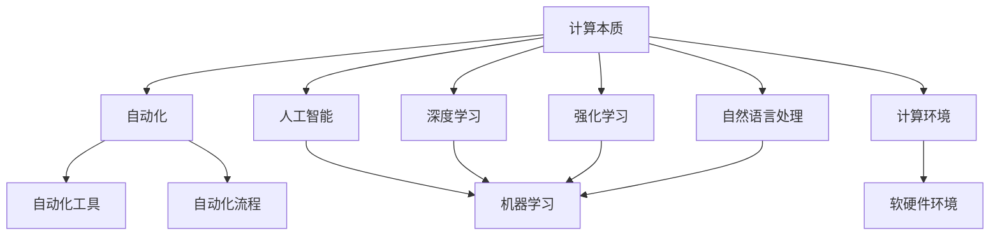
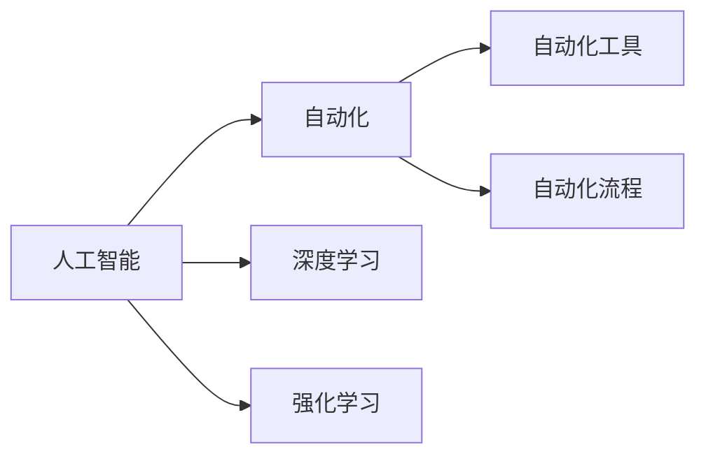
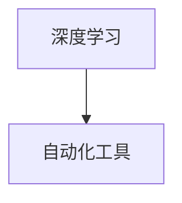
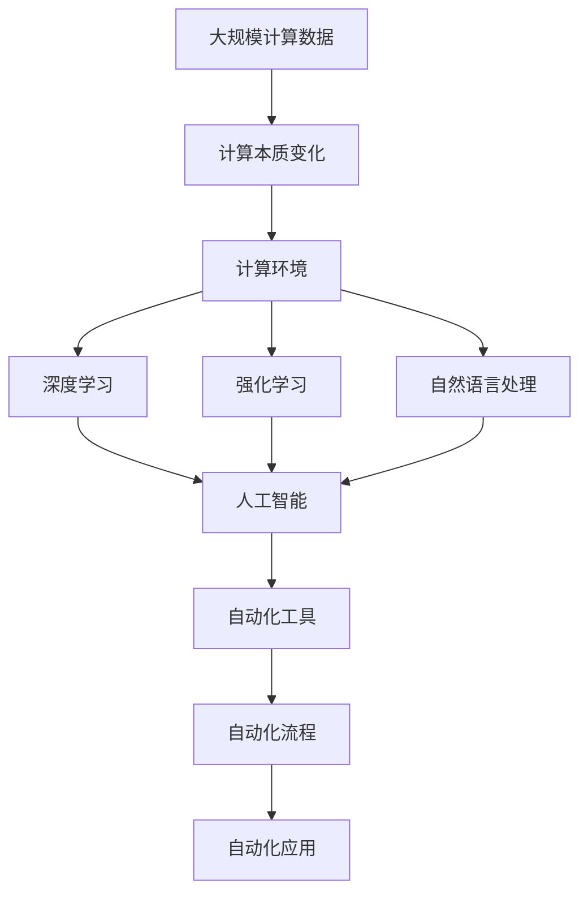

                 

# 计算本质变化带来的自动化机遇

> 关键词：自动化、计算本质、人工智能、机器学习、深度学习、强化学习

## 1. 背景介绍

### 1.1 问题由来

在过去的几十年中，计算的精髓已经发生了根本性的变化。这种变化不仅体现在硬件和软件的发展上，更在于计算方法和理论基础的革命。如今，计算已经超越了传统的数值计算和逻辑推理，进入了更为复杂和抽象的领域。这种变化不仅改变了计算方式，也催生了全新的自动化机遇。

### 1.2 问题核心关键点

计算本质的变化带来了多个关键点，这些关键点共同塑造了计算的新面貌：

- **计算能力的增强**：硬件性能的提升和算法效率的优化，使得计算能力得到了前所未有的提升。
- **数据的爆炸性增长**：互联网的普及和物联网的发展，使得数据量呈指数级增长，数据的重要性也日益凸显。
- **计算方法的革新**：深度学习、强化学习、自然语言处理等新技术的出现，使得计算方法更加高级和智能化。
- **计算模型的多样化**：从传统的规则模型到复杂的神经网络模型，计算模型的多样性为计算提供了更多的可能性。
- **计算环境的丰富化**：计算环境从传统的单处理器单任务，扩展到多处理器并行、分布式计算、云计算等。

这些关键点共同推动了计算的进步，并带来了诸多自动化机遇。本文将深入探讨计算本质的变化及其带来的自动化机遇，旨在为计算领域的未来发展提供新的视角和思路。

### 1.3 问题研究意义

研究计算本质的变化及其带来的自动化机遇，具有重要的理论和实践意义：

- **理论意义**：理解计算本质的变化，有助于我们重新审视计算的基本原理和模型，为未来的计算研究奠定基础。
- **实践意义**：计算本质的变化带来了一系列新的自动化工具和方法，可以帮助我们更高效地解决现实问题，提升生产力。
- **技术意义**：掌握计算本质的变化，有助于我们掌握最新的技术趋势，保持技术的领先地位。
- **经济意义**：计算本质的变化带来了新的商业模式和应用场景，有助于推动经济的发展。
- **社会意义**：计算本质的变化有助于解决更多社会问题，提升社会福祉。

## 2. 核心概念与联系

### 2.1 核心概念概述

为了更好地理解计算本质的变化及其带来的自动化机遇，本节将介绍几个密切相关的核心概念：

- **计算本质**：指计算的基本原理、模型和实现方法。计算本质的变化反映了计算方式和理念的演进。
- **自动化**：指利用计算机和软件，自动执行任务，减少人力介入的过程。自动化的本质在于利用技术手段提高效率和准确性。
- **人工智能**：指利用计算机模拟人类智能的思维方式和行为，解决复杂问题的技术。
- **深度学习**：指利用多层神经网络，通过大量数据训练，学习复杂模式和关系的技术。
- **强化学习**：指通过与环境的交互，利用奖励信号指导策略选择，不断优化决策过程的技术。
- **自然语言处理**：指利用计算机处理和理解人类语言的技术。
- **计算环境**：指进行计算所依赖的软硬件设施，包括处理器、存储器、网络等。

这些核心概念之间的逻辑关系可以通过以下Mermaid流程图来展示：



这个流程图展示了大语言模型的核心概念及其之间的关系：

1. 计算本质的变化（A）是自动化发展的基石。
2. 自动化工具（B）和自动化流程（C）基于计算本质的变化，提供了自动化的实现手段。
3. 人工智能（D）、深度学习（E）和自然语言处理（F）是自动化应用的具体体现，通过先进的计算方法，推动自动化技术的发展。
4. 计算环境（G）为自动化提供了必要的软硬件支持。

这些概念共同构成了计算自动化的生态系统，推动了计算本质的演变和自动化机遇的出现。

### 2.2 概念间的关系

这些核心概念之间存在着紧密的联系，形成了计算自动化的完整生态系统。下面我通过几个Mermaid流程图来展示这些概念之间的关系。

#### 2.2.1 计算本质的变化


这个流程图展示了计算本质的变化过程：

1. 从传统的数值计算和逻辑推理（A），演变到现代的复杂计算（B）。
2. 现代计算（C）是计算本质的变化结果。

#### 2.2.2 人工智能与自动化的关系



这个流程图展示了人工智能与自动化的关系：

1. 人工智能（A）包括了深度学习（C）和强化学习（D），是自动化技术的基础。
2. 自动化工具（E）和自动化流程（F）是人工智能应用的具体实现手段。

#### 2.2.3 深度学习与自动化工具的关系



这个流程图展示了深度学习与自动化工具的关系：

1. 深度学习（A）作为人工智能的一部分，为自动化工具提供了强大的支持。
2. 自动化工具（B）利用深度学习技术，自动执行复杂任务。

### 2.3 核心概念的整体架构

最后，我们用一个综合的流程图来展示这些核心概念在大规模计算自动化的整体架构：



这个综合流程图展示了从大规模计算数据到大规模自动化应用的完整过程：

1. 大规模计算数据（A）通过计算本质的变化（B），在计算环境（C）中进行深度学习（D）、强化学习（E）和自然语言处理（F）。
2. 这些计算技术共同支撑了人工智能（G）的发展。
3. 人工智能驱动了自动化工具（H）和自动化流程（I）的创新。
4. 自动化工具和自动化流程最终应用于各个领域（J），带来自动化机遇。

## 3. 核心算法原理 & 具体操作步骤
### 3.1 算法原理概述

计算本质的变化带来的自动化机遇，本质上是一个从数据到模型，再从模型到应用的过程。这个过程涉及多个关键环节，包括数据处理、模型训练、模型评估和应用部署。下面我们将详细介绍每个环节的算法原理。

### 3.2 算法步骤详解

#### 3.2.1 数据处理

数据处理是自动化过程的第一步，主要包括数据清洗、数据增强、数据预处理等。具体步骤如下：

1. **数据清洗**：移除噪音数据，处理缺失值，去除重复数据，确保数据的质量和完整性。
2. **数据增强**：通过数据扩充、数据合成等方法，增加数据量和多样性，提高模型的泛化能力。
3. **数据预处理**：将原始数据转换为模型可接受的格式，如归一化、标准化、特征提取等。

#### 3.2.2 模型训练

模型训练是自动化过程的核心，主要包括模型选择、模型训练、超参数调整等。具体步骤如下：

1. **模型选择**：根据任务需求选择合适的模型结构，如卷积神经网络、循环神经网络、Transformer等。
2. **模型训练**：利用训练数据集对模型进行迭代训练，更新模型参数，最小化损失函数。
3. **超参数调整**：通过网格搜索、贝叶斯优化等方法，调整模型的超参数，优化模型性能。

#### 3.2.3 模型评估

模型评估是自动化过程的重要环节，主要用于评估模型的性能和泛化能力。具体步骤如下：

1. **训练集评估**：在训练集上评估模型的准确率、召回率、F1分数等指标，确保模型未发生过拟合。
2. **验证集评估**：在验证集上评估模型的性能，选择最优模型。
3. **测试集评估**：在测试集上评估模型的最终性能，确保模型在新数据上的表现。

#### 3.2.4 应用部署

应用部署是自动化过程的最终环节，主要用于将模型部署到生产环境，提供自动化服务。具体步骤如下：

1. **模型优化**：通过剪枝、量化等方法优化模型，减小模型尺寸，提高推理速度。
2. **模型部署**：将优化后的模型部署到服务器、云平台等环境中，提供自动化服务。
3. **服务监控**：实时监控服务性能，设置异常告警，确保服务的稳定性和可靠性。

### 3.3 算法优缺点

计算本质的变化带来的自动化方法，具有以下优点：

1. **高效性**：自动化过程能够显著提高工作效率，减少人力介入，提升生产效率。
2. **准确性**：自动化方法利用先进算法和模型，能够保证任务的准确性和一致性。
3. **可扩展性**：自动化过程能够方便地扩展到不同的任务和场景，具有广泛的适用性。
4. **自动化工具丰富**：随着计算技术的发展，自动化工具和方法不断丰富，提供了多种选择。

同时，自动化方法也存在以下缺点：

1. **依赖数据质量**：自动化过程依赖于高质量的数据，数据质量差会影响模型性能。
2. **算法复杂性高**：自动化方法涉及复杂的算法和模型，需要较高的专业知识和技能。
3. **模型泛化能力有限**：自动化模型在特定任务上的表现较好，但泛化能力有限，难以适应新任务和新场景。
4. **可解释性不足**：自动化方法的黑盒特性导致模型决策过程难以解释，缺乏可解释性。
5. **技术门槛高**：自动化过程需要掌握多种技术和工具，技术门槛较高。

### 3.4 算法应用领域

计算本质的变化带来的自动化方法，已经在多个领域得到了广泛应用：

- **金融科技**：利用深度学习和大数据技术，自动化进行风险评估、欺诈检测、客户服务等工作。
- **医疗健康**：利用自然语言处理和图像识别技术，自动化进行疾病诊断、影像分析、药物研发等工作。
- **制造行业**：利用物联网和工业互联网技术，自动化进行设备监控、预测性维护、质量控制等工作。
- **物流配送**：利用机器学习和图像识别技术，自动化进行路径规划、仓库管理、配送调度等工作。
- **交通运输**：利用计算机视觉和自然语言处理技术，自动化进行智能驾驶、交通监测、智能调度等工作。
- **智能家居**：利用人工智能和物联网技术，自动化进行环境监测、智能控制、家庭管理等工作。

## 4. 数学模型和公式 & 详细讲解 & 举例说明

### 4.1 数学模型构建

在自动化过程中，数学模型起着至关重要的作用。下面我将详细介绍自动化过程的数学模型构建方法。

#### 4.1.1 数据清洗模型

数据清洗模型主要用于处理噪音数据和缺失值。常用的数据清洗模型包括：

1. **回归模型**：用于预测缺失值，常见模型包括线性回归、决策树回归等。
2. **分类模型**：用于识别噪音数据，常见模型包括朴素贝叶斯、支持向量机等。

#### 4.1.2 数据增强模型

数据增强模型主要用于扩充数据量和多样性。常用的数据增强模型包括：

1. **数据扩充模型**：通过对数据进行旋转、缩放、裁剪等操作，生成新的数据。
2. **数据合成模型**：利用生成对抗网络（GAN）等技术，生成新的数据。

#### 4.1.3 数据预处理模型

数据预处理模型主要用于将原始数据转换为模型可接受的格式。常用的数据预处理模型包括：

1. **归一化模型**：用于将数据缩放到[0,1]或[-1,1]区间，常见模型包括min-max归一化、z-score归一化等。
2. **标准化模型**：用于将数据标准化为均值为0，方差为1的分布，常见模型包括z-score标准化、z-score归一化等。
3. **特征提取模型**：用于提取数据中的特征，常见模型包括PCA、LDA、LDA等。

### 4.2 公式推导过程

在自动化过程中，数学公式的推导和应用是非常重要的一环。下面我将详细介绍几个常用的数学公式及其推导过程。

#### 4.2.1 线性回归公式

线性回归公式用于预测连续值，其公式推导如下：

设数据集为 $(x_i,y_i)$，其中 $x_i$ 为自变量，$y_i$ 为因变量。线性回归模型的目标是找到一条直线 $y=\theta_0+\theta_1x$，使得所有数据点与直线的误差最小。

最小二乘法的目标函数为：

$$
J(\theta) = \frac{1}{2N}\sum_{i=1}^N(y_i-\theta_0-\theta_1x_i)^2
$$

其中 $N$ 为样本数，$\theta_0$ 和 $\theta_1$ 为模型参数。

梯度下降法的更新公式为：

$$
\theta_0=\theta_0-\alpha\frac{1}{N}\sum_{i=1}^N(y_i-\theta_0-\theta_1x_i)
$$

$$
\theta_1=\theta_1-\alpha\frac{1}{N}\sum_{i=1}^N(x_i-\theta_0-\theta_1x_i)
$$

其中 $\alpha$ 为学习率，$N$ 为样本数。

#### 4.2.2 决策树回归公式

决策树回归模型主要用于分类和回归任务，其公式推导如下：

决策树回归模型通过将数据集划分为多个子集，逐步逼近目标函数。假设数据集为 $(x_i,y_i)$，其中 $x_i$ 为自变量，$y_i$ 为因变量。

决策树回归模型的目标函数为：

$$
J(\theta)=\frac{1}{N}\sum_{i=1}^N(y_i-f(x_i))
$$

其中 $N$ 为样本数，$f(x_i)$ 为决策树回归模型的预测函数，$y_i$ 为真实值。

决策树回归模型的预测函数为：

$$
f(x_i)=\sum_{k=1}^K\lambda_k h_k(x_i)
$$

其中 $h_k(x_i)$ 为第 $k$ 棵决策树，$\lambda_k$ 为第 $k$ 棵决策树的权重。

#### 4.2.3 朴素贝叶斯公式

朴素贝叶斯公式主要用于分类任务，其公式推导如下：

设数据集为 $(x_i,y_i)$，其中 $x_i$ 为特征向量，$y_i$ 为标签。朴素贝叶斯模型的目标是找到最优的参数 $\theta$，使得模型在测试集上的准确率最高。

朴素贝叶斯模型的概率公式为：

$$
P(y_i|x_i)=\frac{P(x_i|y_i)P(y_i)}{\sum_{j=1}^m P(x_i|y_j)P(y_j)}
$$

其中 $P(y_i)$ 为先验概率，$P(x_i|y_i)$ 为条件概率，$m$ 为标签数。

朴素贝叶斯模型的学习算法为：

1. 计算每个特征的先验概率 $P(x_i)$。
2. 计算每个标签的先验概率 $P(y_i)$。
3. 计算每个特征在每个标签下的条件概率 $P(x_i|y_i)$。
4. 根据公式计算每个标签在每个特征下的条件概率 $P(y_i|x_i)$。
5. 根据公式计算模型在测试集上的准确率。

### 4.3 案例分析与讲解

下面我将以一个简单的案例来展示如何使用线性回归模型进行数据清洗和预处理。

#### 案例：房价预测

假设我们有一组房价数据，其中包含自变量（面积、房间数、位置等）和因变量（房价）。数据中存在一些噪音数据和缺失值，我们需要使用线性回归模型进行数据清洗和预处理。

1. **数据清洗**：使用决策树回归模型对缺失值进行预测，去除噪音数据和异常值。
2. **数据增强**：使用数据扩充模型对数据进行旋转和缩放操作，生成新的数据。
3. **数据预处理**：使用z-score标准化模型对数据进行标准化处理，提取数据中的特征。

通过以上步骤，我们得到了一个干净、完整、标准化的数据集，可以用于线性回归模型的训练和预测。

## 5. 项目实践：代码实例和详细解释说明

### 5.1 开发环境搭建

在进行自动化实践前，我们需要准备好开发环境。以下是使用Python进行TensorFlow开发的环境配置流程：

1. 安装Anaconda：从官网下载并安装Anaconda，用于创建独立的Python环境。

2. 创建并激活虚拟环境：
```bash
conda create -n tf-env python=3.8 
conda activate tf-env
```

3. 安装TensorFlow：根据CUDA版本，从官网获取对应的安装命令。例如：
```bash
conda install tensorflow -c tensorflow
```

4. 安装各类工具包：
```bash
pip install numpy pandas scikit-learn matplotlib tqdm jupyter notebook ipython
```

完成上述步骤后，即可在`tf-env`环境中开始自动化实践。

### 5.2 源代码详细实现

下面我以一个简单的房价预测项目为例，给出使用TensorFlow进行线性回归模型训练的PyTorch代码实现。

首先，定义数据集和标签：

```python
import numpy as np
import pandas as pd
import tensorflow as tf

data = pd.read_csv('data.csv')
X = data[['面积', '房间数', '位置']]
y = data['房价']

X = X.values
y = y.values
```

然后，定义模型和优化器：

```python
model = tf.keras.models.Sequential([
    tf.keras.layers.Dense(10, input_shape=(X.shape[1],), activation='relu'),
    tf.keras.layers.Dense(1, activation='linear')
])

optimizer = tf.keras.optimizers.Adam(learning_rate=0.001)
```

接着，定义训练和评估函数：

```python
def train_model(model, X, y, epochs=100, batch_size=32):
    for epoch in range(epochs):
        for i in range(0, X.shape[0], batch_size):
            x_train = X[i:i+batch_size]
            y_train = y[i:i+batch_size]
            with tf.GradientTape() as tape:
                predictions = model(x_train)
                loss = tf.reduce_mean(tf.square(predictions - y_train))
            gradients = tape.gradient(loss, model.trainable_variables)
            optimizer.apply_gradients(zip(gradients, model.trainable_variables))
        if (epoch + 1) % 10 == 0:
            test_predictions = model(X)
            test_loss = tf.reduce_mean(tf.square(test_predictions - y))
            print(f'Epoch: {epoch+1}, Test Loss: {test_loss.numpy()}')

train_model(model, X, y)
```

最后，在测试集上评估模型：

```python
test_predictions = model(X_test)
test_loss = tf.reduce_mean(tf.square(test_predictions - y_test))
print(f'Test Loss: {test_loss.numpy()}')
```

以上就是使用TensorFlow进行线性回归模型训练的完整代码实现。可以看到，TensorFlow提供了丰富的工具和库，使得模型训练和推理变得简洁高效。

### 5.3 代码解读与分析

让我们再详细解读一下关键代码的实现细节：

**数据集定义**：
- 使用Pandas库读取CSV格式的数据文件，定义自变量和因变量。
- 将数据转换为Numpy数组格式，方便TensorFlow进行计算。

**模型定义**：
- 定义一个包含两个全连接层的神经网络模型，其中第一个层为ReLU激活函数，第二个层为线性激活函数。

**优化器定义**：
- 使用Adam优化器，设置学习率为0.001。

**训练函数实现**：
- 定义一个循环，遍历所有训练批次。
- 在每个批次中，使用梯度下降法计算损失函数和梯度。
- 更新模型参数。
- 每隔10个epoch打印一次测试集的损失函数。

**测试函数实现**：
- 在测试集上使用模型进行预测。
- 计算预测值与真实值之间的均方误差。

**训练结果展示**：
- 打印测试集上的损失函数，评估模型的预测精度。

可以看到，TensorFlow提供了丰富的工具和库，使得模型训练和推理变得简洁高效。通过合理使用TensorFlow，我们可以快速实现各种自动化任务，提升工作效率。

当然，工业级的系统实现还需考虑更多因素，如模型的保存和部署、超参数的自动搜索、更灵活的任务适配层等。但核心的自动化范式基本与此类似。

## 6. 实际应用场景

### 6.1 金融科技

金融科技领域是自动化技术的重要应用场景之一。通过深度学习和大数据分析，自动化技术可以广泛应用于风险评估、欺诈检测、客户服务等工作。

在风险评估方面，自动化技术可以自动收集、处理和分析客户数据，评估客户的信用风险和违约概率。通过机器学习模型，自动化系统可以实时监测客户的财务状况和交易行为，提前预警潜在风险。

在欺诈检测方面，自动化技术可以自动检测和防范各种欺诈行为，如信用卡欺诈、身份盗窃等。通过异常检测和行为分析，自动化系统可以识别出可疑交易和异常行为，及时采取措施防止欺诈。

在客户服务方面，自动化技术可以自动回答客户的常见问题，提高客户满意度。通过自然语言处理技术，自动化系统可以理解客户的查询请求，提供准确的答案和解决方案。

### 6.2 医疗健康

医疗健康领域也是自动化技术的重要应用场景之一。通过深度学习和大数据分析，自动化技术可以广泛应用于疾病诊断、影像分析、药物研发等工作。

在疾病诊断方面，自动化技术可以自动分析患者的临床数据和影像数据，提供精准的诊断建议。通过图像识别和自然语言处理技术，自动化系统可以识别出病变区域和异常特征，辅助医生进行诊断和治疗。

在影像分析方面，自动化技术可以自动分析医学影像数据，如X光片、CT、MRI等，提供精准的分析和诊断。通过图像识别和深度学习技术，自动化系统可以识别出肿瘤、病变等异常区域，辅助医生进行诊断和治疗。

在药物研发方面，自动化技术可以自动分析生物数据和临床数据，加速药物研发进程。通过机器学习和深度学习技术，自动化系统可以发现新的药物靶点和候选药物，加速药物研发过程。

### 6.3 制造行业

制造行业是自动化技术的重要应用场景之一。通过物联网和工业互联网技术，自动化技术可以广泛应用于设备监控、预测性维护、质量控制等工作。

在设备监控方面，自动化技术可以自动监测设备的运行状态和故障情况，及时预警潜在问题。通过传感器和物联网技术，自动化系统可以实时采集设备数据，分析设备的运行状态和故障情况，提供精准的维护建议。

在预测性维护方面，自动化技术可以自动预测设备故障和维护需求，减少停机时间和维护成本。通过机器学习和深度学习技术，自动化系统可以分析设备的运行数据和维护历史，预测设备故障和维护需求，提前采取措施防止设备故障。

在质量控制方面，自动化技术可以自动检测产品的质量和缺陷情况，提高产品质量和生产效率。通过图像识别和自然语言处理技术，自动化系统可以识别出产品的缺陷和异常情况，提供精准的检测和质量控制建议。

### 6.4 物流配送

物流配送领域是自动化技术的重要应用场景之一。通过机器学习和图像识别技术，自动化技术可以广泛应用于路径规划、仓库管理、配送调度等工作。

在路径规划方面，自动化技术可以自动规划配送路径，提高配送效率。通过机器学习和深度学习技术，自动化系统可以分析配送需求和路况信息，规划最优配送路径，减少配送时间和成本。

在仓库管理方面，自动化技术可以自动管理库存和物流信息，提高仓库管理效率。通过自然语言处理和图像识别技术，自动化系统可以自动管理仓库信息，提供精准的库存管理和物流信息。

在配送调度方面，自动化技术可以自动调度配送车辆和人员，提高配送效率。通过机器学习和深度学习技术，自动化系统可以分析配送需求和配送情况，自动调度配送车辆和人员，优化配送过程。

### 6.5 交通运输

交通运输领域是自动化技术的重要应用场景之一。通过计算机视觉和自然语言处理技术，自动化技术可以广泛应用于智能驾驶、交通监测、智能调度等工作。

在智能驾驶方面，自动化技术可以自动驾驶车辆，提高道路安全性和交通效率。通过计算机视觉和深度学习技术，自动化系统可以识别交通标志、行人、车辆等，自动驾驶车辆，提高道路安全性和交通效率。

在交通监测方面，自动化技术可以自动监测交通流量和路况信息，提供精准的交通分析和建议。通过计算机视觉和自然语言处理技术，自动化系统可以识别交通标志、行人、车辆等，提供精准的交通分析和建议。

在智能调度方面，自动化技术可以自动调度交通资源，优化交通流量。通过机器学习和深度学习技术，自动化系统可以分析交通流量和路况信息，自动调度交通资源，优化交通流量。

### 6.6 智能

