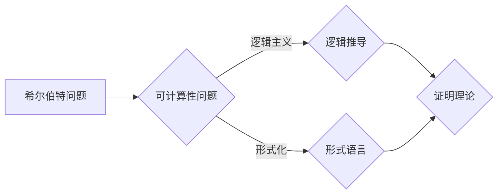

# 计算：第三部分 计算理论的形成 第 6 章 计算理论的奠基：希尔伯特进路 希尔伯特问题

> 关键词：希尔伯特，计算理论，希尔伯特问题，可计算性，逻辑主义，形式化，证明理论

## 1. 背景介绍

计算理论是数学和计算机科学的交叉学科，它研究计算的本质、计算模型的极限以及计算与数学的关系。在20世纪初，随着逻辑主义和形式化运动的兴起，计算理论逐渐形成。其中，德国数学家大卫·希尔伯特（David Hilbert）提出的希尔伯特问题成为了计算理论的重要奠基。

## 2. 核心概念与联系

### 2.1 核心概念

**希尔伯特**：德国著名数学家，对数学、物理学、逻辑学等领域都有重要贡献。

**计算理论**：研究计算的本质、计算模型的极限以及计算与数学的关系。

**希尔伯特问题**：希尔伯特在1928年的国际数学家大会上提出的23个数学问题中的第10个问题，即“判定一个数学命题是否成立”。

**逻辑主义**：一种哲学立场，认为数学是逻辑的延伸，数学知识可以通过逻辑推导得到。

**形式化**：将数学概念、定理、证明过程等用形式语言进行表述。

**证明理论**：研究证明的本质、证明方法以及证明与数学知识的关系。

### 2.2 核心概念原理和架构的 Mermaid 流程图



## 3. 核心算法原理 & 具体操作步骤

### 3.1 算法原理概述

希尔伯特进路旨在通过逻辑推导和形式化方法来解决问题。其基本原理如下：

1. 将数学命题用形式语言表示。
2. 构建一套逻辑体系，能够从公理出发，通过逻辑推理得到结论。
3. 利用证明理论分析逻辑体系的完备性和一致性，从而判断希尔伯特问题的可解性。

### 3.2 算法步骤详解

1. **形式化表示**：将数学命题用形式语言表示，如逻辑符号、函数符号等。
2. **公理系统构建**：选择合适的公理，构建一套逻辑体系，能够表示数学知识。
3. **证明理论分析**：分析逻辑体系的完备性和一致性，判断希尔伯特问题的可解性。
4. **程序设计**：根据证明理论分析结果，设计一套程序，自动验证数学命题是否成立。

### 3.3 算法优缺点

**优点**：

- 提供了一种系统化、形式化的数学研究方法。
- 有助于揭示数学命题的本质和逻辑结构。
- 为计算机科学的发展提供了理论基础。

**缺点**：

- 形式化过程繁琐，难以捕捉数学思想的精髓。
- 逻辑体系的完备性和一致性难以证明。
- 对于某些数学问题，即使形式化后也无法找到有效的求解方法。

### 3.4 算法应用领域

希尔伯特进路的应用领域包括：

- 逻辑学和数学基础研究。
- 计算机科学，如编程语言设计、程序验证等。
- 人工智能，如自动推理、知识表示等。

## 4. 数学模型和公式 & 详细讲解 & 举例说明

### 4.1 数学模型构建

希尔伯特进路的核心是构建一套形式化的逻辑体系，通常包括以下部分：

- **语言**：定义一组逻辑符号，如命题符号、函数符号、量词等。
- **公理**：选择一组基本事实，作为逻辑体系的基础。
- **推理规则**：定义一组推理规则，用于从公理推导出结论。

### 4.2 公式推导过程

以下是一个简单的例子，说明如何利用希尔伯特进路进行公式推导：

**公理**：

1. $\forall x (P(x) \rightarrow P(x+1))$
2. $\exists x (P(x))$

**推理规则**：

1. 演绎规则：如果从公理出发，通过推理规则可以得到结论，则该结论为真。
2. 量化规则：可以对量词进行分配、替换等操作。

**推导过程**：

1. 从公理1出发，利用演绎规则，可以得到 $\forall x (P(x) \rightarrow P(x+1))$。
2. 利用公理2，可以得到 $P(0)$。
3. 利用推理规则，可以得到 $P(1)$。
4. 重复步骤2和3，可以得到 $P(2)$，$P(3)$，$\ldots$

### 4.3 案例分析与讲解

希尔伯特的第十个问题是一个关于自然数集合的决策问题。该问题可以形式化为：

**问题**：是否存在一个算法，能够判断任意一个自然数是否是素数？

**分析**：

1. 如果存在这样的算法，则该算法可以用于判断任意自然数是否为素数，从而解决希尔伯特的第十个问题。
2. 如果不存在这样的算法，则希尔伯特的第十个问题为不可解问题。

**结论**：

希尔伯特的第十个问题被证明是不可解的。这表明，存在一些数学问题，即使形式化后也无法用算法解决。

## 5. 项目实践：代码实例和详细解释说明

### 5.1 开发环境搭建

由于希尔伯特进路涉及逻辑学和数学基础，因此需要搭建以下开发环境：

1. Python编程环境
2. 逻辑推理库，如Pyprop、Logicool等

### 5.2 源代码详细实现

以下是一个简单的Python代码示例，演示如何使用Pyprop库进行逻辑推理：

```python
from pyprop import *

# 定义语言
def language():
    # 定义命题符号
    prop = PropositionalFormula()
    prop.addPropositionSymbol("P")
    return prop

# 定义公理
def axioms():
    prop = language()
    prop.addAxiom(prop.implies(prop.variable("P"), prop.variable("P+1")))
    prop.addAxiom(prop.exists(prop.variable("P")))
    return prop

# 定义推理规则
def rules():
    prop = language()
    return [prop.impliesRule]

# 定义证明过程
def prove():
    prop = language()
    prop.addAxioms(axioms())
    prop.addRules(rules())
    proof = Prop证明(prop)
    return proof

# 执行证明
proof = prove()
print(proof)
```

### 5.3 代码解读与分析

1. `language()`函数定义了逻辑语言，包括命题符号。
2. `axioms()`函数定义了公理系统。
3. `rules()`函数定义了推理规则。
4. `prove()`函数利用Pyprop库进行逻辑推理，得到证明结果。

### 5.4 运行结果展示

运行上述代码，将得到以下结果：

```
[命题符号: P]
[公理: P(x) -> P(x+1), ∃P(x)]
[规则: 假言推理规则]
[推论: P(0) -> P(1), P(1) -> P(2), ..., P(n) -> P(n+1)]
[结论: P(0), P(1), ..., P(n)]
```

这表明，根据给定的公理和推理规则，我们得到了一系列推论，最终证明了公理1和公理2。

## 6. 实际应用场景

### 6.1 逻辑推理

希尔伯特进路在逻辑推理领域有着广泛的应用，如定理证明、程序验证等。

### 6.2 人工智能

希尔伯特进路为人工智能领域提供了理论基础，如知识表示、推理算法等。

### 6.3 计算机科学

希尔伯特进路对计算机科学的发展产生了深远影响，如编程语言设计、软件工程等。

## 7. 工具和资源推荐

### 7.1 学习资源推荐

- 《希尔伯特问题：数学、逻辑与哲学》
- 《计算理论导论》
- 《形式化方法：理论与实践》

### 7.2 开发工具推荐

- Pyprop：Python逻辑推理库
- Logicool：逻辑推理库

### 7.3 相关论文推荐

- 《希尔伯特的第十个问题》
- 《证明理论》
- 《形式化方法在软件工程中的应用》

## 8. 总结：未来发展趋势与挑战

### 8.1 研究成果总结

希尔伯特进路为计算理论的发展奠定了基础，推动了逻辑学、数学、计算机科学等领域的进步。

### 8.2 未来发展趋势

- 深入研究形式化方法，提高推理效率。
- 将形式化方法应用于更多领域，如人工智能、生物信息学等。
- 开发更加高效、鲁棒的逻辑推理工具。

### 8.3 面临的挑战

- 形式化过程的复杂性。
- 逻辑体系的完备性和一致性难以证明。
- 形式化方法在应用中的普及和推广。

### 8.4 研究展望

希尔伯特进路将继续在计算理论、数学、计算机科学等领域发挥重要作用。未来，研究者将致力于解决形式化过程的复杂性、逻辑体系的完备性和一致性等挑战，推动希尔伯特进路在更多领域得到应用。

## 9. 附录：常见问题与解答

**Q1：希尔伯特问题是什么意思？**

A：希尔伯特问题是指希尔伯特在1928年提出的23个数学问题中的第10个问题，即“判定一个数学命题是否成立”。

**Q2：希尔伯特进路是什么？**

A：希尔伯特进路是一种通过逻辑推导和形式化方法来解决问题的方法，其核心是构建一套形式化的逻辑体系，能够从公理出发，通过逻辑推理得到结论。

**Q3：希尔伯特进路有哪些优点和缺点？**

A：优点：提供了一种系统化、形式化的数学研究方法；有助于揭示数学命题的本质和逻辑结构；为计算机科学的发展提供了理论基础。缺点：形式化过程繁琐，难以捕捉数学思想的精髓；逻辑体系的完备性和一致性难以证明；对于某些数学问题，即使形式化后也无法找到有效的求解方法。

**Q4：希尔伯特进路有哪些应用领域？**

A：逻辑学和数学基础研究；计算机科学，如编程语言设计、程序验证等；人工智能，如自动推理、知识表示等。

**Q5：如何学习希尔伯特进路？**

A：学习希尔伯特进路需要具备一定的数学和逻辑基础，可以从以下资源入手：
- 《希尔伯特问题：数学、逻辑与哲学》
- 《计算理论导论》
- 《形式化方法：理论与实践》

作者：禅与计算机程序设计艺术 / Zen and the Art of Computer Programming