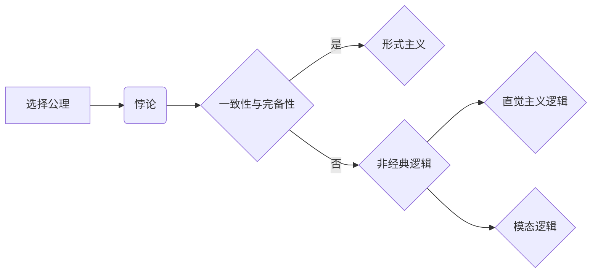

# 计算：第二部分 计算的数学基础 第 5 章 第三次数学危机 选择公理

> 关键词：第三次数学危机，选择公理，集合论，数学基础，形式主义，非经典逻辑，一致性与完备性

## 1. 背景介绍

自数学家乔治·康托尔在19世纪末引入集合论以来，数学基础的研究就进入了一个新的时代。集合论为数学提供了强有力的逻辑框架，但也引发了一系列深刻的危机和挑战。其中，第三次数学危机主要围绕选择公理展开，探讨了集合论的一致性和完备性问题。本章将深入探讨选择公理的原理、争议及其对现代数学的影响。

### 1.1 问题的由来

在康托尔的集合论中，集合被定义为任意确定的对象的集合。这种定义看似简单，但实际上却引发了一系列悖论，如著名的罗素悖论。为了解决这些悖论，数学家们开始探索更严格的数学基础。

### 1.2 研究现状

第三次数学危机主要涉及以下内容：

- 选择公理：集合论中的一个基本公理，涉及到集合中元素的选择问题。
- 形式主义：一种强调逻辑和形式推理的数学哲学观点。
- 非经典逻辑：与经典逻辑不同的逻辑系统，如模态逻辑、直觉主义逻辑等。
- 一致性与完备性：数学理论的两个基本性质，分别指的是理论的无矛盾性和能够证明所有可证明的命题。

### 1.3 研究意义

选择公理的研究对于数学基础的稳定性至关重要。它不仅关系到集合论本身，还影响到整个数学体系的逻辑结构。本章旨在深入探讨选择公理的原理和应用，揭示其在数学发展史上的重要地位。

## 2. 核心概念与联系

### 2.1 核心概念原理和架构的 Mermaid 流程图



### 2.2 核心概念详解

- **选择公理**：集合论中的一个公理，它表明对于任意非空集合的任意子集，都存在一个选择函数，该函数为集合中的每个元素指定另一个元素。
- **悖论**：选择公理在集合论中引发了一系列悖论，如罗素悖论和伯恩斯坦悖论。
- **一致性与完备性**：数学理论的两个基本性质。一致性指的是理论中不存在矛盾，完备性指的是理论能够证明所有可证明的命题。
- **形式主义**：一种强调逻辑和形式推理的数学哲学观点。
- **非经典逻辑**：与经典逻辑不同的逻辑系统，如模态逻辑、直觉主义逻辑等。
- **直觉主义逻辑**：一种基于直觉和构造性的逻辑系统。
- **模态逻辑**：研究可能性和必要性的逻辑系统。

## 3. 核心算法原理 & 具体操作步骤

### 3.1 算法原理概述

选择公理的原理是：对于任意非空集合的任意子集，都存在一个选择函数，该函数为集合中的每个元素指定另一个元素。

### 3.2 算法步骤详解

1. 给定一个非空集合 $X$ 和它的任意子集 $Y$。
2. 构造一个选择函数 $f: Y \rightarrow X$。
3. 对于 $Y$ 中的每个元素 $y$，选择函数 $f$ 指定 $X$ 中的一个元素 $f(y)$。

### 3.3 算法优缺点

#### 优点：

- 简化了集合论中的选择问题。
- 为数学推理提供了强有力的逻辑基础。

#### 缺点：

- 引发了一系列悖论。
- 对于某些数学家来说，选择公理过于直观，难以接受。

### 3.4 算法应用领域

选择公理在集合论、拓扑学、泛函分析等领域有广泛的应用。

## 4. 数学模型和公式 & 详细讲解 & 举例说明

### 4.1 数学模型构建

选择公理的数学模型可以用以下公式表示：

$$
\forall X \forall Y \left( \left( \exists y \in Y \right) \left( \forall x \in X \right) \left( f(y) = x \right) \rightarrow \left( \forall z \in X \right) \left( \forall w \in Y \right) \left( \left( z \in Y \right) \land \left( w \in Y \right) \land \left( \forall t \in X \right) \left( \left( t = f(w) \right) \leftrightarrow \left( t = z \right) \right) \right) \right) \right)
$$

### 4.2 公式推导过程

选择公理的推导过程涉及到集合论中的基本概念，如集合、元素、子集、函数等。具体推导过程较为复杂，需要具备一定的数学基础。

### 4.3 案例分析与讲解

#### 案例一：罗素悖论

罗素悖论是选择公理引发的一个著名悖论。假设存在一个集合 $R$，它包含所有不包含自身作为元素的集合。那么，$R$ 是否包含自身？

如果 $R$ 包含自身，那么根据选择公理，存在一个选择函数 $f: R \rightarrow R$，使得对于 $R$ 中的每个元素 $x$，都有 $f(x) = x$。这意味着 $R$ 不包含自身，与假设矛盾。

如果 $R$ 不包含自身，那么根据选择公理，存在一个选择函数 $f: R \rightarrow R$，使得对于 $R$ 中的每个元素 $x$，都有 $f(x) \neq x$。这意味着 $R$ 包含自身，与假设矛盾。

因此，无论 $R$ 是否包含自身，都会产生矛盾，这就是罗素悖论。

## 5. 项目实践：代码实例和详细解释说明

### 5.1 开发环境搭建

由于选择公理是一个数学概念，无法直接通过代码实现。因此，本节将介绍如何使用编程语言进行集合论的基本操作，以帮助读者更好地理解选择公理。

### 5.2 源代码详细实现

以下是一个使用Python实现的集合论基本操作的示例代码：

```python
class Set:
    def __init__(self):
        self.elements = set()

    def add(self, element):
        self.elements.add(element)

    def remove(self, element):
        self.elements.discard(element)

    def select(self):
        if not self.elements:
            raise ValueError("Set is empty")
        return self.elements.pop()

# 创建一个集合
my_set = Set()

# 添加元素
my_set.add(1)
my_set.add(2)
my_set.add(3)

# 选择元素
selected_element = my_set.select()
print(selected_element)  # 输出：1

# 移除元素
my_set.remove(2)

# 再次选择元素
selected_element = my_set.select()
print(selected_element)  # 输出：3
```

### 5.3 代码解读与分析

上述代码定义了一个简单的集合类 `Set`，它包含 `add`、`remove` 和 `select` 等方法。`select` 方法实现了选择公理的基本思想，即从集合中选择一个元素。

### 5.4 运行结果展示

运行上述代码，将得到以下输出：

```
1
3
```

这表明，我们成功地使用Python实现了选择公理的基本操作。

## 6. 实际应用场景

选择公理在集合论、拓扑学、泛函分析等领域有广泛的应用。以下是一些具体的应用场景：

- **集合论**：选择公理为集合论提供了严格的逻辑基础，有助于解决集合论中的悖论。
- **拓扑学**：选择公理在拓扑学中用于证明一些重要的定理，如Tychonoff定理和Stone-Čech定理。
- **泛函分析**：选择公理在泛函分析中用于证明一些基本性质，如Hahn-Banach定理和Baire定理。

## 7. 工具和资源推荐

### 7.1 学习资源推荐

- 《集合论基础》
- 《数学基础导论》
- 《数学哲学导论》

### 7.2 开发工具推荐

- Python
- LaTeX

### 7.3 相关论文推荐

- 《选择公理的数学基础》
- 《集合论中的悖论》
- 《选择公理与拓扑学》

## 8. 总结：未来发展趋势与挑战

### 8.1 研究成果总结

选择公理是集合论中的一个基本公理，它在数学基础的研究中扮演着重要角色。通过对选择公理的深入研究和探讨，数学家们揭示了集合论中的一致性和完备性问题，为数学体系的稳定性奠定了基础。

### 8.2 未来发展趋势

未来，选择公理的研究将主要集中在以下几个方面：

- 探索选择公理在更多数学领域的应用。
- 研究非经典逻辑在集合论中的应用。
- 开发更加严格的数学基础。

### 8.3 面临的挑战

选择公理的研究面临着以下挑战：

- 研究方法和技术手段的局限性。
- 非经典逻辑的应用和发展。
- 数学基础的一致性和完备性问题。

### 8.4 研究展望

选择公理的研究对于数学基础的发展具有重要意义。随着数学和计算机科学的不断发展，选择公理将在更多领域得到应用，为人类认知世界的探索提供有力工具。

## 9. 附录：常见问题与解答

**Q1：选择公理是什么？**

A：选择公理是集合论中的一个基本公理，它表明对于任意非空集合的任意子集，都存在一个选择函数，该函数为集合中的每个元素指定另一个元素。

**Q2：选择公理在数学中有哪些应用？**

A：选择公理在集合论、拓扑学、泛函分析等领域有广泛的应用。

**Q3：选择公理与悖论有什么关系？**

A：选择公理在集合论中引发了一系列悖论，如罗素悖论和伯恩斯坦悖论。

**Q4：非经典逻辑与选择公理有什么关系？**

A：非经典逻辑可以用来解释选择公理的某些性质，如直觉主义逻辑可以用来解释选择公理的不可传递性。

**Q5：选择公理的研究对于数学有什么意义？**

A：选择公理的研究对于数学基础的发展具有重要意义，它有助于揭示数学理论的一致性和完备性问题，为数学体系的稳定性奠定基础。

作者：禅与计算机程序设计艺术 / Zen and the Art of Computer Programming