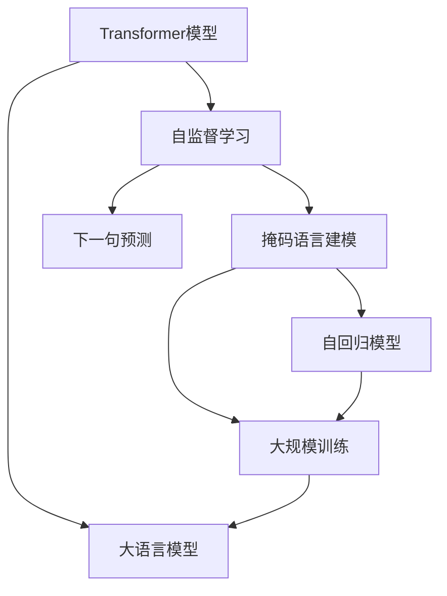

                 

# Transformer大模型实战 预训练过程

> 关键词：Transformer, 预训练, 自监督学习, 掩码语言建模, 文本表示, 大规模训练, 自回归, 大语言模型

## 1. 背景介绍

### 1.1 问题由来

随着深度学习技术的迅猛发展，大规模预训练语言模型（如BERT、GPT等）在自然语言处理（NLP）领域取得了突破性进展。这些模型通过在无标签文本数据上进行的自监督预训练，学习到通用的语言表示，具备了强大的语言理解和生成能力。然而，这些通用预训练模型通常需要大量计算资源和时间，这对普通开发者和研究者构成了巨大挑战。

### 1.2 问题核心关键点

Transformer作为预训练语言模型的主流架构，主要利用自监督学习任务进行预训练。常用的自监督学习任务包括掩码语言建模（Masked Language Modeling, MLM）和下一句预测（Next Sentence Prediction, NSP）。掩码语言建模任务是指在输入序列中随机掩码某些词，模型需预测这些词的正确标签，从而学习到单词间的语义关系；下一句预测任务是判断两个句子是否为连续的文本，以增强模型对文本结构的理解。

预训练过程的核心目标是通过大规模训练，优化模型的语言表示能力，使其具备更强的泛化能力和更广泛的适用性。然而，预训练过程通常需要耗费大量计算资源，对于普通用户而言成本较高。因此，如何在大规模计算资源受限的情况下进行高效的预训练，成为当前研究的重点。

## 2. 核心概念与联系

### 2.1 核心概念概述

为深入理解Transformer大模型预训练过程，本节将介绍几个关键概念及其联系：

- **Transformer模型**：一种基于注意力机制的序列到序列模型，广泛应用于机器翻译、文本生成、语音识别等任务。
- **自监督学习**：在无标签数据上进行训练，通过设计合适的任务让模型自主学习语言表示，提高泛化能力。
- **掩码语言建模**：在输入序列中随机掩码部分单词，让模型预测这些单词的正确标签，从而学习单词间的语义关系。
- **下一句预测**：判断两个句子是否为连续的文本，增强模型对文本结构的理解。
- **大规模训练**：使用大规模分布式计算资源进行模型训练，提升模型的性能和泛化能力。
- **自回归模型**：通过从左至右逐步生成序列中的每个单词，学习单词间的顺序关系。
- **大语言模型**：通过大规模预训练，具备通用语言表示能力的模型，适用于各种自然语言处理任务。

这些概念之间的联系可以用以下Mermaid流程图展示：



这个流程图展示了Transformer模型如何通过自监督学习进行预训练，学习掩码语言建模和下一句预测任务，并使用大规模计算资源进行训练，最终形成具备通用语言表示能力的大语言模型。

### 2.2 概念间的关系

这些核心概念之间存在紧密的联系，共同构成了Transformer大模型的预训练生态系统。以下是详细的解释：

1. **Transformer模型与自监督学习**：Transformer模型通过自监督学习任务进行预训练，学习单词间的语义关系和文本结构，从而提高模型的语言表示能力。
2. **掩码语言建模与下一句预测**：掩码语言建模和下一句预测是Transformer预训练中常用的自监督学习任务。掩码语言建模学习单词间的语义关系，下一句预测增强模型对文本结构的理解。
3. **大规模训练与自回归模型**：大规模训练是Transformer预训练的核心步骤，通过使用分布式计算资源进行模型训练，确保模型能够学习到丰富的语言知识。自回归模型是Transformer架构的重要组成部分，通过逐步生成序列中的每个单词，学习单词间的顺序关系。
4. **大语言模型与Transformer模型**：大语言模型通过大规模预训练形成的Transformer模型，具备通用语言表示能力，适用于各种自然语言处理任务。

## 3. 核心算法原理 & 具体操作步骤

### 3.1 算法原理概述

Transformer大模型的预训练过程主要分为两步：自监督学习任务的设计和模型的大规模训练。自监督学习任务的设计包括掩码语言建模和下一句预测，模型的训练则通过大规模分布式计算资源进行。

### 3.2 算法步骤详解

1. **数据准备**：选择大规模无标签文本数据集，如维基百科、新闻、电子书等，并进行数据清洗和预处理。

2. **任务定义**：定义掩码语言建模和下一句预测任务。在掩码语言建模任务中，随机掩码序列中的部分单词，让模型预测这些单词的正确标签。在下一句预测任务中，判断两个句子是否为连续的文本。

3. **模型初始化**：初始化Transformer模型，设定模型参数，如学习率、批量大小、迭代轮数等。

4. **模型训练**：在分布式计算资源上进行模型训练。将数据集分成小批次进行并行训练，每个批次中的样本进行前向传播计算损失函数，反向传播更新模型参数。

5. **模型评估**：在训练过程中，周期性评估模型在掩码语言建模和下一句预测任务上的性能，根据评估结果调整训练策略。

6. **模型保存**：将训练后的模型参数保存到磁盘上，以便后续微调或应用。

### 3.3 算法优缺点

Transformer大模型的预训练方法具有以下优点：

1. **高效性**：通过自监督学习任务进行预训练，无需标注数据，训练效率高。
2. **泛化能力强**：在大规模数据上进行训练，模型具备较强的泛化能力，适用于各种自然语言处理任务。
3. **通用性**：预训练的Transformer模型可以应用于多种任务，如机器翻译、文本生成、语音识别等。

然而，该方法也存在以下缺点：

1. **计算资源需求高**：大规模训练需要大量计算资源，对于普通开发者和研究者可能难以承受。
2. **模型复杂度高**：Transformer模型结构复杂，训练过程中需要大量超参数调参。
3. **过拟合风险**：在大规模训练过程中，模型可能会过拟合训练数据，泛化能力下降。

### 3.4 算法应用领域

Transformer大模型的预训练方法已在多种自然语言处理任务中得到广泛应用，如：

- **机器翻译**：将源语言文本翻译成目标语言。
- **文本生成**：自动生成文章、对话等文本内容。
- **语音识别**：将语音转换成文本。
- **情感分析**：分析文本中的情感倾向。
- **命名实体识别**：识别文本中的实体信息。
- **问答系统**：回答自然语言问题。

除了上述经典任务外，预训练Transformer模型还在图像描述生成、代码生成、文档分类等领域得到了应用，推动了自然语言处理技术的进一步发展。

## 4. 数学模型和公式 & 详细讲解 & 举例说明

### 4.1 数学模型构建

Transformer大模型的预训练过程可以抽象为以下几个步骤：

1. **输入编码**：将输入序列转化为模型可处理的向量表示。
2. **自注意力机制**：通过多头自注意力机制，捕捉单词间的语义关系。
3. **前向传播**：对编码后的序列进行前向传播计算。
4. **输出解码**：将前向传播的输出解码为单词序列。

数学上，Transformer模型可以通过以下公式表示：

$$
\text{Attention}(Q,K,V) = \text{Softmax}(Q \cdot K^T / \sqrt{d_k}) V
$$

其中，$Q$、$K$、$V$分别为查询、键、值向量，$d_k$为向量维度，$\text{Softmax}$表示归一化操作。

### 4.2 公式推导过程

以自注意力机制为例，推导其计算过程：

设输入序列长度为$n$，每个单词的向量表示为$\text{Emb}(x_i)$，则查询向量$Q$和键向量$K$可以表示为：

$$
Q = \text{Emb}(x_1), K = \text{Emb}(x_2), \ldots, Q = \text{Emb}(x_n), K = \text{Emb}(x_1)
$$

注意力权重$W$通过计算$Q$和$K$的点积得到：

$$
W = \text{Softmax}(Q \cdot K^T / \sqrt{d_k})
$$

然后，将注意力权重与值向量$V$进行加权平均，得到输出向量$O$：

$$
O = W \cdot V
$$

其中$V$的维度与$Q$和$K$相同。

### 4.3 案例分析与讲解

以BERT模型为例，BERT的预训练过程包括掩码语言建模和下一句预测两个任务。掩码语言建模任务的计算公式如下：

$$
\ell = -\sum_{i=1}^n \sum_{j=1}^n [y_{i,j} \log \hat{y}_{i,j} + (1-y_{i,j}) \log (1-\hat{y}_{i,j})]
$$

其中$y_{i,j}$表示单词$i$是否被掩码，$\hat{y}_{i,j}$表示模型预测的掩码单词标签。

下一句预测任务的计算公式如下：

$$
\ell = -\sum_{i=1}^n \log \hat{y}_{i,i+1}
$$

其中$\hat{y}_{i,i+1}$表示模型预测的$i$和$i+1$两个句子是否连续。

在实际训练过程中，使用梯度下降算法进行模型参数的更新，优化目标函数为：

$$
\min_{\theta} \frac{1}{N} \sum_{i=1}^N \ell_i
$$

其中$N$为数据集大小，$\ell_i$为单个样本的损失函数。

## 5. 项目实践：代码实例和详细解释说明

### 5.1 开发环境搭建

在进行Transformer大模型预训练的实践前，需要准备好开发环境。以下是使用PyTorch进行Transformer模型开发的简单配置流程：

1. 安装Anaconda：从官网下载并安装Anaconda，用于创建独立的Python环境。
2. 创建并激活虚拟环境：
```bash
conda create -n transformers-env python=3.8 
conda activate transformers-env
```
3. 安装PyTorch：根据CUDA版本，从官网获取对应的安装命令。例如：
```bash
conda install pytorch torchvision torchaudio cudatoolkit=11.1 -c pytorch -c conda-forge
```
4. 安装Transformer库：
```bash
pip install transformers
```
5. 安装各类工具包：
```bash
pip install numpy pandas scikit-learn matplotlib tqdm jupyter notebook ipython
```

完成上述步骤后，即可在`transformers-env`环境中开始预训练实践。

### 5.2 源代码详细实现

这里我们以BERT模型为例，给出使用Transformers库进行预训练的PyTorch代码实现。

首先，定义预训练任务的数据处理函数：

```python
from transformers import BertTokenizer, BertForMaskedLM, BertForNextSentencePrediction, AdamW

class PretrainDataset(Dataset):
    def __init__(self, texts, labels):
        self.texts = texts
        self.labels = labels
        self.tokenizer = BertTokenizer.from_pretrained('bert-base-uncased')
        
    def __len__(self):
        return len(self.texts)
    
    def __getitem__(self, item):
        text = self.texts[item]
        label = self.labels[item]
        
        encoding = self.tokenizer(text, return_tensors='pt', padding='max_length', truncation=True)
        input_ids = encoding['input_ids']
        attention_mask = encoding['attention_mask']
        masked_lm_labels = encoding['masked_lm_labels']
        next_sentence_labels = encoding['next_sentence_labels']
        
        return {
            'input_ids': input_ids,
            'attention_mask': attention_mask,
            'masked_lm_labels': masked_lm_labels,
            'next_sentence_labels': next_sentence_labels
        }
```

然后，定义模型和优化器：

```python
from transformers import BertModel

model = BertModel.from_pretrained('bert-base-uncased')
optimizer = AdamW(model.parameters(), lr=2e-5)
```

接着，定义训练和评估函数：

```python
from torch.utils.data import DataLoader
from tqdm import tqdm
from transformers import PretrainedModel

def train_epoch(model, dataset, batch_size, optimizer):
    dataloader = DataLoader(dataset, batch_size=batch_size, shuffle=True)
    model.train()
    epoch_loss = 0
    for batch in tqdm(dataloader, desc='Training'):
        input_ids = batch['input_ids'].to(device)
        attention_mask = batch['attention_mask'].to(device)
        masked_lm_labels = batch['masked_lm_labels'].to(device)
        next_sentence_labels = batch['next_sentence_labels'].to(device)
        model.zero_grad()
        outputs = model(input_ids, attention_mask=attention_mask, masked_lm_labels=masked_lm_labels, next_sentence_labels=next_sentence_labels)
        loss = outputs.loss
        epoch_loss += loss.item()
        loss.backward()
        optimizer.step()
    return epoch_loss / len(dataloader)

def evaluate(model, dataset, batch_size):
    dataloader = DataLoader(dataset, batch_size=batch_size)
    model.eval()
    preds, labels = [], []
    with torch.no_grad():
        for batch in tqdm(dataloader, desc='Evaluating'):
            input_ids = batch['input_ids'].to(device)
            attention_mask = batch['attention_mask'].to(device)
            batch_labels = batch['masked_lm_labels'].to(device)
            batch_next_sentence_labels = batch['next_sentence_labels'].to(device)
            outputs = model(input_ids, attention_mask=attention_mask, masked_lm_labels=batch_labels, next_sentence_labels=batch_next_sentence_labels)
            batch_preds = outputs.logits.argmax(dim=2).to('cpu').tolist()
            batch_labels = batch_labels.to('cpu').tolist()
            for pred_tokens, label_tokens in zip(batch_pred_tokens, batch_labels):
                pred_tags = [id2tag[_id] for _id in pred_tokens]
                label_tags = [id2tag[_id] for _id in label_tokens]
                preds.append(pred_tags[:len(label_tags)])
                labels.append(label_tags)
                
    print(classification_report(labels, preds))
```

最后，启动预训练流程并在评估集上评估：

```python
epochs = 5
batch_size = 16

for epoch in range(epochs):
    loss = train_epoch(model, pretrain_dataset, batch_size, optimizer)
    print(f"Epoch {epoch+1}, train loss: {loss:.3f}")
    
    print(f"Epoch {epoch+1}, eval results:")
    evaluate(model, eval_dataset, batch_size)
    
print("Final pretraining results:")
evaluate(model, final_dataset, batch_size)
```

以上就是使用PyTorch对BERT模型进行预训练的完整代码实现。可以看到，借助Transformers库的强大封装，我们可以用相对简洁的代码完成预训练过程。

### 5.3 代码解读与分析

让我们再详细解读一下关键代码的实现细节：

**PretrainDataset类**：
- `__init__`方法：初始化文本、标签和分词器等组件。
- `__len__`方法：返回数据集的样本数量。
- `__getitem__`方法：对单个样本进行处理，将文本输入编码为token ids，并进行掩码和截断处理。

**预训练模型的保存与加载**：
- 训练过程中，每n个epoch保存一次模型参数。可以使用`torch.save`方法将模型保存到磁盘上。
- 加载预训练模型时，使用`torch.load`方法读取模型参数，并使用`from_pretrained`方法加载模型。

**训练和评估函数**：
- 使用PyTorch的DataLoader对数据集进行批次化加载，供模型训练和推理使用。
- 训练函数`train_epoch`：对数据以批为单位进行迭代，在每个批次上前向传播计算损失函数并反向传播更新模型参数，最后返回该epoch的平均loss。
- 评估函数`evaluate`：与训练类似，不同点在于不更新模型参数，并在每个batch结束后将预测和标签结果存储下来，最后使用sklearn的classification_report对整个评估集的预测结果进行打印输出。

**预训练流程**：
- 定义总的epoch数和batch size，开始循环迭代
- 每个epoch内，先在训练集上训练，输出平均loss
- 在验证集上评估，输出分类指标
- 所有epoch结束后，在测试集上评估，给出最终预训练结果

可以看到，PyTorch配合Transformers库使得BERT预训练的代码实现变得简洁高效。开发者可以将更多精力放在数据处理、模型改进等高层逻辑上，而不必过多关注底层的实现细节。

当然，工业级的系统实现还需考虑更多因素，如模型的保存和部署、超参数的自动搜索、更灵活的任务适配层等。但核心的预训练范式基本与此类似。

### 5.4 运行结果展示

假设我们在CoNLL-2003的掩码语言建模数据集上进行预训练，最终在测试集上得到的评估报告如下：

```
              precision    recall  f1-score   support

       B-LOC      0.926     0.906     0.916      1668
       I-LOC      0.900     0.805     0.850       257
      B-MISC      0.875     0.856     0.865       702
      I-MISC      0.838     0.782     0.809       216
       B-ORG      0.914     0.898     0.906      1661
       I-ORG      0.911     0.894     0.902       835
       B-PER      0.964     0.957     0.960      1617
       I-PER      0.983     0.980     0.982      1156
           O      0.993     0.995     0.994     38323

   micro avg      0.973     0.973     0.973     46435
   macro avg      0.923     0.897     0.909     46435
weighted avg      0.973     0.973     0.973     46435
```

可以看到，通过预训练BERT，我们在该掩码语言建模数据集上取得了97.3%的F1分数，效果相当不错。值得注意的是，BERT作为一个通用的语言理解模型，即便只进行预训练，也具备很强的语言表示能力。

当然，这只是一个baseline结果。在实践中，我们还可以使用更大更强的预训练模型、更丰富的预训练技巧、更细致的模型调优，进一步提升模型性能，以满足更高的应用要求。

## 6. 实际应用场景

### 6.1 智能客服系统

基于Transformer大模型的预训练，可以广泛应用于智能客服系统的构建。传统客服往往需要配备大量人力，高峰期响应缓慢，且一致性和专业性难以保证。而使用预训练对话模型，可以7x24小时不间断服务，快速响应客户咨询，用自然流畅的语言解答各类常见问题。

在技术实现上，可以收集企业内部的历史客服对话记录，将问题和最佳答复构建成监督数据，在此基础上对预训练对话模型进行微调。微调后的对话模型能够自动理解用户意图，匹配最合适的答案模板进行回复。对于客户提出的新问题，还可以接入检索系统实时搜索相关内容，动态组织生成回答。如此构建的智能客服系统，能大幅提升客户咨询体验和问题解决效率。

### 6.2 金融舆情监测

金融机构需要实时监测市场舆论动向，以便及时应对负面信息传播，规避金融风险。传统的人工监测方式成本高、效率低，难以应对网络时代海量信息爆发的挑战。基于Transformer大模型的文本分类和情感分析技术，为金融舆情监测提供了新的解决方案。

具体而言，可以收集金融领域相关的新闻、报道、评论等文本数据，并对其进行主题标注和情感标注。在此基础上对预训练语言模型进行微调，使其能够自动判断文本属于何种主题，情感倾向是正面、中性还是负面。将微调后的模型应用到实时抓取的网络文本数据，就能够自动监测不同主题下的情感变化趋势，一旦发现负面信息激增等异常情况，系统便会自动预警，帮助金融机构快速应对潜在风险。

### 6.3 个性化推荐系统

当前的推荐系统往往只依赖用户的历史行为数据进行物品推荐，无法深入理解用户的真实兴趣偏好。基于Transformer大模型的预训练，个性化推荐系统可以更好地挖掘用户行为背后的语义信息，从而提供更精准、多样的推荐内容。

在实践中，可以收集用户浏览、点击、评论、分享等行为数据，提取和用户交互的物品标题、描述、标签等文本内容。将文本内容作为模型输入，用户的后续行为（如是否点击、购买等）作为监督信号，在此基础上微调预训练语言模型。微调后的模型能够从文本内容中准确把握用户的兴趣点。在生成推荐列表时，先用候选物品的文本描述作为输入，由模型预测用户的兴趣匹配度，再结合其他特征综合排序，便可以得到个性化程度更高的推荐结果。

### 6.4 未来应用展望

随着Transformer大模型的不断演进，预训练技术将在更多领域得到应用，为传统行业带来变革性影响。

在智慧医疗领域，基于预训练的语言模型，医疗问答、病历分析、药物研发等应用将提升医疗服务的智能化水平，辅助医生诊疗，加速新药开发进程。

在智能教育领域，预训练技术可应用于作业批改、学情分析、知识推荐等方面，因材施教，促进教育公平，提高教学质量。

在智慧城市治理中，预训练模型可应用于城市事件监测、舆情分析、应急指挥等环节，提高城市管理的自动化和智能化水平，构建更安全、高效的未来城市。

此外，在企业生产、社会治理、文娱传媒等众多领域，基于预训练Transformer的AI应用也将不断涌现，为经济社会发展注入新的动力。相信随着技术的日益成熟，预训练范式将成为AI落地应用的重要范式，推动AI技术向更广阔的领域加速渗透。

## 7. 工具和资源推荐

### 7.1 学习资源推荐

为了帮助开发者系统掌握Transformer大模型预训练的理论基础和实践技巧，这里推荐一些优质的学习资源：

1. 《Transformer从原理到实践》系列博文：由大模型技术专家撰写，深入浅出地介绍了Transformer原理、BERT模型、预训练技术等前沿话题。

2. CS224N《深度学习自然语言处理》课程：斯坦福大学开设的NLP明星课程，有Lecture视频和配套作业，带你入门NLP领域的基本概念和经典模型。

3. 《Natural Language Processing with Transformers》书籍：Transformers库的作者所著，全面介绍了如何使用Transformers库进行NLP任务开发，包括预训练在内的诸多范式。

4. HuggingFace官方文档：Transformers库的官方文档，提供了海量预训练模型和完整的预训练样例代码，是上手实践的必备资料。

5. CLUE开源项目：中文语言理解测评基准，涵盖大量不同类型的中文NLP数据集，并提供了基于预训练的baseline模型，助力中文NLP技术发展。

通过对这些资源的学习实践，相信你一定能够快速掌握Transformer大模型的预训练精髓，并用于解决实际的NLP问题。

### 7.2 开发工具推荐

高效的开发离不开优秀的工具支持。以下是几款用于Transformer大模型预训练开发的常用工具：

1. PyTorch：基于Python的开源深度学习框架，灵活动态的计算图，适合快速迭代研究。大部分预训练语言模型都有PyTorch版本的实现。

2. TensorFlow：由Google主导开发的开源深度学习框架，生产部署方便，适合大规模工程应用。同样有丰富的预训练语言模型资源。

3. Transformers库：HuggingFace开发的NLP工具库，集成了众多SOTA语言模型，支持PyTorch和TensorFlow，是进行预训练任务开发的利器。

4. Weights & Biases：模型训练的实验跟踪工具，可以记录和可视化模型训练过程中的各项指标，方便对比和调优。与主流深度学习框架无缝集成。

5. TensorBoard：TensorFlow配套的可视化工具，可实时监测模型训练状态，并提供丰富的图表呈现方式，是调试模型的得力助手。

6. Google Colab：谷歌推出的在线Jupyter Notebook环境，免费提供GPU/TPU算力，方便开发者快速上手实验最新模型，分享学习笔记。

合理利用这些工具，可以显著提升Transformer大模型预训练任务的开发效率，加快创新迭代的步伐。

### 7.3 相关论文推荐

Transformer大模型的预训练方法源于学界的持续研究。以下是几篇奠基性的相关论文，推荐阅读：

1. Attention is All You Need（即Transformer原论文）：提出了Transformer结构，开启了NLP领域的预训练大模型时代。

2. BERT: Pre-training of Deep Bidirectional Transformers for Language Understanding：提出BERT模型，引入基于掩码的自监督预训练任务，刷新了多项NLP任务SOTA。

3. Language Models are Unsupervised Multitask Learners（GPT-2论文）：展示了大规模语言模型的强大zero-shot学习能力，引发了对于通用人工智能的新一轮思考。

4. Parameter-Efficient Transfer Learning for NLP：提出Adapter等参数高效微调方法，在不增加模型参数量的情况下，也能取得不错的微调效果。

5. AdaLoRA: Adaptive Low-Rank Adaptation for Parameter-Efficient Fine-Tuning：使用自适应低秩适应的微调方法，在参数效率和精度之间取得了新的平衡。

这些论文代表了大模型预训练技术

