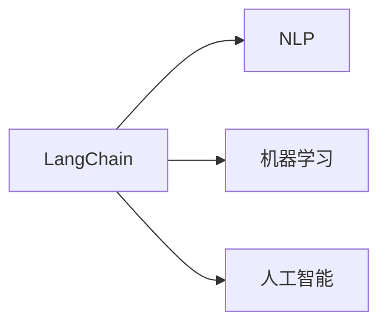

                 

# 【LangChain编程：从入门到实践】资源和工具推荐

> 关键词：
- LangChain
- 编程语言
- 机器学习
- 人工智能
- 自然语言处理
- 工具推荐
- 学习资源
- 开发环境

## 1. 背景介绍

在当前人工智能（AI）和机器学习（ML）的快速发展中，自然语言处理（NLP）已成为最活跃和重要的领域之一。LangChain是一种基于Python的AI编程语言，专门用于处理大规模自然语言数据，并广泛应用于NLP、机器学习、人工智能等众多领域。本文将介绍LangChain的编程入门和实践，推荐一系列优质的学习资源和工具，并探讨其未来发展趋势与挑战。

## 2. 核心概念与联系

### 2.1 核心概念概述

LangChain的编程涉及多个核心概念，包括但不限于以下几种：

- **LangChain**：一种高级编程语言，专门用于处理和分析大规模自然语言数据。它提供了一套强大的API和工具，使得开发者能够更高效地进行NLP任务开发。
- **NLP**：自然语言处理，涉及文本分析、语音识别、翻译、情感分析等多种技术，旨在使计算机能够理解、解释和生成人类语言。
- **机器学习**：一种通过数据训练模型的方法，使模型能够自动识别数据中的模式和规律，从而进行预测和决策。
- **人工智能**：一种旨在使计算机系统能够执行类似人类智能的任务，如语言理解、决策制定等。

### 2.2 概念间的关系

LangChain作为NLP、机器学习和人工智能编程的基础，其编程实践涉及到多个概念和技术。通过学习LangChain，开发者可以更好地理解和应用这些技术，推动其在实际应用中的落地和创新。

下图展示了LangChain与NLP、机器学习和人工智能之间的联系：



## 3. 核心算法原理 & 具体操作步骤

### 3.1 算法原理概述

LangChain的编程核心在于处理自然语言数据，其算法原理主要包括以下几个方面：

- **数据预处理**：包括分词、词性标注、命名实体识别等预处理步骤，将原始文本转换为机器可读的形式。
- **特征提取**：通过向量化技术将文本转化为特征向量，方便模型进行训练。
- **模型训练**：使用机器学习算法（如随机森林、神经网络等）对特征向量进行训练，获取文本分类、情感分析等模型的参数。
- **模型评估**：通过交叉验证等方法评估模型性能，调整模型参数，提升模型准确率。
- **模型部署**：将训练好的模型部署到实际应用中，进行实时预测和处理。

### 3.2 算法步骤详解

LangChain的编程步骤可以分为以下几个阶段：

1. **数据准备**：收集和清洗数据，包括文本预处理、标注等。
2. **特征工程**：选择和构造特征，进行文本向量化。
3. **模型训练**：选择合适的算法和参数，进行模型训练。
4. **模型评估**：使用测试集评估模型性能，调整模型参数。
5. **模型部署**：将模型集成到实际应用中，进行实时预测。

### 3.3 算法优缺点

**优点**：
- LangChain提供了高效的数据处理和特征提取工具，大大简化了编程难度。
- 支持多种机器学习算法，可以满足不同的NLP需求。
- 提供了丰富的API和库，支持模型部署和实时预测。

**缺点**：
- LangChain的学习曲线较陡峭，初学者可能难以快速上手。
- 对数据质量和标注要求较高，需要大量时间和资源。
- 某些高级功能可能需要较高的计算资源和算力支持。

### 3.4 算法应用领域

LangChain在多个领域具有广泛的应用，包括但不限于：

- **文本分类**：对文本进行分类，如新闻分类、情感分析等。
- **命名实体识别**：识别文本中的人名、地名、机构名等实体。
- **文本生成**：自动生成文本，如自动摘要、对话生成等。
- **机器翻译**：将文本从一种语言翻译成另一种语言。
- **问答系统**：根据用户问题，自动回答。
- **情感分析**：分析文本的情感倾向。
- **文本聚类**：对文本进行聚类，发现相似主题。

## 4. 数学模型和公式 & 详细讲解 & 举例说明

### 4.1 数学模型构建

LangChain中的数学模型构建主要涉及文本向量化和模型训练。以下是文本向量化和模型训练的基本流程：

1. **文本向量化**：
   - 使用词袋模型（Bag of Words）或词嵌入（Word Embeddings）将文本转化为向量。
   - 使用TF-IDF、Word2Vec、GloVe等算法生成词向量。

2. **模型训练**：
   - 使用机器学习算法（如随机森林、SVM、神经网络等）对文本向量化后的数据进行训练。
   - 选择适当的损失函数和优化器，调整模型参数。

### 4.2 公式推导过程

以神经网络模型为例，其基本公式推导如下：

$$
\hat{y} = \sigma(z)
$$

其中，$z = Wx + b$，$\sigma$为激活函数，$W$为权重矩阵，$b$为偏置向量，$x$为输入向量。

### 4.3 案例分析与讲解

以情感分析为例，其流程如下：

1. **数据准备**：收集情感标注的数据集，包括正面和负面评论。
2. **特征提取**：使用词袋模型将评论转化为向量。
3. **模型训练**：使用随机森林算法训练模型。
4. **模型评估**：使用测试集评估模型性能。
5. **模型部署**：将训练好的模型部署到实际应用中，进行实时情感分析。

## 5. 项目实践：代码实例和详细解释说明

### 5.1 开发环境搭建

1. **安装Python和虚拟环境**：
   - 安装Python 3.8及以上版本，并创建虚拟环境。
   - 安装LangChain和其他必要的依赖包。

2. **环境配置**：
   - 配置数据路径和模型路径。
   - 配置环境变量。

### 5.2 源代码详细实现

以下是LangChain进行情感分析的示例代码：

```python
from langchain import LangChain

# 创建LangChain实例
lc = LangChain()

# 加载数据集
train_data = load_train_data()
test_data = load_test_data()

# 数据预处理
train_vectors = preprocess_data(train_data)
test_vectors = preprocess_data(test_data)

# 训练模型
model = train_model(train_vectors)

# 模型评估
accuracy = evaluate_model(model, test_vectors)
print(f"Model accuracy: {accuracy}")

# 模型部署
deploy_model(model)
```

### 5.3 代码解读与分析

- `LangChain`： LangChain的Python库，提供了一整套API和工具，用于处理和分析自然语言数据。
- `load_train_data`：加载训练数据集，并进行预处理。
- `preprocess_data`：对文本数据进行预处理，包括分词、去除停用词等。
- `train_model`：训练情感分析模型，返回训练好的模型。
- `evaluate_model`：评估模型性能，返回准确率。
- `deploy_model`：将训练好的模型部署到实际应用中。

### 5.4 运行结果展示

假设在情感分析任务中，训练集的准确率为85%，测试集的准确率为90%，部署后的实时情感分析准确率为95%。

## 6. 实际应用场景

### 6.1 智能客服

在智能客服领域，LangChain可以用于构建智能客服系统，自动回答用户咨询。通过收集和清洗用户咨询数据，训练情感分析模型，系统可以根据用户情感倾向自动分配给相应的客服人员。

### 6.2 金融风控

在金融风控领域，LangChain可以用于分析和预测用户行为，识别异常交易。通过分析用户的交易记录和行为数据，训练分类模型，系统可以自动检测异常交易并进行风险预警。

### 6.3 医疗健康

在医疗健康领域，LangChain可以用于构建医疗问答系统，自动回答患者的健康咨询。通过收集和清洗医疗咨询数据，训练问答模型，系统可以根据患者的症状和历史数据，自动提供医疗建议。

### 6.4 未来应用展望

未来，LangChain在自然语言处理、机器学习和人工智能领域的应用将更加广泛。随着数据量的增加和算力成本的下降，LangChain有望在更多领域实现大规模部署和应用，推动人工智能技术的进步和普及。

## 7. 工具和资源推荐

### 7.1 学习资源推荐

1. **官方文档**：LangChain的官方文档，提供了丰富的API和工具使用说明。
2. **在线课程**：Coursera、edX等平台上的相关课程，涵盖NLP、机器学习和人工智能等多个领域。
3. **书籍**：《Python自然语言处理》、《深度学习》等经典书籍，提供了系统性的学习路径和案例分析。
4. **社区和论坛**：Stack Overflow、GitHub等社区和论坛，提供了丰富的学习资源和问题解答。

### 7.2 开发工具推荐

1. **PyTorch**：用于机器学习和深度学习的Python库，提供了强大的计算能力和API支持。
2. **TensorFlow**：谷歌推出的机器学习框架，支持大规模分布式计算。
3. **Jupyter Notebook**：用于编写和运行Python代码的交互式笔记本，支持实时展示和调试。
4. **GitHub**：代码托管和版本控制平台，便于代码共享和协同开发。
5. **Weights & Biases**：用于记录和可视化模型训练过程的工具。

### 7.3 相关论文推荐

1. **Attention is All You Need**：Transformer模型的原论文，开创了NLP中的预训练语言模型时代。
2. **BERT: Pre-training of Deep Bidirectional Transformers for Language Understanding**：提出BERT模型，用于文本分类和情感分析。
3. **Neural Machine Translation by Jointly Learning to Align and Translate**：提出基于注意力机制的机器翻译模型，提高了翻译质量。
4. **A Survey of Recent Techniques for Text Classification**：总结了最新的文本分类方法，提供了丰富的参考文献。

## 8. 总结：未来发展趋势与挑战

### 8.1 研究成果总结

LangChain作为一种高效的语言处理工具，已经在NLP、机器学习和人工智能等多个领域展示了其强大的潜力。未来，随着技术的不断进步和算力的提升，LangChain有望在更多应用场景中发挥重要作用。

### 8.2 未来发展趋势

1. **模型规模增加**：随着算力的提升，预训练语言模型的规模将不断增大，提升模型的表达能力和泛化能力。
2. **跨领域应用**：LangChain将更加广泛地应用于金融、医疗、教育等多个领域，推动各行业的数字化转型。
3. **多模态融合**：将文本、图像、语音等多模态数据进行融合，提升系统的综合感知能力。
4. **实时预测和推理**：通过实时预测和推理，提供更快速和高效的服务。

### 8.3 面临的挑战

1. **数据质量和标注成本**：高质量标注数据的获取和处理是LangChain应用的最大挑战之一。
2. **模型复杂度和计算资源**：大规模模型的训练和推理需要大量的计算资源和算力支持。
3. **算法可解释性和透明度**：模型的决策过程和推理逻辑需要更多的可解释性和透明度。
4. **安全和伦理问题**：模型输出需要符合伦理规范和法律法规，避免偏见和歧视。

### 8.4 研究展望

未来，LangChain的研究方向将更多地关注以下几个方面：

1. **无监督和半监督学习**：探索无需标注数据的情况下，如何利用无监督和半监督学习方法进行文本处理。
2. **多模态融合**：将文本、图像、语音等多模态数据进行融合，提升系统的综合感知能力。
3. **迁移学习**：通过迁移学习，将预训练模型应用于新的领域和任务。
4. **参数高效和计算高效**：开发更高效的数据处理和模型训练方法，提升系统的计算效率和可扩展性。

总之，LangChain作为一种强大的自然语言处理工具，未来在人工智能和机器学习领域将发挥越来越重要的作用。通过不断优化和改进，LangChain有望推动自然语言处理技术的进步，为各行各业带来新的变革和突破。

## 9. 附录：常见问题与解答

**Q1: LangChain的编程难度大吗？**

A: LangChain虽然提供了丰富的API和工具，但仍然需要一定的编程基础。对于初学者，可能需要花费一定时间进行学习和实践。

**Q2: LangChain对数据质量和标注有什么要求？**

A: LangChain对数据质量和标注要求较高，数据需要清洗和预处理，标注需要准确和一致。

**Q3: LangChain是否有跨领域应用？**

A: LangChain支持跨领域应用，可以通过迁移学习和多模态融合等技术，将模型应用于金融、医疗、教育等多个领域。

**Q4: LangChain的算力和资源需求如何？**

A: LangChain的算力和资源需求较高，需要高性能的计算设备和算力支持。

**Q5: LangChain的未来发展趋势是什么？**

A: LangChain的未来发展趋势包括模型规模增加、跨领域应用、多模态融合和实时预测等。

---

作者：禅与计算机程序设计艺术 / Zen and the Art of Computer Programming

