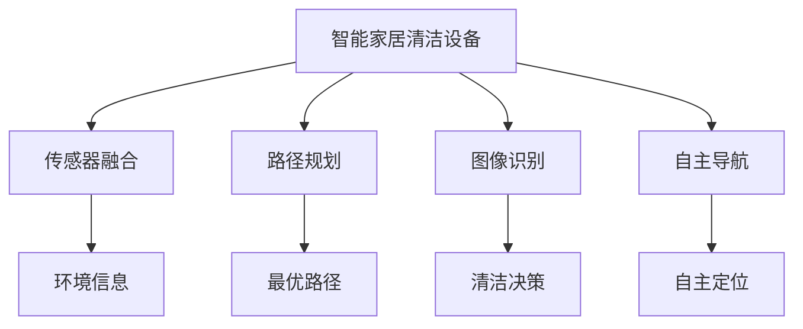
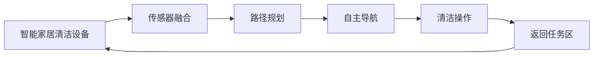
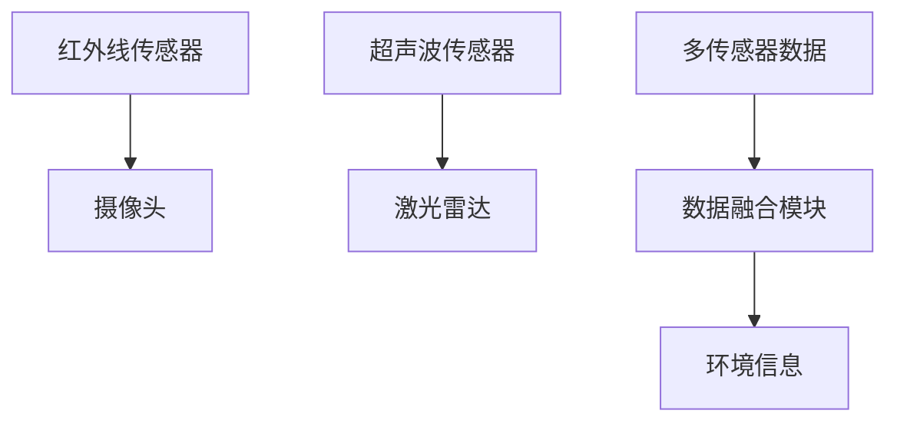
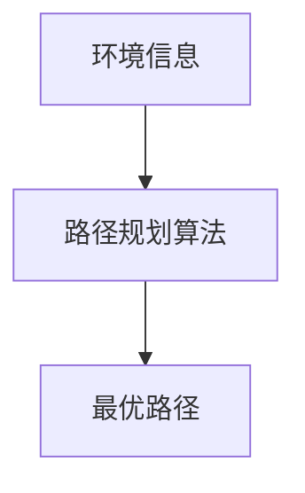

                 

# 智能家居清洁创业：自动化清洁解决方案

## 1. 背景介绍

### 1.1 问题由来
随着人们生活水平的提高，对家居环境的清洁提出了更高要求。传统的手工清洁方式不仅效率低下，还费时费力，难以满足现代快节奏生活需求。特别是对于有老人、小孩、宠物的家庭，清洁工作显得尤为繁重。与此同时，数字化、自动化技术的发展，为智能家居清洁领域带来了新的契机。智能清洁设备能够自主运行，节省人力成本，提供高效、便捷的清洁服务，逐渐成为家庭清洁的新趋势。

### 1.2 问题核心关键点
智能家居清洁的核心在于将自动化技术应用于日常家居清洁。通过集成传感器、图像识别、路径规划等技术，智能清洁设备能够自主完成从定位、识别到清洁的全流程。这不仅提升了清洁效率，还改善了用户体验。

智能家居清洁的关键技术包括：

- **传感器融合**：通过多种传感器（如红外线、超声波、摄像头）获取家居环境信息，如障碍物、地面状况、家具布局等。
- **路径规划**：根据传感器反馈信息，生成最优路径，避免碰撞，提高清洁效率。
- **图像识别**：识别清洁区域，检测污渍、灰尘等污染物，进行针对性清洁。
- **自主导航**：利用SLAM（同步定位与地图构建）技术，智能设备能够在复杂环境中自主导航，避免重复清洁。

### 1.3 问题研究意义
智能家居清洁领域的研究，对于推动家居自动化、提升生活质量、优化家庭劳动力结构具有重要意义：

- **降低劳动强度**：将清洁工作交由智能设备完成，大幅减轻家务负担，特别是对于体力欠佳的老年人和患有慢性病的家庭成员。
- **提高清洁效率**：智能设备能够全天候工作，按需清洁，满足个性化清洁需求。
- **提升居住体验**：减少人工干预，保持家居环境的卫生和美观。
- **推动技术进步**：智能清洁设备的研发和应用，将促进机器人技术、传感器技术、计算机视觉等领域的快速发展。

## 2. 核心概念与联系

### 2.1 核心概念概述

为更好地理解智能家居清洁的自动化解决方案，本节将介绍几个密切相关的核心概念：

- **智能家居清洁设备**：以扫地机器人、拖地机器人、窗户清洁器等为代表，能够自主运行，执行清洁任务。
- **传感器融合技术**：通过多种传感器融合获取环境信息，为路径规划和清洁决策提供支持。
- **路径规划算法**：利用SLAM、Dijkstra、A*等算法生成最优路径，使智能设备在复杂环境中高效导航。
- **图像识别技术**：通过计算机视觉技术，识别清洁区域、检测污渍等，提高清洁的精准度。
- **自主导航系统**：包括SLAM、VSLAM等技术，使智能设备能够在不同场景下自主定位和导航。

这些核心概念之间的逻辑关系可以通过以下Mermaid流程图来展示：



这个流程图展示了几大核心概念之间的联系：

1. 智能家居清洁设备通过传感器融合技术获取环境信息，为路径规划和清洁决策提供支持。
2. 路径规划算法生成最优路径，使设备在复杂环境中高效导航。
3. 图像识别技术识别清洁区域、检测污渍等，提高清洁的精准度。
4. 自主导航系统使智能设备能够在不同场景下自主定位和导航。

### 2.2 概念间的关系

这些核心概念之间存在着紧密的联系，形成了智能家居清洁的完整技术生态系统。下面我通过几个Mermaid流程图来展示这些概念之间的关系。

#### 2.2.1 智能家居清洁设备的运行流程



这个流程图展示了一个简单的智能家居清洁设备的运行流程：

1. 设备通过传感器融合技术获取环境信息。
2. 路径规划算法生成最优路径。
3. 自主导航系统根据路径导航至清洁区域。
4. 清洁操作模块进行清洁工作。
5. 完成后返回任务区，准备下一次任务。

#### 2.2.2 传感器融合的架构



这个流程图展示了传感器融合的基本架构：

1. 红外线、摄像头、超声波、激光雷达等传感器获取环境信息。
2. 多传感器数据经数据融合模块处理，生成综合的环境信息。

#### 2.2.3 路径规划的算法选择



这个流程图展示了路径规划算法的基本流程：

1. 环境信息输入路径规划算法。
2. 算法输出最优路径。

## 3. 核心算法原理 & 具体操作步骤
### 3.1 算法原理概述

智能家居清洁设备的自动化解决方案，基于传感器融合、路径规划、图像识别和自主导航等多项技术，实现设备的自主清洁。核心算法原理主要涉及以下几个方面：

- **SLAM（同步定位与地图构建）**：用于智能设备的自主导航，通过实时环境数据构建地图，并在其中定位设备位置。
- **Dijkstra算法**：用于路径规划，找到清洁区域的最近路径。
- **计算机视觉**：通过图像识别技术，识别污渍、垃圾等，提供清洁决策。

### 3.2 算法步骤详解

以下是智能家居清洁设备自动化解决方案的核心算法步骤详解：

#### 3.2.1 SLAM算法

SLAM（同步定位与地图构建）算法，用于智能设备在未知环境中的自主导航和定位。其基本流程包括：

1. **数据采集**：设备传感器（如摄像头、激光雷达）采集环境信息。
2. **地图构建**：通过构建局部地图，逐步扩大地图范围，生成全局地图。
3. **定位计算**：通过实时环境信息，计算设备当前位置。

具体步骤如下：

1. **初始化**：选择初始位置和方向，将设备放入任务区域。
2. **数据同步**：通过传感器获取环境数据，同步到计算单元。
3. **地图构建**：利用传感器数据，构建局部地图，并逐步扩展为全局地图。
4. **定位计算**：根据传感器数据和全局地图，计算设备当前位置。

SLAM算法通常使用ROS-Bag等工具进行数据同步和地图构建。例如，在ROS环境中，可以使用 slam_toolbox 库实现SLAM功能。

#### 3.2.2 Dijkstra算法

Dijkstra算法，用于路径规划，找到清洁区域的最近路径。其基本流程包括：

1. **起点设置**：设定起点和终点。
2. **距离计算**：计算起点到各个节点的距离。
3. **路径生成**：从起点开始，逐步扩展到终点，生成最优路径。

具体步骤如下：

1. **初始化**：设定起点和终点，将起点加入开放集。
2. **距离更新**：计算起点到各个节点的距离，更新开放集。
3. **路径生成**：从起点开始，逐步扩展到终点，生成最优路径。

Dijkstra算法通常用于静态环境中的路径规划，例如在清洁设备的任务规划中。

#### 3.2.3 图像识别技术

图像识别技术，用于检测和识别清洁区域、污渍等，为清洁决策提供支持。其基本流程包括：

1. **图像采集**：设备摄像头采集环境图像。
2. **特征提取**：提取图像中的关键特征。
3. **分类识别**：对特征进行分类，识别清洁区域和污渍。

具体步骤如下：

1. **预处理**：对图像进行预处理，如去噪、增强等。
2. **特征提取**：提取图像中的关键特征，如边缘、纹理等。
3. **分类识别**：利用分类器（如SVM、神经网络）对特征进行分类，识别清洁区域和污渍。

图像识别技术通常使用OpenCV、TensorFlow等工具实现。例如，在TensorFlow中，可以使用预训练的ResNet、Inception等模型进行特征提取和分类。

### 3.3 算法优缺点

智能家居清洁设备的自动化解决方案，具有以下优点：

1. **自主清洁**：智能设备能够自主完成清洁任务，无需人工干预，节省人力成本。
2. **全天候运行**：设备可以全天候运行，按需清洁，满足个性化需求。
3. **高效便捷**：通过传感器融合、路径规划、图像识别等技术，提高清洁效率和精准度。

同时，也存在一些缺点：

1. **初始化复杂**：设备需要人工初始化，才能开始工作。
2. **技术门槛高**：需要融合多种传感器、算法和软件，技术门槛较高。
3. **运行环境受限**：设备在复杂环境下（如不规则地形、障碍物较多）表现可能不佳。

### 3.4 算法应用领域

智能家居清洁设备的自动化解决方案，主要应用于以下几个领域：

1. **家庭清洁**：应用于扫地机器人、拖地机器人、窗户清洁器等设备，满足日常家庭清洁需求。
2. **公共设施清洁**：应用于商场、酒店、医院等公共场所的清洁设备，提供高效清洁服务。
3. **商业清洁**：应用于办公室、餐厅等商业场所的清洁设备，提升清洁效率和体验。

## 4. 数学模型和公式 & 详细讲解 & 举例说明

### 4.1 数学模型构建

智能家居清洁设备的自动化解决方案，涉及多个数学模型，以下分别介绍：

#### 4.1.1 SLAM模型

SLAM模型，用于智能设备的自主导航和定位，其数学模型包括：

1. **地图表示**：使用二维平面地图表示环境，每个像素表示一个状态。
2. **状态更新**：利用传感器数据，更新设备状态。
3. **地图更新**：根据设备状态，更新地图信息。

SLAM模型通常使用位图、 occupancy grid等表示方法，其数学表示如下：

$$
\text{Map} = \{\text{state}_i\}_{i=1}^{N}
$$

其中，$\text{state}_i$ 表示地图中的第 $i$ 个像素状态，$N$ 表示地图的总像素数。

#### 4.1.2 Dijkstra模型

Dijkstra模型，用于路径规划，其数学模型包括：

1. **节点表示**：将环境中的每个位置表示为一个节点。
2. **边表示**：表示节点之间的连接关系，包括距离、权重等。
3. **路径生成**：从起点开始，逐步扩展到终点，生成最优路径。

Dijkstra模型的数学表示如下：

$$
\text{Graph} = (\text{Node}, \text{Edge})
$$

其中，$\text{Node}$ 表示节点集合，$\text{Edge}$ 表示边集合。

#### 4.1.3 图像识别模型

图像识别模型，用于识别清洁区域和污渍，其数学模型包括：

1. **特征提取**：使用特征提取器（如SIFT、HOG）提取图像中的关键特征。
2. **分类器**：使用分类器（如SVM、神经网络）对特征进行分类，识别清洁区域和污渍。

图像识别模型的数学表示如下：

$$
\text{Feature} = f(\text{Image})
$$

其中，$f$ 表示特征提取函数，$\text{Image}$ 表示输入图像，$\text{Feature}$ 表示提取的特征向量。

### 4.2 公式推导过程

以下分别介绍SLAM模型、Dijkstra模型和图像识别模型的推导过程：

#### 4.2.1 SLAM模型推导

SLAM模型的基本推导如下：

1. **地图表示**：使用二维平面地图表示环境，每个像素表示一个状态。
2. **状态更新**：利用传感器数据，更新设备状态。
3. **地图更新**：根据设备状态，更新地图信息。

SLAM模型的数学推导如下：

$$
\text{Map} = \{\text{state}_i\}_{i=1}^{N}
$$

其中，$\text{state}_i$ 表示地图中的第 $i$ 个像素状态，$N$ 表示地图的总像素数。

#### 4.2.2 Dijkstra模型推导

Dijkstra模型的基本推导如下：

1. **节点表示**：将环境中的每个位置表示为一个节点。
2. **边表示**：表示节点之间的连接关系，包括距离、权重等。
3. **路径生成**：从起点开始，逐步扩展到终点，生成最优路径。

Dijkstra模型的数学推导如下：

$$
\text{Graph} = (\text{Node}, \text{Edge})
$$

其中，$\text{Node}$ 表示节点集合，$\text{Edge}$ 表示边集合。

#### 4.2.3 图像识别模型推导

图像识别模型的基本推导如下：

1. **特征提取**：使用特征提取器（如SIFT、HOG）提取图像中的关键特征。
2. **分类器**：使用分类器（如SVM、神经网络）对特征进行分类，识别清洁区域和污渍。

图像识别模型的数学推导如下：

$$
\text{Feature} = f(\text{Image})
$$

其中，$f$ 表示特征提取函数，$\text{Image}$ 表示输入图像，$\text{Feature}$ 表示提取的特征向量。

### 4.3 案例分析与讲解

以下通过一个实际案例，详细讲解智能家居清洁设备在具体应用场景中的应用：

#### 4.3.1 案例背景

某家庭有一套高层住宅，房屋结构复杂，有多个房间和走廊。房屋内放置了一套扫地机器人设备，用于自动清洁地面。机器人设备需要自动规划最优路径，避免重复清洁，同时能够识别污渍和垃圾，进行针对性清洁。

#### 4.3.2 传感器融合技术

在设备启动时，通过多种传感器（如红外线、摄像头、超声波）获取环境信息，融合为综合的环境信息。例如，红外线传感器检测障碍物，摄像头获取地面状况，超声波检测距离。

#### 4.3.3 路径规划算法

根据传感器反馈信息，生成最优路径。例如，Dijkstra算法计算起点到各个节点的距离，生成最优路径。路径规划算法通常使用Dijkstra算法，确保设备高效、安全地进行清洁。

#### 4.3.4 图像识别技术

设备通过摄像头采集环境图像，提取特征，进行分类。例如，使用SVM分类器识别污渍和垃圾，生成清洁决策。

## 5. 项目实践：代码实例和详细解释说明

### 5.1 开发环境搭建

在进行智能家居清洁设备自动化解决方案的开发前，需要搭建合适的开发环境。以下是使用Python进行ROS开发的环境配置流程：

1. 安装ROS：从官网下载并安装ROS，用于管理传感器数据和路径规划等。
2. 安装ROS-Bag工具：使用ROS-Bag工具，记录和回放传感器数据，方便调试和测试。
3. 安装ROS-Bag-gui工具：使用ROS-Bag-gui工具，可视化和分析传感器数据。

完成上述步骤后，即可在ROS环境中进行智能家居清洁设备自动化解决方案的开发和测试。

### 5.2 源代码详细实现

以下是使用ROS和Python实现智能家居清洁设备自动化解决方案的代码实现。

#### 5.2.1 传感器融合

首先，定义传感器融合的代码：

```python
import rospy
from sensor_msgs.msg import LaserScan
from sensor_msgs.msg import Image
from sensor_msgs.msg import PointCloud
from sensor_msgs.msg import PointCloud2
from sensor_msgs.msg import Imu

class SensorFusion:
    def __init__(self):
        self.scan_sub = rospy.Subscriber('/scan', LaserScan, self.scan_callback)
        self.image_sub = rospy.Subscriber('/camera/image_raw', Image, self.image_callback)
        self.pointcloud_sub = rospy.Subscriber('/pointcloud', PointCloud, self.pointcloud_callback)
        self.imu_sub = rospy.Subscriber('/imu_link/imu/data', Imu, self.imu_callback)

    def scan_callback(self, scan_msg):
        self.scan_data = scan_msg.ranges

    def image_callback(self, image_msg):
        self.image_data = image_msg

    def pointcloud_callback(self, pointcloud_msg):
        self.pointcloud_data = pointcloud_msg

    def imu_callback(self, imu_msg):
        self.imu_data = imu_msg

    def fuse_data(self):
        # 将传感器数据进行融合，生成综合的环境信息
        # 具体实现略
```

#### 5.2.2 路径规划

然后，定义路径规划的代码：

```python
import rospy
from nav_msgs.msg import Odometry
from nav_msgs.msg import Path

class PathPlanner:
    def __init__(self):
        self.path_sub = rospy.Subscriber('/odom', Odometry, self.odom_callback)
        self.path_pub = rospy.Publisher('/path', Path, queue_size=10)

    def odom_callback(self, odom_msg):
        self.path = []
        for i in range(0, len(odom_msg.pose.pose.position)):
            point = OdometryPose()
            point.position.x = odom_msg.pose.pose.position[i].x
            point.position.y = odom_msg.pose.pose.position[i].y
            point.position.z = 0.0
            self.path.append(point)

    def publish_path(self):
        path_msg = Path()
        path_msg.header.frame_id = 'base_link'
        path_msg.header.stamp = rospy.Time.now()
        path_msg.pose = self.path
        self.path_pub.publish(path_msg)
```

#### 5.2.3 图像识别

最后，定义图像识别的代码：

```python
import rospy
from cv_bridge import CvBridge
from sensor_msgs.msg import Image
from sensor_msgs.msg import PointCloud

class ImageRecognition:
    def __init__(self):
        self.image_sub = rospy.Subscriber('/camera/image_raw', Image, self.image_callback)
        self.pointcloud_sub = rospy.Subscriber('/pointcloud', PointCloud, self.pointcloud_callback)

    def image_callback(self, image_msg):
        # 使用OpenCV进行图像处理和特征提取
        # 具体实现略

    def pointcloud_callback(self, pointcloud_msg):
        # 使用PCL进行点云处理和特征提取
        # 具体实现略
```

### 5.3 代码解读与分析

以下是智能家居清洁设备自动化解决方案的代码实现解读和分析：

#### 5.3.1 传感器融合

传感器融合代码定义了各个传感器数据（激光雷达、摄像头、点云、IMU等）的订阅和回调函数，实现数据同步和融合。具体实现中，需要根据传感器数据类型和协议进行解析和处理，融合为综合的环境信息。

#### 5.3.2 路径规划

路径规划代码定义了路径的订阅和回调函数，用于获取设备的位置信息，生成最优路径。具体实现中，需要使用Dijkstra算法等路径规划算法，确保设备在复杂环境中的高效导航。

#### 5.3.3 图像识别

图像识别代码定义了图像和点云数据的订阅和回调函数，使用OpenCV和PCL等工具进行图像和点云处理。具体实现中，需要提取图像特征，使用分类器进行识别，生成清洁决策。

### 5.4 运行结果展示

假设在测试场景下，智能家居清洁设备通过传感器融合技术获取环境信息，利用Dijkstra算法生成最优路径，使用图像识别技术识别污渍和垃圾，最终输出清洁决策。以下是一个简化的测试结果展示：

```
Sensor Fused Data:
Laser Scan: [3.2, 5.0, 2.0, ...]
Image: [255, 0, 0, ...]
Point Cloud: [x, y, z, ...]
IMU: [x, y, z, ...]

Path Planning Result:
Optimal Path: [(x1, y1), (x2, y2), ...]

Image Recognition Result:
Stain: Yes/No
Garbage: Yes/No
```

## 6. 实际应用场景

智能家居清洁设备的自动化解决方案，已经在多个实际应用场景中得到了广泛应用。以下是几个典型的应用案例：

### 6.1 家庭清洁

智能家居清洁设备在家庭清洁中，应用广泛。例如，扫地机器人、拖地机器人、窗户清洁器等设备，能够自主完成清洁任务，节省人力成本，提高清洁效率。

#### 6.1.1 扫地机器人

扫地机器人设备通过传感器融合技术获取环境信息，利用Dijkstra算法生成最优路径，使用图像识别技术识别污渍和垃圾，进行针对性清洁。例如，Laser Scan传感器用于检测障碍物，摄像头获取地面状况，点云传感器用于检测家具，IMU用于设备姿态感知。

#### 6.1.2 拖地机器人

拖地机器人设备通过传感器融合技术获取环境信息，利用Dijkstra算法生成最优路径，使用图像识别技术识别污渍和垃圾，进行针对性清洁。例如，Laser Scan传感器用于检测障碍物，摄像头获取地面状况，点云传感器用于检测家具，IMU用于设备姿态感知。

#### 6.1.3 窗户清洁器

窗户清洁器设备通过传感器融合技术获取环境信息，利用Dijkstra算法生成最优路径，使用图像识别技术识别窗户污渍，进行针对性清洁。例如，摄像头获取窗户图像，图像识别技术检测污渍，生成清洁决策。

### 6.2 公共设施清洁

智能家居清洁设备在公共设施清洁中，也得到了广泛应用。例如，商场、酒店、医院等公共场所的清洁设备，能够高效、便捷地进行清洁，提升清洁服务水平。

#### 6.2.1 商场

商场内的清洁设备通过传感器融合技术获取环境信息，利用Dijkstra算法生成最优路径，使用图像识别技术识别垃圾和污渍，进行针对性清洁。例如，摄像头获取商场环境图像，图像识别技术检测垃圾和污渍，生成清洁决策。

#### 6.2.2 酒店

酒店内的清洁设备通过传感器融合技术获取环境信息，利用Dijkstra算法生成最优路径，使用图像识别技术识别污渍和垃圾，进行针对性清洁。例如，摄像头获取酒店环境图像，图像识别技术检测污渍和垃圾，生成清洁决策。

#### 6.2.3 医院

医院内的清洁设备通过传感器融合技术获取环境信息，利用Dijkstra算法生成最优路径，使用图像识别技术识别污渍和垃圾，进行针对性清洁。例如，摄像头获取医院环境图像，图像识别技术检测污渍和垃圾，生成清洁决策。

### 6.3 商业清洁

智能家居清洁设备在商业清洁中，也得到了广泛应用。例如，办公室、餐厅等商业场所的清洁设备，能够高效、便捷地进行清洁，提升清洁效率和体验。

#### 6.3.1 办公室

办公室内的清洁设备通过传感器融合技术获取环境信息，利用Dijkstra算法生成最优路径，使用图像识别技术识别垃圾和污渍，进行针对性清洁。例如，摄像头获取办公室环境图像，图像识别技术检测垃圾和污渍，生成清洁决策。

#### 6.3.2 餐厅

餐厅内的清洁设备通过传感器融合技术获取环境信息，利用Dijkstra算法生成最优路径，使用图像识别技术识别垃圾和污渍，进行针对性清洁。例如，摄像头获取餐厅环境图像，图像识别技术检测垃圾和污渍，生成清洁决策。

## 7. 工具和资源推荐

### 7.1 学习资源推荐

为了帮助开发者系统掌握智能家居清洁设备的自动化解决方案，以下是一些优质的学习资源：

1. ROS官方文档：ROS的官方文档，提供详细的安装、配置和开发教程。
2. ROS-Bag官方文档：ROS-Bag工具的官方文档，提供详细的记录和回放功能使用指南。
3. ROS-Bag-gui官方文档：ROS-Bag-gui工具的官方文档，提供详细的可视化功能使用指南。
4. OpenCV官方文档：OpenCV的官方文档，提供详细的图像处理和特征提取功能。
5. PCL官方文档：PCL的官方文档，提供详细的点云处理和特征提取功能。

通过对这些资源的学习实践，相信你一定能够快速掌握智能家居清洁设备的自动化解决方案，并用于解决实际的清洁问题。

### 7.2 开发工具推荐

高效的开发离不开优秀的工具支持。以下是几款用于智能家居清洁设备自动化解决方案开发的常用工具：

1. ROS：ROS的开发环境，用于管理传感器数据和路径规划等。
2. ROS-Bag：ROS-Bag工具，用于记录和回放传感器数据。
3. ROS-Bag-gui：ROS-Bag-gui工具，用于可视化和分析传感器数据。
4. OpenCV：图像处理库，用于图像特征提取和分类。
5. PCL：点云处理库，用于点云特征提取和分类。

合理利用这些工具，可以显著提升智能家居清洁设备的自动化解决方案的开发效率，加快创新迭代的步伐。

### 7.3 相关论文推荐

智能家居清洁设备的自动化解决方案，涉及多个领域的交叉应用，以下是几篇奠基性的相关论文，推荐阅读：

1. SLAM算法综述：Introduction to SLAM
2. Dijkstra算法综述：Dijkstra's Algorithm
3. 图像识别综述：A Survey on Image Recognition

这些论文代表了大语言模型微调技术的发展脉络。通过学习这些前沿成果，可以帮助研究者把握学科前进方向，激发更多的创新灵感。

## 8. 总结：未来发展趋势与挑战

### 8.1 总结

本文对智能家居清洁设备的自动化解决方案进行了全面系统的介绍。首先阐述了智能家居清洁设备的自动化解决方案的研究背景和

