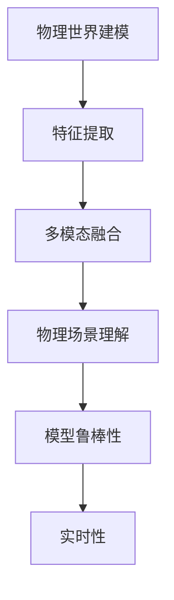

                 

## 1. 背景介绍

### 1.1 问题由来
在人工智能（AI）领域，理解物理世界的能力一直是机器学习（ML）和计算机视觉（CV）的难点和热点。特别是在面对复杂的自然场景时，机器难以从中提取出准确且有意义的特征，从而实现对物理世界的感知和理解。这一难题不仅关系到AI技术的实用性，也深刻影响着其在医疗、自动驾驶、工业检测等关键领域的应用。

### 1.2 问题核心关键点
要理解机器在物理世界中的难题，首先需要明确几个核心关键点：

- 数据获取：机器学习模型需要大量的数据进行训练，而物理世界的复杂性和多样性意味着获取这些数据并非易事。
- 特征提取：如何将复杂的物理信息转换为机器可以理解和处理的特征是一个技术挑战。
- 语义理解：理解物理世界的语义信息，比如物体的位置、形状、动作等，需要模型具备强大的语义建模能力。
- 多模态融合：物理世界的信号通常是多模态的，如何将视觉、听觉、触觉等多模态信息融合到统一模型中，是一个亟待解决的问题。
- 实时性和鲁棒性：在实际应用中，模型需要具备高实时性和鲁棒性，能够在动态变化的环境中进行稳定预测。

### 1.3 问题研究意义
研究机器理解物理世界的难题，对AI技术的发展具有重要意义：

1. **推动跨学科研究**：理解和建模物理世界需要多学科的知识和工具，这将促进AI、计算机视觉、传感器技术等多领域之间的深度融合。
2. **提升技术落地能力**：解决物理世界的理解难题，能够帮助AI技术更好地应用于自动驾驶、机器人、医疗诊断等实际场景，提升技术的实用性和可靠性。
3. **促进技术伦理思考**：物理世界模型的应用还涉及到伦理问题，比如隐私保护、决策透明性等，研究这些问题有助于构建更加负责任的AI技术。
4. **推动产业创新**：随着对物理世界理解的深入，可以激发更多创新应用，如智能家居、智能城市等，为经济社会发展注入新的动力。

## 2. 核心概念与联系

### 2.1 核心概念概述

理解物理世界的能力涉及多个核心概念，包括但不限于：

- 物理世界建模：将复杂的物理信息抽象为机器可以处理的表示，如特征提取、语义理解等。
- 多模态融合：将视觉、听觉、触觉等多模态信息融合到统一模型中，提升感知能力。
- 物理场景理解：通过多层次的感知和推理，理解物理世界的语义信息，如物体位置、动作等。
- 模型鲁棒性：提高模型对不同光照、视角、噪声等变化环境的适应能力。
- 实时性：确保模型能够在动态变化的环境中高效计算和响应。

### 2.2 概念间的关系

这些核心概念之间存在着紧密的联系，形成了机器理解物理世界的整体架构：

- **物理世界建模**：提供数据和特征提取的基础，是其他概念实现的前提。
- **多模态融合**：将不同模态的信息整合成一致的表示，提升模型对物理世界的感知能力。
- **物理场景理解**：通过高级推理和决策，实现对物理世界的语义建模。
- **模型鲁棒性**：保障模型在各种环境下的一致性预测能力，提高可信度。
- **实时性**：要求模型在实际应用中高效、快速地响应和计算，保证应用的实际价值。

这些概念共同构成了机器理解物理世界的框架，指导着AI技术在实际应用中的具体实现。

### 2.3 核心概念的整体架构

以下是一个综合的流程图，展示了机器理解物理世界所需的核心概念及其相互关系：



## 3. 核心算法原理 & 具体操作步骤

### 3.1 算法原理概述

机器理解物理世界的核心算法原理主要包括以下几个方面：

- **深度学习**：通过多层神经网络结构，对输入数据进行抽象和表示，提取特征。
- **多模态融合**：利用深度融合技术，将不同模态的数据信息整合成一致的表示，提升感知能力。
- **语义理解**：通过预训练和微调等技术，提高模型对物理世界语义信息的理解能力。
- **鲁棒性增强**：通过正则化、对抗训练等方法，提升模型对噪声和变化环境的适应能力。
- **实时性优化**：通过模型压缩、量化等技术，优化模型推理效率，确保高效响应。

### 3.2 算法步骤详解

基于深度学习的物理世界理解算法主要包含以下几个步骤：

**Step 1: 数据收集与预处理**
- 收集物理世界的数据，包括图像、视频、声音、传感器数据等。
- 进行数据清洗和增强，去除噪声和异常值，扩充数据集。

**Step 2: 特征提取与表示学习**
- 使用深度学习模型提取输入数据的特征表示。
- 通过预训练和微调，提高模型的特征提取和语义理解能力。

**Step 3: 多模态融合**
- 将不同模态的数据信息融合到统一表示中。
- 使用多模态神经网络模型，如时空网络（Temporal Networks），提升感知能力。

**Step 4: 物理场景理解**
- 通过推理和决策，理解物理世界的语义信息。
- 使用卷积神经网络（CNN）、循环神经网络（RNN）等模型，进行多层次的语义建模。

**Step 5: 模型鲁棒性增强**
- 通过正则化、Dropout、对抗训练等方法，提升模型鲁棒性。
- 在训练过程中引入对抗样本，提高模型对噪声和变化环境的适应能力。

**Step 6: 实时性优化**
- 对模型进行剪枝、量化等优化，减少计算量，提高推理速度。
- 使用分布式训练和推理，优化资源分配，确保高实时性。

### 3.3 算法优缺点

**优点**：

1. **自动特征提取**：深度学习算法能够自动提取数据中的复杂特征，无需手动设计和处理。
2. **多模态融合**：能够整合视觉、听觉、触觉等多种模态信息，提升感知能力。
3. **鲁棒性强**：通过正则化和对抗训练，提升模型对噪声和变化环境的适应能力。
4. **实时性高**：优化模型结构，提高推理速度，确保高效响应。

**缺点**：

1. **数据需求大**：深度学习算法需要大量的标注数据进行训练，获取高质量数据成本高。
2. **训练复杂**：深度学习模型的训练过程复杂，需要较强的计算资源。
3. **可解释性差**：模型通常被视为“黑盒”，难以解释内部决策逻辑。
4. **对噪声敏感**：深度学习模型对输入噪声和变化环境较为敏感。

### 3.4 算法应用领域

深度学习在物理世界理解中的应用领域广泛，包括但不限于：

- **自动驾驶**：利用摄像头、雷达等多模态传感器数据，理解交通场景，进行车辆控制。
- **工业检测**：通过视觉和传感器数据，检测和识别缺陷，提升产品质量。
- **医疗影像分析**：从医学影像中提取特征，辅助医生进行诊断。
- **机器人导航**：通过视觉和传感器信息，实现环境理解和自主导航。
- **智能家居**：理解语音指令和传感器数据，实现智能家电控制和环境监控。

## 4. 数学模型和公式 & 详细讲解 & 举例说明

### 4.1 数学模型构建

在物理世界理解中，常用数学模型包括：

- **卷积神经网络（CNN）**：用于提取图像和视频数据的特征。
- **循环神经网络（RNN）**：用于处理序列数据，如自然语言和语音信号。
- **深度强化学习（DRL）**：用于智能决策和动作控制。

### 4.2 公式推导过程

以CNN为例，其核心公式包括卷积操作和池化操作：

$$
C_\theta(x) = \sum_k w_k * \sigma\left(\sum_i \theta_i * X_{ki} + b_k\right) + b_\theta
$$

其中，$X$ 表示输入特征，$\theta$ 和 $w$ 分别为可学习的卷积核参数和权重，$\sigma$ 为激活函数，$b$ 为偏置项。通过多次卷积和池化操作，CNN可以提取输入数据的高级特征。

### 4.3 案例分析与讲解

**案例：工业缺陷检测**

- **数据获取**：使用工业相机拍摄产品图像，获取高质量的视觉数据。
- **特征提取**：使用CNN提取图像特征，通过预训练和微调提高模型性能。
- **多模态融合**：将图像特征与传感器数据融合，提升缺陷检测的准确性。
- **场景理解**：通过分类器和检测器，识别和定位缺陷区域。
- **鲁棒性增强**：引入对抗训练和正则化，提升模型对噪声的适应能力。
- **实时性优化**：使用模型剪枝和量化，提高推理速度，确保高效响应。

## 5. 项目实践：代码实例和详细解释说明

### 5.1 开发环境搭建

以下是一个Python+TensorFlow的深度学习开发环境的搭建步骤：

1. 安装Anaconda：
```bash
conda install anaconda
```

2. 创建虚拟环境：
```bash
conda create -n tf_env python=3.7
conda activate tf_env
```

3. 安装TensorFlow和相关依赖：
```bash
pip install tensorflow==2.6
pip install matplotlib numpy
```

### 5.2 源代码详细实现

以下是一个简单的工业缺陷检测项目的代码实现：

```python
import tensorflow as tf
from tensorflow.keras import layers

# 构建CNN模型
model = tf.keras.Sequential([
    layers.Conv2D(32, (3, 3), activation='relu', input_shape=(32, 32, 3)),
    layers.MaxPooling2D((2, 2)),
    layers.Conv2D(64, (3, 3), activation='relu'),
    layers.MaxPooling2D((2, 2)),
    layers.Conv2D(128, (3, 3), activation='relu'),
    layers.MaxPooling2D((2, 2)),
    layers.Flatten(),
    layers.Dense(128, activation='relu'),
    layers.Dense(1, activation='sigmoid')
])

# 编译模型
model.compile(optimizer='adam', loss='binary_crossentropy', metrics=['accuracy'])

# 训练模型
model.fit(x_train, y_train, epochs=10, validation_data=(x_test, y_test))
```

### 5.3 代码解读与分析

上述代码中，我们构建了一个简单的CNN模型，用于工业缺陷检测。模型的核心组成部分包括卷积层、池化层和全连接层。

- **卷积层**：用于提取图像特征。
- **池化层**：用于降采样，减少计算量。
- **全连接层**：用于最终分类。

训练过程主要包括以下几个步骤：

- **数据准备**：将图像数据和标签数据准备成模型可以接受的格式。
- **模型编译**：设置优化器、损失函数和评估指标。
- **模型训练**：在训练集上拟合模型，并使用验证集进行监控。
- **模型评估**：在测试集上评估模型性能。

### 5.4 运行结果展示

假设在训练完成后，我们得到一个准确率较高的模型。以下是一些示例图像和预测结果的展示：

```
# 输入图像
image1 = plt.imread('image1.jpg')
plt.imshow(image1)
plt.show()

# 模型预测
prediction1 = model.predict(image1.reshape(1, 32, 32, 3))
print('预测结果:', prediction1)
```

## 6. 实际应用场景

### 6.1 工业检测

在工业检测中，深度学习模型可以用于检测产品的表面缺陷、尺寸偏差等，确保产品质量。例如，使用深度学习对半导体晶圆进行检测，可以识别出微小的瑕疵，避免不合格产品流入市场。

### 6.2 医疗影像分析

深度学习在医疗影像分析中也有广泛应用。通过对X光片、CT扫描等医学影像的分析，帮助医生快速诊断疾病，提升诊断准确性。例如，使用深度学习对肺癌影像进行检测，可以早期发现癌症，提高治愈率。

### 6.3 自动驾驶

自动驾驶中的深度学习模型可以用于环境感知和决策。通过对摄像头和雷达等传感器数据的融合分析，理解交通场景，进行车辆控制。例如，使用深度学习进行目标检测和跟踪，确保自动驾驶的安全性和稳定性。

### 6.4 智能家居

在智能家居中，深度学习模型可以用于语音识别和场景理解。通过对语音指令的理解，控制智能家电和环境监控系统。例如，使用深度学习进行智能音箱的语音交互，提升用户体验。

## 7. 工具和资源推荐

### 7.1 学习资源推荐

- **深度学习课程**：如Coursera上的《深度学习专项课程》、Udacity上的《深度学习纳米学位》。
- **学术论文**：在arXiv、Google Scholar等平台搜索相关论文，了解最新研究成果。
- **开源项目**：如TensorFlow、PyTorch等深度学习框架，提供了丰富的代码库和示例。

### 7.2 开发工具推荐

- **TensorFlow**：深度学习的主流框架，提供了丰富的模型库和工具。
- **PyTorch**：易于使用的深度学习框架，提供了强大的动态计算图。
- **Keras**：高级API，简化深度学习模型的构建和训练。

### 7.3 相关论文推荐

- **R-CNN系列论文**：用于物体检测的经典模型。
- **GAN系列论文**：用于生成对抗网络，提升图像生成能力。
- **AlphaGo论文**：用于深度强化学习的经典案例。

## 8. 总结：未来发展趋势与挑战

### 8.1 研究成果总结

深度学习在物理世界理解方面已经取得了显著进展，但依然面临诸多挑战。现有的技术方法在数据获取、特征提取、多模态融合、鲁棒性增强等方面都有所突破，但仍需进一步提升模型的实时性和可解释性。

### 8.2 未来发展趋势

未来的发展趋势包括：

1. **跨模态学习**：探索如何更好地整合视觉、听觉、触觉等多种模态信息，提升模型的感知能力。
2. **小样本学习**：研究如何在数据较少的情况下进行有效训练，减少对标注数据的依赖。
3. **模型压缩**：通过模型剪枝、量化等技术，优化模型结构，提高推理效率。
4. **鲁棒性增强**：引入更多的对抗训练和正则化技术，提高模型对噪声和变化环境的适应能力。
5. **实时性优化**：通过分布式计算和硬件加速，提升模型的实时响应能力。

### 8.3 面临的挑战

尽管深度学习在物理世界理解方面取得了进展，但仍面临以下挑战：

1. **数据获取**：高质量标注数据的获取成本高，数量有限。
2. **计算资源**：深度学习模型训练和推理需要高性能计算资源。
3. **模型复杂度**：大规模深度学习模型的训练和推理过程复杂。
4. **可解释性**：深度学习模型通常被视为“黑盒”，难以解释内部决策逻辑。
5. **伦理问题**：深度学习模型的应用可能涉及隐私保护和决策透明性等伦理问题。

### 8.4 研究展望

未来的研究需要聚焦于以下几个方面：

1. **数据增强**：探索更多的数据增强方法，提高数据质量。
2. **小样本学习**：研究如何在小样本情况下进行有效训练。
3. **跨模态融合**：研究如何将多模态信息整合到统一模型中。
4. **鲁棒性增强**：探索更多鲁棒性增强技术，提升模型在动态环境下的性能。
5. **实时性优化**：研究如何优化模型结构，提升推理效率。

## 9. 附录：常见问题与解答

**Q1：深度学习模型如何处理多模态数据？**

A: 多模态数据通常包括图像、语音、传感器数据等。深度学习模型可以通过以下方式处理多模态数据：

- **融合层**：使用融合层将不同模态的数据信息整合成一致的表示。
- **共享表示**：使用相同的表示层处理不同模态的数据。
- **多模态神经网络**：使用专门的多模态神经网络模型，如时空网络（Temporal Networks），提升感知能力。

**Q2：如何提高深度学习模型的鲁棒性？**

A: 提高深度学习模型的鲁棒性可以采取以下措施：

- **正则化**：使用L2正则化、Dropout等方法，防止模型过拟合。
- **对抗训练**：在训练过程中引入对抗样本，提高模型对噪声和变化环境的适应能力。
- **数据增强**：通过回译、近义替换等方式扩充训练集，增强模型的泛化能力。

**Q3：如何优化深度学习模型的实时性？**

A: 优化深度学习模型的实时性可以采取以下措施：

- **模型剪枝**：去除不必要的层和参数，减小模型尺寸。
- **量化加速**：将浮点模型转为定点模型，压缩存储空间。
- **分布式计算**：使用分布式计算，优化资源分配。
- **硬件加速**：使用GPU/TPU等高性能设备，提高计算效率。

**Q4：如何提升深度学习模型的可解释性？**

A: 提升深度学习模型的可解释性可以采取以下措施：

- **可视化**：通过可视化工具，展示模型的内部决策过程。
- **特征提取**：提取模型中关键的特征，解释模型的决策逻辑。
- **解释模型**：使用解释模型，如LIME、SHAP等，提供模型输出的解释。

**Q5：如何缓解深度学习模型的过拟合问题？**

A: 缓解深度学习模型的过拟合问题可以采取以下措施：

- **数据增强**：通过回译、近义替换等方式扩充训练集。
- **正则化**：使用L2正则化、Dropout等方法，防止模型过拟合。
- **对抗训练**：在训练过程中引入对抗样本，提高模型对噪声和变化环境的适应能力。
- **模型集成**：训练多个模型，取平均输出，抑制过拟合。

---

作者：禅与计算机程序设计艺术 / Zen and the Art of Computer Programming

