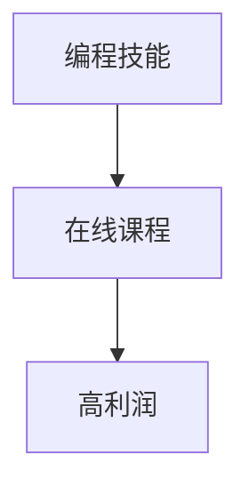

                 

# 如何将编程技能转化为高利润的在线课程

> 关键词：编程技能, 在线课程, 高利润, 转化路径, 内容营销, 用户互动, 课程优化, 数据驱动

## 1. 背景介绍

在数字经济时代，编程技能已成为推动各行各业创新和发展的核心竞争力。无论是软件开发、数据科学、人工智能，还是区块链、物联网等新兴领域，编程技能都具有极高的市场价值。然而，真正掌握这些技能需要大量时间和精力的投入，这对许多人来说是一个巨大的挑战。在线课程作为一种灵活、便捷、高效的学习方式，为个人和企业提供了新的可能性。如何将编程技能转化为高利润的在线课程，成为了教育行业的热门话题。本文将深入探讨这一问题，并给出具体的操作方法。

### 1.1 在线课程的市场前景

在线课程市场近年来呈现出爆发式增长。根据《2022年中国在线教育行业市场及发展趋势分析报告》，中国在线教育市场规模已达3600亿元，预计2023年将达到4400亿元。随着5G、大数据、云计算等技术的普及，在线课程的学习体验和互动性将进一步提升，市场潜力巨大。

### 1.2 在线课程的盈利模式

在线课程的盈利模式多种多样，主要包括：

1. **付费订阅模式**：用户购买课程订阅，按月或按年支付费用，可反复观看课程内容。
2. **按需购买模式**：用户根据需要购买单次课程，支付费用后即有权观看。
3. **企业定制模式**：企业为员工提供定制课程，按课程使用人数或时长支付费用。
4. **广告收入模式**：在课程页面上展示广告，吸引用户点击，从而获得广告收入。
5. **知识付费模式**：通过文章、视频、音频等形式提供专业知识，用户付费获取。

这些盈利模式为在线课程的开发和运营提供了多种选择。开发者需要根据自身的资源、目标用户群体的需求，选择合适的盈利模式。

## 2. 核心概念与联系

### 2.1 核心概念概述

- **编程技能**：指掌握编程语言、框架、算法、数据结构等基础知识和技能。编程技能不仅包括编程基础，还包括项目开发、软件架构、技术栈选择等综合能力。
- **在线课程**：指通过互联网平台提供的系统化、结构化的课程内容，涵盖视频、文字、代码等多种形式。在线课程通常由专业的教育机构或个人开发和发布。
- **高利润**：指课程能够带来可观的经济回报。高利润不仅包括直接的收入，还包括课程带来的品牌效应、用户粘性等间接价值。

这些概念之间的关系如下图所示：



### 2.2 概念间的关系

在线课程的开发和运营，需要充分利用编程技能，将知识转化为系统化、结构化的内容，并结合市场和用户需求，优化课程内容和形式。高利润则是对课程价值和盈利能力的直观体现，是开发者追求的目标。

## 3. 核心算法原理 & 具体操作步骤

### 3.1 算法原理概述

将编程技能转化为高利润的在线课程，本质上是一个数据驱动的过程。通过收集用户行为数据，分析用户需求和偏好，不断优化课程内容和运营策略，最大化课程的商业价值。

具体而言，这一过程包括以下几个关键步骤：

1. **需求分析**：通过调研、问卷、数据分析等方式，了解目标用户的需求、痛点和偏好。
2. **内容设计**：根据需求分析结果，设计课程内容和结构，包括课程目录、视频时长、教学方法等。
3. **技术实现**：使用编程技能将课程内容转化为在线平台上的可访问资源，包括录制视频、编写代码、设计UI/UX等。
4. **运营优化**：通过数据分析和用户反馈，不断优化课程内容和运营策略，提升用户满意度和课程转化率。
5. **营销推广**：利用社交媒体、搜索引擎优化、广告投放等手段，扩大课程的曝光度和影响力。

### 3.2 算法步骤详解

#### 3.2.1 需求分析

需求分析是课程开发的起点，通过以下几种方法可以获得全面的用户需求：

1. **调研问卷**：设计问卷，收集目标用户的背景信息、学习目标、兴趣偏好等。
2. **数据分析**：分析历史课程数据、用户评论、社交媒体数据等，了解用户的学习行为和反馈。
3. **访谈交流**：与目标用户进行深入交流，获取直接的反馈和建议。

#### 3.2.2 内容设计

根据需求分析结果，设计课程内容和结构。以下是一个示例课程的目录：

- **引言**：课程介绍、学习目标、课程结构
- **基础知识**：编程基础、语言特性、环境搭建
- **进阶知识**：高级算法、数据结构、框架使用
- **项目实战**：案例分析、代码实现、项目讲解
- **总结与讨论**：课程总结、常见问题、互动答疑

#### 3.2.3 技术实现

技术实现是课程开发的核心环节。以下是一个示例视频录制的流程：

1. **前期准备**：编写讲义、准备PPT、设计脚本。
2. **录制视频**：使用专业的视频录制工具（如Camtasia、OBS等）录制课程视频。
3. **后期处理**：剪辑视频、添加字幕、优化音质。
4. **上线发布**：将视频上传到在线课程平台（如Udemy、Coursera等），并进行SEO优化。

#### 3.2.4 运营优化

运营优化是提升课程转化率和用户满意度的关键步骤。以下是一个示例的运营策略：

1. **数据分析**：定期分析课程数据，包括观看时长、完成率、互动率等，了解用户的学习行为。
2. **用户互动**：建立社群、举办问答、进行互动答疑，提升用户参与度。
3. **反馈收集**：通过问卷调查、评论反馈等方式，收集用户的意见和建议。
4. **课程迭代**：根据用户反馈，不断优化课程内容，提升课程质量。

#### 3.2.5 营销推广

营销推广是提升课程曝光率和影响力的重要手段。以下是一个示例的营销策略：

1. **社交媒体**：在社交平台（如微信、微博、LinkedIn等）上发布课程介绍、用户评价、课程更新等。
2. **搜索引擎优化**：优化课程页面SEO，提升在搜索引擎中的排名。
3. **广告投放**：在Google Ads、Facebook Ads等平台进行广告投放，吸引更多用户。
4. **合作推广**：与相关领域的专家、KOL进行合作，提升课程的权威性和可信度。

### 3.3 算法优缺点

#### 3.3.1 优点

1. **灵活性高**：在线课程可以根据用户需求和市场变化进行调整和优化。
2. **覆盖面广**：课程可以覆盖多种编程技能和领域，满足不同用户的学习需求。
3. **可重复使用**：课程内容可以重复使用，减少开发成本。
4. **便于传播**：在线课程可以通过互联网进行广泛传播，覆盖更多用户。

#### 3.3.2 缺点

1. **缺乏互动**：在线课程相对于面对面的教学，缺乏实时互动和即时反馈。
2. **知识传递有限**：课程内容可能无法覆盖所有知识点，用户需要自学和自我探索。
3. **用户粘性差**：在线课程如果缺乏有效的运营和互动，用户流失率较高。

### 3.4 算法应用领域

将编程技能转化为高利润的在线课程，可以应用于多个领域，包括但不限于：

1. **软件开发**：提供编程语言、框架、开发工具等方面的课程。
2. **数据科学**：提供数据分析、机器学习、数据可视化等方面的课程。
3. **人工智能**：提供深度学习、自然语言处理、计算机视觉等方面的课程。
4. **区块链**：提供区块链技术、智能合约、加密货币等方面的课程。
5. **物联网**：提供物联网技术、嵌入式开发、设备联网等方面的课程。

## 4. 数学模型和公式 & 详细讲解 & 举例说明

### 4.1 数学模型构建

假设课程的转化率为 $C$，用户观看视频的时长为 $T$，用户完成课程的百分比为 $P$。课程的总收益为 $R$，包括课程订阅费、广告收入等。则课程的收益模型为：

$$
R = C \times T \times P
$$

其中，$C$ 表示转化率，$T$ 表示用户观看视频的时长，$P$ 表示用户完成课程的百分比。

### 4.2 公式推导过程

通过上述模型，我们可以对课程进行优化和调整。例如，增加课程互动、优化课程结构、提升视频质量等，可以提升 $C$ 和 $P$，从而提高课程的收益。

### 4.3 案例分析与讲解

假设一个在线编程课程的平均转化率为20%，用户平均观看视频时长为30分钟，用户平均完成课程的百分比为60%。课程的月订阅费为99元/月，预计有2000名用户订阅。则课程的月收益为：

$$
R = 0.2 \times 30 \times 0.6 \times 2000 \times 99 = 272,800元
$$

通过增加用户互动、提升视频质量等措施，可以进一步提升课程的转化率和完成率，从而获得更高的收益。

## 5. 项目实践：代码实例和详细解释说明

### 5.1 开发环境搭建

以下是一个在线编程课程的开发环境搭建流程：

1. **选择平台**：选择适合的在线课程平台（如Udemy、Coursera、网易云课堂等）。
2. **注册账号**：在平台上注册账号，创建课程项目。
3. **选择工具**：选择合适的工具和软件（如Camtasia、OBS、Adobe Premiere等）进行视频录制。
4. **配置服务器**：配置课程平台的服务器环境，确保课程的稳定性和可访问性。

### 5.2 源代码详细实现

以下是一个示例的Python代码实现，用于课程视频的录制和编辑：

```python
import cv2
from moviepy.editor import VideoFileClip, concatenate_videoclips

# 录制视频
def record_video():
    cap = cv2.VideoCapture(0)
    fourcc = cv2.VideoWriter_fourcc(*'mp4v')
    out = cv2.VideoWriter('output.mp4', fourcc, 30.0, (640, 480))
    
    while(cap.isOpened()):
        ret, frame = cap.read()
        if ret:
            out.write(frame)
            cv2.imshow('frame', frame)
            if cv2.waitKey(1) & 0xFF == ord('q'):
                break
        else:
            break
    cap.release()
    out.release()
    cv2.destroyAllWindows()

# 编辑视频
def edit_video():
    videos = ['video1.mp4', 'video2.mp4']
    clips = [VideoFileClip(v) for v in videos]
    final = concatenate_videoclips(clips)
    final.write_videofile('final.mp4')
```

### 5.3 代码解读与分析

以上代码实现了视频的录制和编辑功能。具体来说，通过OpenCV库实现视频录制，使用MoviePy库实现视频的剪辑和合并。开发者可以根据实际需求，进一步扩展和优化代码。

### 5.4 运行结果展示

运行上述代码，可以在计算机屏幕上实时录制视频，并通过MoviePy库编辑生成最终的课程视频。开发者可以将生成的视频上传到在线课程平台，供用户观看和学习。

## 6. 实际应用场景

### 6.1 企业内部培训

企业可以内部开发编程技能在线课程，为员工提供系统化的培训和学习。例如，某科技公司可以开发Java编程课程，覆盖Java基础、高级特性、框架使用等方面，提升员工的技术能力和工作效率。

### 6.2 职业培训机构

职业培训机构可以开发针对不同职业方向的编程技能课程，如软件开发、数据科学、人工智能等。通过在线课程，培训机构可以覆盖更广泛的受众，提供更加灵活的学习方式。

### 6.3 在线教育平台

在线教育平台可以提供丰富的编程技能课程，涵盖多种编程语言和技术栈。例如，Udacity、Coursera等平台已经推出了大量编程技能课程，吸引了大量用户注册和学习。

### 6.4 未来应用展望

未来，在线编程课程的发展将呈现以下几个趋势：

1. **多样化**：课程将涵盖更多的编程语言、技术和领域，满足用户的多样化需求。
2. **个性化**：根据用户的学习行为和偏好，提供个性化的课程推荐和内容推送。
3. **互动化**：增加实时互动和即时反馈，提升用户体验和满意度。
4. **数据化**：通过大数据分析，优化课程内容，提升课程转化率和用户留存率。
5. **社区化**：建立用户社群，促进用户之间的交流和协作，提升用户粘性和参与度。

## 7. 工具和资源推荐

### 7.1 学习资源推荐

1. **Coursera**：提供大量高质量的编程技能课程，涵盖多种编程语言和技术栈。
2. **Udemy**：提供丰富的在线编程课程，适合不同水平的学习者。
3. **edX**：提供顶尖大学的编程技能课程，涵盖数据科学、人工智能等多个领域。
4. **Codecademy**：提供互动式编程学习平台，适合初学者和进阶者。
5. **LeetCode**：提供算法和编程题练习平台，提升编程技能。

### 7.2 开发工具推荐

1. **Camtasia**：专业的视频录制和编辑工具，适合课程视频制作。
2. **OBS Studio**：开源的视频录制和直播工具，支持多摄像头、多画面切换。
3. **Adobe Premiere Pro**：专业的视频编辑软件，支持高清视频编辑和导出。
4. **VS Code**：轻量级的代码编辑器，支持多种编程语言和框架。
5. **Jupyter Notebook**：交互式的编程环境，支持Python、R等多种语言。

### 7.3 相关论文推荐

1. **《在线教育中的课程设计与评价》**：探讨在线课程的设计和评价方法，提升课程质量和用户满意度。
2. **《编程技能在线学习的用户行为分析》**：分析在线编程课程的用户行为，优化课程内容和运营策略。
3. **《基于数据驱动的编程技能课程优化》**：通过数据分析，提升课程转化率和用户留存率。
4. **《编程技能在线课程的社交网络分析》**：分析编程课程的社交网络，提升用户互动和参与度。

## 8. 总结：未来发展趋势与挑战

### 8.1 研究成果总结

本文对将编程技能转化为高利润的在线课程进行了系统的分析，并给出了具体的操作方法。从需求分析、内容设计、技术实现、运营优化到营销推广，每一步都详细讲解了具体的操作步骤和注意事项。

### 8.2 未来发展趋势

1. **需求多样化**：随着技术的发展和应用场景的丰富，编程技能的需求将更加多样化，在线课程的内容也需要更加多样化。
2. **技术进步**：新技术（如VR/AR、区块链、AI等）的应用，将提升在线课程的交互性和沉浸感，带来更好的学习体验。
3. **市场细分**：在线课程将针对不同人群、不同职业和不同技术栈进行细分，提供更加精准和有针对性的服务。
4. **数据驱动**：通过大数据分析，优化课程内容和运营策略，提升课程效果和用户满意度。

### 8.3 面临的挑战

1. **质量保证**：在线课程的质量和效果需要持续监控和提升，避免用户流失。
2. **技术支持**：在线课程的开发和运营需要专业的技术支持，提升课程的稳定性和可靠性。
3. **用户互动**：在线课程缺乏面对面的互动，需要通过多渠道和多种形式提升用户互动。
4. **市场竞争**：在线课程市场竞争激烈，需要不断创新和优化，提升课程的竞争力。

### 8.4 研究展望

未来，在线编程课程的发展需要从以下几个方面进行探索和突破：

1. **课程内容的优化**：通过数据分析和用户反馈，不断优化课程内容和结构，提升课程质量。
2. **技术工具的创新**：开发和引入新的技术工具和平台，提升课程开发和运营的效率和质量。
3. **用户互动的增强**：通过社区建设、实时互动等方式，增强用户粘性和参与度。
4. **数据驱动的决策**：通过大数据分析，优化课程内容和运营策略，提升课程效果和用户满意度。

## 9. 附录：常见问题与解答

### 9.1 常见问题

**Q1: 如何选择合适的在线课程平台？**

A: 选择合适的在线课程平台需要考虑平台的用户量、课程质量、教学质量、学习体验等因素。可以通过比较平台的用户评价、课程评价、教学质量等信息进行综合评估。

**Q2: 如何提升在线课程的用户互动？**

A: 提升在线课程的用户互动可以通过建立社群、举办问答、进行互动答疑等方式。通过多渠道和多种形式，提升用户参与度和满意度。

**Q3: 如何优化在线课程的内容？**

A: 优化在线课程的内容需要根据用户需求和反馈，不断调整和优化课程结构和内容。可以通过数据分析和用户反馈，找出课程中存在的问题，并及时进行调整和优化。

**Q4: 如何提升在线课程的转化率？**

A: 提升在线课程的转化率可以通过优化课程内容、增加用户互动、提高课程质量等方式。通过多渠道和多种形式，提升用户满意度和信任度，从而提高课程的转化率。

**Q5: 如何实现编程技能的高利润转化？**

A: 实现编程技能的高利润转化需要根据市场需求和用户需求，设计高质量的在线课程内容。通过数据分析和用户反馈，不断优化课程内容和运营策略，提升课程质量和用户满意度，从而实现高利润转化。

---

作者：禅与计算机程序设计艺术 / Zen and the Art of Computer Programming

