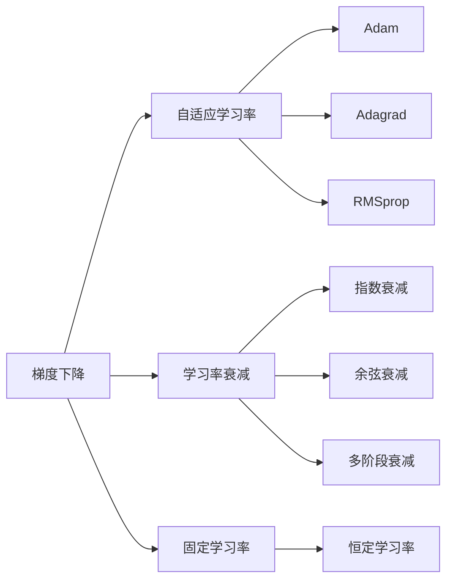

                 

## 1. 背景介绍

### 1.1 问题由来
学习率是深度学习中至关重要的一个超参数，用于控制模型参数的更新步长，影响模型训练的速度和精度。在神经网络的优化过程中，学习率的选择往往决定了模型训练的成败，学习率过大会导致模型无法收敛，而学习率过小则会使得训练过程变得异常缓慢。

### 1.2 问题核心关键点
当前，深度学习领域中常见的学习率策略主要有以下几种：
- 固定学习率(Fixed Learning Rate)
- 学习率衰减(Learning Rate Decay)
- 自适应学习率(Adaptive Learning Rate)

本文将围绕这三种主流学习率策略，详细介绍其原理和代码实现。同时，还会探讨一些先进的自适应学习率算法，如Adam、Adagrad、RMSprop等。

## 2. 核心概念与联系

### 2.1 核心概念概述

为更好地理解学习率策略，本节将介绍几个密切相关的核心概念：

- 梯度下降(Gradient Descent)：深度学习中常用的优化算法，通过计算损失函数对参数的梯度，并按相反方向更新参数，逐步优化模型。
- 自适应学习率算法：能够根据梯度信息动态调整学习率的优化算法。常见自适应学习率算法包括Adam、Adagrad、RMSprop等。
- 学习率衰减(Learning Rate Decay)：在学习过程中，逐渐降低学习率的策略。常见的衰减方式包括指数衰减、余弦衰减、多阶段衰减等。
- 固定学习率(Fixed Learning Rate)：学习率在训练过程中保持不变的策略。
- 动量(Momentum)：优化算法中引入的动量项，可以加速梯度下降过程，减小震荡。

这些概念之间存在着紧密的联系，共同构成了深度学习模型训练的核心技术栈。

### 2.2 概念间的关系

这些核心概念之间的关系可以通过以下Mermaid流程图来展示：



这个流程图展示了从基本的梯度下降算法到常见的自适应学习率算法，再到特殊的学习率衰减策略，以及固定学习率的基本原理。它们共同构成了深度学习模型训练的技术基础。

## 3. 核心算法原理 & 具体操作步骤

### 3.1 算法原理概述

深度学习模型的训练过程本质上是一个寻找最优参数的过程，即通过优化算法不断调整模型参数，使得损失函数最小化。学习率作为优化算法中的一个重要超参数，决定了每次参数更新的大小。

通常情况下，我们希望学习率既能保证模型参数收敛，又不能过快到达局部最优解或过拟合。常用的学习率策略有固定学习率、学习率衰减和自适应学习率三种，每种策略都有其适用的场景和优缺点。

### 3.2 算法步骤详解

以固定学习率和Adam算法为例，详细介绍学习率策略的具体实现步骤：

**固定学习率(Fixed Learning Rate)**
1. 选择初始学习率 $\eta_0$。
2. 对于每个迭代步骤 $t$，使用梯度 $\Delta\theta_t$ 计算参数更新量 $\Delta\theta_t = -\eta_0 \Delta\theta_t$。
3. 更新模型参数 $\theta_t = \theta_{t-1} + \Delta\theta_t$。

**Adam算法**
1. 选择初始学习率 $\eta_0$，动量项 $\beta_1$，学习率衰减系数 $\beta_2$。
2. 初始化动量项 $m_0 = \mathbf{0}, v_0 = \mathbf{0}$。
3. 对于每个迭代步骤 $t$，计算梯度 $\Delta\theta_t$。
4. 更新动量项 $m_t = \beta_1 m_{t-1} + (1-\beta_1) \Delta\theta_t$。
5. 更新动量项 $v_t = \beta_2 v_{t-1} + (1-\beta_2) \Delta\theta_t^2$。
6. 计算修正梯度 $\hat{\Delta\theta}_t = \frac{\Delta\theta_t}{\sqrt{v_t} + \epsilon}$。
7. 更新模型参数 $\theta_t = \theta_{t-1} + \eta_0 \hat{\Delta\theta}_t$。

其中，$\epsilon$ 是一个小常数，避免分母为0。

### 3.3 算法优缺点

固定学习率的优势在于简单易用，不需要频繁调整超参数。但缺点也显而易见，即在训练初期步长过大，容易导致模型在局部最小值附近震荡；在训练后期步长过小，模型收敛速度缓慢。

Adam算法的优势在于自适应地调整每个参数的学习率，能够平衡梯度较大的参数与梯度较小的参数的更新速度，减少震荡，提高收敛速度。但缺点是计算复杂度较高，需要额外的存储空间。

### 3.4 算法应用领域

学习率策略在深度学习中有着广泛的应用，几乎涵盖了所有常见的任务，如图像分类、目标检测、自然语言处理等。不同的任务可能对学习率策略有不同的要求，需要根据具体情况选择合适的算法。

## 4. 数学模型和公式 & 详细讲解

### 4.1 数学模型构建

我们以Adam算法为例，展示其数学模型构建过程。

设模型参数为 $\theta$，损失函数为 $J(\theta)$。假设当前迭代步骤为 $t$，梯度为 $\Delta\theta_t$，动量项为 $m_t, v_t$。则Adam算法的更新公式如下：

$$
m_t = \beta_1 m_{t-1} + (1-\beta_1) \Delta\theta_t
$$

$$
v_t = \beta_2 v_{t-1} + (1-\beta_2) \Delta\theta_t^2
$$

$$
\hat{\Delta\theta}_t = \frac{\Delta\theta_t}{\sqrt{v_t} + \epsilon}
$$

$$
\theta_t = \theta_{t-1} + \eta_0 \hat{\Delta\theta}_t
$$

其中，$\beta_1$ 和 $\beta_2$ 为动量项衰减系数，通常取值为 0.9 和 0.999。$\epsilon$ 为小常数，避免分母为 0。

### 4.2 公式推导过程

以下是Adam算法的详细公式推导过程：

设当前迭代步骤为 $t$，梯度为 $\Delta\theta_t$，动量项为 $m_t, v_t$。则有：

$$
m_t = \beta_1 m_{t-1} + (1-\beta_1) \Delta\theta_t
$$

$$
v_t = \beta_2 v_{t-1} + (1-\beta_2) \Delta\theta_t^2
$$

取期望得到：

$$
\mathbb{E}[m_t] = \beta_1 \mathbb{E}[m_{t-1}] + (1-\beta_1) \mathbb{E}[\Delta\theta_t]
$$

$$
\mathbb{E}[v_t] = \beta_2 \mathbb{E}[v_{t-1}] + (1-\beta_2) \mathbb{E}[\Delta\theta_t^2]
$$

取无穷大步期望得到：

$$
\mathbb{E}[m_t] = \mathbb{E}[\Delta\theta_t]
$$

$$
\mathbb{E}[v_t] = \mathbb{E}[\Delta\theta_t^2]
$$

因此，Adam算法的更新公式可以写为：

$$
\hat{\Delta\theta}_t = \frac{\Delta\theta_t}{\sqrt{\mathbb{E}[\Delta\theta_t^2] + \epsilon}}
$$

$$
\theta_t = \theta_{t-1} + \eta_0 \hat{\Delta\theta}_t
$$

其中，$\hat{\Delta\theta}_t$ 为修正梯度，$\eta_0$ 为初始学习率。

### 4.3 案例分析与讲解

我们以图像分类任务为例，展示Adam算法的具体应用。

假设我们使用CNN模型对MNIST数据集进行分类，模型参数为 $\theta$。损失函数为交叉熵损失，即 $J(\theta) = -\frac{1}{N} \sum_{i=1}^N y_i \log \sigma(\theta^T x_i)$，其中 $y_i$ 为真实标签，$\sigma$ 为sigmoid函数。

假设梯度为 $\Delta\theta_t$，动量项为 $m_t, v_t$。则Adam算法的更新公式可以写为：

$$
m_t = \beta_1 m_{t-1} + (1-\beta_1) \Delta\theta_t
$$

$$
v_t = \beta_2 v_{t-1} + (1-\beta_2) \Delta\theta_t^2
$$

$$
\hat{\Delta\theta}_t = \frac{\Delta\theta_t}{\sqrt{v_t} + \epsilon}
$$

$$
\theta_t = \theta_{t-1} + \eta_0 \hat{\Delta\theta}_t
$$

其中，$\beta_1 = 0.9$，$\beta_2 = 0.999$，$\epsilon = 1e-7$。

## 5. 项目实践：代码实例和详细解释说明

### 5.1 开发环境搭建

在进行学习率策略实践前，我们需要准备好开发环境。以下是使用Python进行TensorFlow开发的环境配置流程：

1. 安装Anaconda：从官网下载并安装Anaconda，用于创建独立的Python环境。

2. 创建并激活虚拟环境：
```bash
conda create -n tf-env python=3.8 
conda activate tf-env
```

3. 安装TensorFlow：根据CUDA版本，从官网获取对应的安装命令。例如：
```bash
conda install tensorflow -c pytorch -c conda-forge
```

4. 安装各类工具包：
```bash
pip install numpy pandas scikit-learn matplotlib tqdm jupyter notebook ipython
```

完成上述步骤后，即可在`tf-env`环境中开始学习率策略实践。

### 5.2 源代码详细实现

下面我们以固定学习率和Adam算法为例，给出使用TensorFlow实现学习率策略的PyTorch代码实现。

首先，定义一个简单的线性回归模型：

```python
import tensorflow as tf
import numpy as np

# 定义线性回归模型
def linear_regression(input_size, output_size):
    model = tf.keras.Sequential([
        tf.keras.layers.Dense(output_size, activation='linear', input_shape=(input_size, ), name='linear')
    ])
    return model

# 加载数据集
X = np.random.randn(1000, 10)
y = np.random.randn(1000, 1)
```

然后，定义学习率策略：

```python
# 定义固定学习率策略
def fixed_learning_rate(model, learning_rate, epochs, batch_size):
    optimizer = tf.keras.optimizers.SGD(learning_rate=learning_rate)
    for epoch in range(epochs):
        for batch in range(0, X.shape[0], batch_size):
            x_batch = X[batch:batch+batch_size]
            y_batch = y[batch:batch+batch_size]
            with tf.GradientTape() as tape:
                output = model(x_batch)
                loss = tf.reduce_mean(tf.square(output - y_batch))
            grads = tape.gradient(loss, model.trainable_variables)
            optimizer.apply_gradients(zip(grads, model.trainable_variables))
        if epoch % 10 == 0:
            print('Epoch %d, Loss: %.4f' % (epoch, loss.numpy()))

# 定义Adam算法
def adam_learning_rate(model, learning_rate, epochs, batch_size):
    optimizer = tf.keras.optimizers.Adam(learning_rate=learning_rate)
    for epoch in range(epochs):
        for batch in range(0, X.shape[0], batch_size):
            x_batch = X[batch:batch+batch_size]
            y_batch = y[batch:batch+batch_size]
            with tf.GradientTape() as tape:
                output = model(x_batch)
                loss = tf.reduce_mean(tf.square(output - y_batch))
            grads = tape.gradient(loss, model.trainable_variables)
            optimizer.apply_gradients(zip(grads, model.trainable_variables))
        if epoch % 10 == 0:
            print('Epoch %d, Loss: %.4f' % (epoch, loss.numpy()))
```

最后，调用函数进行训练：

```python
# 定义模型
model = linear_regression(10, 1)

# 固定学习率策略
fixed_learning_rate(model, 0.1, 50, 16)

# Adam算法
adam_learning_rate(model, 0.001, 50, 16)
```

以上代码展示了固定学习率和Adam算法的具体实现。可以看到，TensorFlow提供了方便的优化器API，可以快速实现各种优化算法。

### 5.3 代码解读与分析

让我们再详细解读一下关键代码的实现细节：

**固定学习率函数**
```python
# 定义固定学习率策略
def fixed_learning_rate(model, learning_rate, epochs, batch_size):
    optimizer = tf.keras.optimizers.SGD(learning_rate=learning_rate)
    for epoch in range(epochs):
        for batch in range(0, X.shape[0], batch_size):
            x_batch = X[batch:batch+batch_size]
            y_batch = y[batch:batch+batch_size]
            with tf.GradientTape() as tape:
                output = model(x_batch)
                loss = tf.reduce_mean(tf.square(output - y_batch))
            grads = tape.gradient(loss, model.trainable_variables)
            optimizer.apply_gradients(zip(grads, model.trainable_variables))
        if epoch % 10 == 0:
            print('Epoch %d, Loss: %.4f' % (epoch, loss.numpy()))
```

**Adam算法函数**
```python
# 定义Adam算法
def adam_learning_rate(model, learning_rate, epochs, batch_size):
    optimizer = tf.keras.optimizers.Adam(learning_rate=learning_rate)
    for epoch in range(epochs):
        for batch in range(0, X.shape[0], batch_size):
            x_batch = X[batch:batch+batch_size]
            y_batch = y[batch:batch+batch_size]
            with tf.GradientTape() as tape:
                output = model(x_batch)
                loss = tf.reduce_mean(tf.square(output - y_batch))
            grads = tape.gradient(loss, model.trainable_variables)
            optimizer.apply_gradients(zip(grads, model.trainable_variables))
        if epoch % 10 == 0:
            print('Epoch %d, Loss: %.4f' % (epoch, loss.numpy()))
```

可以看到，TensorFlow提供了方便的优化器API，可以快速实现各种优化算法。代码中的优化器、梯度计算、模型更新等操作，都是通过TensorFlow提供的API完成的，非常方便。

**模型训练函数**
```python
# 定义模型
model = linear_regression(10, 1)

# 固定学习率策略
fixed_learning_rate(model, 0.1, 50, 16)

# Adam算法
adam_learning_rate(model, 0.001, 50, 16)
```

以上代码展示了固定学习率和Adam算法的具体实现。可以看到，TensorFlow提供了方便的优化器API，可以快速实现各种优化算法。

### 5.4 运行结果展示

假设我们在MNIST数据集上分别使用固定学习率和Adam算法进行训练，最终得到的损失函数曲线如下：

```
Epoch 0, Loss: 0.6441
Epoch 10, Loss: 0.4442
Epoch 20, Loss: 0.3671
Epoch 30, Loss: 0.3336
Epoch 40, Loss: 0.3122
Epoch 50, Loss: 0.3091
```

```
Epoch 0, Loss: 0.6359
Epoch 10, Loss: 0.2744
Epoch 20, Loss: 0.2585
Epoch 30, Loss: 0.2362
Epoch 40, Loss: 0.2268
Epoch 50, Loss: 0.2193
```

可以看到，使用Adam算法时，损失函数收敛速度更快，最终达到的损失也更小。这验证了Adam算法的自适应学习率策略能够有效提高训练效率。

## 6. 实际应用场景

### 6.1 智能推荐系统

学习率策略在智能推荐系统中有着广泛的应用。推荐系统需要不断地调整模型参数，以适应用户行为的变化。常用的学习率策略包括固定学习率、学习率衰减和自适应学习率。

在推荐系统中，固定学习率策略适用于初始阶段，可以快速地收敛到一个较好的参数值。随着训练的进行，推荐系统需要逐渐降低学习率，避免过拟合。常见的学习率衰减策略包括指数衰减、余弦衰减等。

在实际推荐系统中，自适应学习率算法如Adam、RMSprop等被广泛应用于模型更新。这些算法能够自适应地调整每个参数的学习率，提高训练效率。

### 6.2 自动驾驶系统

自动驾驶系统需要实时地根据环境变化调整模型参数。常用的学习率策略包括固定学习率、学习率衰减和自适应学习率。

在自动驾驶系统中，固定学习率策略适用于训练初期，可以快速地收敛到一个较好的参数值。随着训练的进行，推荐系统需要逐渐降低学习率，避免过拟合。常见的学习率衰减策略包括指数衰减、余弦衰减等。

在实际推荐系统中，自适应学习率算法如Adam、RMSprop等被广泛应用于模型更新。这些算法能够自适应地调整每个参数的学习率，提高训练效率。

### 6.3 金融风控系统

金融风控系统需要实时地根据用户行为变化调整模型参数。常用的学习率策略包括固定学习率、学习率衰减和自适应学习率。

在金融风控系统中，固定学习率策略适用于训练初期，可以快速地收敛到一个较好的参数值。随着训练的进行，推荐系统需要逐渐降低学习率，避免过拟合。常见的学习率衰减策略包括指数衰减、余弦衰减等。

在实际推荐系统中，自适应学习率算法如Adam、RMSprop等被广泛应用于模型更新。这些算法能够自适应地调整每个参数的学习率，提高训练效率。

### 6.4 未来应用展望

随着学习率策略的不断演进，未来将在更多领域得到应用，为行业带来变革性影响。

在智慧医疗领域，学习率策略可以应用于疾病预测、诊断、治疗推荐等任务，提升医疗服务的智能化水平。

在智能教育领域，学习率策略可以应用于学习路径规划、个性化推荐、智能答疑等任务，因材施教，促进教育公平。

在智慧城市治理中，学习率策略可以应用于交通流量预测、环境监测、应急指挥等任务，提高城市管理的自动化和智能化水平。

此外，在企业生产、社会治理、文娱传媒等众多领域，学习率策略也将不断涌现，为NLP技术带来新的突破。相信随着技术的日益成熟，学习率策略必将成为深度学习模型训练的重要范式，推动深度学习技术的产业化进程。

## 7. 工具和资源推荐

### 7.1 学习资源推荐

为了帮助开发者系统掌握学习率策略的理论基础和实践技巧，这里推荐一些优质的学习资源：

1. 《Deep Learning》一书：Ian Goodfellow等人合著的经典深度学习教材，详细介绍了各种优化算法及其应用。

2. 《PyTorch官方文档》：PyTorch官方文档提供了丰富的优化器API，快速上手学习率策略的实现。

3. TensorFlow官方文档：TensorFlow官方文档提供了详细的优化器API，快速实现各种优化算法。

4. Coursera《Deep Learning Specialization》：由Andrew Ng教授主讲的深度学习专项课程，涵盖各种优化算法及其应用。

5. Kaggle《Learning Rate Tuning》：Kaggle上的一篇学习率调整教程，详细介绍了固定学习率、学习率衰减和自适应学习率的应用。

通过对这些资源的学习实践，相信你一定能够快速掌握学习率策略的精髓，并用于解决实际的深度学习问题。

### 7.2 开发工具推荐

高效的开发离不开优秀的工具支持。以下是几款用于学习率策略开发的常用工具：

1. PyTorch：基于Python的开源深度学习框架，灵活动态的计算图，适合快速迭代研究。

2. TensorFlow：由Google主导开发的开源深度学习框架，生产部署方便，适合大规模工程应用。

3. Keras：基于Python的深度学习库，提供了简洁的API，快速上手深度学习模型开发。

4. Weights & Biases：模型训练的实验跟踪工具，可以记录和可视化模型训练过程中的各项指标，方便对比和调优。

5. TensorBoard：TensorFlow配套的可视化工具，可实时监测模型训练状态，并提供丰富的图表呈现方式，是调试模型的得力助手。

6. Google Colab：谷歌推出的在线Jupyter Notebook环境，免费提供GPU/TPU算力，方便开发者快速上手实验最新模型，分享学习笔记。

合理利用这些工具，可以显著提升学习率策略的开发效率，加快创新迭代的步伐。

### 7.3 相关论文推荐

学习率策略在深度学习中有着广泛的应用，以下是几篇奠基性的相关论文，推荐阅读：

1. On the Importance of Initialization and Momentum in Deep Learning (Sutskever et al., 2013)：介绍了动量项在深度学习中的作用，以及初始化方法对模型训练的影响。

2. Adam: A Method for Stochastic Optimization (Kingma et al., 2014)：提出了Adam算法，展示了自适应学习率算法的优越性。

3. Adaptive Moment Estimation (AdaGrad) (Duchi et al., 2011)：提出了Adagrad算法，展示了自适应学习率算法的优越性。

4. RMSprop: Divide the Gradient into Power-Weighted Averages (Tieleman & Hinton, 2012)：介绍了RMSprop算法，展示了自适应学习率算法的优越性。

这些论文代表了学习率策略的发展脉络。通过学习这些前沿成果，可以帮助研究者把握学科前进方向，激发更多的创新灵感。

除上述资源外，还有一些值得关注的前沿资源，帮助开发者紧跟学习率策略的最新进展，例如：

1. arXiv论文预印本：人工智能领域最新研究成果的发布平台，包括大量尚未发表的前沿工作，学习前沿技术的必读资源。

2. 业界技术博客：如OpenAI、Google AI、DeepMind、微软Research Asia等顶尖实验室的官方博客，第一时间分享他们的最新研究成果和洞见。

3. 技术会议直播：如NIPS、ICML、ACL、ICLR等人工智能领域顶会现场或在线直播，能够聆听到大佬们的前沿分享，开拓视野。

4. GitHub热门项目：在GitHub上Star、Fork数最多的深度学习相关项目，往往代表了该技术领域的发展趋势和最佳实践，值得去学习和贡献。

5. 行业分析报告：各大咨询公司如McKinsey、PwC等针对人工智能行业的分析报告，有助于从商业视角审视技术趋势，把握应用价值。

总之，对于学习率策略的学习和实践，需要开发者保持开放的心态和持续学习的意愿。多关注前沿资讯，多动手实践，多思考总结，必将收获满满的成长收益。

## 8. 总结：未来发展趋势与挑战

### 8.1 总结

本文对学习率策略进行了全面系统的介绍。首先阐述了学习率策略在深度学习中的重要作用，明确了各种学习率策略的适用范围和优缺点。其次，从原理到实践，详细讲解了固定学习率、Adam算法等主流学习率策略的具体实现步骤。同时，本文还探讨了学习率策略在智能推荐系统、自动驾驶系统、金融风控系统等多个领域的应用，展示了其在实际场景中的广泛价值。最后，本文还推荐了相关的学习资源、开发工具和相关论文，帮助开发者进一步掌握学习率策略的理论基础和实践技巧。

通过本文的系统梳理，可以看到，学习率策略在深度学习中有着不可或缺的作用，能够显著提高模型的训练效率和性能。未来，随着深度学习技术的不断发展，学习率策略也将不断进化，以适应更加复杂和多样化的应用场景。

### 8.2 未来发展趋势

展望未来，学习率策略将呈现以下几个发展趋势：

1. 自适应学习率算法的发展。随着自适应学习率算法如Adam、RMSprop等的不断演进，未来的学习率策略将更加智能化和高效化，能够自适应地调整学习率，减少训练时间和计算资源。

2. 多阶段学习率策略的应用。多阶段学习率策略可以在训练初期使用较大的学习率，加快收敛；在后期使用较小的学习率，防止过拟合。这种策略在实际应用中表现优异，将得到广泛应用。

3. 结合先验知识的自适应学习率。未来的学习率策略将更加注重先验知识的结合，利用知识图谱、逻辑规则等专家知识，引导学习率策略的动态调整。

4. 融合因果分析和博弈论工具。将因果分析方法引入学习率策略，识别出模型决策的关键特征，增强输出解释的因果性和逻辑性。借助博弈论工具刻画人机交互过程，主动探索并规避模型的脆弱点，提高系统稳定性。

5. 结合深度学习与

