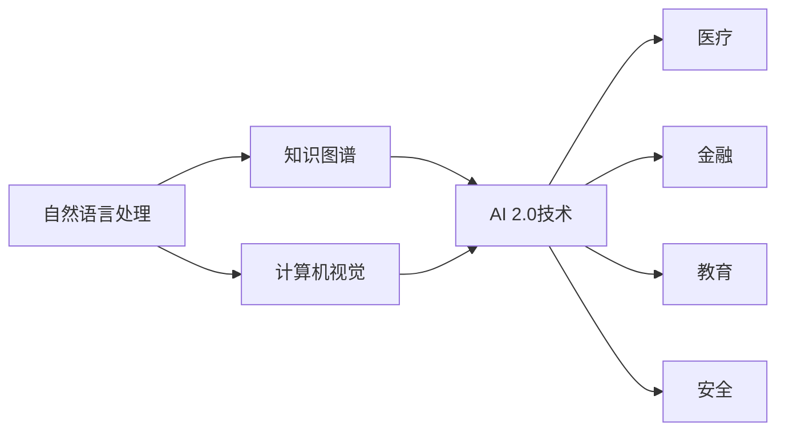

                 

# 李开复：AI 2.0 时代的社会价值

在当下AI 2.0时代，人工智能技术正以空前迅猛的步伐，渗透到社会的每一个角落。作为一名技术专家，本文将探讨AI 2.0在社会价值方面的体现，以及其在推动社会进步、改善人民生活方面的巨大潜力。

## 1. 背景介绍

### 1.1 什么是AI 2.0

AI 2.0是继人工智能1.0和AI深度学习2.0之后的第三代AI技术，它代表了人工智能技术的最新进展。AI 2.0不仅包括了深度学习、机器学习等传统技术，还涵盖了自然语言处理、计算机视觉、知识图谱等新领域的突破。AI 2.0 时代标志着人工智能从依赖大量数据和计算资源的深度学习，转向更加普适、灵活和高效的算法与技术，能够更广泛地应用于各行各业。

### 1.2 AI 2.0的关键特征

AI 2.0的关键特征包括：

- **通用性**：能够适用于多个领域和任务，而不仅仅是特定场景。
- **自主性**：能够进行自主学习和决策，不需要人为干预。
- **适应性**：能够快速适应新环境和任务。
- **可解释性**：具备较强的解释能力，能够理解并解释其决策过程。
- **可控性**：能够通过干预和控制其行为。

## 2. 核心概念与联系

### 2.1 核心概念概述

- **自然语言处理(NLP)**：使计算机能够理解、解释和生成自然语言的技术。AI 2.0在NLP方面的突破，如GPT-4、BERT等模型，使机器能够更好地理解和生成人类语言，为AI 2.0在社会价值方面的应用奠定了基础。
- **计算机视觉(CV)**：使计算机能够“看”和“理解”图像和视频的技术。AI 2.0在CV方面的突破，如ResNet、DenseNet等模型，使机器能够更加准确地识别和理解视觉信息，进一步扩展了AI 2.0的应用领域。
- **知识图谱(KG)**：通过构建知识图谱，机器能够更好地理解世界，进行知识推理和推理。AI 2.0在KG方面的突破，如KG-BERT、Owl-KG等模型，为机器提供了更全面的知识库和更丰富的语义理解能力。

### 2.2 核心概念间的联系

AI 2.0技术在自然语言处理、计算机视觉和知识图谱等领域的发展，相辅相成，相互促进。例如，知识图谱可以提供丰富的语义信息，提升自然语言处理的准确性；自然语言处理可以更好地从文本中提取信息，丰富知识图谱的构建。同时，AI 2.0技术在医疗、金融、教育、安全等领域的应用，也离不开NLP、CV和KG的紧密结合。

下面，我们通过一个Mermaid流程图来展示这些核心概念之间的联系：



这个流程图展示了AI 2.0技术在各个领域的应用，其中自然语言处理、计算机视觉和知识图谱是AI 2.0的核心技术，通过它们之间的紧密结合，AI 2.0技术在医疗、金融、教育和安全等领域得到了广泛应用。

## 3. 核心算法原理 & 具体操作步骤

### 3.1 算法原理概述

AI 2.0的算法原理可以分为以下几个方面：

- **深度学习**：通过多层次的非线性变换，使机器能够从数据中学习到复杂的模式。
- **自监督学习**：利用无标签数据，自动生成任务和标签，使机器能够进行自主学习。
- **迁移学习**：利用预训练模型和少量有标签数据，进行微调，提升模型在特定任务上的性能。
- **强化学习**：通过试错反馈，不断优化决策策略，使机器能够在复杂环境中进行自主学习。

### 3.2 算法步骤详解

AI 2.0算法的一般步骤包括：

1. **数据准备**：收集和预处理数据，使其符合模型的要求。
2. **模型训练**：使用深度学习、自监督学习等算法，训练模型。
3. **模型微调**：利用迁移学习等技术，对模型进行微调，提升模型在特定任务上的性能。
4. **模型测试**：在测试集上评估模型性能，确保模型能够在实际应用中表现良好。
5. **模型部署**：将模型部署到实际应用中，进行业务集成。

### 3.3 算法优缺点

AI 2.0算法的优点包括：

- **精度高**：通过深度学习和自监督学习，AI 2.0算法能够获得高精度的结果。
- **灵活性强**：能够适应不同的任务和场景，进行自主学习和决策。
- **可解释性强**：具备较强的解释能力，能够理解并解释其决策过程。

然而，AI 2.0算法也存在一些缺点：

- **数据依赖性强**：需要大量的标注数据进行训练和微调，对标注数据的依赖性强。
- **计算资源需求高**：需要大量的计算资源进行训练和推理，计算资源需求高。
- **模型复杂度高**：模型结构复杂，难以进行解释和调试。

### 3.4 算法应用领域

AI 2.0算法在医疗、金融、教育、安全等领域得到了广泛应用。具体如下：

- **医疗**：利用AI 2.0算法进行病历分析、医学影像诊断、个性化治疗等。
- **金融**：利用AI 2.0算法进行风险评估、投资决策、反欺诈检测等。
- **教育**：利用AI 2.0算法进行学情分析、作业批改、智能推荐等。
- **安全**：利用AI 2.0算法进行网络安全检测、入侵检测、身份认证等。

## 4. 数学模型和公式 & 详细讲解 & 举例说明

### 4.1 数学模型构建

AI 2.0的数学模型构建可以从以下几个方面进行：

- **深度神经网络**：通过多层非线性变换，学习数据中的复杂模式。
- **自监督学习**：通过无标签数据，自动生成任务和标签。
- **迁移学习**：利用预训练模型和少量有标签数据，进行微调。

### 4.2 公式推导过程

以下是AI 2.0算法中的深度神经网络模型的推导过程：

假设深度神经网络由多个隐层组成，其中第$i$层的输出为$h_i$，输入为$h_{i-1}$，权重为$W_i$，激活函数为$g$，则第$i$层的输出可以表示为：

$$
h_i = g(W_i h_{i-1} + b_i)
$$

其中$g$为激活函数，$b_i$为偏置项。

### 4.3 案例分析与讲解

以AI 2.0算法在医疗领域的病历分析为例，假设有$n$个患者，每个患者的病历记录为$x_i$，其中$i=1,2,...,n$。设模型参数为$\theta$，则病历分析的任务可以表示为：

$$
y_i = f(x_i; \theta)
$$

其中$y_i$为模型的预测结果，$f$为模型函数，$\theta$为模型参数。

## 5. 项目实践：代码实例和详细解释说明

### 5.1 开发环境搭建

AI 2.0项目开发需要高性能计算环境，建议使用GPU或TPU进行训练和推理。可以使用Google Colab、AWS Deep Learning AMI等云端环境进行开发，也可以搭建本地集群环境进行开发。

### 5.2 源代码详细实现

以下是一个使用TensorFlow进行病历分析的代码示例：

```python
import tensorflow as tf
from tensorflow.keras import layers

# 构建深度神经网络模型
model = tf.keras.Sequential([
    layers.Dense(64, activation='relu', input_shape=(10,)),
    layers.Dense(64, activation='relu'),
    layers.Dense(1, activation='sigmoid')
])

# 编译模型
model.compile(optimizer='adam', loss='binary_crossentropy', metrics=['accuracy'])

# 训练模型
model.fit(x_train, y_train, epochs=10, batch_size=32)

# 评估模型
model.evaluate(x_test, y_test)
```

### 5.3 代码解读与分析

- **模型构建**：通过Sequential模型构建了一个包含3个全连接层的深度神经网络。
- **模型编译**：使用Adam优化器和二元交叉熵损失函数进行模型编译。
- **模型训练**：使用训练数据进行模型训练，并设置训练轮数和批次大小。
- **模型评估**：使用测试数据对模型进行评估，输出模型精度。

## 6. 实际应用场景

### 6.1 医疗领域

AI 2.0算法在医疗领域的应用包括病历分析、医学影像诊断、个性化治疗等。以医学影像诊断为例，利用AI 2.0算法对医学影像进行分析和诊断，能够提高诊断的准确性和效率，减少误诊率。

### 6.2 金融领域

AI 2.0算法在金融领域的应用包括风险评估、投资决策、反欺诈检测等。以反欺诈检测为例，利用AI 2.0算法对交易数据进行分析，能够及时发现异常行为，进行风险预警。

### 6.3 教育领域

AI 2.0算法在教育领域的应用包括学情分析、作业批改、智能推荐等。以智能推荐为例，利用AI 2.0算法对学生的学习数据进行分析，能够推荐适合的学习资源和课程，提升学习效果。

### 6.4 安全领域

AI 2.0算法在安全领域的应用包括网络安全检测、入侵检测、身份认证等。以身份认证为例，利用AI 2.0算法对用户行为进行分析，能够实现更加安全的身份认证方式。

## 7. 工具和资源推荐

### 7.1 学习资源推荐

- **TensorFlow官方文档**：官方文档详细介绍了TensorFlow的使用方法，是学习AI 2.0算法的重要资源。
- **Deep Learning with Python**：李开复的畅销书，介绍了深度学习的基础知识和实践方法。
- **AI 2.0课程**：各大高校和在线教育平台提供的专业课程，系统介绍了AI 2.0算法的原理和应用。

### 7.2 开发工具推荐

- **TensorFlow**：谷歌开源的深度学习框架，支持GPU/TPU计算，适合大规模模型训练。
- **PyTorch**：Facebook开源的深度学习框架，支持动态计算图，适合快速原型开发。
- **Keras**：高层次的深度学习框架，适合初学者和快速原型开发。

### 7.3 相关论文推荐

- **Attention is All You Need**：Transformer模型的原论文，奠定了AI 2.0算法的理论基础。
- **BERT: Pre-training of Deep Bidirectional Transformers for Language Understanding**：BERT模型的原论文，展示了自监督学习在NLP中的重要应用。
- **ImageNet Classification with Deep Convolutional Neural Networks**：AlexNet论文，介绍了深度神经网络在计算机视觉中的应用。

## 8. 总结：未来发展趋势与挑战

### 8.1 研究成果总结

AI 2.0算法在自然语言处理、计算机视觉和知识图谱等领域取得了重大进展，推动了人工智能技术在各个领域的应用。然而，AI 2.0算法在应用过程中也面临着一些挑战，如数据依赖性强、计算资源需求高、模型复杂度高等问题。

### 8.2 未来发展趋势

AI 2.0技术的未来发展趋势包括：

- **多模态学习**：融合多种模态信息，提升AI 2.0算法的表现力。
- **自适应学习**：使AI 2.0算法能够根据环境和任务的变化进行自主学习和优化。
- **联邦学习**：通过分布式计算，提升AI 2.0算法的计算效率和数据安全性。
- **模型压缩和优化**：优化模型结构，降低计算资源需求。

### 8.3 面临的挑战

AI 2.0算法在应用过程中面临的挑战包括：

- **数据隐私和安全**：在处理敏感数据时，如何保护用户隐私和安全。
- **伦理和道德**：在应用AI 2.0算法时，如何确保其行为符合伦理和道德规范。
- **可解释性**：如何增强AI 2.0算法的可解释性和透明度。

### 8.4 研究展望

AI 2.0算法未来的研究方向包括：

- **融合更多领域知识**：将更多领域知识融合到AI 2.0算法中，提升其应用范围和效果。
- **建立更加完善的理论框架**：建立更加完善的AI 2.0算法理论框架，指导未来的研究和应用。
- **加强跨学科合作**：加强人工智能与各学科的交叉融合，推动AI 2.0技术的广泛应用。

## 9. 附录：常见问题与解答

**Q1: 什么是AI 2.0算法？**

A: AI 2.0算法是第三代人工智能技术，包含了深度学习、自监督学习、迁移学习、强化学习等多种技术，能够自主学习和决策，适应不同的任务和场景。

**Q2: AI 2.0算法在医疗领域的应用有哪些？**

A: AI 2.0算法在医疗领域的应用包括病历分析、医学影像诊断、个性化治疗等。利用AI 2.0算法对医学影像进行分析和诊断，能够提高诊断的准确性和效率，减少误诊率。

**Q3: 如何增强AI 2.0算法的可解释性？**

A: 增强AI 2.0算法的可解释性可以从以下几个方面进行：

- **使用可解释性模型**：使用可解释性模型，如决策树、线性模型等，提升模型的可解释性。
- **提供模型解释工具**：提供模型解释工具，如LIME、SHAP等，帮助用户理解模型的决策过程。
- **增加模型透明度**：增加模型的透明度，将模型的训练过程和参数公开，方便用户进行审查和验证。

**Q4: AI 2.0算法在金融领域的应用有哪些？**

A: AI 2.0算法在金融领域的应用包括风险评估、投资决策、反欺诈检测等。以反欺诈检测为例，利用AI 2.0算法对交易数据进行分析，能够及时发现异常行为，进行风险预警。

---

作者：禅与计算机程序设计艺术 / Zen and the Art of Computer Programming

