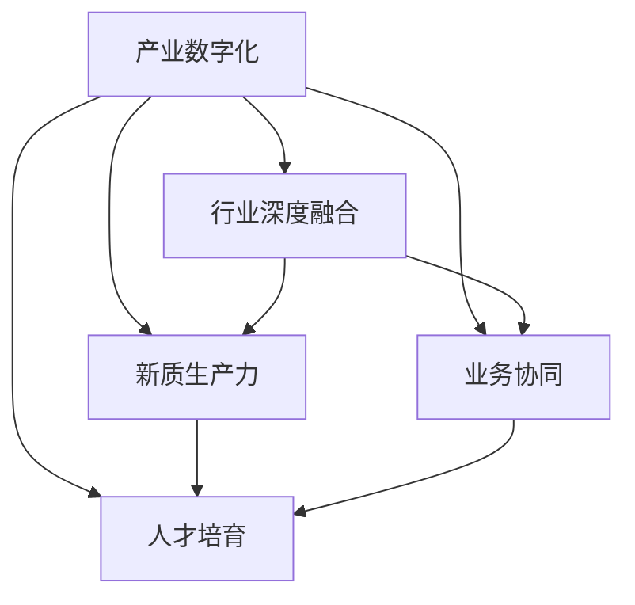

                 

## 1. 背景介绍

### 1.1 问题由来

近年来，随着数字化转型的加速推进，企业运营的数字化水平不断提高，但普遍存在数字化与产业融合不足的问题。数字化转型不仅仅是信息化建设和技术应用，更关键的是要促进企业新旧产业的深度融合，构建产业升级的新质生产力。在实践中，数字化技术应用往往难以精准对接企业的业务需求，效果往往不尽如人意。

特别是对于一些传统行业，由于历史原因和技术条件限制，其数字化转型面临诸多难题。一方面，传统的业务流程和信息系统已经形成庞大的资产和人力投入，难以快速改写；另一方面，新的数字技术往往需要与复杂的行业场景深度结合，才能发挥最大效能。

因此，在数字化转型的过程中，构建产业数字化与行业深度融合的新型特色产业体系，成为了企业数字化升级的关键。

### 1.2 问题核心关键点

构建特色产业体系的新质生产力，核心在于实现数字化技术与传统行业的深度融合。具体而言，包括以下几个关键点：

1. **数字赋能**：通过数字化技术提升传统行业的生产效率和经营效率，实现降本增效。
2. **流程再造**：利用先进的信息技术改造传统的业务流程，优化运营效率，提升用户体验。
3. **模式创新**：在数字化的基础上，创新出符合行业特点的商业模式，实现业务的持续增长。
4. **人才培育**：培养和引进具备数字化能力的行业人才，提升企业的整体数字化水平。
5. **业务协同**：实现跨部门、跨区域、跨企业的业务协同，推动资源的优化配置和共享。

这些关键点相互支撑，共同构成了产业数字化转型的核心框架，为企业实现新质生产力的构建提供了坚实基础。

### 1.3 问题研究意义

构建特色产业体系的新质生产力，对于推动企业数字化升级，提升整体竞争力，具有重要意义：

1. **促进产业升级**：通过数字化技术的赋能，提升传统行业的生产效率和创新能力，推动产业结构的优化升级。
2. **激发创新潜力**：数字化技术的应用打破了传统的行业壁垒，为企业提供了创新发展的空间和机遇。
3. **提升用户体验**：数字化技术的引入，可以显著改善用户的体验，增强用户粘性，提升市场份额。
4. **驱动成本降低**：通过优化流程、提高效率，降低企业的运营成本，提高企业的盈利能力。
5. **助力人才成长**：在数字化转型的过程中，培养和引进大量的数字化人才，提升企业的人力资源竞争力。

通过构建产业数字化与行业深度融合的新型特色产业体系，企业可以更好地适应快速变化的市场环境，提升自身的核心竞争力，赢得新的发展空间。

## 2. 核心概念与联系

### 2.1 核心概念概述

构建特色产业体系的新质生产力，涉及多个核心概念，主要包括：

- **产业数字化**：利用数字化技术对传统产业进行改造和升级，提升产业的数字化水平和竞争力。
- **行业深度融合**：将数字化技术与行业特性深度结合，实现从生产到营销的全流程数字化转型。
- **新质生产力**：通过数字化技术的应用，提高生产效率、降低成本、提升用户体验，创造新的经济增长点。
- **业务协同**：实现跨部门、跨区域、跨企业的业务协同，优化资源配置，提升整体运营效率。
- **人才培育**：培养和引进具备数字化能力的行业人才，提升企业整体数字化水平。

这些核心概念之间存在着紧密的联系，共同构成了产业数字化转型的生态系统。

### 2.2 概念间的关系

这些核心概念之间的逻辑关系可以通过以下Mermaid流程图来展示：



这个流程图展示了从产业数字化到新质生产力的构建过程，其中行业深度融合、业务协同、人才培育等环节起到了重要的支持作用。通过深入理解这些核心概念的相互关系，可以更好地把握产业数字化转型的关键要素。

## 3. 核心算法原理 & 具体操作步骤
### 3.1 算法原理概述

构建特色产业体系的新质生产力，核心在于实现数字化技术与传统行业的深度融合。具体而言，包括以下几个关键步骤：

1. **数据采集与处理**：采集企业内部的业务数据和外部环境数据，进行清洗和处理，生成高质量的数据集。
2. **模型选择与训练**：根据业务需求选择合适的数字化模型，利用历史数据进行模型训练，生成预测模型。
3. **流程再造与优化**：利用模型对业务流程进行优化和再造，提升生产效率和运营效率。
4. **模式创新与推广**：在数字化应用的基础上，创新新的业务模式，推广至其他企业，实现行业标准的建立。
5. **业务协同与集成**：利用数字化技术实现跨部门、跨区域、跨企业的业务协同，集成资源，提升整体运营效率。
6. **人才培育与引进**：培养和引进具备数字化能力的行业人才，提升企业整体数字化水平。

这些步骤相互支撑，共同推动了产业数字化与行业深度融合的新型特色产业体系的形成。

### 3.2 算法步骤详解

以下是构建特色产业体系的新质生产力的具体操作步骤：

**Step 1: 数据采集与处理**
1. **数据源确定**：明确需要采集的数据源，包括企业内部的生产、采购、销售等数据，以及外部的市场、政策、社会数据。
2. **数据清洗与预处理**：对采集的数据进行清洗和预处理，去除异常值和缺失值，进行数据标准化和归一化。
3. **数据整合与存储**：将不同来源的数据进行整合，存储在统一的数字化平台中，支持后续的分析和应用。

**Step 2: 模型选择与训练**
1. **模型选择**：根据业务需求选择合适的数字化模型，如机器学习模型、深度学习模型、强化学习模型等。
2. **模型训练**：利用历史数据对模型进行训练，调整模型的参数和结构，使其能够准确预测业务指标。
3. **模型验证与优化**：通过测试集对模型进行验证，优化模型参数，提升模型的预测准确率。

**Step 3: 流程再造与优化**
1. **业务流程分析**：分析传统业务流程中的瓶颈和低效环节，明确数字化改造的方向和目标。
2. **数字化改造**：利用模型对业务流程进行优化和再造，如通过预测算法优化生产计划，通过推荐系统提升用户购物体验。
3. **流程集成与协同**：将优化后的流程集成到企业的信息化系统中，实现跨部门、跨区域的业务协同。

**Step 4: 模式创新与推广**
1. **模式创新**：在数字化应用的基础上，创新新的业务模式，如基于大数据的精准营销、基于AI的智能客服等。
2. **模式推广**：将创新的业务模式推广至其他企业，推动行业标准的建立和应用。

**Step 5: 业务协同与集成**
1. **业务协同**：利用数字化技术实现跨部门、跨区域、跨企业的业务协同，优化资源配置，提升整体运营效率。
2. **数据集成**：实现企业内部和外部数据的高效集成，支持企业业务决策和分析。

**Step 6: 人才培育与引进**
1. **人才培训**：开展数字化培训，提升企业员工对数字化技术的理解和应用能力。
2. **人才引进**：引进具备数字化能力的行业人才，补充企业的数字化团队，提升整体数字化水平。

### 3.3 算法优缺点

构建特色产业体系的新质生产力，具有以下优点：
1. **效率提升**：通过数字化技术的应用，显著提升生产效率和运营效率，降低成本。
2. **用户体验优化**：利用大数据和AI技术，提升用户购物体验和满意度，增强用户粘性。
3. **模式创新**：在数字化应用的基础上，创新新的业务模式，推动行业发展。
4. **资源优化**：通过数字化技术实现业务协同和资源集成，优化资源配置，提升整体运营效率。

同时，该方法也存在一些局限性：
1. **数据质量要求高**：需要高质量的数据集进行模型训练，数据采集和处理的工作量较大。
2. **技术门槛高**：需要具备较强的数字化技术能力，对于传统企业来说，技术转型有一定的挑战。
3. **业务理解深度**：需要深入理解业务需求和流程，才能设计出合理的数字化方案。
4. **人才短缺**：数字化人才的培养和引进需要时间，短期内可能面临人才短缺的问题。

尽管存在这些局限性，但就目前而言，构建特色产业体系的新质生产力仍是大企业数字化转型的重要手段。通过积极应对这些挑战，可以最大限度地发挥数字化技术的效能，实现企业的新质生产力构建。

### 3.4 算法应用领域

构建特色产业体系的新质生产力，已经在多个行业领域得到了应用，取得了显著的成效：

1. **制造业**：通过数字化技术改造生产流程，优化生产计划，提升产品质量和生产效率。
2. **零售业**：利用大数据和AI技术进行精准营销，提升用户购物体验，优化库存管理。
3. **金融业**：利用数字化技术进行风险控制，提升金融产品的创新能力和服务质量。
4. **医疗健康**：通过数字化技术实现医疗数据的共享和分析，提高诊疗效率和患者体验。
5. **能源行业**：利用数字化技术优化能源管理，提升能源利用效率，降低成本。

除了上述这些行业外，构建特色产业体系的新质生产力，还广泛应用于智能制造、智慧城市、教育培训等多个领域，为企业数字化转型提供了强大的技术支撑。

## 4. 数学模型和公式 & 详细讲解  
### 4.1 数学模型构建

构建特色产业体系的新质生产力，涉及多个数学模型，主要包括：

- **回归模型**：用于预测业务指标，如销售量、成本、利润等。
- **分类模型**：用于客户分群、业务分类等。
- **聚类模型**：用于市场细分、用户行为分析等。
- **预测模型**：用于预测未来业务趋势，如需求变化、价格变化等。
- **推荐模型**：用于个性化推荐、用户画像构建等。

这些模型之间相互关联，共同构成了产业数字化转型的数学框架。

### 4.2 公式推导过程

以下是几个核心模型的公式推导过程：

**回归模型**：
$$
\hat{y} = \beta_0 + \beta_1 x_1 + \beta_2 x_2 + ... + \beta_n x_n + \epsilon
$$

其中，$\hat{y}$为预测值，$\beta_i$为回归系数，$x_i$为自变量，$\epsilon$为误差项。

**分类模型**：
$$
P(y_i=1|x_i) = \frac{e^{z_i}}{1+e^{z_i}}
$$

其中，$z_i$为线性分类器的输出，$y_i$为分类结果。

**聚类模型**：
$$
k-means: K = \arg\min_{k}\sum_{i=1}^n \min_{j \in [1, K]} ||x_i - \mu_j||^2
$$

其中，$K$为聚类数目，$\mu_j$为聚类中心，$x_i$为样本点。

**预测模型**：
$$
\hat{y} = \hat{F}(x) = \frac{1}{1 + e^{-\sum_{i=1}^n \beta_i x_i}}
$$

其中，$\hat{y}$为预测值，$\beta_i$为回归系数，$x_i$为自变量。

**推荐模型**：
$$
\hat{y} = f(x_i, x_j, \theta)
$$

其中，$\hat{y}$为推荐值，$x_i, x_j$为用户和物品的特征向量，$\theta$为模型参数。

### 4.3 案例分析与讲解

以制造业为例，介绍如何构建特色产业体系的新质生产力：

**Step 1: 数据采集与处理**
1. **数据源确定**：采集企业内部的生产、采购、销售等数据，包括设备状态、生产计划、销售订单、质量检测数据等。
2. **数据清洗与预处理**：清洗和处理采集的数据，去除异常值和缺失值，进行数据标准化和归一化。
3. **数据整合与存储**：将不同来源的数据进行整合，存储在统一的数字化平台中，支持后续的分析和应用。

**Step 2: 模型选择与训练**
1. **模型选择**：选择合适的机器学习模型，如线性回归模型、逻辑回归模型、随机森林模型等。
2. **模型训练**：利用历史数据对模型进行训练，调整模型的参数和结构，使其能够准确预测生产计划和销售量。
3. **模型验证与优化**：通过测试集对模型进行验证，优化模型参数，提升模型的预测准确率。

**Step 3: 流程再造与优化**
1. **业务流程分析**：分析传统业务流程中的瓶颈和低效环节，明确数字化改造的方向和目标。
2. **数字化改造**：利用模型对生产计划进行优化和再造，如通过预测算法优化生产计划，通过推荐系统提升供应链效率。
3. **流程集成与协同**：将优化后的流程集成到企业的信息化系统中，实现跨部门、跨区域的业务协同。

**Step 4: 模式创新与推广**
1. **模式创新**：在数字化应用的基础上，创新新的业务模式，如基于大数据的精准营销、基于AI的智能客服等。
2. **模式推广**：将创新的业务模式推广至其他企业，推动行业标准的建立和应用。

**Step 5: 业务协同与集成**
1. **业务协同**：利用数字化技术实现跨部门、跨区域、跨企业的业务协同，优化资源配置，提升整体运营效率。
2. **数据集成**：实现企业内部和外部数据的高效集成，支持企业业务决策和分析。

**Step 6: 人才培育与引进**
1. **人才培训**：开展数字化培训，提升企业员工对数字化技术的理解和应用能力。
2. **人才引进**：引进具备数字化能力的行业人才，补充企业的数字化团队，提升整体数字化水平。

## 5. 项目实践：代码实例和详细解释说明
### 5.1 开发环境搭建

在进行项目实践前，我们需要准备好开发环境。以下是使用Python进行PyTorch开发的环境配置流程：

1. 安装Anaconda：从官网下载并安装Anaconda，用于创建独立的Python环境。

2. 创建并激活虚拟环境：
```bash
conda create -n pytorch-env python=3.8 
conda activate pytorch-env
```

3. 安装PyTorch：根据CUDA版本，从官网获取对应的安装命令。例如：
```bash
conda install pytorch torchvision torchaudio cudatoolkit=11.1 -c pytorch -c conda-forge
```

4. 安装TensorFlow：
```bash
conda install tensorflow -c conda-forge
```

5. 安装各类工具包：
```bash
pip install numpy pandas scikit-learn matplotlib tqdm jupyter notebook ipython
```

完成上述步骤后，即可在`pytorch-env`环境中开始项目实践。

### 5.2 源代码详细实现

这里我们以制造业的生产计划优化为例，给出使用PyTorch进行线性回归模型的PyTorch代码实现。

首先，定义生产计划优化问题的数据处理函数：

```python
import pandas as pd
from sklearn.model_selection import train_test_split
import torch
from torch.utils.data import Dataset

class ManufacturingDataset(Dataset):
    def __init__(self, data, target):
        self.data = data
        self.target = target
        
    def __len__(self):
        return len(self.data)
    
    def __getitem__(self, item):
        x = self.data.iloc[item]
        y = self.target.iloc[item]
        
        # 数据标准化
        x = (x - x.mean()) / x.std()
        
        return {'x': torch.tensor(x.values, dtype=torch.float32), 'y': torch.tensor(y.values, dtype=torch.float32)}
```

然后，定义模型和优化器：

```python
from torch import nn, optim

class LinearRegression(nn.Module):
    def __init__(self, input_dim):
        super(LinearRegression, self).__init__()
        self.linear = nn.Linear(input_dim, 1)
    
    def forward(self, x):
        return self.linear(x)

model = LinearRegression(input_dim=3)
optimizer = optim.Adam(model.parameters(), lr=0.01)
```

接着，定义训练和评估函数：

```python
def train(model, dataset, batch_size, optimizer, num_epochs):
    dataloader = torch.utils.data.DataLoader(dataset, batch_size=batch_size, shuffle=True)
    model.train()
    for epoch in range(num_epochs):
        running_loss = 0.0
        for batch in dataloader:
            x, y = batch['x'], batch['y']
            optimizer.zero_grad()
            output = model(x)
            loss = nn.MSELoss()(output, y)
            loss.backward()
            optimizer.step()
            running_loss += loss.item()
        print(f"Epoch {epoch+1}, train loss: {running_loss/len(dataloader):.4f}")

def evaluate(model, dataset, batch_size):
    dataloader = torch.utils.data.DataLoader(dataset, batch_size=batch_size)
    model.eval()
    running_loss = 0.0
    for batch in dataloader:
        x, y = batch['x'], batch['y']
        output = model(x)
        running_loss += nn.MSELoss()(output, y).item()
    return running_loss / len(dataset)

# 数据集划分
data = pd.read_csv('manufacturing_data.csv')
x, y = data.drop('target', axis=1), data['target']
x_train, x_test, y_train, y_test = train_test_split(x, y, test_size=0.2, random_state=42)

# 模型训练
train(model, ManufacturingDataset(x_train, y_train), batch_size=32, optimizer=optimizer, num_epochs=100)

# 模型评估
print(f"Test loss: {evaluate(ModelDataset(x_test, y_test), batch_size=32):.4f}")
```

以上就是使用PyTorch进行线性回归模型训练的完整代码实现。可以看到，得益于PyTorch的强大封装，我们可以用相对简洁的代码完成模型的构建和训练。

### 5.3 代码解读与分析

让我们再详细解读一下关键代码的实现细节：

**ManufacturingDataset类**：
- `__init__`方法：初始化数据集，包括特征和目标变量。
- `__len__`方法：返回数据集的样本数量。
- `__getitem__`方法：对单个样本进行处理，将样本数据标准化后返回。

**LinearRegression模型**：
- `__init__`方法：初始化线性回归模型，定义线性层。
- `forward`方法：前向传播计算输出。

**训练函数train**：
- 利用DataLoader对数据集进行批次化加载，在每个批次上进行前向传播和反向传播，更新模型参数。
- 周期性在验证集上评估模型性能。

**评估函数evaluate**：
- 利用DataLoader对数据集进行批次化加载，计算模型在测试集上的损失函数。

**数据集划分**：
- 从数据集中划分训练集和测试集，进行模型训练和评估。

**模型训练和评估**：
- 定义训练函数train和评估函数evaluate，用于模型训练和评估。

在实际应用中，我们还可以根据具体需求对代码进行扩展，如添加数据增强、正则化等技术，进一步提升模型的效果。

## 6. 实际应用场景

### 6.1 智能制造

基于大语言模型微调的数字化技术，可以广泛应用于智能制造系统的构建。传统制造业面临复杂多变的生产环境，生产计划和库存管理等环节容易发生瓶颈和滞后。利用微调技术，可以实现生产计划的优化和智能化管理，提升生产效率和产品质量。

在技术实现上，可以收集企业内部的生产数据、设备状态、质量检测数据等，构建监督数据集。在此基础上对预训练语言模型进行微调，使其能够根据生产条件和市场需求预测生产计划，优化生产流程，提升生产效率和产品质量。

### 6.2 智慧物流

智慧物流是物流行业数字化转型的重要方向，利用大语言模型微调技术，可以实现智能仓储、智能运输、智能配送等应用。微调模型可以实时分析物流数据，优化配送路线，提高物流效率，降低运营成本。

在具体应用中，可以通过对物流企业历史数据和实时数据的微调，构建智慧物流平台，实现货物追踪、路径优化、库存管理等功能，提升物流企业的智能化水平。

### 6.3 智慧零售

智慧零售是零售行业数字化转型的重要方向，利用大语言模型微调技术，可以实现智能推荐、智能客服、智能营销等应用。微调模型可以根据用户的历史行为数据，生成个性化的推荐，提升用户购物体验，增加销售额。

在具体应用中，可以通过对零售企业历史交易数据和用户行为数据的微调，构建智慧零售平台，实现智能推荐、智能客服、智能营销等功能，提升零售企业的智能化水平。

### 6.4 未来应用展望

随着大语言模型微调技术的不断发展，基于微调范式将在更多领域得到应用，为传统行业带来变革性影响。

在智慧农业领域，基于微调的大数据分析和预测技术，可以实现精准农业、智慧灌溉等应用，提升农业生产的智能化水平，提高资源利用率，降低生产成本。

在智能交通领域，利用微调技术对交通数据进行分析，可以优化交通流、提高交通安全，降低交通拥堵，提升城市交通效率。

在智能医疗领域，基于微调的医疗数据分析和预测技术，可以实现智能诊疗、智能病历管理等应用，提升医疗服务的智能化水平，提高诊疗效率和患者体验。

除此之外，在智能建筑、智能金融、智能教育等众多领域，基于大语言模型微调的人工智能应用也将不断涌现，为传统行业带来新的技术创新和应用突破。相信随着技术的日益成熟，微调方法将成为人工智能落地应用的重要范式，推动人工智能技术在各行各业的广泛应用。

## 7. 工具和资源推荐
### 7.1 学习资源推荐

为了帮助开发者系统掌握大语言模型微调的理论基础和实践技巧，这里推荐一些优质的学习资源：

1. 《深度学习框架与实践》系列博文：由大模型技术专家撰写，深入浅出地介绍了深度学习框架的使用和优化技巧。

2. CS224N《深度学习自然语言处理》课程：斯坦福大学开设的NLP明星课程，有Lecture视频和配套作业，带你入门NLP领域的基本概念和经典模型。

3. 《自然语言处理与深度学习》书籍：基于深度学习技术处理自然语言问题的经典教材，涵盖大量NLP任务和前沿研究。

4. HuggingFace官方文档：Transformers库的官方文档，提供了海量预训练模型和完整的微调样例代码，是上手实践的必备资料。

5. 《NLP进阶实战》课程：通过实际项目和案例，系统讲解NLP技术的开发和应用，包含大量微调和优化技巧。

通过这些资源的学习实践，相信你一定能够快速掌握大语言模型微调的精髓，并用于解决实际的NLP问题。
###  7.2 开发工具推荐

高效的开发离不开优秀的工具支持。以下是几款用于大语言模型微调开发的常用工具：

1. PyTorch：基于Python的开源深度学习框架，灵活动态的计算图，适合快速迭代研究。大部分预训练语言模型都有PyTorch版本的实现。

2. TensorFlow：由Google主导开发的开源深度学习框架，生产部署方便，适合大规模工程应用。同样有丰富的预训练语言模型资源。

3. Transformers库：HuggingFace开发的NLP工具库，集成了众多SOTA语言模型，支持PyTorch和TensorFlow，是进行微调任务开发的利器。

4. Weights & Biases：模型训练的实验跟踪工具，可以记录和可视化模型训练过程中的各项指标，方便对比和调优。与主流深度学习框架无缝集成。

5. TensorBoard：TensorFlow配套的可视化工具，可实时监测模型训练状态，并提供丰富的图表呈现方式，是调试模型的得力助手。

6. Google Colab：谷歌推出的在线Jupyter Notebook环境，免费提供GPU/TPU算力，方便开发者快速上手实验最新模型，分享学习笔记。

合理利用这些工具，可以显著提升大语言模型微调任务的开发效率，加快创新迭代的步伐。

### 7.3 相关论文推荐

大语言模型和微调技术的发展源于学界的持续研究。以下是几篇奠基性的相关论文，推荐阅读：

1. Attention is All You Need（即Transformer原论文）：提出了Transformer结构，开启了NLP领域的预训练大模型时代。

2. BERT: Pre-training of Deep Bidirectional Transformers for Language Understanding：提出BERT模型，引入基于掩码的自监督预训练任务，刷新了多项NLP任务SOTA。

3. Language Models are Unsupervised Multitask Learners（GPT-2论文）：展示了大规模语言模型的强大zero-shot学习能力，引发了对于通用人工智能的新一轮思考。

4. Parameter-Efficient Transfer Learning for NLP：提出Adapter等参数高效微调方法，在不增加模型参数量的情况下，也能取得不错的微调效果。

5. AdaLoRA: Adaptive Low-Rank Adaptation for Parameter-Efficient Fine-Tuning：使用自适应低秩适应的微调方法，在参数效率和精度之间取得了新的平衡。

这些论文代表了大语言模型微调技术的发展脉络。通过学习这些前沿成果，可以帮助研究者把握学科前进方向，激发更多的创新灵感。

除上述资源外，还有一些值得关注的前沿资源，帮助开发者紧跟大语言模型微调技术的最新进展，例如：

1. arXiv论文预印本：人工智能领域最新研究成果的发布平台，包括大量尚未发表的前沿工作，学习前沿技术的必读资源。

2. 业界技术博客：如Open

