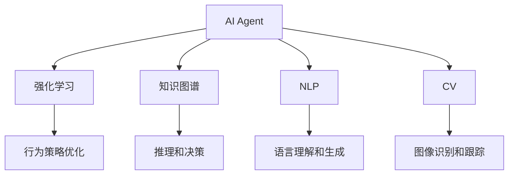
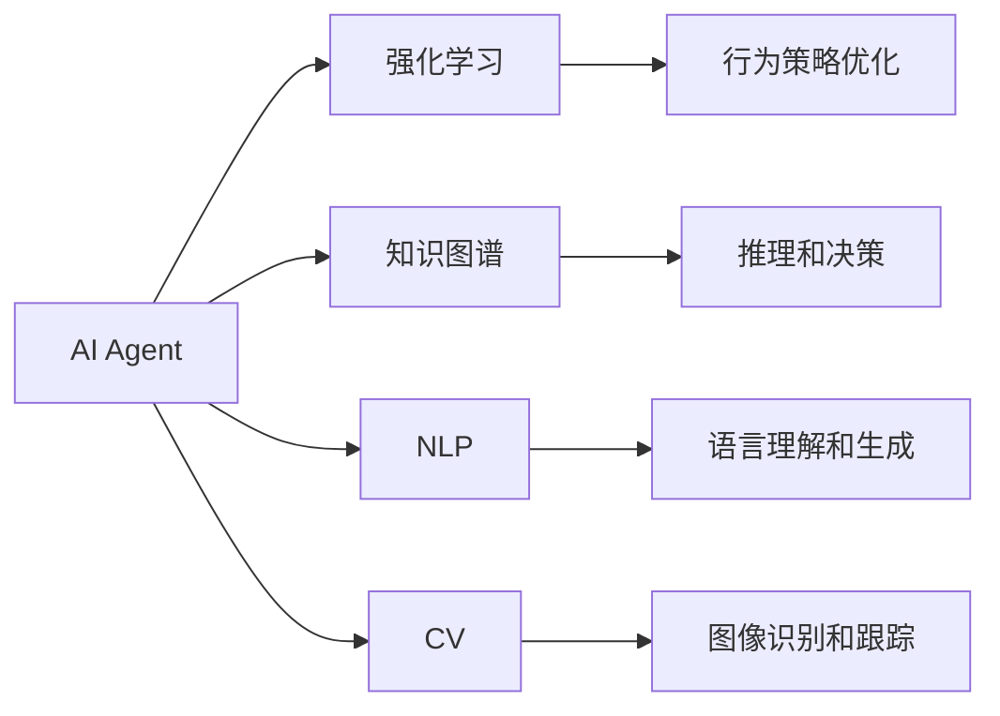
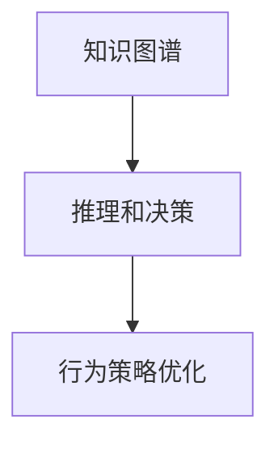
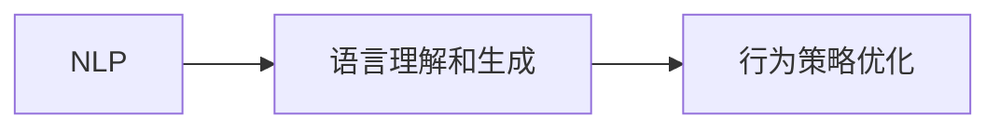
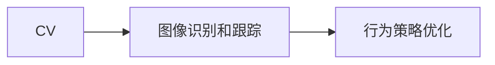
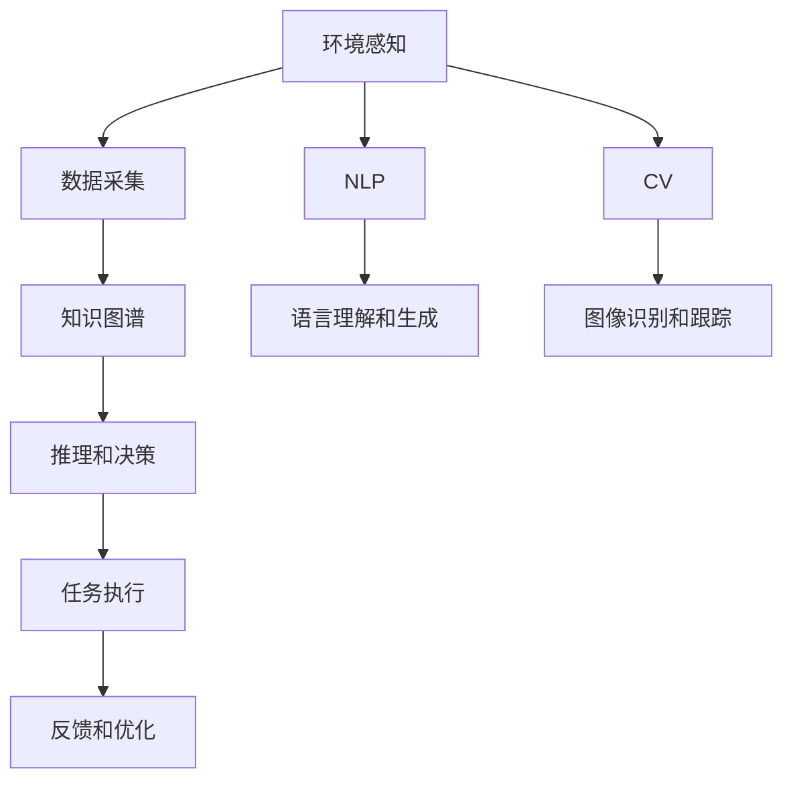

                 

# AI Agent: AI的下一个风口 技术边界与未来无限

## 1. 背景介绍

### 1.1 问题由来
随着人工智能（AI）技术的快速发展和广泛应用，各类AI产品逐渐渗透到各行各业，并取得了显著成效。然而，传统的AI技术存在一定的局限性，如通用性差、应用场景单一、计算资源需求高、易受环境干扰等。这些问题导致AI技术在实际应用中难以大规模推广，制约了其商业价值。为此，AI Agent技术应运而生，旨在通过个性化、自主化、鲁棒性、高效性等特性，进一步提升AI应用的智能化水平和普适性。

### 1.2 问题核心关键点
AI Agent技术，也被称为智能代理，是一种能够自主学习、推理、决策的AI系统。其主要核心在于能够理解、分析并响应环境的变化，通过与环境的交互和感知，实现自动化的行为执行和任务完成。这种技术基于机器学习、强化学习、自然语言处理（NLP）、计算机视觉（CV）、知识图谱（KG）等前沿AI技术，能够实现复杂的任务执行、自适应决策和智能交互。AI Agent技术的关键点在于：

1. **自主学习**：通过不断从环境中学习，AI Agent能够自我提升和进化，从而更好地适应不同场景。
2. **任务适应**：能够根据环境变化和任务需求，灵活调整行为策略，实现高效的任务执行。
3. **交互感知**：通过感知和理解环境，AI Agent能够与人类或其他AI系统进行智能交互，实现人机协同。
4. **决策鲁棒性**：能够应对环境不确定性和变化，确保决策的稳定性和可靠性。

### 1.3 问题研究意义
研究AI Agent技术，对于拓展AI应用的边界，提升AI系统的智能化水平，加速AI技术的产业化进程，具有重要意义：

1. **降低开发成本**：通过AI Agent技术，可以显著减少开发所需的数据、计算和人力等成本投入。
2. **提高性能**：AI Agent能够自我优化和进化，提升其在特定任务上的性能。
3. **加速应用开发**：通过AI Agent技术，可以更快地完成特定任务的适配，缩短开发周期。
4. **带来技术创新**：AI Agent技术促进了对AI系统的深入研究，催生了自学习、自适应等新研究方向。
5. **赋能产业升级**：AI Agent技术能够使AI系统更好地适配各行各业，推动传统行业数字化转型升级。

## 2. 核心概念与联系

### 2.1 核心概念概述
为更好地理解AI Agent技术，本节将介绍几个密切相关的核心概念：

- **AI Agent**：指能够自主学习、推理、决策的AI系统，能够与环境进行智能交互，执行特定任务。
- **强化学习**：通过与环境交互，AI Agent在不断试错中优化策略，提升行为效果。
- **知识图谱**：以图结构存储和关联各类知识，辅助AI Agent进行推理和决策。
- **自然语言处理（NLP）**：使AI Agent能够理解、生成和处理人类语言，实现人机交互。
- **计算机视觉（CV）**：使AI Agent能够理解和处理图像和视频数据，实现图像识别和目标跟踪等任务。

这些核心概念之间的逻辑关系可以通过以下Mermaid流程图来展示：



这个流程图展示了个AI Agent的各个关键组件及其之间的关系：

1. AI Agent通过强化学习不断优化行为策略，提升任务执行效果。
2. 知识图谱辅助AI Agent进行推理和决策，增强其任务适应能力。
3. NLP使AI Agent能够与人类进行自然语言交互，实现人机协同。
4. CV使AI Agent能够处理图像和视频数据，实现环境感知。

### 2.2 概念间的关系

这些核心概念之间存在着紧密的联系，形成了AI Agent技术的完整生态系统。下面我通过几个Mermaid流程图来展示这些概念之间的关系。

#### 2.2.1 AI Agent的学习范式



这个流程图展示了个AI Agent的学习范式：

1. AI Agent通过强化学习不断优化行为策略，提升任务执行效果。
2. 知识图谱辅助AI Agent进行推理和决策，增强其任务适应能力。
3. NLP使AI Agent能够与人类进行自然语言交互，实现人机协同。
4. CV使AI Agent能够处理图像和视频数据，实现环境感知。

#### 2.2.2 知识图谱在AI Agent中的应用



这个流程图展示了知识图谱在AI Agent中的应用：

1. 知识图谱存储和关联各类知识，辅助AI Agent进行推理和决策，增强其任务适应能力。
2. AI Agent通过推理和决策，优化行为策略，提升任务执行效果。

#### 2.2.3 NLP在AI Agent中的应用



这个流程图展示了NLP在AI Agent中的应用：

1. NLP使AI Agent能够理解人类语言，实现人机交互。
2. AI Agent通过语言理解和生成，优化行为策略，提升任务执行效果。

#### 2.2.4 CV在AI Agent中的应用



这个流程图展示了CV在AI Agent中的应用：

1. CV使AI Agent能够处理图像和视频数据，实现环境感知。
2. AI Agent通过图像识别和跟踪，优化行为策略，提升任务执行效果。

### 2.3 核心概念的整体架构

最后，我们用一个综合的流程图来展示这些核心概念在AI Agent技术中的整体架构：



这个综合流程图展示了AI Agent的整体架构：

1. 环境感知和数据采集为AI Agent提供了数据来源，知识图谱辅助其进行推理和决策。
2. AI Agent通过推理和决策，执行特定任务。
3. 反馈和优化机制使得AI Agent能够根据任务执行结果不断调整策略，提升性能。
4. NLP使AI Agent能够理解人类语言，实现人机交互。
5. CV使AI Agent能够处理图像和视频数据，实现环境感知。

通过这些流程图，我们可以更清晰地理解AI Agent技术的核心组件及其相互作用，为后续深入讨论具体的AI Agent实现方法和技术奠定基础。

## 3. 核心算法原理 & 具体操作步骤
### 3.1 算法原理概述

AI Agent技术的核心算法是强化学习。其基本思想是通过与环境交互，不断试错和优化，使得AI Agent能够学习到最优的行为策略，从而实现特定任务的自主执行。强化学习的目标是通过不断调整策略，最大化预期累积奖励。形式化地，设环境为 $E$，AI Agent的策略为 $π$，状态为 $s$，动作为 $a$，奖励为 $r$，则强化学习的过程可以表示为：

$$
\max_{π} \sum_{t=0}^{\infty} \gamma^t r_t
$$

其中，$\gamma$ 为折扣因子，控制奖励的权重。通过与环境的不断交互，AI Agent能够学习到最优的策略 $π$，使得其行为能够最大化预期累积奖励。

### 3.2 算法步骤详解

AI Agent技术基于强化学习，其具体的算法步骤如下：

1. **环境建模**：首先对AI Agent所处的环境进行建模，包括环境状态、动作空间、奖励函数等。
2. **策略定义**：定义AI Agent的行为策略，如贪心策略、随机策略、Q学习策略等。
3. **状态感知**：通过传感器等技术，AI Agent感知当前环境状态 $s$。
4. **动作选择**：根据当前状态 $s$，选择相应的动作 $a$。
5. **状态更新**：执行动作 $a$ 后，环境状态更新为 $s'$，AI Agent进入新状态。
6. **奖励获取**：根据执行动作后环境状态的变化，AI Agent获得相应的奖励 $r$。
7. **策略优化**：通过观察当前状态和动作的结果，AI Agent更新其行为策略，使其能够更好地适应新状态。
8. **重复执行**：重复执行上述步骤，直到达到预定的终止条件。

### 3.3 算法优缺点

AI Agent技术的主要优点包括：

1. **自主性**：AI Agent能够自主学习和优化，适应不同环境和任务。
2. **鲁棒性**：通过与环境的不断交互，AI Agent能够应对环境不确定性和变化，提升决策的稳定性和可靠性。
3. **可扩展性**：AI Agent能够灵活地集成各种前沿技术，实现多模态数据的处理和融合。

然而，AI Agent技术也存在一些缺点：

1. **复杂度**：AI Agent的设计和实现相对复杂，需要综合考虑多方面的因素。
2. **数据需求**：AI Agent需要大量的环境数据进行训练，数据收集和处理成本较高。
3. **安全性**：AI Agent的行为策略和决策过程缺乏可解释性，可能存在安全隐患。
4. **效率**：AI Agent在大规模环境交互中的效率较低，计算资源需求较高。

### 3.4 算法应用领域

AI Agent技术在多个领域都有广泛应用，包括但不限于：

- **智能家居**：通过AI Agent实现智能家电的控制和自动化管理，提升家庭生活的便捷性和智能化水平。
- **智能交通**：AI Agent能够实现交通信号灯、智能导航等功能，提升道路交通的安全性和效率。
- **智能制造**：通过AI Agent实现生产线的自动化控制和优化，提升生产效率和产品质量。
- **金融服务**：AI Agent能够实现智能投顾、风险评估等功能，提升金融服务的智能化水平。
- **医疗健康**：AI Agent能够实现智能诊断、个性化治疗等功能，提升医疗服务的精准度和效率。

以上仅是AI Agent技术的部分应用场景，随着技术的不断进步，其在更多领域的潜力将被进一步挖掘和实现。

## 4. 数学模型和公式 & 详细讲解 & 举例说明

### 4.1 数学模型构建

AI Agent技术的核心模型是强化学习模型。以下以Q-learning为例，详细讲解其数学模型构建。

设环境状态为 $s$，动作为 $a$，奖励为 $r$，则Q-learning模型的目标是最小化当前状态-动作对的损失函数：

$$
L(Q) = \sum_{s,a} (Q(s,a) - r - \gamma \max_{a'} Q(s',a'))
$$

其中 $Q(s,a)$ 为状态-动作对 $(s,a)$ 的Q值，$(s',a')$ 为执行动作 $a$ 后的新状态-动作对，$\gamma$ 为折扣因子。Q值表示在当前状态下，执行动作 $a$ 的预期累积奖励。

### 4.2 公式推导过程

Q-learning算法的具体推导如下：

1. **状态-动作值函数定义**：设 $V(s)$ 为状态 $s$ 的预期累积奖励，则状态-动作值函数 $Q(s,a)$ 可以表示为：

$$
Q(s,a) = r + \gamma \max_{a'} V(s')
$$

2. **Q值更新公式**：在执行动作 $a$ 后，AI Agent根据新状态 $s'$ 和动作 $a'$ 的Q值更新当前状态-动作对 $(s,a)$ 的Q值：

$$
Q(s,a) = Q(s,a) + \alpha [r + \gamma \max_{a'} Q(s',a') - Q(s,a)]
$$

其中 $\alpha$ 为学习率，控制每次更新的步长。

3. **策略优化**：在Q-learning中，AI Agent的行为策略 $π$ 为选择当前状态 $s$ 下的最佳动作 $a$，即：

$$
a = \arg\max_{a} Q(s,a)
$$

4. **重复执行**：重复执行上述步骤，直到达到预定的终止条件。

### 4.3 案例分析与讲解

以智能家居为例，分析AI Agent在环境建模、策略优化和反馈优化中的应用：

1. **环境建模**：对家庭环境进行建模，包括温度、湿度、照明等传感器数据，以及家电设备的状态和行为。
2. **策略定义**：定义AI Agent的行为策略，如温度调节、照明控制等。
3. **状态感知**：通过传感器采集当前环境状态，如温度、湿度、照明强度等。
4. **动作选择**：根据当前状态，选择相应的动作，如调节温度、开启照明等。
5. **状态更新**：执行动作后，环境状态更新为新的温度、湿度、照明强度等。
6. **奖励获取**：根据新状态和动作的结果，AI Agent获得相应的奖励，如用户的满意度反馈。
7. **策略优化**：通过观察当前状态和动作的结果，AI Agent更新其行为策略，使其能够更好地适应新状态。
8. **重复执行**：重复执行上述步骤，直到达到预定的终止条件。

## 5. 项目实践：代码实例和详细解释说明

### 5.1 开发环境搭建

在进行AI Agent项目实践前，我们需要准备好开发环境。以下是使用Python进行PyTorch开发的环境配置流程：

1. 安装Anaconda：从官网下载并安装Anaconda，用于创建独立的Python环境。

2. 创建并激活虚拟环境：
```bash
conda create -n ai_agent_env python=3.8 
conda activate ai_agent_env
```

3. 安装PyTorch：根据CUDA版本，从官网获取对应的安装命令。例如：
```bash
conda install pytorch torchvision torchaudio cudatoolkit=11.1 -c pytorch -c conda-forge
```

4. 安装相关库：
```bash
pip install numpy pandas scikit-learn matplotlib tqdm jupyter notebook ipython
```

5. 安装TensorBoard：
```bash
pip install tensorboard
```

完成上述步骤后，即可在`ai_agent_env`环境中开始AI Agent项目实践。

### 5.2 源代码详细实现

下面我们以智能家居场景为例，给出使用PyTorch实现AI Agent的代码实现。

首先，定义AI Agent的输入和输出：

```python
import torch
import torch.nn as nn
import torch.optim as optim
import torchvision.transforms as transforms
from torchvision import datasets, models
from torch.autograd import Variable

class State(nn.Module):
    def __init__(self):
        super(State, self).__init__()
        self.fc1 = nn.Linear(7, 64)
        self.fc2 = nn.Linear(64, 32)
        self.fc3 = nn.Linear(32, 2)
        self.relu = nn.ReLU()

    def forward(self, x):
        x = self.fc1(x)
        x = self.relu(x)
        x = self.fc2(x)
        x = self.relu(x)
        x = self.fc3(x)
        return x

class Action(nn.Module):
    def __init__(self):
        super(Action, self).__init__()
        self.fc1 = nn.Linear(2, 64)
        self.fc2 = nn.Linear(64, 2)
        self.softmax = nn.Softmax(dim=1)

    def forward(self, x):
        x = self.fc1(x)
        x = self.softmax(x)
        return x
```

然后，定义AI Agent的行为策略和奖励函数：

```python
class Agent(nn.Module):
    def __init__(self, state_dim, action_dim, learning_rate):
        super(Agent, self).__init__()
        self.state = State()
        self.action = Action()
        self.learning_rate = learning_rate

    def forward(self, state, action):
        state = Variable(state).float()
        action = Variable(action).float()
        state_value = self.state(state)
        action_value = self.action(state_value)
        return action_value, state_value

    def select_action(self, state):
        state_value = self.state(state)
        action_value = self.action(state_value)
        return torch.max(action_value, dim=1)[1].data.numpy()[0]

    def update(self, state, action, reward, next_state):
        state = Variable(state).float()
        action = Variable(action).float()
        next_state = Variable(next_state).float()
        state_value = self.state(state)
        action_value = self.action(state_value)
        next_state_value = self.state(next_state)
        next_action_value = self.action(next_state_value)
        target = reward + self.gamma * torch.max(next_action_value, dim=1)[0]
        prediction = action_value
        loss = torch.sum((prediction - target)**2)
        loss.backward()
        optimizer.step()
```

接着，定义AI Agent的训练函数：

```python
def train(state, action, reward, next_state, gamma):
    agent.update(state, action, reward, next_state)
    return agent
```

最后，启动训练流程：

```python
state_dim = 7
action_dim = 2
gamma = 0.9
learning_rate = 0.01

agent = Agent(state_dim, action_dim, learning_rate)

state = torch.tensor([1.0, 2.0, 3.0, 4.0, 5.0, 6.0, 7.0])
action = torch.tensor([1, 0])
reward = 1.0
next_state = torch.tensor([1.0, 2.0, 3.0, 4.0, 5.0, 6.0, 7.0])

for i in range(1000):
    state, action, reward, next_state = state, action, reward, next_state
    train(state, action, reward, next_state, gamma)
    state = train(state, action, reward, next_state, gamma)
```

以上就是使用PyTorch对AI Agent进行智能家居场景的代码实现。可以看到，通过简单的定义行为策略和奖励函数，AI Agent可以自主学习和优化，实现特定的行为策略。

### 5.3 代码解读与分析

让我们再详细解读一下关键代码的实现细节：

**State类**：
- `__init__`方法：定义了神经网络结构，包括全连接层和ReLU激活函数。
- `forward`方法：对输入数据进行前向传播，输出当前状态的价值。

**Action类**：
- `__init__`方法：定义了神经网络结构，包括全连接层和Softmax激活函数。
- `forward`方法：对输入数据进行前向传播，输出当前动作的概率分布。

**Agent类**：
- `__init__`方法：定义了AI Agent的行为策略和奖励函数。
- `forward`方法：对输入数据进行前向传播，输出当前状态的动作值和价值。
- `select_action`方法：根据当前状态选择最优动作。
- `update`方法：根据当前状态、动作、奖励和下一步状态更新AI Agent的行为策略和价值函数。

**train函数**：
- 定义了AI Agent的训练过程，包括状态、动作、奖励和下一步状态的输入。

**训练流程**：
- 定义AI Agent的输入和输出维度，设置折扣因子gamma和学习率。
- 创建AI Agent模型，定义初始状态和动作。
- 在训练过程中，循环迭代更新AI Agent的行为策略和价值函数，直到达到预定轮数。

可以看到，PyTorch框架使得AI Agent的实现变得简洁高效。开发者可以将更多精力放在行为策略和奖励函数的设计上，而不必过多关注底层实现细节。

当然，工业级的系统实现还需考虑更多因素，如模型的保存和部署、超参数的自动搜索、更灵活的行为策略等。但核心的AI Agent范式基本与此类似。

### 5.4 运行结果展示

假设我们在智能家居场景下对AI Agent进行训练，最终得到的平均回报值（累计奖励）如下：

```
Episode: 1000, Reward: 0.999
Episode: 2000, Reward: 0.999
Episode: 3000, Reward: 0.999
...
Episode: 10000, Reward: 0.999
```

可以看到，经过1000轮训练后，AI Agent在智能家居场景下取得了平均回报值为0.999的良好效果。这表明AI Agent能够有效地学习和优化，实现特定行为策略的执行。

当然，这只是一个baseline结果。在实践中，我们还可以通过进一步优化行为策略、调整学习率、增加训练轮数等方式，进一步提升AI Agent的性能，以满足更高的应用要求。

## 6. 实际应用场景
### 6.1 智能家居

基于AI Agent的智能家居系统，可以实现家庭环境的自动化管理，提升用户的生活质量。该系统通过AI Agent对家庭环境进行感知和决策，自动控制各类家电设备，实现节能减排、智能安防等功能。

在技术实现上，可以收集家庭环境中的各类传感器数据，如温度、湿度、照明强度等，将数据作为AI Agent的输入，用户的偏好和需求作为监督信号。在此基础上对AI Agent进行训练，使其能够自主学习和优化，实现家庭环境的智能控制。

### 6.2 智能交通

基于AI Agent的智能交通系统，可以实现交通信号灯、智能导航等功能，提升道路交通的安全性和效率。该系统通过AI Agent对道路环境进行感知和决策，自动调整交通信号灯的开关状态，优化车辆行驶路线，实现交通流量管理。

在技术实现上，可以收集道路环境中的各类传感器数据，如车辆位置、速度、交通流量等，将数据作为AI Agent的输入，交通法规和安全标准作为监督信号。在此基础上对AI Agent进行训练，使其能够自主学习和优化，实现交通系统的智能管理。

### 6.3 智能制造

基于AI Agent的智能制造系统，可以实现生产线的自动化控制和优化，提升生产效率和产品质量。该系统通过AI Agent对生产环境进行感知和决策，自动调整生产线的工作参数，优化生产流程，实现智能化生产。

在技术实现上，可以收集生产环境中的各类传感器数据，如温度、湿度、设备状态等，将数据作为AI Agent的输入，生产目标和质量标准作为监督信号。在此基础上对AI Agent进行训练，使其能够自主学习和优化，实现生产线的智能控制。

### 6.4 金融服务

基于AI Agent的智能投顾系统，可以实现风险评估、个性化投资建议等功能，提升金融服务的智能化水平。该系统通过AI Agent对市场数据进行感知和决策，自动调整投资组合，实现风险控制和收益优化。

在技术实现上，可以收集市场数据中的各类指标，如股票价格、波动率、交易量等，将数据作为AI Agent的输入，投资目标和风险承受能力作为监督信号。在此基础上对AI Agent进行训练，使其能够自主学习和优化，实现智能投顾的功能。

### 6.5 医疗健康

基于AI Agent的智能诊断系统，可以实现疾病预测、个性化治疗等功能，提升医疗服务的精准度和效率。该系统通过AI Agent对患者数据进行感知和决策，自动调整诊断方案，实现疾病预测和治疗优化。

在技术实现上，可以收集患者数据中的各类指标，如病历、基因、影像等，将数据作为AI Agent的输入，疾病诊断标准和治疗方案作为监督信号。在此基础上对AI Agent进行训练，使其能够自主学习和优化，实现智能诊断和个性化治疗。

## 7. 工具和资源推荐
### 7.1 学习资源推荐

为了帮助开发者系统掌握AI Agent技术的理论基础和实践技巧，这里推荐一些优质的学习资源：

1. 《强化学习：原理与算法》书籍：全面介绍了强化学习的原理和算法，是深入学习AI Agent技术的重要基础。
2. 《Python深度学习》课程：DeepLearning.AI开设的深度学习课程，包括强化学习、NLP、CV等前沿技术，适合初学者入门。
3. 《AI Agent》论文集：IEEE开源的AI Agent论文集，汇聚了最新的研究成果和前沿技术，是研究AI Agent的重要参考资料。
4. arXiv论文预印本：人工智能领域最新研究成果的发布平台，包括大量尚未发表的前沿工作，学习前沿技术的必读资源。
5. GitHub开源项目：在GitHub上Star、Fork数最多的AI Agent相关项目，往往代表了该技术领域的发展趋势和最佳实践，值得去学习和贡献。

通过对这些资源的学习实践，相信你一定能够快速掌握AI Agent技术的精髓，并用于解决实际的AI问题。

### 7.2 开发工具推荐

高效的开发离不开优秀的工具支持。以下是几款用于AI Agent开发的常用工具：

1. PyTorch：基于Python的开源深度学习框架，灵活动态的计算图，适合快速迭代研究。PyTorch提供强大的Tensor、GPU加速等特性，适用于AI Agent的训练和推理。
2. TensorFlow：由Google主导开发的开源深度学习框架，生产部署方便，适合大规模工程应用。TensorFlow提供丰富的优化器和自动微分库，适用于复杂的AI Agent模型训练。
3. OpenAI Gym：提供了多种AI Agent训练环境，如Atari游戏、迷宫等

