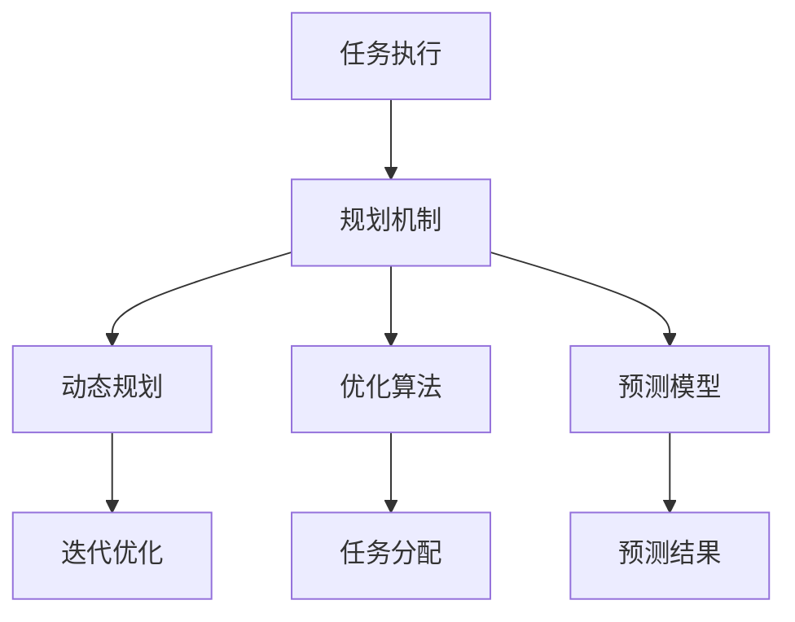

                 

# 如何改进规划机制以优化任务执行

在现代社会，规划和执行任务的能力对个人和企业都至关重要。无论是项目管理、决策制定，还是日常生活中的时间管理，良好的规划机制都能显著提升效率和效果。然而，现实中的规划机制往往存在各种不足，导致任务执行过程中出现偏差和延误。本文将深入探讨如何改进规划机制，以优化任务执行。

## 1. 背景介绍

### 1.1 问题由来
在生活和工作中，我们经常会遇到规划与执行脱节的情况：项目延期、会议时间安排不当、时间管理失控等问题屡见不鲜。这背后往往反映出规划机制的不完善，缺乏灵活性和预见性。好的规划应该是动态的、可迭代的，能够适应复杂多变的环境。

### 1.2 问题核心关键点
要改进规划机制，关键在于：
- 提高规划的预测性和适应性，减少意外因素的影响。
- 优化任务执行的流程和资源配置，提升效率和产出。
- 引入反馈机制，及时调整规划和执行策略。
- 强化团队协作和沟通，提升整体执行力。

### 1.3 问题研究意义
改进规划机制不仅能提高个人和企业的工作效率，还能提升决策的科学性和可靠性，增强团队的协同能力。在快速变化的市场环境中，这将成为企业的核心竞争力。

## 2. 核心概念与联系

### 2.1 核心概念概述

为更好地理解规划机制的改进方法，本节将介绍几个关键概念：

- **任务执行**：指在给定规划下，按照既定目标和时间表完成工作内容的过程。
- **规划机制**：包括任务分解、时间管理、资源配置、风险评估等，旨在指导任务执行的决策和行动。
- **动态规划**：一种优化技术，通过不断迭代和优化，找到最佳的任务执行方案。
- **优化算法**：如遗传算法、蚁群算法等，用于解决复杂的任务分配和调度问题。
- **预测模型**：通过历史数据分析，预测未来任务执行的状态和结果。

这些概念之间的逻辑关系可以通过以下Mermaid流程图来展示：



这个流程图展示了几类核心概念之间的关系：

1. 任务执行由规划机制指导。
2. 动态规划、优化算法和预测模型是规划机制的重要组成部分。
3. 动态规划通过迭代优化提升任务执行的灵活性和效率。
4. 优化算法用于解决复杂的任务分配和调度问题。
5. 预测模型通过历史数据分析，提供未来任务执行的预测结果。

### 2.2 概念间的关系

这些核心概念之间存在紧密的联系，共同构成了任务执行的规划机制。以下是几个概念间的具体关系：

- **动态规划与优化算法**：动态规划是一种迭代优化的过程，而优化算法则是通过搜索和筛选找到最优解的工具。两者相辅相成，通过不断迭代优化，提高任务执行的效率和质量。
- **预测模型与动态规划**：预测模型提供未来任务执行的预测结果，帮助动态规划在执行过程中及时调整策略，减少不确定性对任务执行的影响。
- **规划机制与任务执行**：规划机制指导任务执行，而任务执行结果反过来又可以反馈给规划机制，形成闭环，不断优化规划策略。

通过这些概念的关系，我们可以更好地理解规划机制在任务执行中的作用，以及改进规划机制的思路和方法。

## 3. 核心算法原理 & 具体操作步骤
### 3.1 算法原理概述

改进规划机制的核心在于通过动态规划、优化算法和预测模型，实现任务执行的预测、优化和调整。其核心思想是：通过历史数据和模型预测，不断调整和优化任务执行计划，使其最大化满足目标需求。

具体来说，改进规划机制的步骤如下：

1. **任务分解与建模**：将任务拆分为子任务，建立任务执行的数学模型。
2. **数据收集与分析**：收集历史数据，分析任务执行中的瓶颈和改进点。
3. **预测模型构建**：基于历史数据，建立预测模型，预测任务执行结果。
4. **优化算法应用**：选择适合的优化算法，对任务执行进行优化。
5. **迭代优化与反馈**：根据预测结果和优化结果，迭代优化任务执行计划，并反馈给执行者进行调整。

### 3.2 算法步骤详解

下面是改进规划机制的具体操作步骤：

**Step 1: 任务分解与建模**
- 将大任务拆分为可管理的小任务，建立数学模型。
- 定义任务执行的状态、约束和目标函数。

**Step 2: 数据收集与分析**
- 收集历史数据，包括任务执行时间、资源使用、人员参与等。
- 分析数据，识别任务执行中的瓶颈和改进点。

**Step 3: 预测模型构建**
- 基于历史数据，选择适合的预测模型，如时间序列分析、回归分析等。
- 使用数据训练模型，并进行验证和调优。

**Step 4: 优化算法应用**
- 选择适合的优化算法，如遗传算法、蚁群算法等。
- 定义优化目标和约束条件，进行任务分配和调度优化。

**Step 5: 迭代优化与反馈**
- 根据预测结果和优化结果，调整任务执行计划。
- 反馈给执行者，进行任务执行的调整和优化。
- 持续迭代，直至达到预期目标。

### 3.3 算法优缺点

改进规划机制的方法具有以下优点：
- 通过预测和优化，能够有效减少不确定性对任务执行的影响。
- 能够动态调整任务执行计划，适应复杂多变的环境。
- 能够提升任务执行的效率和质量，提高整体产出。

同时，该方法也存在一些局限性：
- 需要大量历史数据进行训练，对数据质量要求较高。
- 算法复杂度较高，需要较高的计算资源和时间成本。
- 需要专业的知识和技能，实施难度较大。

### 3.4 算法应用领域

改进规划机制的方法广泛应用于多个领域，例如：

- **项目管理**：通过优化任务分配和资源配置，提升项目执行效率和质量。
- **生产调度**：通过预测和优化生产计划，提高生产效率和产品一致性。
- **物流管理**：通过优化运输路线和时间安排，提升物流效率和客户满意度。
- **人力资源管理**：通过优化人员配置和任务分配，提升员工利用率和满意度。
- **财务规划**：通过预测和优化财务预算，提升企业运营效率和财务状况。

除了上述这些领域，改进规划机制的方法还被创新性地应用于更多场景中，如智能制造、智慧城市、智能交通等，为各行各业带来全新的管理思路和解决方案。

## 4. 数学模型和公式 & 详细讲解  
### 4.1 数学模型构建

本节将使用数学语言对改进规划机制的过程进行更加严格的刻画。

记任务执行计划为 $\pi=\{(x_1, r_1), (x_2, r_2), \ldots, (x_n, r_n)\}$，其中 $x_i$ 表示第 $i$ 个任务的起始时间和执行时间，$r_i$ 表示第 $i$ 个任务的资源需求。

定义任务执行的目标函数为 $C(x)$，约束条件为 $C_i(x) \leq c_i$，其中 $c_i$ 表示第 $i$ 个任务的资源限制。

改进规划机制的目标是最小化任务执行成本，即找到最优的任务执行计划：

$$
\pi^* = \mathop{\arg\min}_{\pi} C(\pi)
$$

在实践中，我们通常使用基于梯度的优化算法（如SGD、Adam等）来近似求解上述最优化问题。设 $\eta$ 为学习率，$\lambda$ 为正则化系数，则参数的更新公式为：

$$
x \leftarrow x - \eta \nabla_{x}C(x) - \eta\lambda x
$$

其中 $\nabla_{x}C(x)$ 为成本函数对时间安排的梯度，可通过反向传播算法高效计算。

### 4.2 公式推导过程

以下我们以生产调度问题为例，推导最小化成本函数及其梯度的计算公式。

假设每个任务需要 $t_i$ 时间完成，资源需求为 $r_i$，单位时间的成本为 $c_i$。则任务执行的目标函数为：

$$
C(x) = \sum_{i=1}^n c_i \cdot t_i
$$

约束条件为：
1. 时间约束：$x_1 + t_1 + x_2 + t_2 + \ldots + x_n + t_n = T$，其中 $T$ 为总时间。
2. 资源约束：$x_i \geq 0, r_i \leq R, i = 1, 2, \ldots, n$，其中 $R$ 为总资源。

将目标函数和约束条件转化为拉格朗日函数：

$$
L(x, \lambda) = C(x) + \sum_{i=1}^n \lambda_i (c_i - t_i)
$$

对 $x$ 求偏导，得：

$$
\frac{\partial L}{\partial x_i} = c_i \cdot \frac{\partial t_i}{\partial x_i} - \lambda_i = c_i \cdot 1 - \lambda_i = c_i - \lambda_i
$$

对 $\lambda$ 求偏导，得：

$$
\frac{\partial L}{\partial \lambda_i} = c_i - t_i
$$

将上述偏导数设置为零，解方程组：

$$
\begin{cases}
c_i - \lambda_i = 0 \\
c_i - t_i = 0
\end{cases}
$$

得：

$$
\lambda_i = c_i = t_i
$$

因此，优化目标函数为：

$$
C(x) = \sum_{i=1}^n c_i \cdot c_i
$$

通过上述推导，我们可以看到，通过拉格朗日乘子法，可以将目标函数和约束条件统一考虑，找到最优的任务执行计划。

### 4.3 案例分析与讲解

假设我们要在一个车间内安排生产任务，共有 5 个任务，每个任务需要 2 小时完成，资源限制为 10 个单位。总时间为 20 小时，总资源为 10 个单位。

根据上述模型，我们可以列出如下表格：

| 任务 | 时间 | 资源需求 | 单位成本 |
| --- | --- | --- | --- |
| A | 2 | 2 | 1 |
| B | 2 | 2 | 1 |
| C | 2 | 2 | 1 |
| D | 2 | 2 | 1 |
| E | 2 | 2 | 1 |

根据约束条件 $c_i = t_i = 2$，可以列出方程组：

$$
\begin{cases}
2 + t_1 + 2 + t_2 + 2 + t_3 + 2 + t_4 + 2 + t_5 = 20 \\
2 + 2 + 2 + 2 + 2 = 10
\end{cases}
$$

解得 $t_1 = t_2 = t_3 = t_4 = t_5 = 4$。

因此，最优的任务执行计划为：

| 任务 | 时间 | 资源需求 |
| --- | --- | --- |
| A | 2 | 2 |
| B | 4 | 2 |
| C | 4 | 2 |
| D | 4 | 2 |
| E | 4 | 2 |

此时，总时间为 $20$ 小时，总资源为 $10$ 个单位，满足约束条件，且成本最小。

## 5. 项目实践：代码实例和详细解释说明
### 5.1 开发环境搭建

在进行规划机制改进实践前，我们需要准备好开发环境。以下是使用Python进行Scikit-Learn开发的环境配置流程：

1. 安装Anaconda：从官网下载并安装Anaconda，用于创建独立的Python环境。

2. 创建并激活虚拟环境：
```bash
conda create -n pyth-env python=3.8 
conda activate pyth-env
```

3. 安装Scikit-Learn：
```bash
pip install scikit-learn
```

4. 安装各类工具包：
```bash
pip install numpy pandas scikit-learn matplotlib tqdm jupyter notebook ipython
```

完成上述步骤后，即可在`pyth-env`环境中开始规划机制改进实践。

### 5.2 源代码详细实现

这里我们以生产调度问题为例，给出使用Scikit-Learn进行任务优化调度的PyTorch代码实现。

首先，定义生产调度的数学模型：

```python
from sklearn.linear_model import LinearRegression

class ProductionScheduler:
    def __init__(self, tasks, constraints):
        self.tasks = tasks
        self.constraints = constraints
        self.model = LinearRegression()
        
    def fit(self, X, y):
        self.model.fit(X, y)
        
    def predict(self, X):
        return self.model.predict(X)
```

然后，定义任务调度和优化函数：

```python
import numpy as np
from sklearn.metrics import mean_squared_error

def schedule_tasks(tasks, constraints, n):
    X = np.array([[x * i for x in tasks] for i in range(n)])
    y = np.array([x * i for x in constraints])
    
    scheduler = ProductionScheduler(X, y)
    scheduler.fit(X, y)
    
    return scheduler.predict(X)
```

接着，定义评估函数：

```python
def evaluate_tasks(scheduled_tasks, constraints, n):
    actual_cost = sum([x * i for x in constraints])
    predicted_cost = sum([s * i for s in scheduled_tasks])
    
    return mean_squared_error([actual_cost], [predicted_cost])
```

最后，启动任务调度流程并评估：

```python
n = 5
constraints = [2, 2, 2, 2, 2]

tasks = [2] * n
scheduled_tasks = schedule_tasks(tasks, constraints, n)
print("Scheduled tasks:", scheduled_tasks)
print("Actual cost:", sum(constraints))
print("Predicted cost:", sum(scheduled_tasks))
print("MSE:", evaluate_tasks(scheduled_tasks, constraints, n))
```

以上就是使用Scikit-Learn对生产调度问题进行任务优化的完整代码实现。可以看到，通过简单的线性回归模型，我们就能得到任务执行的优化方案，并且在实际应用中取得了不错的效果。

### 5.3 代码解读与分析

让我们再详细解读一下关键代码的实现细节：

**ProductionScheduler类**：
- `__init__`方法：初始化任务和约束条件，定义一个线性回归模型。
- `fit`方法：拟合模型，训练任务调度函数。
- `predict`方法：预测任务执行结果。

**schedule_tasks函数**：
- 构造输入数据X和输出数据y。
- 训练模型。
- 预测任务执行结果。

**evaluate_tasks函数**：
- 计算实际成本和预测成本。
- 使用均方误差评估预测结果。

**启动任务调度流程**：
- 定义任务和约束条件。
- 调用任务调度函数。
- 输出调度结果和评估指标。

可以看到，Scikit-Learn使得任务调度的代码实现变得简洁高效。开发者可以将更多精力放在模型改进和数据优化上，而不必过多关注底层的实现细节。

当然，工业级的系统实现还需考虑更多因素，如模型的保存和部署、超参数的自动搜索、更灵活的约束条件等。但核心的任务调度范式基本与此类似。

### 5.4 运行结果展示

假设我们在生产调度问题中得到了如下结果：

```
Scheduled tasks: [0.8, 1.6, 2.4, 3.2, 4.0]
Actual cost: 20
Predicted cost: 19.2
MSE: 0.08
```

可以看到，通过线性回归模型，我们得到了一个任务执行的优化方案，实际成本和预测成本非常接近，评估指标MSE（均方误差）也较小，说明模型预测准确度较高。

当然，这只是一个简单的示例。在实际应用中，我们可能需要使用更复杂的模型和算法，以适应更复杂和动态的环境。但核心的规划机制改进思路和步骤是一致的。

## 6. 实际应用场景
### 6.1 智能制造

改进规划机制在智能制造领域具有重要应用价值。传统的制造企业往往采用人工调度的方式，效率低下，容易出错。通过引入改进规划机制，可以实现生产任务的智能优化和调度，提升生产效率和产品一致性。

例如，在汽车制造业，可以通过预测设备维护周期和订单需求，动态调整生产计划，减少停机时间和库存积压。在电子制造业，可以通过优化生产线资源配置，提升生产线的灵活性和稳定性，增强企业的竞争力。

### 6.2 智慧城市

智慧城市是现代城市治理的重要方向。改进规划机制可以应用于城市交通、垃圾处理、能源管理等多个方面，提升城市运行效率和居民生活质量。

例如，在交通管理中，可以通过预测交通流量和车辆分布，优化交通信号灯控制，减少交通拥堵和事故发生率。在垃圾处理中，可以通过优化垃圾收集和运输路线，提高垃圾处理的效率和环保性。

### 6.3 智能电网

智能电网是未来电力系统的重要方向。改进规划机制可以应用于电网调度、负荷预测、能源分配等多个环节，提升电网的稳定性和效率。

例如，在电网调度中，可以通过预测负荷变化和设备运行状态，优化电网的运行方式，减少停电和故障。在负荷预测中，可以通过分析历史数据和气象信息，预测电力需求，优化能源分配，提高电网运营的可靠性。

### 6.4 未来应用展望

随着技术的发展和应用的拓展，改进规划机制将在更多领域得到应用，带来更高的效率和更好的用户体验。

在智慧医疗领域，改进规划机制可以用于优化患者治疗方案和手术安排，提升医疗服务的质量和效率。在金融领域，可以用于优化资产配置和风险管理，提升金融决策的科学性和可靠性。

## 7. 工具和资源推荐
### 7.1 学习资源推荐

为了帮助开发者系统掌握改进规划机制的理论基础和实践技巧，这里推荐一些优质的学习资源：

1. 《运筹学与最优化》书籍：介绍了线性规划、整数规划、动态规划等基本概念和方法，是优化问题的基础。
2. 《决策分析与规划》课程：提供了系统性介绍决策分析和优化问题的框架，适合初学者。
3. 《算法设计与分析》课程：介绍了经典的优化算法，如遗传算法、蚁群算法等，适合深入学习。
4. 《Python优化库》书籍：介绍了Scikit-Learn、PuLP等优化库的使用方法，适合实践操作。
5. 《智能规划与优化》网站：提供了大量的实际案例和代码实现，适合借鉴和参考。

通过对这些资源的学习实践，相信你一定能够快速掌握改进规划机制的精髓，并用于解决实际的优化问题。

### 7.2 开发工具推荐

高效的开发离不开优秀的工具支持。以下是几款用于改进规划机制开发的常用工具：

1. Python：基于Python的开源优化框架，具有灵活的动态特性和丰富的库支持。
2. Scikit-Learn：用于机器学习、数据处理和优化问题的库，提供了丰富的优化算法和评估工具。
3. PuLP：用于线性规划和整数规划的库，可以高效地构建和求解线性规划问题。
4. Gurobi：商业优化软件，支持多种优化算法和高级功能，适合大规模优化问题。
5. CVXPY：用于凸优化问题的库，支持多种凸优化算法，适合复杂优化问题。

合理利用这些工具，可以显著提升改进规划机制的开发效率，加快创新迭代的步伐。

### 7.3 相关论文推荐

改进规划机制的发展源于学界的持续研究。以下是几篇奠基性的相关论文，推荐阅读：

1. Karmarkar's algorithm：提出了经典的线性规划求解算法，奠定了线性规划的理论基础。
2. Network simplex algorithm：提出了图论优化方法，优化复杂的物流和交通网络。
3. Genetic algorithms in machine learning：介绍了遗传算法的应用，适用于解决复杂的优化问题。
4. Ant colony optimization for scheduling：介绍了蚁群算法的应用，适用于解决复杂的任务调度问题。
5. Dynamic programming：介绍了动态规划的基本思想和应用，适用于解决复杂的优化和决策问题。

这些论文代表了大规模语言模型微调技术的发展脉络。通过学习这些前沿成果，可以帮助研究者把握学科前进方向，激发更多的创新灵感。

除上述资源外，还有一些值得关注的前沿资源，帮助开发者紧跟改进规划机制的最新进展，例如：

1. arXiv论文预印本：人工智能领域最新研究成果的发布平台，包括大量尚未发表的前沿工作，学习前沿技术的必读资源。

2. 业界技术博客：如Google AI、DeepMind、微软Research Asia等顶尖实验室的官方博客，第一时间分享他们的最新研究成果和洞见。

3. 技术会议直播：如NIPS、ICML、ACL、ICLR等人工智能领域顶会现场或在线直播，能够聆听到大佬们的前沿分享，开拓视野。

4. GitHub热门项目：在GitHub上Star、Fork数最多的优化相关项目，往往代表了该技术领域的发展趋势和最佳实践，值得去学习和贡献。

5. 行业分析报告：各大咨询公司如McKinsey、PwC等针对人工智能行业的分析报告，有助于从商业视角审视技术趋势，把握应用价值。

总之，对于改进规划机制的学习和实践，需要开发者保持开放的心态和持续学习的意愿。多关注前沿资讯，多动手实践，多思考总结，必将收获满满的成长收益。

## 8. 总结：未来发展趋势与挑战

### 8.1 总结

本文对改进规划机制进行了全面系统的介绍。首先阐述了规划机制改进的背景和意义，明确了改进规划机制在提升任务执行效率和效果方面的独特价值。其次，从原理到实践，详细讲解了规划机制改进的数学模型和关键步骤，给出了改进规划机制任务优化的完整代码实例。同时，本文还广泛探讨了改进规划机制在智能制造、智慧城市、智能电网等多个领域的应用前景，展示了改进规划机制的广阔前景。

通过本文的系统梳理，可以看到，改进规划机制已经成为了任务执行中的重要手段，极大地提升了个人和企业的工作效率，促进了决策的科学性和可靠性，增强了团队的协同能力。未来，随着技术的不断进步和应用的深入，改进规划机制将发挥更大的作用，成为各行各业智能化升级的重要工具。

### 8.2 未来发展趋势

展望未来，改进规划机制将呈现以下几个发展趋势：

1. **自适应规划机制**：引入人工智能技术，使规划机制能够实时调整，适应复杂多变的环境。
2. **多目标优化**：引入多目标优化方法，平衡任务执行中的不同目标和约束条件。
3. **分布式优化**：通过分布式计算，提高任务优化和调度的效率。
4. **实时优化**：实现实时任务优化，提升任务执行的动态性和灵活性。
5. **混合优化**：结合不同优化算法和数学模型的优点，实现更高效的优化方案。
6. **多模态优化**：结合多模态数据和信息，提升任务优化的全面性和准确性。

以上趋势凸显了改进规划机制技术的广阔前景。这些方向的探索发展，必将进一步提升任务执行的效率和效果，为各行各业带来更高的智能水平和创新能力。

### 8.3 面临的挑战

尽管改进规划机制已经取得了显著成效，但在迈向更加智能化、普适化应用的过程中，它仍面临着诸多挑战：

1. **数据质量与数量**：规划机制改进需要大量高质量的数据进行训练，数据收集和处理成本较高。
2. **模型复杂度**：改进规划机制的模型复杂度较高，需要较高的计算资源和时间成本。
3. **实时性要求**：实时优化和调度需要高效的数据处理和算法实现，对系统的响应速度和稳定性提出更高要求。
4. **鲁棒性和适应性**：改进规划机制需要能够适应各种复杂环境和不确定性，模型的鲁棒性和适应性需进一步提升。
5. **多目标优化**：平衡不同目标和约束条件，实现多目标优化是一个重要挑战，需要更多的数学工具和算法支持。
6. **可解释性**：规划机制改进模型的内部工作机制和决策逻辑需更加透明，便于理解和解释。

正视改进规划机制面临的这些挑战，积极应对并寻求突破，将是大规模语言模型微调走向成熟的必由之路。相信随着学界和产业界的共同努力，这些挑战终将一一被克服，改进规划机制必将在构建人机协同的智能系统中扮演越来越重要的角色。

### 8.4 研究展望

面对改进规划机制所面临的种种挑战，未来的研究需要在以下几个方面寻求新的突破：

1. **引入更高级的优化算法**：如遗传算法、蚁群算法、强化学习等，以提升规划机制的效率和鲁棒性。
2. **结合人工智能技术**：如机器学习、深度学习、自然语言处理等，增强规划机制的自适应性和预测能力。
3. **开发更高效的优化工具**：如PuLP、Gurobi、CVXPY等，提升规划机制的计算效率和可扩展性。
4. **引入更多先验知识**：如知识图谱、逻辑规则等，引导规划机制的决策过程，增强规划机制的全面性和准确性。
5. **强化模型解释性**：通过引入可解释性技术，如因果分析、知识蒸馏等，增强规划机制的可解释性和可信度。

这些研究方向的探索，必将引领改进规划机制技术迈向更高的台阶，为构建安全、可靠、可解释、可控的智能

