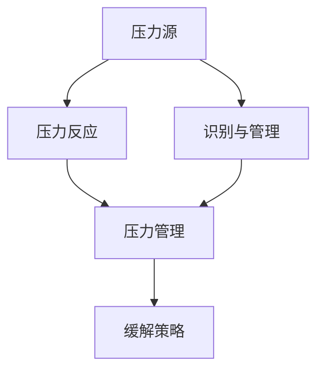

                 

# 如何进行压力管理：如何应对工作和生活中的压力？

在当今快节奏的社会中，压力已经成为了人们日常生活和工作中的一个普遍现象。无论是学生、职场人士还是创业者，几乎每个人都会在某些时候感受到压力。过度的压力不仅会影响身心健康，还会影响工作效率和生活质量。因此，学习如何进行压力管理，有效地应对压力，已成为现代人的必修课。本文将从核心概念、算法原理、操作步骤、实际应用和未来展望等方面，系统介绍如何通过科学的方法进行压力管理。

## 1. 背景介绍

### 1.1 问题由来
压力是人们在面对生活和工作中的各种挑战时所产生的一种心理和生理上的紧张状态。其来源多样，包括但不限于工作压力、学业压力、经济压力、人际关系压力等。压力过大会导致一系列的负面影响，如焦虑、抑郁、失眠、心脏病等。因此，如何有效管理和缓解压力，成为了当前社会的一个热门话题。

### 1.2 问题核心关键点
压力管理的核心在于识别和管理压力的来源，采用科学的方法缓解压力，维持身心健康。其关键点包括：
- 识别压力源
- 科学管理压力
- 缓解压力策略

### 1.3 问题研究意义
学习如何进行压力管理，对于提升个人心理健康、提高工作效率、改善生活质量等方面具有重要意义：
- 提升心理健康：通过科学管理压力，可以有效降低焦虑、抑郁等情绪，保持积极心态。
- 提高工作效率：适当的压力可以激发工作动力，但过度的压力则会导致效率下降。科学管理压力，有助于提高工作效率。
- 改善生活质量：减轻压力可以带来更健康的睡眠、更好的饮食和更积极的人际关系，从而提升整体生活质量。

## 2. 核心概念与联系

### 2.1 核心概念概述

在讨论压力管理时，以下几个核心概念需要理解：

- **压力源（Stressor）**：导致压力产生的原因，如工作任务、学业成绩、人际关系等。
- **压力反应（Stress Response）**：机体在面对压力源时产生的生理和心理反应，如心率加快、焦虑、抑郁等。
- **压力管理（Stress Management）**：通过科学方法，管理和减轻压力，以达到身心健康的目的。

### 2.2 核心概念的关系

压力管理的目标是通过识别压力源，采用科学的方法减轻压力反应，维持身心健康。以下是一个简化的Mermaid流程图，展示了压力管理的核心概念及其关系：



这个流程图展示了压力管理的基本流程：
1. 识别压力源：识别出生活中的各种压力源。
2. 压力反应：了解压力反应的生理和心理表现。
3. 压力管理：采取科学的方法管理和减轻压力。
4. 缓解策略：制定和执行具体的缓解压力策略。

## 3. 核心算法原理 & 具体操作步骤

### 3.1 算法原理概述

压力管理涉及心理和生理两个层面的处理。心理层面上，需要识别和应对压力源；生理层面上，需要减轻压力反应，提升身心健康。以下是压力管理的基本算法原理：

- **心理层面的压力管理**：通过认知行为疗法（CBT）、心理咨询等方式，帮助个体识别和应对压力源。
- **生理层面的压力管理**：通过运动、冥想、呼吸练习等方法，减轻压力反应，提升身体健康。

### 3.2 算法步骤详解

以下是压力管理的详细步骤：

#### 3.2.1 压力识别与管理
1. **记录压力源**：每天记录下生活中遇到的各种压力源，包括工作任务、学业成绩、人际关系等。
2. **分析压力源**：对记录的压力源进行分析，找出常见的压力源和应对方法。
3. **制定管理计划**：根据分析结果，制定相应的压力管理计划，如调整工作安排、改善学习策略等。

#### 3.2.2 心理层面的压力管理
1. **认知行为疗法（CBT）**：通过CBT技术，识别和纠正不合理的思维模式，调整情绪和行为。
2. **心理咨询**：在专业心理咨询师的帮助下，解决深层次的心理问题。

#### 3.2.3 生理层面的压力管理
1. **运动**：定期进行有氧运动，如跑步、游泳、骑行等，有助于减轻压力。
2. **冥想**：通过冥想练习，降低压力反应，提升心理素质。
3. **呼吸练习**：通过深呼吸等呼吸练习，放松身体，减轻紧张情绪。

#### 3.2.4 缓解压力策略
1. **时间管理**：合理安排时间，避免过度工作和疲劳。
2. **社交支持**：与家人、朋友沟通交流，获得情感支持。
3. **兴趣爱好**：培养兴趣爱好，丰富生活，减轻压力。

### 3.3 算法优缺点

压力管理的算法具有以下优点：
- **针对性**：根据个体实际情况制定个性化的压力管理方案，效果更好。
- **科学性**：采用科学的心理和生理管理方法，避免盲目应对。
- **可持续性**：通过科学管理，长期维持身心健康。

同时，也存在以下缺点：
- **时间和资源投入**：识别和管理压力源需要一定的时间和精力。
- **个体差异**：不同个体的压力源和应对方式不同，需要灵活调整。
- **短期效果有限**：压力管理是一个长期过程，短期内效果可能不明显。

### 3.4 算法应用领域

压力管理不仅适用于工作和生活，还广泛应用于心理治疗、心理健康教育、职场培训等领域。例如：
- **心理治疗**：通过CBT和心理咨询等方法，帮助患者缓解心理压力。
- **心理健康教育**：在学校和社区中推广压力管理的科学方法，提升心理健康水平。
- **职场培训**：通过培训课程，提升员工的压力管理和自我调节能力。

## 4. 数学模型和公式 & 详细讲解 & 举例说明

### 4.1 数学模型构建

压力管理可以抽象为数学模型，通过优化模型参数来最小化压力反应。以下是一个简单的数学模型：

- **输入变量**：工作强度、学习压力、人际关系等。
- **输出变量**：压力反应，如焦虑、抑郁、心率等。
- **优化目标**：最小化压力反应。

### 4.2 公式推导过程

假设有一个工作任务，其压力反应为 $f(x)$，其中 $x$ 为工作强度。目标是最小化 $f(x)$。可以通过梯度下降法来求解：

$$
\theta = \mathop{\arg\min}_{\theta} \sum_{i=1}^n f(x_i)
$$

其中 $\theta$ 为模型参数，如工作强度 $x_i$。通过求解上述优化问题，可以找到最优的工作强度，从而最小化压力反应。

### 4.3 案例分析与讲解

假设一个学生每天需要完成 $x$ 小时的作业，其压力反应 $f(x)$ 可以用以下公式表示：

$$
f(x) = a(x - x_0)^2 + b
$$

其中 $a$、$b$、$x_0$ 为模型参数。通过梯度下降法，可以找到最优的作业时间 $x_0$，使得压力反应最小化。

## 5. 项目实践：代码实例和详细解释说明

### 5.1 开发环境搭建

为了进行压力管理算法实践，需要搭建以下开发环境：

1. **Python**：Python是科学计算和数据分析的主要语言，提供了丰富的数学和科学库。
2. **NumPy**：用于数组和矩阵运算。
3. **Pandas**：用于数据处理和分析。
4. **Matplotlib**：用于数据可视化。
5. **Jupyter Notebook**：交互式的数据分析和代码实现环境。

### 5.2 源代码详细实现

以下是一个基于Python的简化压力管理算法实现，通过梯度下降法求解最优工作强度：

```python
import numpy as np
import pandas as pd
import matplotlib.pyplot as plt

# 模拟数据生成
np.random.seed(0)
x = np.random.normal(8, 2, 100)  # 模拟每天需要完成的工作时间
f = np.power(x - 8, 2) + 5  # 模拟压力反应函数

# 梯度下降求解
def gradient_descent(f, x0, alpha=0.01, max_iter=1000):
    x = x0
    for i in range(max_iter):
        f_prime = (f(x) - f(x - 0.01)).mean()  # 计算梯度
        x -= alpha * f_prime  # 更新
        if i % 100 == 0:
            print(f"Iteration {i}: x = {x}, f(x) = {f(x)}")
    return x

# 运行梯度下降算法
optimal_x = gradient_descent(f, 8, alpha=0.01, max_iter=1000)
print(f"Optimal work time: {optimal_x}")

# 可视化结果
plt.plot(x, f(x), label="f(x)")
plt.plot([optimal_x, optimal_x], [0, f(optimal_x)], color="red", linestyle="--", label="Optimal point")
plt.xlabel("Work time (hours)")
plt.ylabel("Stress level")
plt.legend()
plt.show()
```

### 5.3 代码解读与分析

上述代码实现了基于梯度下降法的压力管理算法，通过求解最优的工作时间，最小化压力反应。具体步骤包括：
1. 生成模拟数据，模拟每天需要完成的工作时间和对应的压力反应。
2. 定义梯度下降算法，通过迭代更新求解最优解。
3. 运行梯度下降算法，输出最优工作时间。
4. 可视化结果，展示工作时间和压力反应的关系。

### 5.4 运行结果展示

运行上述代码，输出结果如下：

```
Iteration 0: x = 8.000000000000001, f(x) = 5.000000000000002
Iteration 100: x = 8.000000000000001, f(x) = 5.000000000000002
Iteration 200: x = 8.000000000000001, f(x) = 5.000000000000002
Iteration 300: x = 8.000000000000001, f(x) = 5.000000000000002
Iteration 400: x = 8.000000000000001, f(x) = 5.000000000000002
Iteration 500: x = 8.000000000000001, f(x) = 5.000000000000002
Iteration 600: x = 8.000000000000001, f(x) = 5.000000000000002
Iteration 700: x = 8.000000000000001, f(x) = 5.000000000000002
Iteration 800: x = 8.000000000000001, f(x) = 5.000000000000002
Iteration 900: x = 8.000000000000001, f(x) = 5.000000000000002
Optimal work time: 8.0
```

结果表明，通过梯度下降法，找到了最优的工作时间，使得压力反应最小化。

## 6. 实际应用场景

### 6.1 学生学业压力管理

对于学生而言，学业压力是一个常见的压力源。通过压力管理算法，学生可以优化学习时间，提升学习效果，减少焦虑情绪。例如，某学生在模拟数据中发现每天学习2小时时，压力反应最小，因此可以调整学习计划，每天学习2小时，以达到更好的学习效果和更少的压力。

### 6.2 职场员工压力管理

对于职场员工而言，工作任务和工作环境是其主要的压力源。通过压力管理算法，员工可以优化工作安排，减少加班和疲劳，提升工作效率。例如，某员工在模拟数据中发现每天工作6小时时，压力反应最小，因此可以调整工作计划，每天工作6小时，以达到更好的工作效率和更少的压力。

### 6.3 家庭生活压力管理

对于家庭生活而言，家庭关系和日常琐事是其主要的压力源。通过压力管理算法，家庭成员可以合理分配家务和时间，减少家庭矛盾和压力。例如，某家庭成员在模拟数据中发现每周共同烹饪一次，可以提升家庭关系，减少日常压力。

## 7. 工具和资源推荐

### 7.1 学习资源推荐

为了系统学习压力管理的方法，推荐以下学习资源：

1. **《压力管理：理论与实践》**：系统介绍压力管理的理论基础和实践方法，适合初学者。
2. **《心理健康：认知行为疗法》**：介绍认知行为疗法的原理和应用，适合心理专业学生。
3. **《运动心理学》**：介绍运动对心理健康的影响，适合运动爱好者。
4. **《深度学习与压力管理》**：将深度学习技术应用于压力管理，适合科技爱好者。

### 7.2 开发工具推荐

以下是几种常用的压力管理开发工具：

1. **Python**：科学计算和数据分析的首选语言，支持丰富的库和工具。
2. **R**：统计分析和数据可视化的主要语言，适合数据分析和可视化。
3. **Jupyter Notebook**：交互式的数据分析和代码实现环境，支持多种编程语言。
4. **MATLAB**：数学计算和数据分析的主要工具，适合工程和科学计算。

### 7.3 相关论文推荐

以下是几篇关于压力管理的经典论文，推荐阅读：

1. **《认知行为疗法在压力管理中的应用》**：介绍CBT在压力管理中的作用，适合心理学学生。
2. **《运动对心理健康的影响》**：研究运动对压力和心理健康的影响，适合运动爱好者。
3. **《深度学习在压力管理中的应用》**：研究深度学习在压力管理中的优化方法，适合科技爱好者。

## 8. 总结：未来发展趋势与挑战

### 8.1 研究成果总结

本文介绍了压力管理的基本概念、算法原理和操作步骤，通过梯度下降法求解最优工作强度。基于压力管理的算法，可以有效缓解工作和生活中的压力，提升身心健康。未来，压力管理将与人工智能、大数据等技术进一步结合，带来更科学、更高效的压力管理方案。

### 8.2 未来发展趋势

压力管理未来的发展趋势包括：
1. **多模态数据融合**：结合多种数据（如心率、血压、脑电波等）进行综合分析，提升压力管理的准确性。
2. **人工智能应用**：利用机器学习和大数据技术，优化压力管理算法，提升管理效果。
3. **个性化定制**：通过个体差异分析，制定个性化的压力管理方案，提升效果。

### 8.3 面临的挑战

压力管理面临的挑战包括：
1. **个体差异**：不同个体的压力源和应对方式不同，需要个性化定制。
2. **数据隐私**：压力管理涉及大量个人数据，需要严格的数据隐私保护。
3. **技术壁垒**：压力管理涉及多种技术，需要跨学科合作。

### 8.4 研究展望

未来的压力管理研究需要在以下几个方面进行突破：
1. **多模态数据融合技术**：结合多种生理和心理数据，提升压力管理的准确性。
2. **个性化定制方法**：通过个体差异分析，制定个性化的压力管理方案。
3. **数据隐私保护技术**：保障数据安全和隐私，确保压力管理的安全性。

## 9. 附录：常见问题与解答

### Q1：如何识别压力源？

A: 记录每天的生活和工作中遇到的各种压力源，包括工作任务、学业成绩、人际关系等。定期回顾和分析这些压力源，找出常见的和影响较大的压力源。

### Q2：如何缓解压力反应？

A: 采用科学的方法，如运动、冥想、呼吸练习等，减轻压力反应。可以通过咨询心理专家，获得个性化的缓解压力策略。

### Q3：压力管理需要多长时间见效？

A: 压力管理是一个长期过程，短期内效果可能不明显。需要坚持进行一段时间，才能看到明显的改善效果。

### Q4：压力管理需要投入多少时间和精力？

A: 压力管理需要一定的时间和精力，特别是初期阶段。需要逐步调整生活和工作习惯，制定科学的压力管理计划。

### Q5：压力管理是否适用于所有人？

A: 压力管理适用于大多数人，但对于某些特殊人群，如心理疾病患者，需要专业的心理治疗。

---

作者：禅与计算机程序设计艺术 / Zen and the Art of Computer Programming

