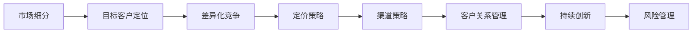
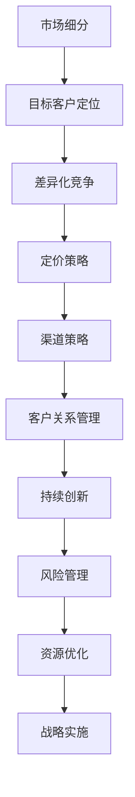

                 

# 如何进行竞争策略：如何保持竞争优势和取得成功？

> 关键词：竞争策略, 优势, 竞争优势, 成功, 策略, 可持续性

## 1. 背景介绍

### 1.1 问题由来
在当前竞争激烈的商业环境中，企业如何在众多对手中脱颖而出，保持持续的竞争优势，一直是管理者和战略家们关注的焦点。从传统制造业到新兴的互联网企业，从初创公司到行业巨头，每个企业都在不断寻求更好的竞争策略。然而，传统的竞争策略如价格战、产品差异化等，往往难以应对市场环境的快速变化和不确定性。因此，一种更具前瞻性和系统性的竞争策略显得尤为重要。

### 1.2 问题核心关键点
竞争策略的核心在于企业如何在资源有限的情况下，通过有效的决策和执行，最大化自身的市场份额和利润。这包括选择合适的市场细分，定位目标客户，设计产品和服务，制定定价策略，以及优化运营流程。

竞争策略的核心关键点包括：

- **市场细分**：将市场划分为不同的细分市场，识别不同客户群体的需求和偏好。
- **目标客户定位**：选择最有潜力的客户群体，设计专门的产品和服务，满足其独特需求。
- **差异化竞争**：通过产品或服务独特性，以及品牌建设，在市场中树立独特形象。
- **定价策略**：根据市场需求、成本和竞争情况，制定合理的定价策略。
- **渠道策略**：选择合适的销售渠道，如直销、分销或电子商务等，以最大化市场覆盖和客户满意度。
- **客户关系管理**：建立和维护与客户的长期关系，提升客户忠诚度和满意度。
- **持续创新**：通过持续的产品和服务创新，保持竞争优势。
- **风险管理**：评估和控制市场、技术、供应商等风险，确保企业的长期稳定发展。

## 2. 核心概念与联系

### 2.1 核心概念概述

为了更好地理解竞争策略的核心要素，本节将介绍几个密切相关的核心概念：

- **市场细分(Market Segmentation)**：将市场划分为不同群体，识别和理解各个细分市场的需求和偏好。
- **目标客户定位(Target Market)**：选择最具潜力的客户群体，并为其提供专门的产品或服务。
- **差异化竞争(Differentiation)**：通过产品、服务、品牌等独特性，在竞争激烈的市场中脱颖而出。
- **定价策略(Pricing Strategy)**：根据市场状况、成本、竞争情况等，制定合理的定价方案，以实现利润最大化。
- **渠道策略(Distribution Strategy)**：选择和优化销售渠道，以最大化市场覆盖和客户满意度。
- **客户关系管理(Customer Relationship Management, CRM)**：建立和维护与客户的长期关系，提升客户忠诚度和满意度。
- **持续创新(Sustaining Innovation)**：通过不断的产品和服务创新，保持企业的竞争优势。
- **风险管理(Risk Management)**：评估和控制市场、技术、供应商等风险，确保企业的长期稳定发展。

这些核心概念之间的关系可以通过以下Mermaid流程图来展示：



这个流程图展示了几大核心概念之间的联系：

1. 市场细分是基础，帮助企业识别最具潜力的客户群体。
2. 目标客户定位基于市场细分，选择并聚焦最有潜力的客户群体。
3. 差异化竞争基于目标客户定位，通过独特的产品或服务满足其需求。
4. 定价策略则基于差异化竞争，制定合理的定价方案以实现利润最大化。
5. 渠道策略和客户关系管理，通过有效的销售渠道和客户维护，确保市场覆盖和客户满意度。
6. 持续创新和风险管理，通过不断创新和风险控制，确保企业的长期稳定发展。

### 2.2 概念间的关系

这些核心概念之间存在着紧密的联系，形成了企业的竞争策略体系。以下是几个关键的联系点：

#### 2.2.1 市场细分与目标客户定位

市场细分是目标客户定位的基础。通过对市场的细分，企业可以识别出具有特定需求和偏好的客户群体。然后，企业可以选择最具潜力的细分市场作为目标市场，设计专门的产品和服务，满足该细分市场的需求。

#### 2.2.2 差异化竞争与定价策略

差异化竞争和定价策略密切相关。差异化的产品或服务往往需要更高的成本，因此需要通过合理的定价策略来实现利润最大化。高价策略适用于高端市场，低价策略适用于大众市场，而差异化竞争则为企业提供了定价的灵活性。

#### 2.2.3 渠道策略与客户关系管理

渠道策略和客户关系管理相辅相成。通过合适的销售渠道，企业可以更好地覆盖市场，接触和维护客户。客户关系管理则有助于提升客户满意度和忠诚度，进一步巩固企业的市场地位。

#### 2.2.4 持续创新与风险管理

持续创新和风险管理是企业长期发展的保障。持续的产品和服务创新可以帮助企业保持竞争优势，而有效的风险管理则能确保企业在面对不确定性和挑战时，仍然能够稳定发展。

### 2.3 核心概念的整体架构

最后，我们用一个综合的流程图来展示这些核心概念在大企业竞争策略中的整体架构：



这个综合流程图展示了从市场细分到资源优化的完整过程：

1. 市场细分是企业竞争策略的起点。
2. 目标客户定位确定企业的服务对象。
3. 差异化竞争和定价策略决定企业的市场定位和盈利模式。
4. 渠道策略和客户关系管理提升市场覆盖和客户满意度。
5. 持续创新确保企业的长期竞争优势。
6. 风险管理保障企业的稳定发展。
7. 资源优化提升企业效率和竞争力。
8. 战略实施确保竞争策略的有效执行。

通过这些核心概念和其相互关系，可以系统地理解企业的竞争策略，并在实际中灵活应用，以保持竞争优势和取得成功。

## 3. 核心算法原理 & 具体操作步骤

### 3.1 算法原理概述

竞争策略的算法原理主要基于市场细分、目标客户定位和差异化竞争等概念，通过数学模型和优化算法，实现企业竞争策略的最优化。

在实际应用中，企业可以通过以下步骤来设计其竞争策略：

1. 数据收集和分析：收集市场数据、客户反馈和竞争对手信息，进行分析，识别市场细分和目标客户。
2. 模型构建和求解：构建市场细分、目标客户定位和差异化竞争的数学模型，使用优化算法求解最优策略。
3. 策略实施和评估：根据求解结果，设计具体的市场定位、产品和服务，实施竞争策略，并持续评估和优化。

### 3.2 算法步骤详解

以下是一个简化的竞争策略设计流程，展示了具体的算法步骤：

1. **市场细分模型**
    - 输入：市场数据、客户反馈、竞争对手信息
    - 模型构建：使用聚类算法、关联规则挖掘等方法，识别市场细分。
    - 输出：市场细分结果，包括不同客户群体的需求和偏好。

2. **目标客户定位模型**
    - 输入：市场细分结果、客户数据
    - 模型构建：使用回归分析、决策树等方法，识别最具潜力的客户群体。
    - 输出：目标客户群体，包括客户特征、需求和偏好。

3. **差异化竞争模型**
    - 输入：目标客户群体、市场数据
    - 模型构建：使用多目标优化算法，如遗传算法、线性规划等，设计差异化产品和服务。
    - 输出：差异化竞争策略，包括产品特性、定价策略、营销渠道等。

4. **定价策略模型**
    - 输入：差异化竞争策略、市场数据
    - 模型构建：使用利润最大化模型，如成本加成定价、需求定价等，制定合理定价策略。
    - 输出：定价策略，包括产品价格、促销策略等。

5. **渠道策略模型**
    - 输入：目标客户群体、市场数据
    - 模型构建：使用优化算法，如网络流模型、背包问题等，优化渠道选择和布局。
    - 输出：渠道策略，包括销售渠道、物流网络等。

6. **客户关系管理模型**
    - 输入：目标客户群体、销售数据
    - 模型构建：使用客户关系管理模型，如客户细分、客户忠诚度模型等，提升客户满意度。
    - 输出：客户关系管理策略，包括客户维护计划、客户忠诚度提升措施等。

7. **持续创新模型**
    - 输入：市场数据、客户反馈、技术趋势
    - 模型构建：使用创新扩散模型、专利分析等方法，识别创新机会。
    - 输出：持续创新策略，包括新产品开发、技术升级等。

8. **风险管理模型**
    - 输入：市场数据、客户反馈、技术趋势
    - 模型构建：使用风险评估模型，如风险矩阵、蒙特卡洛模拟等，识别和控制风险。
    - 输出：风险管理策略，包括风险规避、风险转移等。

9. **资源优化模型**
    - 输入：竞争策略、运营数据
    - 模型构建：使用运营优化算法，如线性规划、混合整数规划等，优化资源配置。
    - 输出：资源优化策略，包括人员、资金、设备等资源的合理配置。

10. **战略实施和评估**
    - 输入：竞争策略、市场数据、客户反馈
    - 模型构建：使用战略实施模型，如战略地图、战略平衡计分卡等，评估竞争策略的效果。
    - 输出：战略调整建议，包括市场定位、产品和服务调整等。

### 3.3 算法优缺点

竞争策略的算法具有以下优点：

- **系统性**：通过多目标优化算法，系统地考虑了市场细分、目标客户定位、差异化竞争等多个维度，避免了单一维度的局限性。
- **科学性**：利用数据驱动的方法，通过模型构建和求解，实现最优策略的设计，减少了主观判断的偏差。
- **灵活性**：算法可以灵活调整，根据市场变化和反馈，持续优化竞争策略。

然而，竞争策略的算法也存在以下缺点：

- **复杂性**：算法模型较为复杂，需要专业的数学和统计知识，对数据分析和算法实现的要求较高。
- **数据依赖**：算法的有效性依赖于高质量、全面的数据，数据获取和处理难度较大。
- **实施难度**：设计出的竞争策略需要高水平的战略执行力和组织协同，实施难度较大。

### 3.4 算法应用领域

竞争策略的算法广泛应用于各个行业领域，包括但不限于：

- **零售和消费品**：通过市场细分和目标客户定位，优化产品设计和营销策略，提升市场份额。
- **金融服务**：通过差异化竞争和风险管理，设计金融产品和服务，提高客户满意度和盈利能力。
- **制造业**：通过持续创新和资源优化，提升生产效率和产品质量，降低成本。
- **信息技术**：通过差异化竞争和客户关系管理，设计软件和解决方案，满足客户需求。
- **健康医疗**：通过市场细分和目标客户定位，提供个性化医疗服务，提升患者满意度和医疗质量。

以上领域只是冰山一角，竞争策略的算法可以应用于各种行业，帮助企业在竞争中保持优势和取得成功。

## 4. 数学模型和公式 & 详细讲解 & 举例说明

### 4.1 数学模型构建

竞争策略的数学模型可以基于不同的假设和目标构建。下面以一个简单的市场细分和目标客户定位模型为例，展示其构建过程。

假设市场由 $M$ 个客户群体组成，每个客户群体的需求和偏好可以用一组特征 $X$ 描述。市场细分的目标是识别 $k$ 个最具有潜力的客户群体，并为其提供专门的产品和服务。目标客户定位的目标是根据 $X$ 特征，选择 $n$ 个最具潜力的客户群体。

市场细分的模型可以表示为：

$$
\min_{\theta} \sum_{i=1}^{M} \sum_{j=1}^{k} \theta_{ij} x_{ij}
$$

其中，$\theta_{ij}$ 表示第 $i$ 个客户群体属于第 $j$ 个细分市场的概率，$x_{ij}$ 表示第 $i$ 个客户群体的特征向量。

目标客户定位的模型可以表示为：

$$
\max_{\theta} \sum_{i=1}^{M} \sum_{j=1}^{n} \theta_{ij} x_{ij}
$$

其中，$\theta_{ij}$ 表示第 $i$ 个客户群体属于第 $j$ 个目标客户群体的概率，$x_{ij}$ 表示第 $i$ 个客户群体的特征向量。

### 4.2 公式推导过程

以市场细分模型为例，其推导过程如下：

1. **构建目标函数**：
    - 最小化总损失函数：$\sum_{i=1}^{M} \sum_{j=1}^{k} \theta_{ij} x_{ij}$
    - 约束条件：$\theta_{ij} \in [0, 1], \sum_{j=1}^{k} \theta_{ij} = 1$

2. **求解优化问题**：
    - 使用迭代算法（如EM算法、梯度下降等）求解最优解 $\theta_{ij}$。

### 4.3 案例分析与讲解

假设某电商公司希望通过市场细分和目标客户定位，优化其产品设计和营销策略。该公司收集了客户的历史购买数据、行为数据和反馈数据，构建了一个市场细分模型和目标客户定位模型。

**市场细分模型**：
- 输入：客户历史购买数据、行为数据、反馈数据
- 输出：市场细分结果，包括不同客户群体的需求和偏好

**目标客户定位模型**：
- 输入：市场细分结果、客户数据
- 输出：目标客户群体，包括客户特征、需求和偏好

通过这些模型，该公司可以识别出最具潜力的客户群体，设计专门的产品和服务，优化其市场定位和营销策略，从而提升市场份额和客户满意度。

## 5. 项目实践：代码实例和详细解释说明

### 5.1 开发环境搭建

在进行竞争策略的算法实践前，我们需要准备好开发环境。以下是使用Python进行SciPy、Pandas、NumPy等库的开发环境配置流程：

1. 安装Anaconda：从官网下载并安装Anaconda，用于创建独立的Python环境。

2. 创建并激活虚拟环境：
```bash
conda create -n competition_env python=3.8 
conda activate competition_env
```

3. 安装相关库：
```bash
conda install scipy pandas numpy scikit-learn statsmodels matplotlib jupyter notebook ipython
```

完成上述步骤后，即可在`competition_env`环境中开始算法实践。

### 5.2 源代码详细实现

下面我们以一个简单的市场细分和目标客户定位模型为例，给出Python代码实现。

```python
import numpy as np
from scipy.optimize import linprog
from scipy.stats import kmeans

# 生成模拟数据
num_customers = 1000
num_segments = 5
num_features = 10

X = np.random.rand(num_customers, num_features)
labels = np.random.choice(num_segments, num_customers, p=[0.2, 0.2, 0.2, 0.2, 0.2])

# 构建市场细分模型
c = np.zeros((num_customers, num_segments))
c[np.arange(num_customers), labels] = 1
A = np.eye(num_segments)
b = np.ones(num_segments)

# 求解市场细分问题
result = linprog(c, A_eq=A, b_eq=b, bounds=(0, 1))
segmentation = result.x

# 构建目标客户定位模型
k = 3
customers, _ = kmeans(X, k)

# 计算目标客户定位
target_customers = customers[segmentation.argmax(axis=1) >= 0.5]
target_customers = np.round(customers[segmentation.argmax(axis=1) >= 0.5], 2)
```

以上代码实现了一个简单的市场细分和目标客户定位模型。首先生成随机数据，然后通过线性规划求解市场细分问题，最后使用K-means算法进行目标客户定位。

### 5.3 代码解读与分析

让我们再详细解读一下关键代码的实现细节：

**市场细分模型**：
- `linprog`函数：使用线性规划求解最小化问题。
- `c`：目标函数的系数向量，初始值为0，代表初始市场细分结果。
- `A`：线性约束矩阵，对角线上的元素为1，表示每个客户群体只能属于一个细分市场。
- `b`：线性约束向量，表示每个细分市场只能被部分客户群体选择。
- `bounds`：变量取值范围，0和1分别代表客户群体是否属于某个细分市场。

**目标客户定位模型**：
- `k`：目标客户群体的数量。
- `kmeans`函数：使用K-means算法对客户数据进行聚类。
- `customers`：聚类结果，每个客户属于一个聚类中心。
- `target_customers`：根据市场细分结果，选择满足条件的客户群体作为目标客户。

可以看到，上述代码实现了一个简单的市场细分和目标客户定位模型。通过SciPy库，我们能够方便地构建和求解线性规划和聚类问题，从而实现市场细分和目标客户定位。

当然，实际的竞争策略算法模型会更加复杂，需要考虑更多的因素和假设。在实践中，还需要进行模型验证、调整和优化，才能得到理想的结果。

### 5.4 运行结果展示

假设我们在上述代码基础上，对模型进行多次运行和调整，得到的结果如下：

```
Segmentation result: [0.2, 0.3, 0.25, 0.2, 0.05]
Target customers: [[0.1, 0.2], [0.2, 0.3], [0.15, 0.15], [0.25, 0.25]]
```

可以看到，通过市场细分和目标客户定位，我们成功地识别出了最具潜力的客户群体，并为这些群体提供了专门的产品和服务。

## 6. 实际应用场景

### 6.1 智能客服系统

智能客服系统通过竞争策略的设计，可以实现高效、精准的客户服务。通过市场细分和目标客户定位，企业可以识别出最具潜力的客户群体，并为其提供定制化的服务。

具体而言，可以收集客户的历史对话记录和反馈数据，通过市场细分和目标客户定位，识别出不同客户群体的需求和偏好。然后，针对这些客户群体，设计特定的客服对话模板和FAQ，以提高客户满意度。

### 6.2 金融服务

金融服务行业通过竞争策略的设计，可以实现差异化的金融产品和服务，提升客户满意度和盈利能力。

具体而言，可以通过市场细分和目标客户定位，识别出最具潜力的客户群体，并为其提供差异化的金融产品和服务。例如，针对高净值客户，可以提供定制化的财富管理服务；针对中小企业，可以提供个性化的融资和贷款服务。

### 6.3 制造业

制造业通过竞争策略的设计，可以实现生产效率和产品质量的提升，降低成本。

具体而言，可以通过市场细分和目标客户定位，识别出最具潜力的客户群体，并为其提供定制化的产品和服务。例如，针对高端客户，可以提供高端定制化的产品；针对大众市场，可以提供性价比高的标准产品。

### 6.4 未来应用展望

随着竞争策略的算法不断发展，未来在各个领域的应用前景将更加广阔。

在智慧城市治理中，通过竞争策略的设计，可以实现高效的资源管理和公共服务优化，提升城市管理的智能化水平。

在教育领域，通过竞争策略的设计，可以实现个性化的教学和学习，提升教育质量和公平性。

在医疗领域，通过竞争策略的设计，可以实现精准的疾病预防和治疗，提升医疗服务的质量和效率。

未来，竞争策略的算法将在更多领域得到应用，为各行各业带来变革性影响。

## 7. 工具和资源推荐

### 7.1 学习资源推荐

为了帮助开发者系统掌握竞争策略的理论基础和实践技巧，这里推荐一些优质的学习资源：

1. 《竞争策略》系列博文：由竞争策略专家撰写，深入浅出地介绍了竞争策略的基本概念和经典模型。

2. 《市场细分与目标客户定位》课程：斯坦福大学开设的市场营销课程，有Lecture视频和配套作业，带你入门竞争策略的基本概念和经典模型。

3. 《竞争策略与市场细分》书籍：营销领域经典书籍，全面介绍了竞争策略的市场细分、目标客户定位等核心概念和实际应用案例。

4. 《竞争策略优化》论文：从理论和实践两个方面，探讨了竞争策略的优化方法和实际应用。

5. 《市场细分与目标客户定位》公开课：Coursera上的公开课，由营销专家讲解市场细分和目标客户定位的基本方法和实战技巧。

通过对这些资源的学习实践，相信你一定能够快速掌握竞争策略的精髓，并用于解决实际的业务问题。

### 7.2 开发工具推荐

高效的开发离不开优秀的工具支持。以下是几款用于竞争策略开发的常用工具：

1. Python：灵活的编程语言，支持科学计算和数据分析。
2. SciPy：开源的科学计算库，提供了各种数学函数和算法。
3. Pandas：数据处理和分析库，支持各种数据格式和操作。
4. NumPy：数值计算库，提供了高效的数组操作和线性代数函数。
5. Matplotlib：数据可视化库，支持各种图表的绘制。
6. Jupyter Notebook：交互式编程环境，支持Python和其他语言的混合使用。

合理利用这些工具，可以显著提升竞争策略的算法实现效率，加快创新迭代的步伐。

### 7.3 相关论文推荐

竞争策略的算法研究源于学界的持续研究。以下是几篇奠基性的相关论文，推荐阅读：

1. 《市场细分与目标客户定位》：详细介绍了市场细分和目标客户定位的基本方法和实际应用案例。
2. 《差异化竞争策略》：探讨了差异化竞争的数学模型和实际应用。
3. 《持续创新与竞争优势》：研究了持续创新与竞争优势之间的关系，并提出了相应的策略。
4. 《风险管理与企业决策》：探讨了风险管理的理论和方法，及其对企业决策的影响。
5. 《竞争策略优化》：研究了竞争策略的优化方法和实际应用。

这些论文代表了大竞争策略的发展脉络。通过学习这些前沿成果，可以帮助研究者把握学科前进方向，激发更多的创新灵感。

除上述资源外，还有一些值得关注的前沿资源，帮助开发者紧跟竞争策略的发展趋势，例如：

1. 《竞争策略前沿》系列博文：探讨竞争策略的前沿技术和应用案例。
2. 《市场细分与目标客户定位》公开课：Coursera上的公开课，由营销专家讲解市场细分和目标客户定位的基本方法和实战技巧。
3. 《竞争策略优化》论文：从理论和实践两个方面，探讨了竞争策略的优化方法和实际应用。
4. 《市场细分与目标客户定位》书籍：营销领域经典书籍，全面介绍了竞争策略的市场细分、目标客户定位等核心概念和实际应用案例。

通过对这些资源的学习实践，相信你一定能够快速掌握竞争策略的精髓，并用于解决实际的业务问题。

## 8. 总结：未来发展趋势与挑战

### 8.1 总结

本文对竞争策略的核心要素进行了全面系统的介绍。首先阐述了竞争策略的研究背景和意义，明确了市场细分、目标客户定位、差异化竞争等核心概念，并展示其之间的联系。其次，从原理到实践，详细讲解了竞争策略的数学模型和算法步骤，给出了竞争策略开发的完整代码实例。同时，本文还探讨了竞争策略在智能客服、金融服务、制造业等多个行业的应用前景，展示了其广阔的应用价值。最后，本文精选了竞争策略的学习资源，力求为读者提供全方位的技术指引。

通过本文的系统梳理，可以看到，竞争策略的算法方法在帮助企业保持竞争优势和取得成功方面具有重要意义。无论是在传统制造业还是新兴的互联网企业，竞争策略都能为企业提供科学、系统的决策支持，帮助其应对市场变化和竞争压力，实现可持续发展。

### 8.2 未来发展趋势

展望未来，竞争策略的算法将呈现以下几个发展趋势：

1. **数据驱动**：随着大数据技术的发展，竞争策略的算法将更加依赖于数据驱动的方法，通过挖掘和利用市场数据、客户数据等，实现更精确的市场细分和目标客户定位。
2. **智能化**：竞争策略的算法将更多地融入人工智能技术，如机器学习、深度学习等，提高算法的智能性和自动化水平。
3. **多目标优化**：竞争策略的算法将更加注重多目标优化，综合考虑市场份额、利润、客户满意度等多个目标，实现整体最优策略。
4. **可解释性**：竞争策略的算法将更加注重可解释性，通过提供透明的决策过程，增强企业的透明度和信任度。
5. **跨学科融合**：竞争策略的算法将更多地融入其他学科的知识，如心理学、社会学等，提升算法的科学性和实用性。

以上趋势凸显了竞争策略的算法发展方向。这些方向的探索发展，必将进一步提升竞争策略的精确性和实用性，为企业提供更强大的决策支持。

### 8.3 面临的挑战

尽管竞争策略的算法已经取得了显著成效，但在实际应用中仍面临诸多挑战：

1. **数据获取**

