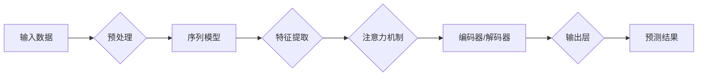

# 神经网络：自然语言处理的新突破

> 关键词：神经网络，自然语言处理，深度学习，预训练，序列模型，Transformer，BERT，NLP应用

## 1. 背景介绍

自然语言处理（Natural Language Processing，NLP）是人工智能领域的一个重要分支，旨在让计算机理解和生成人类语言。随着深度学习技术的兴起，神经网络在NLP领域取得了显著的突破，使得计算机能够更准确地理解和处理自然语言。本文将深入探讨神经网络在NLP领域的应用，分析其原理、技术和未来发展趋势。

## 2. 核心概念与联系

### 2.1 核心概念

#### 深度学习

深度学习是一种学习数据表示层次结构的方法，通过逐层抽象特征，从原始数据中提取更高层次的特征表示。在NLP领域，深度学习模型可以学习到文本的语义和语法结构，从而更好地理解和处理自然语言。

#### 神经网络

神经网络是深度学习的基础，由大量的神经元组成，通过前向传播和反向传播算法学习数据中的特征和规律。

#### 序列模型

序列模型是处理序列数据（如文本、语音等）的神经网络模型，通过学习序列中的时序依赖关系，捕捉数据中的动态特性。

#### Transformer

Transformer是近年来在NLP领域取得突破性的模型，它完全基于自注意力机制，能够捕捉序列中任意位置之间的依赖关系。

#### BERT

BERT（Bidirectional Encoder Representations from Transformers）是Google提出的一种预训练语言模型，它通过预训练学习到通用的语言表示，并在下游任务中表现出色。

### 2.2 架构的 Mermaid 流程图



## 3. 核心算法原理 & 具体操作步骤

### 3.1 算法原理概述

神经网络在NLP领域的应用主要包括以下几个步骤：

1. **输入数据预处理**：将文本数据转换为模型可接受的格式，如分词、词性标注等。
2. **特征提取**：使用神经网络提取文本中的特征，如词向量、词性向量等。
3. **注意力机制**：通过注意力机制捕捉序列中不同位置之间的关系。
4. **编码器/解码器**：使用编码器将输入序列编码为固定长度的表示，使用解码器将编码后的表示解码为输出序列。
5. **输出层**：根据编码器的输出进行预测，如分类、情感分析等。

### 3.2 算法步骤详解

1. **数据预处理**：对文本数据进行分词、词性标注、去停用词等操作，将文本转换为词向量。
2. **特征提取**：使用循环神经网络（RNN）、卷积神经网络（CNN）或Transformer等模型提取文本特征。
3. **注意力机制**：使用自注意力或互注意力机制捕捉序列中不同位置之间的关系。
4. **编码器/解码器**：使用编码器对输入序列进行编码，使用解码器对编码后的表示进行解码。
5. **输出层**：根据解码器的输出进行预测，如分类、情感分析等。

### 3.3 算法优缺点

#### 优点

- **强大的特征提取能力**：神经网络能够从文本中提取丰富的特征，从而提高NLP任务的性能。
- **灵活性和泛化能力**：神经网络可以通过调整参数和结构来适应不同的NLP任务，具有较好的泛化能力。
- **可解释性**：神经网络可以通过可视化技术来解释其决策过程。

#### 缺点

- **训练成本高**：神经网络需要大量的数据和计算资源进行训练。
- **参数调优困难**：神经网络的参数调优过程复杂，需要大量的实验和经验。
- **可解释性差**：神经网络的决策过程往往难以解释。

### 3.4 算法应用领域

神经网络在NLP领域的应用非常广泛，包括：

- **文本分类**：如情感分析、主题分类等。
- **文本摘要**：如自动文摘、摘要生成等。
- **机器翻译**：如自动翻译、机器翻译等。
- **命名实体识别**：如人名识别、地名识别等。
- **问答系统**：如机器问答、知识图谱问答等。

## 4. 数学模型和公式 & 详细讲解 & 举例说明

### 4.1 数学模型构建

神经网络在NLP领域的数学模型主要包括以下几个部分：

- **输入层**：表示输入数据，如文本数据。
- **隐藏层**：包含多个神经元，用于提取特征和进行计算。
- **输出层**：表示输出结果，如分类标签。

### 4.2 公式推导过程

以下以一个简单的神经网络为例，介绍其数学模型的构建和公式推导过程。

#### 输入层

输入层表示输入数据，如文本数据。

$$
X = (x_1, x_2, \ldots, x_n)
$$

其中 $x_i$ 表示第 $i$ 个输入数据。

#### 隐藏层

隐藏层包含多个神经元，用于提取特征和进行计算。

$$
h = f(W \cdot X + b)
$$

其中 $W$ 表示权重矩阵，$b$ 表示偏置向量，$f$ 表示激活函数。

#### 输出层

输出层表示输出结果，如分类标签。

$$
y = g(W' \cdot h + b')
$$

其中 $W'$ 表示权重矩阵，$b'$ 表示偏置向量，$g$ 表示激活函数。

### 4.3 案例分析与讲解

以下以文本分类任务为例，介绍神经网络在NLP领域的应用。

假设我们有一个情感分析的任务，输入为文本数据，输出为情感标签（正面、负面）。

首先，将文本数据转换为词向量。

然后，使用神经网络提取文本特征。

接下来，使用自注意力机制捕捉序列中不同位置之间的关系。

最后，根据解码器的输出进行预测，得到情感标签。

## 5. 项目实践：代码实例和详细解释说明

### 5.1 开发环境搭建

在进行神经网络在NLP领域的项目实践之前，我们需要搭建开发环境。

1. 安装Python：从官网下载并安装Python。
2. 安装PyTorch：从官网下载并安装PyTorch。
3. 安装transformers库：使用pip安装transformers库。

### 5.2 源代码详细实现

以下是一个简单的文本分类任务的实现示例：

```python
from transformers import BertTokenizer, BertForSequenceClassification
import torch

# 加载预训练模型和分词器
tokenizer = BertTokenizer.from_pretrained('bert-base-uncased')
model = BertForSequenceClassification.from_pretrained('bert-base-uncased')

# 加载数据
train_texts = ["I love this product", "I hate this product"]
train_labels = [1, 0]

# 编码数据
encodings = tokenizer(train_texts, truncation=True, padding=True)

# 训练模型
model.train()
optimizer = torch.optim.AdamW(model.parameters(), lr=1e-5)

for epoch in range(3):
    model.zero_grad()
    outputs = model(**encodings, labels=train_labels)
    loss = outputs.loss
    loss.backward()
    optimizer.step()
    print(f"Epoch {epoch+1}, Loss: {loss.item()}")

# 预测
model.eval()
with torch.no_grad():
    outputs = model(**encodings)
    predictions = outputs.logits.argmax(dim=1)
    print(f"Predictions: {predictions}")
```

### 5.3 代码解读与分析

以上代码展示了使用PyTorch和transformers库进行文本分类任务的简单实现。

首先，加载预训练模型和分词器。

然后，加载训练数据并编码。

接下来，定义优化器并训练模型。

最后，对新的文本数据进行预测。

## 6. 实际应用场景

神经网络在NLP领域的实际应用场景非常广泛，以下是一些典型的应用：

- **文本分类**：如情感分析、主题分类等。
- **文本摘要**：如自动文摘、摘要生成等。
- **机器翻译**：如自动翻译、机器翻译等。
- **命名实体识别**：如人名识别、地名识别等。
- **问答系统**：如机器问答、知识图谱问答等。

### 6.4 未来应用展望

随着深度学习技术的不断发展，神经网络在NLP领域的应用前景非常广阔。以下是一些未来可能的应用方向：

- **跨语言NLP**：实现跨语言的自然语言理解、翻译和生成。
- **多模态NLP**：将文本与其他模态（如图像、视频）进行融合，实现更加丰富的自然语言处理能力。
- **可解释性NLP**：提高神经网络的解释性，使其决策过程更加透明。

## 7. 工具和资源推荐

### 7.1 学习资源推荐

- 《深度学习》
- 《Python深度学习》
- 《自然语言处理与深度学习》
- Hugging Face官网
- PyTorch官网

### 7.2 开发工具推荐

- PyTorch
- TensorFlow
- Hugging Face Transformers库

### 7.3 相关论文推荐

- "Attention is All You Need"
- "BERT: Pre-training of Deep Bidirectional Transformers for Language Understanding"
- "Generative Language Models for Text Classification"

## 8. 总结：未来发展趋势与挑战

### 8.1 研究成果总结

神经网络在NLP领域的应用取得了显著的成果，使得计算机能够更准确地理解和处理自然语言。未来，随着深度学习技术的不断发展，神经网络在NLP领域的应用将会更加广泛。

### 8.2 未来发展趋势

- **更强大的模型**：开发更强大的神经网络模型，如多模态模型、可解释性模型等。
- **更丰富的应用场景**：将神经网络应用于更多领域，如医疗、金融等。
- **更高效的方法**：开发更高效的训练和推理方法，降低计算成本。

### 8.3 面临的挑战

- **数据质量**：提高数据质量，确保数据的准确性和多样性。
- **计算资源**：提高计算资源，以满足大规模模型的训练和推理需求。
- **可解释性**：提高神经网络的解释性，使其决策过程更加透明。

### 8.4 研究展望

未来，神经网络在NLP领域的应用将会更加深入，为人类带来更加智能的自然语言处理服务。

---

作者：禅与计算机程序设计艺术 / Zen and the Art of Computer Programming