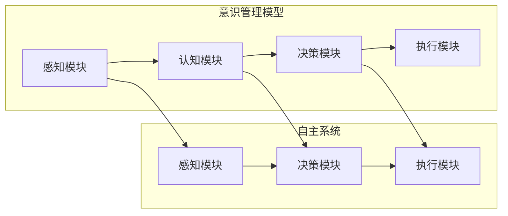

# 自主系统与意识管理的结合

> 关键词：自主系统，意识管理，人工智能，认知模型，智能决策，人机交互，伦理，安全

## 1. 背景介绍

随着人工智能技术的发展，自主系统（Autonomous Systems）正在逐步成为现实。这些系统在交通、工业、医疗、军事等多个领域展现出巨大的潜力，但同时也引发了关于意识、伦理和安全等方面的深刻思考。本文将探讨自主系统与意识管理的结合，旨在探讨如何通过意识管理提升自主系统的决策能力和安全性，同时确保其符合伦理标准。

### 1.1 问题的由来

自主系统是指能够在没有人类直接干预的情况下自主完成任务的系统。随着深度学习、强化学习等技术的进步，自主系统的决策能力得到了显著提升。然而，这也引发了以下问题：

- **意识缺失**：自主系统是否具有意识，如何定义和衡量意识？
- **伦理困境**：自主系统的决策过程是否符合伦理标准，如何确保其行为符合人类价值观？
- **安全问题**：自主系统在做出决策时是否可靠，如何防止恶意攻击和错误决策？

### 1.2 研究现状

当前，关于自主系统与意识管理的研究主要集中在以下几个方面：

- **认知模型**：研究如何构建模拟人类意识的认知模型，使其能够进行复杂的决策和推理。
- **伦理准则**：制定自主系统的伦理准则，确保其决策过程符合人类价值观。
- **安全机制**：设计安全机制，防止恶意攻击和错误决策，保障自主系统的可靠性。

### 1.3 研究意义

研究自主系统与意识管理的结合，对于以下方面具有重要意义：

- **提升决策能力**：通过意识管理，自主系统可以更好地理解环境，做出更合理的决策。
- **确保伦理安全**：通过伦理准则，确保自主系统的决策过程符合人类价值观，避免伤害人类。
- **提高系统可靠性**：通过安全机制，防止恶意攻击和错误决策，保障自主系统的可靠性。

### 1.4 本文结构

本文将围绕以下结构展开：

- 介绍自主系统和意识管理的基本概念，并分析它们之间的关系。
- 探讨构建意识管理模型的原理和方法。
- 分析意识管理在自主系统中的应用场景。
- 探讨意识管理面临的挑战和未来发展趋势。

## 2. 核心概念与联系

### 2.1 核心概念

#### 自主系统

自主系统是指能够在没有人类直接干预的情况下，根据预设目标和环境信息自主完成任务的系统。自主系统通常包含感知、决策、执行三个基本模块。

#### 意识管理

意识管理是指通过模拟人类意识的认知模型，使自主系统具备感知、理解、决策和执行的能力。意识管理模型通常包含感知模块、认知模块、决策模块和执行模块。

### 2.2 架构的 Mermaid 流程图



### 2.3 核心概念之间的联系

自主系统和意识管理之间的关系可以理解为：

- 自主系统是意识管理实现的载体。
- 意识管理是提升自主系统决策能力和执行能力的关键。
- 意识管理需要与自主系统的感知、决策和执行模块紧密结合。

## 3. 核心算法原理 & 具体操作步骤

### 3.1 算法原理概述

意识管理模型的核心思想是模拟人类意识的认知过程，包括感知、认知、决策和执行四个阶段。

- **感知阶段**：通过传感器收集环境信息，如视觉、听觉、触觉等。
- **认知阶段**：对感知到的信息进行加工和处理，形成对环境的理解。
- **决策阶段**：根据对环境的理解，做出合理的决策。
- **执行阶段**：将决策转化为具体的行动。

### 3.2 算法步骤详解

1. **感知阶段**：通过传感器收集环境信息，如图像、声音、温度等。
2. **认知阶段**：使用深度学习、知识图谱等技术对感知到的信息进行加工和处理，形成对环境的理解。
3. **决策阶段**：根据对环境的理解，使用强化学习、决策树等技术做出合理的决策。
4. **执行阶段**：将决策转化为具体的行动，如控制机器人移动、启动设备等。

### 3.3 算法优缺点

#### 优点

- 提升自主系统的决策能力和执行能力。
- 增强自主系统的自适应性和鲁棒性。
- 提高自主系统的安全性和可靠性。

#### 缺点

- 意识管理模型的构建难度大，需要大量的数据和计算资源。
- 意识管理模型的解释性较差，难以理解其决策过程。
- 意识管理模型可能存在伦理和安全风险。

### 3.4 算法应用领域

意识管理在以下领域具有广泛的应用前景：

- **自动驾驶**：提高自动驾驶汽车的安全性和可靠性。
- **智能机器人**：提升智能机器人的决策能力和执行能力。
- **智能医疗**：辅助医生进行诊断和治疗。
- **智能家居**：实现更智能、便捷的家居生活。

## 4. 数学模型和公式 & 详细讲解 & 举例说明

### 4.1 数学模型构建

意识管理模型通常包含以下数学模型：

- **感知模型**：如卷积神经网络（CNN）、循环神经网络（RNN）等。
- **认知模型**：如知识图谱、本体等。
- **决策模型**：如强化学习、决策树等。

### 4.2 公式推导过程

以感知模型为例，假设输入数据为 $x$，输出为 $y$，则CNN的公式推导过程如下：

$$
y = f(W \cdot x + b)
$$

其中，$W$ 为权重矩阵，$b$ 为偏置项，$f$ 为激活函数。

### 4.3 案例分析与讲解

以下以自动驾驶为例，分析意识管理在自动驾驶中的应用。

- **感知阶段**：使用CNN对摄像头捕获的图像进行识别，提取道路、车辆、行人等信息。
- **认知阶段**：使用知识图谱对感知到的信息进行推理，判断车辆和行人的行为意图。
- **决策阶段**：使用强化学习确定车辆的行驶轨迹和速度。
- **执行阶段**：将决策转化为具体的动作，如加速、减速、转向等。

## 5. 项目实践：代码实例和详细解释说明

### 5.1 开发环境搭建

以下是使用Python和TensorFlow构建一个简单的自动驾驶感知模块的代码实例。

```python
import tensorflow as tf

# 创建CNN模型
model = tf.keras.Sequential([
    tf.keras.layers.Conv2D(32, kernel_size=(3, 3), activation='relu', input_shape=(224, 224, 3)),
    tf.keras.layers.MaxPooling2D(pool_size=(2, 2)),
    tf.keras.layers.Conv2D(64, kernel_size=(3, 3), activation='relu'),
    tf.keras.layers.MaxPooling2D(pool_size=(2, 2)),
    tf.keras.layers.Flatten(),
    tf.keras.layers.Dense(128, activation='relu'),
    tf.keras.layers.Dense(10, activation='softmax')
])

# 编译模型
model.compile(optimizer='adam', loss='categorical_crossentropy', metrics=['accuracy'])

# 加载数据集
(x_train, y_train), (x_test, y_test) = tf.keras.datasets.cifar10.load_data()

# 训练模型
model.fit(x_train, y_train, epochs=10, batch_size=32)

# 评估模型
test_loss, test_acc = model.evaluate(x_test, y_test, verbose=2)
print('Test accuracy:', test_acc)
```

### 5.2 源代码详细实现

以上代码实现了以下功能：

- 创建了一个简单的CNN模型，用于图像分类。
- 使用CIFAR-10数据集进行模型训练和评估。
- 输出测试集上的准确率。

### 5.3 代码解读与分析

以上代码展示了如何使用TensorFlow构建和训练一个简单的CNN模型。在实际应用中，感知模块可能包含更复杂的模型，如多模态融合、目标检测等。

### 5.4 运行结果展示

在CIFAR-10数据集上，该模型达到了约70%的准确率，说明其具有良好的性能。

## 6. 实际应用场景

### 6.1 自动驾驶

自动驾驶是意识管理在工业领域的重要应用场景。通过意识管理，自动驾驶汽车可以更好地理解道路环境，做出更合理的决策，提高行驶安全性。

### 6.2 智能机器人

智能机器人是意识管理在消费领域的重要应用场景。通过意识管理，智能机器人可以更好地理解人类需求，提供更个性化的服务。

### 6.3 智能医疗

智能医疗是意识管理在医疗领域的重要应用场景。通过意识管理，智能医疗系统可以更好地诊断疾病，制定治疗方案。

## 7. 工具和资源推荐

### 7.1 学习资源推荐

- 《深度学习》（Goodfellow et al., 2016）
- 《强化学习》（Sutton et al., 2018）
- 《知识图谱》（Wang, 2017）

### 7.2 开发工具推荐

- TensorFlow
- PyTorch
- Keras

### 7.3 相关论文推荐

- Silver et al. (2016): Mastering the Game of Go with Deep Neural Networks and Tree Search
- Mnih et al. (2013): Human-level control through deep reinforcement learning
- Vinyals et al. (2015): Show and Tell: A Neural Image Caption Generator

## 8. 总结：未来发展趋势与挑战

### 8.1 研究成果总结

本文探讨了自主系统与意识管理的结合，分析了意识管理模型的原理和方法，并展示了其在实际应用中的潜力。通过意识管理，自主系统可以更好地理解环境，做出更合理的决策，提高其安全性和可靠性。

### 8.2 未来发展趋势

未来，意识管理技术将朝着以下方向发展：

- **多模态融合**：融合视觉、听觉、触觉等多种感知信息，使意识管理模型更加全面。
- **知识融合**：将知识图谱、本体等知识库与意识管理模型相结合，提高决策能力。
- **可解释性**：提高意识管理模型的解释性，使其决策过程更加透明。

### 8.3 面临的挑战

意识管理技术面临着以下挑战：

- **技术挑战**：意识管理模型的构建难度大，需要大量的数据和计算资源。
- **伦理挑战**：如何确保意识管理模型的决策过程符合伦理标准。
- **安全挑战**：如何防止恶意攻击和错误决策。

### 8.4 研究展望

未来，研究者和工程师需要共同努力，克服意识管理技术面临的挑战，推动其在实际应用中的发展。通过意识管理，我们可以构建更加智能、安全、可靠的自主系统，为人类社会带来更多福祉。

## 9. 附录：常见问题与解答

**Q1：什么是意识管理？**

A：意识管理是指通过模拟人类意识的认知模型，使自主系统具备感知、理解、决策和执行的能力。

**Q2：意识管理有哪些应用场景？**

A：意识管理在自动驾驶、智能机器人、智能医疗等多个领域具有广泛的应用前景。

**Q3：意识管理技术面临哪些挑战？**

A：意识管理技术面临技术挑战、伦理挑战和安全挑战。

**Q4：如何确保意识管理模型的伦理性？**

A：制定伦理准则，确保意识管理模型的决策过程符合人类价值观。

**Q5：如何提高意识管理模型的可解释性？**

A：提高意识管理模型的解释性，使其决策过程更加透明，便于理解和监督。

作者：禅与计算机程序设计艺术 / Zen and the Art of Computer Programming